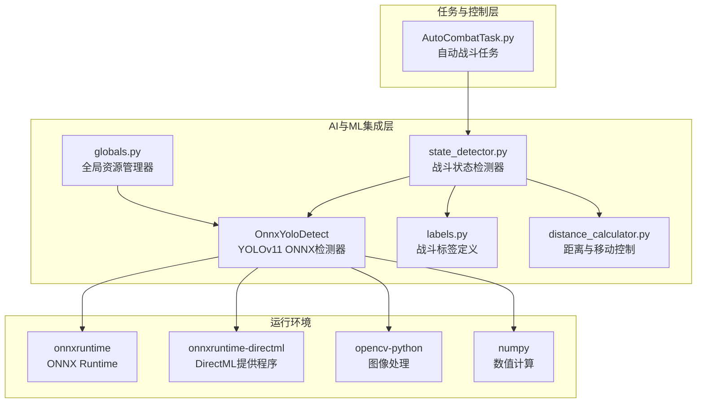
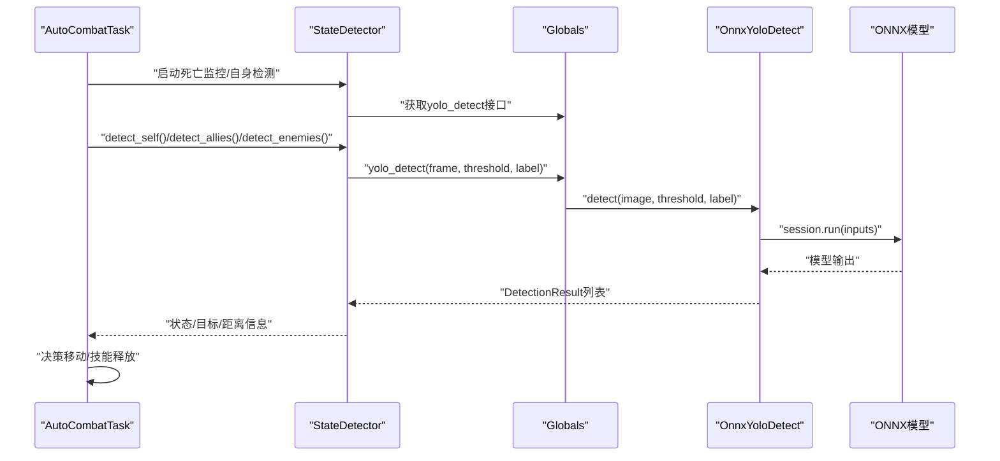
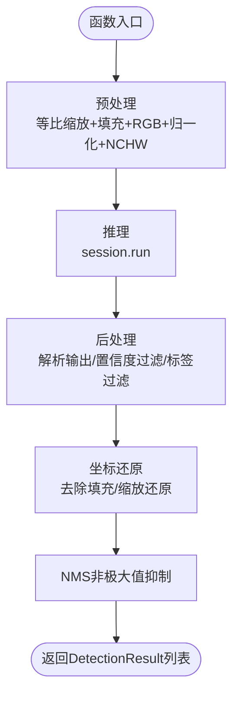
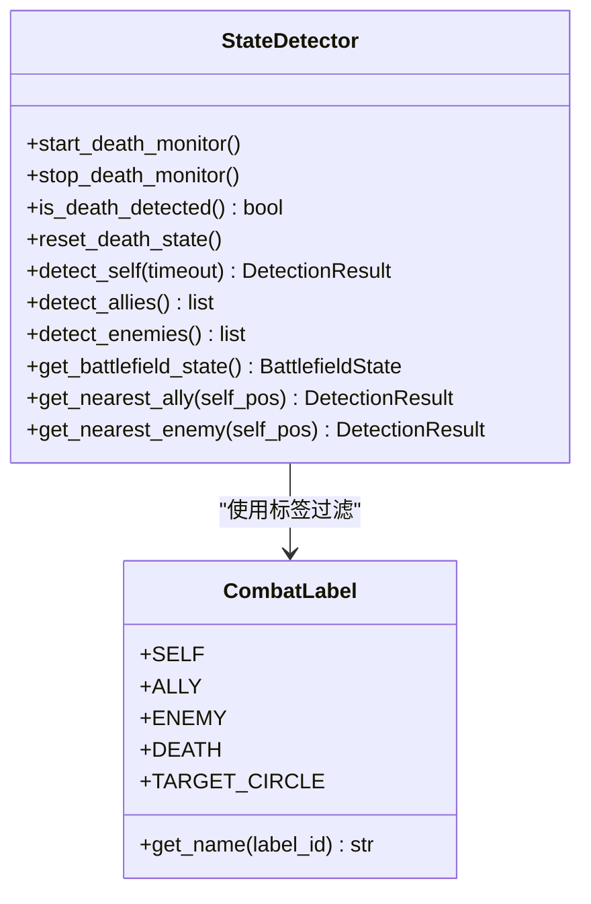
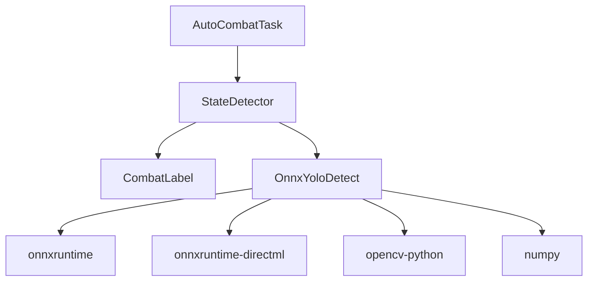

# AI与机器学习集成

<cite>
**本文引用的文件**
- [OnnxYoloDetect.py](file://src/OnnxYoloDetect.py)
- [labels.py](file://src/combat/labels.py)
- [state_detector.py](file://src/combat/state_detector.py)
- [distance_calculator.py](file://src/combat/distance_calculator.py)
- [globals.py](file://src/globals.py)
- [AutoCombatTask.py](file://src/task/AutoCombatTask.py)
- [requirements.txt](file://requirements.txt)
- [main.py](file://main.py)
- [coco_detection.json](file://assets/coco_detection.json)
</cite>

## 目录
1. [简介](#简介)
2. [项目结构](#项目结构)
3. [核心组件](#核心组件)
4. [架构总览](#架构总览)
5. [详细组件分析](#详细组件分析)
6. [依赖关系分析](#依赖关系分析)
7. [性能考量](#性能考量)
8. [故障排查指南](#故障排查指南)
9. [结论](#结论)
10. [附录](#附录)

## 简介
本文件面向OK-Jump项目中的AI与机器学习集成，重点围绕YOLOv11 ONNX模型在游戏自动战斗中的应用，系统性阐述以下内容：
- YOLO模型在游戏中的应用场景与标签体系（自己、友方、敌方、死亡、目标圈）
- ONNX Runtime的集成方式与GPU/CPU执行提供程序的选择策略
- 检测流程：模型加载、预处理、推理、后处理与NMS非极大值抑制
- 结果处理与状态判断：基于检测结果的距离计算与移动控制
- 性能优化建议与部署注意事项
- 准确性调优与常见问题排查

## 项目结构
OK-Jump采用模块化组织，AI与ML相关的核心代码集中在src目录下，主要文件与职责如下：
- src/OnnxYoloDetect.py：YOLOv11 ONNX检测器封装，负责模型加载、预处理、推理与后处理
- src/combat/labels.py：战斗检测标签常量定义与名称映射
- src/combat/state_detector.py：战斗状态检测器，封装死亡监控、自身检测、友方/敌方检测与状态判断
- src/combat/distance_calculator.py：距离计算与移动方向建议，含滞后效应与缓冲区机制
- src/globals.py：全局资源管理器，提供YOLO模型的延迟加载与统一检测入口
- src/task/AutoCombatTask.py：自动战斗任务，整合检测、状态判断与移动/技能控制
- requirements.txt：ONNX Runtime及其DirectML提供程序依赖
- assets/coco_detection.json：COCO格式标注样例（与UI元素相关，非战斗模型标注）
- main.py：应用入口，设备选择与启动补丁

**图表来源**
- [OnnxYoloDetect.py:17-67](file://src/OnnxYoloDetect.py#L17-L67)
- [labels.py:8-51](file://src/combat/labels.py#L8-L51)
- [state_detector.py:24-52](file://src/combat/state_detector.py#L24-L52)
- [distance_calculator.py:14-51](file://src/combat/distance_calculator.py#L14-L51)
- [globals.py:16-58](file://src/globals.py#L16-L58)
- [requirements.txt:10-11](file://requirements.txt#L10-L11)

**章节来源**
- [OnnxYoloDetect.py:1-315](file://src/OnnxYoloDetect.py#L1-L315)
- [labels.py:1-51](file://src/combat/labels.py#L1-L51)
- [state_detector.py:1-446](file://src/combat/state_detector.py#L1-L446)
- [distance_calculator.py:1-197](file://src/combat/distance_calculator.py#L1-L197)
- [globals.py:1-257](file://src/globals.py#L1-L257)
- [requirements.txt:1-14](file://requirements.txt#L1-L14)
- [main.py:1-107](file://main.py#L1-L107)

## 核心组件
- YOLOv11 ONNX检测器：封装模型加载、预处理、推理与后处理，支持置信度阈值与NMS IOU阈值配置，并自动尝试GPU加速（CUDAExecutionProvider）。
- 战斗标签体系：定义“自己、友方、敌方、死亡、目标圈”五类标签，提供名称映射与便捷查询。
- 战斗状态检测器：提供死亡状态并行监控、自身检测、友方/敌方检测、战场状态判断与最近目标选择。
- 距离计算器：基于最佳攻击距离范围与滞后效应，提供移动方向建议与单位向量计算。
- 全局资源管理器：延迟加载YOLO模型，提供统一的yolo_detect入口，便于跨模块调用。

**章节来源**
- [OnnxYoloDetect.py:17-67](file://src/OnnxYoloDetect.py#L17-L67)
- [labels.py:8-51](file://src/combat/labels.py#L8-L51)
- [state_detector.py:24-52](file://src/combat/state_detector.py#L24-L52)
- [distance_calculator.py:14-51](file://src/combat/distance_calculator.py#L14-L51)
- [globals.py:204-256](file://src/globals.py#L204-L256)

## 架构总览
YOLO检测在OK-Jump中的工作流如下：
- 应用通过全局资源管理器获取YOLO检测器实例（延迟加载）
- 任务在每帧中调用yolo_detect，传入当前帧图像与标签过滤参数
- 检测器执行预处理（等比缩放+填充+归一化）、推理与后处理（NMS）
- 检测结果被状态检测器用于判断战场状态与最近目标
- 距离计算器根据检测结果给出移动方向建议，驱动移动控制器与技能控制器

**图表来源**
- [globals.py:230-252](file://src/globals.py#L230-L252)
- [OnnxYoloDetect.py:234-258](file://src/OnnxYoloDetect.py#L234-L258)
- [state_detector.py:285-340](file://src/combat/state_detector.py#L285-L340)
- [AutoCombatTask.py:238-261](file://src/task/AutoCombatTask.py#L238-L261)

## 详细组件分析

### YOLOv11 ONNX检测器
- 模型加载：自动尝试CUDAExecutionProvider，回退至CPUExecutionProvider；获取输入/输出名称与形状，推断模型输入尺寸
- 预处理：按模型输入尺寸进行等比缩放，计算填充量并在短边填充固定色块，BGR转RGB，归一化并转换为NCHW格式
- 推理：使用session.run执行前向传播
- 后处理：解析输出为(框+类别分数)，按置信度阈值过滤，按标签过滤，还原到原图坐标，执行NMS去重
- NMS：按类别与IOU阈值进行非极大值抑制

**图表来源**
- [OnnxYoloDetect.py:68-108](file://src/OnnxYoloDetect.py#L68-L108)
- [OnnxYoloDetect.py:110-186](file://src/OnnxYoloDetect.py#L110-L186)
- [OnnxYoloDetect.py:188-232](file://src/OnnxYoloDetect.py#L188-L232)

**章节来源**
- [OnnxYoloDetect.py:17-315](file://src/OnnxYoloDetect.py#L17-L315)

### 战斗标签定义
- 标签ID与名称映射：SELF=0、ALLY=1、ENEMY=2、DEATH=3、TARGET_CIRCLE=4
- 提供便捷方法获取标签名称，便于日志与可视化

**章节来源**
- [labels.py:8-51](file://src/combat/labels.py#L8-L51)

### 战斗状态检测器
- 死亡状态并行监控：独立线程以高频检测死亡标签，使用连续检测计数避免误判，支持快速查询与重置
- 自身检测：在超时时间内持续检测自身标签，返回首个检测结果
- 友方/敌方检测：按标签过滤返回检测结果列表
- 战场状态判断：根据是否存在友方/敌方，返回四种状态之一
- 最近目标选择：基于距离计算器计算最近目标

**图表来源**
- [state_detector.py:24-52](file://src/combat/state_detector.py#L24-L52)
- [labels.py:8-51](file://src/combat/labels.py#L8-L51)

**章节来源**
- [state_detector.py:70-185](file://src/combat/state_detector.py#L70-L185)
- [state_detector.py:188-340](file://src/combat/state_detector.py#L188-L340)
- [state_detector.py:354-446](file://src/combat/state_detector.py#L354-L446)

### 距离计算器
- 最佳攻击距离范围与缓冲区：通过滞后效应避免在边界附近频繁切换
- 移动方向建议：根据距离返回“靠近/远离/停止”，并提供单位向量与反向向量
- 状态重置：切换目标时重置内部状态

**章节来源**
- [distance_calculator.py:14-197](file://src/combat/distance_calculator.py#L14-L197)

### 全局资源管理器与YOLO入口
- 延迟加载：首次调用时定位模型文件并创建检测器实例
- 统一入口：提供yolo_detect方法，捕获异常并返回空列表，避免崩溃
- 模型重置：释放检测器实例以释放内存

**章节来源**
- [globals.py:204-256](file://src/globals.py#L204-L256)

### 自动战斗任务集成
- 生命周期：初始化后台管理器、等待进入游戏、初始化控制器、启动死亡监控、进入主循环
- 主循环：死亡状态检测、自身检测、战场状态判断、最近目标选择、移动与技能控制
- 详细日志：可选输出检测结果、位置与距离信息

**章节来源**
- [AutoCombatTask.py:84-134](file://src/task/AutoCombatTask.py#L84-L134)
- [AutoCombatTask.py:197-271](file://src/task/AutoCombatTask.py#L197-L271)
- [AutoCombatTask.py:302-647](file://src/task/AutoCombatTask.py#L302-L647)

## 依赖关系分析
- ONNX Runtime：核心推理引擎，支持CPU与GPU（CUDA/DirectML）执行提供程序
- OpenCV与NumPy：图像预处理与数值计算
- 项目模块：任务层依赖状态检测器，状态检测器依赖标签与检测器，检测器依赖ONNX Runtime

**图表来源**
- [requirements.txt:10-11](file://requirements.txt#L10-L11)
- [OnnxYoloDetect.py:11-14](file://src/OnnxYoloDetect.py#L11-L14)
- [AutoCombatTask.py:21-29](file://src/task/AutoCombatTask.py#L21-L29)
- [state_detector.py:13](file://src/combat/state_detector.py#L13)

**章节来源**
- [requirements.txt:1-14](file://requirements.txt#L1-L14)
- [OnnxYoloDetect.py:11-14](file://src/OnnxYoloDetect.py#L11-L14)
- [AutoCombatTask.py:21-29](file://src/task/AutoCombatTask.py#L21-L29)
- [state_detector.py:13](file://src/combat/state_detector.py#L13)

## 性能考量
- 执行提供程序选择
  - 优先尝试CUDAExecutionProvider，若不可用则回退CPUExecutionProvider
  - 若需DirectML支持，确保安装onnxruntime-directml
- 输入尺寸与预处理
  - 按模型输入尺寸进行等比缩放与填充，避免失真
  - 预处理后转换为NCHW格式，减少后续维度操作
- 置信度与NMS阈值
  - 合理设置conf_threshold与iou_threshold，平衡召回率与误检
  - NMS有助于消除重复框，提升稳定性
- 线程与检测频率
  - 死亡状态监控线程以较高频率（如30ms）检测，降低误判
  - 主循环中根据需求调整检测频率，避免过度占用CPU/GPU
- 资源管理
  - 使用延迟加载与显式重置，避免长时间占用显存
  - 在任务退出时停止监控线程并释放资源

**章节来源**
- [OnnxYoloDetect.py:50-57](file://src/OnnxYoloDetect.py#L50-L57)
- [OnnxYoloDetect.py:110-186](file://src/OnnxYoloDetect.py#L110-L186)
- [state_detector.py:72-185](file://src/combat/state_detector.py#L72-L185)
- [globals.py:254-256](file://src/globals.py#L254-L256)

## 故障排查指南
- 依赖缺失
  - 症状：导入onnxruntime失败
  - 处理：安装onnxruntime与onnxruntime-directml
- 模型文件缺失
  - 症状：找不到fight.onnx
  - 处理：确认模型文件路径正确或放置于assets/Fight/
- 推理异常
  - 症状：yolo_detect抛出异常
  - 处理：全局捕获异常并返回空列表，检查输入图像格式与尺寸
- 死亡状态误判
  - 症状：频繁误报/漏报
  - 处理：提高threshold，增加连续检测计数阈值，检查目标遮挡与光照
- 性能不足
  - 症状：推理延迟高
  - 处理：启用GPU提供程序，降低输入尺寸或阈值，减少检测频率

**章节来源**
- [OnnxYoloDetect.py:42-43](file://src/OnnxYoloDetect.py#L42-L43)
- [globals.py:225-227](file://src/globals.py#L225-L227)
- [globals.py:247-252](file://src/globals.py#L247-L252)
- [state_detector.py:158-178](file://src/combat/state_detector.py#L158-L178)

## 结论
OK-Jump通过ONNX Runtime集成YOLOv11模型，实现了对游戏内单位与状态的实时检测。结合并行死亡监控、标签过滤与距离计算器，系统能够在复杂战场环境中做出快速而稳定的决策。通过合理配置执行提供程序、阈值与检测频率，可在保证准确性的同时获得良好的性能表现。

## 附录
- 模型训练与优化（通用建议）
  - 数据集：收集包含“自己、友方、敌方、死亡、目标圈”的标注数据，确保覆盖不同视角与光照条件
  - 数据增强：旋转、缩放、亮度/对比度扰动，提升泛化能力
  - 模型选择：YOLOv11具备较优精度与速度，可根据硬件选择合适规模
  - 推理优化：量化（INT8）、动态/静态形状绑定、TensorRT/ONNX-LLVM编译（视平台支持）
  - 部署：导出ONNX并验证不同提供程序（CPU/GPU/DirectML）性能
- 标注与评估
  - COCO格式标注样例位于assets/coco_detection.json，可作为UI元素标注参考
  - 战斗模型标注需遵循labels.py中的标签定义，确保训练与推理一致

**章节来源**
- [labels.py:8-51](file://src/combat/labels.py#L8-L51)
- [coco_detection.json:1-384](file://assets/coco_detection.json#L1-L384)