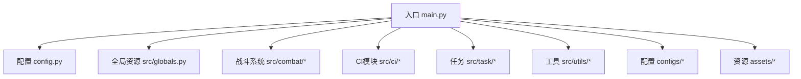
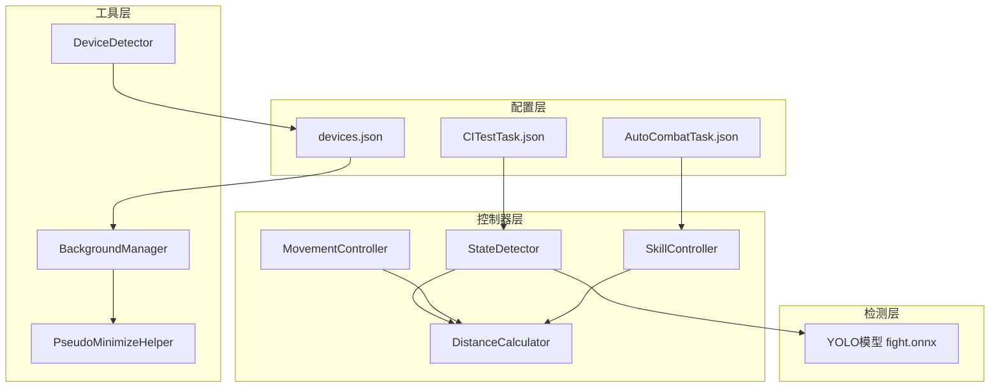
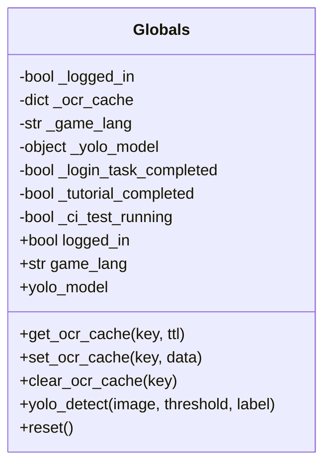
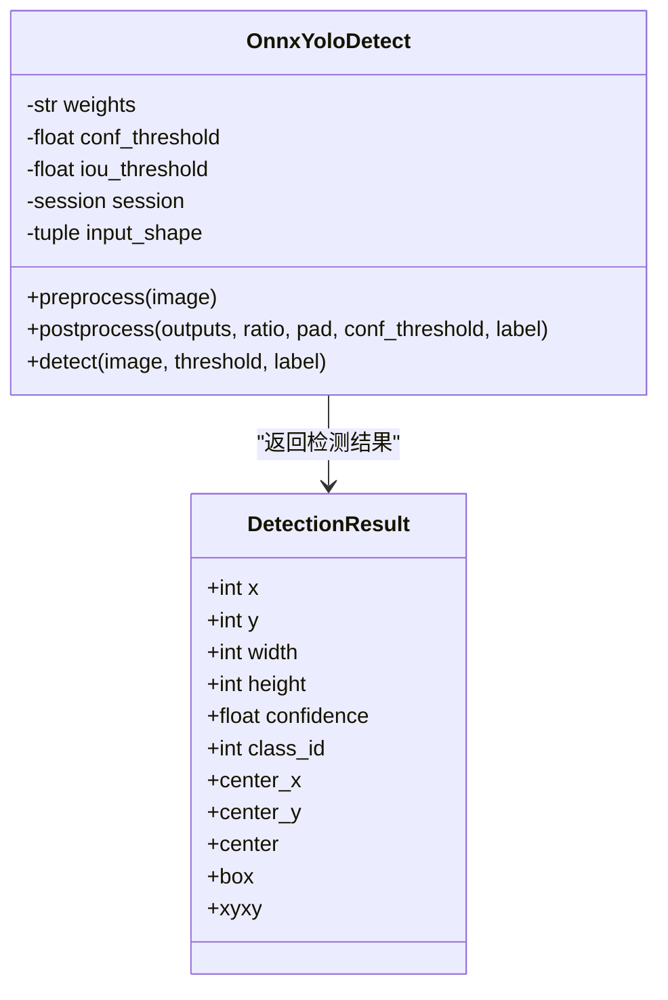
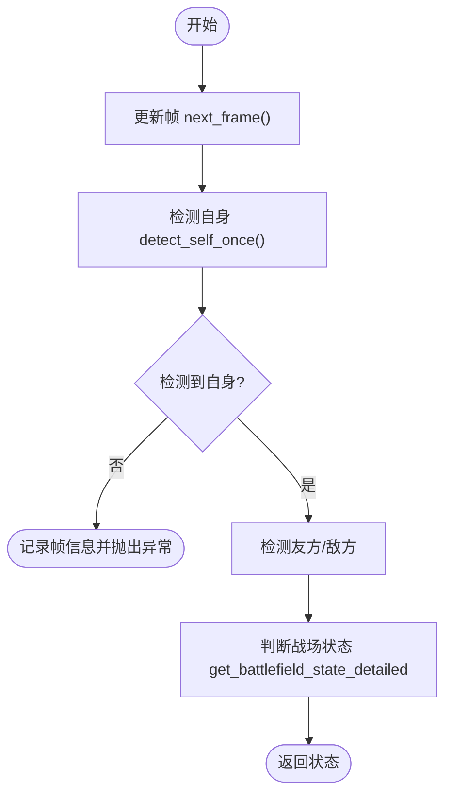
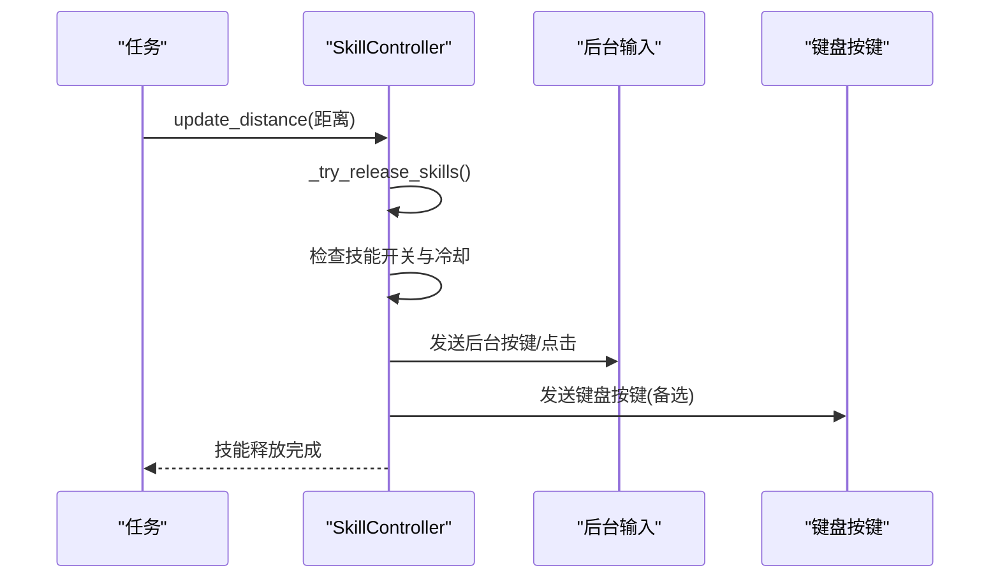
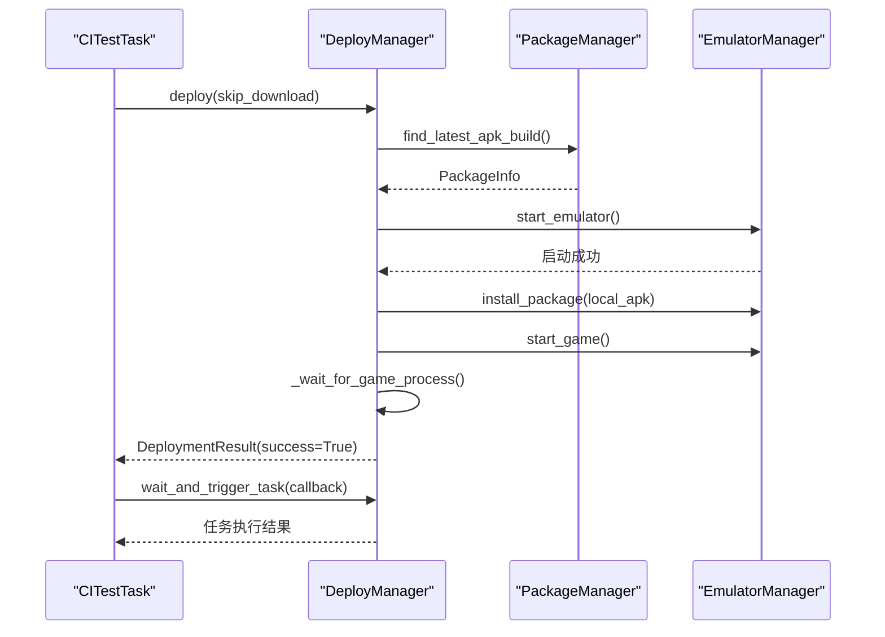
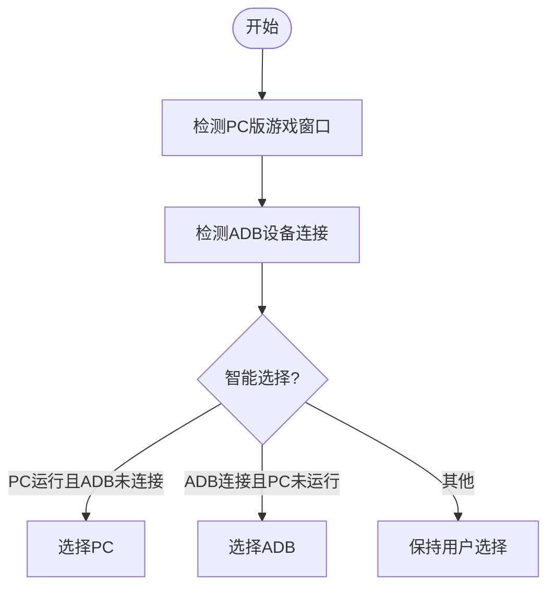
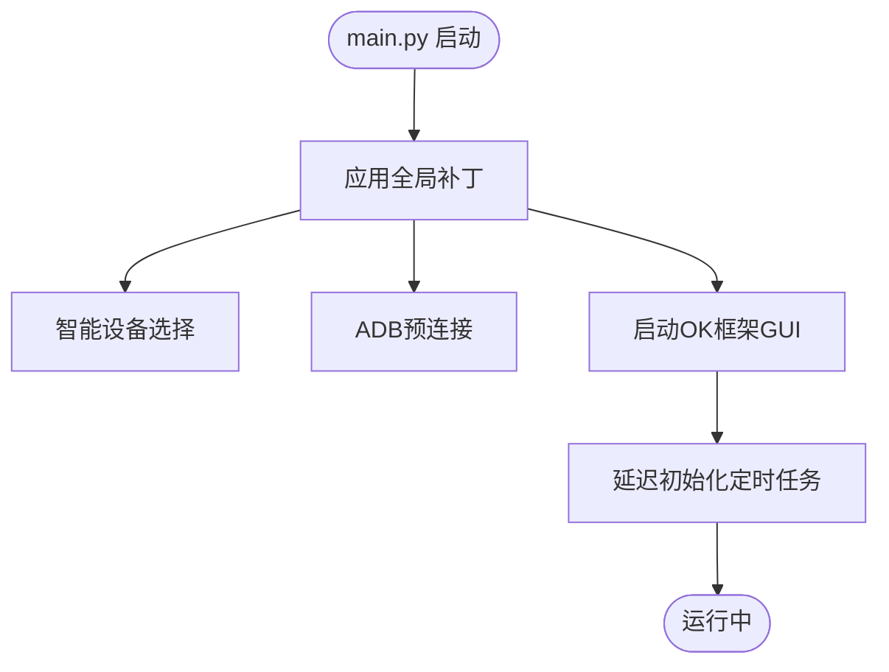
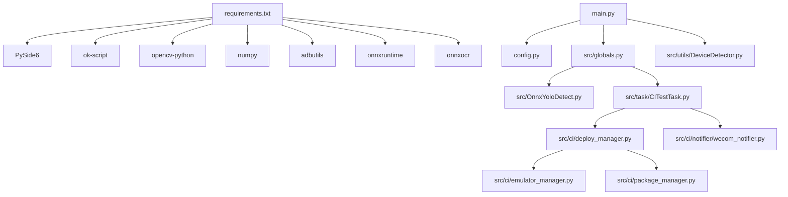

# AI辅助开发技能

<cite>
**本文档引用的文件**
- [README.md](file://README.md)
- [main.py](file://main.py)
- [config.py](file://config.py)
- [requirements.txt](file://requirements.txt)
- [src/globals.py](file://src/globals.py)
- [src/OnnxYoloDetect.py](file://src/OnnxYoloDetect.py)
- [src/combat/skill_controller.py](file://src/combat/skill_controller.py)
- [src/combat/state_detector.py](file://src/combat/state_detector.py)
- [src/combat/labels.py](file://src/combat/labels.py)
- [src/utils/DeviceDetector.py](file://src/utils/DeviceDetector.py)
- [src/ci/deploy_manager.py](file://src/ci/deploy_manager.py)
- [src/task/CITestTask.py](file://src/task/CITestTask.py)
- [configs/CITestTask.json](file://configs/CITestTask.json)
- [configs/devices.json](file://configs/devices.json)
- [configs/AutoCombatTask.json](file://configs/AutoCombatTask.json)
- [docs/自动战斗系统流程图.md](file://docs/自动战斗系统流程图.md)
</cite>

## 目录
1. [简介](#简介)
2. [项目结构](#项目结构)
3. [核心组件](#核心组件)
4. [架构总览](#架构总览)
5. [详细组件分析](#详细组件分析)
6. [依赖关系分析](#依赖关系分析)
7. [性能考虑](#性能考虑)
8. [故障排除指南](#故障排除指南)
9. [结论](#结论)
10. [附录](#附录)

## 简介
本项目是一个基于AI视觉识别的自动化测试与战斗辅助工具，主要面向游戏自动化场景，提供以下能力：
- 自动化CI流水线：从Jenkins下载APK、启动模拟器、安装并启动游戏、触发测试任务、收集结果与告警
- 智能战斗系统：基于YOLO目标检测的自动战斗、技能释放、移动控制与状态监控
- 后台模式支持：支持窗口最小化、伪最小化、后台静音等特性
- 设备智能选择：根据PC版与模拟器连接状态自动选择最优设备
- 日志与异常处理：完善的日志过滤、异常捕获与资源清理

## 项目结构
项目采用模块化组织，核心目录与职责如下：
- src：核心业务逻辑
  - ci：CI流水线相关（部署、测试、通知）
  - combat：战斗系统（状态检测、技能控制、移动控制）
  - utils：通用工具（设备检测、后台管理、截图等）
  - task：任务编排（登录、战斗、匹配、日常等）
  - gui：GUI扩展（日志面板等）
  - scene：场景管理
  - constants：常量定义
  - tutorial：新手教程
  - OnnxYoloDetect.py：YOLO目标检测封装
  - globals.py：全局资源管理器
- configs：配置文件（设备、任务、CI等）
- docs：系统设计与流程图文档
- scripts：脚本工具
- assets：资源文件（模型、图片等）

**图表来源**
- [main.py:1-693](file://main.py#L1-L693)
- [config.py:1-146](file://config.py#L1-L146)

**章节来源**
- [README.md:1-8](file://README.md#L1-L8)
- [main.py:1-693](file://main.py#L1-L693)
- [config.py:1-146](file://config.py#L1-L146)

## 核心组件
- 全局资源管理器：集中管理登录状态、OCR缓存、YOLO模型等全局资源，提供延迟加载与统一访问接口
- YOLO检测器：封装ONNXRuntime推理，支持多标签检测（自己、友方、敌方、死亡状态、目标圈）
- 战斗控制器：状态检测、移动控制、技能释放的协调器，支持后台模式与伪最小化
- CI部署管理器：从Jenkins下载APK、启动模拟器、安装游戏、触发测试任务并清理环境
- 设备检测器：智能检测PC版与模拟器ADB连接状态，自动选择最佳设备
- GUI与日志：基于ok-script框架的图形界面与日志面板

**章节来源**
- [src/globals.py:1-406](file://src/globals.py#L1-L406)
- [src/OnnxYoloDetect.py:1-315](file://src/OnnxYoloDetect.py#L1-L315)
- [src/combat/state_detector.py:1-589](file://src/combat/state_detector.py#L1-L589)
- [src/combat/skill_controller.py:1-589](file://src/combat/skill_controller.py#L1-L589)
- [src/ci/deploy_manager.py:1-428](file://src/ci/deploy_manager.py#L1-L428)
- [src/utils/DeviceDetector.py:1-149](file://src/utils/DeviceDetector.py#L1-L149)

## 架构总览
系统采用分层架构：
- 配置层：设备、任务、CI等配置
- 控制器层：状态检测、移动控制、技能控制、距离计算
- 工具层：后台管理、伪最小化、设备检测
- 检测层：YOLO模型推理
- 任务层：CI流水线、战斗任务、登录任务等

**图表来源**
- [docs/自动战斗系统流程图.md:1-297](file://docs/自动战斗系统流程图.md#L1-L297)
- [configs/devices.json:1-7](file://configs/devices.json#L1-L7)
- [configs/AutoCombatTask.json:1-14](file://configs/AutoCombatTask.json#L1-L14)
- [configs/CITestTask.json:1-29](file://configs/CITestTask.json#L1-L29)

## 详细组件分析

### 全局资源管理器（Globals）
- 职责：统一管理登录状态、OCR缓存、YOLO模型等全局资源
- 特性：延迟加载YOLO模型、缓存管理、CI状态跟踪、重置机制
- 使用：通过全局单例在各模块间共享状态与资源

**图表来源**
- [src/globals.py:16-406](file://src/globals.py#L16-L406)

**章节来源**
- [src/globals.py:1-406](file://src/globals.py#L1-L406)

### YOLO检测器（OnnxYoloDetect）
- 职责：封装ONNXRuntime推理，提供预处理、推理、后处理与NMS
- 特性：支持GPU/CPU执行提供器、输入尺寸适配、标签过滤、置信度阈值
- 应用：战斗状态检测、单位识别、目标圈检测

**图表来源**
- [src/OnnxYoloDetect.py:17-315](file://src/OnnxYoloDetect.py#L17-L315)

**章节来源**
- [src/OnnxYoloDetect.py:1-315](file://src/OnnxYoloDetect.py#L1-L315)

### 战斗状态检测器（StateDetector）
- 职责：基于YOLO检测自身、友方、敌方与死亡状态，提供战斗状态判断
- 特性：并行死亡监控线程、防抖动机制、同步/异步检测接口
- 应用：战斗状态切换、最近目标选择、战场状态判断

**图表来源**
- [src/combat/state_detector.py:198-447](file://src/combat/state_detector.py#L198-L447)

**章节来源**
- [src/combat/state_detector.py:1-589](file://src/combat/state_detector.py#L1-L589)

### 技能控制器（SkillController）
- 职责：根据配置与距离信息控制技能释放，支持独立冷却与后台模式
- 特性：独立技能冷却器、后台输入适配、手机端点击与键盘按键双通道
- 应用：自动普攻、技能1/2、大招的智能释放

**图表来源**
- [src/combat/skill_controller.py:279-354](file://src/combat/skill_controller.py#L279-L354)

**章节来源**
- [src/combat/skill_controller.py:1-589](file://src/combat/skill_controller.py#L1-L589)

### CI部署管理器（DeployManager）
- 职责：CI流水线的核心编排，负责APK下载、模拟器启动、安装、游戏启动与任务触发
- 特性：超时控制、进程检测、异常处理、清理机制
- 应用：自动化测试流水线的完整闭环

**图表来源**
- [src/ci/deploy_manager.py:123-308](file://src/ci/deploy_manager.py#L123-L308)

**章节来源**
- [src/ci/deploy_manager.py:1-428](file://src/ci/deploy_manager.py#L1-L428)

### 设备检测器（DeviceDetector）
- 职责：检测PC版游戏窗口与ADB设备连接状态，智能选择默认设备
- 特性：窗口标题关键词匹配、ADB设备检测、智能默认策略
- 应用：自动选择PC或模拟器作为目标设备

**图表来源**
- [src/utils/DeviceDetector.py:112-134](file://src/utils/DeviceDetector.py#L112-L134)

**章节来源**
- [src/utils/DeviceDetector.py:1-149](file://src/utils/DeviceDetector.py#L1-L149)

### 入口与配置（main.py, config.py）
- 入口：初始化全局补丁（日志、ADB连接、任务按钮、窗口位置检查）、智能设备选择、定时任务调度
- 配置：窗口、ADB、OCR、模板匹配、任务列表、自定义标签等全局配置

**图表来源**
- [main.py:659-693](file://main.py#L659-L693)

**章节来源**
- [main.py:1-693](file://main.py#L1-L693)
- [config.py:1-146](file://config.py#L1-L146)

## 依赖关系分析
- 运行时依赖：PySide6、ok-script、opencv、numpy、adbutils、onnxruntime、onnxocr等
- 模块依赖：globals与OnnxYoloDetect耦合紧密；combat模块依赖globals；ci模块依赖utils与task；GUI依赖ok框架

**图表来源**
- [requirements.txt:1-17](file://requirements.txt#L1-L17)
- [main.py:1-693](file://main.py#L1-L693)
- [config.py:1-146](file://config.py#L1-L146)

**章节来源**
- [requirements.txt:1-17](file://requirements.txt#L1-L17)

## 性能考虑
- YOLO推理：支持GPU/CPU执行提供器，输入尺寸固定为640x640，NMS抑制提升检测精度
- 战斗循环：主循环延迟优化至50ms，死亡检测频率提升至~20Hz，后台模式支持伪最小化
- 资源管理：全局资源延迟加载、缓存管理、线程安全的冷却计时器
- CI流水线：超时控制、进程检测、异常中断与清理机制

[本节为通用性能讨论，无需特定文件引用]

## 故障排除指南
- 日志过滤：屏蔽I/O错误、OCR负框警告、捕获模块进程不存在错误
- ADB连接：预期超时降级为DEBUG级别，其他错误降级为WARNING级别
- 任务停止：修复TaskButtons.stop_clicked导致的意外重启问题
- 设备选择：智能设备选择与跳过位置检查，支持最小化/屏幕外窗口
- CI异常：连续失败阈值、重试机制、最终截图保存与通知

**章节来源**
- [main.py:22-480](file://main.py#L22-L480)
- [src/utils/DeviceDetector.py:112-134](file://src/utils/DeviceDetector.py#L112-L134)
- [src/task/CITestTask.py:166-212](file://src/task/CITestTask.py#L166-L212)

## 结论
本项目通过模块化设计与AI视觉识别技术，实现了从CI自动化到游戏自动战斗的完整解决方案。其核心优势包括：
- 完整的CI流水线：从APK下载到测试执行与结果通知
- 高效的战斗系统：基于YOLO的实时状态检测与智能技能释放
- 稳定的运行保障：完善的日志过滤、异常处理与资源清理
- 用户体验优化：智能设备选择、后台模式、伪最小化等特性

[本节为总结性内容，无需特定文件引用]

## 附录
- 配置文件说明
  - devices.json：设备首选项、PC全路径、捕获方式、窗口句柄等
  - AutoCombatTask.json：战斗任务配置（技能开关、间隔、移动时长等）
  - CITestTask.json：CI任务配置（Jenkins地址、模拟器路径、ADB端口、Webhook等）
- 文档与流程图：自动战斗系统流程图详细描述了系统架构、初始化流程、主循环、状态处理、技能释放与后台模式等

**章节来源**
- [configs/devices.json:1-7](file://configs/devices.json#L1-L7)
- [configs/AutoCombatTask.json:1-14](file://configs/AutoCombatTask.json#L1-L14)
- [configs/CITestTask.json:1-29](file://configs/CITestTask.json#L1-L29)
- [docs/自动战斗系统流程图.md:1-297](file://docs/自动战斗系统流程图.md#L1-L297)