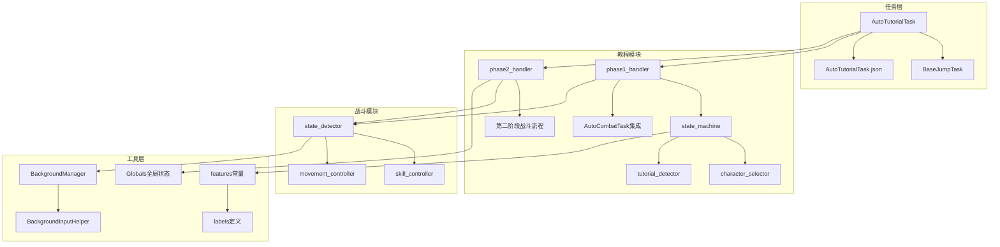
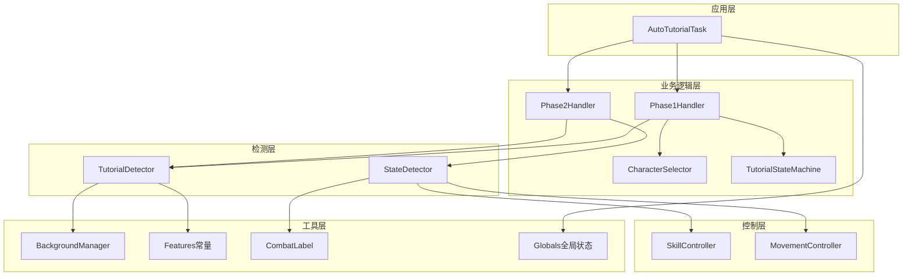
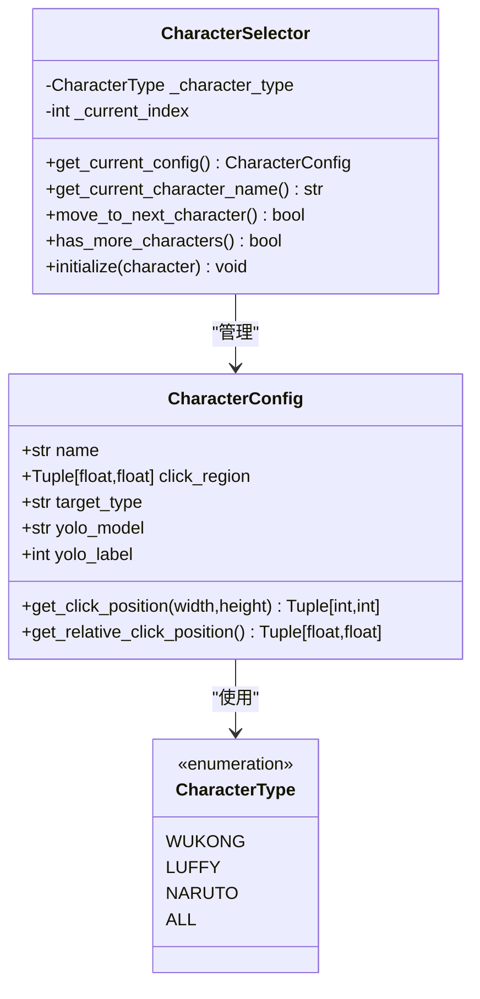
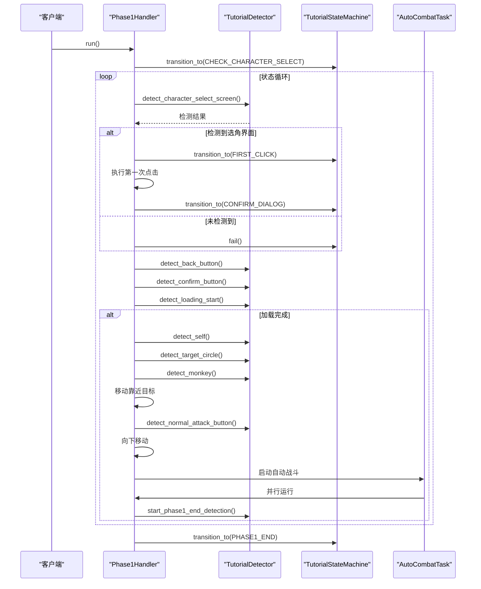
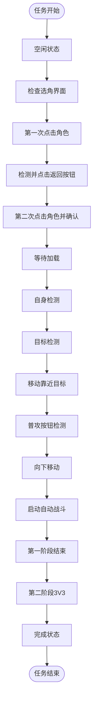
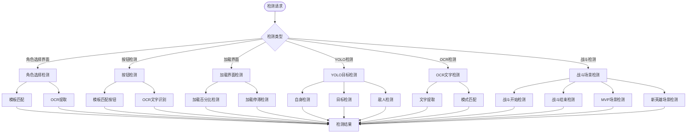
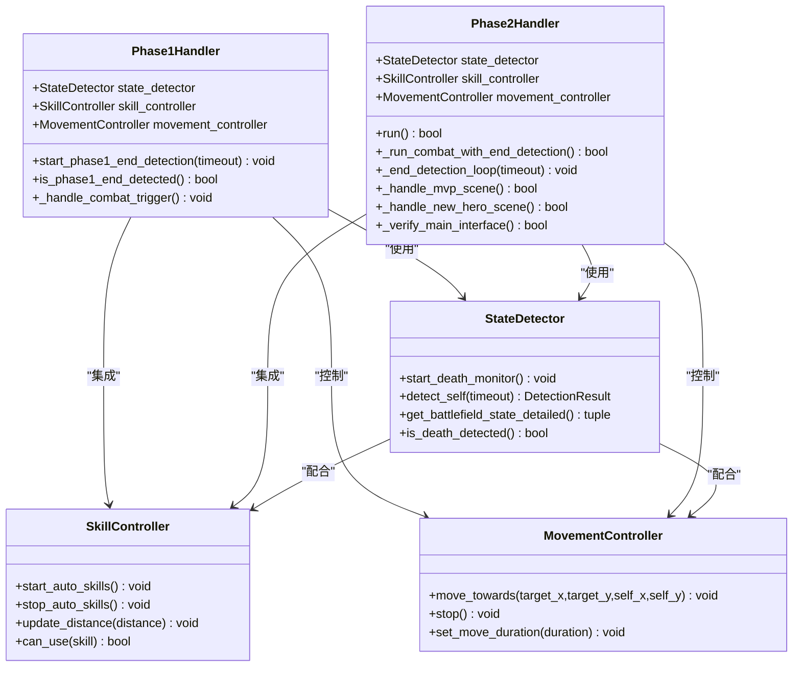
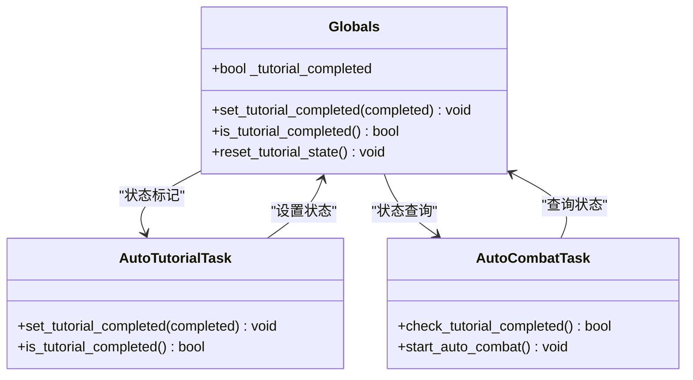
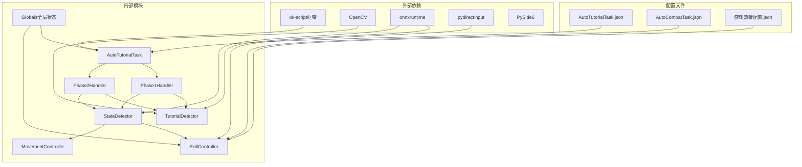

# 自动教程任务

<cite>
**本文档引用的文件**
- [AutoTutorialTask.py](file://src/task/AutoTutorialTask.py)
- [AutoTutorialTask.json](file://configs/AutoTutorialTask.json)
- [state_machine.py](file://src/tutorial/state_machine.py)
- [tutorial_detector.py](file://src/tutorial/tutorial_detector.py)
- [character_selector.py](file://src/tutorial/character_selector.py)
- [phase1_handler.py](file://src/tutorial/phase1_handler.py)
- [phase2_handler.py](file://src/tutorial/phase2_handler.py)
- [state_detector.py](file://src/combat/state_detector.py)
- [skill_controller.py](file://src/combat/skill_controller.py)
- [movement_controller.py](file://src/combat/movement_controller.py)
- [features.py](file://src/constants/features.py)
- [labels.py](file://src/combat/labels.py)
- [BackgroundManager.py](file://src/utils/BackgroundManager.py)
- [BaseJumpTask.py](file://src/task/BaseJumpTask.py)
- [globals.py](file://src/globals.py)
- [README.md](file://README.md)
- [自动战斗系统流程图.md](file://docs/自动战斗系统流程图.md)
</cite>

## 更新摘要
**所做更改**
- 更新架构概览，反映两阶段协调执行架构
- 新增第二阶段处理器组件分析
- 更新状态机管理，增加PHASE2_3V3和COMPLETED状态
- 新增全局教程完成状态标记机制
- 更新详细组件分析，包含两阶段处理流程
- 更新故障排除指南，涵盖两阶段特有的问题

## 目录
1. [简介](#简介)
2. [项目结构](#项目结构)
3. [核心组件](#核心组件)
4. [架构概览](#架构概览)
5. [详细组件分析](#详细组件分析)
6. [依赖关系分析](#依赖关系分析)
7. [性能考虑](#性能考虑)
8. [故障排除指南](#故障排除指南)
9. [结论](#结论)

## 简介

自动教程任务是基于 `ok-script` 框架构建的《漫画群星：大集结》自动化工具的核心功能之一。该项目旨在通过图像识别、OCR 和自动化脚本技术，实现游戏新手教程流程的完全自动化。

**更新** 系统现已支持两阶段协调执行架构，包括第一阶段的新手教程流程和第二阶段的战斗流程。系统采用双处理器架构，第一阶段处理教程流程，第二阶段处理战斗和后续场景，同时引入全局教程完成状态标记机制，确保任务间的协调执行。

## 项目结构

项目采用模块化的两阶段架构设计，主要分为以下几个核心模块：



**图表来源**
- [AutoTutorialTask.py:1-293](file://src/task/AutoTutorialTask.py#L1-L293)
- [state_machine.py:1-209](file://src/tutorial/state_machine.py#L1-L209)
- [phase1_handler.py:1-1200](file://src/tutorial/phase1_handler.py#L1-L1200)
- [phase2_handler.py:1-851](file://src/tutorial/phase2_handler.py#L1-L851)

**章节来源**
- [README.md:1-90](file://README.md#L1-L90)
- [AutoTutorialTask.py:1-293](file://src/task/AutoTutorialTask.py#L1-L293)

## 核心组件

### 自动教程任务主类

AutoTutorialTask 是整个教程系统的核心控制器，负责协调第一阶段和第二阶段的执行。该类继承自 BaseJumpTask，具备完整的任务生命周期管理和错误处理能力。

**主要功能特性：**
- **更新** 两阶段协调执行架构，支持第一阶段教程和第二阶段战斗
- 多角色选择支持（悟空、路飞、小鸣人、全部）
- 配置驱动的参数管理，默认角色为路飞
- 详细的日志记录和错误处理
- 后台模式兼容性
- **新增** 全局教程完成状态标记机制

### 状态机管理系统

教程系统采用有限状态机（FSM）模式管理整个教程流程，确保状态转换的有序性和可预测性。

**状态机状态：**
- 空闲状态（IDLE）
- 选角界面检测（CHECK_CHARACTER_SELECT）
- 第一次点击角色（FIRST_CLICK）
- 确认对话框处理（CONFIRM_DIALOG）
- 第二次点击角色（SECOND_CLICK）
- 加载界面等待（LOADING）
- 自身检测（SELF_DETECTION）
- 目标检测（TARGET_DETECTION）
- 移动靠近目标（MOVE_TO_TARGET）
- 普攻按钮检测（NORMAL_ATTACK_DETECTION）
- 向下移动（MOVE_DOWN）
- 自动战斗触发（COMBAT_TRIGGER）
- 第一阶段结束检测（PHASE1_END_DETECTION）
- **新增** 第一阶段结束（PHASE1_END）
- **新增** 第二阶段3V3（PHASE2_3V3）
- **新增** 完成状态（COMPLETED）

### 检测器系统

系统集成了多种检测技术，包括YOLO目标检测、OCR文字识别和模板匹配，确保在不同游戏状态下能够准确识别关键元素。

**检测器类型：**
- 角色选择界面检测
- 返回按钮检测
- 确定按钮检测
- 加载界面百分比检测
- 自身位置检测
- 目标圈检测
- 猴子检测
- 普攻按钮检测
- **新增** 战斗开始检测
- **新增** 战斗结束检测
- **新增** MVP场景检测
- **新增** 新英雄场景检测

**章节来源**
- [AutoTutorialTask.py:28-293](file://src/task/AutoTutorialTask.py#L28-L293)
- [state_machine.py:10-209](file://src/tutorial/state_machine.py#L10-L209)
- [tutorial_detector.py:21-806](file://src/tutorial/tutorial_detector.py#L21-L806)

## 架构概览

自动教程系统采用分层的两阶段架构设计，确保各模块职责清晰、耦合度低、扩展性强。



**图表来源**
- [phase1_handler.py:21-1200](file://src/tutorial/phase1_handler.py#L21-L1200)
- [phase2_handler.py:21-851](file://src/tutorial/phase2_handler.py#L21-L851)
- [tutorial_detector.py:21-806](file://src/tutorial/tutorial_detector.py#L21-L806)
- [state_detector.py:24-473](file://src/combat/state_detector.py#L24-L473)

## 详细组件分析

### 角色选择器组件

角色选择器负责管理不同角色的配置信息和点击区域计算，支持多种角色类型的检测需求。



**图表来源**
- [character_selector.py:69-232](file://src/tutorial/character_selector.py#L69-L232)

**章节来源**
- [character_selector.py:12-232](file://src/tutorial/character_selector.py#L12-L232)

### 第一阶段处理器

第一阶段处理器是教程系统的核心执行引擎，负责协调整个新手教程流程的执行。



**图表来源**
- [phase1_handler.py:103-1200](file://src/tutorial/phase1_handler.py#L103-L1200)
- [tutorial_detector.py:66-806](file://src/tutorial/tutorial_detector.py#L66-L806)

**章节来源**
- [phase1_handler.py:21-1200](file://src/tutorial/phase1_handler.py#L21-L1200)

### 第二阶段处理器

**新增** 第二阶段处理器是战斗系统的执行引擎，负责协调整个战斗流程的执行。

```mermaid
sequenceDiagram
participant Client as "客户端"
participant Handler as "Phase2Handler"
participant Detector as "TutorialDetector"
participant Combat as "AutoCombatTask"
Client->>Handler : run()
Handler->>Handler : _click_start_battle()
Handler->>Handler : _wait_double_loading()
Handler->>Handler : _detect_battle_start()
Handler->>Handler : _run_combat_with_end_detection()
par 并行战斗
Combat->>Handler : run()
end
and 并行结束检测
Handler->>Handler : _end_detection_loop()
end
Handler->>Handler : _handle_mvp_scene()
Handler->>Handler : _handle_new_hero_scene()
Handler->>Handler : _wait_final_loading()
Handler->>Handler : _verify_main_interface()
```

**图表来源**
- [phase2_handler.py:77-851](file://src/tutorial/phase2_handler.py#L77-L851)

**章节来源**
- [phase2_handler.py:1-851](file://src/tutorial/phase2_handler.py#L1-L851)

### 状态机管理系统详解

**更新** 状态机现在支持两阶段协调执行，包含新的状态转换路径。



**图表来源**
- [state_machine.py:64-79](file://src/tutorial/state_machine.py#L64-L79)

**章节来源**
- [state_machine.py:10-209](file://src/tutorial/state_machine.py#L10-L209)

### 检测器系统详解

检测器系统是教程任务的核心技术支撑，集成了多种先进的计算机视觉技术。



**图表来源**
- [tutorial_detector.py:66-806](file://src/tutorial/tutorial_detector.py#L66-L806)
- [features.py:9-93](file://src/constants/features.py#L9-L93)

**章节来源**
- [tutorial_detector.py:21-806](file://src/tutorial/tutorial_detector.py#L21-L806)

### 自动战斗集成

教程系统与自动战斗模块深度集成，实现了教程结束后的无缝战斗体验。



**图表来源**
- [phase1_handler.py:611-1200](file://src/tutorial/phase1_handler.py#L611-L1200)
- [phase2_handler.py:329-851](file://src/tutorial/phase2_handler.py#L329-L851)
- [state_detector.py:24-473](file://src/combat/state_detector.py#L24-L473)
- [skill_controller.py:82-593](file://src/combat/skill_controller.py#L82-L593)

**章节来源**
- [phase1_handler.py:611-1200](file://src/tutorial/phase1_handler.py#L611-L1200)
- [phase2_handler.py:329-851](file://src/tutorial/phase2_handler.py#L329-L851)
- [state_detector.py:24-473](file://src/combat/state_detector.py#L24-L473)

### 全局状态管理

**新增** 全局状态管理器负责维护教程完成状态，供其他模块使用。



**图表来源**
- [globals.py:119-142](file://src/globals.py#L119-L142)

**章节来源**
- [globals.py:119-142](file://src/globals.py#L119-L142)
- [AutoTutorialTask.py:176-179](file://src/task/AutoTutorialTask.py#L176-L179)

## 依赖关系分析

系统采用松耦合的设计原则，通过明确的接口定义实现模块间的协作。



**图表来源**
- [AutoTutorialTask.py:16-25](file://src/task/AutoTutorialTask.py#L16-L25)
- [phase1_handler.py:11-18](file://src/tutorial/phase1_handler.py#L11-L18)
- [phase2_handler.py:14-16](file://src/tutorial/phase2_handler.py#L14-L16)

**章节来源**
- [AutoTutorialTask.py:16-25](file://src/task/AutoTutorialTask.py#L16-L25)
- [phase1_handler.py:11-18](file://src/tutorial/phase1_handler.py#L11-L18)
- [phase2_handler.py:14-16](file://src/tutorial/phase2_handler.py#L14-L16)

## 性能考虑

系统在设计时充分考虑了性能优化，采用了多项技术来提升执行效率和稳定性。

### 并行处理机制

- **第一阶段结束检测**：使用独立线程并行监控教程结束标志
- **第二阶段战斗与结束检测**：战斗任务与结束检测线程并行运行
- **死亡状态监控**：后台线程持续检测死亡状态，主线程快速查询
- **帧更新优化**：智能帧缓存机制，减少重复的图像处理开销

### 内存管理

- **检测结果缓存**：OCR结果缓存机制，避免重复计算
- **对象池模式**：频繁创建的对象使用池化管理
- **及时清理**：异常情况下自动清理资源
- **全局状态重置**：任务结束后重置全局状态

### 网络和IO优化

- **异步文件操作**：配置文件读取采用异步方式
- **批处理策略**：相似操作合并执行
- **资源复用**：摄像头和检测器实例复用
- **线程安全**：使用锁机制保护共享资源

## 故障排除指南

### 常见问题及解决方案

**问题1：角色选择界面检测失败**
- 检查游戏分辨率设置
- 验证模板匹配阈值配置
- 确认OCR语言设置正确

**问题2：第一阶段教程中断**
- 检查AutoCombatTask配置文件
- 验证技能按键映射设置
- 确认后台模式配置
- 查看第一阶段详细日志

**问题3：第二阶段战斗异常**
- 检查战斗超时配置参数
- 验证AutoCombatTask配置
- 确认全局教程完成状态
- 检查并行线程状态

**问题4：全局状态同步问题**
- 确认Globals模块正确初始化
- 检查教程完成状态标记时机
- 验证AutoCombatTask状态查询逻辑

**问题5：教程流程中断**
- 查看详细日志输出
- 检查超时配置参数
- 验证网络连接稳定性
- 确认两阶段状态转换正确

### 调试技巧

1. **启用详细日志**：在配置中开启详细日志模式
2. **截图分析**：保存关键节点的截图进行分析
3. **逐步调试**：逐个状态检查检测器的准确性
4. **性能监控**：监控CPU和内存使用情况
5. **线程监控**：检查并行线程的运行状态
6. **状态监控**：跟踪状态机状态转换

**章节来源**
- [AutoTutorialTask.py:251-293](file://src/task/AutoTutorialTask.py#L251-L293)
- [phase1_handler.py:179-184](file://src/tutorial/phase1_handler.py#L179-L184)
- [phase2_handler.py:142-148](file://src/tutorial/phase2_handler.py#L142-L148)

## 结论

自动教程任务系统是一个功能完整、架构清晰的两阶段自动化解决方案。通过采用状态机管理、多技术融合检测、并行处理机制和全局状态管理，系统能够在复杂的游戏环境中稳定执行新手教程和战斗流程。

**主要优势：**
- **高可靠性**：双重检测技术和容错机制确保执行稳定性
- **强扩展性**：模块化设计支持功能扩展和定制
- **易维护性**：清晰的代码结构和完善的文档体系
- **高性能**：优化的算法和并行处理提升执行效率
- **强协调性**：全局状态管理确保任务间的协调执行

**更新** 系统现已支持两阶段协调执行架构，包括：
- 第一阶段：完整的教程流程处理
- 第二阶段：战斗流程和后续场景处理
- 全局状态管理：教程完成状态的统一标记和查询

**未来发展方向：**
- 增加更多角色支持
- 优化检测算法性能
- 扩展更多游戏场景
- 提升用户体验和可配置性
- 增强状态管理的健壮性

该系统为游戏自动化领域提供了优秀的实践案例，其设计理念和技术实现值得借鉴和学习。