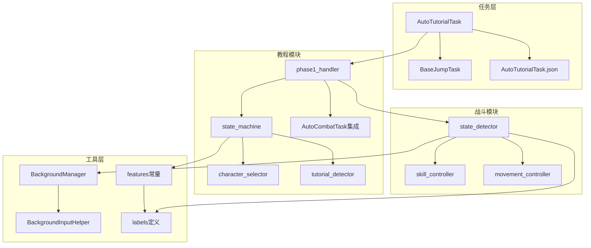
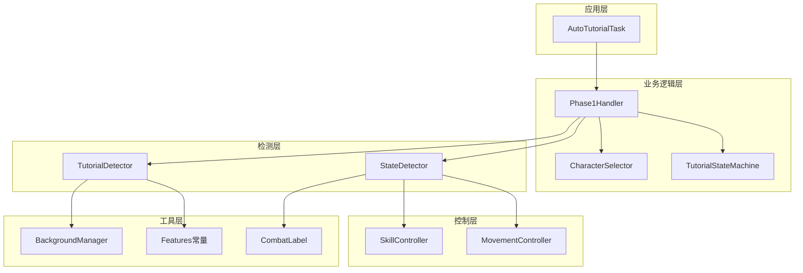
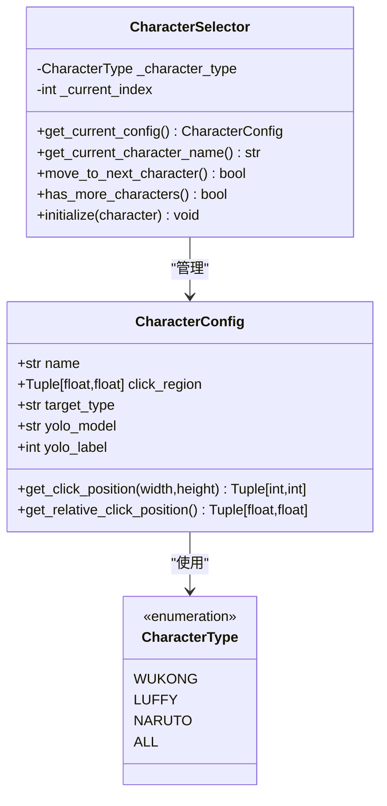
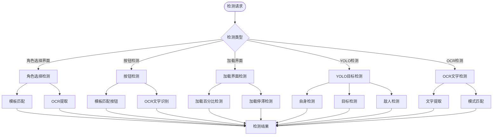
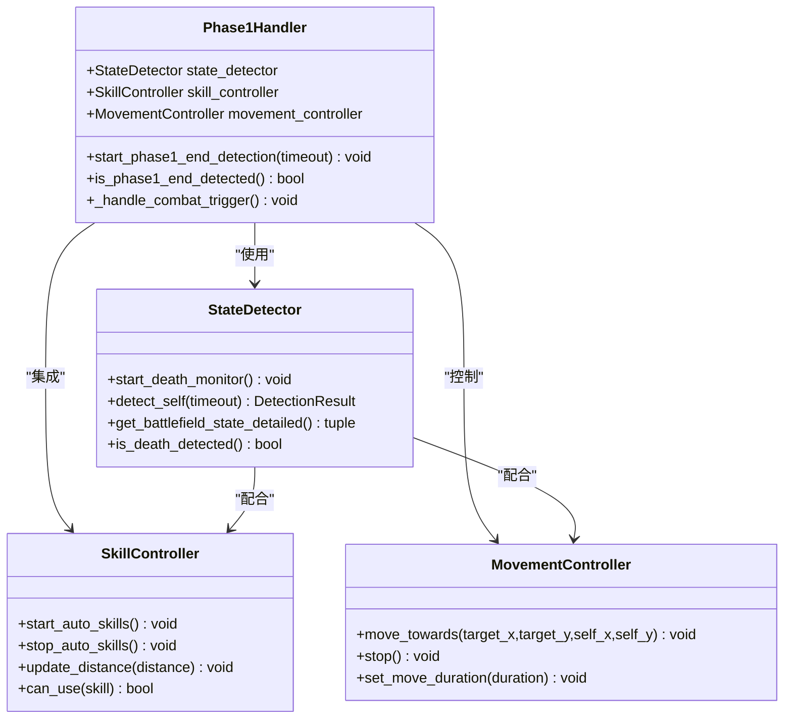
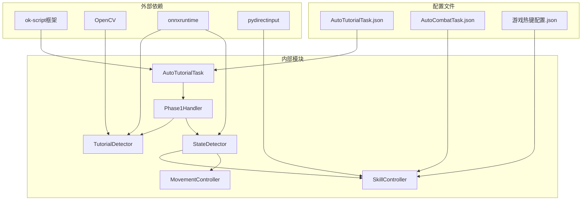

# 自动教程任务

<cite>
**本文档引用的文件**
- [AutoTutorialTask.py](file://src/task/AutoTutorialTask.py)
- [AutoTutorialTask.json](file://configs/AutoTutorialTask.json)
- [state_machine.py](file://src/tutorial/state_machine.py)
- [tutorial_detector.py](file://src/tutorial/tutorial_detector.py)
- [character_selector.py](file://src/tutorial/character_selector.py)
- [phase1_handler.py](file://src/tutorial/phase1_handler.py)
- [state_detector.py](file://src/combat/state_detector.py)
- [skill_controller.py](file://src/combat/skill_controller.py)
- [movement_controller.py](file://src/combat/movement_controller.py)
- [features.py](file://src/constants/features.py)
- [labels.py](file://src/combat/labels.py)
- [BackgroundManager.py](file://src/utils/BackgroundManager.py)
- [BaseJumpTask.py](file://src/task/BaseJumpTask.py)
- [README.md](file://README.md)
- [自动战斗系统流程图.md](file://docs/自动战斗系统流程图.md)
</cite>

## 目录
1. [简介](#简介)
2. [项目结构](#项目结构)
3. [核心组件](#核心组件)
4. [架构概览](#架构概览)
5. [详细组件分析](#详细组件分析)
6. [依赖关系分析](#依赖关系分析)
7. [性能考虑](#性能考虑)
8. [故障排除指南](#故障排除指南)
9. [结论](#结论)

## 简介

自动教程任务是基于 `ok-script` 框架构建的《漫画群星：大集结》自动化工具的核心功能之一。该项目旨在通过图像识别、OCR 和自动化脚本技术，实现游戏新手教程流程的完全自动化。

本系统支持多种角色选择模式，包括单角色执行和全角色批量执行，并集成了先进的YOLO目标检测、OCR文字识别和模板匹配技术。系统采用状态机管理模式，确保复杂的教程流程能够稳定可靠地执行。

## 项目结构

项目采用模块化的架构设计，主要分为以下几个核心模块：

**图表来源**
- [AutoTutorialTask.py:1-257](file://src/task/AutoTutorialTask.py#L1-L257)
- [state_machine.py:1-212](file://src/tutorial/state_machine.py#L1-L212)
- [phase1_handler.py:1-800](file://src/tutorial/phase1_handler.py#L1-L800)

**章节来源**
- [README.md:1-90](file://README.md#L1-L90)
- [AutoTutorialTask.py:1-257](file://src/task/AutoTutorialTask.py#L1-L257)

## 核心组件

### 自动教程任务主类

AutoTutorialTask 是整个教程系统的核心控制器，负责协调各个子模块的工作。该类继承自 BaseJumpTask，具备完整的任务生命周期管理和错误处理能力。

**主要功能特性：**
- 多角色选择支持（悟空、路飞、小鸣人、全部）
- 配置驱动的参数管理
- 详细的日志记录和错误处理
- 后台模式兼容性

### 状态机管理系统

教程系统采用有限状态机（FSM）模式管理整个教程流程，确保状态转换的有序性和可预测性。

**状态机状态：**
- 空闲状态（IDLE）
- 选角界面检测（CHECK_CHARACTER_SELECT）
- 第一次点击角色（FIRST_CLICK）
- 确认对话框处理（CONFIRM_DIALOG）
- 第二次点击角色（SECOND_CLICK）
- 加载界面等待（LOADING）
- 自身检测（SELF_DETECTION）
- 目标检测（TARGET_DETECTION）
- 移动靠近目标（MOVE_TO_TARGET）
- 普攻按钮检测（NORMAL_ATTACK_DETECTION）
- 向下移动（MOVE_DOWN）
- 自动战斗触发（COMBAT_TRIGGER）
- 第一阶段结束检测（PHASE1_END_DETECTION）

### 检测器系统

系统集成了多种检测技术，包括YOLO目标检测、OCR文字识别和模板匹配，确保在不同游戏状态下能够准确识别关键元素。

**检测器类型：**
- 角色选择界面检测
- 返回按钮检测
- 确定按钮检测
- 加载界面百分比检测
- 自身位置检测
- 目标圈检测
- 猴子检测
- 普攻按钮检测

**章节来源**
- [AutoTutorialTask.py:27-257](file://src/task/AutoTutorialTask.py#L27-L257)
- [state_machine.py:10-212](file://src/tutorial/state_machine.py#L10-L212)
- [tutorial_detector.py:21-806](file://src/tutorial/tutorial_detector.py#L21-L806)

## 架构概览

自动教程系统采用分层架构设计，确保各模块职责清晰、耦合度低、扩展性强。

**图表来源**
- [phase1_handler.py:21-800](file://src/tutorial/phase1_handler.py#L21-L800)
- [tutorial_detector.py:21-806](file://src/tutorial/tutorial_detector.py#L21-L806)
- [state_detector.py:24-473](file://src/combat/state_detector.py#L24-L473)

## 详细组件分析

### 角色选择器组件

角色选择器负责管理不同角色的配置信息和点击区域计算，支持多种角色类型的检测需求。

**图表来源**
- [character_selector.py:69-232](file://src/tutorial/character_selector.py#L69-L232)

**章节来源**
- [character_selector.py:12-232](file://src/tutorial/character_selector.py#L12-L232)

### 第一阶段处理器

第一阶段处理器是教程系统的核心执行引擎，负责协调整个新手教程流程的执行。

**图表来源**
- [phase1_handler.py:103-800](file://src/tutorial/phase1_handler.py#L103-L800)
- [tutorial_detector.py:66-806](file://src/tutorial/tutorial_detector.py#L66-L806)

**章节来源**
- [phase1_handler.py:21-800](file://src/tutorial/phase1_handler.py#L21-L800)

### 检测器系统详解

检测器系统是教程任务的核心技术支撑，集成了多种先进的计算机视觉技术。

**图表来源**
- [tutorial_detector.py:66-806](file://src/tutorial/tutorial_detector.py#L66-L806)
- [features.py:9-93](file://src/constants/features.py#L9-L93)

**章节来源**
- [tutorial_detector.py:21-806](file://src/tutorial/tutorial_detector.py#L21-L806)

### 自动战斗集成

教程系统与自动战斗模块深度集成，实现了教程结束后的无缝战斗体验。

**图表来源**
- [phase1_handler.py:611-800](file://src/tutorial/phase1_handler.py#L611-L800)
- [state_detector.py:24-473](file://src/combat/state_detector.py#L24-L473)
- [skill_controller.py:82-593](file://src/combat/skill_controller.py#L82-L593)

**章节来源**
- [phase1_handler.py:611-800](file://src/tutorial/phase1_handler.py#L611-L800)
- [state_detector.py:24-473](file://src/combat/state_detector.py#L24-L473)

## 依赖关系分析

系统采用松耦合的设计原则，通过明确的接口定义实现模块间的协作。

**图表来源**
- [AutoTutorialTask.py:16-25](file://src/task/AutoTutorialTask.py#L16-L25)
- [phase1_handler.py:11-18](file://src/tutorial/phase1_handler.py#L11-L18)

**章节来源**
- [AutoTutorialTask.py:16-25](file://src/task/AutoTutorialTask.py#L16-L25)
- [phase1_handler.py:11-18](file://src/tutorial/phase1_handler.py#L11-L18)

## 性能考虑

系统在设计时充分考虑了性能优化，采用了多项技术来提升执行效率和稳定性。

### 并行处理机制

- **第一阶段结束检测**：使用独立线程并行监控教程结束标志
- **死亡状态监控**：后台线程持续检测死亡状态，主线程快速查询
- **帧更新优化**：智能帧缓存机制，减少重复的图像处理开销

### 内存管理

- **检测结果缓存**：OCR结果缓存机制，避免重复计算
- **对象池模式**：频繁创建的对象使用池化管理
- **及时清理**：异常情况下自动清理资源

### 网络和IO优化

- **异步文件操作**：配置文件读取采用异步方式
- **批处理策略**：相似操作合并执行
- **资源复用**：摄像头和检测器实例复用

## 故障排除指南

### 常见问题及解决方案

**问题1：角色选择界面检测失败**
- 检查游戏分辨率设置
- 验证模板匹配阈值配置
- 确认OCR语言设置正确

**问题2：自动战斗触发异常**
- 检查AutoCombatTask配置文件
- 验证技能按键映射设置
- 确认后台模式配置

**问题3：目标检测不稳定**
- 调整YOLO模型阈值
- 检查光照条件
- 验证目标模型训练质量

**问题4：教程流程中断**
- 查看详细日志输出
- 检查超时配置参数
- 验证网络连接稳定性

### 调试技巧

1. **启用详细日志**：在配置中开启详细日志模式
2. **截图分析**：保存关键节点的截图进行分析
3. **逐步调试**：逐个状态检查检测器的准确性
4. **性能监控**：监控CPU和内存使用情况

**章节来源**
- [AutoTutorialTask.py:215-237](file://src/task/AutoTutorialTask.py#L215-L237)
- [phase1_handler.py:175-179](file://src/tutorial/phase1_handler.py#L175-L179)

## 结论

自动教程任务系统是一个功能完整、架构清晰的自动化解决方案。通过采用状态机管理、多技术融合检测和并行处理机制，系统能够在复杂的游戏环境中稳定执行新手教程流程。

**主要优势：**
- **高可靠性**：多重检测技术和容错机制确保执行稳定性
- **强扩展性**：模块化设计支持功能扩展和定制
- **易维护性**：清晰的代码结构和完善的文档体系
- **高性能**：优化的算法和并行处理提升执行效率

**未来发展方向：**
- 增加更多角色支持
- 优化检测算法性能
- 扩展更多游戏场景
- 提升用户体验和可配置性

该系统为游戏自动化领域提供了优秀的实践案例，其设计理念和技术实现值得借鉴和学习。