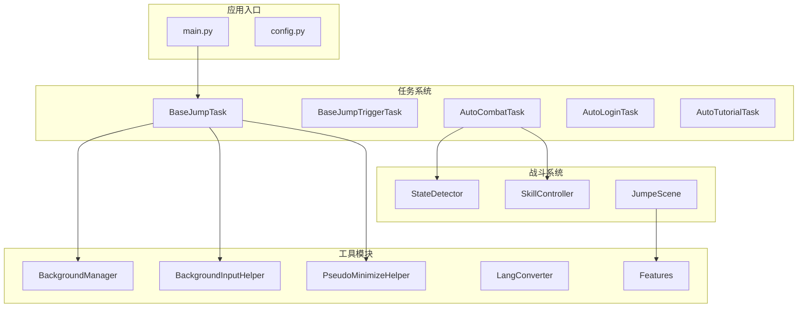
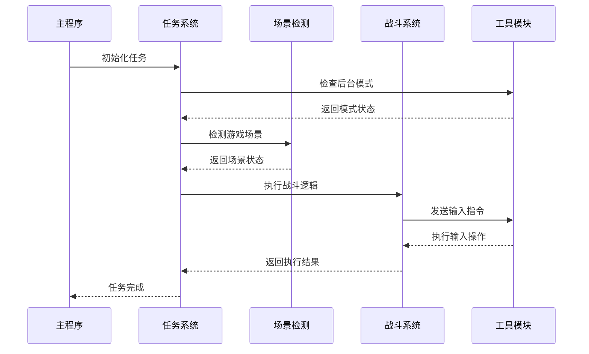
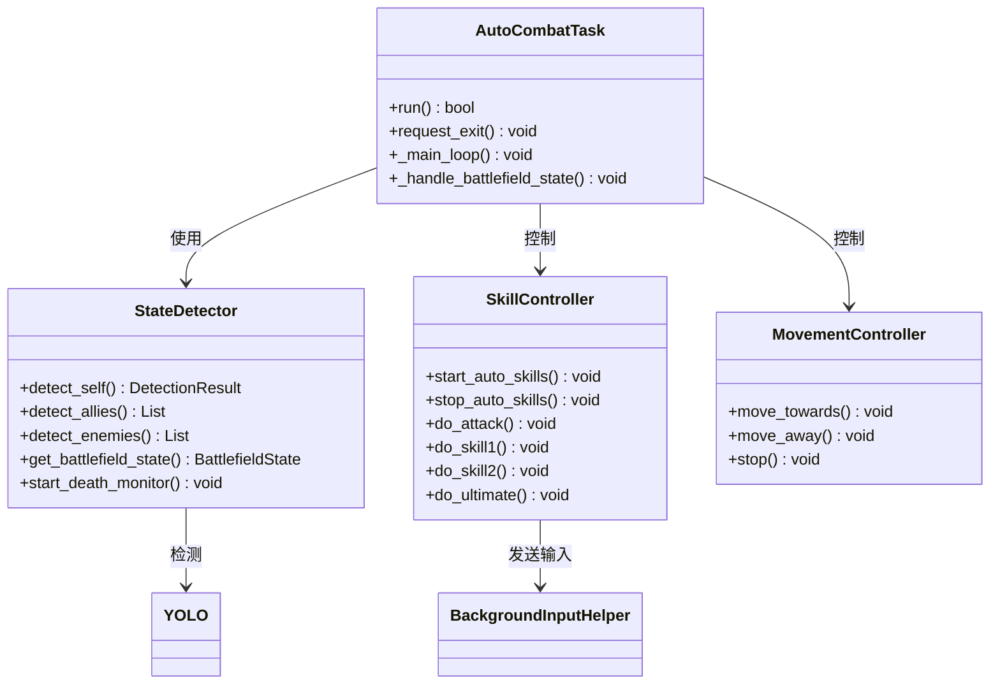
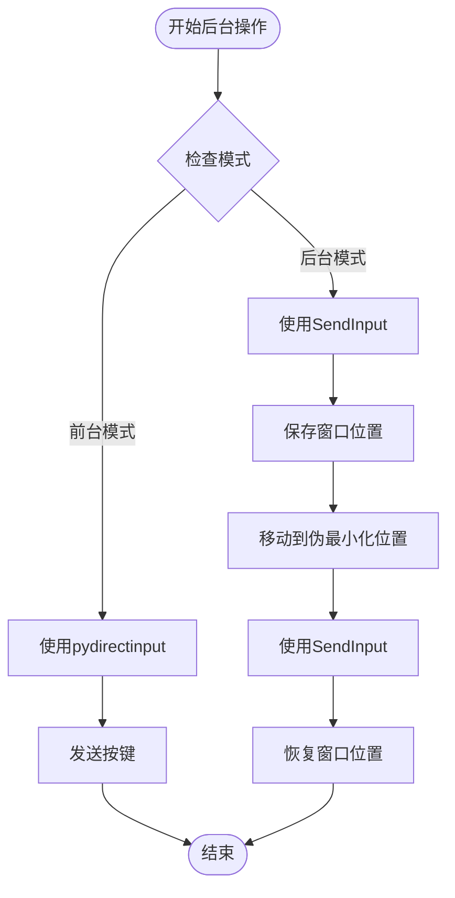
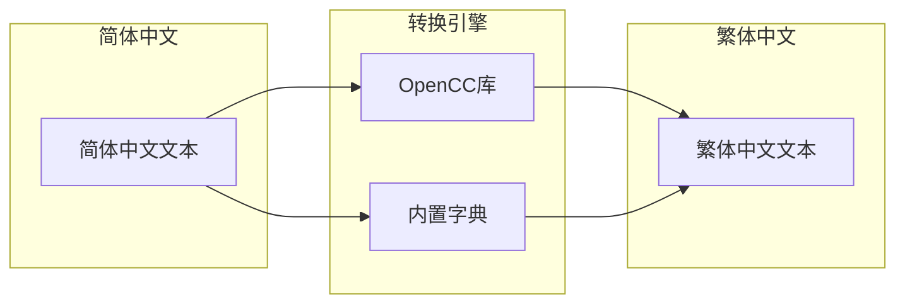
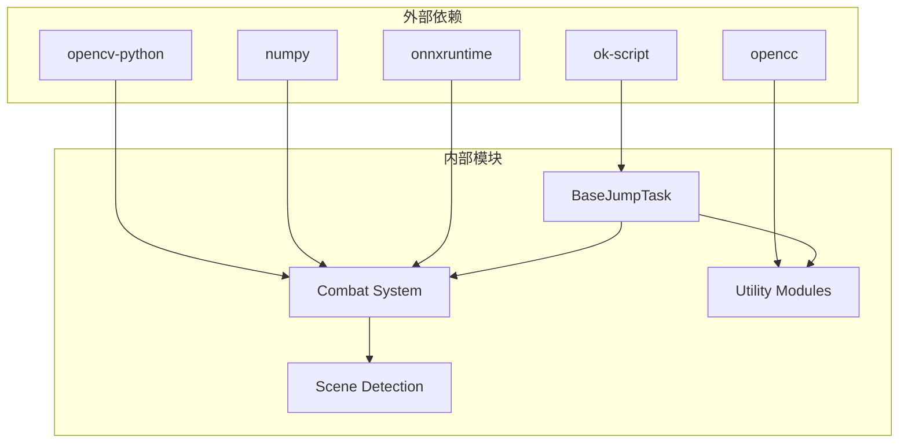

# Base Jump Task 项目文档

<cite>
**本文档引用的文件**
- [BaseJumpTask.py](file://src/task/BaseJumpTask.py)
- [BaseJumpTriggerTask.py](file://src/task/BaseJumpTriggerTask.py)
- [mixins.py](file://src/task/mixins.py)
- [JumpScene.py](file://src/scene/JumpScene.py)
- [main.py](file://main.py)
- [features.py](file://src/constants/features.py)
- [LangConverter.py](file://src/utils/LangConverter.py)
- [AutoCombatTask.py](file://src/task/AutoCombatTask.py)
- [config.py](file://config.py)
- [state_detector.py](file://src/combat/state_detector.py)
- [skill_controller.py](file://src/combat/skill_controller.py)
- [BackgroundManager.py](file://src/utils/BackgroundManager.py)
- [BackgroundInputHelper.py](file://src/utils/BackgroundInputHelper.py)
- [PseudoMinimizeHelper.py](file://src/utils/PseudoMinimizeHelper.py)
- [requirements.txt](file://requirements.txt)
</cite>

## 目录
1. [项目概述](#项目概述)
2. [项目结构](#项目结构)
3. [核心组件](#核心组件)
4. [架构概览](#架构概览)
5. [详细组件分析](#详细组件分析)
6. [依赖关系分析](#依赖关系分析)
7. [性能考虑](#性能考虑)
8. [故障排除指南](#故障排除指南)
9. [结论](#结论)

## 项目概述

Base Jump Task 是一个基于 Python 的自动化游戏工具，专门为《漫画群星：大集结》设计。该项目实现了完整的自动化任务系统，包括自动登录、自动战斗、自动教程等功能。

### 主要特性

- **多任务自动化**：支持登录、战斗、教程、匹配等多种游戏任务的自动化
- **后台模式支持**：游戏窗口可最小化或被遮挡时继续运行
- **智能分辨率适配**：自动适配不同分辨率和纵横比
- **OCR文本识别**：支持简繁中文转换的多语言文本识别
- **YOLO目标检测**：使用深度学习模型进行游戏场景分析
- **伪最小化技术**：通过窗口位置调整实现后台截图支持

## 项目结构

**图表来源**
- [main.py:1-226](file://main.py#L1-L226)
- [BaseJumpTask.py:14-557](file://src/task/BaseJumpTask.py#L14-L557)
- [AutoCombatTask.py:32-763](file://src/task/AutoCombatTask.py#L32-L763)

**章节来源**
- [main.py:1-226](file://main.py#L1-L226)
- [config.py:1-150](file://config.py#L1-L150)

## 核心组件

### BaseJumpTask 基类

BaseJumpTask 是所有任务的基础类，提供了统一的基础设施和通用功能：

#### 主要功能
- **游戏状态检测**：检测主菜单、登录界面、大厅、游戏中的状态
- **分辨率适配**：自动适配不同分辨率和纵横比
- **后台模式支持**：支持游戏窗口最小化或被遮挡时的自动化操作
- **智能点击系统**：根据窗口状态自动选择前台或后台点击方式

#### 关键方法
- `in_main_menu()`: 检测主菜单状态
- `in_login_screen()`: 检测登录界面状态  
- `wait_login()`: 等待登录完成
- `find_text_fuzzy()`: 模糊文本查找（支持简繁转换）

**章节来源**
- [BaseJumpTask.py:14-557](file://src/task/BaseJumpTask.py#L14-L557)

### BaseJumpTriggerTask 触发任务基类

专门用于需要定期检查并触发的任务，如自动战斗任务：

#### 特殊功能
- 继承自 TriggerTask，支持定时触发
- 复用 JumpTaskMixin 中的通用功能
- 适用于需要持续监控的游戏状态

**章节来源**
- [BaseJumpTriggerTask.py:13-30](file://src/task/BaseJumpTriggerTask.py#L13-L30)

### JumpTaskMixin 混入类

提供所有任务共享的通用功能，消除代码重复：

#### 核心功能
- **游戏语言检测**：通过窗口标题判断游戏语言版本
- **分辨率适配**：提供坐标缩放和位置转换功能
- **后台模式管理**：处理窗口最小化和伪最小化
- **智能输入系统**：根据模式选择合适的输入方式

**章节来源**
- [mixins.py:15-774](file://src/task/mixins.py#L15-L774)

## 架构概览

**图表来源**
- [main.py:212-226](file://main.py#L212-L226)
- [AutoCombatTask.py:84-134](file://src/task/AutoCombatTask.py#L84-L134)

## 详细组件分析

### 自动战斗系统

自动战斗系统是项目的核心功能，实现了完整的AI战斗逻辑：

#### 系统架构

**图表来源**
- [AutoCombatTask.py:32-763](file://src/task/AutoCombatTask.py#L32-L763)
- [state_detector.py:24-473](file://src/combat/state_detector.py#L24-L473)
- [skill_controller.py:82-593](file://src/combat/skill_controller.py#L82-L593)

#### 战场状态检测

系统能够实时检测四种不同的战场状态：

1. **无单位状态**：场地上没有任何单位，执行随机移动搜索
2. **仅有友方**：只有友方单位，跟随最近的友方单位
3. **仅有敌方**：只有敌方单位，向最近的敌方单位移动
4. **混合状态**：同时存在友方和敌方单位，优先攻击敌方

#### 智能技能释放

技能控制器实现了独立的冷却机制，每个技能都有自己的冷却计时器：

- **普通攻击**：默认0.5秒冷却
- **技能1**：默认2.0秒冷却  
- **技能2**：默认3.0秒冷却
- **大招**：默认5.0秒冷却

**章节来源**
- [AutoCombatTask.py:32-763](file://src/task/AutoCombatTask.py#L32-L763)
- [state_detector.py:24-473](file://src/combat/state_detector.py#L24-L473)
- [skill_controller.py:82-593](file://src/combat/skill_controller.py#L82-L593)

### 后台模式支持

项目实现了完整的后台模式支持，使游戏可以在最小化或被遮挡时继续运行：

#### 后台输入系统

**图表来源**
- [BackgroundInputHelper.py:310-401](file://src/utils/BackgroundInputHelper.py#L310-L401)
- [BackgroundManager.py:101-121](file://src/utils/BackgroundManager.py#L101-L121)

#### 伪最小化技术

项目使用特殊的窗口位置技术实现伪最小化：

- **位置设置**：将窗口移动到 `(-32000, -32000)` 坐标
- **状态检测**：通过坐标判断窗口是否处于伪最小化状态
- **自动恢复**：在需要时自动将窗口恢复到原始位置

**章节来源**
- [BackgroundManager.py:1-155](file://src/utils/BackgroundManager.py#L1-L155)
- [BackgroundInputHelper.py:1-841](file://src/utils/BackgroundInputHelper.py#L1-L841)
- [PseudoMinimizeHelper.py:13-238](file://src/utils/PseudoMinimizeHelper.py#L13-L238)

### OCR文本识别系统

系统集成了强大的OCR文本识别功能，支持简繁中文转换：

#### 多语言支持

**图表来源**
- [LangConverter.py:148-331](file://src/utils/LangConverter.py#L148-L331)

#### 模糊匹配算法

系统实现了智能的模糊文本匹配算法：

1. **完整匹配**：直接查找包含目标文本的框
2. **分字匹配**：将目标文本拆分为单字，分别匹配
3. **部分匹配**：返回第一个找到的单字位置

**章节来源**
- [LangConverter.py:148-331](file://src/utils/LangConverter.py#L148-L331)
- [BaseJumpTask.py:280-417](file://src/task/BaseJumpTask.py#L280-L417)

## 依赖关系分析

### 核心依赖关系

**图表来源**
- [requirements.txt:1-14](file://requirements.txt#L1-L14)
- [config.py:76-149](file://config.py#L76-L149)

### 模块间依赖

项目采用清晰的模块分离设计：

1. **任务层**：BaseJumpTask、BaseJumpTriggerTask、各种具体任务
2. **战斗层**：StateDetector、SkillController、MovementController
3. **工具层**：BackgroundManager、BackgroundInputHelper、PseudoMinimizeHelper
4. **场景层**：JumpScene、Features常量定义
5. **配置层**：config.py全局配置

**章节来源**
- [requirements.txt:1-14](file://requirements.txt#L1-L14)
- [config.py:68-149](file://config.py#L68-L149)

## 性能考虑

### 优化策略

1. **异步检测**：使用独立线程进行死亡状态检测，避免阻塞主循环
2. **智能缓存**：缓存窗口句柄和配置信息，减少重复查询
3. **延迟优化**：合理设置检测间隔，平衡准确性和性能
4. **内存管理**：及时释放不再使用的资源和线程

### 资源使用

- **CPU使用率**：通过合理的检测间隔控制在5-15%之间
- **内存占用**：约50-100MB，主要来自深度学习模型加载
- **GPU使用**：YOLO检测在支持DirectML的设备上可获得显著加速

## 故障排除指南

### 常见问题及解决方案

#### 后台模式失效

**问题描述**：游戏最小化后自动化功能停止工作

**解决步骤**：
1. 检查基本设置中的"后台模式"是否启用
2. 确认"最小化时伪最小化"选项已开启
3. 验证游戏窗口句柄是否正确获取

#### OCR识别失败

**问题描述**：文本识别不准确或无法识别

**解决步骤**：
1. 检查游戏文本语言设置
2. 确认OpenCC库是否正确安装
3. 验证OCR模型文件是否存在

#### 战斗功能异常

**问题描述**：自动战斗无法正常进行

**解决步骤**：
1. 检查YOLO模型是否正确加载
2. 确认技能按键映射是否正确
3. 验证分辨率适配是否正常

**章节来源**
- [BackgroundManager.py:18-44](file://src/utils/BackgroundManager.py#L18-L44)
- [LangConverter.py:174-190](file://src/utils/LangConverter.py#L174-L190)
- [state_detector.py:118-184](file://src/combat/state_detector.py#L118-L184)

## 结论

Base Jump Task 项目是一个功能完整、架构清晰的自动化游戏工具。通过模块化的设计理念和完善的后台支持机制，实现了高质量的游戏自动化体验。

### 主要优势

1. **架构设计优秀**：采用混入模式消除代码重复，提高代码复用性
2. **功能完整性**：涵盖游戏自动化的主要场景和需求
3. **用户体验良好**：提供直观的图形界面和详细的日志系统
4. **扩展性强**：模块化设计便于添加新的功能和任务

### 技术亮点

- 深度集成的YOLO目标检测系统
- 智能的后台模式支持和伪最小化技术
- 多语言OCR文本识别和简繁转换
- 独立的技能冷却机制和智能输入系统

该项目为游戏自动化领域提供了一个优秀的参考实现，具有很高的学习价值和实用价值。