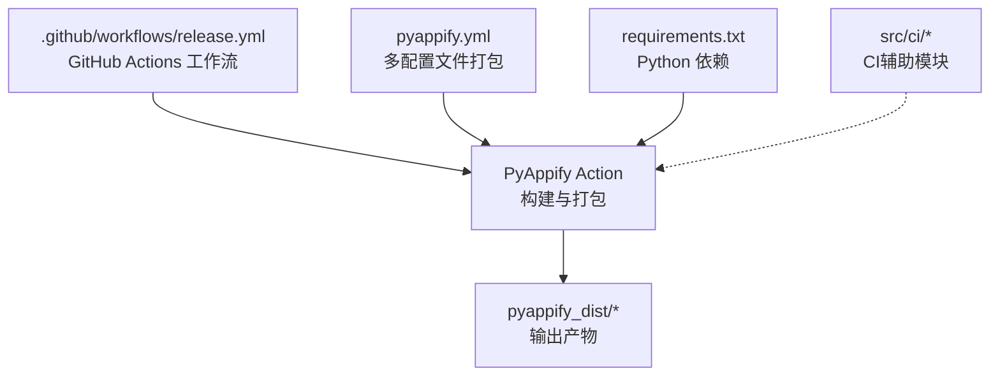
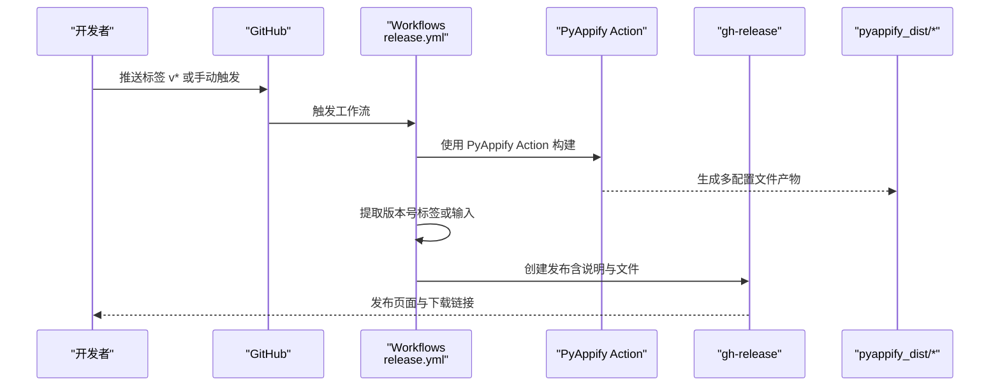
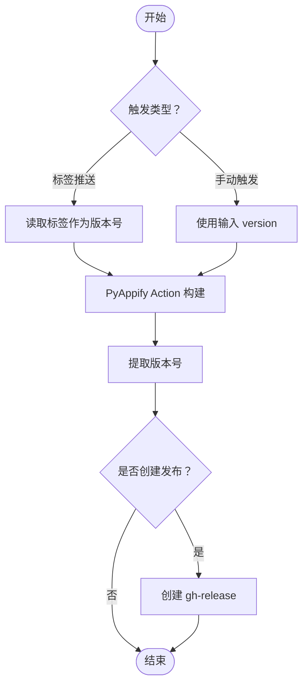
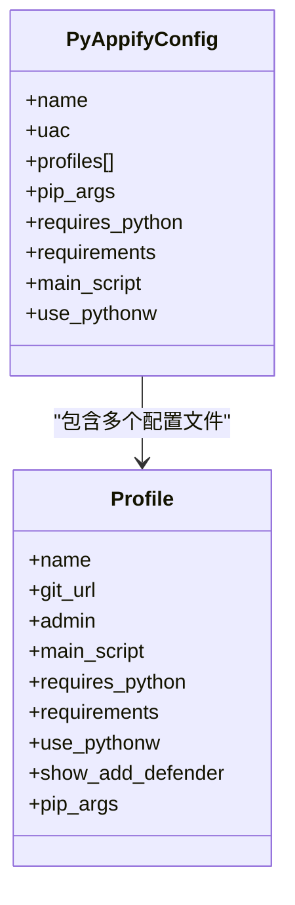
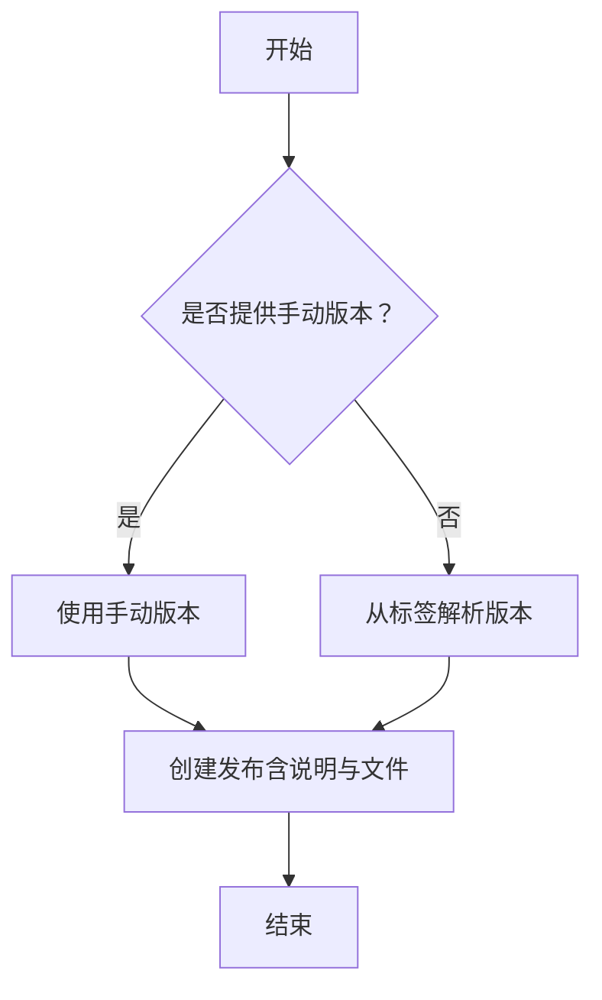
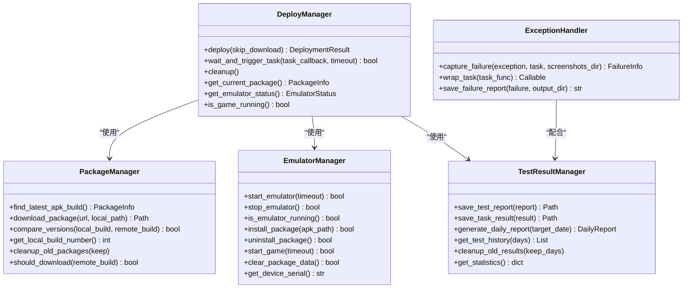
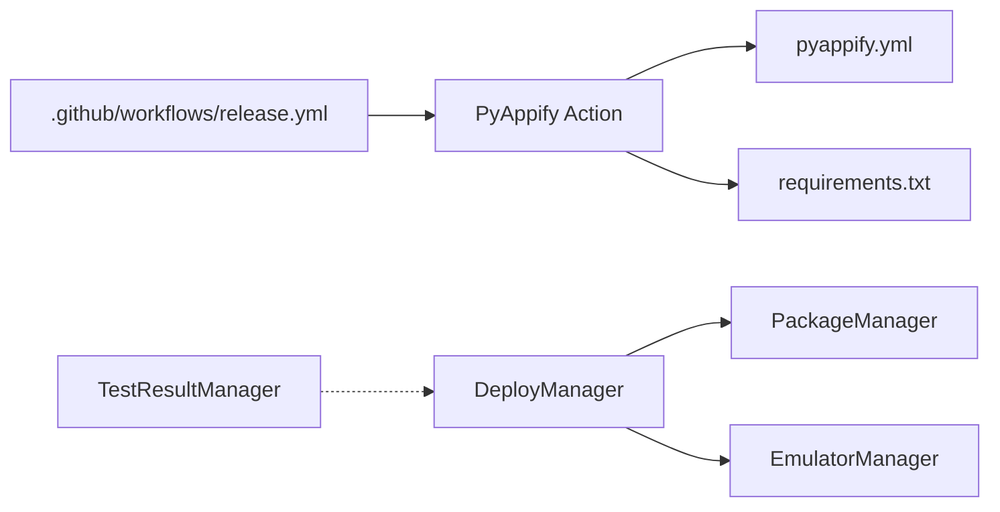

# CI 流水线设计

<cite>
**本文档引用的文件**
- [.github/workflows/release.yml](file://.github/workflows/release.yml)
- [pyappify.yml](file://pyappify.yml)
- [requirements.txt](file://requirements.txt)
- [src/ci/deploy_manager.py](file://src/ci/deploy_manager.py)
- [src/ci/package_manager.py](file://src/ci/package_manager.py)
- [src/ci/emulator_manager.py](file://src/ci/emulator_manager.py)
- [src/ci/test_result_manager.py](file://src/ci/test_result_manager.py)
- [src/ci/exceptions.py](file://src/ci/exceptions.py)
- [src/ci/exception_handler.py](file://src/ci/exception_handler.py)
- [main.py](file://main.py)
- [main_debug.py](file://main_debug.py)
</cite>

## 目录
1. [简介](#简介)
2. [项目结构](#项目结构)
3. [核心组件](#核心组件)
4. [架构总览](#架构总览)
5. [详细组件分析](#详细组件分析)
6. [依赖关系分析](#依赖关系分析)
7. [性能考虑](#性能考虑)
8. [故障排除指南](#故障排除指南)
9. [结论](#结论)

## 简介
本文件面向 ok-jump 项目的 CI 流水线设计，围绕 GitHub Actions 工作流与 PyAppify Action 的集成展开，系统性阐述触发条件、构建步骤、版本管理、发布流程以及多配置文件打包策略，并提供优化建议与故障排除指南，帮助开发者理解与维护 CI 管道。

## 项目结构
ok-jump 采用“仓库根目录 + GitHub Actions 工作流 + PyAppify 配置 + CI 辅助模块”的组织方式：
- GitHub Actions 工作流位于 `.github/workflows/release.yml`
- PyAppify 构建配置位于 `pyappify.yml`
- Python 依赖位于 `requirements.txt`
- CI 辅助模块位于 `src/ci/`，涵盖部署、包管理、模拟器管理、测试结果管理与异常处理

图表来源
- [.github/workflows/release.yml:1-65](file://.github/workflows/release.yml#L1-L65)
- [pyappify.yml:1-18](file://pyappify.yml#L1-L18)
- [requirements.txt:1-17](file://requirements.txt#L1-L17)

章节来源
- [.github/workflows/release.yml:1-65](file://.github/workflows/release.yml#L1-L65)
- [pyappify.yml:1-18](file://pyappify.yml#L1-L18)
- [requirements.txt:1-17](file://requirements.txt#L1-L17)

## 核心组件
- GitHub Actions 工作流：定义触发条件、作业权限、步骤顺序与发布逻辑
- PyAppify Action：负责 Python 应用的打包与多配置文件输出
- CI 辅助模块：在本地或 CI 环境中进行 APK 下载、模拟器管理、游戏启动与测试结果管理
- 配置文件：requirements.txt 与 pyappify.yml，分别控制依赖与打包配置

章节来源
- [.github/workflows/release.yml:14-65](file://.github/workflows/release.yml#L14-L65)
- [pyappify.yml:1-18](file://pyappify.yml#L1-L18)
- [requirements.txt:1-17](file://requirements.txt#L1-L17)

## 架构总览
整体 CI 架构由“触发 → 构建 → 版本提取 → 发布”构成，同时 PyAppify Action 支持多配置文件打包，满足不同场景需求。

图表来源
- [.github/workflows/release.yml:3-65](file://.github/workflows/release.yml#L3-L65)
- [pyappify.yml:1-18](file://pyappify.yml#L1-L18)

## 详细组件分析

### GitHub Actions 工作流（触发与发布）
- 触发条件
  - 标签推送：匹配 `v*` 形式的标签
  - 手动触发：通过 `workflow_dispatch` 输入 `version` 字段
- 权限设置：作业对 `contents: write` 具备写权限，用于发布
- 步骤概览
  - 代码检出（fetch-depth: 0）
  - 使用 PyAppify Action 构建（设置 PIP_TIMEOUT）
  - 提取版本号（优先使用手动输入，否则从标签）
  - 创建发布（包含说明与文件附件）

图表来源
- [.github/workflows/release.yml:3-65](file://.github/workflows/release.yml#L3-L65)

章节来源
- [.github/workflows/release.yml:3-65](file://.github/workflows/release.yml#L3-L65)

### PyAppify Action 集成与配置
- Action 使用
  - 使用 `ok-oldking/pyappify-action@v1.0.19`
  - 通过环境变量注入 `GITHUB_TOKEN` 与 `PIP_TIMEOUT=300`
- 多配置文件打包
  - 通过 `pyappify.yml` 定义 profiles，支持 China 与 Debug 两套配置
  - China 配置启用 UAC、使用 Pythonw、镜像加速源与超时重试参数
  - Debug 配置启用控制台输出，便于本地调试
- 依赖下载超时设置
  - 在 `pip_args` 中设置 `--timeout 300` 与 `--retries 3`，提升网络不稳定环境下的稳定性
- 构建参数配置
  - 指定主脚本、Python 版本、依赖文件等，确保构建一致性

图表来源
- [pyappify.yml:1-18](file://pyappify.yml#L1-L18)

章节来源
- [.github/workflows/release.yml:26-32](file://.github/workflows/release.yml#L26-L32)
- [pyappify.yml:1-18](file://pyappify.yml#L1-L18)
- [requirements.txt:1-17](file://requirements.txt#L1-L17)

### 版本管理与发布说明
- 版本号提取
  - 若手动触发提供 `version`，则使用该值
  - 否则从 `GITHUB_REF` 的标签中解析版本号
- 发布说明
  - 固定包含“配置文件说明”与“安装步骤”
  - 附件为 `pyappify_dist/*`，即 PyAppify 生成的多配置文件产物

图表来源
- [.github/workflows/release.yml:33-65](file://.github/workflows/release.yml#L33-L65)

章节来源
- [.github/workflows/release.yml:33-65](file://.github/workflows/release.yml#L33-L65)

### CI 辅助模块（本地/CI 环境）
尽管本仓库的发布工作流主要依赖 PyAppify Action，但在本地或 CI 环境中仍可使用 `src/ci/` 下的模块进行自动化测试与部署验证。这些模块提供了完整的 APK 下载、模拟器管理、游戏启动与测试结果管理能力。

图表来源
- [src/ci/deploy_manager.py:1-428](file://src/ci/deploy_manager.py#L1-L428)
- [src/ci/package_manager.py:1-380](file://src/ci/package_manager.py#L1-L380)
- [src/ci/emulator_manager.py:1-457](file://src/ci/emulator_manager.py#L1-L457)
- [src/ci/test_result_manager.py:1-327](file://src/ci/test_result_manager.py#L1-L327)
- [src/ci/exception_handler.py:1-493](file://src/ci/exception_handler.py#L1-L493)

章节来源
- [src/ci/deploy_manager.py:1-428](file://src/ci/deploy_manager.py#L1-L428)
- [src/ci/package_manager.py:1-380](file://src/ci/package_manager.py#L1-L380)
- [src/ci/emulator_manager.py:1-457](file://src/ci/emulator_manager.py#L1-L457)
- [src/ci/test_result_manager.py:1-327](file://src/ci/test_result_manager.py#L1-L327)
- [src/ci/exception_handler.py:1-493](file://src/ci/exception_handler.py#L1-L493)

## 依赖关系分析
- 工作流对 Action 的依赖：通过 `uses` 指定 PyAppify Action 版本
- Action 对配置的依赖：读取 `pyappify.yml` 与 `requirements.txt`
- 本地 CI 模块之间的耦合：DeployManager 组合 PackageManager 与 EmulatorManager，TestResultManager 独立管理测试结果

图表来源
- [.github/workflows/release.yml:26-32](file://.github/workflows/release.yml#L26-L32)
- [pyappify.yml:1-18](file://pyappify.yml#L1-L18)
- [requirements.txt:1-17](file://requirements.txt#L1-L17)
- [src/ci/deploy_manager.py:102-116](file://src/ci/deploy_manager.py#L102-L116)

章节来源
- [.github/workflows/release.yml:26-32](file://.github/workflows/release.yml#L26-L32)
- [pyappify.yml:1-18](file://pyappify.yml#L1-L18)
- [requirements.txt:1-17](file://requirements.txt#L1-L17)
- [src/ci/deploy_manager.py:102-116](file://src/ci/deploy_manager.py#L102-L116)

## 性能考虑
- 依赖下载超时与重试
  - 在 `pyappify.yml` 中设置 `--timeout 300` 与 `--retries 3`，在网络波动环境下提升成功率
- 构建缓存与增量
  - 建议在工作流中引入缓存步骤（如 pip cache），减少重复安装时间
- 并行化
  - 将构建与测试拆分为独立作业，利用 `needs` 控制依赖，提高整体吞吐
- 日志与产物管理
  - 使用 `softprops/action-gh-release` 时仅上传必要文件，避免冗余

## 故障排除指南
- PyAppify Action 构建失败
  - 检查 `GITHUB_TOKEN` 是否正确注入
  - 确认 `PIP_TIMEOUT` 设置是否足够（默认 300 秒）
  - 核对 `pyappify.yml` 中的 `pip_args` 与 `requirements.txt` 是否一致
- 标签触发未生成发布
  - 确认推送标签符合 `v*` 格式
  - 检查工作流权限是否包含 `contents: write`
- 多配置文件未全部产出
  - 确认 `pyappify.yml` 中 `profiles` 数量与命名
  - 检查 `pyappify_dist/*` 是否被正确上传至发布
- 本地 CI 模块异常
  - 模拟器启动失败：检查 `EmulatorManager` 的启动超时与端口配置
  - APK 下载失败：检查 `PackageManager` 的网络超时与 Jenkins 可达性
  - 游戏进程异常：结合 `ExceptionHandler` 的“游戏画面停滞检测”定位卡死问题

章节来源
- [.github/workflows/release.yml:26-65](file://.github/workflows/release.yml#L26-L65)
- [pyappify.yml:1-18](file://pyappify.yml#L1-L18)
- [src/ci/emulator_manager.py:90-158](file://src/ci/emulator_manager.py#L90-L158)
- [src/ci/package_manager.py:259-310](file://src/ci/package_manager.py#L259-L310)
- [src/ci/exception_handler.py:273-295](file://src/ci/exception_handler.py#L273-L295)

## 结论
ok-jump 的 CI 流水线以 GitHub Actions 为核心，通过 PyAppify Action 实现一键多配置文件打包与发布。工作流具备标签触发与手动触发双重入口，结合明确的版本提取与发布说明模板，能够稳定地交付标准化产物。配合 `src/ci/` 模块，可在本地或 CI 环境中进行更完善的自动化测试与部署验证。建议进一步引入缓存与并行化策略以提升效率，并持续完善异常处理与监控机制以增强可观测性。