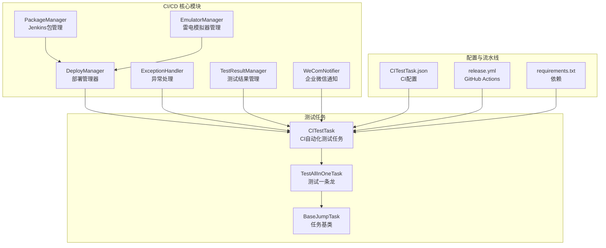
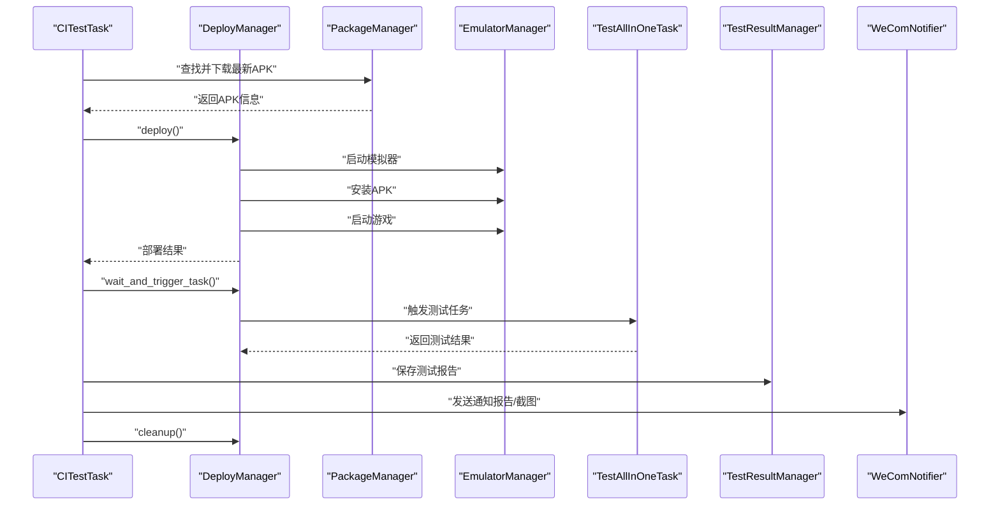
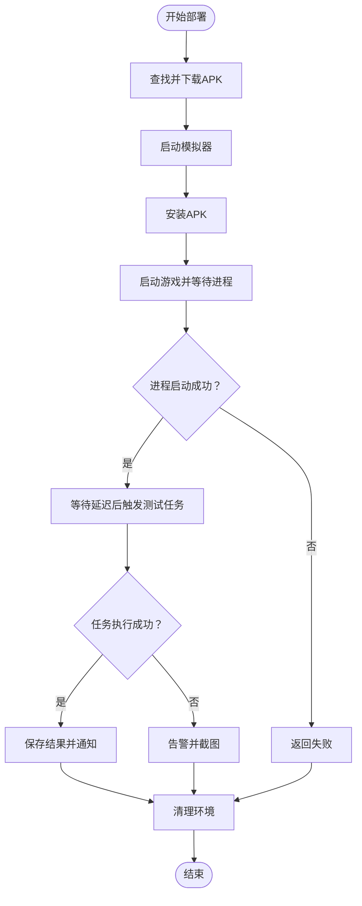
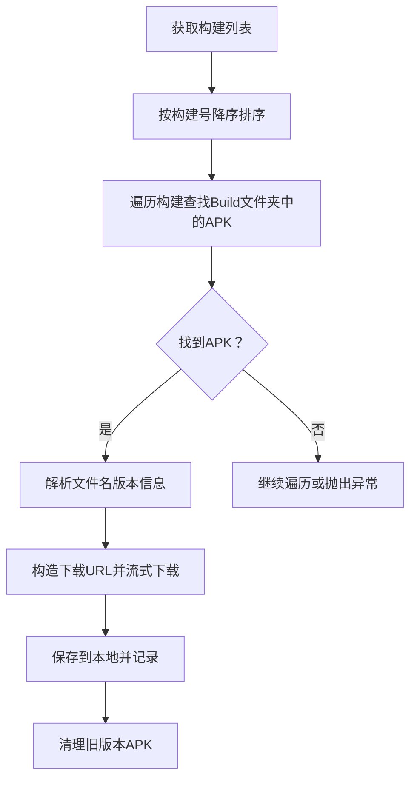
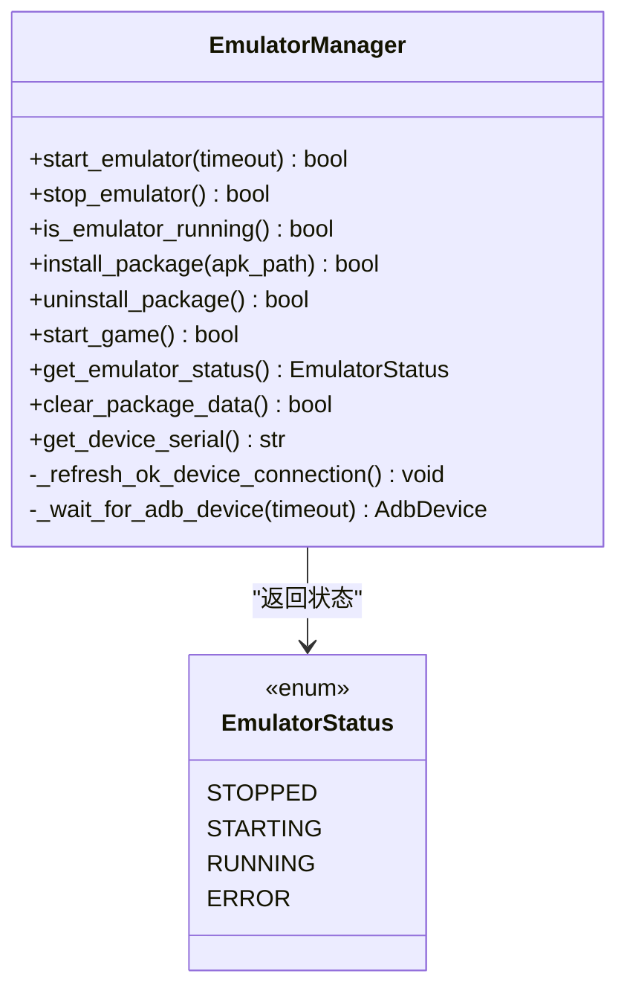
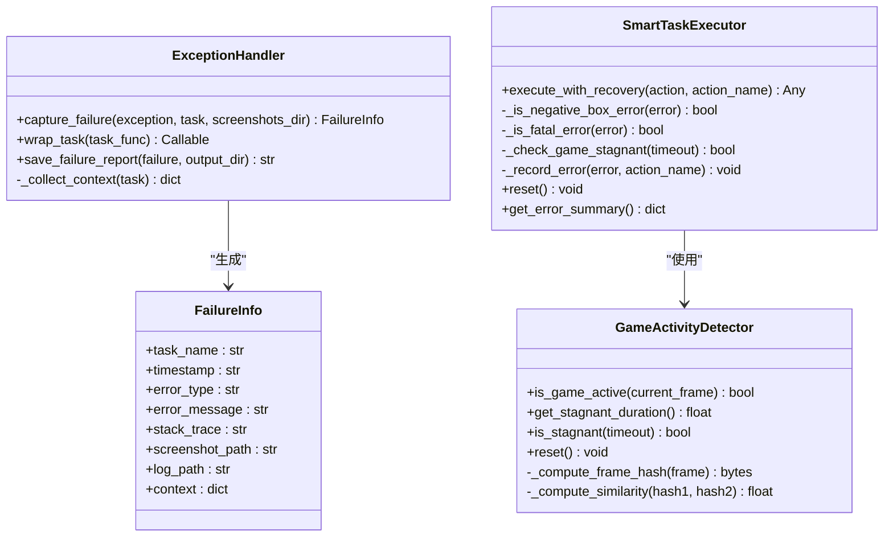
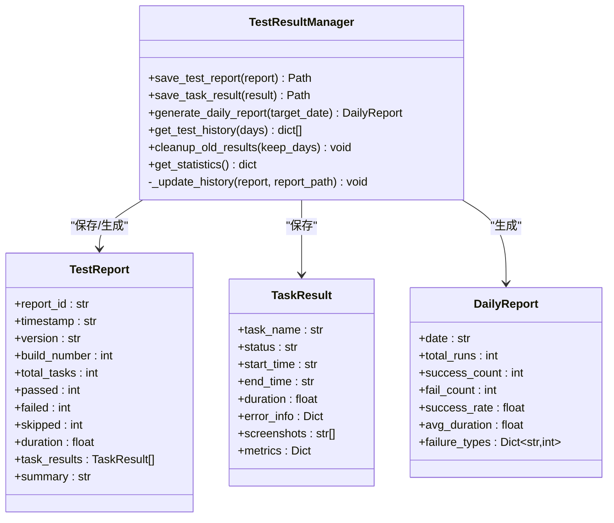
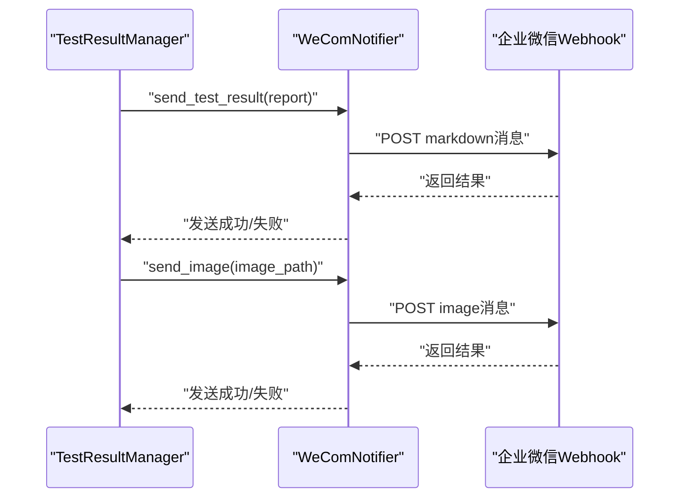
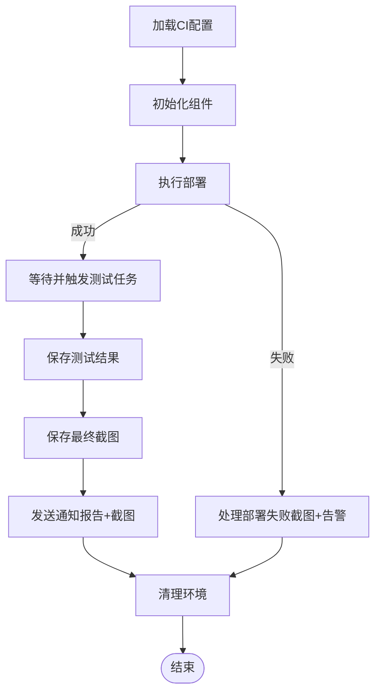
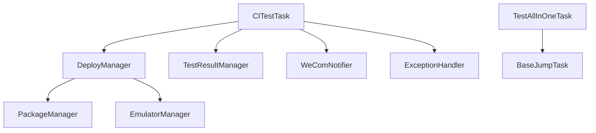

# CI/CD 集成

<cite>
**本文档引用的文件**
- [src/ci/__init__.py](file://src/ci/__init__.py)
- [src/ci/deploy_manager.py](file://src/ci/deploy_manager.py)
- [src/ci/test_result_manager.py](file://src/ci/test_result_manager.py)
- [src/ci/exception_handler.py](file://src/ci/exception_handler.py)
- [src/ci/exceptions.py](file://src/ci/exceptions.py)
- [src/ci/package_manager.py](file://src/ci/package_manager.py)
- [src/ci/emulator_manager.py](file://src/ci/emulator_manager.py)
- [src/ci/notifier/wecom_notifier.py](file://src/ci/notifier/wecom_notifier.py)
- [.github/workflows/release.yml](file://.github/workflows/release.yml)
- [requirements.txt](file://requirements.txt)
- [configs/CITestTask.json](file://configs/CITestTask.json)
- [src/task/CITestTask.py](file://src/task/CITestTask.py)
- [src/task/TestAllInOneTask.py](file://src/task/TestAllInOneTask.py)
- [src/task/BaseJumpTask.py](file://src/task/BaseJumpTask.py)
- [tests/test_ci_modules.py](file://tests/test_ci_modules.py)
</cite>

## 目录
1. [简介](#简介)
2. [项目结构](#项目结构)
3. [核心组件](#核心组件)
4. [架构总览](#架构总览)
5. [详细组件分析](#详细组件分析)
6. [依赖分析](#依赖分析)
7. [性能考虑](#性能考虑)
8. [故障排查指南](#故障排查指南)
9. [结论](#结论)
10. [附录](#附录)

## 简介
本文件面向 ok-jump 项目的 CI/CD 集成，系统性阐述自动化测试流水线的设计与实现，涵盖 Jenkins 包管理与下载、雷电模拟器管理、环境部署、测试执行、异常处理与监控、测试结果管理、通知系统（企业微信）、部署管理器（版本发布、依赖管理、回滚机制）等。同时提供配置与维护指导，帮助开发者高效搭建与维护 CI/CD 系统。

## 项目结构
ok-jump 的 CI/CD 相关代码集中在 src/ci 目录，配合 src/task 中的测试任务与 GitHub Actions 实现自动化构建与发布。关键目录与文件如下：
- src/ci：CI/CD 核心模块（包管理、模拟器管理、异常处理、测试结果管理、通知）
- src/task：测试任务（CITestTask、TestAllInOneTask、BaseJumpTask 等）
- configs：CI 配置文件（CITestTask.json）
- tests：CI 模块单元测试
- .github/workflows：GitHub Actions 流水线（构建与发布）

**图表来源**
- [src/ci/package_manager.py:37-380](file://src/ci/package_manager.py#L37-L380)
- [src/ci/emulator_manager.py:39-457](file://src/ci/emulator_manager.py#L39-L457)
- [src/ci/deploy_manager.py:38-428](file://src/ci/deploy_manager.py#L38-L428)
- [src/ci/exception_handler.py:331-493](file://src/ci/exception_handler.py#L331-L493)
- [src/ci/test_result_manager.py:73-327](file://src/ci/test_result_manager.py#L73-L327)
- [src/ci/notifier/wecom_notifier.py:21-288](file://src/ci/notifier/wecom_notifier.py#L21-L288)
- [src/task/CITestTask.py:26-800](file://src/task/CITestTask.py#L26-L800)
- [src/task/TestAllInOneTask.py:11-200](file://src/task/TestAllInOneTask.py#L11-L200)
- [src/task/BaseJumpTask.py:26-200](file://src/task/BaseJumpTask.py#L26-L200)
- [configs/CITestTask.json:1-29](file://configs/CITestTask.json#L1-L29)
- [.github/workflows/release.yml:1-65](file://.github/workflows/release.yml#L1-L65)
- [requirements.txt:1-17](file://requirements.txt#L1-L17)

**章节来源**
- [src/ci/__init__.py:1-64](file://src/ci/__init__.py#L1-L64)
- [configs/CITestTask.json:1-29](file://configs/CITestTask.json#L1-L29)
- [.github/workflows/release.yml:1-65](file://.github/workflows/release.yml#L1-L65)

## 核心组件
- 包管理器（PackageManager）：从 Jenkins 获取最新构建并下载 APK，支持版本对比与去重下载、清理旧版本。
- 模拟器管理器（EmulatorManager）：启动/关闭雷电模拟器、安装/卸载 APK、启动游戏、检测设备状态。
- 部署管理器（DeployManager）：整合包下载、模拟器启动、APK 安装、游戏启动、任务触发与清理。
- 异常处理（ExceptionHandler）：统一捕获异常、截图保存、日志导出、连续失败检测、游戏画面停滞检测。
- 测试结果管理（TestResultManager）：保存测试报告与任务结果、生成每日报告、历史记录与统计。
- 通知系统（WeComNotifier）：企业微信 Webhook 推送测试报告、告警、失败截图。
- CI 任务（CITestTask）：编排部署、测试、通知、清理全流程；支持失败自动重试与账号递增。
- 测试任务（TestAllInOneTask、BaseJumpTask）：组合执行多个子任务，支持任务间过渡与界面验证。

**章节来源**
- [src/ci/package_manager.py:37-380](file://src/ci/package_manager.py#L37-L380)
- [src/ci/emulator_manager.py:39-457](file://src/ci/emulator_manager.py#L39-L457)
- [src/ci/deploy_manager.py:38-428](file://src/ci/deploy_manager.py#L38-L428)
- [src/ci/exception_handler.py:331-493](file://src/ci/exception_handler.py#L331-L493)
- [src/ci/test_result_manager.py:73-327](file://src/ci/test_result_manager.py#L73-L327)
- [src/ci/notifier/wecom_notifier.py:21-288](file://src/ci/notifier/wecom_notifier.py#L21-L288)
- [src/task/CITestTask.py:26-800](file://src/task/CITestTask.py#L26-L800)
- [src/task/TestAllInOneTask.py:11-200](file://src/task/TestAllInOneTask.py#L11-L200)
- [src/task/BaseJumpTask.py:26-200](file://src/task/BaseJumpTask.py#L26-L200)

## 架构总览
CI/CD 流水线以 CITestTask 为核心，串联 DeployManager、PackageManager、EmulatorManager、TestAllInOneTask、TestResultManager、WeComNotifier 等模块，形成“部署-测试-结果-通知”的闭环。异常处理贯穿始终，保障稳定性与可观测性。

**图表来源**
- [src/task/CITestTask.py:146-273](file://src/task/CITestTask.py#L146-L273)
- [src/ci/deploy_manager.py:123-308](file://src/ci/deploy_manager.py#L123-L308)
- [src/ci/package_manager.py:86-158](file://src/ci/package_manager.py#L86-L158)
- [src/ci/emulator_manager.py:90-157](file://src/ci/emulator_manager.py#L90-L157)
- [src/task/TestAllInOneTask.py:53-142](file://src/task/TestAllInOneTask.py#L53-L142)
- [src/ci/test_result_manager.py:102-130](file://src/ci/test_result_manager.py#L102-L130)
- [src/ci/notifier/wecom_notifier.py:87-134](file://src/ci/notifier/wecom_notifier.py#L87-L134)

## 详细组件分析

### 部署管理器（DeployManager）
- 职责：从 Jenkins 下载最新 APK，启动模拟器，安装 APK，启动游戏，等待进程并触发测试任务，清理环境。
- 关键流程：
  - 步骤1：PackageManager 查找并下载最新 APK（支持跳过下载使用本地已有包）。
  - 步骤2：EmulatorManager 启动模拟器并等待稳定。
  - 步骤3：安装 APK 并启动游戏，等待游戏进程启动。
  - 步骤4：wait_and_trigger_task 延迟触发测试任务，期间检测游戏进程是否退出或画面停滞。
  - 步骤5：cleanup 清理模拟器与旧包。
- 超时与容错：模拟器启动超时、游戏启动超时、任务触发超时、进程退出异常均有明确异常类型与处理逻辑。

**图表来源**
- [src/ci/deploy_manager.py:123-308](file://src/ci/deploy_manager.py#L123-L308)
- [src/ci/emulator_manager.py:384-412](file://src/ci/emulator_manager.py#L384-L412)
- [src/ci/package_manager.py:259-310](file://src/ci/package_manager.py#L259-L310)

**章节来源**
- [src/ci/deploy_manager.py:38-428](file://src/ci/deploy_manager.py#L38-L428)
- [src/ci/emulator_manager.py:39-457](file://src/ci/emulator_manager.py#L39-L457)
- [src/ci/package_manager.py:37-380](file://src/ci/package_manager.py#L37-L380)

### 包管理器（PackageManager）
- 职责：对接 Jenkins REST API，查找 Build 文件夹下的 APK，解析文件名版本信息，流式下载，支持重试与清理旧包。
- 版本解析：从 APK 文件名中提取版本号、构建号、SVN 版本号、版本码、日期等字段。
- 去重下载：比较本地与远程构建号，避免重复下载。

**图表来源**
- [src/ci/package_manager.py:86-158](file://src/ci/package_manager.py#L86-L158)
- [src/ci/package_manager.py:207-257](file://src/ci/package_manager.py#L207-L257)
- [src/ci/package_manager.py:259-310](file://src/ci/package_manager.py#L259-L310)
- [src/ci/package_manager.py:345-367](file://src/ci/package_manager.py#L345-L367)

**章节来源**
- [src/ci/package_manager.py:37-380](file://src/ci/package_manager.py#L37-L380)

### 模拟器管理器（EmulatorManager）
- 职责：启动/关闭模拟器、安装/卸载 APK、启动游戏、检测设备状态、刷新 ok 框架设备连接。
- 设备检测：通过 ADB 连接与设备序列号匹配，支持 emulator-{port} 与 127.0.0.1:{port} 两种格式。
- 进程刷新：启动后调用 ok 框架设备刷新，确保设备连接稳定。

**图表来源**
- [src/ci/emulator_manager.py:39-457](file://src/ci/emulator_manager.py#L39-L457)

**章节来源**
- [src/ci/emulator_manager.py:39-457](file://src/ci/emulator_manager.py#L39-L457)

### 异常处理与监控（ExceptionHandler）
- 统一异常捕获：捕获异常、保存截图、收集上下文、生成失败报告。
- 智能任务执行器：非致命错误继续执行、过滤 negative box 错误、连续失败检测、游戏画面停滞检测。
- 游戏活动检测器：基于帧哈希相似度判断画面是否停滞，提供停滞时长与超时判定。

**图表来源**
- [src/ci/exception_handler.py:331-493](file://src/ci/exception_handler.py#L331-L493)
- [src/ci/exception_handler.py:165-329](file://src/ci/exception_handler.py#L165-L329)
- [src/ci/exception_handler.py:45-163](file://src/ci/exception_handler.py#L45-L163)

**章节来源**
- [src/ci/exception_handler.py:1-493](file://src/ci/exception_handler.py#L1-L493)
- [src/ci/exceptions.py:8-46](file://src/ci/exceptions.py#L8-L46)

### 测试结果管理（TestResultManager）
- 职责：保存测试报告与任务结果、生成每日报告、历史记录查询、数据清理、统计信息。
- 报告结构：包含报告ID、时间戳、版本、构建号、任务统计、耗时、任务明细、摘要等。
- 日报统计：按日期聚合，统计成功率、平均耗时、失败类型分布。

**图表来源**
- [src/ci/test_result_manager.py:73-327](file://src/ci/test_result_manager.py#L73-L327)

**章节来源**
- [src/ci/test_result_manager.py:73-327](file://src/ci/test_result_manager.py#L73-L327)

### 通知系统（WeComNotifier）
- 职责：通过企业微信 Webhook 发送 Markdown 消息、图片（失败截图）、测试报告、每日报告、告警。
- 功能：消息发送、Markdown 格式化、图片上传（base64+MD5）、重试与超时控制、时长格式化。

**图表来源**
- [src/ci/notifier/wecom_notifier.py:87-134](file://src/ci/notifier/wecom_notifier.py#L87-L134)
- [src/ci/notifier/wecom_notifier.py:192-226](file://src/ci/notifier/wecom_notifier.py#L192-L226)
- [src/ci/notifier/wecom_notifier.py:227-266](file://src/ci/notifier/wecom_notifier.py#L227-L266)

**章节来源**
- [src/ci/notifier/wecom_notifier.py:21-288](file://src/ci/notifier/wecom_notifier.py#L21-L288)

### CI 任务编排（CITestTask）
- 职责：加载配置、初始化组件、执行部署、触发测试、保存结果、发送通知、清理环境。
- 失败重试：支持自动重试，重试前递增账号、恢复截图循环、等待间隔。
- 环境隔离：重置设备连接、重置 AutoCombatTask 类状态、重置内部状态，确保多次执行环境隔离。
- 账号递增：支持从 AutoLoginTask 读取当前账号或使用模板递增。

**图表来源**
- [src/task/CITestTask.py:146-273](file://src/task/CITestTask.py#L146-L273)
- [src/task/CITestTask.py:505-537](file://src/task/CITestTask.py#L505-L537)
- [src/task/CITestTask.py:628-646](file://src/task/CITestTask.py#L628-L646)

**章节来源**
- [src/task/CITestTask.py:26-800](file://src/task/CITestTask.py#L26-L800)

### 测试任务（TestAllInOneTask、BaseJumpTask）
- TestAllInOneTask：组合执行多个子任务（自动登录、新手教程、匹配、战斗、日常），支持任务间过渡与界面验证。
- BaseJumpTask：提供任务基类能力（场景检测、分辨率适配、后台点击、登录等待等）。

**章节来源**
- [src/task/TestAllInOneTask.py:11-200](file://src/task/TestAllInOneTask.py#L11-L200)
- [src/task/BaseJumpTask.py:26-200](file://src/task/BaseJumpTask.py#L26-L200)

## 依赖分析
- 外部依赖：requests、opencv-python、numpy、adbutils、PySide6 等。
- 模块耦合：DeployManager 聚合 PackageManager 与 EmulatorManager；CITestTask 聚合 DeployManager、TestResultManager、WeComNotifier；ExceptionHandler 与 TestResultManager 协作记录失败信息。
- 循环依赖：未发现循环依赖，模块职责清晰。

**图表来源**
- [src/task/CITestTask.py:17-21](file://src/task/CITestTask.py#L17-L21)
- [src/ci/deploy_manager.py:14-22](file://src/ci/deploy_manager.py#L14-L22)
- [src/ci/test_result_manager.py:16-17](file://src/ci/test_result_manager.py#L16-L17)
- [src/ci/notifier/wecom_notifier.py:15-16](file://src/ci/notifier/wecom_notifier.py#L15-L16)

**章节来源**
- [requirements.txt:1-17](file://requirements.txt#L1-L17)

## 性能考虑
- 流式下载：PackageManager 使用流式下载与分块写入，降低内存占用，支持大文件下载。
- 进程检测：DeployManager 通过 ADB 与 ps/pidof 双通道检测游戏进程，提高稳定性。
- 帧哈希相似度：GameActivityDetector 使用均值哈希与相似度阈值，平衡准确度与性能。
- 超时与重试：各模块设置合理超时与重试，避免长时间阻塞。
- 日志与清理：定期清理旧包与测试结果，控制磁盘占用。

[本节为通用建议，无需具体文件分析]

## 故障排查指南
- Jenkins 下载失败：检查 Jenkins URL、Job 名称、网络连通性；查看 PackageManager 的异常类型与重试日志。
- 模拟器启动失败：检查模拟器路径、实例索引、ADB 端口；查看 EmulatorStartException 与启动超时。
- 游戏启动超时：检查 APK 安装是否成功、包名是否正确、启动命令是否发送；查看 GameStartTimeoutException。
- 任务触发超时：检查 wait_and_trigger_task 的超时配置、任务回调是否抛出异常；查看 TaskTriggerTimeoutException。
- 连续失败中断：查看 SmartTaskExecutor 的连续失败计数与 GameStagnantException；结合截图定位问题。
- 通知失败：检查企业微信 Webhook 配置、网络连通性；查看 WeComNotifier 的发送结果与重试日志。
- 环境清理失败：检查模拟器关闭与旧包清理权限；查看 DeployManager 的 cleanup 日志。

**章节来源**
- [src/ci/exceptions.py:8-46](file://src/ci/exceptions.py#L8-L46)
- [src/ci/exception_handler.py:331-493](file://src/ci/exception_handler.py#L331-L493)
- [src/ci/notifier/wecom_notifier.py:227-266](file://src/ci/notifier/wecom_notifier.py#L227-L266)
- [src/ci/deploy_manager.py:378-401](file://src/ci/deploy_manager.py#L378-L401)

## 结论
ok-jump 的 CI/CD 集成以模块化设计为核心，通过 DeployManager 统一编排、ExceptionHandler 提升稳定性、TestResultManager 与 WeComNotifier 提供可观测性与反馈，形成可靠的自动化测试流水线。建议在生产环境中完善监控告警、日志分级与资源清理策略，持续优化超时与重试参数，提升整体稳定性与效率。

[本节为总结，无需具体文件分析]

## 附录

### CI/CD 配置与维护指导
- 配置文件：CITestTask.json 中包含 Jenkins、模拟器、ADB、Webhook、超时、重试、账号递增等关键参数，需根据实际环境调整。
- GitHub Actions：release.yml 实现自动构建与发布，建议在 CI 环境中配置 GITHUB_TOKEN 权限与构建超时。
- 依赖管理：requirements.txt 明确外部依赖，建议使用虚拟环境与锁定版本，定期更新安全补丁。
- 测试覆盖：tests/test_ci_modules.py 覆盖异常类、包管理、模拟器、结果管理、通知等模块，建议持续扩展用例。
- 回滚机制：DeployManager 支持清理环境与旧包清理，建议在失败时自动回滚至上一个稳定版本（结合 Jenkins 构建历史）。

**章节来源**
- [configs/CITestTask.json:1-29](file://configs/CITestTask.json#L1-L29)
- [.github/workflows/release.yml:1-65](file://.github/workflows/release.yml#L1-L65)
- [requirements.txt:1-17](file://requirements.txt#L1-L17)
- [tests/test_ci_modules.py:1-469](file://tests/test_ci_modules.py#L1-L469)