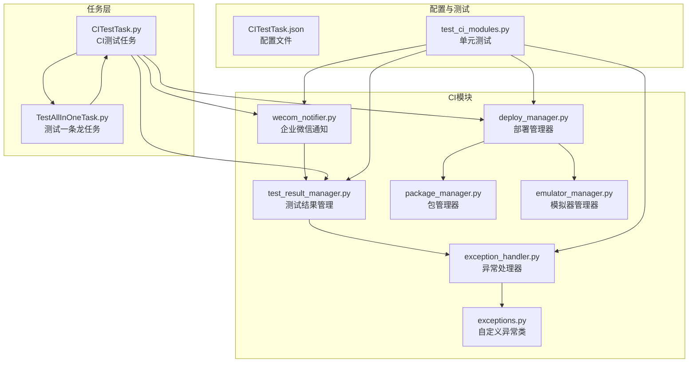
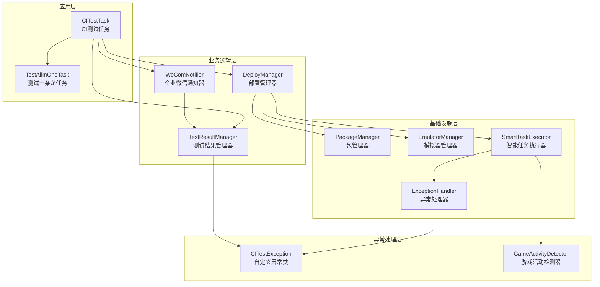
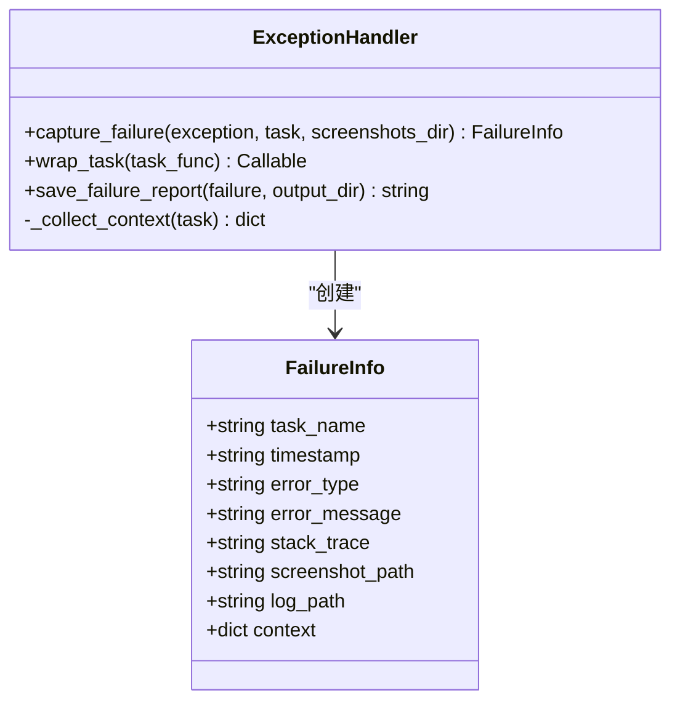
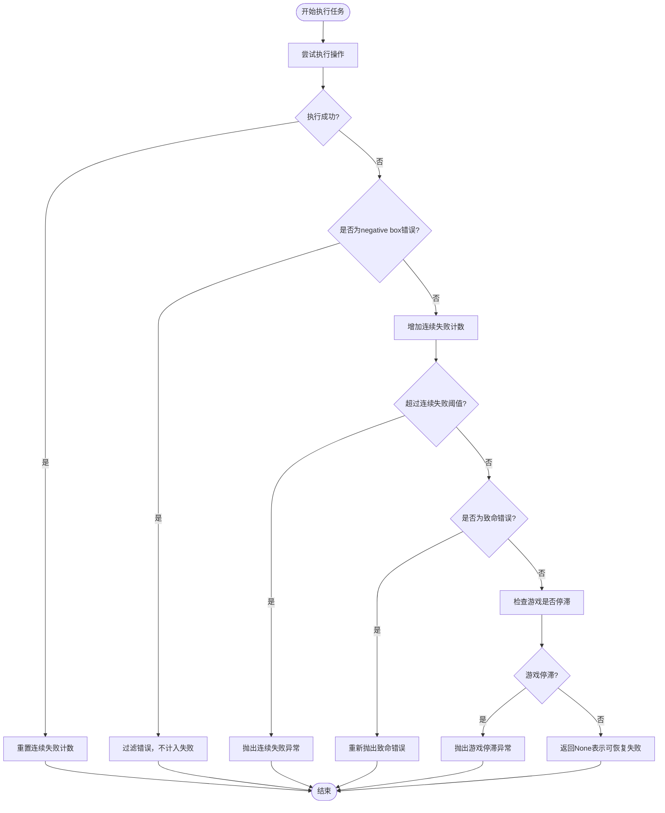
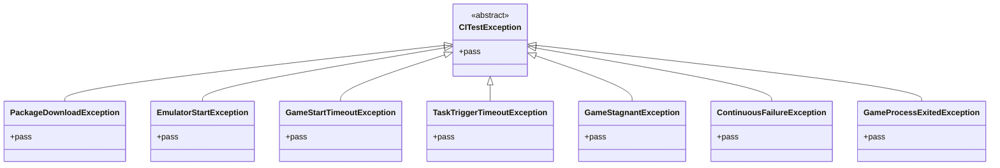
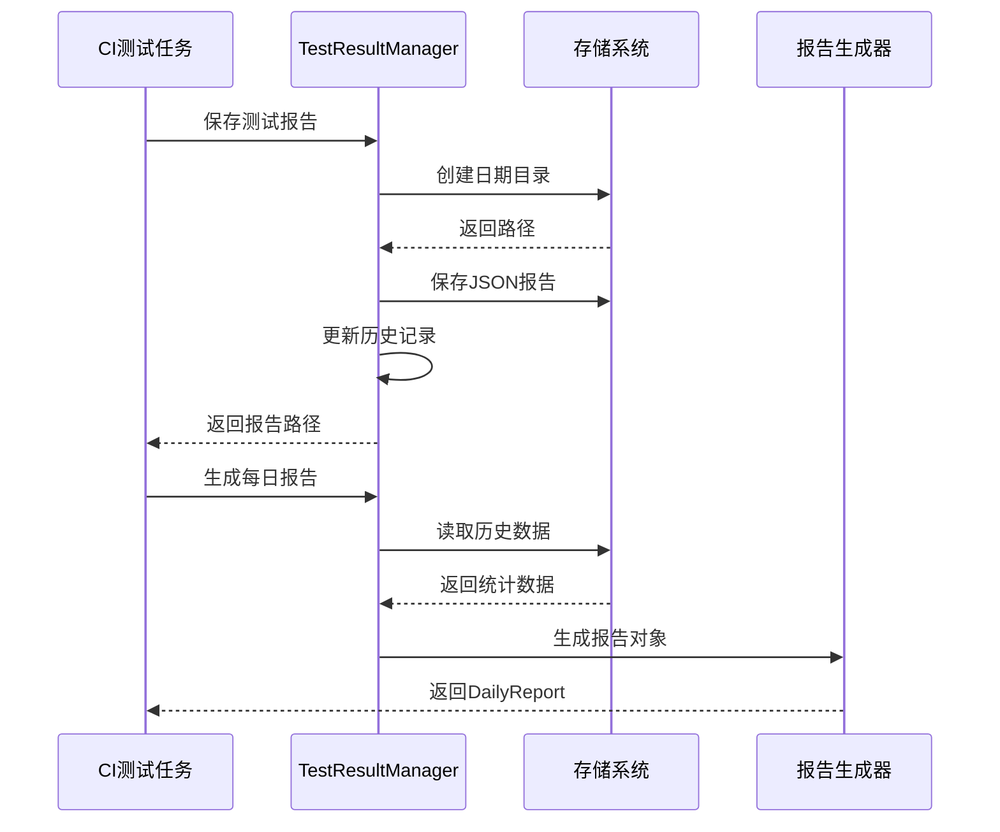
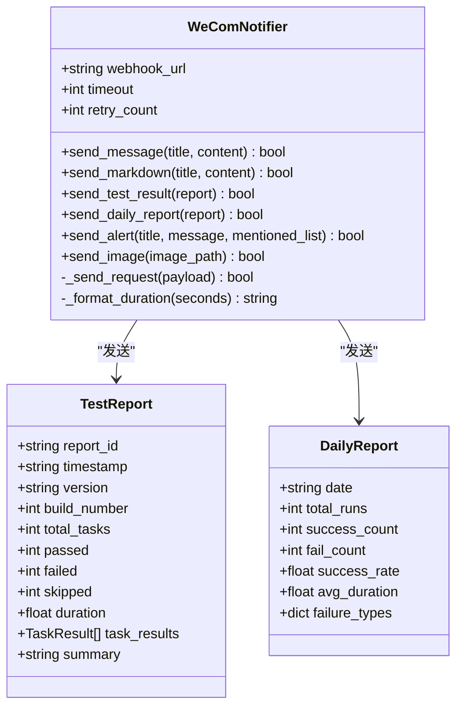
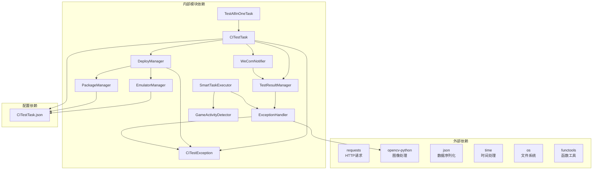

# 异常处理与监控

<cite>
**本文档引用的文件**
- [exception_handler.py](file://src/ci/exception_handler.py)
- [exceptions.py](file://src/ci/exceptions.py)
- [test_result_manager.py](file://src/ci/test_result_manager.py)
- [wecom_notifier.py](file://src/ci/notifier/wecom_notifier.py)
- [deploy_manager.py](file://src/ci/deploy_manager.py)
- [package_manager.py](file://src/ci/package_manager.py)
- [emulator_manager.py](file://src/ci/emulator_manager.py)
- [CITestTask.py](file://src/task/CITestTask.py)
- [TestAllInOneTask.py](file://src/task/TestAllInOneTask.py)
- [test_ci_modules.py](file://tests/test_ci_modules.py)
- [CITestTask.json](file://configs/CITestTask.json)
</cite>

## 目录
1. [简介](#简介)
2. [项目结构](#项目结构)
3. [核心组件](#核心组件)
4. [架构概览](#架构概览)
5. [详细组件分析](#详细组件分析)
6. [依赖分析](#依赖分析)
7. [性能考虑](#性能考虑)
8. [故障排除指南](#故障排除指南)
9. [结论](#结论)
10. [附录](#附录)

## 简介

ok-jump 项目的异常处理与监控系统是一个完整的CI自动化测试框架，专注于游戏自动化测试场景下的异常管理和监控。该系统提供了多层次的异常处理机制，包括全局异常捕获、智能恢复策略、错误分类和处理、以及全面的监控和通知功能。

系统的核心设计理念是"非致命错误继续执行，致命错误及时中断"，通过智能任务执行器和游戏活动检测器来实现对测试过程的实时监控和智能恢复。同时，系统还提供了完整的测试结果管理、失败报告生成、企业微信通知等功能，形成了一个闭环的异常处理和监控体系。

## 项目结构

项目采用模块化的组织方式，异常处理与监控相关的代码主要集中在 `src/ci` 目录下：

**图表来源**
- [exception_handler.py:1-493](file://src/ci/exception_handler.py#L1-L493)
- [test_result_manager.py:1-327](file://src/ci/test_result_manager.py#L1-L327)
- [wecom_notifier.py:1-288](file://src/ci/notifier/wecom_notifier.py#L1-L288)
- [deploy_manager.py:1-428](file://src/ci/deploy_manager.py#L1-L428)

**章节来源**
- [exception_handler.py:1-493](file://src/ci/exception_handler.py#L1-L493)
- [test_result_manager.py:1-327](file://src/ci/test_result_manager.py#L1-L327)
- [wecom_notifier.py:1-288](file://src/ci/notifier/wecom_notifier.py#L1-L288)
- [deploy_manager.py:1-428](file://src/ci/deploy_manager.py#L1-L428)

## 核心组件

### 异常处理器 (ExceptionHandler)

异常处理器是整个异常处理系统的核心，提供了统一的异常捕获和处理机制。其主要功能包括：

- **失败信息捕获**：自动捕获异常信息、截图、日志等上下文数据
- **任务装饰器**：为任务函数提供自动异常捕获和记录功能
- **上下文收集**：收集任务执行时的关键上下文信息
- **报告生成**：生成详细的失败报告，包含错误类型、消息、堆栈跟踪等

### 智能任务执行器 (SmartTaskExecutor)

智能任务执行器实现了复杂的异常处理策略，能够区分不同类型的异常并采取相应的处理措施：

- **非致命错误继续执行**：对于可恢复的错误，系统会尝试自动恢复并继续执行
- **连续失败检测**：监控连续失败次数，超过阈值时中断任务
- **游戏状态监控**：通过帧哈希对比检测游戏画面是否停滞
- **错误分类处理**：区分致命错误、非致命错误和特殊错误（如negative box）

### 自定义异常类 (CITestException)

系统定义了专门用于CI测试的异常类层次结构，每个异常类都有明确的语义和用途：

- **CITestException**：所有CI测试异常的基础类
- **PackageDownloadException**：包下载失败
- **EmulatorStartException**：模拟器启动失败
- **GameStartTimeoutException**：游戏启动超时
- **TaskTriggerTimeoutException**：任务触发超时
- **GameStagnantException**：游戏画面停滞
- **ContinuousFailureException**：连续失败次数过多
- **GameProcessExitedException**：游戏进程意外退出

### 测试结果管理器 (TestResultManager)

测试结果管理器负责测试结果的存储、查询和报告生成：

- **结果持久化**：保存每次测试的完整结果
- **报告生成**：生成测试报告和每日报告
- **历史记录**：维护测试历史记录
- **统计分析**：提供统计数据和趋势分析

### 企业微信通知器 (WeComNotifier)

企业微信通知器提供了完整的通知功能，支持多种通知类型：

- **Markdown消息**：支持富文本格式的通知
- **图片通知**：支持发送失败截图
- **测试报告通知**：自动发送测试结果报告
- **告警通知**：支持紧急告警和@提醒功能

**章节来源**
- [exception_handler.py:331-493](file://src/ci/exception_handler.py#L331-L493)
- [exceptions.py:8-46](file://src/ci/exceptions.py#L8-L46)
- [test_result_manager.py:73-327](file://src/ci/test_result_manager.py#L73-L327)
- [wecom_notifier.py:21-288](file://src/ci/notifier/wecom_notifier.py#L21-L288)

## 架构概览

系统采用分层架构设计，各层职责清晰，耦合度低：

**图表来源**
- [CITestTask.py:26-800](file://src/task/CITestTask.py#L26-L800)
- [deploy_manager.py:38-428](file://src/ci/deploy_manager.py#L38-L428)
- [exception_handler.py:165-329](file://src/ci/exception_handler.py#L165-L329)

系统的核心流程遵循以下模式：

1. **部署阶段**：从Jenkins下载最新APK，启动模拟器，安装游戏
2. **测试阶段**：等待游戏进程启动后触发测试任务
3. **异常处理阶段**：智能异常处理和恢复
4. **结果管理阶段**：保存测试结果，生成报告
5. **通知阶段**：发送企业微信通知

**章节来源**
- [CITestTask.py:146-273](file://src/task/CITestTask.py#L146-L273)
- [deploy_manager.py:123-246](file://src/ci/deploy_manager.py#L123-L246)

## 详细组件分析

### 异常处理器深度分析

#### FailureInfo 数据结构

FailureInfo 是异常处理器的核心数据结构，用于封装完整的失败信息：

**图表来源**
- [exception_handler.py:32-493](file://src/ci/exception_handler.py#L32-L493)

#### 智能任务执行器算法

智能任务执行器实现了复杂的异常处理算法：

**图表来源**
- [exception_handler.py:190-329](file://src/ci/exception_handler.py#L190-L329)

**章节来源**
- [exception_handler.py:165-329](file://src/ci/exception_handler.py#L165-L329)

### 自定义异常类分析

系统定义了完整的异常类层次结构，每个异常类都有明确的用途：

**图表来源**
- [exceptions.py:8-46](file://src/ci/exceptions.py#L8-L46)

这些异常类在不同的场景中发挥重要作用：

- **部署阶段异常**：PackageDownloadException、EmulatorStartException
- **运行时异常**：GameStartTimeoutException、GameProcessExitedException
- **任务控制异常**：TaskTriggerTimeoutException、ContinuousFailureException
- **游戏状态异常**：GameStagnantException

**章节来源**
- [exceptions.py:8-46](file://src/ci/exceptions.py#L8-L46)

### 测试结果管理器分析

测试结果管理器提供了完整的测试结果生命周期管理：

**图表来源**
- [test_result_manager.py:102-214](file://src/ci/test_result_manager.py#L102-L214)

**章节来源**
- [test_result_manager.py:73-327](file://src/ci/test_result_manager.py#L73-L327)

### 企业微信通知器分析

企业微信通知器提供了灵活的通知机制：

**图表来源**
- [wecom_notifier.py:21-288](file://src/ci/notifier/wecom_notifier.py#L21-L288)

**章节来源**
- [wecom_notifier.py:21-288](file://src/ci/notifier/wecom_notifier.py#L21-L288)

## 依赖分析

系统采用了清晰的依赖关系设计，各模块之间的耦合度较低：

**图表来源**
- [exception_handler.py:10-26](file://src/ci/exception_handler.py#L10-L26)
- [deploy_manager.py:14-22](file://src/ci/deploy_manager.py#L14-L22)

**章节来源**
- [exception_handler.py:10-26](file://src/ci/exception_handler.py#L10-L26)
- [deploy_manager.py:14-22](file://src/ci/deploy_manager.py#L14-L22)

## 性能考虑

### 异常处理性能优化

系统在异常处理方面采用了多项性能优化策略：

1. **异步异常处理**：使用装饰器模式避免阻塞主线程
2. **智能重试机制**：根据异常类型决定是否重试，减少不必要的重试
3. **内存管理**：及时清理临时文件和缓存数据
4. **网络请求优化**：使用连接池和超时控制

### 监控指标建议

为了更好地监控系统性能，建议设置以下关键指标：

- **异常率**：每小时异常次数与总操作次数的比例
- **恢复成功率**：非致命错误成功恢复的比例
- **平均恢复时间**：从异常发生到恢复正常的时间
- **连续失败次数**：连续失败的最大次数
- **游戏停滞检测率**：正确检测游戏停滞的比例
- **通知发送成功率**：企业微信通知成功发送的比例

## 故障排除指南

### 常见异常类型及处理

#### 部署阶段异常

| 异常类型 | 可能原因 | 处理建议 |
|---------|---------|---------|
| PackageDownloadException | Jenkins连接失败、网络超时 | 检查Jenkins服务器状态，验证网络连接 |
| EmulatorStartException | 模拟器路径错误、权限不足 | 验证模拟器安装路径，检查管理员权限 |
| GameStartTimeoutException | 游戏启动缓慢、资源不足 | 增加启动超时时间，释放系统资源 |

#### 运行时异常

| 异常类型 | 可能原因 | 处理建议 |
|---------|---------|---------|
| GameProcessExitedException | 游戏崩溃、模拟器异常 | 检查游戏包完整性，重启模拟器 |
| GameStagnantException | 游戏卡死、界面无响应 | 检查游戏逻辑，增加超时时间 |
| ContinuousFailureException | 系统不稳定、配置错误 | 检查配置文件，修复系统问题 |

#### 通知异常

| 异常类型 | 可能原因 | 处理建议 |
|---------|---------|---------|
| WeComNotifier异常 | Webhook配置错误、网络问题 | 验证Webhook URL，检查网络连接 |
| 文件写入异常 | 权限不足、磁盘空间不足 | 检查文件权限，清理磁盘空间 |

### 调试技巧

1. **启用详细日志**：在开发环境中启用DEBUG级别日志
2. **截图保存**：确保异常时能够保存截图用于分析
3. **堆栈跟踪**：保留完整的堆栈信息便于问题定位
4. **环境隔离**：使用独立的测试环境避免干扰

**章节来源**
- [test_ci_modules.py:248-469](file://tests/test_ci_modules.py#L248-L469)

## 结论

ok-jump项目的异常处理与监控系统是一个设计精良、功能完备的自动化测试框架。系统通过多层次的异常处理机制、智能的恢复策略、完整的监控和通知功能，为游戏自动化测试提供了可靠的保障。

系统的主要优势包括：

1. **智能异常处理**：能够区分不同类型异常并采取相应处理策略
2. **完整的监控体系**：从异常捕获到通知发送形成闭环
3. **灵活的配置管理**：支持多种配置方式满足不同需求
4. **良好的扩展性**：模块化设计便于功能扩展和维护

通过持续优化和改进，该系统能够为游戏自动化测试提供更加稳定和高效的支撑。

## 附录

### 最佳实践建议

1. **异常分类策略**：建立清晰的异常分类标准，确保处理的一致性
2. **监控指标设置**：定期监控关键指标，及时发现潜在问题
3. **日志管理**：建立规范的日志管理策略，便于问题排查
4. **备份策略**：定期备份重要数据，防止数据丢失
5. **安全考虑**：保护敏感信息，如Webhook URL、账号密码等

### 配置参考

系统的关键配置项包括：

- **Jenkins服务器地址**：Jenkins服务器的访问地址
- **模拟器路径**：雷电模拟器的安装路径
- **企业微信Webhook**：企业微信机器人的Webhook URL
- **超时配置**：各种操作的超时时间设置
- **重试配置**：失败后的重试次数和间隔时间

**章节来源**
- [CITestTask.json:1-29](file://configs/CITestTask.json#L1-L29)