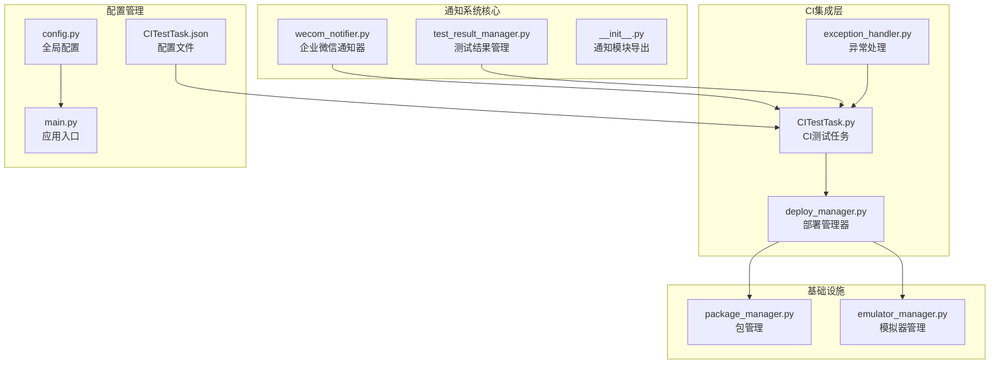
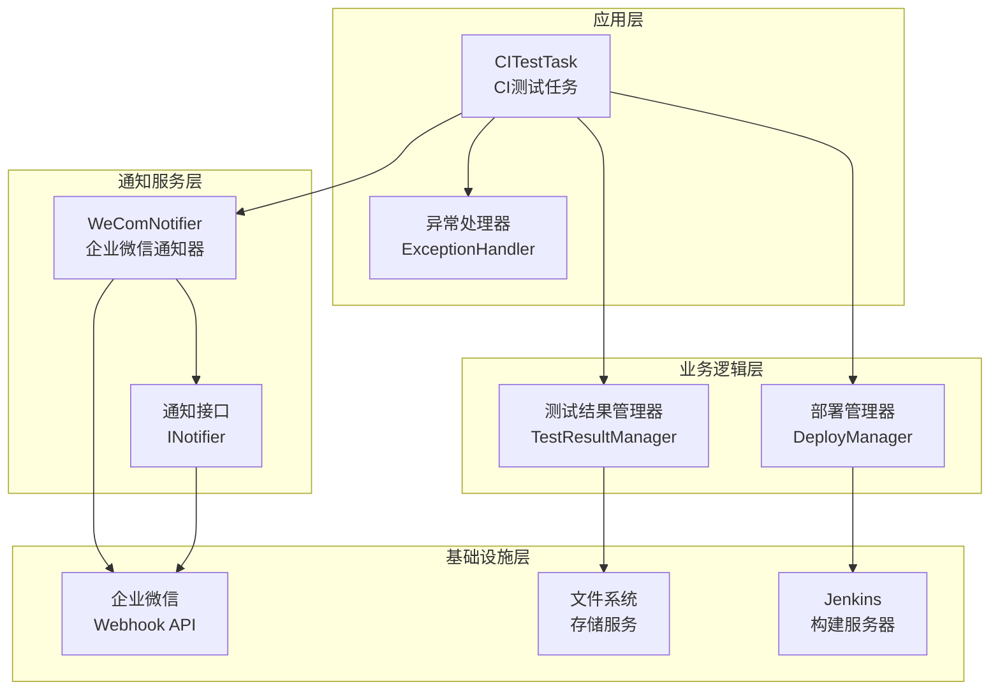
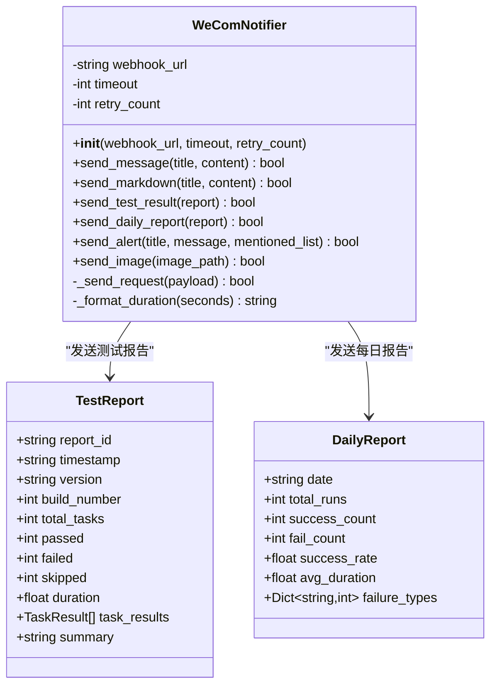
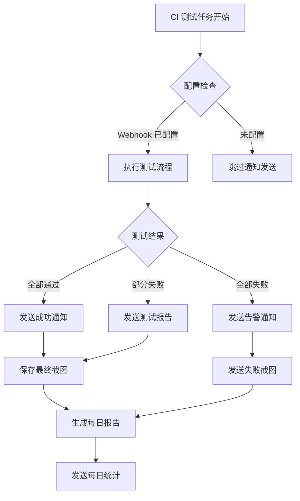
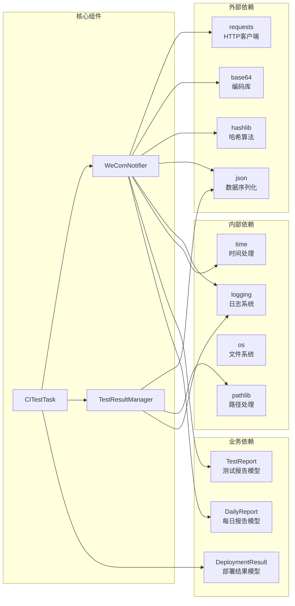

# 通知系统集成

<cite>
**本文档引用的文件**
- [wecom_notifier.py](file://src/ci/notifier/wecom_notifier.py)
- [test_result_manager.py](file://src/ci/test_result_manager.py)
- [CITestTask.py](file://src/task/CITestTask.py)
- [CITestTask.json](file://configs/CITestTask.json)
- [main.py](file://main.py)
- [config.py](file://config.py)
- [deploy_manager.py](file://src/ci/deploy_manager.py)
- [exception_handler.py](file://src/ci/exception_handler.py)
- [package_manager.py](file://src/ci/package_manager.py)
- [emulator_manager.py](file://src/ci/emulator_manager.py)
- [__init__.py](file://src/ci/__init__.py)
</cite>

## 目录
1. [简介](#简介)
2. [项目结构](#项目结构)
3. [核心组件](#核心组件)
4. [架构概览](#架构概览)
5. [详细组件分析](#详细组件分析)
6. [依赖关系分析](#依赖关系分析)
7. [性能考虑](#性能考虑)
8. [故障排除指南](#故障排除指南)
9. [结论](#结论)
10. [附录](#附录)

## 简介

ok-jump 项目的通知系统是一个基于企业微信机器人的完整通知解决方案。该系统实现了 CI/CD 流水线中的自动化通知功能，能够实时推送测试结果、异常告警和每日报告。

通知系统的核心价值在于：
- **自动化程度高**：从部署到测试再到通知的全流程自动化
- **多场景覆盖**：支持构建成功/失败通知、测试结果通知、异常告警通知
- **企业级集成**：深度集成企业微信，支持 Markdown 格式和图片消息
- **可靠性保障**：内置重试机制和错误处理

## 项目结构

通知系统在项目中的组织结构如下：



**图表来源**
- [wecom_notifier.py:1-288](file://src/ci/notifier/wecom_notifier.py#L1-L288)
- [CITestTask.py:1-1036](file://src/task/CITestTask.py#L1-L1036)
- [CITestTask.json:1-29](file://configs/CITestTask.json#L1-L29)

**章节来源**
- [wecom_notifier.py:1-288](file://src/ci/notifier/wecom_notifier.py#L1-L288)
- [CITestTask.py:1-200](file://src/task/CITestTask.py#L1-L200)
- [CITestTask.json:1-29](file://configs/CITestTask.json#L1-L29)

## 核心组件

### 企业微信通知器 (WeComNotifier)

WeComNotifier 是通知系统的核心组件，提供了完整的企业微信集成能力：

**主要功能特性：**
- **Markdown 消息支持**：支持富文本格式的通知内容
- **图片消息发送**：自动上传失败截图作为通知附件
- **多类型通知**：测试报告、每日报告、告警通知
- **重试机制**：内置网络请求重试逻辑
- **超时控制**：可配置的请求超时时间

**核心方法：**
- `send_message()`: 发送文本消息
- `send_markdown()`: 发送 Markdown 格式消息
- `send_test_result()`: 发送测试结果报告
- `send_daily_report()`: 发送每日统计报告
- `send_alert()`: 发送告警通知
- `send_image()`: 发送图片消息

**章节来源**
- [wecom_notifier.py:21-288](file://src/ci/notifier/wecom_notifier.py#L21-L288)

### 测试结果管理器 (TestResultManager)

TestResultManager 负责测试结果的存储、管理和报告生成：

**数据模型：**
- `TaskResult`: 单个任务的执行结果
- `TestReport`: 完整的测试报告
- `DailyReport`: 每日统计报告

**核心功能：**
- 测试结果持久化存储
- 历史记录查询和管理
- 每日报告自动生成
- 统计数据分析

**章节来源**
- [test_result_manager.py:22-327](file://src/ci/test_result_manager.py#L22-L327)

### CI 测试任务 (CITestTask)

CITestTask 集成了完整的 CI/CD 流水线，包括通知系统的调用：

**关键流程：**
1. 部署阶段：从 Jenkins 下载 APK，启动模拟器
2. 测试阶段：执行自动化测试任务
3. 结果处理：保存测试报告
4. 通知阶段：发送企业微信通知

**配置参数：**
- 企业微信 Webhook 地址
- 连续失败阈值
- 任务触发延迟
- 定时执行配置

**章节来源**
- [CITestTask.py:26-200](file://src/task/CITestTask.py#L26-L200)
- [CITestTask.py:505-568](file://src/task/CITestTask.py#L505-L568)

## 架构概览

通知系统的整体架构采用分层设计，确保了模块间的松耦合和高内聚：



**图表来源**
- [CITestTask.py:146-200](file://src/task/CITestTask.py#L146-L200)
- [deploy_manager.py:38-55](file://src/ci/deploy_manager.py#L38-L55)
- [wecom_notifier.py:21-53](file://src/ci/notifier/wecom_notifier.py#L21-L53)

**章节来源**
- [CITestTask.py:146-200](file://src/task/CITestTask.py#L146-L200)
- [deploy_manager.py:38-55](file://src/ci/deploy_manager.py#L38-L55)

## 详细组件分析

### 企业微信通知器实现

WeComNotifier 采用了面向对象的设计模式，提供了清晰的接口和完善的错误处理机制：



**图表来源**
- [wecom_notifier.py:21-288](file://src/ci/notifier/wecom_notifier.py#L21-L288)
- [test_result_manager.py:40-71](file://src/ci/test_result_manager.py#L40-L71)

#### 发送策略分析

通知器实现了多种发送策略以适应不同的通知场景：

**1. 测试结果通知策略**
- 自动检测测试状态（通过/失败）
- 格式化详细的测试统计信息
- 包含失败任务的详细错误信息
- 支持失败截图的自动上传

**2. 告警通知策略**
- 支持 @ 指定人员提醒
- 紧急告警的特殊标识
- 可配置的重试机制

**3. 图片通知策略**
- 自动 Base64 编码图片
- MD5 校验确保图片完整性
- 异常情况下的优雅降级

**章节来源**
- [wecom_notifier.py:87-190](file://src/ci/notifier/wecom_notifier.py#L87-L190)

### 通知触发条件

通知系统的触发条件设计得非常灵活，能够适应不同的业务场景：



**图表来源**
- [CITestTask.py:505-568](file://src/task/CITestTask.py#L505-L568)
- [wecom_notifier.py:87-134](file://src/ci/notifier/wecom_notifier.py#L87-L134)

**章节来源**
- [CITestTask.py:505-568](file://src/task/CITestTask.py#L505-L568)

### 消息模板设计

通知系统提供了多种消息模板以满足不同的通知需求：

#### 测试报告模板
```
📊 CI测试报告
版本: v{version} (#{build_number})
状态: {status_icon}
耗时: {duration}
────────────────────────────────
任务统计 ({passed}/{total_tasks} 通过):
{task_details}
────────────────────────────────
{failure_details}
```

#### 告警通知模板
```
🚨 测试告警
⚠️ **{title}**

{message}

{mentions}
```

#### 每日报告模板
```
📊 每日测试报告
日期: {date}
总运行次数: {total_runs}
成功次数: {success_count}
失败次数: {fail_count}
成功率: {success_rate}%
平均耗时: {avg_duration}
────────────────────────────────
{failure_stats}
```

**章节来源**
- [wecom_notifier.py:87-163](file://src/ci/notifier/wecom_notifier.py#L87-L163)

## 依赖关系分析

通知系统的依赖关系清晰明确，遵循了依赖倒置原则：



**图表来源**
- [wecom_notifier.py:7-15](file://src/ci/notifier/wecom_notifier.py#L7-L15)
- [test_result_manager.py:7-16](file://src/ci/test_result_manager.py#L7-L16)
- [CITestTask.py:17-20](file://src/task/CITestTask.py#L17-L20)

**章节来源**
- [wecom_notifier.py:7-15](file://src/ci/notifier/wecom_notifier.py#L7-L15)
- [test_result_manager.py:7-16](file://src/ci/test_result_manager.py#L7-L16)

## 性能考虑

通知系统在设计时充分考虑了性能优化：

### 网络请求优化
- **超时控制**：默认 30 秒超时，防止阻塞整个测试流程
- **重试机制**：最多 3 次重试，指数退避策略
- **连接复用**：使用 HTTP 客户端的连接池管理

### 内存使用优化
- **流式下载**：APK 下载采用流式处理，避免内存峰值
- **图片处理**：图片发送前进行 Base64 编码，减少传输开销
- **数据结构**：使用 dataclass 减少内存占用

### 并发处理
- **异步通知**：通知发送不影响主测试流程
- **批量处理**：支持多个通知同时排队处理

## 故障排除指南

### 常见问题及解决方案

#### 1. 企业微信 Webhook 配置问题
**症状**：通知发送失败，日志显示 "未配置企业微信Webhook URL"

**解决方案**：
- 检查 `configs/CITestTask.json` 中的 `企业微信Webhook` 配置项
- 确认 Webhook URL 格式正确
- 验证网络连通性和防火墙设置

#### 2. 通知发送超时
**症状**：通知发送超时，日志显示请求超时

**解决方案**：
- 增加 `timeout` 参数值（秒）
- 检查企业微信服务器状态
- 调整网络环境或代理设置

#### 3. 图片发送失败
**症状**：图片消息发送失败，日志显示编码错误

**解决方案**：
- 检查图片文件路径和权限
- 验证图片格式和大小限制
- 确认磁盘空间充足

#### 4. 连续失败告警
**症状**：触发连续失败告警通知

**解决方案**：
- 检查 `连续失败阈值` 配置
- 分析失败原因并修复
- 调整测试环境稳定性

**章节来源**
- [wecom_notifier.py:237-265](file://src/ci/notifier/wecom_notifier.py#L237-L265)
- [CITestTask.py:557-568](file://src/task/CITestTask.py#L557-L568)

### 日志分析

通知系统的日志级别设计合理，便于问题诊断：

**日志级别说明：**
- **INFO**：通知发送成功、流程状态
- **WARNING**：配置警告、网络问题
- **ERROR**：严重错误、系统异常

**关键日志字段：**
- `企业微信通知发送成功/失败`
- `未配置企业微信Webhook URL`
- `发送图片失败`

## 结论

ok-jump 项目的通知系统是一个设计精良的企业级通知解决方案。其特点包括：

**技术优势：**
- 完整的 CI/CD 集成，自动化程度高
- 灵活的消息模板和多种通知类型
- 健壮的错误处理和重试机制
- 清晰的架构设计和模块分离

**业务价值：**
- 提高开发团队的协作效率
- 加速问题定位和解决过程
- 提供完整的测试过程可视化
- 支持持续改进的反馈机制

**扩展潜力：**
系统设计支持轻松添加新的通知渠道和自定义消息格式，为未来的业务发展提供了良好的基础。

## 附录

### 配置参考

#### 企业微信 Webhook 配置
```json
{
    "企业微信Webhook": "https://qyapi.weixin.qq.com/cgi-bin/webhook/send?key=YOUR_WEBHOOK_KEY"
}
```

#### 通知相关配置参数
- `timeout`: 请求超时时间（秒）
- `retry_count`: 重试次数
- `mentioned_list`: @人员列表
- `连续失败阈值`: 连续失败触发告警的阈值

### API 接口参考

#### WeComNotifier 主要接口
- `send_message(title, content)`: 发送文本消息
- `send_markdown(title, content)`: 发送 Markdown 消息
- `send_test_result(report)`: 发送测试报告
- `send_daily_report(report)`: 发送每日报告
- `send_alert(title, message, mentioned_list)`: 发送告警通知
- `send_image(image_path)`: 发送图片消息

### 扩展指南

#### 添加新的通知渠道
1. 创建新的通知器类，继承基础通知接口
2. 实现必要的发送方法
3. 在 `__init__.py` 中导出新类
4. 在 CI 任务中集成新通知器

#### 自定义消息格式
1. 修改对应的通知方法中的消息构建逻辑
2. 更新消息模板和样式
3. 测试新格式的兼容性

#### 批量通知功能
1. 实现批量消息队列管理
2. 添加并发处理机制
3. 优化性能和资源使用