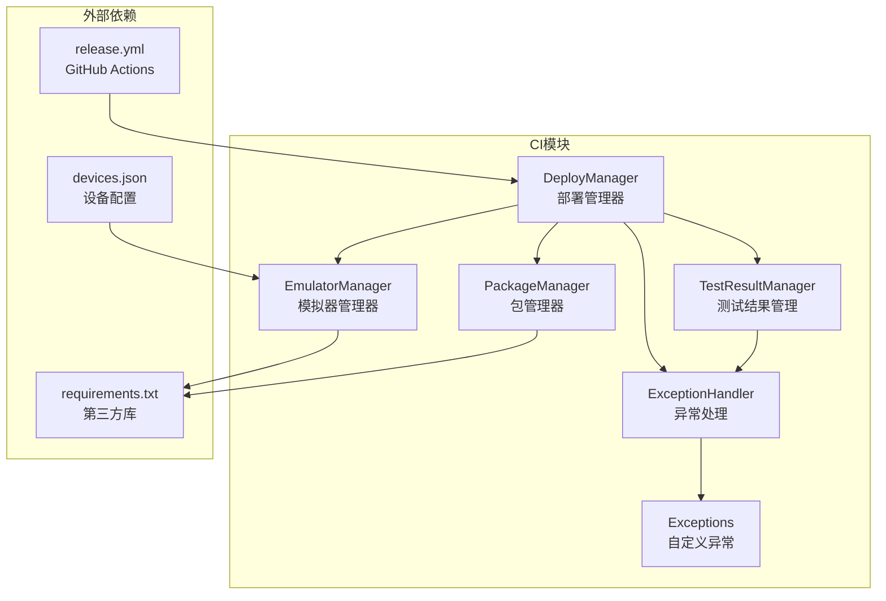
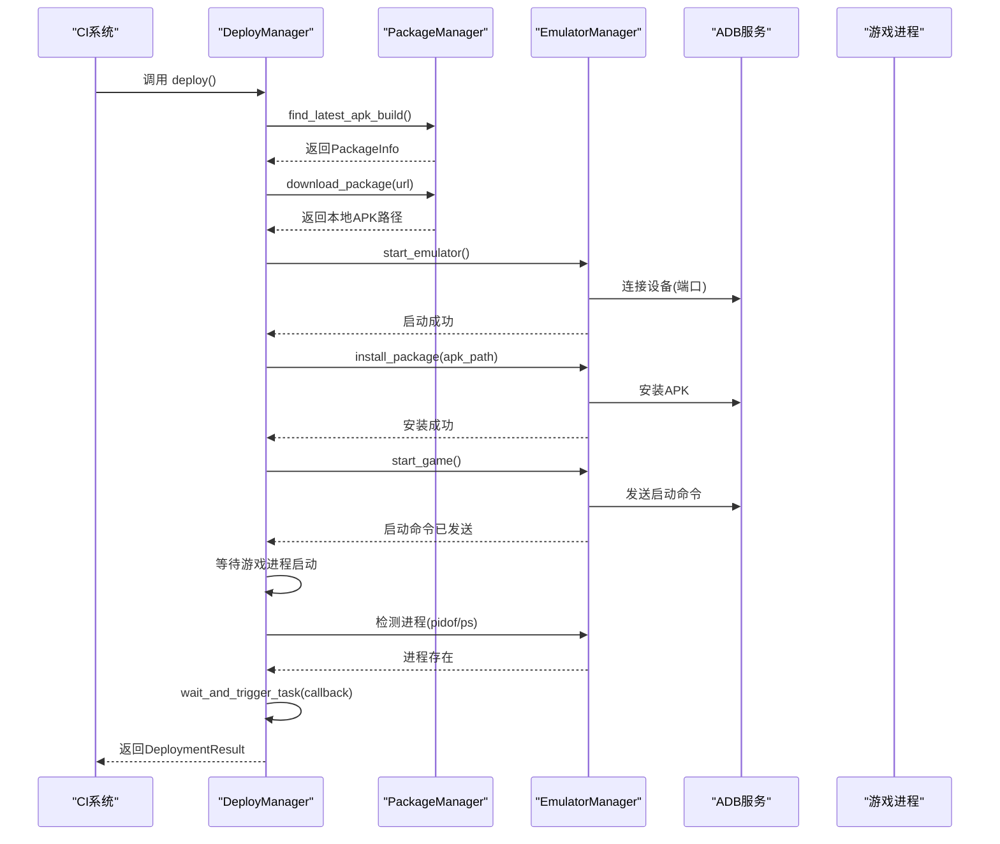
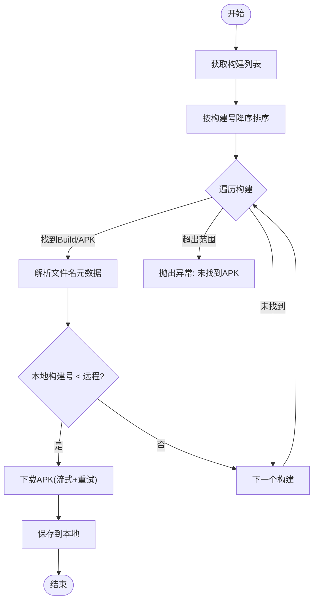
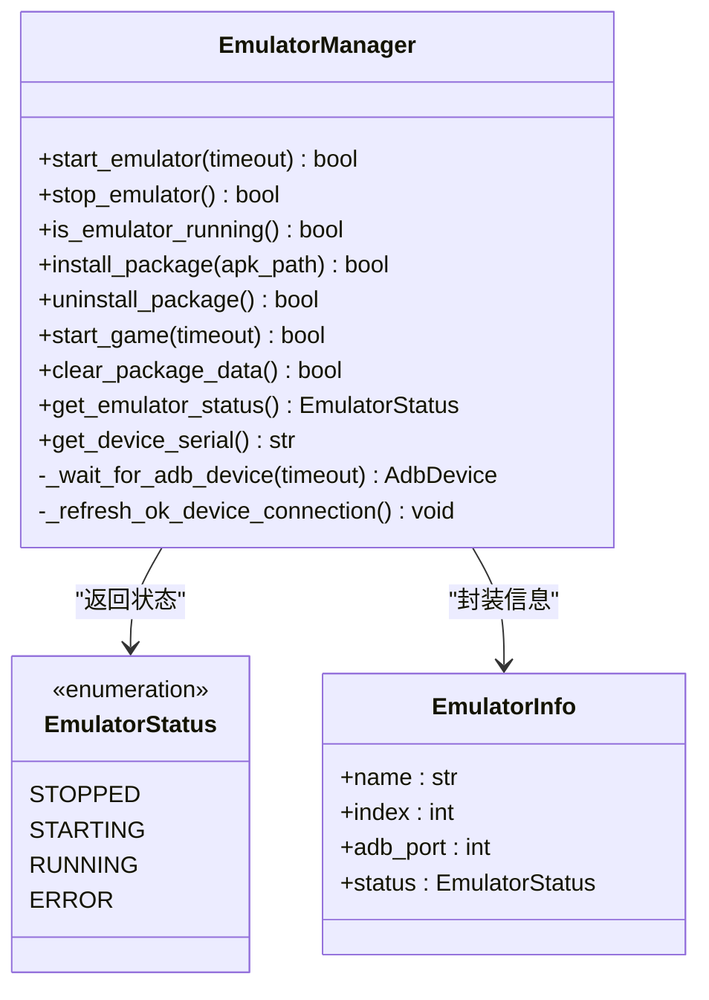
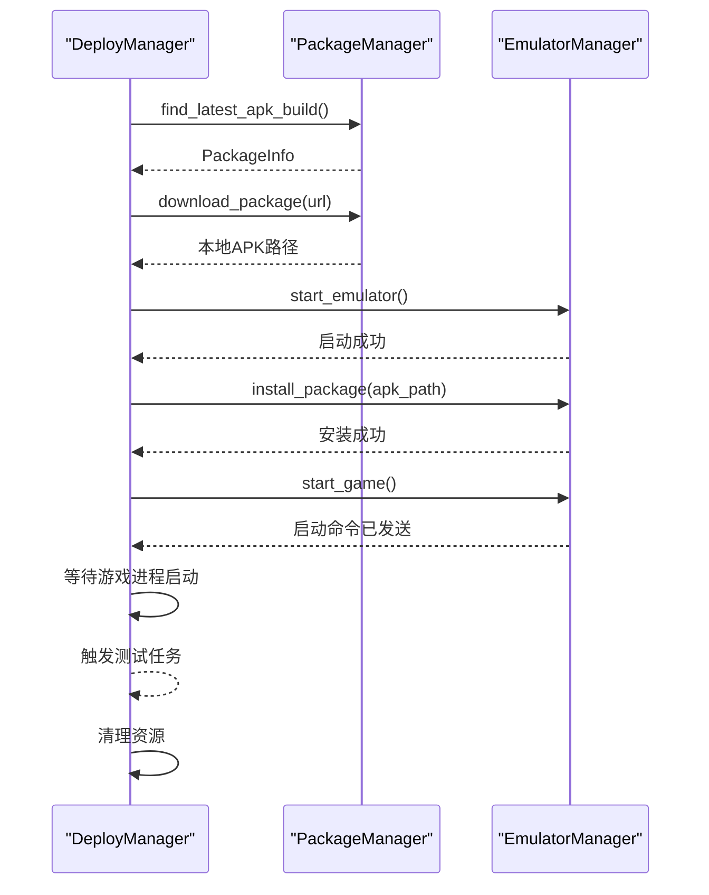
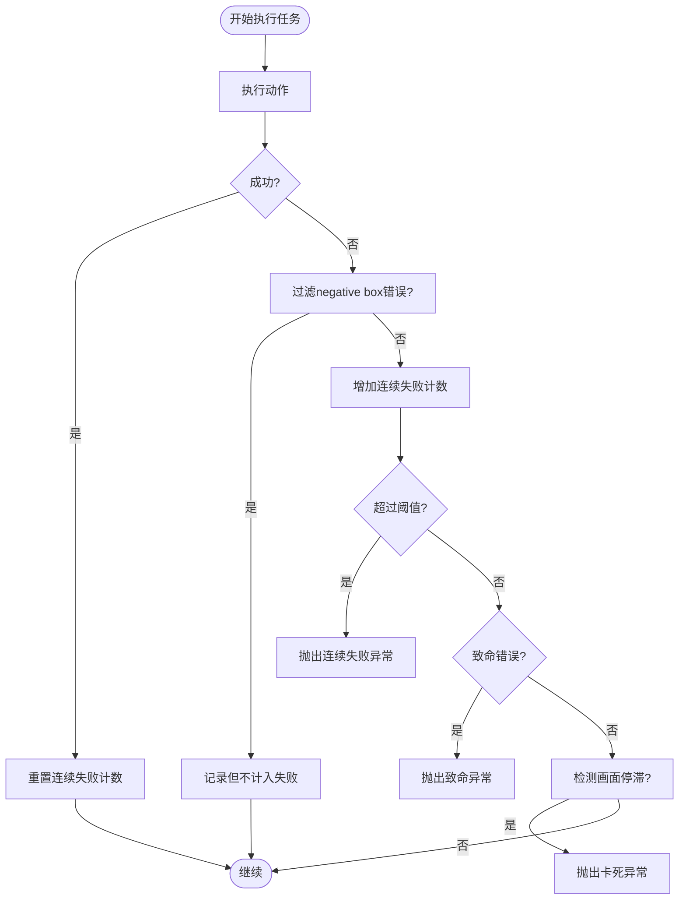
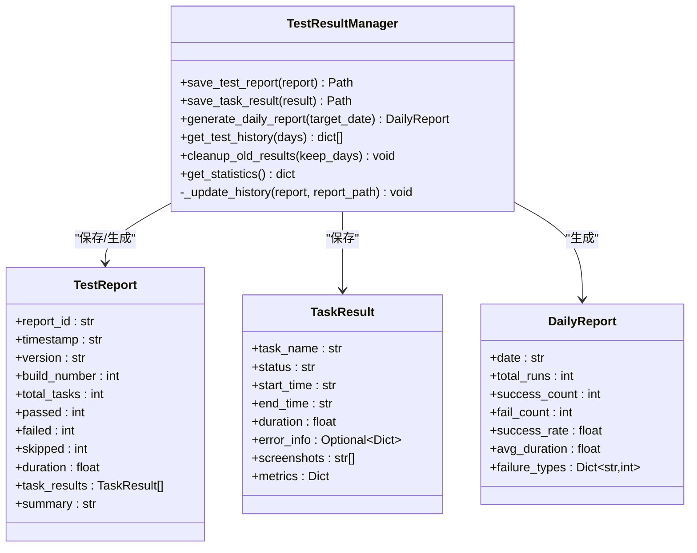
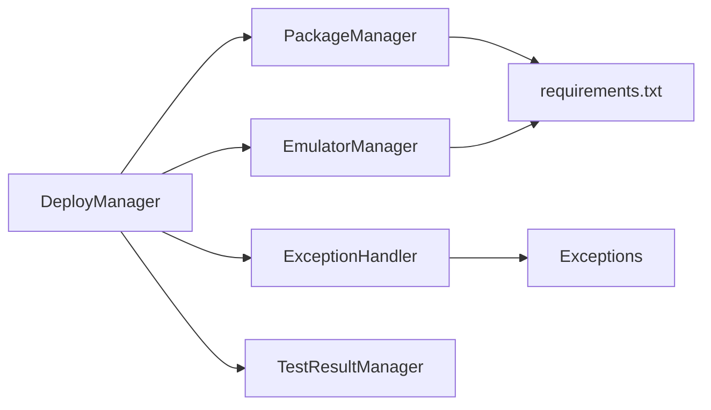

# 部署管理

<cite>
**本文引用的文件**
- [src/ci/deploy_manager.py](file://src/ci/deploy_manager.py)
- [src/ci/emulator_manager.py](file://src/ci/emulator_manager.py)
- [src/ci/package_manager.py](file://src/ci/package_manager.py)
- [src/ci/exception_handler.py](file://src/ci/exception_handler.py)
- [src/ci/exceptions.py](file://src/ci/exceptions.py)
- [src/ci/test_result_manager.py](file://src/ci/test_result_manager.py)
- [configs/devices.json](file://configs/devices.json)
- [requirements.txt](file://requirements.txt)
- [tests/test_ci_modules.py](file://tests/test_ci_modules.py)
- [.github/workflows/release.yml](file://.github/workflows/release.yml)
- [README.md](file://README.md)
</cite>

## 目录
1. [简介](#简介)
2. [项目结构](#项目结构)
3. [核心组件](#核心组件)
4. [架构总览](#架构总览)
5. [详细组件分析](#详细组件分析)
6. [依赖分析](#依赖分析)
7. [性能考量](#性能考量)
8. [故障排除指南](#故障排除指南)
9. [结论](#结论)
10. [附录](#附录)

## 简介
本文件面向运维与开发人员，系统化梳理 ok-jump 项目的部署管理系统，覆盖以下主题：
- 部署管理器的完整流程：从 Jenkins 获取最新 APK、启动雷电模拟器、安装与启动游戏、触发自动化测试任务、清理与收尾。
- 包管理器的实现细节：Jenkins REST API 调用、构建检索、APK 文件名解析、版本比较与去重下载、本地缓存清理。
- 模拟器管理器的功能：模拟器启动/关闭、ADB 设备检测、APK 安装、游戏启动、数据清理、状态查询。
- 异常处理与恢复：非致命错误继续执行、连续失败阈值、游戏画面停滞检测、失败截图与报告生成。
- 测试结果管理：测试报告结构、每日汇总、历史记录与统计、数据清理策略。
- 部署策略最佳实践：蓝绿部署、灰度发布、回滚机制的落地建议与注意事项。
- 运维实用指南：常见问题定位、日志与截图收集、环境准备与清理。

## 项目结构
ok-jump 的 CI/CD 与部署相关代码集中在 src/ci 目录，配合测试与配置文件共同构成完整的自动化测试与部署体系。

图表来源
- [src/ci/package_manager.py:37-380](file://src/ci/package_manager.py#L37-L380)
- [src/ci/emulator_manager.py:39-457](file://src/ci/emulator_manager.py#L39-L457)
- [src/ci/deploy_manager.py:38-428](file://src/ci/deploy_manager.py#L38-L428)
- [src/ci/exception_handler.py:331-493](file://src/ci/exception_handler.py#L331-L493)
- [src/ci/test_result_manager.py:73-327](file://src/ci/test_result_manager.py#L73-L327)
- [configs/devices.json:1-7](file://configs/devices.json#L1-L7)
- [.github/workflows/release.yml:1-65](file://.github/workflows/release.yml#L1-L65)

章节来源
- [README.md:1-8](file://README.md#L1-L8)
- [requirements.txt:1-17](file://requirements.txt#L1-L17)
- [configs/devices.json:1-7](file://configs/devices.json#L1-L7)
- [.github/workflows/release.yml:1-65](file://.github/workflows/release.yml#L1-L65)

## 核心组件
- 包管理器（PackageManager）：负责从 Jenkins 获取构建列表、筛选含 APK 的构建、解析版本信息、下载 APK、版本比较与去重、清理旧版本。
- 模拟器管理器（EmulatorManager）：负责启动/关闭模拟器、检测 ADB 设备、安装/卸载游戏包、启动游戏、清理应用数据、查询状态。
- 部署管理器（DeployManager）：编排完整部署流程，串联包管理器与模拟器管理器，等待游戏进程、触发测试任务、异常处理与清理。
- 异常处理（ExceptionHandler）：统一捕获异常、智能恢复、连续失败与画面停滞检测、失败截图与报告生成。
- 测试结果管理（TestResultManager）：保存测试报告、生成每日汇总、维护历史记录、清理旧数据。
- 自定义异常（Exceptions）：定义 CI 测试场景下的专用异常类型，便于上层统一处理。

章节来源
- [src/ci/package_manager.py:37-380](file://src/ci/package_manager.py#L37-L380)
- [src/ci/emulator_manager.py:39-457](file://src/ci/emulator_manager.py#L39-L457)
- [src/ci/deploy_manager.py:38-428](file://src/ci/deploy_manager.py#L38-L428)
- [src/ci/exception_handler.py:331-493](file://src/ci/exception_handler.py#L331-L493)
- [src/ci/test_result_manager.py:73-327](file://src/ci/test_result_manager.py#L73-L327)
- [src/ci/exceptions.py:8-46](file://src/ci/exceptions.py#L8-L46)

## 架构总览
下面的序列图展示了从 Jenkins 获取 APK、启动模拟器、安装与启动游戏、等待进程、触发测试任务的整体流程。

图表来源
- [src/ci/deploy_manager.py:123-246](file://src/ci/deploy_manager.py#L123-L246)
- [src/ci/package_manager.py:86-158](file://src/ci/package_manager.py#L86-L158)
- [src/ci/emulator_manager.py:276-413](file://src/ci/emulator_manager.py#L276-L413)

## 详细组件分析

### 包管理器（PackageManager）
- 职责
  - 通过 Jenkins REST API 获取构建列表与产物，筛选 Build 文件夹下的 APK。
  - 解析 APK 文件名，提取版本号、构建号、SVN 版本号、版本码、日期等元数据。
  - 对比本地与远程构建号，避免重复下载。
  - 流式下载 APK，支持断点续传与重试；按时间清理旧版本 APK。
- 关键算法
  - 构建搜索：从最新构建开始向下遍历，限定最大搜索范围。
  - 文件名解析：基于固定命名规则的字段识别与提取。
  - 版本比较：以构建号为依据，决定是否需要更新。
- 复杂度
  - 搜索构建：O(k)，k 为 max_builds_to_search。
  - 文件名解析：O(n)，n 为字段数量（线性扫描）。
  - 下载：流式写入，内存占用低，受网络与磁盘 I/O 影响。
- 优化点
  - 可引入 CDN 或镜像源加速下载。
  - 增加校验和（如 SHA256）确保下载完整性。
  - 并行下载多个候选构建以缩短等待时间（需谨慎控制并发）。

图表来源
- [src/ci/package_manager.py:86-158](file://src/ci/package_manager.py#L86-L158)
- [src/ci/package_manager.py:207-257](file://src/ci/package_manager.py#L207-L257)
- [src/ci/package_manager.py:259-309](file://src/ci/package_manager.py#L259-L309)

章节来源
- [src/ci/package_manager.py:37-380](file://src/ci/package_manager.py#L37-L380)

### 模拟器管理器（EmulatorManager）
- 职责
  - 启动/关闭雷电模拟器，支持 ldconsole 与直接启动两种方式。
  - 检测模拟器运行状态，优先使用 ldconsole，其次 ADB 设备列表。
  - 通过 adbutils 安装/卸载游戏包，启动游戏，清理应用数据。
  - 刷新 ok 框架的设备连接，确保后续自动化任务可用。
- 关键流程
  - 启动：先检查是否已运行，再尝试 ldconsole 启动或直接启动 dnplayer，等待稳定后刷新设备连接。
  - ADB 设备检测：支持 emulator-{port} 与 127.0.0.1:{port} 两种序列号格式。
  - 安装：等待 ADB 设备就绪，使用 install 命令并启用卸载重装与测试标志。
  - 启动：通过 monkey 命令启动游戏主 Activity。
- 复杂度
  - 启动等待：O(t)，t 为超时时间。
  - ADB 设备检测：O(n)，n 为设备数量。
  - 安装/启动：受 ADB 响应与系统性能影响。

图表来源
- [src/ci/emulator_manager.py:22-457](file://src/ci/emulator_manager.py#L22-L457)

章节来源
- [src/ci/emulator_manager.py:39-457](file://src/ci/emulator_manager.py#L39-L457)

### 部署管理器（DeployManager）
- 职责
  - 编排完整部署流程：下载 APK、启动模拟器、安装 APK、启动游戏、等待进程、触发测试任务、清理。
  - 统一异常处理与超时控制，提供任务触发与等待机制。
  - 提供状态查询与清理接口，便于运维与 CI 系统集成。
- 关键流程
  - deploy：按步骤执行，任一步失败即返回 DeploymentResult，记录错误与耗时。
  - wait_and_trigger_task：等待延迟时间后触发回调，期间持续监控游戏进程，超时或进程退出抛出相应异常。
  - 清理：关闭模拟器、清理旧 APK。
- 复杂度
  - 主流程受超时参数与网络/IO 影响，整体 O(T)。

图表来源
- [src/ci/deploy_manager.py:123-246](file://src/ci/deploy_manager.py#L123-L246)
- [src/ci/deploy_manager.py:247-308](file://src/ci/deploy_manager.py#L247-L308)
- [src/ci/deploy_manager.py:378-401](file://src/ci/deploy_manager.py#L378-L401)

章节来源
- [src/ci/deploy_manager.py:38-428](file://src/ci/deploy_manager.py#L38-L428)

### 异常处理与恢复（ExceptionHandler）
- 职责
  - 统一捕获异常，记录失败信息，保存截图与上下文，生成失败报告。
  - 智能任务执行器：非致命错误继续执行、过滤 OCR 无效错误、连续失败阈值、游戏画面停滞检测。
- 关键机制
  - FailureInfo：封装任务名、时间戳、错误类型、消息、堆栈、截图路径、上下文。
  - SmartTaskExecutor：记录连续失败次数，过滤 negative box 错误，检测画面停滞，必要时抛出致命异常。
  - GameActivityDetector：基于帧哈希相似度判断画面是否变化，辅助判定卡死。
- 复杂度
  - 帧哈希计算与相似度比较近似 O(p)，p 为像素数量；窗口大小有限，开销可控。

图表来源
- [src/ci/exception_handler.py:165-329](file://src/ci/exception_handler.py#L165-L329)
- [src/ci/exception_handler.py:45-163](file://src/ci/exception_handler.py#L45-L163)

章节来源
- [src/ci/exception_handler.py:331-493](file://src/ci/exception_handler.py#L331-L493)
- [src/ci/exceptions.py:8-46](file://src/ci/exceptions.py#L8-L46)

### 测试结果管理（TestResultManager）
- 职责
  - 保存测试报告与任务结果，按日期/时间组织目录结构。
  - 生成每日汇总报告，统计成功率、平均耗时、失败类型分布。
  - 维护历史记录，限制条目数量，定期清理旧数据。
- 关键结构
  - TaskResult：任务名称、状态、起止时间、耗时、错误信息、截图列表、指标。
  - TestReport：报告ID、时间戳、版本、构建号、总数、通过/失败/跳过、总耗时、任务结果列表、摘要。
  - DailyReport：日期、总运行次数、成功/失败次数、成功率、平均耗时、失败类型统计。
- 复杂度
  - 生成每日报告：遍历当日目录，O(m)，m 为报告数量。

图表来源
- [src/ci/test_result_manager.py:73-327](file://src/ci/test_result_manager.py#L73-L327)

章节来源
- [src/ci/test_result_manager.py:73-327](file://src/ci/test_result_manager.py#L73-L327)

## 依赖分析
- 外部依赖
  - ok-script、requests、adbutils、opencv-python、numpy、onnxruntime、onnxocr 等，满足自动化脚本、HTTP 请求、ADB 控制、图像识别与 ONNX 推理需求。
- 内部耦合
  - DeployManager 依赖 PackageManager 与 EmulatorManager；异常处理与测试结果管理贯穿于部署流程与任务执行阶段。
- 循环依赖
  - 未发现循环依赖，模块职责清晰，接口边界明确。

图表来源
- [requirements.txt:1-17](file://requirements.txt#L1-L17)
- [src/ci/deploy_manager.py:14-22](file://src/ci/deploy_manager.py#L14-L22)
- [src/ci/package_manager.py:15-17](file://src/ci/package_manager.py#L15-L17)
- [src/ci/emulator_manager.py:16-16](file://src/ci/emulator_manager.py#L16-L16)
- [src/ci/exception_handler.py:21-26](file://src/ci/exception_handler.py#L21-L26)

章节来源
- [requirements.txt:1-17](file://requirements.txt#L1-L17)
- [src/ci/deploy_manager.py:14-22](file://src/ci/deploy_manager.py#L14-L22)
- [src/ci/package_manager.py:15-17](file://src/ci/package_manager.py#L15-L17)
- [src/ci/emulator_manager.py:16-16](file://src/ci/emulator_manager.py#L16-L16)
- [src/ci/exception_handler.py:21-26](file://src/ci/exception_handler.py#L21-L26)

## 性能考量
- 下载性能
  - 使用流式下载与重试机制，降低失败率；建议结合镜像源与断点续传提升稳定性。
- ADB 交互
  - 安装/启动/检测均依赖 ADB，建议在高负载环境下适当增大超时与重试间隔。
- 图像处理
  - 帧哈希计算与相似度比较为轻量级操作，但频繁调用仍需注意频率控制，避免阻塞主线程。
- 存储与清理
  - 定期清理旧 APK 与测试结果，避免磁盘空间膨胀；建议保留策略与保留天数根据业务规模调整。

## 故障排除指南
- 模拟器启动失败
  - 现象：启动超时或状态检测失败。
  - 排查：确认模拟器路径、端口与实例索引配置；检查 ldconsole 是否可用；查看 ADB 连接日志。
  - 参考
    - [src/ci/emulator_manager.py:90-158](file://src/ci/emulator_manager.py#L90-L158)
    - [src/ci/emulator_manager.py:232-275](file://src/ci/emulator_manager.py#L232-L275)
- APK 安装失败
  - 现象：安装命令执行失败或设备未就绪。
  - 排查：等待 ADB 设备就绪后再安装；确认包名与 APK 匹配；检查权限与卸载重装标志。
  - 参考
    - [src/ci/emulator_manager.py:276-310](file://src/ci/emulator_manager.py#L276-L310)
    - [src/ci/emulator_manager.py:311-359](file://src/ci/emulator_manager.py#L311-L359)
- 游戏启动超时
  - 现象：启动命令发送成功但进程未出现。
  - 排查：检查 monkey 命令与包名；确认设备序列号匹配；延长等待超时。
  - 参考
    - [src/ci/emulator_manager.py:384-413](file://src/ci/emulator_manager.py#L384-L413)
    - [src/ci/deploy_manager.py:309-328](file://src/ci/deploy_manager.py#L309-L328)
- 任务触发超时或进程退出
  - 现象：等待延迟后无法触发任务；任务执行期间进程退出。
  - 排查：监控游戏进程状态；检查异常处理与恢复逻辑；必要时提高超时与延迟。
  - 参考
    - [src/ci/deploy_manager.py:247-308](file://src/ci/deploy_manager.py#L247-L308)
    - [src/ci/exceptions.py:28-30](file://src/ci/exceptions.py#L28-L30)
    - [src/ci/exceptions.py:43-45](file://src/ci/exceptions.py#L43-L45)
- 失败截图与报告
  - 现象：异常发生但缺乏证据。
  - 排查：确认截图保存路径与权限；检查失败报告生成与历史记录更新。
  - 参考
    - [src/ci/exception_handler.py:339-387](file://src/ci/exception_handler.py#L339-L387)
    - [src/ci/test_result_manager.py:102-131](file://src/ci/test_result_manager.py#L102-L131)
    - [src/ci/test_result_manager.py:236-275](file://src/ci/test_result_manager.py#L236-L275)

章节来源
- [src/ci/emulator_manager.py:90-158](file://src/ci/emulator_manager.py#L90-L158)
- [src/ci/emulator_manager.py:232-413](file://src/ci/emulator_manager.py#L232-L413)
- [src/ci/deploy_manager.py:247-328](file://src/ci/deploy_manager.py#L247-L328)
- [src/ci/exception_handler.py:339-493](file://src/ci/exception_handler.py#L339-L493)
- [src/ci/test_result_manager.py:102-275](file://src/ci/test_result_manager.py#L102-L275)
- [src/ci/exceptions.py:28-45](file://src/ci/exceptions.py#L28-L45)

## 结论
ok-jump 的部署管理系统围绕“包管理—模拟器—部署—异常处理—结果管理”形成闭环，具备良好的可扩展性与可维护性。通过合理的超时控制、异常恢复与报告机制，能够支撑稳定的 CI/CD 流程。建议在生产环境中进一步完善下载校验、镜像加速与清理策略，并结合蓝绿/灰度/回滚策略提升发布质量与风险控制能力。

## 附录

### 部署策略最佳实践
- 蓝绿部署
  - 使用两套模拟器实例（A/B），先在 A 实例部署新版本并验证，成功后再切换流量至 A，B 作为备份。
  - 注意：需在配置中区分实例索引与 ADB 端口，避免冲突。
- 灰度发布
  - 以构建号为粒度进行灰度，逐步扩大实例数量；结合失败率与平均耗时动态调整。
  - 建议：在 DeployManager 中增加“灰度步进”参数，按百分比或实例数推进。
- 回滚机制
  - 保留最近 N 个版本 APK，若灰度或全量发布失败，立即回滚至上一个稳定版本。
  - 建议：在 PackageManager 中增加“强制回滚”接口，支持指定构建号安装。

### 运维实用清单
- 环境准备
  - 安装并配置雷电模拟器，确保 ldconsole 可用；设置 ADB 端口与实例索引。
  - 安装 Python 依赖：参考 requirements.txt。
- 日志与截图
  - 异常发生时自动保存截图与堆栈；测试报告按日期/时间归档。
- 清理策略
  - 定期清理旧 APK 与测试结果，避免磁盘压力过大。
- CI 集成
  - GitHub Actions 构建与发布流程可直接复用，按需调整版本号与发布内容。

章节来源
- [configs/devices.json:1-7](file://configs/devices.json#L1-L7)
- [requirements.txt:1-17](file://requirements.txt#L1-L17)
- [.github/workflows/release.yml:1-65](file://.github/workflows/release.yml#L1-L65)
- [src/ci/package_manager.py:345-379](file://src/ci/package_manager.py#L345-L379)
- [src/ci/test_result_manager.py:276-327](file://src/ci/test_result_manager.py#L276-L327)