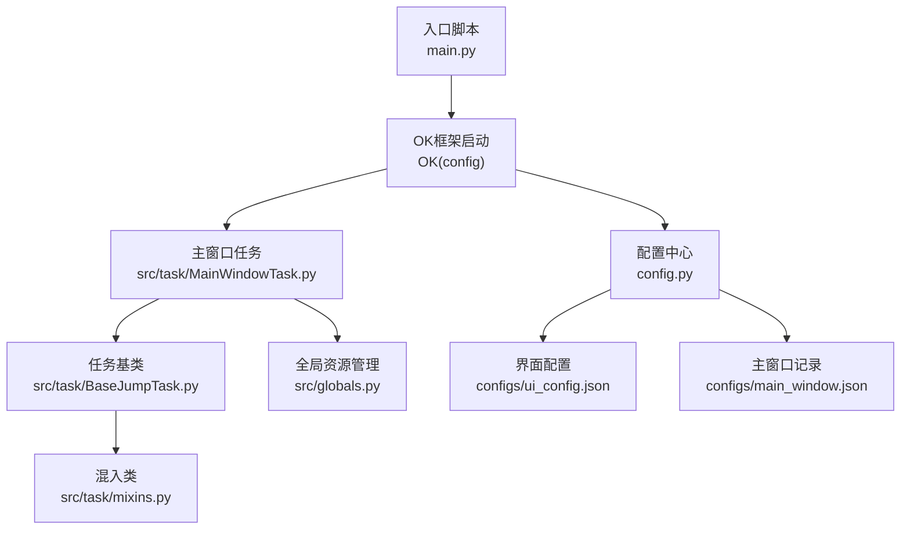
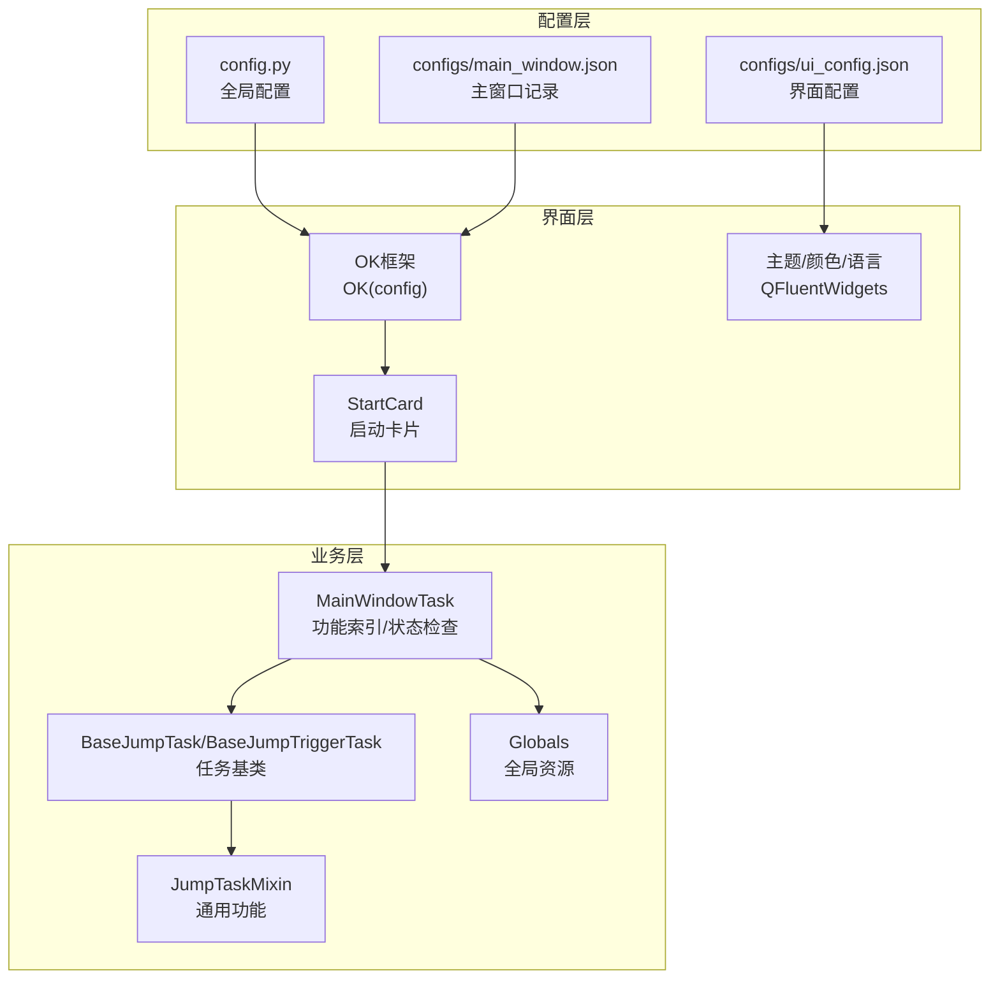
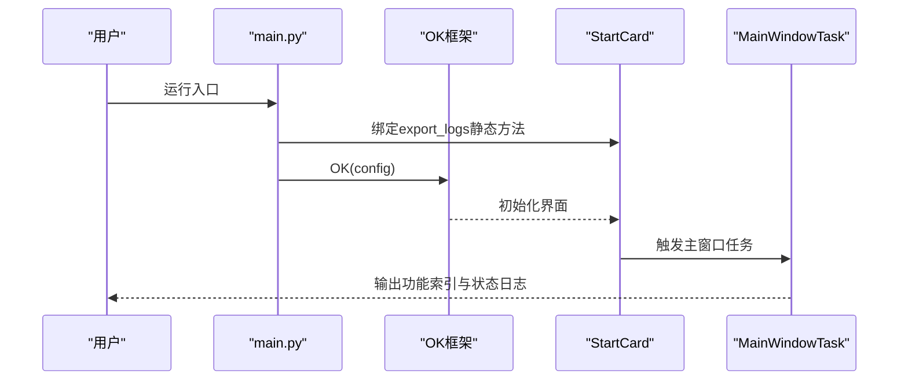
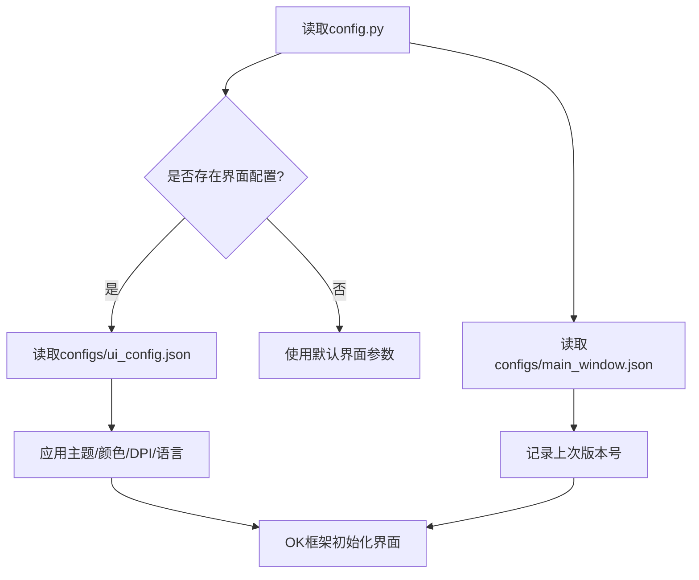
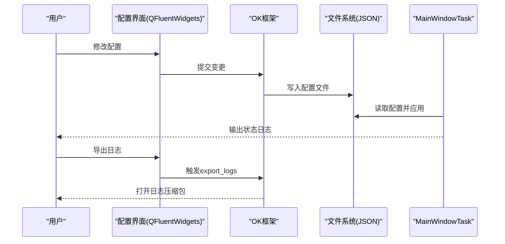
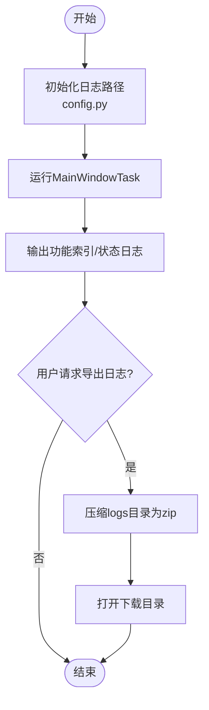
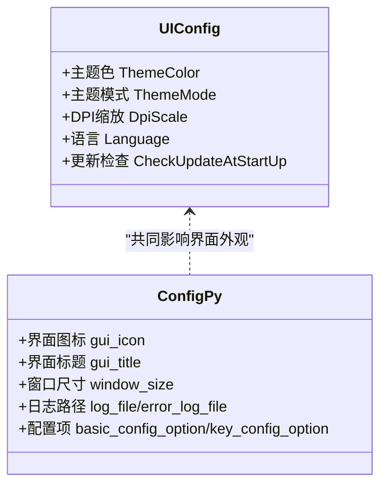
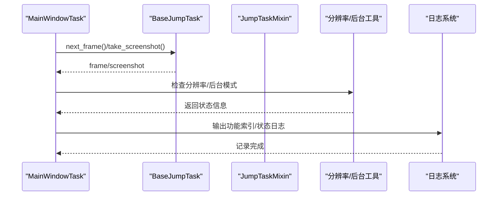
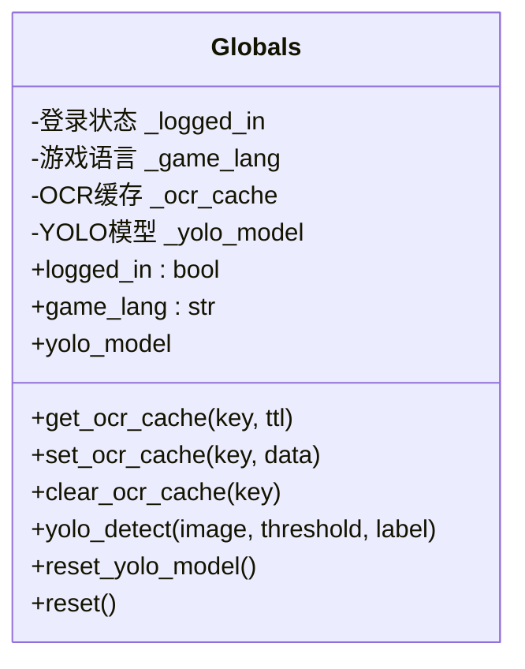
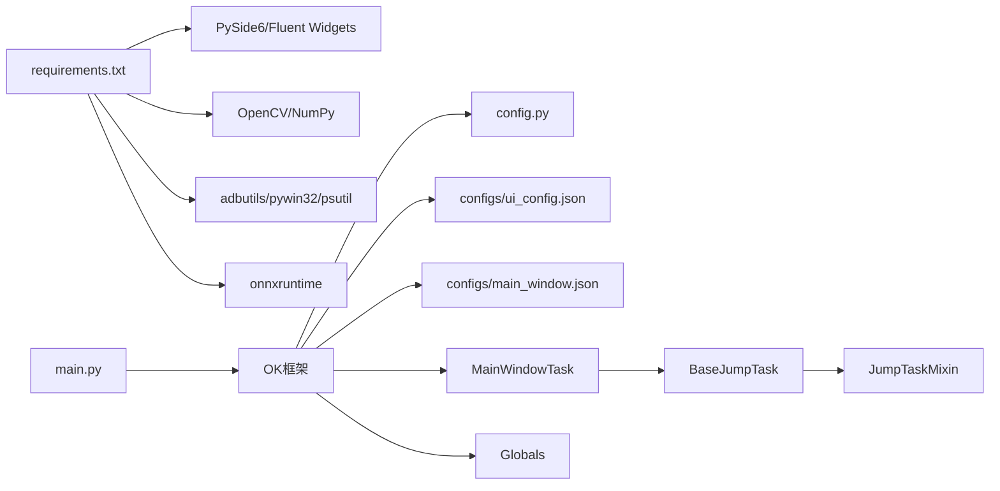

# GUI界面系统

<cite>
**本文引用的文件**
- [main.py](file://main.py)
- [config.py](file://config.py)
- [src/globals.py](file://src/globals.py)
- [src/task/MainWindowTask.py](file://src/task/MainWindowTask.py)
- [src/task/BaseJumpTask.py](file://src/task/BaseJumpTask.py)
- [src/task/BaseJumpTriggerTask.py](file://src/task/BaseJumpTriggerTask.py)
- [src/task/mixins.py](file://src/task/mixins.py)
- [configs/ui_config.json](file://configs/ui_config.json)
- [configs/main_window.json](file://configs/main_window.json)
- [requirements.txt](file://requirements.txt)
</cite>

## 目录
1. [简介](#简介)
2. [项目结构](#项目结构)
3. [核心组件](#核心组件)
4. [架构总览](#架构总览)
5. [详细组件分析](#详细组件分析)
6. [依赖分析](#依赖分析)
7. [性能考虑](#性能考虑)
8. [故障排查指南](#故障排查指南)
9. [结论](#结论)
10. [附录](#附录)

## 简介
本文件面向GUI界面系统，聚焦于基于PySide6与QFluentWidgets的界面框架集成、配置管理机制、配置界面设计与用户交互流程、日志管理与实时状态显示、界面定制化与主题支持，以及扩展新功能的技术指导。文档以仓库现有实现为基础，结合配置文件与任务模块，给出可操作的架构视图与实践建议。

## 项目结构
该GUI系统围绕OK脚本框架构建，入口通过main.py启动OK实例，界面由QFluentWidgets提供，配置由config.py集中定义，并通过任务模块实现功能与状态展示。

图表来源
- [main.py:30-33](file://main.py#L30-L33)
- [config.py:65-137](file://config.py#L65-L137)
- [src/task/MainWindowTask.py:1-215](file://src/task/MainWindowTask.py#L1-L215)
- [src/task/BaseJumpTask.py:10-55](file://src/task/BaseJumpTask.py#L10-L55)
- [src/task/mixins.py:12-46](file://src/task/mixins.py#L12-L46)
- [src/globals.py:16-227](file://src/globals.py#L16-L227)
- [configs/ui_config.json:1-17](file://configs/ui_config.json#L1-L17)
- [configs/main_window.json:1-3](file://configs/main_window.json#L1-L3)

章节来源
- [main.py:30-33](file://main.py#L30-L33)
- [config.py:65-137](file://config.py#L65-L137)

## 核心组件
- 入口与启动
  - main.py负责注册日志导出函数并启动OK框架，作为GUI应用的入口。
- 配置中心
  - config.py集中定义界面图标、标题、窗口尺寸、日志路径、OCR与模板匹配参数、窗口与ADB配置、分辨率与参考分辨率、一次性任务与触发任务等。
- 主窗口任务
  - MainWindowTask提供功能索引、窗口检测、截图测试、分辨率与后台模式检查，并输出日志信息。
- 任务基类与混入
  - BaseJumpTask与BaseJumpTriggerTask分别提供一次性与触发型任务的基础能力；JumpTaskMixin封装通用功能（分辨率、后台模式、语言检测等）。
- 全局资源管理
  - src/globals.py提供登录状态、OCR缓存、YOLO模型的延迟加载与统一访问接口。
- 界面配置
  - ui_config.json控制主题色、主题模式、DPI缩放、语言、更新检查等；main_window.json记录上次版本号。

章节来源
- [main.py:10-28](file://main.py#L10-L28)
- [config.py:65-137](file://config.py#L65-L137)
- [src/task/MainWindowTask.py:55-80](file://src/task/MainWindowTask.py#L55-L80)
- [src/task/BaseJumpTask.py:10-55](file://src/task/BaseJumpTask.py#L10-L55)
- [src/task/BaseJumpTriggerTask.py:13-29](file://src/task/BaseJumpTriggerTask.py#L13-L29)
- [src/task/mixins.py:12-46](file://src/task/mixins.py#L12-L46)
- [src/globals.py:16-227](file://src/globals.py#L16-L227)
- [configs/ui_config.json:1-17](file://configs/ui_config.json#L1-L17)
- [configs/main_window.json:1-3](file://configs/main_window.json#L1-L3)

## 架构总览
GUI系统采用“配置驱动 + 任务驱动”的双轴架构：
- 配置驱动：config.py定义全局行为与资源路径，ui_config.json定义界面外观与主题；二者共同决定应用启动后的界面风格与功能边界。
- 任务驱动：MainWindowTask等任务模块负责执行具体功能并输出状态日志；日志通过OK框架记录至配置指定的日志文件，供用户查看与导出。

图表来源
- [config.py:65-137](file://config.py#L65-L137)
- [configs/ui_config.json:1-17](file://configs/ui_config.json#L1-L17)
- [configs/main_window.json:1-3](file://configs/main_window.json#L1-L3)
- [main.py:30-33](file://main.py#L30-L33)
- [src/task/MainWindowTask.py:55-80](file://src/task/MainWindowTask.py#L55-L80)
- [src/task/BaseJumpTask.py:10-55](file://src/task/BaseJumpTask.py#L10-L55)
- [src/task/mixins.py:12-46](file://src/task/mixins.py#L12-L46)
- [src/globals.py:16-227](file://src/globals.py#L16-L227)

## 详细组件分析

### 入口与启动流程
- 注册日志导出：在启动前将export_logs绑定到StartCard，便于用户一键导出日志压缩包。
- 启动OK：传入config，OK根据配置初始化界面、任务与资源。

图表来源
- [main.py:10-28](file://main.py#L10-L28)
- [main.py:30-33](file://main.py#L30-L33)
- [src/task/MainWindowTask.py:55-80](file://src/task/MainWindowTask.py#L55-L80)

章节来源
- [main.py:10-28](file://main.py#L10-L28)
- [main.py:30-33](file://main.py#L30-L33)

### 配置管理机制
- 全局配置
  - 包含界面图标、标题、窗口尺寸、日志路径、OCR与模板匹配参数、窗口与ADB配置、分辨率与参考分辨率、一次性任务与触发任务等。
- 界面配置
  - 控制主题色、主题模式、DPI缩放、语言、更新检查等。
- 主窗口记录
  - 记录上一次版本号，可用于引导更新提示或迁移逻辑。

图表来源
- [config.py:65-137](file://config.py#L65-L137)
- [configs/ui_config.json:1-17](file://configs/ui_config.json#L1-L17)
- [configs/main_window.json:1-3](file://configs/main_window.json#L1-L3)

章节来源
- [config.py:65-137](file://config.py#L65-L137)
- [configs/ui_config.json:1-17](file://configs/ui_config.json#L1-L17)
- [configs/main_window.json:1-3](file://configs/main_window.json#L1-L3)

### 配置界面设计与用户交互
- 设计要点
  - 使用QFluentWidgets的ConfigOption与FluentIcon组织配置项，形成“分组+图标+描述”的直观界面。
  - 支持下拉选择、布尔开关等控件类型，满足不同配置需求。
- 用户交互
  - 用户在界面修改配置后，由OK框架持久化到对应JSON文件；MainWindowTask在运行时读取并应用相关设置。
  - 日志导出按钮通过StartCard暴露，用户点击后打包logs目录并打开下载位置。

图表来源
- [config.py:23-63](file://config.py#L23-L63)
- [main.py:10-28](file://main.py#L10-L28)
- [src/task/MainWindowTask.py:55-80](file://src/task/MainWindowTask.py#L55-L80)

章节来源
- [config.py:23-63](file://config.py#L23-L63)
- [main.py:10-28](file://main.py#L10-L28)
- [src/task/MainWindowTask.py:55-80](file://src/task/MainWindowTask.py#L55-L80)

### 日志管理与实时状态显示
- 日志文件
  - 通过config.py中的log_file与error_log_file定义日志路径，MainWindowTask在运行过程中输出功能索引、窗口检测、截图测试、分辨率与后台模式等状态信息。
- 日志导出
  - export_logs函数将logs目录压缩为zip并打开所在位置，便于用户提交问题或备份。
- 实时状态
  - MainWindowTask通过日志输出当前功能状态与建议，帮助用户确认配置与环境是否正确。

图表来源
- [config.py:119-122](file://config.py#L119-L122)
- [src/task/MainWindowTask.py:55-80](file://src/task/MainWindowTask.py#L55-L80)
- [main.py:10-28](file://main.py#L10-L28)

章节来源
- [config.py:119-122](file://config.py#L119-L122)
- [src/task/MainWindowTask.py:55-80](file://src/task/MainWindowTask.py#L55-L80)
- [main.py:10-28](file://main.py#L10-L28)

### 界面定制化与主题支持
- 主题与颜色
  - ui_config.json中的ThemeColor与ThemeMode控制整体主题色与明暗模式；DPI Scale与Language控制显示与语言。
- 图标与分组
  - config.py中使用FluentIcon为配置项添加图标，提升界面可读性。
- 界面适配
  - 通过config.py的窗口尺寸与最小尺寸限制，保证界面在不同DPI下的可用性。

图表来源
- [configs/ui_config.json:13-16](file://configs/ui_config.json#L13-L16)
- [config.py:69-71](file://config.py#L69-L71)
- [config.py:112-117](file://config.py#L112-L117)
- [config.py:40-63](file://config.py#L40-L63)

章节来源
- [configs/ui_config.json:1-17](file://configs/ui_config.json#L1-L17)
- [config.py:40-63](file://config.py#L40-L63)
- [config.py:112-117](file://config.py#L112-L117)

### 任务与状态检查流程
- 功能索引与状态
  - MainWindowTask维护功能分类与状态，运行时打印状态并更新。
- 窗口检测与截图
  - 通过任务基类提供的截图能力验证窗口识别与截图功能。
- 分辨率与后台模式
  - 检查当前分辨率与推荐分辨率，提示是否符合16:9；检测后台模式、伪最小化与静音设置。

图表来源
- [src/task/MainWindowTask.py:121-196](file://src/task/MainWindowTask.py#L121-L196)
- [src/task/BaseJumpTask.py:31-41](file://src/task/BaseJumpTask.py#L31-L41)
- [src/task/mixins.py:12-46](file://src/task/mixins.py#L12-L46)

章节来源
- [src/task/MainWindowTask.py:121-196](file://src/task/MainWindowTask.py#L121-L196)
- [src/task/BaseJumpTask.py:31-41](file://src/task/BaseJumpTask.py#L31-L41)
- [src/task/mixins.py:12-46](file://src/task/mixins.py#L12-L46)

### 全局资源管理
- 登录状态与语言
  - 提供登录状态与默认语言设置，便于任务根据状态切换逻辑。
- OCR缓存
  - 提供带TTL的缓存机制，避免重复OCR计算。
- YOLO模型
  - 延迟加载ONNX模型，按需初始化并提供检测接口，异常时安全降级为空列表。

图表来源
- [src/globals.py:16-227](file://src/globals.py#L16-L227)

章节来源
- [src/globals.py:16-227](file://src/globals.py#L16-L227)

## 依赖分析
- 外部依赖
  - PySide6与QFluentWidgets用于界面与主题；OpenCV、NumPy用于图像处理；ADButils、pywin32、psutil等用于系统与设备交互；ONNXRuntime用于推理加速。
- 内部耦合
  - main.py依赖OK框架与StartCard；MainWindowTask依赖任务基类与混入类；config.py为全局配置源；ui_config.json与main_window.json为界面与版本记录。

图表来源
- [requirements.txt:1-13](file://requirements.txt#L1-L13)
- [main.py:30-33](file://main.py#L30-L33)
- [config.py:65-137](file://config.py#L65-L137)
- [configs/ui_config.json:1-17](file://configs/ui_config.json#L1-L17)
- [configs/main_window.json:1-3](file://configs/main_window.json#L1-L3)
- [src/task/MainWindowTask.py:55-80](file://src/task/MainWindowTask.py#L55-L80)
- [src/task/BaseJumpTask.py:10-55](file://src/task/BaseJumpTask.py#L10-L55)
- [src/task/mixins.py:12-46](file://src/task/mixins.py#L12-L46)
- [src/globals.py:16-227](file://src/globals.py#L16-L227)

章节来源
- [requirements.txt:1-13](file://requirements.txt#L1-L13)
- [main.py:30-33](file://main.py#L30-L33)
- [config.py:65-137](file://config.py#L65-L137)

## 性能考虑
- CPU/GPU占用
  - 基本设置中的“触发间隔”可调节任务调度频率，增大间隔可降低资源占用。
- 截图与检测
  - 合理使用OCR缓存与YOLO模型延迟加载，避免频繁初始化；在后台模式下配合伪最小化减少无效渲染。
- 界面响应
  - 将耗时任务放入后台线程，避免阻塞界面；使用日志异步写入，减少I/O对主线程的影响。

## 故障排查指南
- 未检测到游戏窗口
  - 检查窗口标题关键词与ADB包名配置；确认游戏已启动且窗口可见。
- 分辨率不匹配
  - 根据日志建议调整到推荐分辨率；确保16:9比例。
- 后台模式异常
  - 检查后台模式、伪最小化与静音设置；确认窗口状态与系统权限。
- 日志导出失败
  - 确认logs目录存在且有写入权限；尝试重新导出。

章节来源
- [src/task/MainWindowTask.py:121-196](file://src/task/MainWindowTask.py#L121-L196)
- [main.py:10-28](file://main.py#L10-L28)

## 结论
本GUI系统以OK框架为核心，结合PySide6与QFluentWidgets实现配置驱动的界面与主题管理，通过任务模块提供功能索引与状态检查，并以日志系统支撑问题定位与用户反馈。通过合理配置与扩展机制，可在保证性能的同时持续增强用户体验。

## 附录
- 开发者建议
  - 新增配置项时，优先使用ConfigOption与FluentIcon，保持界面一致性。
  - 对耗时操作采用延迟加载与缓存策略，必要时引入线程池。
  - 在任务中统一通过日志输出状态，便于用户与调试。
  - 扩展新功能时，优先复用JumpTaskMixin中的通用能力，减少重复代码。