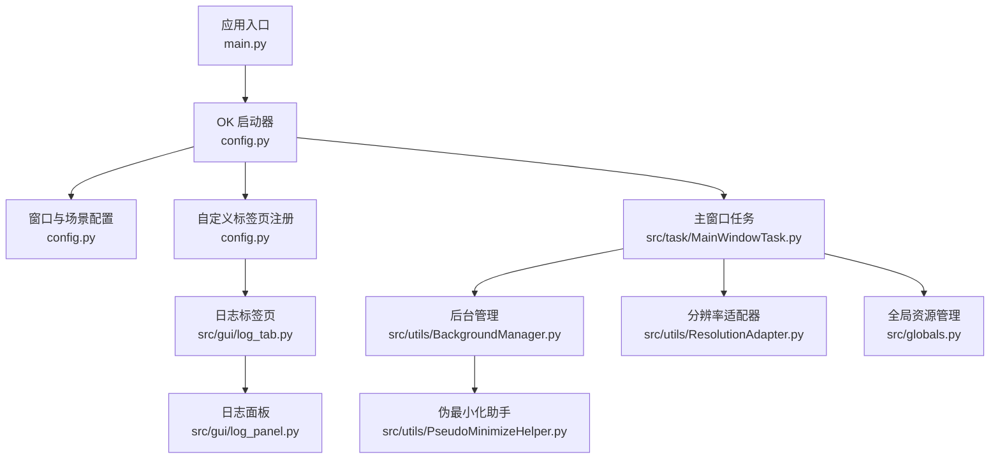
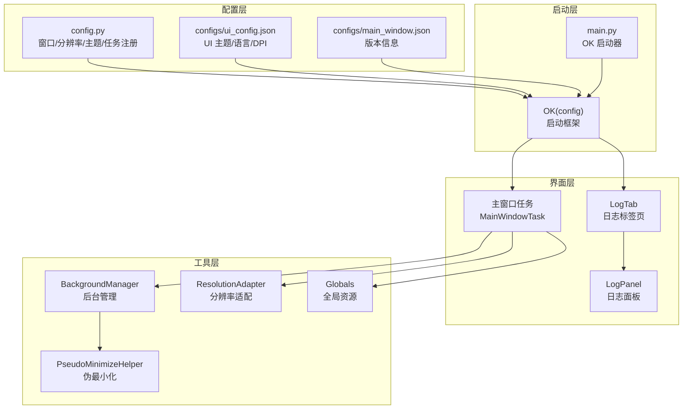
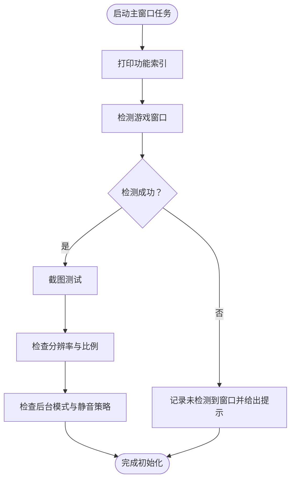
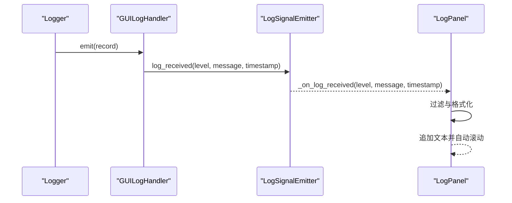
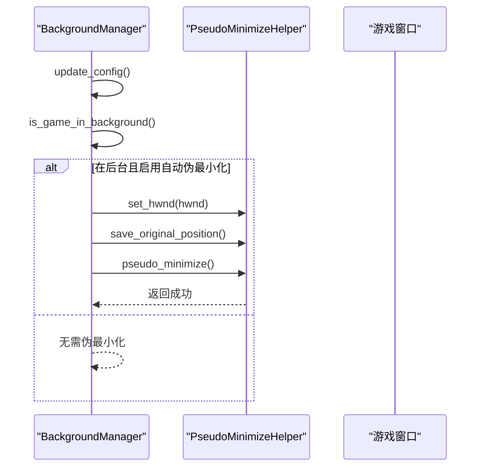
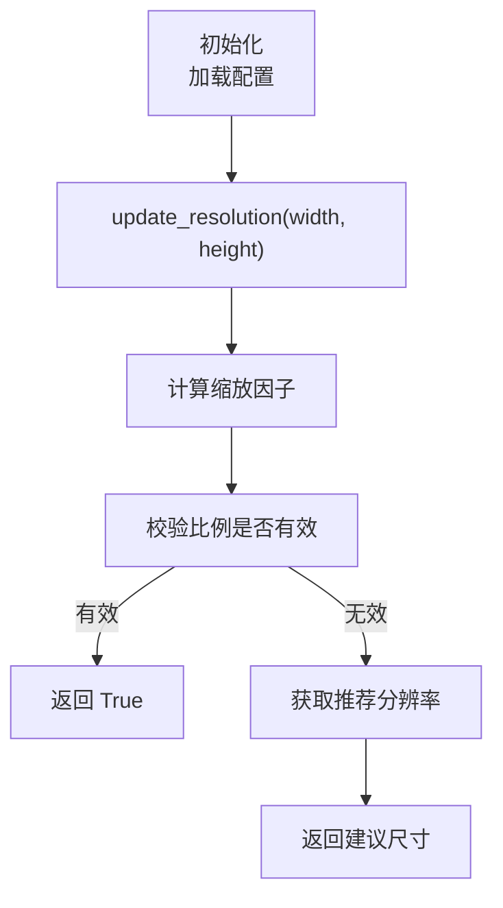
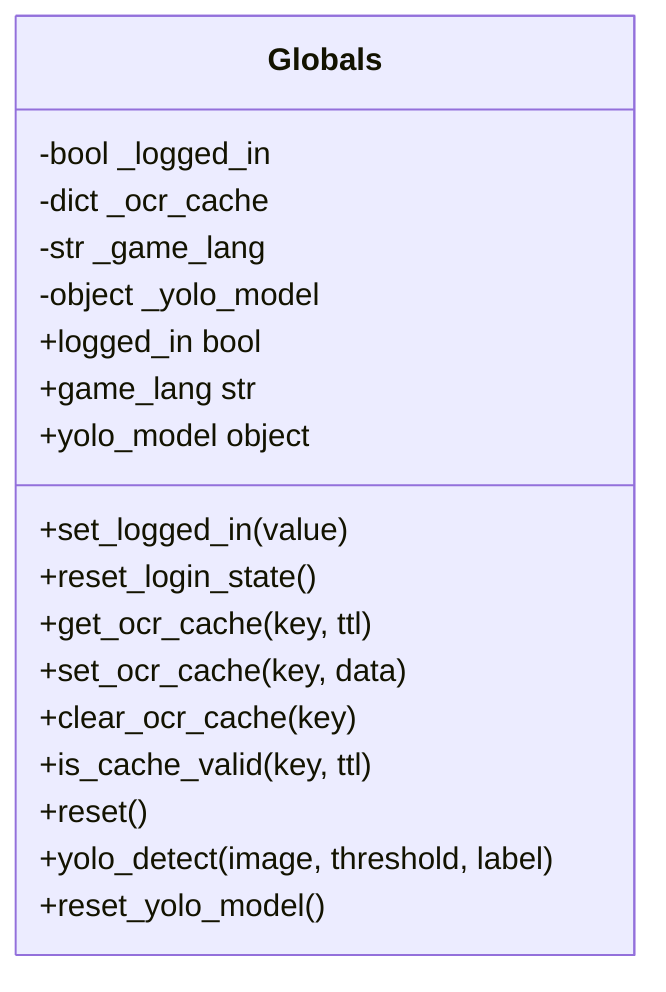
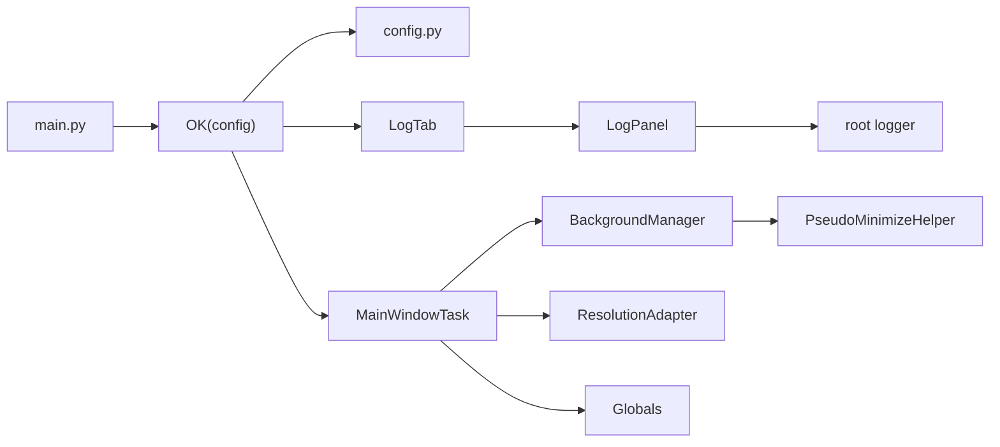
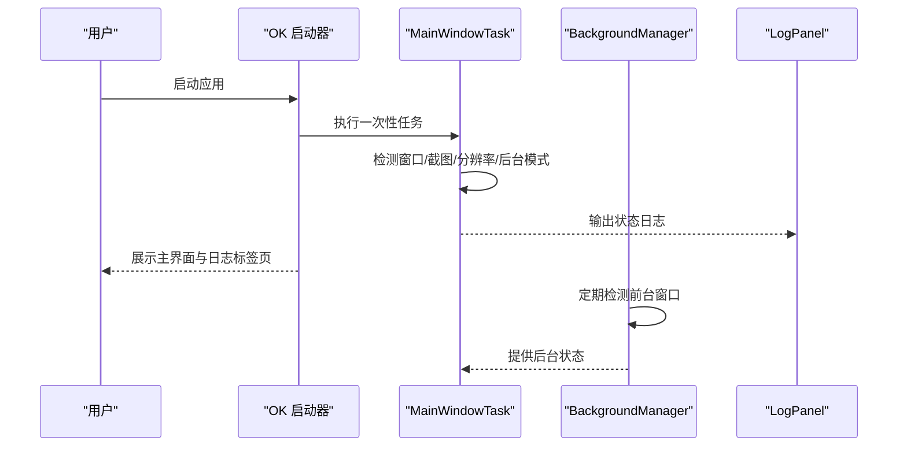

# 主窗口界面

<cite>
**本文档引用的文件**
- [main.py](file://main.py)
- [config.py](file://config.py)
- [configs/main_window.json](file://configs/main_window.json)
- [configs/ui_config.json](file://configs/ui_config.json)
- [src/task/MainWindowTask.py](file://src/task/MainWindowTask.py)
- [src/gui/log_panel.py](file://src/gui/log_panel.py)
- [src/gui/log_tab.py](file://src/gui/log_tab.py)
- [src/utils/BackgroundManager.py](file://src/utils/BackgroundManager.py)
- [src/utils/PseudoMinimizeHelper.py](file://src/utils/PseudoMinimizeHelper.py)
- [src/utils/ResolutionAdapter.py](file://src/utils/ResolutionAdapter.py)
- [src/globals.py](file://src/globals.py)
</cite>

## 目录
1. [简介](#简介)
2. [项目结构](#项目结构)
3. [核心组件](#核心组件)
4. [架构总览](#架构总览)
5. [详细组件分析](#详细组件分析)
6. [依赖关系分析](#依赖关系分析)
7. [性能考虑](#性能考虑)
8. [故障排除指南](#故障排除指南)
9. [结论](#结论)
10. [附录](#附录)

## 简介
本文件面向开发者，系统性阐述主窗口界面的设计与实现，涵盖布局组织、初始化流程、状态管理、菜单栏/工具栏/状态栏功能、窗口尺寸与位置记忆、主题切换机制，以及扩展与集成新功能模块的方法。文档同时提供性能优化与用户体验改进建议，帮助快速上手并高质量扩展主界面。

## 项目结构
主窗口界面由 ok-script 框架驱动，结合 PySide6 与 QFluentWidgets 提供 GUI 能力，并通过配置中心集中管理窗口、主题、分辨率等参数。核心文件分布如下：
- 应用入口与启动：main.py
- 全局配置与窗口参数：config.py
- UI 配置（主题、语言、DPI 等）：configs/ui_config.json
- 主窗口任务与功能索引：src/task/MainWindowTask.py
- 日志面板与标签页：src/gui/log_panel.py、src/gui/log_tab.py
- 后台模式与伪最小化：src/utils/BackgroundManager.py、src/utils/PseudoMinimizeHelper.py
- 分辨率适配：src/utils/ResolutionAdapter.py
- 全局资源与模型管理：src/globals.py

**图表来源**
- [main.py:30-33](file://main.py#L30-L33)
- [config.py:65-141](file://config.py#L65-L141)
- [src/gui/log_tab.py:28-67](file://src/gui/log_tab.py#L28-L67)
- [src/gui/log_panel.py:58-388](file://src/gui/log_panel.py#L58-L388)
- [src/task/MainWindowTask.py:49-80](file://src/task/MainWindowTask.py#L49-L80)
- [src/utils/BackgroundManager.py:7-145](file://src/utils/BackgroundManager.py#L7-L145)
- [src/utils/PseudoMinimizeHelper.py:13-193](file://src/utils/PseudoMinimizeHelper.py#L13-L193)
- [src/utils/ResolutionAdapter.py:4-163](file://src/utils/ResolutionAdapter.py#L4-L163)
- [src/globals.py:16-227](file://src/globals.py#L16-L227)

**章节来源**
- [main.py:30-33](file://main.py#L30-L33)
- [config.py:65-141](file://config.py#L65-L141)

## 核心组件
- 主窗口任务 MainWindowTask：负责窗口检测、截图测试、分辨率校验、后台模式检查与功能索引展示。
- 日志标签页与日志面板：提供实时日志监控、过滤、搜索、暂停/恢复与自动滚动。
- 后台管理与伪最小化：检测前台窗口、自动静音、窗口伪最小化与恢复。
- 分辨率适配器：根据参考分辨率与支持比例计算缩放因子，提供相对坐标转换。
- 全局资源管理：登录状态、OCR 缓存、YOLO 模型延迟加载与复用。

**章节来源**
- [src/task/MainWindowTask.py:5-215](file://src/task/MainWindowTask.py#L5-L215)
- [src/gui/log_tab.py:15-67](file://src/gui/log_tab.py#L15-L67)
- [src/gui/log_panel.py:58-388](file://src/gui/log_panel.py#L58-L388)
- [src/utils/BackgroundManager.py:7-145](file://src/utils/BackgroundManager.py#L7-L145)
- [src/utils/PseudoMinimizeHelper.py:13-193](file://src/utils/PseudoMinimizeHelper.py#L13-L193)
- [src/utils/ResolutionAdapter.py:4-163](file://src/utils/ResolutionAdapter.py#L4-L163)
- [src/globals.py:16-227](file://src/globals.py#L16-L227)

## 架构总览
主窗口界面采用“配置驱动 + 任务驱动”的架构：
- 配置中心集中管理窗口标题、最小尺寸、分辨率策略、主题与语言等。
- OK 启动器按配置加载场景、注册一次性任务与触发任务、注入自定义标签页。
- 主窗口任务在启动时执行窗口检测与环境验证，输出功能索引与状态信息。
- 日志标签页通过全局日志处理器将日志实时渲染至面板。
- 后台管理与伪最小化在窗口状态变化时自动生效，保障后台截图与静音需求。
- 分辨率适配器为坐标换算与界面元素缩放提供统一能力。
- 全局资源管理提供 OCR 缓存与 YOLO 模型的统一访问与复用。

**图表来源**
- [config.py:65-141](file://config.py#L65-L141)
- [configs/ui_config.json:1-17](file://configs/ui_config.json#L1-L17)
- [configs/main_window.json:1-3](file://configs/main_window.json#L1-L3)
- [main.py:30-33](file://main.py#L30-L33)
- [src/gui/log_tab.py:28-67](file://src/gui/log_tab.py#L28-L67)
- [src/gui/log_panel.py:58-388](file://src/gui/log_panel.py#L58-L388)
- [src/task/MainWindowTask.py:49-80](file://src/task/MainWindowTask.py#L49-L80)
- [src/utils/BackgroundManager.py:7-145](file://src/utils/BackgroundManager.py#L7-L145)
- [src/utils/PseudoMinimizeHelper.py:13-193](file://src/utils/PseudoMinimizeHelper.py#L13-L193)
- [src/utils/ResolutionAdapter.py:4-163](file://src/utils/ResolutionAdapter.py#L4-L163)
- [src/globals.py:16-227](file://src/globals.py#L16-L227)

## 详细组件分析

### 主窗口任务 MainWindowTask
- 功能分类与状态索引：维护核心功能、游戏功能、MOBA 功能、实用工具四类功能项及其状态（已完成/开发中/计划中）。
- 初始化流程：打印版本与功能索引；检测游戏窗口是否存在并截图；检查分辨率与后台模式；输出状态信息。
- 状态查询与更新：提供按分类与任务名查询状态与更新状态的能力。
- 环境验证：截图测试、分辨率信息输出、后台模式与静音策略提示。

**图表来源**
- [src/task/MainWindowTask.py:55-80](file://src/task/MainWindowTask.py#L55-L80)
- [src/task/MainWindowTask.py:121-196](file://src/task/MainWindowTask.py#L121-L196)

**章节来源**
- [src/task/MainWindowTask.py:5-215](file://src/task/MainWindowTask.py#L5-L215)

### 日志标签页与日志面板
- 日志标签页：作为自定义标签页注册到框架底部导航，承载日志面板。
- 日志面板：提供级别过滤（DEBUG/INFO/WARNING/ERROR）、关键词搜索、暂停/恢复、自动滚动、清空日志、实时计数与 FPS 状态显示。
- 线程安全：通过信号发射器与 GUI 日志处理器实现跨线程日志接收与渲染。
- 样式与字体：深色背景、等宽字体、按级别与特殊标记着色。

**图表来源**
- [src/gui/log_panel.py:29-56](file://src/gui/log_panel.py#L29-L56)
- [src/gui/log_panel.py:252-313](file://src/gui/log_panel.py#L252-L313)
- [src/gui/log_tab.py:44-62](file://src/gui/log_tab.py#L44-L62)

**章节来源**
- [src/gui/log_tab.py:15-67](file://src/gui/log_tab.py#L15-L67)
- [src/gui/log_panel.py:58-388](file://src/gui/log_panel.py#L58-L388)

### 后台模式与伪最小化
- 后台检测：通过 Windows API 获取前台窗口句柄，判断游戏窗口是否在后台。
- 自动静音：根据配置在后台时自动静音游戏。
- 伪最小化：将窗口移动到屏幕外坐标，保存原始位置，支持恢复；最小化时自动保存原位置并执行伪最小化。
- 状态查询：提供后台模式开关、是否在后台、是否伪最小化、是否自动伪最小化等状态。

**图表来源**
- [src/utils/BackgroundManager.py:33-111](file://src/utils/BackgroundManager.py#L33-L111)
- [src/utils/PseudoMinimizeHelper.py:78-148](file://src/utils/PseudoMinimizeHelper.py#L78-L148)

**章节来源**
- [src/utils/BackgroundManager.py:7-145](file://src/utils/BackgroundManager.py#L7-L145)
- [src/utils/PseudoMinimizeHelper.py:13-193](file://src/utils/PseudoMinimizeHelper.py#L13-L193)

### 分辨率适配器
- 参考分辨率与支持比例：从配置读取参考分辨率与支持比例，默认 1920x1080 与 16:9。
- 缩放因子：根据当前分辨率计算 X/Y 缩放因子，提供点、矩形、相对坐标的换算。
- 比例校验：判断当前比例是否在容差范围内，提供推荐重设分辨率。
- 属性访问：提供 width/height/scale_x_ratio/scale_y_ratio 等便捷属性。

**图表来源**
- [src/utils/ResolutionAdapter.py:19-44](file://src/utils/ResolutionAdapter.py#L19-L44)
- [src/utils/ResolutionAdapter.py:107-143](file://src/utils/ResolutionAdapter.py#L107-L143)

**章节来源**
- [src/utils/ResolutionAdapter.py:4-163](file://src/utils/ResolutionAdapter.py#L4-L163)

### 全局资源管理
- 登录状态：提供登录状态的读写与重置。
- OCR 缓存：基于 TTL 的缓存管理，支持清理与有效性检查。
- YOLO 模型：延迟加载 ONNX 模型，提供检测接口与模型重置。
- 全局重置：一键重置登录状态与 OCR 缓存。

**图表来源**
- [src/globals.py:16-227](file://src/globals.py#L16-L227)

**章节来源**
- [src/globals.py:16-227](file://src/globals.py#L16-L227)

## 依赖关系分析
- 启动与配置：main.py 通过 OK(config) 启动框架，config.py 定义窗口、分辨率、主题、任务与自定义标签页。
- 日志链路：LogTab 注册 LogPanel，LogPanel 通过 GUILogHandler 将日志接入 root logger。
- 后台链路：MainWindowTask 依赖 BackgroundManager，后者委托 PseudoMinimizeHelper 执行窗口操作。
- 分辨率链路：MainWindowTask 与 ResolutionAdapter 协作，提供缩放与相对坐标转换。
- 全局资源：各模块通过 Globals 统一访问 OCR 缓存与 YOLO 模型。

**图表来源**
- [main.py:30-33](file://main.py#L30-L33)
- [config.py:65-141](file://config.py#L65-L141)
- [src/gui/log_tab.py:28-67](file://src/gui/log_tab.py#L28-L67)
- [src/gui/log_panel.py:58-388](file://src/gui/log_panel.py#L58-L388)
- [src/task/MainWindowTask.py:49-80](file://src/task/MainWindowTask.py#L49-L80)
- [src/utils/BackgroundManager.py:7-145](file://src/utils/BackgroundManager.py#L7-L145)
- [src/utils/PseudoMinimizeHelper.py:13-193](file://src/utils/PseudoMinimizeHelper.py#L13-L193)
- [src/utils/ResolutionAdapter.py:4-163](file://src/utils/ResolutionAdapter.py#L4-L163)
- [src/globals.py:16-227](file://src/globals.py#L16-L227)

**章节来源**
- [main.py:30-33](file://main.py#L30-L33)
- [config.py:65-141](file://config.py#L65-L141)

## 性能考虑
- 触发间隔调优：通过配置中的“触发间隔”参数增加任务触发延迟，可显著降低 CPU/GPU 使用率，适合后台模式与低占用场景。
- 日志面板优化：限制最大行数、启用自动滚动、暂停模式下避免渲染，减少 UI 线程压力。
- 分辨率适配：仅在分辨率变化时更新缩放因子，避免频繁计算；使用相对坐标减少重复换算。
- YOLO 模型复用：利用全局资源管理的延迟加载与重置机制，避免重复初始化；在不需要时及时释放模型以回收显存。
- 后台模式：启用“后台模式”与“最小化时伪最小化”，在窗口不可见时仍可维持运行，但需注意系统策略与权限。

[本节为通用性能建议，无需具体文件引用]

## 故障排除指南
- 未检测到游戏窗口
  - 确认游戏已启动且窗口标题包含支持的关键字。
  - 检查 ADB 包名与模拟器配置是否正确。
  - 参考主窗口任务的检测逻辑与日志输出定位问题。
- 分辨率异常或非 16:9 比例
  - 使用分辨率适配器提供的推荐尺寸进行调整。
  - 检查配置中的参考分辨率与支持比例设置。
- 后台截图失败或声音未静音
  - 确认后台模式与“后台时静音游戏”已启用。
  - 若窗口最小化，检查“最小化时伪最小化”是否生效。
- 日志面板无输出
  - 确认 LogTab 已注册到自定义标签页。
  - 检查 root logger 是否已添加 GUILogHandler。
- YOLO 检测报错
  - 确认模型权重文件存在且路径正确。
  - 通过全局资源管理的重置函数释放模型后重新加载。

**章节来源**
- [src/task/MainWindowTask.py:121-196](file://src/task/MainWindowTask.py#L121-L196)
- [src/utils/ResolutionAdapter.py:107-143](file://src/utils/ResolutionAdapter.py#L107-L143)
- [src/utils/BackgroundManager.py:67-82](file://src/utils/BackgroundManager.py#L67-L82)
- [src/gui/log_tab.py:44-62](file://src/gui/log_tab.py#L44-L62)
- [src/globals.py:172-227](file://src/globals.py#L172-L227)

## 结论
主窗口界面以配置为中心，结合任务驱动与工具模块，实现了窗口检测、日志监控、后台运行与分辨率适配等核心能力。通过清晰的组件边界与稳定的依赖关系，开发者可以高效地扩展新功能模块并集成到现有界面中。建议优先优化触发间隔、日志渲染与模型加载策略，以获得更佳的性能与用户体验。

[本节为总结性内容，无需具体文件引用]

## 附录

### 窗口初始化与状态管理流程

**图表来源**
- [main.py:30-33](file://main.py#L30-L33)
- [src/task/MainWindowTask.py:55-80](file://src/task/MainWindowTask.py#L55-L80)
- [src/gui/log_panel.py:252-313](file://src/gui/log_panel.py#L252-L313)
- [src/utils/BackgroundManager.py:33-82](file://src/utils/BackgroundManager.py#L33-L82)

### 菜单栏、工具栏与状态栏功能
- 菜单栏：由 ok-script 框架提供，包含任务执行、配置管理与场景切换入口。
- 工具栏：日志面板提供级别过滤、关键词搜索、暂停/恢复、清空与自动滚动控制。
- 状态栏：显示日志计数、运行状态与 FPS 等信息。

**章节来源**
- [src/gui/log_panel.py:115-235](file://src/gui/log_panel.py#L115-L235)

### 窗口大小调整、位置记忆与主题切换
- 窗口大小：通过配置中的窗口尺寸与最小尺寸约束，确保界面可调整且满足最小可视需求。
- 位置记忆：当前实现未见显式的窗口位置持久化逻辑，如需支持可在框架扩展中加入位置与大小的保存/恢复。
- 主题切换：UI 配置支持主题色与明暗模式，可在运行时动态更新以适配用户偏好。

**章节来源**
- [config.py:112-117](file://config.py#L112-L117)
- [configs/ui_config.json:8-16](file://configs/ui_config.json#L8-L16)

### 扩展方法与新功能模块集成指导
- 新增一次性任务：在配置中添加任务条目，确保类名与模块路径正确。
- 新增触发任务：在触发任务列表中注册，按需设置触发间隔。
- 新增自定义标签页：在自定义标签页列表中注册，遵循框架约定的属性与生命周期。
- 新增工具模块：通过全局资源管理或工具类封装，提供统一接口与状态管理。
- 集成后台能力：复用 BackgroundManager 与 PseudoMinimizeHelper，确保后台截图与静音策略一致。

**章节来源**
- [config.py:124-141](file://config.py#L124-L141)
- [src/utils/BackgroundManager.py:87-134](file://src/utils/BackgroundManager.py#L87-L134)
- [src/utils/PseudoMinimizeHelper.py:160-173](file://src/utils/PseudoMinimizeHelper.py#L160-L173)