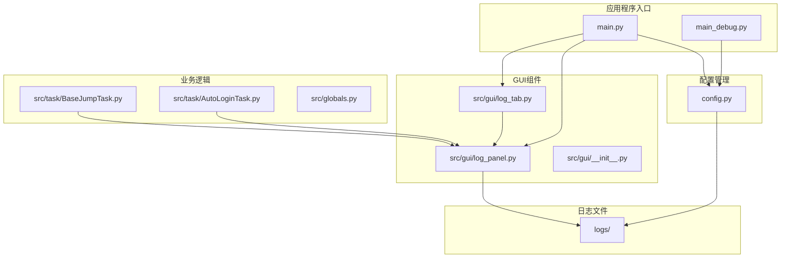
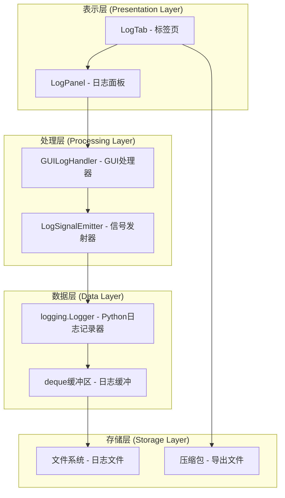
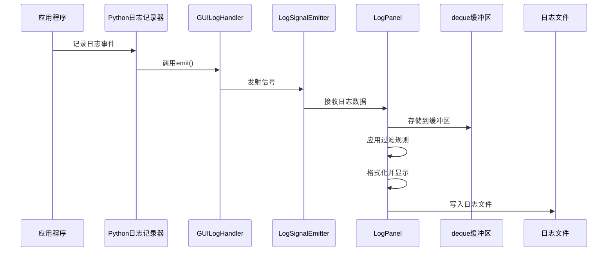
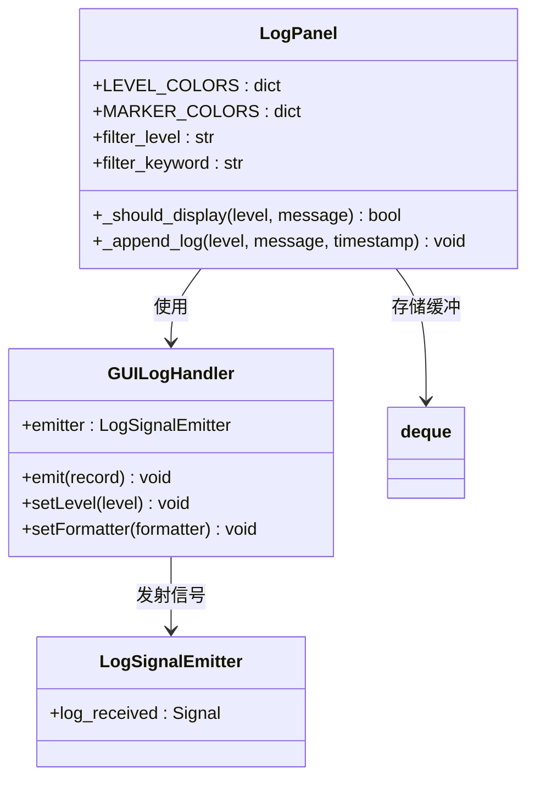
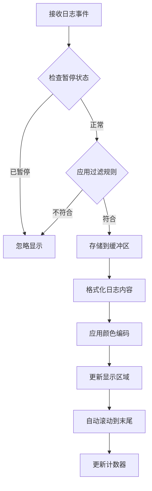
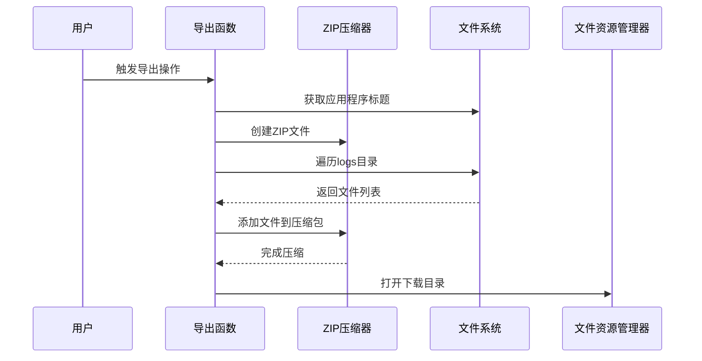
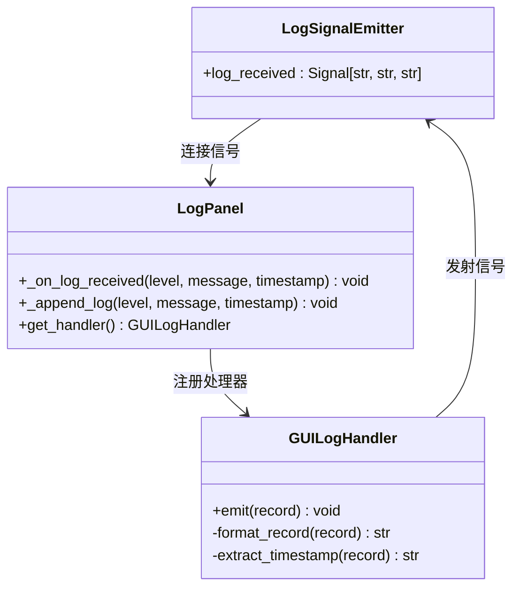
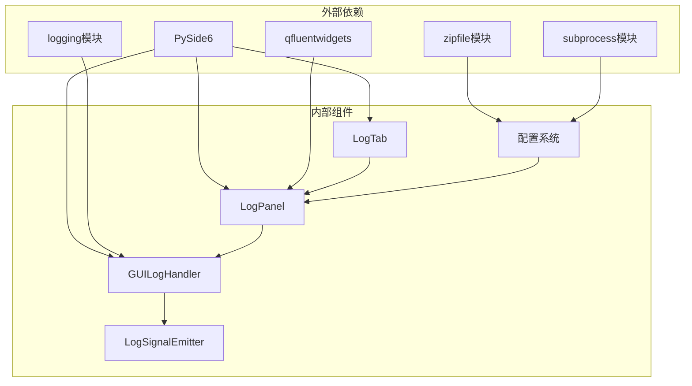

# 日志管理系统

<cite>
**本文档引用的文件**
- [main.py](file://main.py)
- [main_debug.py](file://main_debug.py)
- [config.py](file://config.py)
- [src/gui/log_panel.py](file://src/gui/log_panel.py)
- [src/gui/log_tab.py](file://src/gui/log_tab.py)
- [src/gui/__init__.py](file://src/gui/__init__.py)
- [src/task/BaseJumpTask.py](file://src/task/BaseJumpTask.py)
- [src/task/AutoLoginTask.py](file://src/task/AutoLoginTask.py)
- [src/globals.py](file://src/globals.py)
- [logs/ok-script.log](file://logs/ok-script.log)
</cite>

## 更新摘要
**变更内容**
- 新增实时日志监控功能的详细实现说明
- 完善GUI日志面板的用户界面设计和交互功能
- 增强日志处理器的线程安全机制说明
- 补充日志级别过滤和关键词搜索的具体实现
- 详细描述日志导出和压缩功能的技术细节

## 目录
1. [简介](#简介)
2. [项目结构](#项目结构)
3. [核心组件](#核心组件)
4. [架构概览](#架构概览)
5. [详细组件分析](#详细组件分析)
6. [依赖关系分析](#依赖关系分析)
7. [性能考虑](#性能考虑)
8. [故障排除指南](#故障排除指南)
9. [结论](#结论)

## 简介

本项目是一个基于 Python 的日志管理系统，集成了实时日志监控、过滤、搜索和导出功能。系统采用 PyQt6/FluentWidgets 构建图形用户界面，通过 Python 标准库 logging 模块实现日志收集和格式化，并提供了完整的日志压缩打包和下载机制。

该系统的主要特点包括：
- 实时日志监控和显示
- 多级别日志过滤（DEBUG/INFO/WARNING/ERROR/CRITICAL）
- 关键词搜索功能
- 日志暂停/恢复控制
- 自动滚动和手动滚动切换
- 日志导出和压缩打包
- 线程安全的日志处理机制

**更新** 新增了完整的实时日志监控功能，包括GUI日志面板、日志处理器、级别过滤、关键词搜索等特性，为开发者提供了强大的日志管理能力。

## 项目结构

项目采用模块化的文件组织结构，主要分为以下几个部分：

**图表来源**
- [main.py:1-33](file://main.py#L1-L33)
- [config.py:119-121](file://config.py#L119-L121)
- [src/gui/log_panel.py:1-387](file://src/gui/log_panel.py#L1-L387)
- [src/gui/log_tab.py:1-67](file://src/gui/log_tab.py#L1-L67)

**章节来源**
- [main.py:1-33](file://main.py#L1-L33)
- [config.py:1-145](file://config.py#L1-L145)

## 核心组件

### 日志面板组件 (LogPanel)

日志面板是整个日志系统的核心组件，负责实时显示和管理日志信息。它实现了以下关键功能：

- **实时日志显示**：使用 QPlainTextEdit 控件显示格式化的日志信息
- **多级别过滤**：支持 DEBUG/INFO/WARNING/ERROR/CRITICAL 级别的日志过滤
- **关键词搜索**：提供按关键词过滤日志的功能
- **颜色编码**：不同日志级别和特殊标记使用不同的颜色显示
- **缓冲管理**：使用 deque 数据结构管理日志缓冲区，支持最大行数限制
- **暂停/恢复控制**：支持暂停日志显示和恢复显示功能
- **自动滚动**：支持自动滚动到底部和手动滚动控制

**更新** 新增了完整的用户界面控件，包括级别过滤下拉框、关键词搜索输入框、暂停/恢复按钮、清空按钮和自动滚动切换按钮。

### GUI日志处理器 (GUILogHandler)

GUI日志处理器继承自 logging.Handler，专门用于将日志事件转换为 GUI 可视化格式：

- **线程安全**：通过 Qt 信号机制实现跨线程的日志传递
- **格式化输出**：将日志记录格式化为 GUI 友好的文本格式
- **时间戳处理**：自动提取和格式化日志时间戳
- **异常处理**：在 emit 方法中捕获和处理异常

**更新** 完善了线程安全机制，通过 LogSignalEmitter 实现跨线程的日志传递，确保在多线程环境下日志处理的稳定性。

### 日志标签页 (LogTab)

日志标签页是 ok-script 框架集成的关键组件，提供标准的 GUI 接口：

- **框架集成**：符合 ok-script 框架的标签页规范
- **自动配置**：自动设置日志处理器和级别
- **UI布局**：提供标准的日志监控界面布局
- **全局实例管理**：提供全局日志面板实例的获取和管理

**更新** 新增了与 ok-script 框架的深度集成，支持动态添加到导航栏底部位置。

**章节来源**
- [src/gui/log_panel.py:58-387](file://src/gui/log_panel.py#L58-L387)
- [src/gui/log_tab.py:15-70](file://src/gui/log_tab.py#L15-L70)

## 架构概览

系统采用分层架构设计，各组件职责明确，耦合度低：

**图表来源**
- [src/gui/log_panel.py:29-56](file://src/gui/log_panel.py#L29-L56)
- [src/gui/log_tab.py:44-62](file://src/gui/log_tab.py#L44-L62)

### 数据流图

**图表来源**
- [src/gui/log_panel.py:49-56](file://src/gui/log_panel.py#L49-L56)
- [src/gui/log_panel.py:252-271](file://src/gui/log_panel.py#L252-L271)

## 详细组件分析

### 日志级别和过滤机制

系统支持五种标准日志级别，每种级别都有特定的颜色编码和用途：

**图表来源**
- [src/gui/log_panel.py:71-93](file://src/gui/log_panel.py#L71-L93)
- [src/gui/log_panel.py:272-283](file://src/gui/log_panel.py#L272-L283)

#### 日志级别定义

| 级别 | 颜色 | 用途 | 过滤优先级 |
|------|------|------|------------|
| DEBUG | 灰色 | 详细调试信息 | 最低 |
| INFO | 绿色 | 一般信息 |  |
| WARNING | 橙色 | 警告信息 |  |
| ERROR | 红色 | 错误信息 |  |
| CRITICAL | 紫色 | 严重错误 | 最高 |

#### 特殊标记和颜色映射

系统还支持特殊标记的颜色编码，用于突出显示特定类型的日志：

| 标记 | 颜色 | 用途 | 示例 |
|------|------|------|------|
| 🔍 | 蓝色 | 检测开始 | "🔍 步骤1: 死亡状态检测开始..." |
| ✅ | 绿色 | 成功 | "✅ 步骤1完成: 未检测到死亡" |
| ❌ | 红色 | 失败 | "❌ 操作失败" |
| 💀 | 深红 | 死亡 | "💀 检测到死亡状态" |
| ⚔️ | 橙色 | 战斗 | "⚔️ 战场状态: enemies_only" |
| 👤 | 皇家蓝 | 自己 | "👤 自身检测: 第1次检测成功" |
| 🟢 | 绿色 | 友方 | "🟢 友方: 无" |
| 🔴 | 红色 | 敌军 | "🔴 敌军1: (1118, 144)" |
| 📊 | 紫色 | 统计 | "📊 检测完成: 73次检测" |
| 📷 | 青色 | 帧信息 | "📷 捕获帧 (1920, 1080)" |
| ⚠️ | 金色 | 警告 | "⚠️ 测试模式已启用" |

#### 过滤规则实现

过滤机制采用双重检查策略：

1. **级别过滤**：根据预定义的级别顺序进行比较
2. **关键词过滤**：支持大小写不敏感的关键词匹配
3. **特殊标记过滤**：自动识别并应用特殊标记的颜色编码

**章节来源**
- [src/gui/log_panel.py:272-283](file://src/gui/log_panel.py#L272-L283)

### 实时显示和格式化

日志显示采用高性能的缓冲机制和增量更新策略：

**图表来源**
- [src/gui/log_panel.py:252-313](file://src/gui/log_panel.py#L252-L313)

#### 格式化规则

- **时间戳格式**：HH:MM:SS.fff（精确到毫秒）
- **级别对齐**：固定宽度对齐，便于阅读
- **消息处理**：去除不必要的换行符和空白字符
- **颜色编码**：根据日志级别和特殊标记应用相应颜色

**章节来源**
- [src/gui/log_panel.py:285-313](file://src/gui/log_panel.py#L285-L313)

### 日志导出和压缩机制

系统提供了完整的日志导出功能，支持批量压缩和下载：

**图表来源**
- [main.py:10-26](file://main.py#L10-L26)

#### 导出特性

- **自动命名**：基于应用程序标题生成唯一文件名
- **递归压缩**：支持子目录和多级文件结构
- **进度反馈**：压缩完成后自动定位到下载文件
- **路径处理**：正确处理相对路径和绝对路径

**章节来源**
- [main.py:10-26](file://main.py#L10-L26)

### 线程安全机制

系统采用 Qt 的信号槽机制确保日志处理的线程安全性：

**图表来源**
- [src/gui/log_panel.py:29-31](file://src/gui/log_panel.py#L29-L31)
- [src/gui/log_panel.py:49-55](file://src/gui/log_panel.py#L49-L55)

#### 线程安全保证

- **信号槽机制**：Qt 自动处理跨线程调用
- **异常处理**：在 emit 方法中捕获和处理异常
- **UI更新**：所有 UI 更新都在主线程中执行
- **缓冲管理**：使用线程安全的 deque 数据结构

**章节来源**
- [src/gui/log_panel.py:49-55](file://src/gui/log_panel.py#L49-L55)

## 依赖关系分析

系统采用松耦合的设计，各组件之间的依赖关系清晰：

**图表来源**
- [src/gui/log_panel.py:7-26](file://src/gui/log_panel.py#L7-L26)
- [main.py:1-7](file://main.py#L1-L7)

### 组件间交互

系统遵循单一职责原则，每个组件都有明确的职责边界：

- **LogPanel**：负责日志显示和用户交互
- **GUILogHandler**：负责日志格式化和传输
- **LogTab**：负责 GUI 集成和生命周期管理
- **LogSignalEmitter**：负责线程间通信

**章节来源**
- [src/gui/log_panel.py:1-387](file://src/gui/log_panel.py#L1-L387)
- [src/gui/log_tab.py:1-70](file://src/gui/log_tab.py#L1-L70)

## 性能考虑

### 内存管理

系统采用了多种内存优化策略：

1. **循环缓冲区**：使用 deque(maxlen=N) 限制内存使用
2. **增量更新**：只更新变化的部分，避免全量重绘
3. **延迟加载**：GUI 组件按需创建和初始化
4. **自动清理**：支持清空日志功能，释放内存

### 渲染优化

- **字体设置**：使用等宽字体提高渲染效率
- **颜色缓存**：预计算颜色值减少运行时计算
- **滚动优化**：智能滚动避免不必要的重排
- **文本格式化**：使用 QTextCharFormat 进行高效的颜色设置

### 日志级别调优

根据不同的使用场景，建议调整以下参数：

| 场景 | 推荐级别 | 原因 |
|------|----------|------|
| 开发调试 | DEBUG | 需要详细信息 |
| 生产环境 | INFO | 平衡信息量和性能 |
| 性能测试 | WARNING | 关注潜在问题 |
| 故障排查 | ERROR | 聚焦关键错误 |

**更新** 新增了自动滚动和手动滚动的性能优化，避免频繁的 UI 更新操作。

## 故障排除指南

### 常见问题及解决方案

#### 日志不显示问题

**症状**：日志面板为空白或显示异常

**可能原因**：
1. 日志处理器未正确注册
2. 日志级别设置过高
3. 过滤条件过于严格
4. 线程安全问题

**解决步骤**：
1. 检查日志处理器注册状态
2. 调整过滤级别为 DEBUG
3. 清空关键词过滤
4. 确认线程安全机制正常工作

#### 性能问题

**症状**：界面响应缓慢或内存占用过高

**解决方法**：
1. 减少最大显示行数（默认2000行）
2. 提高过滤级别（如设置为 WARNING）
3. 使用暂停功能临时停止日志显示
4. 定期清空日志缓冲区

#### 导出失败

**症状**：日志导出功能无法正常工作

**检查清单**：
1. 确认 logs 目录存在且可读
2. 检查磁盘空间是否充足
3. 验证下载目录权限
4. 确认日志文件正在写入

**章节来源**
- [src/gui/log_panel.py:314-333](file://src/gui/log_panel.py#L314-L333)
- [main.py:10-26](file://main.py#L10-L26)

## 结论

本日志管理系统通过精心设计的架构和实现，提供了完整而高效的日志管理解决方案。系统的主要优势包括：

1. **架构清晰**：采用分层设计，职责分离明确
2. **性能优秀**：通过缓冲机制和增量更新优化性能
3. **用户体验好**：提供丰富的过滤和搜索功能
4. **扩展性强**：模块化设计便于功能扩展
5. **稳定性高**：完善的异常处理和线程安全机制
6. **实时性强**：支持实时日志监控和显示
7. **界面友好**：提供直观的GUI操作界面

系统适用于各种规模的应用程序，从小型工具到大型自动化系统都能提供可靠的日志管理能力。通过合理的配置和调优，可以在保证功能完整性的同时获得最佳的性能表现。

**更新** 新增的实时日志监控功能显著提升了系统的实用性和用户体验，为开发者提供了强大的日志管理和调试能力。完整的GUI界面设计和丰富的交互功能使得日志监控变得更加直观和高效。