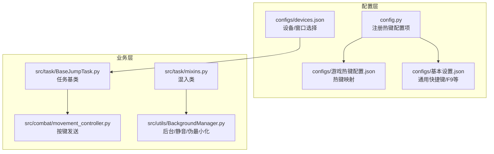
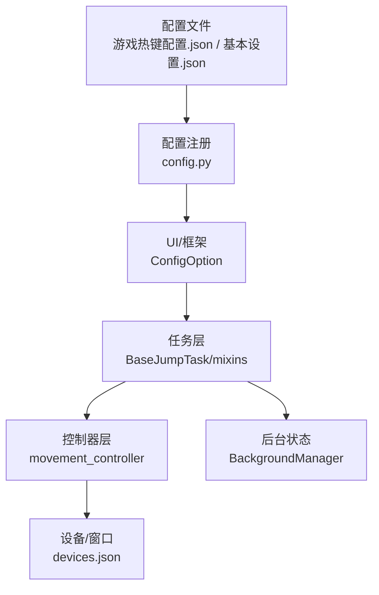
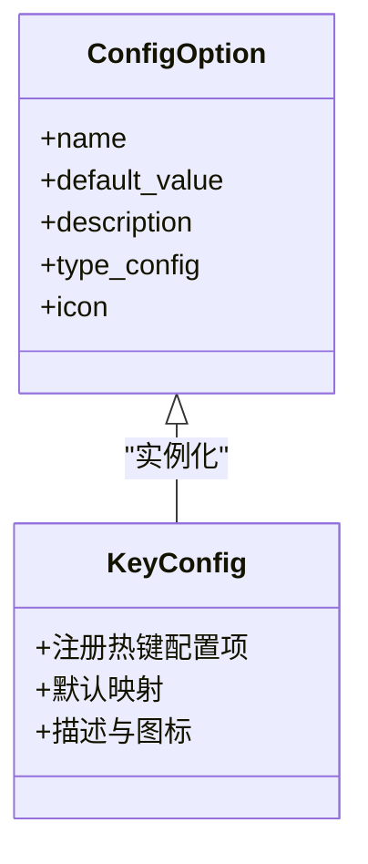
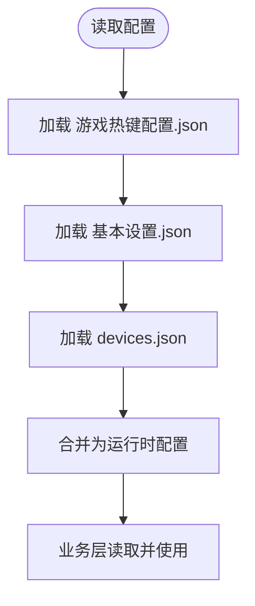
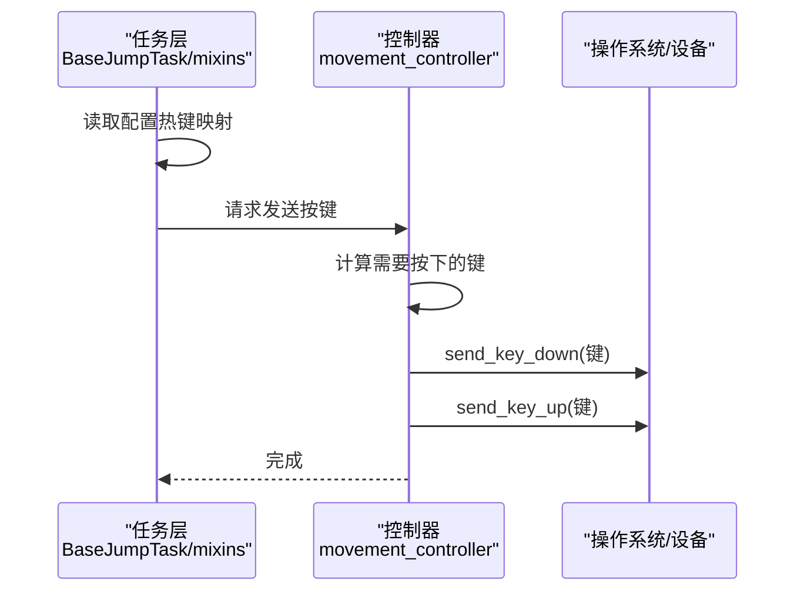
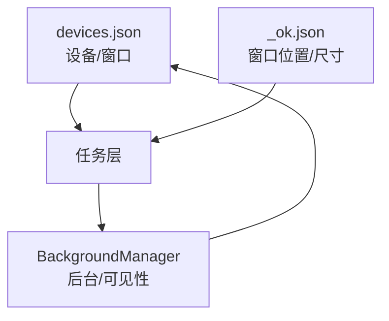
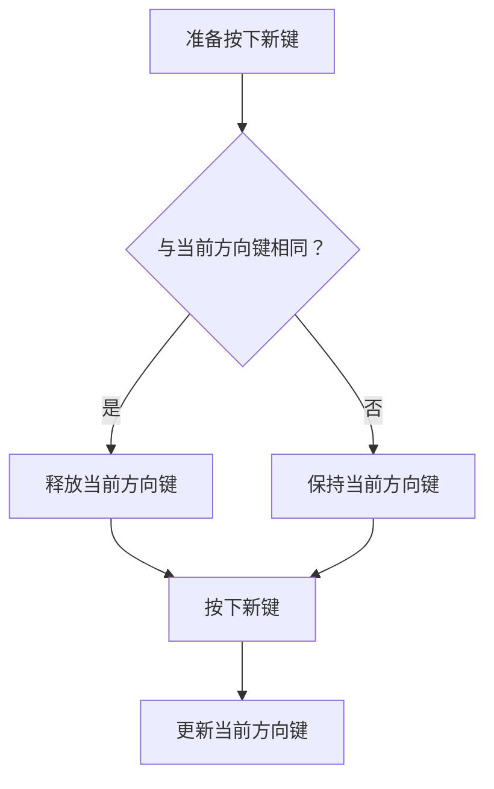
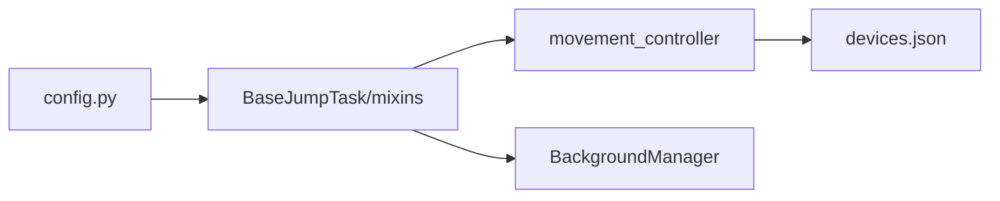

# 热键配置管理

<cite>
**本文档引用的文件**
- [config.py](file://config.py)
- [游戏热键配置.json](file://configs/游戏热键配置.json)
- [基本设置.json](file://configs/基本设置.json)
- [devices.json](file://configs/devices.json)
- [_ok.json](file://configs/_ok.json)
- [movement_controller.py](file://src/combat/movement_controller.py)
- [BaseJumpTask.py](file://src/task/BaseJumpTask.py)
- [mixins.py](file://src/task/mixins.py)
- [features.py](file://src/constants/features.py)
- [BackgroundManager.py](file://src/utils/BackgroundManager.py)
- [AutoLoginTask.py](file://src/task/AutoLoginTask.py)
</cite>

## 目录
1. [简介](#简介)
2. [项目结构](#项目结构)
3. [核心组件](#核心组件)
4. [架构总览](#架构总览)
5. [详细组件分析](#详细组件分析)
6. [依赖分析](#依赖分析)
7. [性能考虑](#性能考虑)
8. [故障排查指南](#故障排查指南)
9. [结论](#结论)
10. [附录](#附录)

## 简介
本文件面向开发者与高级用户，系统性说明本项目的热键配置管理方案。内容涵盖热键配置结构、注册与监听机制、响应流程、多设备支持与冲突检测、自定义配置与快捷键组合、按键映射、导入导出与备份恢复，以及扩展新热键功能的集成方法。文档以仓库现有实现为依据，结合配置文件与源码进行深入分析，并提供可视化图表帮助理解。

## 项目结构
热键相关的配置与实现主要分布在以下位置：
- 配置层：configs 目录下的 JSON 配置文件，用于存储热键映射与基本设置
- 配置注册层：config.py 中通过 ConfigOption 注册热键配置项
- 业务层：任务与控制器通过配置读取热键映射并执行按键操作
- 设备与窗口层：devices.json 等文件影响热键生效的设备与窗口上下文

**图表来源**
- [config.py:1-63](file://config.py#L1-L63)
- [游戏热键配置.json:1-6](file://configs/游戏热键配置.json#L1-L6)
- [基本设置.json:1-10](file://configs/基本设置.json#L1-L10)
- [devices.json:1-7](file://configs/devices.json#L1-L7)
- [BaseJumpTask.py:1-295](file://src/task/BaseJumpTask.py#L1-L295)
- [mixins.py:1-301](file://src/task/mixins.py#L1-L301)
- [movement_controller.py:132-260](file://src/combat/movement_controller.py#L132-L260)
- [BackgroundManager.py:47-84](file://src/utils/BackgroundManager.py#L47-L84)

**章节来源**
- [config.py:1-63](file://config.py#L1-L63)
- [游戏热键配置.json:1-6](file://configs/游戏热键配置.json#L1-L6)
- [基本设置.json:1-10](file://configs/基本设置.json#L1-L10)
- [devices.json:1-7](file://configs/devices.json#L1-L7)

## 核心组件
- 配置注册与描述：通过 ConfigOption 在 config.py 中注册“游戏热键配置”项，定义键位映射与描述信息，供 UI 展示与编辑
- 配置文件：configs/游戏热键配置.json 存储具体键位映射；configs/基本设置.json 存储通用快捷键（如 F9）
- 业务读取与执行：任务基类与混入类负责读取配置，控制器根据映射发送按键事件
- 设备与窗口上下文：devices.json 指定首选设备与窗口句柄，影响热键注入的目标窗口
- 后台与窗口状态：BackgroundManager 提供后台模式、静音与伪最小化，间接影响热键行为

**章节来源**
- [config.py:23-38](file://config.py#L23-L38)
- [游戏热键配置.json:1-6](file://configs/游戏热键配置.json#L1-L6)
- [基本设置.json:1-10](file://configs/基本设置.json#L1-L10)
- [devices.json:1-7](file://configs/devices.json#L1-L7)
- [mixins.py:252-301](file://src/task/mixins.py#L252-L301)

## 架构总览
热键系统采用“配置驱动 + 任务执行”的分层架构：
- 配置层：集中管理热键映射与通用快捷键
- 注册层：通过 ConfigOption 将配置暴露给 UI 与框架
- 执行层：任务与控制器读取配置，调用底层按键发送接口
- 设备层：devices.json 决定目标窗口与设备类型
- 状态层：BackgroundManager 提供后台/窗口状态，影响热键注入时机与效果

**图表来源**
- [config.py:23-38](file://config.py#L23-L38)
- [游戏热键配置.json:1-6](file://configs/游戏热键配置.json#L1-L6)
- [基本设置.json:1-10](file://configs/基本设置.json#L1-L10)
- [BaseJumpTask.py:1-295](file://src/task/BaseJumpTask.py#L1-L295)
- [mixins.py:252-301](file://src/task/mixins.py#L252-L301)
- [movement_controller.py:132-260](file://src/combat/movement_controller.py#L132-L260)
- [devices.json:1-7](file://configs/devices.json#L1-L7)
- [BackgroundManager.py:47-84](file://src/utils/BackgroundManager.py#L47-L84)

## 详细组件分析

### 配置注册与描述（ConfigOption）
- 作用：将“游戏热键配置”注册为可编辑的配置项，提供默认映射、描述与图标
- 关键点：
  - 默认键位映射：普通攻击、技能1、技能2、大招
  - 描述字段用于 UI 提示
  - 图标用于在设置界面中识别类别

**图表来源**
- [config.py:23-38](file://config.py#L23-L38)

**章节来源**
- [config.py:23-38](file://config.py#L23-L38)

### 配置文件结构（JSON）
- 游戏热键配置.json：键为动作名称，值为按键字符
- 基本设置.json：包含通用快捷键（如启动/停止快捷键）与运行参数
- devices.json：设备与窗口选择，影响热键注入目标
- _ok.json：窗口位置与尺寸（间接影响热键注入区域）

**图表来源**
- [游戏热键配置.json:1-6](file://configs/游戏热键配置.json#L1-L6)
- [基本设置.json:1-10](file://configs/基本设置.json#L1-L10)
- [devices.json:1-7](file://configs/devices.json#L1-L7)
- [_ok.json:1-7](file://configs/_ok.json#L1-L7)

**章节来源**
- [游戏热键配置.json:1-6](file://configs/游戏热键配置.json#L1-L6)
- [基本设置.json:1-10](file://configs/基本设置.json#L1-L10)
- [devices.json:1-7](file://configs/devices.json#L1-L7)
- [_ok.json:1-7](file://configs/_ok.json#L1-L7)

### 任务与控制器中的热键使用
- 任务基类与混入类负责读取配置、维护状态、处理后台模式与窗口可见性
- movement_controller 通过 send_key_down/send_key_up 发送按键事件
- 控制器内部根据方向计算需要按下的键集合，并在必要时释放旧键

**图表来源**
- [BaseJumpTask.py:1-295](file://src/task/BaseJumpTask.py#L1-L295)
- [mixins.py:252-301](file://src/task/mixins.py#L252-L301)
- [movement_controller.py:132-260](file://src/combat/movement_controller.py#L132-L260)

**章节来源**
- [BaseJumpTask.py:1-295](file://src/task/BaseJumpTask.py#L1-L295)
- [mixins.py:252-301](file://src/task/mixins.py#L252-L301)
- [movement_controller.py:132-260](file://src/combat/movement_controller.py#L132-L260)

### 多设备支持与窗口上下文
- devices.json 指定首选设备与窗口句柄，影响热键注入的目标窗口
- _ok.json 提供窗口位置与尺寸，有助于确定热键注入区域
- 后台模式与窗口可见性由 BackgroundManager 管理，间接影响热键注入时机与效果

**图表来源**
- [devices.json:1-7](file://configs/devices.json#L1-L7)
- [_ok.json:1-7](file://configs/_ok.json#L1-L7)
- [BackgroundManager.py:47-84](file://src/utils/BackgroundManager.py#L47-L84)

**章节来源**
- [devices.json:1-7](file://configs/devices.json#L1-L7)
- [_ok.json:1-7](file://configs/_ok.json#L1-L7)
- [BackgroundManager.py:47-84](file://src/utils/BackgroundManager.py#L47-L84)

### 冲突检测机制
- 系统未提供显式的热键冲突检测逻辑
- 控制器内部在按键按下前会释放当前方向键，避免“按键叠加”
- 建议在新增热键时遵循“互斥方向键”策略，减少冲突风险

**图表来源**
- [movement_controller.py:206-223](file://src/combat/movement_controller.py#L206-L223)

**章节来源**
- [movement_controller.py:206-223](file://src/combat/movement_controller.py#L206-L223)

### 自定义配置、快捷键组合与按键映射
- 自定义配置：通过修改游戏热键配置.json 实现动作到按键的映射
- 快捷键组合：基本设置.json 支持下拉选择启动/停止快捷键（如 F9/F10/F11/F12）
- 按键映射：控制器内部将动作映射到具体键位，并在需要时进行方向计算

**章节来源**
- [config.py:40-63](file://config.py#L40-L63)
- [游戏热键配置.json:1-6](file://configs/游戏热键配置.json#L1-L6)
- [movement_controller.py:170-204](file://src/combat/movement_controller.py#L170-L204)

### 导入导出与备份恢复
- 导入导出：系统未提供专门的热键配置导入导出接口
- 备份恢复：可通过复制/替换 configs/游戏热键配置.json 与 configs/基本设置.json 实现备份与恢复
- 建议：在修改前备份原配置文件，修改后测试热键是否正常

**章节来源**
- [config.py:13-14](file://config.py#L13-L14)
- [游戏热键配置.json:1-6](file://configs/游戏热键配置.json#L1-L6)
- [基本设置.json:1-10](file://configs/基本设置.json#L1-L10)

### 扩展方法与新热键集成
- 新增热键步骤：
  1) 在游戏热键配置.json 中添加新的动作与按键映射
  2) 在 config.py 中更新 ConfigOption 的默认值与描述
  3) 在业务层（任务或控制器）中读取新配置并实现对应行为
  4) 如需快捷键组合，可在基本设置.json 中扩展下拉选项
- 注意事项：
  - 保持键位唯一性，避免冲突
  - 在控制器中遵循“先释放旧键，再按下新键”的策略
  - 测试不同设备与窗口状态下的热键行为

**章节来源**
- [config.py:23-38](file://config.py#L23-L38)
- [config.py:40-63](file://config.py#L40-L63)
- [movement_controller.py:206-223](file://src/combat/movement_controller.py#L206-L223)

## 依赖分析
- 配置注册依赖于外部框架的 ConfigOption
- 任务层依赖混入类提供的窗口与后台状态能力
- 控制器依赖任务层提供的按键发送接口
- 设备层与窗口层影响热键注入目标

**图表来源**
- [config.py:23-38](file://config.py#L23-L38)
- [BaseJumpTask.py:1-295](file://src/task/BaseJumpTask.py#L1-L295)
- [mixins.py:252-301](file://src/task/mixins.py#L252-L301)
- [movement_controller.py:132-260](file://src/combat/movement_controller.py#L132-L260)
- [devices.json:1-7](file://configs/devices.json#L1-L7)
- [BackgroundManager.py:47-84](file://src/utils/BackgroundManager.py#L47-L84)

**章节来源**
- [config.py:23-38](file://config.py#L23-L38)
- [BaseJumpTask.py:1-295](file://src/task/BaseJumpTask.py#L1-L295)
- [mixins.py:252-301](file://src/task/mixins.py#L252-L301)
- [movement_controller.py:132-260](file://src/combat/movement_controller.py#L132-L260)
- [devices.json:1-7](file://configs/devices.json#L1-L7)
- [BackgroundManager.py:47-84](file://src/utils/BackgroundManager.py#L47-L84)

## 性能考虑
- 延迟与节流：基本设置.json 提供“触发间隔”参数，可降低 CPU/GPU 使用率
- 后台模式：启用后台模式时，系统会尽量减少对前台窗口的依赖，提高稳定性
- 按键发送频率：控制器内部在方向变化时才释放与按下键，避免频繁按键操作

**章节来源**
- [config.py:40-63](file://config.py#L40-L63)
- [mixins.py:252-301](file://src/task/mixins.py#L252-L301)

## 故障排查指南
- 热键无效
  - 检查 devices.json 是否正确设置窗口句柄
  - 确认后台模式与窗口可见性状态
  - 验证游戏热键配置.json 的键位是否与实际游戏一致
- 冲突或按键叠加
  - 控制器会在方向变化时释放旧键，若仍出现冲突，检查自定义映射是否合理
- 快捷键不生效
  - 检查基本设置.json 中的启动/停止快捷键是否与系统冲突
- 后台静音与伪最小化
  - 通过 BackgroundManager 的状态检查，确认是否启用了后台时静音与伪最小化

**章节来源**
- [devices.json:1-7](file://configs/devices.json#L1-L7)
- [BackgroundManager.py:47-84](file://src/utils/BackgroundManager.py#L47-L84)
- [config.py:40-63](file://config.py#L40-L63)
- [movement_controller.py:206-223](file://src/combat/movement_controller.py#L206-L223)

## 结论
本热键配置管理方案以配置文件为核心，通过 ConfigOption 注册与 UI 集成，业务层读取并执行按键操作，辅以设备与窗口上下文控制。系统具备基础的冲突缓解策略与后台模式支持，适合在多设备与多窗口环境下稳定运行。建议在扩展新热键时遵循统一的映射规范与冲突规避策略，并通过配置备份实现安全变更。

## 附录
- 相关常量与特征：features.py 提供统一的特征名称常量，便于在识别与交互中复用
- 登录任务中的按键示例：AutoLoginTask 展示了如何通过 send_key 输入账号与验证码，可作为热键注入的参考

**章节来源**
- [features.py:1-86](file://src/constants/features.py#L1-L86)
- [AutoLoginTask.py:628-701](file://src/task/AutoLoginTask.py#L628-L701)