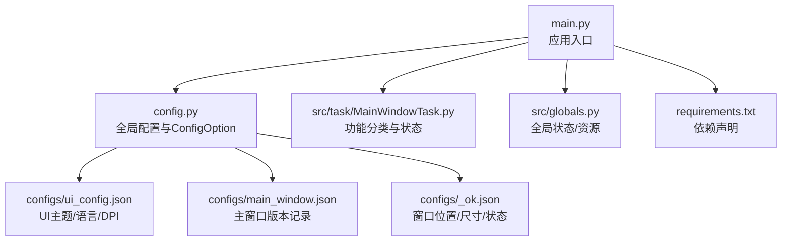
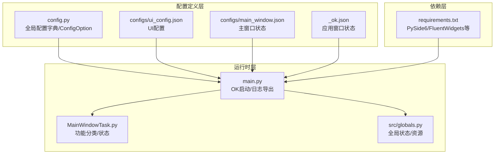
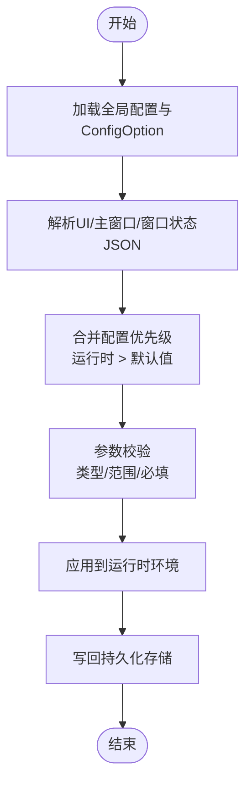
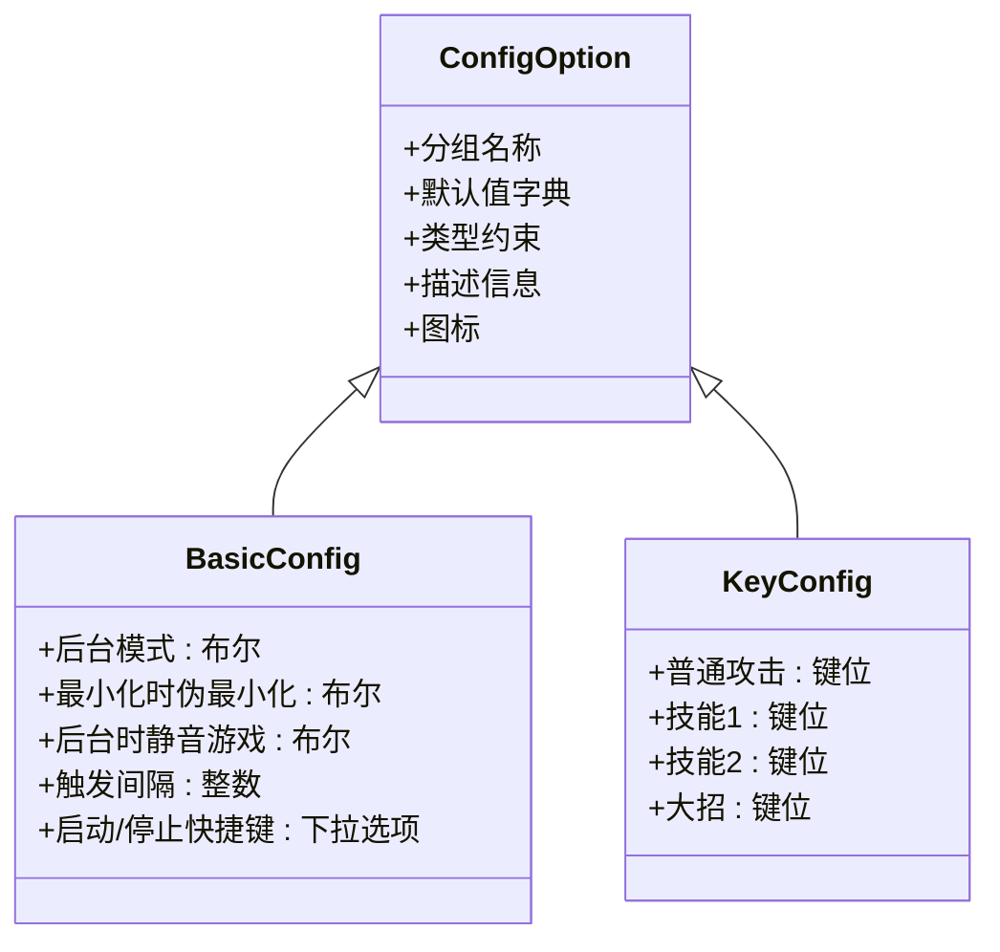
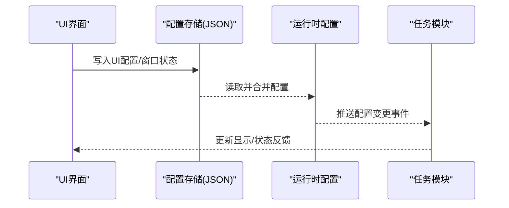
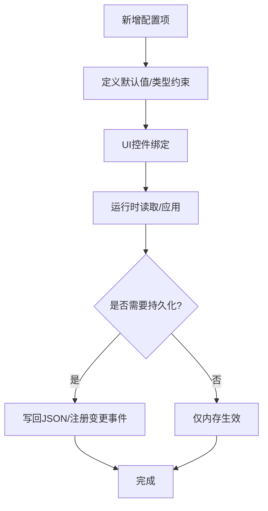
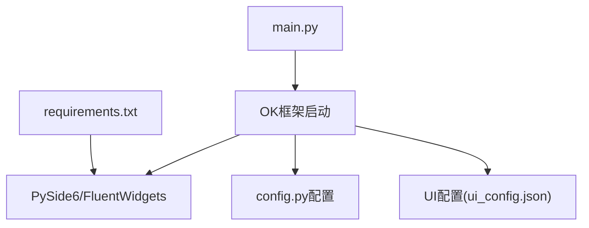

# 配置界面管理

<cite>
**本文引用的文件**
- [config.py](file://config.py)
- [main.py](file://main.py)
- [ui_config.json](file://configs/ui_config.json)
- [main_window.json](file://configs/main_window.json)
- [_ok.json](file://configs/_ok.json)
- [MainWindowTask.py](file://src/task/MainWindowTask.py)
- [requirements.txt](file://requirements.txt)
- [src/globals.py](file://src/globals.py)
</cite>

## 目录
1. [简介](#简介)
2. [项目结构](#项目结构)
3. [核心组件](#核心组件)
4. [架构总览](#架构总览)
5. [详细组件分析](#详细组件分析)
6. [依赖分析](#依赖分析)
7. [性能考虑](#性能考虑)
8. [故障排查指南](#故障排查指南)
9. [结论](#结论)
10. [附录](#附录)

## 简介
本文件面向开发者与高级用户，系统性阐述基于 PySide6 的配置界面管理机制。内容涵盖：
- 配置数据结构与参数校验规则
- 配置项的分类管理、默认值与用户偏好持久化
- 用户界面的动态更新与实时配置同步
- 扩展方法与新增配置项的添加流程
- 配置界面优化与用户体验改进建议

本项目采用集中式配置对象与 JSON 文件双轨存储：核心配置由 Python 字典与 ConfigOption 描述，UI 层配置与窗口状态由 JSON 文件维护。

## 项目结构
围绕配置界面管理的关键目录与文件如下：
- 根配置入口：config.py 定义全局配置与配置项元数据
- GUI 启动入口：main.py 初始化 OK 框架并启动应用
- UI 配置文件：configs/ui_config.json 控制 Fluent Widgets 主题、语言、DPI 等
- 主窗口状态：configs/main_window.json 记录上次版本号
- 应用窗口状态：configs/_ok.json 记录窗口位置与最大化状态
- 任务与功能索引：src/task/MainWindowTask.py 提供功能分类与状态展示
- 全局资源与状态：src/globals.py 提供全局状态与资源访问接口
- 依赖声明：requirements.txt 明确 PySide6 与相关组件版本

**图表来源**
- [main.py:1-33](file://main.py#L1-L33)
- [config.py:1-138](file://config.py#L1-L138)
- [configs/ui_config.json:1-17](file://configs/ui_config.json#L1-L17)
- [configs/main_window.json:1-3](file://configs/main_window.json#L1-L3)
- [configs/_ok.json:1-7](file://configs/_ok.json#L1-L7)
- [src/task/MainWindowTask.py:1-215](file://src/task/MainWindowTask.py#L1-L215)
- [src/globals.py:1-227](file://src/globals.py#L1-L227)
- [requirements.txt:1-13](file://requirements.txt#L1-L13)

**章节来源**
- [main.py:1-33](file://main.py#L1-L33)
- [config.py:1-138](file://config.py#L1-L138)
- [configs/ui_config.json:1-17](file://configs/ui_config.json#L1-L17)
- [configs/main_window.json:1-3](file://configs/main_window.json#L1-L3)
- [configs/_ok.json:1-7](file://configs/_ok.json#L1-L7)
- [src/task/MainWindowTask.py:1-215](file://src/task/MainWindowTask.py#L1-L215)
- [src/globals.py:1-227](file://src/globals.py#L1-L227)
- [requirements.txt:1-13](file://requirements.txt#L1-L13)

## 核心组件
- 全局配置中心：集中定义应用行为、窗口属性、OCR/模板匹配参数、设备与任务映射等
- 配置项描述器：通过 ConfigOption 定义配置分组、默认值、类型约束与描述信息
- UI 配置文件：控制 Fluent Widgets 主题、语言、DPI、更新策略等
- 主窗口状态与应用窗口状态：分别记录版本与窗口几何信息
- 任务与功能索引：以分类维度组织功能模块，便于 UI 展示与状态管理
- 全局资源与状态：提供全局状态访问与资源生命周期管理

**章节来源**
- [config.py:65-137](file://config.py#L65-L137)
- [config.py:23-63](file://config.py#L23-L63)
- [configs/ui_config.json:1-17](file://configs/ui_config.json#L1-L17)
- [configs/main_window.json:1-3](file://configs/main_window.json#L1-L3)
- [configs/_ok.json:1-7](file://configs/_ok.json#L1-L7)
- [src/task/MainWindowTask.py:7-47](file://src/task/MainWindowTask.py#L7-L47)
- [src/globals.py:16-227](file://src/globals.py#L16-L227)

## 架构总览
下图展示了配置数据从定义到持久化、再到 UI 展示与任务使用的整体流程。

**图表来源**
- [config.py:1-138](file://config.py#L1-L138)
- [configs/ui_config.json:1-17](file://configs/ui_config.json#L1-L17)
- [configs/main_window.json:1-3](file://configs/main_window.json#L1-L3)
- [configs/_ok.json:1-7](file://configs/_ok.json#L1-L7)
- [main.py:1-33](file://main.py#L1-L33)
- [src/task/MainWindowTask.py:1-215](file://src/task/MainWindowTask.py#L1-L215)
- [src/globals.py:1-227](file://src/globals.py#L1-L227)
- [requirements.txt:1-13](file://requirements.txt#L1-L13)

## 详细组件分析

### 配置数据结构与参数验证规则
- 分类与默认值
  - 基本设置：包含“最小化行为”“后台模式”“静音”“窗口大小调整”“触发间隔”“启动/停止快捷键”等，默认值在配置项中明确给出
  - 游戏热键配置：包含“普通攻击”“技能1/2”“大招”等键位，默认值为字符键
- 类型约束与描述
  - 对部分字段提供类型约束（如下拉框类型与选项集合）
  - 通过描述字段提供 UI 层提示文案
- 参数来源与覆盖
  - 全局配置字典集中管理 OCR、模板匹配、窗口、ADB、分辨率、窗口尺寸、日志路径等
  - UI 配置与窗口状态通过 JSON 文件持久化，运行时读取并生效

**图表来源**
- [config.py:65-137](file://config.py#L65-L137)
- [configs/ui_config.json:1-17](file://configs/ui_config.json#L1-L17)
- [configs/main_window.json:1-3](file://configs/main_window.json#L1-L3)
- [configs/_ok.json:1-7](file://configs/_ok.json#L1-L7)

**章节来源**
- [config.py:23-63](file://config.py#L23-L63)
- [config.py:65-137](file://config.py#L65-L137)
- [configs/ui_config.json:1-17](file://configs/ui_config.json#L1-L17)
- [configs/main_window.json:1-3](file://configs/main_window.json#L1-L3)
- [configs/_ok.json:1-7](file://configs/_ok.json#L1-L7)

### 配置项分类管理与默认值设置
- 分类维度
  - 基本设置：系统行为与窗口交互
  - 游戏热键配置：游戏内快捷键映射
- 默认值
  - 以上两类均在 ConfigOption 中定义默认值，确保首次启动即有合理行为
- 描述与图标
  - 通过描述字段与图标字段为 UI 层提供本地化与视觉标识

**图表来源**
- [config.py:23-63](file://config.py#L23-L63)

**章节来源**
- [config.py:23-63](file://config.py#L23-L63)

### 用户界面的动态更新与实时配置同步
- UI 配置
  - 通过 configs/ui_config.json 控制 Fluent Widgets 主题色、主题模式、语言、DPI、启动检查更新等
- 窗口状态
  - 通过 configs/_ok.json 记录窗口位置、尺寸与最大化状态，用于恢复上次会话
- 实时同步建议
  - 在 UI 修改配置后，应触发写回逻辑并通知相关模块刷新状态
  - 对于热键、分辨率、后台模式等关键项，应在变更后立即验证并反馈

**图表来源**
- [configs/ui_config.json:1-17](file://configs/ui_config.json#L1-L17)
- [configs/_ok.json:1-7](file://configs/_ok.json#L1-L7)
- [main.py:1-33](file://main.py#L1-L33)

**章节来源**
- [configs/ui_config.json:1-17](file://configs/ui_config.json#L1-L17)
- [configs/_ok.json:1-7](file://configs/_ok.json#L1-L7)
- [main.py:1-33](file://main.py#L1-L33)

### 用户偏好保存机制
- JSON 文件持久化
  - UI 主题/语言/DPI 等由 ui_config.json 维护
  - 主窗口版本与应用窗口状态由 main_window.json 与 _ok.json 维护
- 读写策略
  - 启动时读取并合并到运行时配置
  - 关闭或变更时写回对应 JSON 文件
- 一致性保障
  - 对关键字段进行类型与范围校验，避免异常值写入
  - 对缺失字段采用默认值回退策略

**章节来源**
- [configs/ui_config.json:1-17](file://configs/ui_config.json#L1-L17)
- [configs/main_window.json:1-3](file://configs/main_window.json#L1-L3)
- [configs/_ok.json:1-7](file://configs/_ok.json#L1-L7)

### 扩展方法与新增配置项添加流程
- 新增配置项步骤
  1) 在 config.py 的相应 ConfigOption 中添加键与默认值
  2) 如需 UI 下拉/输入限制，在类型约束中定义
  3) 在 UI 层为该配置项提供控件与绑定
  4) 在运行时读取并应用配置；必要时写回 JSON
- 新增配置分组
  1) 在全局配置字典中新增分组条目
  2) 在 UI 层新增分组页面或面板
  3) 在任务模块中接入新配置项的业务逻辑
- 示例参考
  - 基本设置与游戏热键配置已在现有结构中体现，可按相同模式扩展

**图表来源**
- [config.py:23-63](file://config.py#L23-L63)
- [config.py:65-137](file://config.py#L65-L137)

**章节来源**
- [config.py:23-63](file://config.py#L23-L63)
- [config.py:65-137](file://config.py#L65-L137)

### 开发者优化与用户体验改进建议
- 配置项分组与可见性
  - 将高频修改项置于显要位置，低频项归档至折叠面板
- 输入校验与即时反馈
  - 对热键、数值范围、路径等进行即时校验与错误提示
- 多语言与无障碍
  - 为描述与提示文案提供多语言支持，确保键盘可达性
- 性能与稳定性
  - 避免频繁写盘，批量写回；对耗时操作采用异步处理
- 可观测性
  - 记录配置变更日志，便于问题定位与回滚

[本节为通用建议，不直接分析具体文件]

## 依赖分析
- PySide6 与 Fluent Widgets
  - UI 界面与 Fluent Widgets 控件依赖由 requirements.txt 明确
- 运行时集成
  - main.py 通过 OK 框架启动应用，间接使用配置与 UI 配置
- 资源与任务
  - 任务模块与全局资源通过运行时配置进行初始化与联动

**图表来源**
- [requirements.txt:1-13](file://requirements.txt#L1-L13)
- [main.py:1-33](file://main.py#L1-L33)
- [config.py:1-138](file://config.py#L1-L138)
- [configs/ui_config.json:1-17](file://configs/ui_config.json#L1-L17)

**章节来源**
- [requirements.txt:1-13](file://requirements.txt#L1-L13)
- [main.py:1-33](file://main.py#L1-L33)
- [config.py:1-138](file://config.py#L1-L138)
- [configs/ui_config.json:1-17](file://configs/ui_config.json#L1-L17)

## 性能考虑
- 配置读写频率
  - 避免每次 UI 变更都写回磁盘，建议批处理或节流写入
- UI 渲染与事件
  - 对高频变更的配置项采用防抖/节流，减少不必要的界面重绘
- 资源加载
  - 全局资源（如 YOLO 模型）采用延迟加载与复用，降低启动开销

[本节为通用建议，不直接分析具体文件]

## 故障排查指南
- UI 配置不生效
  - 检查 configs/ui_config.json 是否存在语法错误或字段缺失
  - 确认运行时是否正确读取并合并配置
- 窗口状态异常
  - 检查 configs/_ok.json 的字段类型与范围是否符合预期
  - 确认应用启动顺序与读取时机
- 配置项无效或报错
  - 核对 ConfigOption 的默认值与类型约束
  - 对热键、数值范围等进行边界校验
- 日志导出
  - main.py 提供日志打包导出功能，可用于问题诊断

**章节来源**
- [configs/ui_config.json:1-17](file://configs/ui_config.json#L1-L17)
- [configs/_ok.json:1-7](file://configs/_ok.json#L1-L7)
- [config.py:23-63](file://config.py#L23-L63)
- [main.py:10-25](file://main.py#L10-L25)

## 结论
本项目以集中式配置为核心，结合 JSON 文件持久化与运行时配置合并，实现了清晰的配置管理与 UI 同步机制。通过 ConfigOption 对配置项进行分类、默认值与类型约束的统一管理，配合 Fluent Widgets 的 UI 配置，能够快速扩展新的配置项并保证一致的用户体验。建议在实际开发中强化输入校验、批处理写回与异步处理，以进一步提升性能与稳定性。

[本节为总结，不直接分析具体文件]

## 附录
- 相关文件清单
  - [config.py](file://config.py)
  - [main.py](file://main.py)
  - [configs/ui_config.json](file://configs/ui_config.json)
  - [configs/main_window.json](file://configs/main_window.json)
  - [configs/_ok.json](file://configs/_ok.json)
  - [src/task/MainWindowTask.py](file://src/task/MainWindowTask.py)
  - [src/globals.py](file://src/globals.py)
  - [requirements.txt](file://requirements.txt)

[本节为附录，不直接分析具体文件]