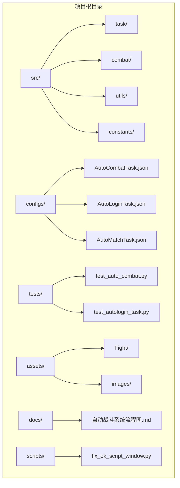
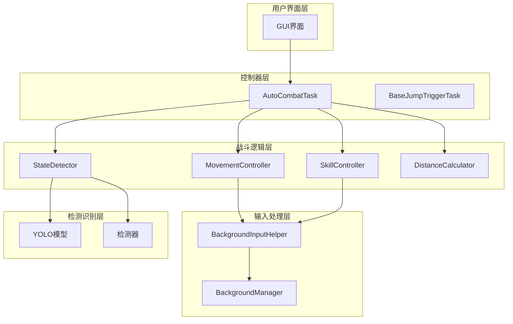
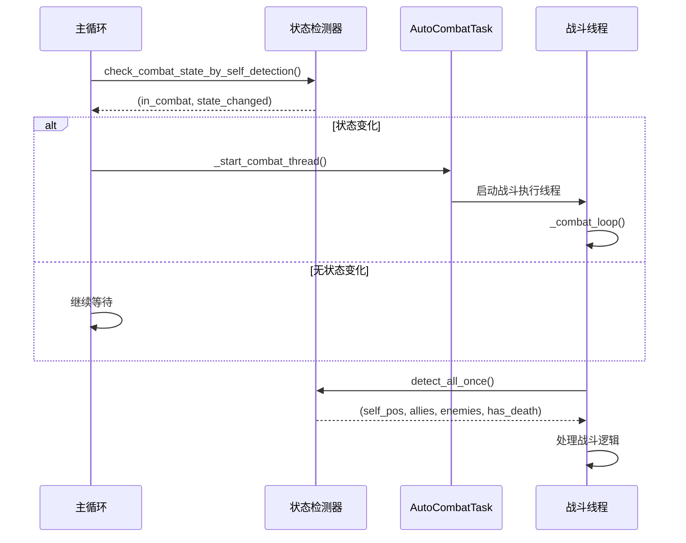
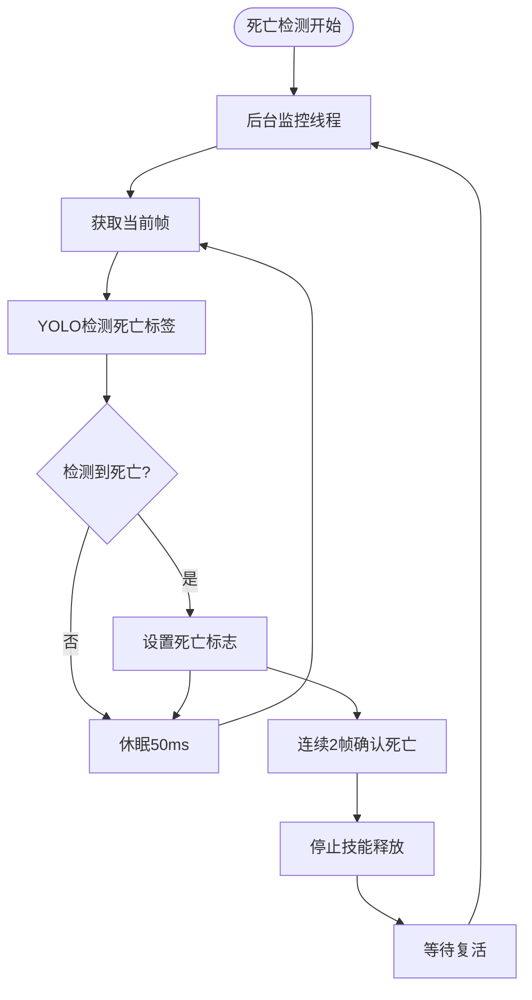
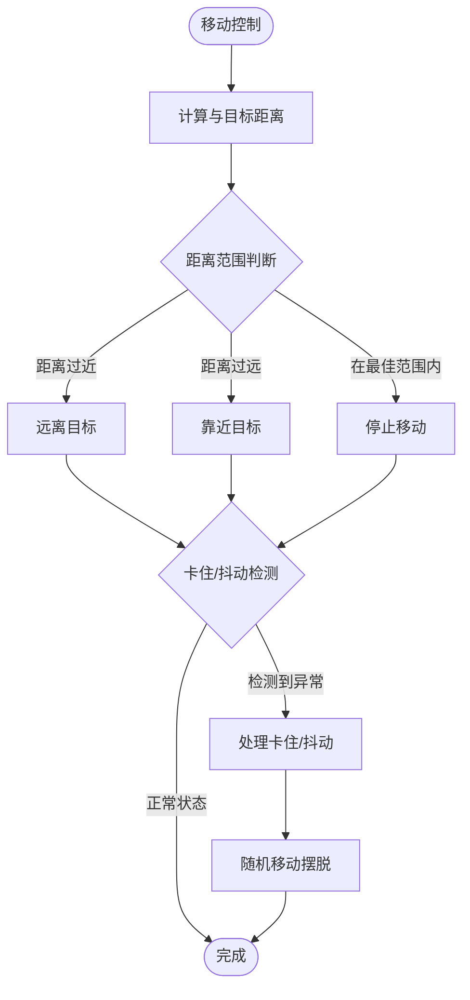
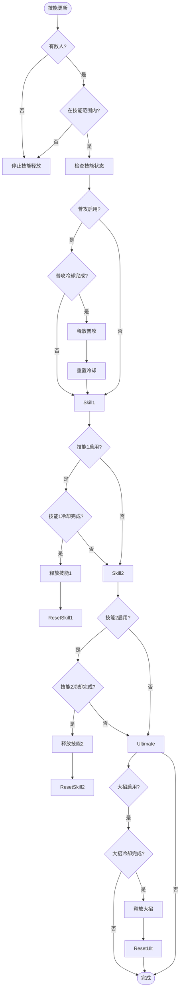
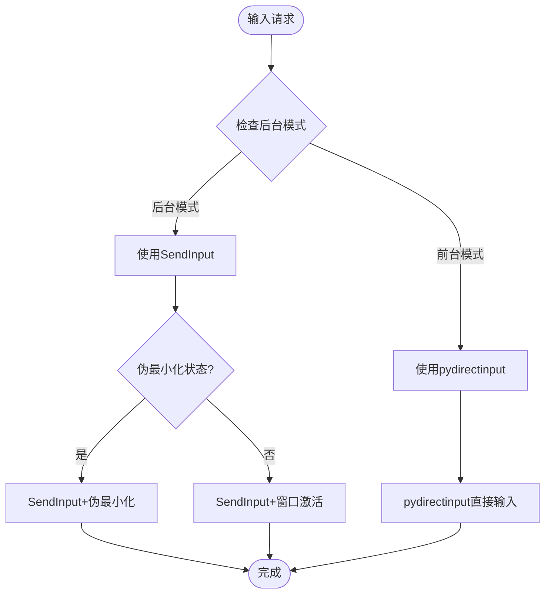
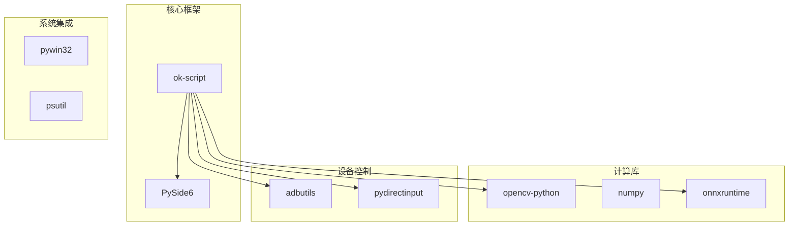
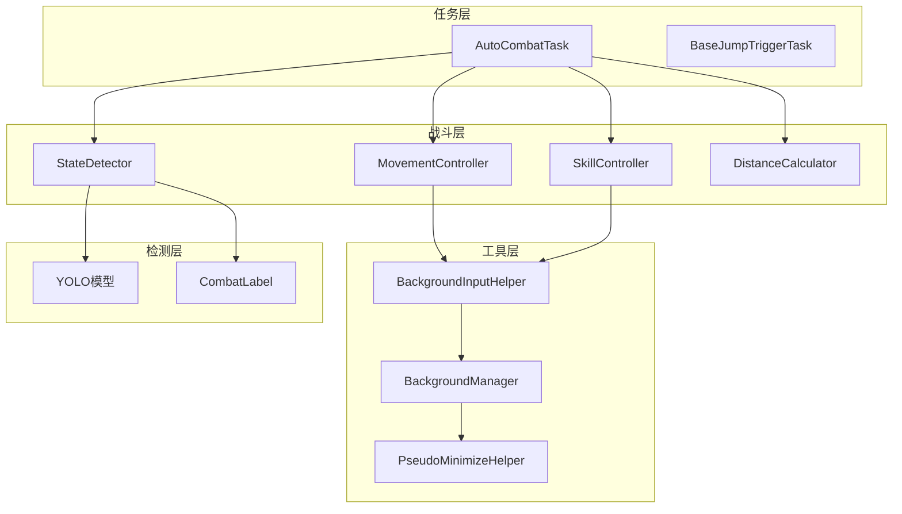

# Test Auto Combat

<cite>
**本文档引用的文件**
- [README.md](file://README.md)
- [main.py](file://main.py)
- [requirements.txt](file://requirements.txt)
- [AutoCombatTask.py](file://src/task/AutoCombatTask.py)
- [AutoCombatTask.json](file://configs/AutoCombatTask.json)
- [BackgroundInputHelper.py](file://src/utils/BackgroundInputHelper.py)
- [BackgroundManager.py](file://src/utils/BackgroundManager.py)
- [state_detector.py](file://src/combat/state_detector.py)
- [skill_controller.py](file://src/combat/skill_controller.py)
- [movement_controller.py](file://src/combat/movement_controller.py)
- [distance_calculator.py](file://src/combat/distance_calculator.py)
- [labels.py](file://src/combat/labels.py)
- [features.py](file://src/constants/features.py)
- [BaseJumpTriggerTask.py](file://src/task/BaseJumpTriggerTask.py)
- [自动战斗系统流程图.md](file://docs/自动战斗系统流程图.md)
- [test_auto_combat.py](file://tests/test_auto_combat.py)
</cite>

## 目录
1. [项目简介](#项目简介)
2. [项目结构](#项目结构)
3. [核心组件](#核心组件)
4. [架构总览](#架构总览)
5. [详细组件分析](#详细组件分析)
6. [依赖关系分析](#依赖关系分析)
7. [性能考虑](#性能考虑)
8. [故障排除指南](#故障排除指南)
9. [结论](#结论)
10. [附录](#附录)

## 项目简介
本项目是一个基于 OK-Script 框架的自动化测试工具，专注于游戏自动战斗功能。项目提供了完整的自动战斗系统，包括状态检测、移动控制、技能释放、后台支持等功能模块，并配套了单元测试以确保核心逻辑的稳定性。

项目采用模块化设计，通过配置文件驱动各个功能模块的行为，支持 PC 端键盘输入和移动端 ADB 模拟输入两种模式，具备完善的错误处理和性能优化机制。

## 项目结构
项目采用清晰的分层架构，主要目录结构如下：

**图表来源**
- [main.py:1-50](file://main.py#L1-L50)
- [requirements.txt:1-17](file://requirements.txt#L1-L17)

**章节来源**
- [README.md:1-8](file://README.md#L1-L8)
- [main.py:1-100](file://main.py#L1-L100)

## 核心组件
自动战斗系统由以下核心组件构成：

### 1. 主任务控制器
- **AutoCombatTask**: 主要的自动战斗任务类，继承自 BaseJumpTriggerTask
- **BaseJumpTriggerTask**: 触发任务基类，提供通用的游戏状态检测功能

### 2. 战斗状态管理
- **StateDetector**: 战斗状态检测器，使用 YOLO 模型进行单位识别
- **BattlefieldState**: 战场状态枚举，支持四种状态检测

### 3. 输入控制模块
- **MovementController**: 移动控制器，支持 WASD 键盘输入和虚拟摇杆
- **SkillController**: 技能控制器，支持多种技能释放和冷却管理
- **BackgroundInputHelper**: 后台输入助手，提供 Unity 游戏的后台支持

### 4. 辅助工具
- **DistanceCalculator**: 距离计算器，实现滞回机制和最佳攻击距离判断
- **BackgroundManager**: 后台管理器，处理窗口伪最小化和后台模式
- **PseudoMinimizeHelper**: 伪最小化助手，实现窗口位置管理

**章节来源**
- [AutoCombatTask.py:35-141](file://src/task/AutoCombatTask.py#L35-L141)
- [state_detector.py:24-63](file://src/combat/state_detector.py#L24-L63)
- [movement_controller.py:24-79](file://src/combat/movement_controller.py#L24-L79)
- [skill_controller.py:82-150](file://src/combat/skill_controller.py#L82-L150)

## 架构总览
系统采用分层架构设计，各层职责明确，耦合度低：

**图表来源**
- [AutoCombatTask.py:203-266](file://src/task/AutoCombatTask.py#L203-L266)
- [BackgroundInputHelper.py:99-137](file://src/utils/BackgroundInputHelper.py#L99-L137)
- [BackgroundManager.py:7-24](file://src/utils/BackgroundManager.py#L7-L24)

## 详细组件分析

### AutoCombatTask 主控制器
AutoCombatTask 是整个自动战斗系统的核心控制器，负责协调各个子模块的工作。

#### 主要功能特性：
- **状态感知模式**: 通过 YOLO 自身检测动态启停战斗
- **测试模式支持**: 跳过场景检测，直接进入战斗逻辑
- **后台模式支持**: 支持游戏窗口最小化时继续运行
- **线程安全设计**: 使用锁机制保护共享状态

#### 核心方法流程：

**图表来源**
- [AutoCombatTask.py:458-522](file://src/task/AutoCombatTask.py#L458-L522)
- [AutoCombatTask.py:523-569](file://src/task/AutoCombatTask.py#L523-L569)

**章节来源**
- [AutoCombatTask.py:203-266](file://src/task/AutoCombatTask.py#L203-L266)
- [AutoCombatTask.py:570-752](file://src/task/AutoCombatTask.py#L570-L752)

### StateDetector 状态检测器
StateDetector 负责使用 YOLO 模型进行战场状态检测，支持多种检测模式。

#### 检测能力：
- **死亡状态检测**: 并行后台线程持续监控
- **自身位置检测**: 15秒超时检测
- **友方/敌方单位检测**: 支持实时识别
- **战场状态判断**: 四种状态的智能判断

#### 死亡检测机制：

**图表来源**
- [state_detector.py:83-196](file://src/combat/state_detector.py#L83-L196)
- [state_detector.py:614-633](file://src/combat/state_detector.py#L614-L633)

**章节来源**
- [state_detector.py:24-63](file://src/combat/state_detector.py#L24-L63)
- [state_detector.py:199-324](file://src/combat/state_detector.py#L199-L324)

### MovementController 移动控制器
MovementController 提供智能的移动控制功能，支持多种移动模式。

#### 移动策略：
- **目标导向移动**: 根据敌人位置计算移动方向
- **距离控制**: 使用滞回机制避免频繁切换状态
- **卡住检测**: 检测角色卡住并自动摆脱
- **抖动检测**: 检测 A-B-A-B 模式并自动随机移动

#### 移动控制算法：

**图表来源**
- [movement_controller.py:110-170](file://src/combat/movement_controller.py#L110-L170)
- [distance_calculator.py:84-119](file://src/combat/distance_calculator.py#L84-L119)

**章节来源**
- [movement_controller.py:24-79](file://src/combat/movement_controller.py#L24-L79)
- [distance_calculator.py:14-51](file://src/combat/distance_calculator.py#L14-L51)

### SkillController 技能控制器
SkillController 实现智能的技能释放管理，支持多种技能和冷却机制。

#### 技能管理特性：
- **独立冷却系统**: 每个技能独立冷却，互不影响
- **配置驱动**: 严格遵循 GUI 设置的技能开关和间隔
- **后台支持**: 支持 Unity 游戏的后台技能释放
- **多平台适配**: 支持 PC 键盘和移动端 ADB 输入

#### 技能释放流程：

**图表来源**
- [skill_controller.py:323-355](file://src/combat/skill_controller.py#L323-L355)
- [skill_controller.py:279-322](file://src/combat/skill_controller.py#L279-L322)

**章节来源**
- [skill_controller.py:82-150](file://src/combat/skill_controller.py#L82-L150)
- [skill_controller.py:375-426](file://src/combat/skill_controller.py#L375-L426)

### BackgroundInputHelper 后台输入支持
BackgroundInputHelper 为 Unity 游戏提供可靠的后台输入支持，解决 DirectInput 检测问题。

#### 支持的输入模式：
- **前台模式**: 使用 pydirectinput，需要窗口激活
- **伪最小化模式**: 窗口移到屏幕外但仍保持活动状态
- **自动选择模式**: 根据后台状态自动选择最佳模式

#### 输入机制：

**图表来源**
- [BackgroundInputHelper.py:199-207](file://src/utils/BackgroundInputHelper.py#L199-L207)
- [BackgroundInputHelper.py:310-357](file://src/utils/BackgroundInputHelper.py#L310-L357)

**章节来源**
- [BackgroundInputHelper.py:99-137](file://src/utils/BackgroundInputHelper.py#L99-L137)
- [BackgroundManager.py:43-76](file://src/utils/BackgroundManager.py#L43-L76)

## 依赖关系分析

### 外部依赖
项目依赖以下关键库：

**图表来源**
- [requirements.txt:1-17](file://requirements.txt#L1-L17)

### 内部模块依赖

**图表来源**
- [AutoCombatTask.py:23-32](file://src/task/AutoCombatTask.py#L23-L32)
- [labels.py:8-37](file://src/combat/labels.py#L8-L37)

**章节来源**
- [requirements.txt:1-17](file://requirements.txt#L1-L17)
- [AutoCombatTask.py:23-32](file://src/task/AutoCombatTask.py#L23-L32)

## 性能考虑
系统在设计时充分考虑了性能优化：

### 1. 检测效率优化
- **YOLO 推理优化**: 使用单次全量检测替代多次分类检测，推理次数减少约 66%
- **检测频率调节**: 死亡检测频率提升至 20Hz，其他检测保持合理频率
- **缓存机制**: 使用滞回机制避免边界值频繁切换

### 2. 内存管理
- **线程安全**: 使用锁机制保护共享状态，避免竞态条件
- **资源清理**: 完善的资源清理机制，防止内存泄漏
- **对象池**: 技能冷却器等组件支持重置和复用

### 3. 后台性能
- **伪最小化**: 避免窗口激活带来的性能损耗
- **批量操作**: 合并相似操作，减少系统调用次数
- **异步处理**: 死亡检测等耗时操作使用独立线程

## 故障排除指南

### 常见问题及解决方案

#### 1. 技能释放异常
**症状**: 技能无法正常释放或释放频率异常
**排查步骤**:
1. 检查 AutoCombatTask.json 中的技能配置
2. 验证游戏热键配置是否正确
3. 确认后台模式设置是否正确

**解决方案**:
- 重启 AutoCombatTask 任务
- 检查游戏窗口焦点状态
- 验证 ADB 连接状态（移动端）

#### 2. 移动控制失效
**症状**: 角色无法正常移动或移动异常
**排查步骤**:
1. 检查 MovementController 的移动持续时间配置
2. 验证键盘映射是否正确
3. 确认游戏是否处于前台状态

**解决方案**:
- 调整移动持续时间参数
- 切换到伪最小化模式
- 检查输入设备权限

#### 3. 检测精度问题
**症状**: YOLO 检测不准确或响应缓慢
**排查步骤**:
1. 检查 YOLO 模型文件完整性
2. 验证摄像头或截图质量
3. 确认检测阈值设置

**解决方案**:
- 重新训练或更新 YOLO 模型
- 调整检测阈值参数
- 检查硬件性能是否满足要求

**章节来源**
- [AutoCombatTask.py:325-362](file://src/task/AutoCombatTask.py#L325-L362)
- [test_auto_combat.py:140-264](file://tests/test_auto_combat.py#L140-L264)

## 结论
Test Auto Combat 项目展现了优秀的软件工程实践，具有以下特点：

### 技术优势
- **模块化设计**: 清晰的分层架构，职责分离明确
- **配置驱动**: 通过配置文件灵活控制功能行为
- **性能优化**: 多层次的性能优化策略
- **错误处理**: 完善的异常处理和恢复机制

### 功能完整性
- 支持多种输入模式（PC 键盘、移动端 ADB）
- 具备完善的后台支持能力
- 提供丰富的配置选项
- 包含全面的单元测试

### 扩展性
- 插件化的模块设计便于功能扩展
- 配置驱动的架构支持快速定制
- 清晰的接口定义便于第三方集成

该项目为自动化测试和游戏辅助提供了完整的技术解决方案，具有良好的实用价值和推广前景。

## 附录

### 配置文件说明
- **AutoCombatTask.json**: 主要的战斗配置文件，包含技能开关、冷却间隔、移动参数等
- **游戏热键配置.json**: 定义各种技能对应的按键映射
- **基础选项.json**: 系统级别的配置选项，如后台模式设置

### 测试覆盖范围
单元测试涵盖了以下核心功能：
- StateDetector.detect_all_once() 全量检测
- AutoCombatTask 距离计算和目标锁定
- 移动控制的方向计算
- 卡住/抖动检测算法
- 死亡检测的防抖机制
- 技能生命周期管理

**章节来源**
- [AutoCombatTask.json:1-16](file://configs/AutoCombatTask.json#L1-L16)
- [test_auto_combat.py:1-28](file://tests/test_auto_combat.py#L1-L28)