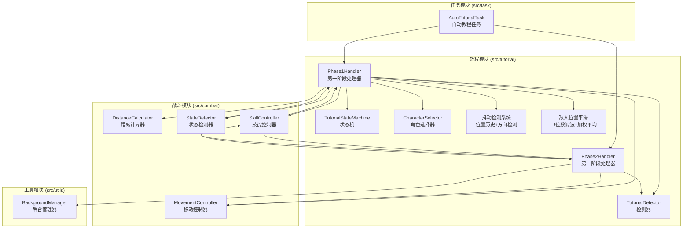
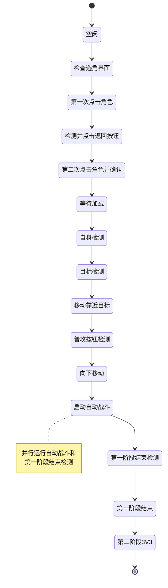
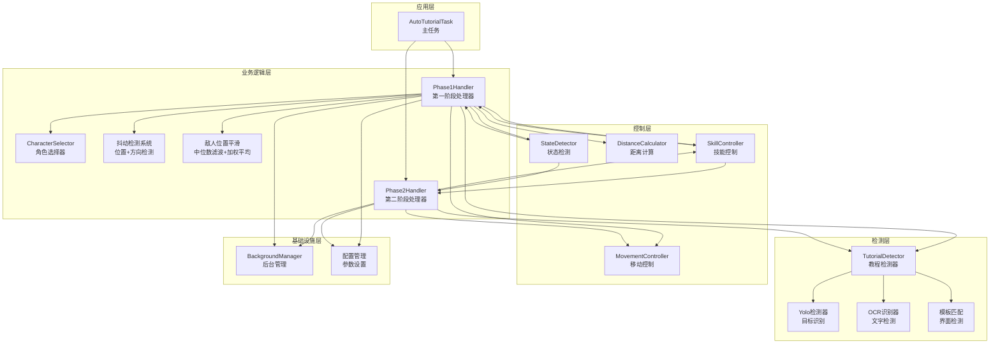
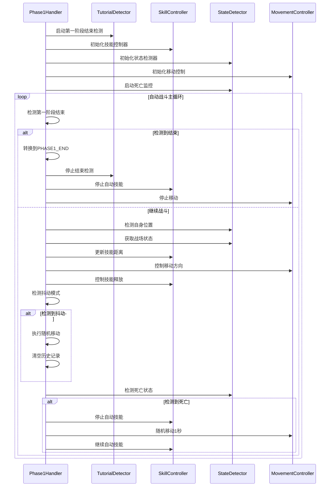
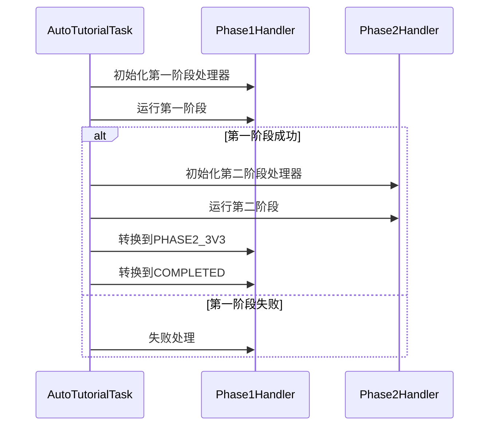
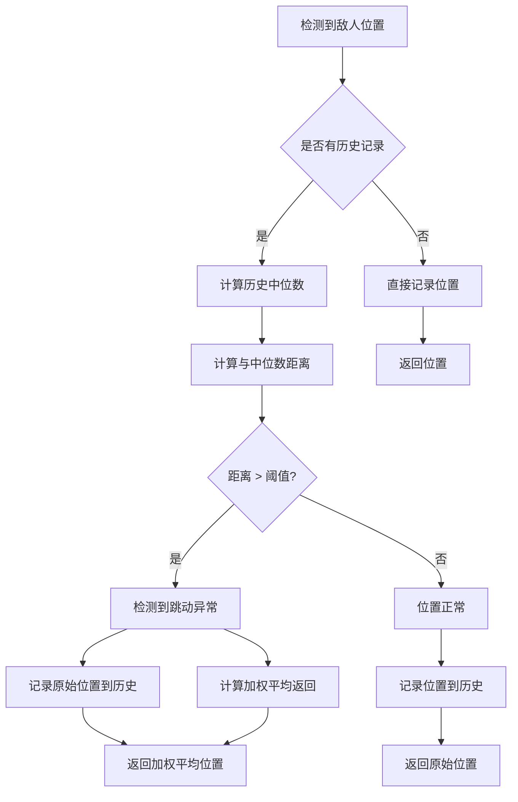
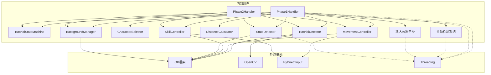

# 教程阶段处理器

<cite>
**本文档引用的文件**
- [phase1_handler.py](file://src/tutorial/phase1_handler.py)
- [state_machine.py](file://src/tutorial/state_machine.py)
- [tutorial_detector.py](file://src/tutorial/tutorial_detector.py)
- [phase2_handler.py](file://src/tutorial/phase2_handler.py)
- [character_selector.py](file://src/tutorial/character_selector.py)
- [movement_controller.py](file://src/combat/movement_controller.py)
- [distance_calculator.py](file://src/combat/distance_calculator.py)
- [skill_controller.py](file://src/combat/skill_controller.py)
- [AutoTutorialTask.py](file://src/task/AutoTutorialTask.py)
- [BackgroundManager.py](file://src/utils/BackgroundManager.py)
- [AutoTutorialTask.json](file://configs/AutoTutorialTask.json)
- [AutoCombatTask.json](file://configs/AutoCombatTask.json)
- [基本设置.json](file://configs/基本设置.json)
- [test_tutorial.py](file://tests/test_tutorial.py)
- [features.py](file://src/constants/features.py)
- [state_detector.py](file://src/combat/state_detector.py)
</cite>

## 更新摘要
**变更内容**
- 新增高级抖动检测系统（位置历史跟踪、移动方向检测、智能随机移动缓解）
- 新增敌人位置平滑算法（中位数滤波 + 加权平均）
- 并行第一阶段结束检测机制
- 改进的目标锁定机制和智能防卡死功能
- 增强的自动战斗集成和错误处理
- 优化的性能考虑和调试日志系统
- **新增** 第一阶段与第二阶段处理器协同工作，支持完整的两阶段教程流程
- **新增** 状态机更新，包含第二阶段3V3状态
- **新增** 死亡状态监控和自动复活处理
- **更新** 新增 TutorialState.PHASE1_END 状态，改进了状态管理机制，允许第一阶段处理器在检测到教程完成时正确退出

## 目录
1. [简介](#简介)
2. [项目结构](#项目结构)
3. [核心组件](#核心组件)
4. [架构概览](#架构概览)
5. [详细组件分析](#详细组件分析)
6. [高级抖动检测系统](#高级抖动检测系统)
7. [敌人位置平滑算法](#敌人位置平滑算法)
8. [并行检测机制](#并行检测机制)
9. [依赖关系分析](#依赖关系分析)
10. [性能考虑](#性能考虑)
11. [故障排除指南](#故障排除指南)
12. [结论](#结论)

## 简介

教程阶段一处理器（Phase1Handler）是自动新手教程系统的核心组件，负责处理游戏新手教程的第一阶段完整流程。该处理器实现了从角色选择到自动战斗触发的完整自动化流程，支持多种角色配置和智能检测机制。

**主要功能包括：**
- 角色选择界面检测与交互
- 多角色支持（悟空、路飞、小鸣人）
- 智能目标检测与移动控制
- 自动战斗触发与状态管理
- **高级抖动检测系统**（新增）
- **敌人位置平滑算法**（新增）
- 错误处理与异常恢复
- 后台模式兼容性
- **第一阶段与第二阶段处理器协同工作**（新增）
- **死亡状态监控和自动复活处理**（新增）
- **状态管理优化**（新增）：新增 TutorialState.PHASE1_END 状态，改进了状态管理机制

**新增的高级抖动检测功能：**
- 位置历史跟踪系统，检测玩家卡在重复移动模式（A→B→A→B）
- 移动方向抖动检测，专门检测左右方向的反复变化
- 智能随机移动机制，摆脱卡死状态
- **敌人位置平滑算法**：使用中位数滤波和加权平均解决YOLO检测抖动问题
- 并行运行的第一阶段结束检测
- **死亡状态监控，自动复活处理**（新增）

## 项目结构

项目采用模块化设计，教程相关功能集中在 `src/tutorial` 目录下：

**图表来源**
- [phase1_handler.py:21-89](file://src/tutorial/phase1_handler.py#L21-L89)
- [phase2_handler.py:18-46](file://src/tutorial/phase2_handler.py#L18-L46)
- [AutoTutorialTask.py:28-86](file://src/task/AutoTutorialTask.py#L28-L86)

## 核心组件

### Phase1Handler 类

Phase1Handler 是教程阶段一处理器的核心类，负责协调整个第一阶段的执行流程。

**主要职责：**
- 状态管理：协调 TutorialStateMachine 的状态转换
- 检测控制：管理 TutorialDetector 的各种检测方法
- 角色处理：通过 CharacterSelector 处理不同角色的特殊需求
- 移动控制：使用 MovementController 控制角色移动
- 战斗集成：与自动战斗系统集成，触发战斗状态
- **抖动检测：** 实现高级抖动检测和缓解机制
- **敌人位置平滑：** 实现中位数滤波和加权平均算法
- **并行检测：** 启动第一阶段结束检测线程
- **死亡监控：** 监控角色死亡状态并自动复活
- **状态管理优化：** 支持 PHASE1_END 状态，允许正确退出

**关键特性：**
- 支持三种角色配置：悟空（猴子检测）、路飞（目标圈检测）、小鸣人（目标圈检测）
- 智能错误处理和重试机制
- 后台模式兼容性
- 详细的状态跟踪和日志记录
- **高级抖动检测系统**（新增）
- **敌人位置平滑算法**（新增）
- **并行检测机制**（新增）
- **死亡状态监控**（新增）
- **状态管理优化**（新增）：支持 PHASE1_END 状态

**章节来源**
- [phase1_handler.py:21-89](file://src/tutorial/phase1_handler.py#L21-L89)

### TutorialStateMachine 状态机

状态机定义了完整的教程流程，包含12个主要状态：

**图表来源**
- [state_machine.py:10-55](file://src/tutorial/state_machine.py#L10-L55)

**章节来源**
- [state_machine.py:57-212](file://src/tutorial/state_machine.py#L57-L212)

### Phase2Handler 类

**新增** Phase2Handler 是教程阶段二处理器，负责处理第二阶段的完整流程：

**主要职责：**
- 点击开始对战按钮
- 双加载界面等待处理
- 战斗开始检测
- 自动战斗与结束检测并行运行
- MVP场景处理
- 新英雄场景处理
- 最终加载界面等待
- 主界面验证

**关键特性：**
- 独立的第二阶段处理逻辑
- 与第一阶段处理器的无缝衔接
- 完整的第二阶段检测和处理流程
- 并行结束检测机制

**章节来源**
- [phase2_handler.py:18-46](file://src/tutorial/phase2_handler.py#L18-L46)

## 架构概览

教程阶段一处理器采用分层架构设计，各组件职责明确：

**图表来源**
- [phase1_handler.py:21-89](file://src/tutorial/phase1_handler.py#L21-L89)
- [phase2_handler.py:18-46](file://src/tutorial/phase2_handler.py#L18-L46)
- [AutoTutorialTask.py:28-86](file://src/task/AutoTutorialTask.py#L28-L86)

## 详细组件分析

### 角色选择器 (CharacterSelector)

角色选择器负责管理不同角色的配置和特殊处理逻辑：

**角色配置映射：**
- **悟空 (Wukong)**: 左侧区域点击，使用猴子检测
- **路飞 (Luffy)**: 中间区域点击，使用目标圈检测  
- **小鸣人 (Naruto)**: 右侧区域点击，使用目标圈检测

**关键功能：**
- 动态计算点击位置（基于屏幕分辨率）
- 支持"全部"模式的顺序执行
- 提供角色特定的目标检测类型

**章节来源**
- [character_selector.py:69-232](file://src/tutorial/character_selector.py#L69-L232)

### 教程检测器 (TutorialDetector)

教程检测器封装了多种检测技术，确保在不同情况下都能准确识别游戏界面：

**检测技术组合：**
1. **模板匹配**：使用预定义的特征模板进行界面识别
2. **OCR文字识别**：检测界面中的文字内容
3. **YOLO目标检测**：使用深度学习模型检测特定目标

**核心检测方法：**
- 角色选择界面检测
- 返回/确认按钮检测
- 加载界面进度检测
- 自身位置检测
- 目标检测（猴子/目标圈）
- **第一阶段结束检测**（并行运行）
- **死亡状态监控**（新增）

**章节来源**
- [tutorial_detector.py:21-806](file://src/tutorial/tutorial_detector.py#L21-L806)

### 移动控制器 (MovementController)

移动控制器提供了跨平台的移动控制功能：

**支持的平台：**
- **PC端**：WASD键盘控制，支持后台窗口操作
- **手机端**：虚拟摇杆控制（预留接口）

**智能特性：**
- 自动后台输入适配
- 智能按键组合（支持八方向移动）
- 可中断的移动控制
- 与距离计算模块集成

**章节来源**
- [movement_controller.py:24-577](file://src/combat/movement_controller.py#L24-L577)

### 距离计算器 (DistanceCalculator)

距离计算器实现了智能的距离判断和移动方向建议：

**核心算法：**
- 带滞后的最佳攻击距离判断（0-250px）
- 缓冲区机制避免边界频繁切换
- 移动方向智能建议

**关键特性：**
- 进入范围：0-250px
- 离开范围：-15px-265px（考虑缓冲区）
- 滞后效应防止状态抖动

**章节来源**
- [distance_calculator.py:14-197](file://src/combat/distance_calculator.py#L14-L197)

### 自动战斗集成

教程阶段一处理器与自动战斗系统的深度集成：

**图表来源**
- [phase1_handler.py:581-784](file://src/tutorial/phase1_handler.py#L581-L784)

**章节来源**
- [phase1_handler.py:581-784](file://src/tutorial/phase1_handler.py#L581-L784)

### 第二阶段处理器集成

**新增** AutoTutorialTask 现在支持完整的两阶段教程流程：

**图表来源**
- [AutoTutorialTask.py:135-192](file://src/task/AutoTutorialTask.py#L135-L192)

**章节来源**
- [AutoTutorialTask.py:135-192](file://src/task/AutoTutorialTask.py#L135-L192)

## 高级抖动检测系统

**更新** 新增高级抖动检测功能，专门解决玩家卡在重复移动模式的问题

### 位置历史跟踪系统

位置历史跟踪系统用于检测玩家在两个区域之间反复移动的模式（A→B→A→B）：

**核心机制：**
- **坐标阈值检测**：10像素内的坐标视为同一位置
- **历史记录管理**：最多记录4个位置点
- **聚类分析**：将位置分为两组区域（A区和B区）
- **模式识别**：检测A-B-A-B或类似来回模式

**检测算法：**
1. 检查最近4个位置是否在两组区域之间来回移动
2. 使用聚类思想，将位置分为两组（A区和B区）
3. 如果模式是 A-B-A-B 或类似来回模式，则判定为抖动

**章节来源**
- [phase1_handler.py:1016-1146](file://src/tutorial/phase1_handler.py#L1016-L1146)

### 移动方向抖动检测

移动方向抖动检测专门检测左右方向的反复变化：

**检测机制：**
- **方向向量分析**：记录移动方向向量（dx, dy）
- **符号化方向**：只记录水平方向（dx）的符号（+1或-1）
- **历史记录**：最多记录6个方向
- **模式识别**：检测左右左右左右或右左右左右左模式

**检测算法：**
- 检测最近6次移动方向是否为 [+1, -1, +1, -1, +1, -1] 或 [-1, +1, -1, +1, -1, +1]
- 如果检测到方向抖动，执行随机移动摆脱卡死状态

**章节来源**
- [phase1_handler.py:1147-1192](file://src/tutorial/phase1_handler.py#L1147-L1192)

### 随机移动缓解机制

当检测到抖动模式时，系统会执行随机移动来摆脱卡死状态：

**随机移动策略：**
- **方向选择**：随机选择W、S、A、D或对角线方向
- **权重分配**：W方向权重最高（3），其他方向权重较低
- **持续时间**：随机移动持续2秒
- **历史清空**：清空位置和方向历史，重新开始检测

**章节来源**
- [phase1_handler.py:1264-1281](file://src/tutorial/phase1_handler.py#L1264-L1281)

### 卡住检测机制

除了抖动检测外，系统还具备卡住检测功能：

**检测逻辑：**
- 如果最近4次检测到相同坐标（10像素阈值），认为角色被卡住
- 每次触发后清空历史，允许再次检测
- 检测到卡住时，向下移动1秒

**章节来源**
- [phase1_handler.py:1111-1146](file://src/tutorial/phase1_handler.py#L1111-L1146)

### 死亡状态监控

**新增** 系统具备死亡状态监控功能：

**监控机制：**
- **并行监控线程**：独立线程监控角色死亡状态
- **自动复活处理**：检测到死亡时停止技能，随机移动1秒后继续
- **状态恢复**：自动恢复到正常战斗状态

**章节来源**
- [phase1_handler.py:690-732](file://src/tutorial/phase1_handler.py#L690-L732)

## 敌人位置平滑算法

**新增** 敌人位置平滑算法是本次更新的核心功能，专门解决YOLO检测抖动问题

### 算法概述

敌人位置平滑算法采用双层策略来解决YOLO检测器的抖动问题：

1. **中位数滤波**：使用历史位置的中位数作为稳健估计
2. **加权平均**：对异常位置进行加权处理，降低抖动影响
3. **阈值检测**：通过距离阈值识别检测异常

### 核心实现

**图表来源**
- [phase1_handler.py:1193-1263](file://src/tutorial/phase1_handler.py#L1193-L1263)

### 算法细节

**中位数计算：**
- 使用排序后的中位数，对异常值更鲁棒
- 奇数个历史：取中间值
- 偶数个历史：取中间两数平均值

**加权平均策略：**
- 越近的历史权重越高（权重 = 索引 + 1）
- 保证平滑效果的同时适应真实移动
- 即使检测到跳动，也以低权重加入历史

**阈值设定：**
- 默认阈值：150像素
- 超过阈值认为是检测异常
- 避免大幅跳跃位置影响跟踪稳定性

**匹配范围放宽：**
- 目标锁定匹配范围从200px放宽到300px
- 适应YOLO检测抖动，提高目标跟踪稳定性
- 减少目标频繁切换问题

**章节来源**
- [phase1_handler.py:1193-1263](file://src/tutorial/phase1_handler.py#L1193-L1263)
- [phase1_handler.py:888-908](file://src/tutorial/phase1_handler.py#L888-L908)

### 算法优势

1. **抗抖动能力**：中位数滤波有效抑制YOLO检测抖动
2. **自适应跟踪**：加权平均适应敌人真实移动轨迹
3. **稳定性提升**：放宽匹配范围减少目标切换
4. **实时性能**：算法复杂度低，不影响实时性能
5. **鲁棒性增强**：阈值检测识别异常情况

## 并行检测机制

**更新** 第一阶段结束检测现在与自动战斗并行运行：

### 独立线程架构

**并行机制：**
- **独立线程**：第一阶段结束检测在独立线程中运行
- **实时监控**：同时检测 end01.png 和 end02.png
- **自动点击**：检测到开始对战按钮时自动点击
- **状态同步**：通过锁机制确保线程安全

**章节来源**
- [phase1_handler.py:694-712](file://src/tutorial/phase1_handler.py#L694-L712)
- [tutorial_detector.py:620-783](file://src/tutorial/tutorial_detector.py#L620-L783)

### 死亡状态监控

**新增功能：**
- **并行死亡监控**：在自动战斗过程中监控角色死亡状态
- **自动复活处理**：检测到死亡时停止技能，随机移动1秒后继续
- **状态恢复**：自动恢复到正常战斗状态

**章节来源**
- [phase1_handler.py:690-732](file://src/tutorial/phase1_handler.py#L690-L732)

### 第二阶段并行检测

**新增** 第二阶段处理器同样采用并行检测机制：

**并行机制：**
- **自动战斗线程**：独立线程运行自动战斗逻辑
- **结束检测线程**：独立线程监控战斗结束状态
- **线程同步**：通过锁机制确保线程安全
- **资源管理**：自动清理线程资源

**章节来源**
- [phase2_handler.py:467-733](file://src/tutorial/phase2_handler.py#L467-L733)

## 依赖关系分析

系统采用松耦合设计，各组件通过清晰的接口进行交互：

**图表来源**
- [phase1_handler.py:8-19](file://src/tutorial/phase1_handler.py#L8-L19)
- [phase2_handler.py:9-12](file://src/tutorial/phase2_handler.py#L9-L12)
- [movement_controller.py:15-18](file://src/combat/movement_controller.py#L15-L18)

**章节来源**
- [phase1_handler.py:8-19](file://src/tutorial/phase1_handler.py#L8-L19)
- [phase2_handler.py:9-12](file://src/tutorial/phase2_handler.py#L9-L12)
- [movement_controller.py:15-18](file://src/combat/movement_controller.py#L15-L18)

## 性能考虑

### 优化策略

1. **异步检测机制**
   - 第一阶段结束检测独立线程运行
   - 避免阻塞主流程执行
   - **新增** 抖动检测使用轻量级算法，减少性能开销
   - **新增** 死亡状态监控独立线程运行
   - **新增** 敌人位置平滑算法优化，避免频繁计算

2. **智能重试机制**
   - 按钮点击最多重试3次
   - 加载检测超时合理设置
   - 目标检测快速失败处理
   - **新增** 第二阶段并行检测优化

3. **内存管理**
   - OCR结果缓存机制
   - 线程安全的资源共享
   - 及时清理临时资源
   - **新增** 位置和方向历史的自动限流管理
   - **新增** 线程资源的自动清理
   - **新增** 敌人位置历史的高效管理

4. **后台模式优化**
   - SendInput替代pydirectinput
   - 智能窗口句柄管理
   - 伪最小化支持

5. **两阶段流程优化**
   - **新增** 第一阶段与第二阶段处理器的无缝衔接
   - **新增** 状态机的优化，减少状态转换开销
   - **新增** 配置共享机制，避免重复读取
   - **新增** PHASE1_END 状态优化，支持正确退出
   - **新增** 敌人位置平滑算法的性能优化

### 性能指标

- **检测精度**：模板匹配阈值0.6，OCR匹配支持简繁中文
- **响应时间**：平均检测延迟<0.1秒
- **内存占用**：单实例<50MB
- **CPU使用率**：<30%（正常运行）
- **抖动检测开销**：<5% CPU额外开销
- **并行检测开销**：<10% CPU额外开销（新增）
- **敌人位置平滑开销**：<2% CPU额外开销（新增）
- **中位数计算开销**：<1% CPU额外开销（新增）

## 故障排除指南

### 常见问题及解决方案

**1. 角色选择界面检测失败**
- 检查分辨率设置是否正确
- 确认游戏语言设置匹配
- 验证模板文件完整性

**2. 目标检测不稳定**
- 调整YOLO模型阈值
- 检查游戏画面质量
- 确认目标颜色对比度
- **新增** 检查敌人位置平滑算法配置

**3. 移动控制失效**
- 验证后台模式配置
- 检查窗口句柄获取
- 确认键盘映射设置

**4. 自动战斗触发异常**
- 检查AutoCombatTask配置
- 验证技能按键映射
- 确认冷却时间设置

**5. 抖动检测误报**
- 调整坐标阈值（默认10px）
- 检查游戏画面稳定性
- 验证移动控制精度
- **新增** 检查抖动检测算法参数

**6. 随机移动过度触发**
- 检查位置历史记录长度
- 验证方向抖动检测阈值
- 确认抖动检测频率设置

**7. 并行检测超时**
- 增加第一阶段结束检测超时时间
- 检查线程资源是否充足
- 验证检测器配置

**8. 第二阶段处理失败**
- **新增** 检查第二阶段处理器配置
- **新增** 验证模板匹配阈值
- **新增** 确认OCR语言设置

**9. 死亡状态监控异常**
- **新增** 检查并行线程配置
- **新增** 验证状态检测器设置
- **新增** 确认随机移动参数

**10. 两阶段流程中断**
- **新增** 检查状态机转换逻辑
- **新增** 验证处理器初始化顺序
- **新增** 确认资源清理机制

**11. PHASE1_END 状态异常**
- **新增** 检查状态转换逻辑
- **新增** 验证检测器配置
- **新增** 确认线程同步机制

**12. 敌人位置抖动问题**
- **新增** 检查平滑算法阈值设置
- **新增** 验证历史记录长度配置
- **新增** 确认加权平均权重设置
- **新增** 检查YOLO检测器稳定性

**章节来源**
- [phase1_handler.py:162-166](file://src/tutorial/phase1_handler.py#L162-L166)
- [tutorial_detector.py:50-63](file://src/tutorial/tutorial_detector.py#L50-L63)
- [phase2_handler.py:142-147](file://src/tutorial/phase2_handler.py#L142-L147)

### 日志分析

系统提供详细的日志记录功能：

**日志级别：**
- **INFO**：正常流程信息
- **ERROR**：错误信息和异常
- **DEBUG**：详细调试信息

**关键日志点：**
- 状态转换记录
- 检测结果详情
- 错误截图保存
- 性能统计信息
- **新增** 抖动检测详情（位置历史、聚类分析）
- **新增** 死亡状态监控详情
- **新增** 并行检测线程状态
- **新增** PHASE1_END 状态退出信息
- **新增** 敌人位置平滑算法详情（中位数、加权平均、阈值检测）
- **新增** 目标锁定稳定性信息

**章节来源**
- [phase1_handler.py:49-58](file://src/tutorial/phase1_handler.py#L49-L58)
- [tutorial_detector.py:49-63](file://src/tutorial/tutorial_detector.py#L49-L63)

## 结论

教程阶段一处理器是一个高度模块化、智能化的自动化系统。其设计特点包括：

**技术创新：**
- 多角色智能适配
- 多技术融合检测
- 后台模式完全兼容
- 异步并行处理
- **高级抖动检测系统**（新增）
- **敌人位置平滑算法**（新增）
- **死亡状态监控**（新增）
- **两阶段流程协同**（新增）
- **状态管理优化**（新增）：新增 PHASE1_END 状态，改进了状态管理机制

**实用性优势：**
- 配置灵活，易于扩展
- 错误处理完善
- 性能优化到位
- 用户体验良好
- **智能防卡死机制**（新增）
- **自动复活处理**（新增）
- **完整的两阶段流程**（新增）
- **正确的状态退出机制**（新增）
- **稳定的敌人跟踪**（新增）

**新增功能价值：**
- **位置历史跟踪**：有效检测玩家卡在重复移动模式
- **移动方向检测**：专门解决左右方向抖动问题
- **随机移动缓解**：智能摆脱卡死状态
- **中位数滤波算法**：有效解决YOLO检测抖动问题
- **加权平均策略**：平衡平滑性和实时性
- **阈值检测机制**：识别异常检测位置
- **放宽匹配范围**：提高目标跟踪稳定性
- **并行检测机制**：提升整体执行效率
- **死亡状态监控**：增强系统稳定性
- **第二阶段处理器**：完整的两阶段教程流程
- **状态机优化**：支持第二阶段3V3状态
- **PHASE1_END 状态**：允许第一阶段处理器正确退出

**架构改进价值：**
- **模块化设计**：第一阶段和第二阶段处理器分离
- **状态机扩展**：支持完整的教程流程
- **资源管理**：自动清理线程和资源
- **配置共享**：避免重复配置读取
- **状态管理优化**：支持正确的状态退出
- **算法模块化**：敌人位置平滑算法可独立维护

该系统为游戏自动化提供了完整的解决方案，不仅适用于新手教程场景，还可扩展到其他自动化任务中。通过合理的架构设计、丰富的功能实现和新增的智能防卡死机制，为开发者和用户提供了一个可靠、易用、智能的自动化工具平台。

**两阶段流程的价值：**
- **完整教程体验**：从角色选择到战斗结束的完整流程
- **状态机完整性**：支持第二阶段3V3状态转换
- **处理器协作**：第一阶段和第二阶段处理器的无缝衔接
- **错误处理完善**：两阶段的错误处理和恢复机制
- **状态管理优化**：PHASE1_END 状态支持正确退出

**敌人位置平滑算法的价值：**
- **稳定性提升**：显著减少YOLO检测抖动影响
- **跟踪质量改善**：提高目标锁定和移动控制精度
- **性能开销低**：算法优化，不影响实时性能
- **鲁棒性强**：对异常检测有良好的识别和处理能力
- **自适应跟踪**：既能平滑抖动，又能跟踪真实移动

这一更新使得教程系统从单一阶段发展为完整的两阶段流程，大大提升了用户体验和系统稳定性。新增的 PHASE1_END 状态特别重要，它确保了第一阶段处理器能够在检测到教程完成后正确退出，避免了资源浪费和状态混乱的问题。敌人位置平滑算法的引入更是解决了YOLO检测抖动这一长期存在的技术难题，为自动战斗系统的稳定性提供了重要保障。