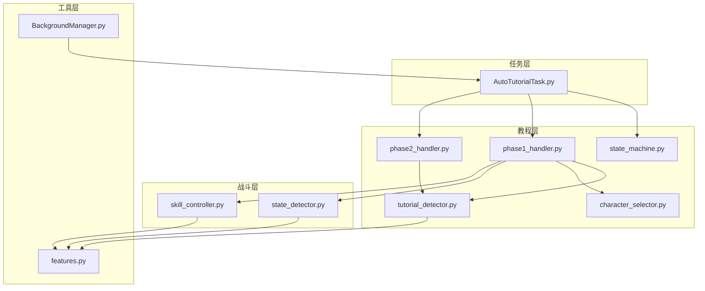
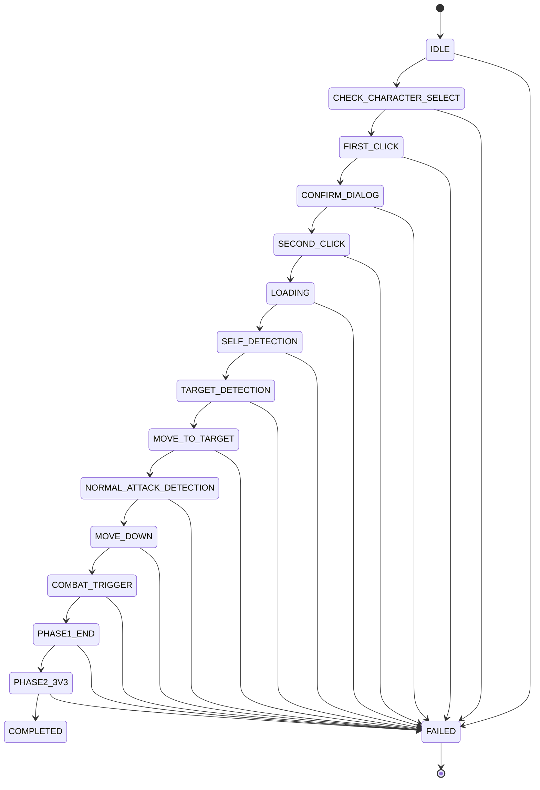
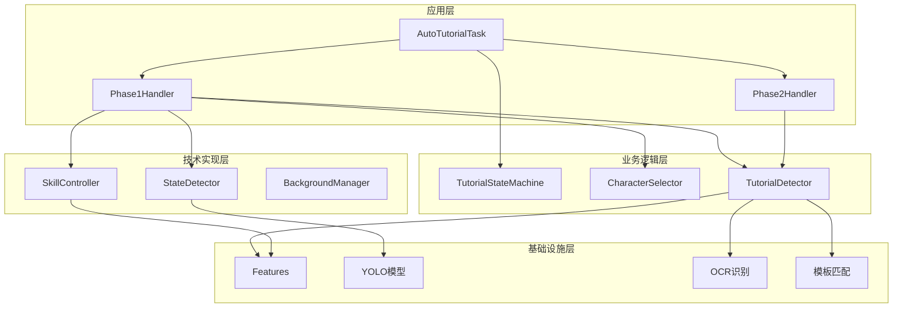
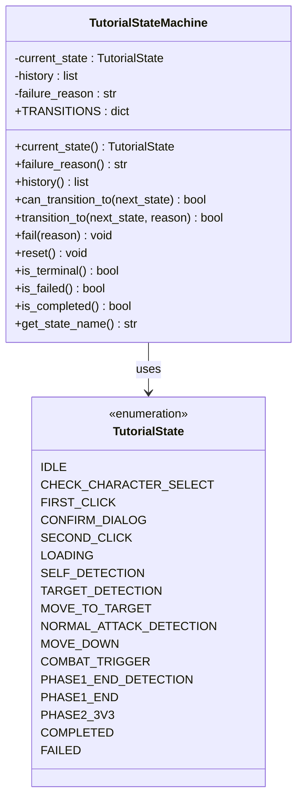
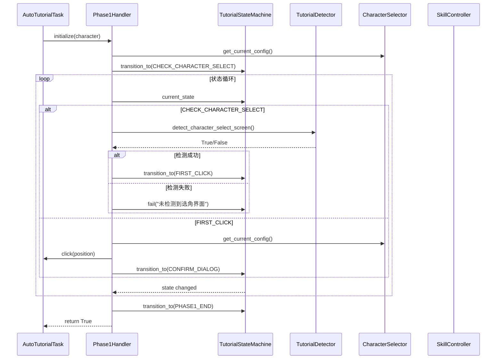
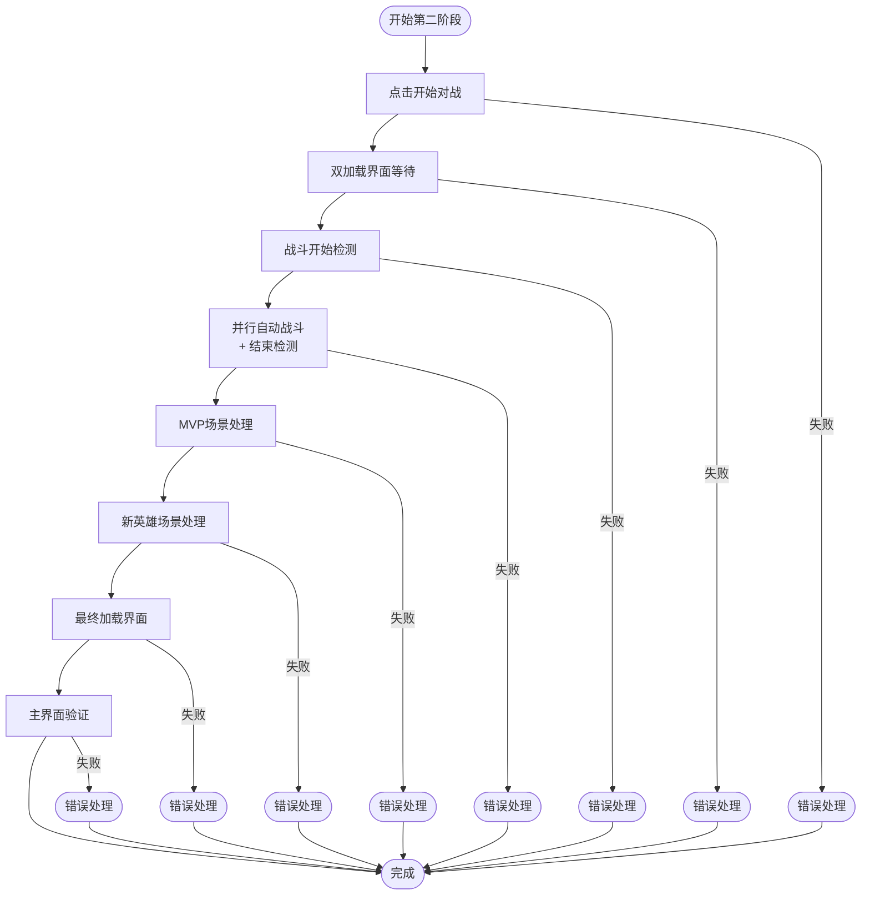
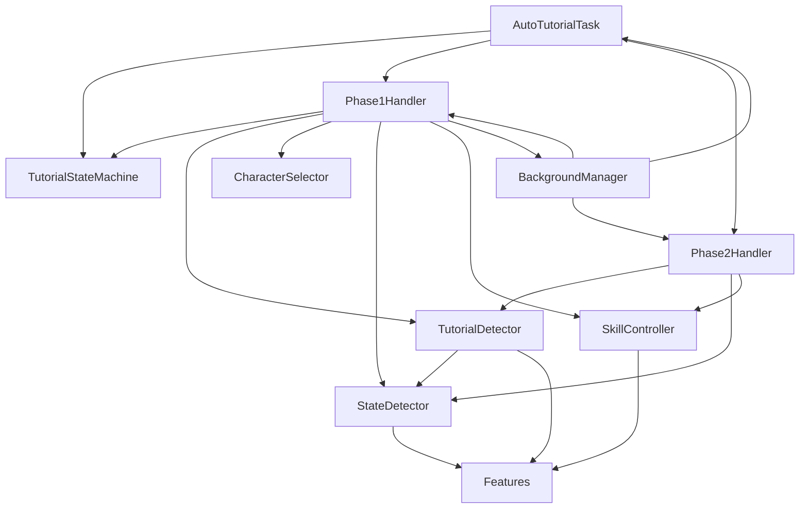

# 教程状态机

<cite>
**本文档引用的文件**
- [state_machine.py](file://src/tutorial/state_machine.py)
- [phase1_handler.py](file://src/tutorial/phase1_handler.py)
- [phase2_handler.py](file://src/tutorial/phase2_handler.py)
- [tutorial_detector.py](file://src/tutorial/tutorial_detector.py)
- [character_selector.py](file://src/tutorial/character_selector.py)
- [AutoTutorialTask.py](file://src/task/AutoTutorialTask.py)
- [features.py](file://src/constants/features.py)
- [state_detector.py](file://src/combat/state_detector.py)
- [skill_controller.py](file://src/combat/skill_controller.py)
- [BackgroundManager.py](file://src/utils/BackgroundManager.py)
- [AutoTutorialTask.json](file://configs/AutoTutorialTask.json)
</cite>

## 目录
1. [简介](#简介)
2. [项目结构](#项目结构)
3. [核心组件](#核心组件)
4. [架构概览](#架构概览)
5. [详细组件分析](#详细组件分析)
6. [依赖关系分析](#依赖关系分析)
7. [性能考虑](#性能考虑)
8. [故障排除指南](#故障排除指南)
9. [结论](#结论)

## 简介

这是一个基于状态机的自动新手教程系统，专为游戏自动化设计。该系统实现了完整的教程流程自动化，包括角色选择、界面检测、动作执行和战斗触发等功能。系统采用模块化设计，支持多种角色配置和智能错误处理机制。

## 项目结构

项目采用清晰的模块化架构，主要分为以下几个层次：



**图表来源**
- [AutoTutorialTask.py:1-293](file://src/task/AutoTutorialTask.py#L1-L293)
- [state_machine.py:1-209](file://src/tutorial/state_machine.py#L1-L209)
- [phase1_handler.py:1-800](file://src/tutorial/phase1_handler.py#L1-L800)

**章节来源**
- [AutoTutorialTask.py:1-293](file://src/task/AutoTutorialTask.py#L1-L293)
- [state_machine.py:1-209](file://src/tutorial/state_machine.py#L1-L209)

## 核心组件

### 状态机系统

教程状态机是整个系统的核心，定义了完整的状态转换流程：



**图表来源**
- [state_machine.py:10-54](file://src/tutorial/state_machine.py#L10-L54)

### 角色管理系统

系统支持三种角色配置，每种角色都有特定的检测策略：

| 角色 | 点击区域 | 目标检测类型 | YOLO模型 |
|------|----------|--------------|----------|
| 悟空 | 左侧1/3 | 猴子检测 | fight2.onnx |
| 路飞 | 中间1/3 | 目标圈检测 | fight.onnx |
| 小鸣人 | 右侧1/3 | 目标圈检测 | fight.onnx |

**章节来源**
- [character_selector.py:76-99](file://src/tutorial/character_selector.py#L76-L99)
- [character_selector.py:142-157](file://src/tutorial/character_selector.py#L142-L157)

## 架构概览

系统采用分层架构设计，确保各组件职责明确：



**图表来源**
- [AutoTutorialTask.py:28-91](file://src/task/AutoTutorialTask.py#L28-L91)
- [phase1_handler.py:21-56](file://src/tutorial/phase1_handler.py#L21-L56)

## 详细组件分析

### 状态机实现

状态机采用枚举和字典映射的方式实现状态转换：



**图表来源**
- [state_machine.py:10-53](file://src/tutorial/state_machine.py#L10-L53)
- [state_machine.py:56-209](file://src/tutorial/state_machine.py#L56-L209)

### 第一阶段处理器

第一阶段处理器负责完整的教程流程执行：



**图表来源**
- [phase1_handler.py:103-184](file://src/tutorial/phase1_handler.py#L103-L184)
- [phase1_handler.py:192-311](file://src/tutorial/phase1_handler.py#L192-L311)

### 第二阶段处理器

第二阶段专注于战斗场景的自动化处理：



**图表来源**
- [phase2_handler.py:77-147](file://src/tutorial/phase2_handler.py#L77-L147)
- [phase2_handler.py:149-784](file://src/tutorial/phase2_handler.py#L149-L784)

### 检测器系统

检测器封装了多种检测技术：

```mermaid
classDiagram
class TutorialDetector {
-task : Task
-verbose : bool
-cached_ocr : list
+set_verbose(verbose) void
+detect_character_select_screen(timeout) bool
+detect_back_button(timeout) tuple
+detect_confirm_button(timeout) tuple
+detect_loading_start(timeout) bool
+detect_loading_end(timeout, stuck_timeout) bool
+detect_self(timeout) DetectionResult
+detect_target_circle(timeout) DetectionResult
+detect_monkey(timeout) DetectionResult
+detect_normal_attack_button(timeout) bool
+quick_detect_normal_attack_button() bool
+start_phase1_end_detection(timeout) void
+stop_phase1_end_detection() void
+is_phase1_end_detected() bool
}
class StateDetector {
-task : Task
-verbose : bool
-death_monitor_running : bool
-death_monitor_thread : Thread
+start_death_monitor() void
+stop_death_monitor() void
+is_death_detected() bool
+detect_death_state(timeout) bool
+get_battlefield_state_detailed() tuple
}
class TutorialDetector --> StateDetector : uses
```

**图表来源**
- [tutorial_detector.py:21-823](file://src/tutorial/tutorial_detector.py#L21-L823)
- [state_detector.py:24-473](file://src/combat/state_detector.py#L24-L473)

**章节来源**
- [tutorial_detector.py:66-122](file://src/tutorial/tutorial_detector.py#L66-L122)
- [state_detector.py:72-184](file://src/combat/state_detector.py#L72-L184)

## 依赖关系分析

系统采用松耦合的设计，各组件间的依赖关系如下：



**图表来源**
- [AutoTutorialTask.py:28-86](file://src/task/AutoTutorialTask.py#L28-L86)
- [phase1_handler.py:13-41](file://src/tutorial/phase1_handler.py#L13-L41)

### 配置管理

系统使用JSON配置文件管理参数：

| 配置项 | 默认值 | 描述 |
|--------|--------|------|
| 角色选择 | 路飞 | 选择执行教程的角色 |
| 选角界面检测超时(秒) | 10.0 | 检测选角界面的超时时间 |
| 自身检测超时(秒) | 30.0 | YOLO检测自身的超时时间 |
| 目标检测超时(秒) | 20.0 | 检测目标的超时时间 |
| 普攻检测超时(秒) | 30.0 | OCR检测普攻按钮的超时时间 |
| 第一阶段结束检测超时(秒) | 240.0 | 检测教程结束的超时时间 |
| 加载后等待时间(秒) | 30.0 | 加载完成后的等待时间 |
| 向下移动时间(秒) | 1.5 | 向下移动的时间 |
| 移动持续时间(秒) | 2.5 | 每次移动的持续时间 |
| 点击后等待时间(秒) | 1.0 | 点击后的等待时间 |
| 详细日志 | true | 是否输出详细日志 |

**章节来源**
- [AutoTutorialTask.py:41-82](file://src/task/AutoTutorialTask.py#L41-L82)
- [AutoTutorialTask.json:1-13](file://configs/AutoTutorialTask.json#L1-L13)

## 性能考虑

### 并行处理优化

系统采用了多种并行处理策略来提升性能：

1. **并行结束检测**：在自动战斗过程中同时检测教程结束标志
2. **后台监控线程**：死亡状态检测使用独立线程
3. **异步加载检测**：双加载界面检测支持容错机制

### 资源管理

- **内存管理**：及时清理OCR缓存和检测结果
- **线程管理**：合理控制线程数量和生命周期
- **资源释放**：确保所有线程和资源在任务结束后正确释放

### 错误恢复机制

系统具备完善的错误恢复能力：
- 超时检测和重试机制
- 失败状态记录和恢复
- 截图保存用于问题诊断

## 故障排除指南

### 常见问题及解决方案

| 问题类型 | 症状 | 可能原因 | 解决方案 |
|----------|------|----------|----------|
| 角色选择失败 | 无法检测到选角界面 | 分辨率不匹配或OCR识别失败 | 调整检测阈值或手动校准 |
| 加载超时 | 加载界面长时间无响应 | 网络问题或游戏服务器问题 | 增加超时时间或检查网络连接 |
| 目标检测失败 | 无法检测到目标 | YOLO模型不匹配或遮挡 | 检查模型文件完整性 |
| 自动战斗异常 | 战斗逻辑异常 | 配置参数不正确 | 检查AutoCombatTask配置 |
| 后台模式问题 | 后台无法正常工作 | 系统权限或配置问题 | 检查后台模式配置 |

### 调试技巧

1. **启用详细日志**：通过配置项开启详细日志输出
2. **截图保存**：系统会在错误时自动保存截图
3. **状态监控**：实时查看当前状态和历史状态
4. **参数调整**：根据实际情况调整超时时间和检测阈值

**章节来源**
- [phase1_handler.py:179-183](file://src/tutorial/phase1_handler.py#L179-L183)
- [phase2_handler.py:142-147](file://src/tutorial/phase2_handler.py#L142-L147)

## 结论

教程状态机系统是一个设计精良的自动化解决方案，具有以下特点：

1. **模块化设计**：清晰的分层架构，职责分离明确
2. **状态机驱动**：完整的状态转换逻辑，易于理解和维护
3. **多技术融合**：结合YOLO、OCR和模板匹配等多种检测技术
4. **智能容错**：完善的错误处理和恢复机制
5. **性能优化**：并行处理和资源管理确保高效运行

该系统为游戏自动化提供了可靠的框架，可以根据具体需求进行扩展和定制。