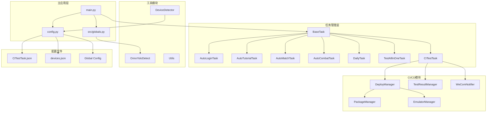
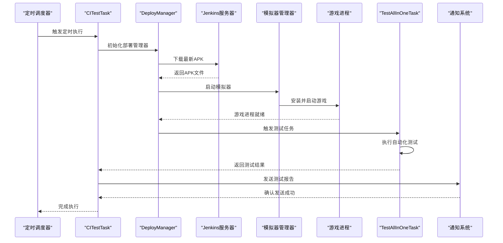
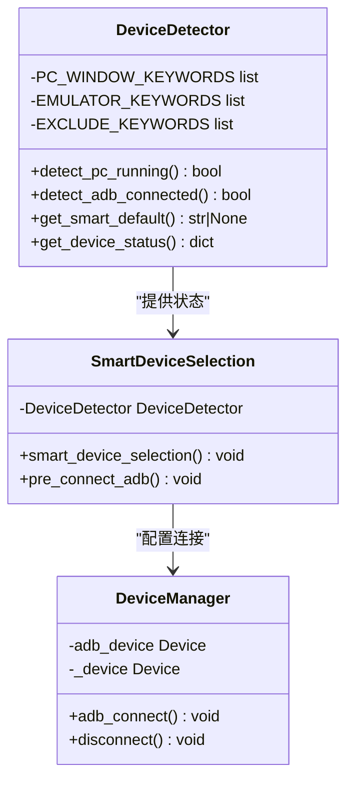
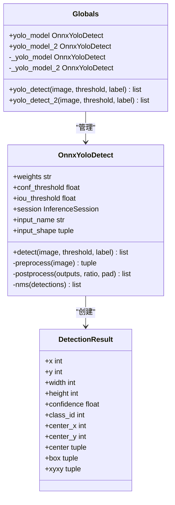
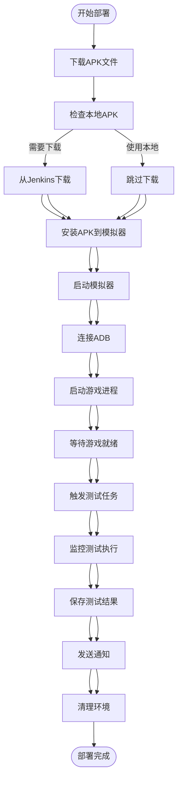
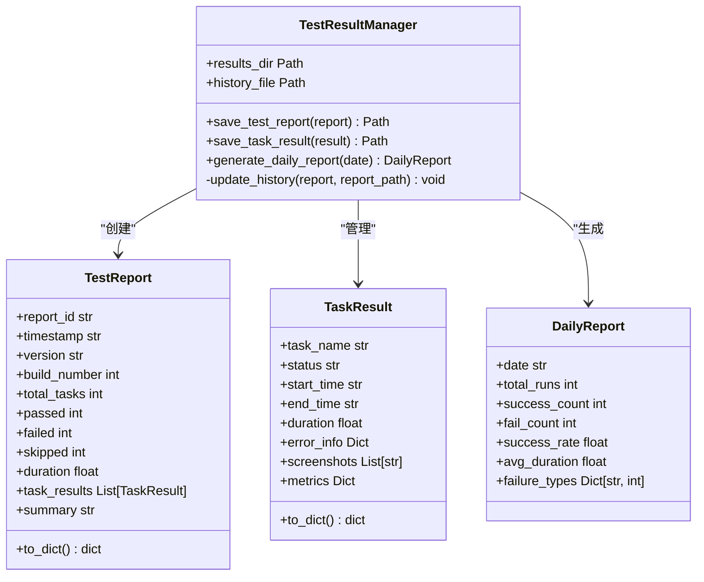
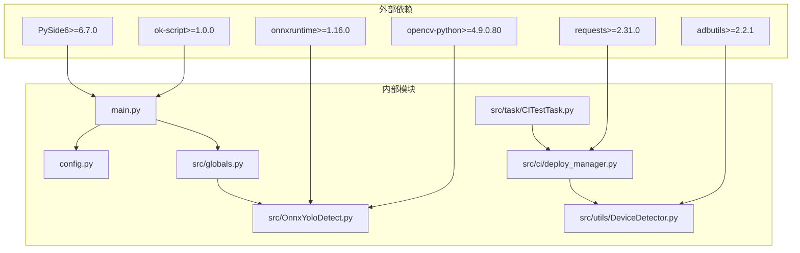

# 代码审查技能

<cite>
**本文档引用的文件**
- [main.py](file://main.py)
- [config.py](file://config.py)
- [src/globals.py](file://src/globals.py)
- [requirements.txt](file://requirements.txt)
- [src/task/CITestTask.py](file://src/task/CITestTask.py)
- [src/utils/DeviceDetector.py](file://src/utils/DeviceDetector.py)
- [src/OnnxYoloDetect.py](file://src/OnnxYoloDetect.py)
- [configs/CITestTask.json](file://configs/CITestTask.json)
- [configs/devices.json](file://configs/devices.json)
- [src/task/TestAllInOneTask.py](file://src/task/TestAllInOneTask.py)
- [src/ci/deploy_manager.py](file://src/ci/deploy_manager.py)
- [src/ci/test_result_manager.py](file://src/ci/test_result_manager.py)
- [src/ci/notifier/wecom_notifier.py](file://src/ci/notifier/wecom_notifier.py)
</cite>

## 目录
1. [简介](#简介)
2. [项目结构](#项目结构)
3. [核心组件](#核心组件)
4. [架构概览](#架构概览)
5. [详细组件分析](#详细组件分析)
6. [依赖关系分析](#依赖关系分析)
7. [性能考虑](#性能考虑)
8. [故障排除指南](#故障排除指南)
9. [结论](#结论)

## 简介

这是一个基于 ok-script 框架开发的自动化测试工具，专门用于游戏《漫画群星：大集结》的自动化测试和部署。该工具提供了完整的 CI/CD 流水线，包括 APK 下载、模拟器管理、游戏启动、自动化测试执行和结果通知等功能。

项目采用模块化设计，包含设备检测、任务管理、CI 部署、测试结果管理和通知系统等多个核心模块。通过智能设备选择和定时任务调度功能，实现了高度自动化的测试环境管理。

## 项目结构

**图表来源**
- [main.py:659-693](file://main.py#L659-L693)
- [config.py:68-145](file://config.py#L68-L145)
- [src/task/CITestTask.py:26-44](file://src/task/CITestTask.py#L26-L44)

**章节来源**
- [main.py:1-693](file://main.py#L1-L693)
- [config.py:1-146](file://config.py#L1-L146)

## 核心组件

### 主应用入口
主应用入口负责初始化整个系统，包括日志处理、设备检测、任务调度和配置管理。主要功能包括：

- **日志系统修补**：处理文件句柄关闭和轮转时的 I/O 错误
- **设备智能选择**：根据 PC 版游戏和模拟器连接状态自动选择最佳设备
- **任务调度器**：支持定时执行 CI 测试任务
- **组件修补**：修复 ok-script 框架中的已知问题

### 全局资源管理器
提供统一的全局状态和资源共享接口，包括：
- 登录状态管理
- OCR 缓存管理
- YOLO 模型管理
- CI 测试状态管理

### CI 测试任务
完整的 CI/CD 流水线实现，包含：
- Jenkins 集成下载最新 APK
- 模拟器自动启动和管理
- 游戏安装和启动
- 自动化测试执行
- 测试结果收集和通知

**章节来源**
- [main.py:22-330](file://main.py#L22-L330)
- [src/globals.py:16-406](file://src/globals.py#L16-L406)
- [src/task/CITestTask.py:26-84](file://src/task/CITestTask.py#L26-L84)

## 架构概览

**图表来源**
- [src/task/CITestTask.py:146-273](file://src/task/CITestTask.py#L146-L273)
- [src/ci/deploy_manager.py:123-200](file://src/ci/deploy_manager.py#L123-L200)

## 详细组件分析

### 设备检测系统

**图表来源**
- [src/utils/DeviceDetector.py:11-149](file://src/utils/DeviceDetector.py#L11-L149)
- [main.py:388-430](file://main.py#L388-L430)

设备检测系统通过智能算法自动选择最佳的测试设备：
- **PC 版游戏检测**：通过窗口标题关键词匹配检测 PC 版游戏运行状态
- **模拟器 ADB 检测**：使用 adbutils 库检测模拟器连接状态
- **智能选择逻辑**：根据检测结果自动选择 'pc' 或 'adb' 设备

**章节来源**
- [src/utils/DeviceDetector.py:28-134](file://src/utils/DeviceDetector.py#L28-L134)
- [main.py:388-430](file://main.py#L388-L430)

### YOLO 目标检测系统

**图表来源**
- [src/OnnxYoloDetect.py:17-315](file://src/OnnxYoloDetect.py#L17-L315)
- [src/globals.py:238-341](file://src/globals.py#L238-L341)

YOLO 目标检测系统提供高精度的游戏场景识别能力：
- **多模型支持**：支持 fight.onnx 和 fight2.onnx 两个不同的检测模型
- **实时检测**：优化的预处理和后处理算法，支持实时目标检测
- **GPU 加速**：优先使用 CUDAExecutionProvider 进行 GPU 加速
- **灵活配置**：可配置置信度阈值和 NMS 阈值

**章节来源**
- [src/OnnxYoloDetect.py:33-258](file://src/OnnxYoloDetect.py#L33-L258)
- [src/globals.py:238-341](file://src/globals.py#L238-L341)

### CI 部署管理系统

**图表来源**
- [src/ci/deploy_manager.py:123-200](file://src/ci/deploy_manager.py#L123-L200)
- [src/task/CITestTask.py:213-273](file://src/task/CITestTask.py#L213-L273)

CI 郺署管理系统提供完整的自动化测试流水线：
- **APK 管理**：从 Jenkins 自动下载最新构建的 APK 文件
- **模拟器管理**：自动启动和管理模拟器实例
- **游戏启动**：安装 APK 并启动游戏进程
- **任务触发**：在游戏就绪后自动触发测试任务
- **异常处理**：完善的错误处理和重试机制

**章节来源**
- [src/ci/deploy_manager.py:38-200](file://src/ci/deploy_manager.py#L38-L200)
- [src/task/CITestTask.py:213-273](file://src/task/CITestTask.py#L213-L273)

### 测试结果管理系统

**图表来源**
- [src/ci/test_result_manager.py:73-200](file://src/ci/test_result_manager.py#L73-L200)

测试结果管理系统提供完整的测试数据管理：
- **报告存储**：按日期和时间组织的测试报告存储
- **历史记录**：维护测试历史数据和统计信息
- **每日报告**：自动生成每日测试统计报告
- **数据清理**：支持历史数据的自动清理和管理

**章节来源**
- [src/ci/test_result_manager.py:73-200](file://src/ci/test_result_manager.py#L73-L200)

### 通知系统

企业微信通知系统提供多种通知方式：
- **测试报告通知**：发送详细的测试结果报告
- **告警通知**：发送异常情况和失败告警
- **图片通知**：发送失败截图作为可视化证据
- **Markdown 支持**：美观的富文本格式通知

**章节来源**
- [src/ci/notifier/wecom_notifier.py:21-200](file://src/ci/notifier/wecom_notifier.py#L21-L200)

## 依赖关系分析

**图表来源**
- [requirements.txt:1-17](file://requirements.txt#L1-L17)
- [main.py:17-19](file://main.py#L17-L19)

项目依赖关系清晰，主要依赖包括：
- **ok-script 框架**：提供基础的自动化测试框架
- **PySide6**：用于图形用户界面开发
- **OpenCV**：用于图像处理和计算机视觉
- **ONNX Runtime**：用于机器学习模型推理
- **adbutils**：用于 Android 设备通信

**章节来源**
- [requirements.txt:1-17](file://requirements.txt#L1-L17)

## 性能考虑

### 内存管理
- **YOLO 模型延迟加载**：只有在需要时才加载 ONNX 模型，减少内存占用
- **OCR 缓存机制**：实现 TTL 缓存，避免重复的 OCR 识别操作
- **全局状态重置**：定期重置全局状态，防止内存泄漏

### 并发处理
- **异步任务调度**：使用定时器实现非阻塞的任务调度
- **多线程支持**：支持并发的设备检测和任务执行
- **资源池管理**：合理管理模拟器和设备资源

### 优化策略
- **GPU 加速**：优先使用 CUDAExecutionProvider 进行模型推理
- **图像预处理优化**：高效的图像缩放和填充算法
- **网络请求优化**：合理的超时设置和重试机制

## 故障排除指南

### 常见问题及解决方案

**设备连接问题**
- 检查 ADB 服务是否正常运行
- 验证模拟器路径配置是否正确
- 确认防火墙设置允许 ADB 连接

**模拟器启动失败**
- 检查模拟器安装路径
- 验证模拟器版本兼容性
- 确认系统资源充足

**测试任务执行异常**
- 检查游戏包名配置
- 验证 Jenkins 服务器连接
- 确认测试脚本权限

**章节来源**
- [main.py:258-330](file://main.py#L258-L330)
- [src/task/CITestTask.py:538-587](file://src/task/CITestTask.py#L538-L587)

## 结论

该代码审查技能项目展现了现代自动化测试工具的完整架构设计。通过模块化的设计理念和完善的错误处理机制，实现了高度可靠的 CI/CD 流水线。

项目的主要优势包括：
- **完整的功能覆盖**：从设备检测到测试执行的全流程自动化
- **智能的设备管理**：自动选择最佳测试设备，提升测试效率
- **强大的扩展性**：模块化设计便于功能扩展和维护
- **完善的监控机制**：详细的日志记录和通知系统

该系统为游戏自动化测试提供了可靠的基础设施，通过持续集成的方式确保游戏质量的稳定性。