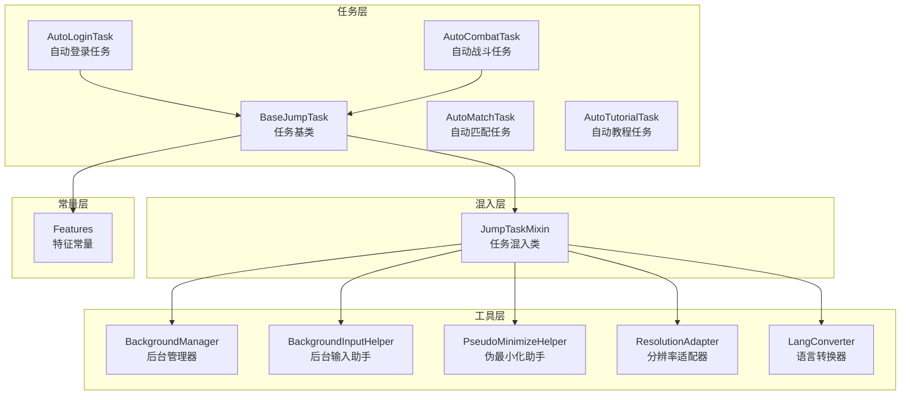
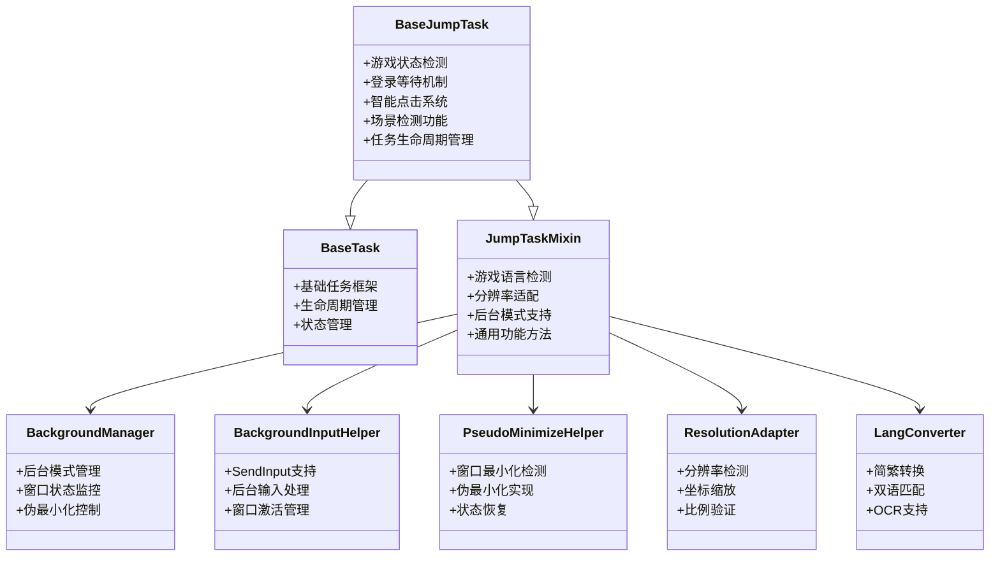
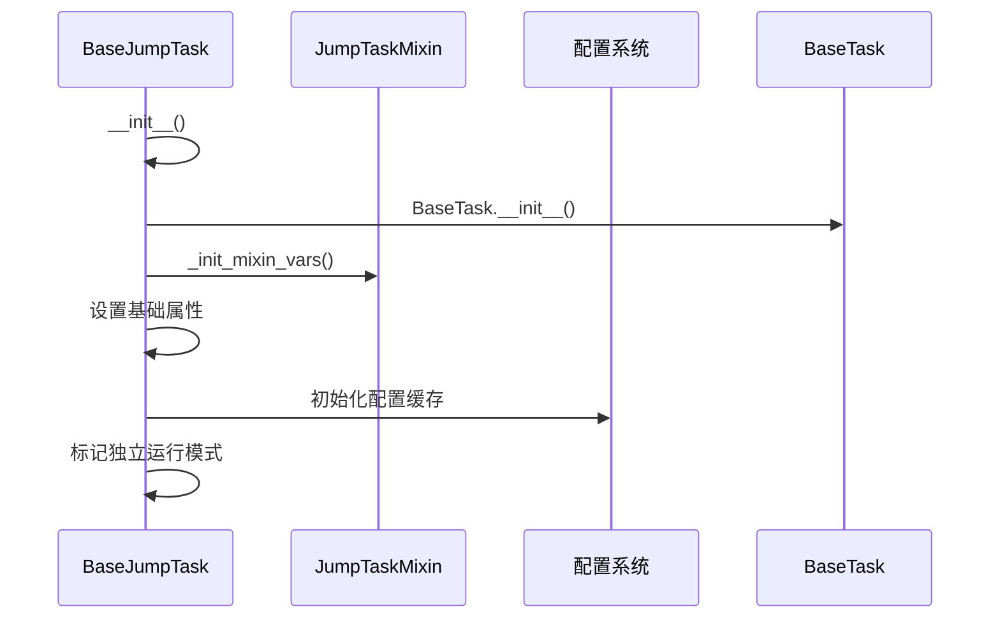
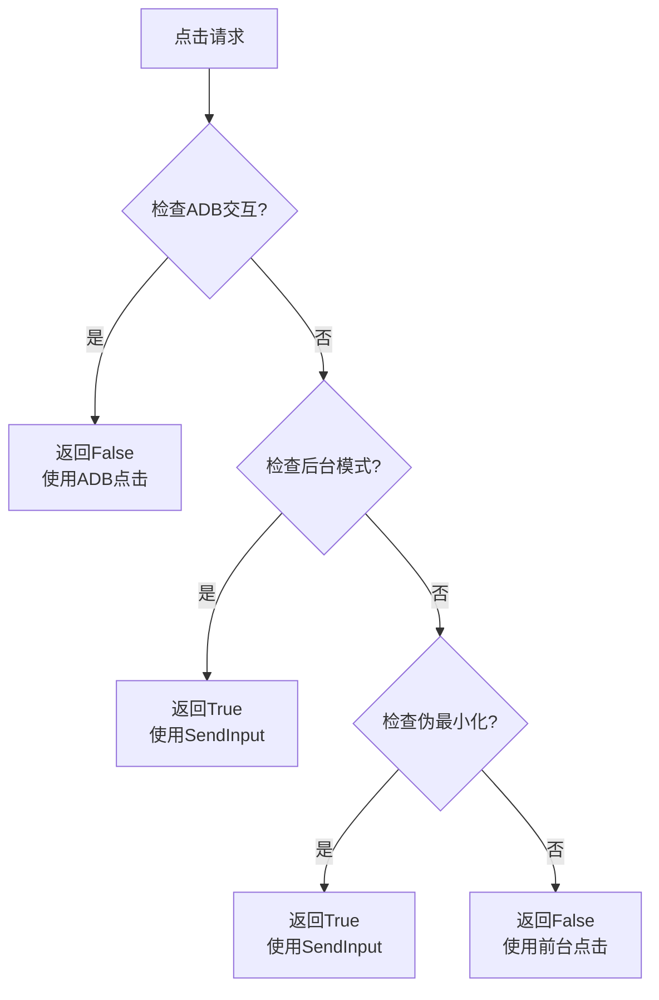
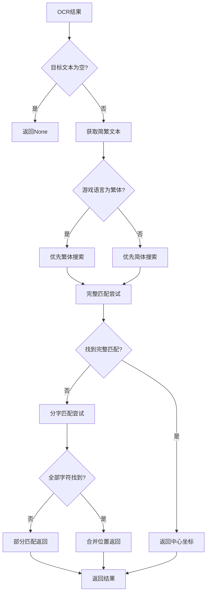
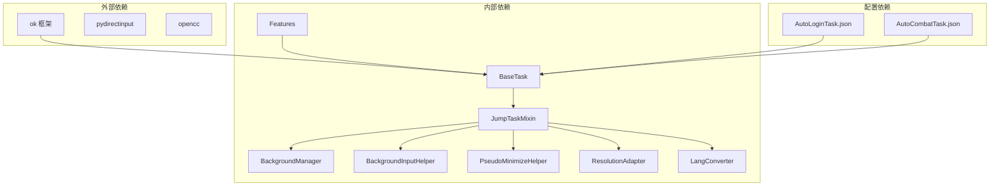

# 任务基类设计

<cite>
**本文档引用的文件**
- [BaseJumpTask.py](file://src/task/BaseJumpTask.py)
- [mixins.py](file://src/task/mixins.py)
- [BackgroundManager.py](file://src/utils/BackgroundManager.py)
- [BackgroundInputHelper.py](file://src/utils/BackgroundInputHelper.py)
- [PseudoMinimizeHelper.py](file://src/utils/PseudoMinimizeHelper.py)
- [ResolutionAdapter.py](file://src/utils/ResolutionAdapter.py)
- [features.py](file://src/constants/features.py)
- [LangConverter.py](file://src/utils/LangConverter.py)
- [AutoLoginTask.py](file://src/task/AutoLoginTask.py)
- [AutoCombatTask.py](file://src/task/AutoCombatTask.py)
- [AutoLoginTask.json](file://configs/AutoLoginTask.json)
- [AutoCombatTask.json](file://configs/AutoCombatTask.json)
</cite>

## 目录
1. [简介](#简介)
2. [项目结构](#项目结构)
3. [核心组件](#核心组件)
4. [架构概览](#架构概览)
5. [详细组件分析](#详细组件分析)
6. [依赖分析](#依赖分析)
7. [性能考虑](#性能考虑)
8. [故障排除指南](#故障排除指南)
9. [结论](#结论)
10. [附录](#附录)

## 简介

ok-jump 项目是一个面向游戏《漫画群星》的自动化测试工具，旨在提供完整的任务自动化解决方案。本文档专注于任务基类设计，特别是 BaseJumpTask 基类的设计理念、架构实现和扩展指南。

BaseJumpTask 作为项目的核心基类，继承自 BaseTask 和 JumpTaskMixin，提供了游戏状态检测、分辨率自适应、后台模式支持、登录等待机制、伪最小化处理等核心功能。该设计采用混入模式（Mixin）消除了代码重复，提高了代码的可维护性和扩展性。

## 项目结构

ok-jump 项目采用模块化的组织结构，主要包含以下核心模块：



**图表来源**
- [BaseJumpTask.py:26-572](file://src/task/BaseJumpTask.py#L26-L572)
- [mixins.py:15-784](file://src/task/mixins.py#L15-L784)

**章节来源**
- [BaseJumpTask.py:1-572](file://src/task/BaseJumpTask.py#L1-L572)
- [mixins.py:1-784](file://src/task/mixins.py#L1-L784)

## 核心组件

### BaseJumpTask 基类设计

BaseJumpTask 是整个自动化系统的核心基类，它继承自 BaseTask 和 JumpTaskMixin，实现了以下关键设计理念：

#### 继承关系设计
- **多重继承**: BaseJumpTask(BaseTask, JumpTaskMixin) 确保了功能的模块化分离
- **职责分离**: BaseTask 负责基础任务框架，JumpTaskMixin 提供通用功能
- **混入模式**: 避免了复杂的继承层次，提高了代码复用性

#### 核心功能特性

**1. 游戏状态检测**
- `in_main_menu()`: 检测主菜单状态
- `in_login_screen()`: 检测登录界面
- `in_game()`: 游戏中状态检测
- `in_lobby()`: 大厅状态检测

**2. 分辨率自适应**
- 动态分辨率检测和适配
- 坐标缩放和转换
- 屏幕比例验证

**3. 后台模式支持**
- 自动后台模式检测
- 窗口状态监控
- 伪最小化处理

**4. 登录等待机制**
- 智能登录状态检测
- 超时处理机制
- 状态容错处理

**5. 伪最小化处理**
- 窗口最小化检测
- 自动伪最小化
- 状态恢复

**章节来源**
- [BaseJumpTask.py:26-572](file://src/task/BaseJumpTask.py#L26-L572)
- [mixins.py:15-784](file://src/task/mixins.py#L15-L784)

## 架构概览

BaseJumpTask 采用了分层架构设计，通过混入模式实现了功能的模块化：



**图表来源**
- [BaseJumpTask.py:26-572](file://src/task/BaseJumpTask.py#L26-L572)
- [mixins.py:15-784](file://src/task/mixins.py#L15-L784)
- [BackgroundManager.py:7-155](file://src/utils/BackgroundManager.py#L7-L155)
- [BackgroundInputHelper.py:99-841](file://src/utils/BackgroundInputHelper.py#L99-L841)
- [PseudoMinimizeHelper.py:13-238](file://src/utils/PseudoMinimizeHelper.py#L13-L238)
- [ResolutionAdapter.py:4-163](file://src/utils/ResolutionAdapter.py#L4-L163)
- [LangConverter.py:155-338](file://src/utils/LangConverter.py#L155-L338)

## 详细组件分析

### 任务生命周期管理

BaseJumpTask 实现了完整的任务生命周期管理机制：

#### 任务初始化


**图表来源**
- [BaseJumpTask.py:38-50](file://src/task/BaseJumpTask.py#L38-L50)
- [mixins.py:32-38](file://src/task/mixins.py#L32-L38)

#### 状态管理机制
- `_logged_in`: 登录状态跟踪
- `_is_standalone`: 独立运行模式标识
- `_caller_task`: 调用者任务引用

#### 调用关系处理
`set_caller()` 方法实现了任务间的调用关系管理：

**章节来源**
- [BaseJumpTask.py:51-63](file://src/task/BaseJumpTask.py#L51-L63)

### 智能点击系统设计

BaseJumpTask 的智能点击系统是其核心功能之一，实现了前台和后台模式的无缝切换：

#### _need_background_click() 方法
该方法负责判断是否需要使用后台点击模式：



**图表来源**
- [mixins.py:383-399](file://src/task/mixins.py#L383-L399)

#### click_relative() 和 click() 方法的智能切换机制

**章节来源**
- [BaseJumpTask.py:123-157](file://src/task/BaseJumpTask.py#L123-L157)
- [mixins.py:383-444](file://src/task/mixins.py#L383-L444)

### 场景检测功能

BaseJumpTask 提供了完善的场景检测功能：

#### 游戏状态检测
- `in_main_menu()`: 检测主菜单状态
- `in_login_screen()`: 检测登录界面
- `in_game()`: 游戏中状态检测
- `in_lobby()`: 大厅状态检测

#### 登录等待机制
`wait_login()` 方法实现了智能的登录等待逻辑：

**章节来源**
- [BaseJumpTask.py:160-208](file://src/task/BaseJumpTask.py#L160-L208)
- [mixins.py:60-83](file://src/task/mixins.py#L60-L83)

### OCR 文本处理系统

BaseJumpTask 实现了强大的 OCR 文本处理能力，支持简繁转换和模糊匹配：

#### find_text_fuzzy() 方法
实现了智能的 OCR 文本模糊匹配：



**图表来源**
- [BaseJumpTask.py:337-425](file://src/task/BaseJumpTask.py#L337-L425)

**章节来源**
- [BaseJumpTask.py:337-425](file://src/task/BaseJumpTask.py#L337-L425)
- [LangConverter.py:155-338](file://src/utils/LangConverter.py#L155-L338)

### 分辨率自适应系统

BaseJumpTask 的分辨率自适应系统确保了在不同分辨率下的准确点击：

#### 分辨率检测和适配
- `update_resolution()`: 更新当前分辨率信息
- `scale_point()`: 坐标点缩放
- `scale_box()`: 矩形框缩放
- `check_and_warn_resolution()`: 分辨率有效性检查

**章节来源**
- [mixins.py:106-185](file://src/task/mixins.py#L106-L185)
- [ResolutionAdapter.py:34-163](file://src/utils/ResolutionAdapter.py#L34-L163)

### 后台模式支持系统

BaseJumpTask 实现了完整的后台模式支持，包括窗口状态监控和伪最小化处理：

#### 后台模式检测
- `is_background_mode()`: 检查后台模式启用状态
- `is_game_in_background()`: 检查游戏是否在后台
- `check_background_mode()`: 检查并记录后台模式状态

#### 伪最小化处理
- `ensure_capturable()`: 确保窗口可截图
- `ensure_visible_for_capture()`: 确保可见性
- `toggle_pseudo_minimize()`: 切换伪最小化状态

**章节来源**
- [mixins.py:259-345](file://src/task/mixins.py#L259-L345)
- [BackgroundManager.py:43-155](file://src/utils/BackgroundManager.py#L43-L155)
- [PseudoMinimizeHelper.py:75-238](file://src/utils/PseudoMinimizeHelper.py#L75-L238)

## 依赖分析

BaseJumpTask 的依赖关系体现了清晰的分层架构：



**图表来源**
- [BaseJumpTask.py:4-10](file://src/task/BaseJumpTask.py#L4-L10)
- [mixins.py:7-12](file://src/task/mixins.py#L7-L12)
- [AutoLoginTask.json:1-14](file://configs/AutoLoginTask.json#L1-L14)
- [AutoCombatTask.json:1-14](file://configs/AutoCombatTask.json#L1-L14)

**章节来源**
- [BaseJumpTask.py:1-10](file://src/task/BaseJumpTask.py#L1-L10)
- [mixins.py:1-12](file://src/task/mixins.py#L1-L12)

## 性能考虑

BaseJumpTask 在设计时充分考虑了性能优化：

### 缓存机制
- `_traditional_chinese_cache`: 繁体中文检测缓存（5秒有效期）
- `_adb_cache`: ADB交互模式缓存（10秒有效期）
- `_resolution_checked`: 分辨率检查状态缓存

### 异步处理
- 后台模式下的异步输入处理
- 并行的死亡检测机制
- 智能的超时处理

### 资源管理
- 自动的窗口状态恢复
- 及时的资源清理
- 内存使用优化

## 故障排除指南

### 常见问题及解决方案

#### 后台模式问题
**症状**: 点击无效或窗口无法激活
**解决方案**:
1. 检查后台模式配置
2. 验证窗口句柄获取
3. 确认伪最小化状态

#### 分辨率适配问题
**症状**: 点击位置不准确
**解决方案**:
1. 验证分辨率检测
2. 检查缩放因子计算
3. 确认参考分辨率设置

#### OCR识别问题
**症状**: 文本匹配失败
**解决方案**:
1. 检查OCR配置
2. 验证文本语言设置
3. 调整匹配阈值

**章节来源**
- [BackgroundManager.py:18-92](file://src/utils/BackgroundManager.py#L18-L92)
- [ResolutionAdapter.py:98-163](file://src/utils/ResolutionAdapter.py#L98-L163)
- [LangConverter.py:274-338](file://src/utils/LangConverter.py#L274-L338)

## 结论

BaseJumpTask 基类设计体现了现代自动化框架的最佳实践，通过以下关键设计实现了高效、稳定的任务自动化：

### 设计优势
1. **模块化架构**: 采用混入模式实现了功能的模块化分离
2. **智能适配**: 自动处理不同平台和环境的差异
3. **扩展性强**: 清晰的接口设计支持功能扩展
4. **稳定性高**: 完善的错误处理和状态管理机制

### 技术创新
1. **智能点击系统**: 前后台模式的无缝切换
2. **OCR模糊匹配**: 支持简繁转换和分字识别
3. **后台模式支持**: 完整的窗口状态管理
4. **分辨率自适应**: 动态的坐标适配机制

### 应用价值
BaseJumpTask 为游戏自动化测试提供了坚实的技术基础，其设计理念和实现方式可以推广到其他类型的自动化任务开发中。

## 附录

### 扩展指南

#### 基于 BaseJumpTask 的任务扩展步骤

1. **创建新任务类**
```python
class MyCustomTask(BaseJumpTask):
    def __init__(self, *args, **kwargs):
        super().__init__(*args, **kwargs)
        self.name = "MyCustomTask"
        self.description = "自定义任务描述"
```

2. **实现核心功能**
- 继承 BaseJumpTask 的所有功能
- 添加特定业务逻辑
- 实现 run() 方法

3. **配置管理**
- 定义默认配置
- 处理用户配置
- 支持配置热更新

4. **测试验证**
- 单元测试
- 集成测试
- 回归测试

#### 最佳实践建议

1. **遵循单一职责原则**: 每个任务专注于特定功能
2. **保持幂等性**: 任务可以重复执行而不产生副作用
3. **良好的错误处理**: 完善的异常捕获和恢复机制
4. **日志记录**: 详细的执行日志便于调试
5. **配置驱动**: 通过配置文件管理行为参数

**章节来源**
- [AutoLoginTask.py:21-106](file://src/task/AutoLoginTask.py#L21-L106)
- [AutoCombatTask.py:35-199](file://src/task/AutoCombatTask.py#L35-L199)