# 任务基类设计

<cite>
**本文档引用的文件**
- [BaseJumpTask.py](file://src/task/BaseJumpTask.py)
- [mixins.py](file://src/task/mixins.py)
- [BaseJumpTriggerTask.py](file://src/task/BaseJumpTriggerTask.py)
- [BackgroundManager.py](file://src/utils/BackgroundManager.py)
- [PseudoMinimizeHelper.py](file://src/utils/PseudoMinimizeHelper.py)
- [ResolutionAdapter.py](file://src/utils/ResolutionAdapter.py)
- [LangConverter.py](file://src/utils/LangConverter.py)
- [ScreenshotHelper.py](file://src/utils/ScreenshotHelper.py)
- [features.py](file://src/constants/features.py)
- [AutoLoginTask.py](file://src/task/AutoLoginTask.py)
- [AutoCombatTask.py](file://src/task/AutoCombatTask.py)
- [AutoLoginTask.json](file://configs/AutoLoginTask.json)
</cite>

## 目录
1. [简介](#简介)
2. [项目结构](#项目结构)
3. [核心组件](#核心组件)
4. [架构概览](#架构概览)
5. [详细组件分析](#详细组件分析)
6. [依赖关系分析](#依赖关系分析)
7. [性能考虑](#性能考虑)
8. [故障排除指南](#故障排除指南)
9. [结论](#结论)
10. [附录](#附录)

## 简介

OK-Jump是一个基于Python的自动化游戏控制框架，专门用于漫画群星游戏的自动化操作。本文档深入分析BaseJumpTask任务基类的设计理念和架构模式，这是一个创新的双重继承结构，结合了BaseTask的基础功能和JumpTaskMixin的通用能力。

BaseJumpTask作为任务系统的基石，提供了游戏状态检测、分辨率自适应、后台模式支持、登录等待机制、伪最小化处理等核心功能。该设计采用混入模式（Mixin Pattern）消除了代码重复，提高了代码复用性和维护性。

## 项目结构

OK-Jump项目采用模块化的组织结构，主要分为以下几个核心模块：

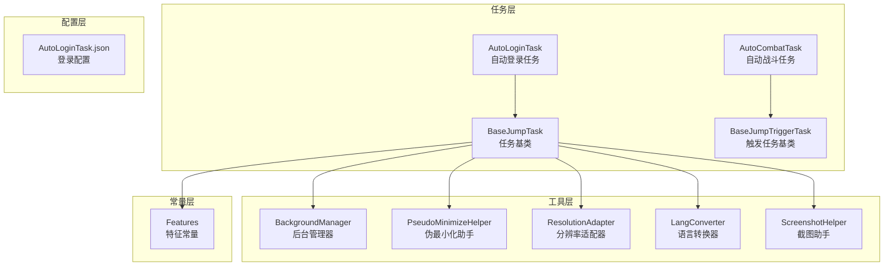

**图表来源**
- [BaseJumpTask.py:14-422](file://src/task/BaseJumpTask.py#L14-L422)
- [mixins.py:15-774](file://src/task/mixins.py#L15-L774)
- [BackgroundManager.py:7-155](file://src/utils/BackgroundManager.py#L7-L155)

**章节来源**
- [BaseJumpTask.py:1-422](file://src/task/BaseJumpTask.py#L1-L422)
- [mixins.py:1-774](file://src/task/mixins.py#L1-L774)

## 核心组件

### BaseJumpTask基类设计

BaseJumpTask采用了创新的双重继承架构，结合了以下设计理念：

#### 双重继承结构

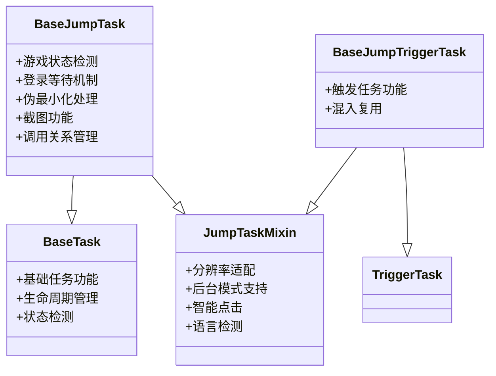

**图表来源**
- [BaseJumpTask.py:14-422](file://src/task/BaseJumpTask.py#L14-L422)
- [BaseJumpTriggerTask.py:13-30](file://src/task/BaseJumpTriggerTask.py#L13-L30)
- [mixins.py:15-774](file://src/task/mixins.py#L15-L774)

#### 核心功能模块

BaseJumpTask提供了以下核心功能模块：

1. **游戏状态检测**：`in_game()`和`in_lobby()`方法用于检测游戏的不同状态
2. **分辨率自适应**：通过ResolutionAdapter实现跨分辨率兼容
3. **后台模式支持**：通过BackgroundManager和PseudoMinimizeHelper实现后台运行
4. **登录等待机制**：智能等待登录完成并处理各种登录界面
5. **伪最小化处理**：支持窗口最小化时的截图和操作
6. **截图功能**：提供灵活的截图和图像处理能力
7. **智能点击机制**：根据环境自动选择前台或后台点击方式

**章节来源**
- [BaseJumpTask.py:14-422](file://src/task/BaseJumpTask.py#L14-L422)
- [mixins.py:15-774](file://src/task/mixins.py#L15-L774)

## 架构概览

BaseJumpTask的架构设计体现了以下核心原则：

### 设计模式应用

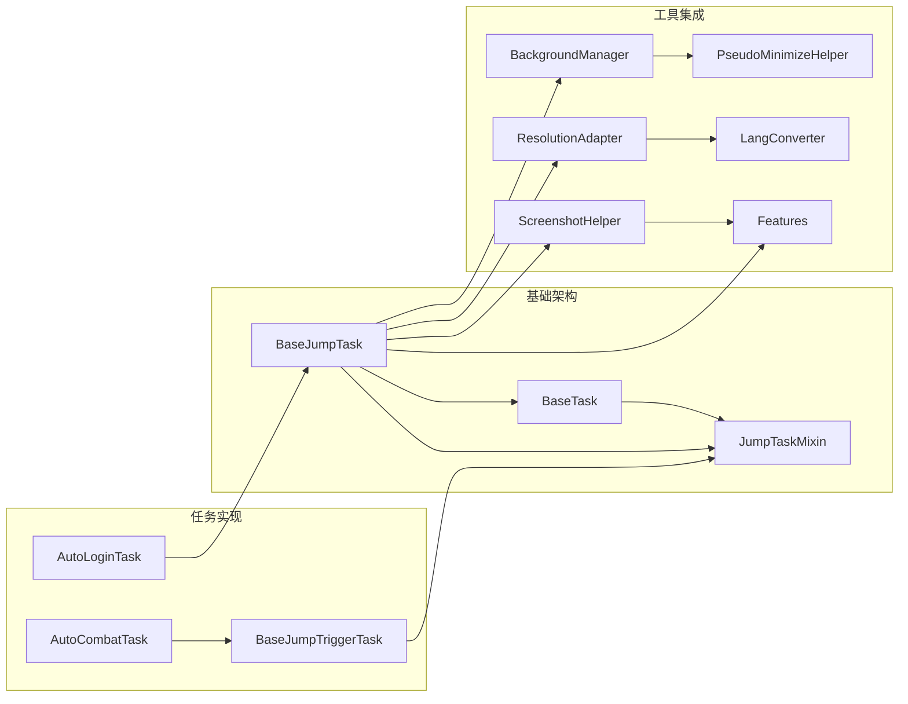

**图表来源**
- [BaseJumpTask.py:14-422](file://src/task/BaseJumpTask.py#L14-L422)
- [mixins.py:15-774](file://src/task/mixins.py#L15-L774)
- [AutoLoginTask.py:21-800](file://src/task/AutoLoginTask.py#L21-L800)

### 生命周期管理

BaseJumpTask实现了完整的任务生命周期管理：

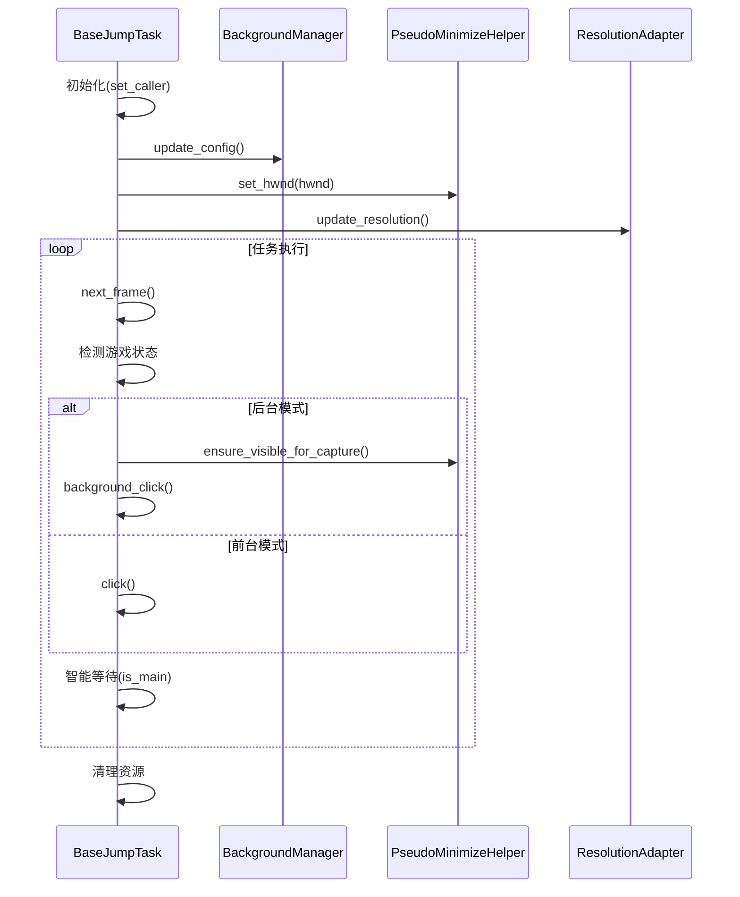

**图表来源**
- [BaseJumpTask.py:36-422](file://src/task/BaseJumpTask.py#L36-L422)
- [BackgroundManager.py:18-155](file://src/utils/BackgroundManager.py#L18-L155)

**章节来源**
- [BaseJumpTask.py:26-58](file://src/task/BaseJumpTask.py#L26-L58)
- [mixins.py:32-36](file://src/task/mixins.py#L32-L36)

## 详细组件分析

### 游戏状态检测系统

BaseJumpTask实现了多层次的游戏状态检测机制：

#### 状态检测方法

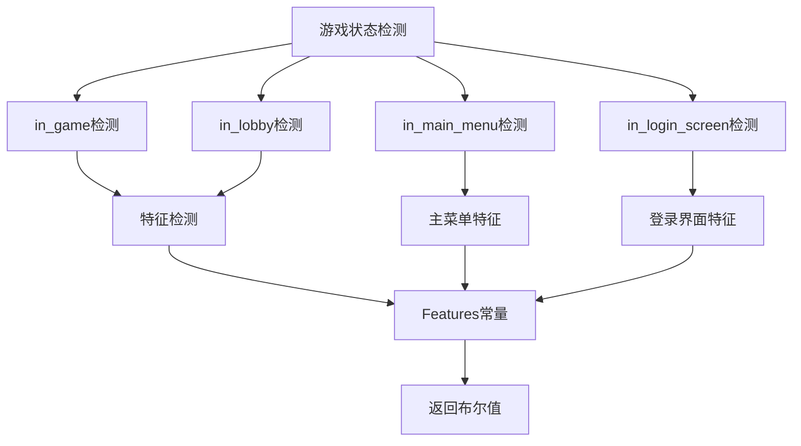

**图表来源**
- [BaseJumpTask.py:133-151](file://src/task/BaseJumpTask.py#L133-L151)
- [features.py:9-86](file://src/constants/features.py#L9-L86)

#### 状态检测实现

BaseJumpTask提供了以下状态检测方法：

1. **主菜单检测** (`in_main_menu()`): 检测主菜单界面
2. **登录界面检测** (`in_login_screen()`): 检测登录界面
3. **游戏状态检测** (`in_game()`): 检测游戏中状态
4. **大厅状态检测** (`in_lobby()`): 检测大厅状态

这些方法都依赖于Features常量类，确保特征名称的一致性和可维护性。

**章节来源**
- [BaseJumpTask.py:133-151](file://src/task/BaseJumpTask.py#L133-L151)
- [features.py:20-86](file://src/constants/features.py#L20-L86)

### 分辨率自适应系统

BaseJumpTask的分辨率自适应系统确保了在不同分辨率下的正确操作：

#### 分辨率适配机制

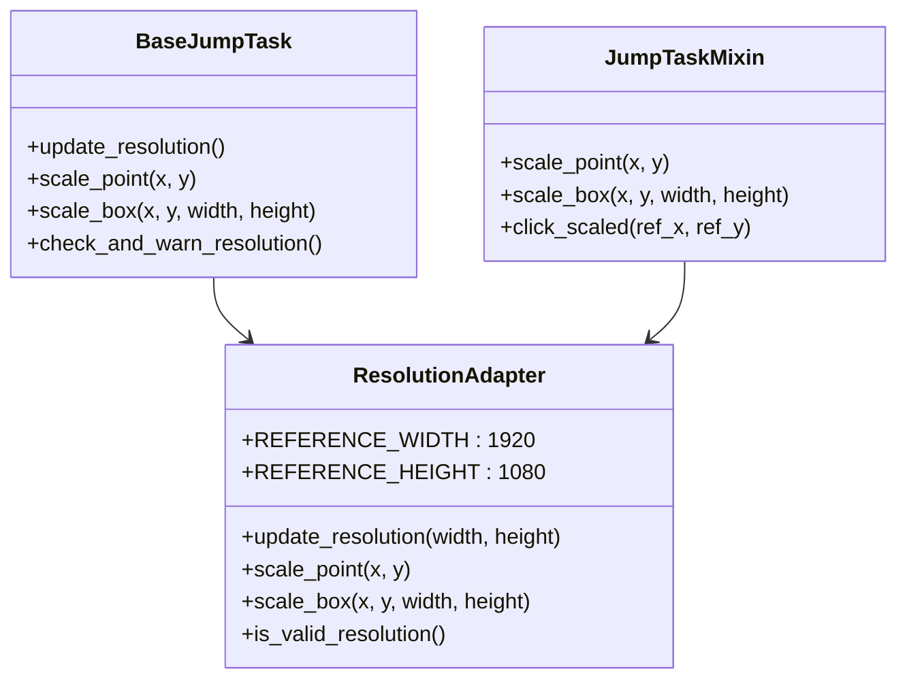

**图表来源**
- [ResolutionAdapter.py:4-163](file://src/utils/ResolutionAdapter.py#L4-L163)
- [mixins.py:104-231](file://src/task/mixins.py#L104-L231)

#### 分辨率处理流程

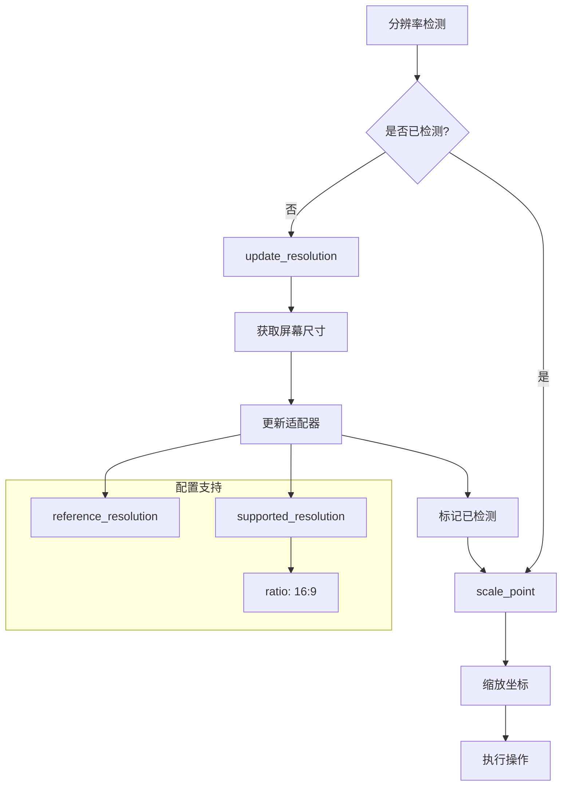

**图表来源**
- [mixins.py:104-183](file://src/task/mixins.py#L104-L183)
- [ResolutionAdapter.py:19-44](file://src/utils/ResolutionAdapter.py#L19-L44)

**章节来源**
- [mixins.py:104-183](file://src/task/mixins.py#L104-L183)
- [ResolutionAdapter.py:19-44](file://src/utils/ResolutionAdapter.py#L19-L44)

### 后台模式支持系统

BaseJumpTask的后台模式支持是其核心特性之一，实现了在游戏窗口被最小化或被遮挡时的正常操作：

#### 后台模式架构

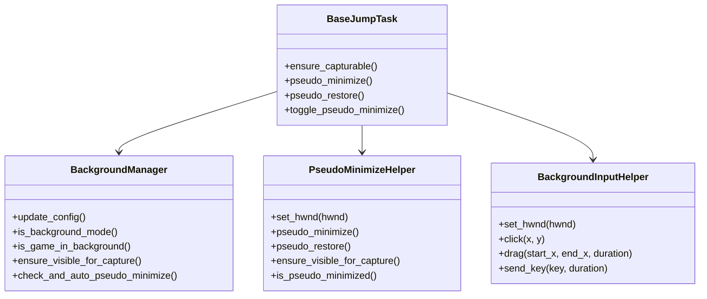

**图表来源**
- [BackgroundManager.py:7-155](file://src/utils/BackgroundManager.py#L7-L155)
- [PseudoMinimizeHelper.py:13-238](file://src/utils/PseudoMinimizeHelper.py#L13-L238)

#### 后台模式检测流程

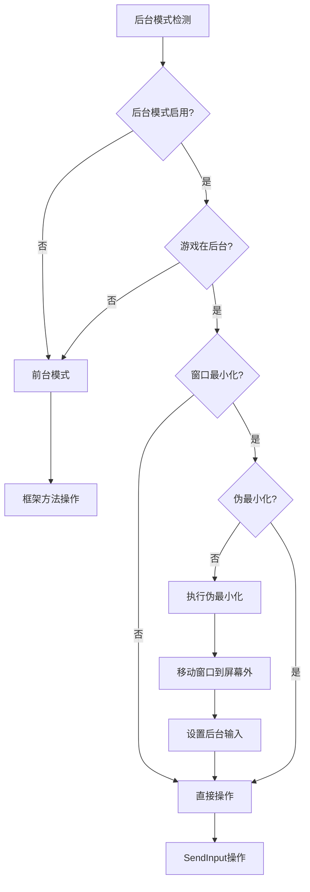

**图表来源**
- [mixins.py:381-412](file://src/task/mixins.py#L381-L412)
- [BackgroundManager.py:46-75](file://src/utils/BackgroundManager.py#L46-L75)

**章节来源**
- [mixins.py:381-412](file://src/task/mixins.py#L381-L412)
- [BackgroundManager.py:46-75](file://src/utils/BackgroundManager.py#L46-L75)

### 登录等待机制

BaseJumpTask实现了智能的登录等待机制，能够处理各种登录界面和状态：

#### 登录流程处理

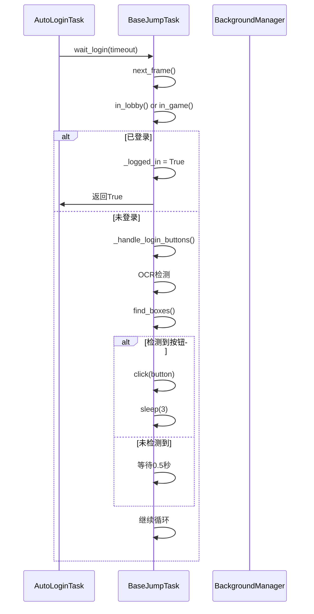

**图表来源**
- [BaseJumpTask.py:155-180](file://src/task/BaseJumpTask.py#L155-L180)
- [BaseJumpTask.py:182-227](file://src/task/BaseJumpTask.py#L182-L227)

#### 登录按钮处理

BaseJumpTask提供了多种登录按钮的智能处理：

1. **进入游戏按钮** (`ENTER_GAME_BUTTON`)
2. **开始游戏按钮** (`START_GAME_BUTTON`)
3. **登录按钮** (`LOGIN_BUTTON`)

这些按钮通过OCR技术进行检测，并支持简繁中文的双语匹配。

**章节来源**
- [BaseJumpTask.py:155-227](file://src/task/BaseJumpTask.py#L155-L227)
- [features.py:27-30](file://src/constants/features.py#L27-L30)

### 伪最小化处理

BaseJumpTask的伪最小化功能解决了游戏窗口最小化时的截图和操作问题：

#### 伪最小化实现

```mermaid
flowchart TD
A[伪最小化检测] --> B{窗口最小化?}
B --> |否| C[检查被遮挡]
B --> |是| D[保存原位置]
D --> E[移动到(-32000,-32000)]
E --> F[标记伪最小化]
F --> G[设置后台输入]
C --> H{被其他窗口遮挡?}
H --> |是| I[执行伪最小化]
H --> |否| J[正常操作]
I --> E
G --> K[SendInput操作]
J --> L[框架方法操作]
```

**图表来源**
- [PseudoMinimizeHelper.py:123-163](file://src/utils/PseudoMinimizeHelper.py#L123-L163)
- [BackgroundManager.py:101-121](file://src/utils/BackgroundManager.py#L101-L121)

#### 伪最小化状态管理

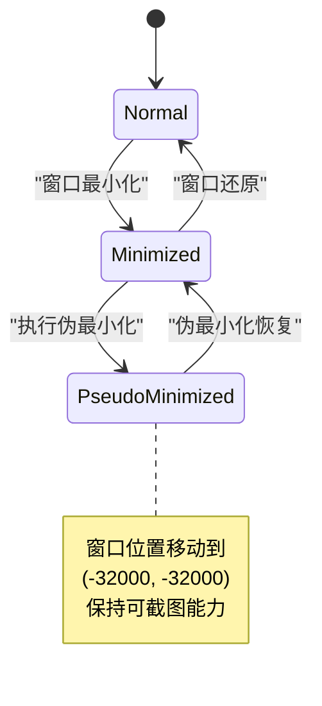

**图表来源**
- [PseudoMinimizeHelper.py:103-104](file://src/utils/PseudoMinimizeHelper.py#L103-L104)
- [PseudoMinimizeHelper.py:205-209](file://src/utils/PseudoMinimizeHelper.py#L205-L209)

**章节来源**
- [PseudoMinimizeHelper.py:123-163](file://src/utils/PseudoMinimizeHelper.py#L123-L163)
- [BackgroundManager.py:101-121](file://src/utils/BackgroundManager.py#L101-L121)

### 智能点击机制

BaseJumpTask实现了智能点击机制，能够根据当前环境自动选择最优的点击方式：

#### 点击策略选择

```mermaid
flowchart TD
A[点击请求] --> B{_need_background_click()}
B --> |是| C[后台模式]
B --> |否| D[前台模式]
C --> E{ADB交互?}
E --> |是| F[使用ADB命令]
E --> |否| G[SendInput操作]
F --> H[super().click()]
G --> I[background_click]
D --> H
I --> J[BackgroundInputHelper]
J --> K[SendInput API]
```

**图表来源**
- [mixins.py:381-412](file://src/task/mixins.py#L381-L412)
- [mixins.py:632-662](file://src/task/mixins.py#L632-L662)

#### 点击方法对比

BaseJumpTask提供了多种点击方法：

1. **智能点击** (`smart_click`): 自动选择前台或后台点击
2. **后台点击** (`background_click`): 专门的后台点击方法
3. **相对坐标点击** (`click_relative`): 支持相对坐标的点击
4. **缩放点击** (`click_scaled`): 基于参考分辨率的点击

**章节来源**
- [mixins.py:724-774](file://src/task/mixins.py#L724-L774)
- [mixins.py:632-662](file://src/task/mixins.py#L632-L662)

### 截图功能实现

BaseJumpTask的截图功能提供了灵活的图像处理能力：

#### 截图处理流程

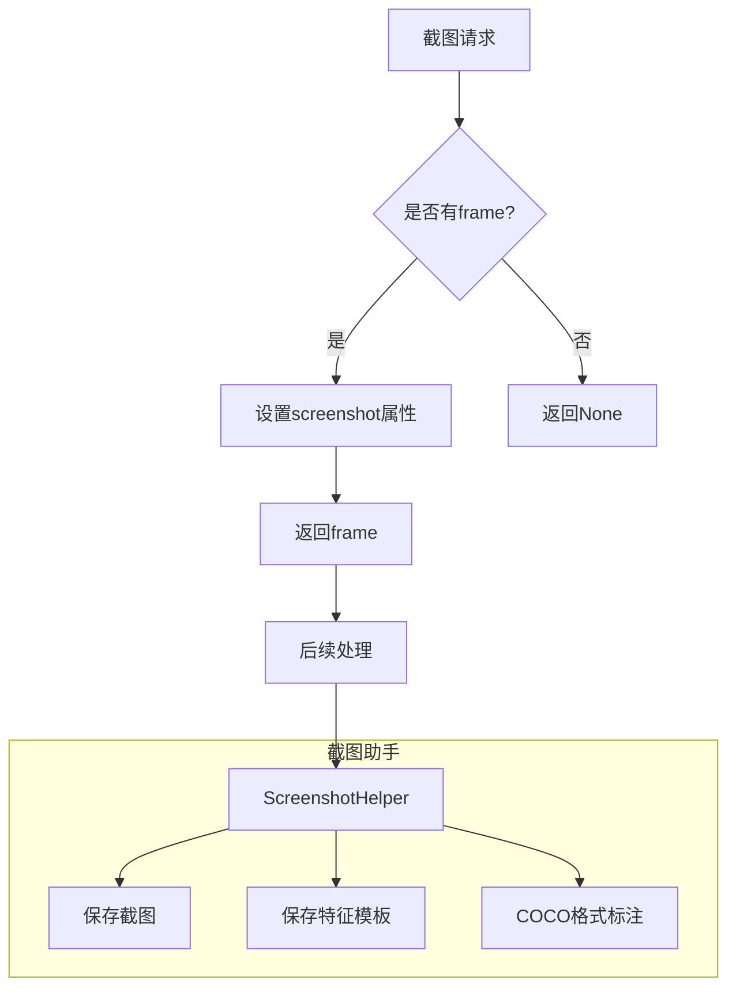

**图表来源**
- [BaseJumpTask.py:61-71](file://src/task/BaseJumpTask.py#L61-L71)
- [ScreenshotHelper.py:7-68](file://src/utils/ScreenshotHelper.py#L7-L68)

**章节来源**
- [BaseJumpTask.py:61-71](file://src/task/BaseJumpTask.py#L61-L71)
- [ScreenshotHelper.py:7-68](file://src/utils/ScreenshotHelper.py#L7-L68)

## 依赖关系分析

BaseJumpTask的依赖关系体现了清晰的分层架构：

### 外部依赖

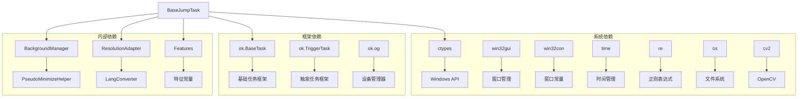

**图表来源**
- [BaseJumpTask.py:1-12](file://src/task/BaseJumpTask.py#L1-L12)
- [mixins.py:7-12](file://src/task/mixins.py#L7-L12)

### 内部依赖关系

BaseJumpTask的内部依赖关系如下：

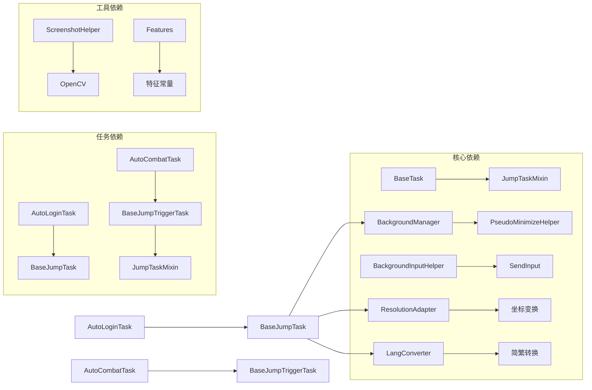

**图表来源**
- [BaseJumpTask.py:4-11](file://src/task/BaseJumpTask.py#L4-L11)
- [mixins.py:7-11](file://src/task/mixins.py#L7-L11)

**章节来源**
- [BaseJumpTask.py:4-12](file://src/task/BaseJumpTask.py#L4-L12)
- [mixins.py:7-12](file://src/task/mixins.py#L7-L12)

## 性能考虑

BaseJumpTask在设计时充分考虑了性能优化：

### 性能优化策略

1. **延迟初始化**: 分辨率适配器和后台管理器采用延迟初始化
2. **缓存机制**: OCR结果和窗口状态进行缓存
3. **智能等待**: 根据环境动态调整等待时间
4. **异步处理**: 后台模式下的操作采用异步处理

### 内存管理

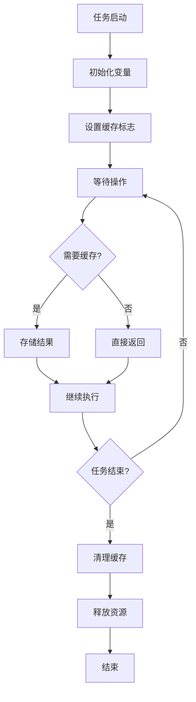

**图表来源**
- [mixins.py:32-36](file://src/task/mixins.py#L32-L36)
- [BaseJumpTask.py:36-57](file://src/task/BaseJumpTask.py#L36-L57)

### 性能监控

BaseJumpTask提供了性能监控功能：

1. **分辨率有效性检查**: 自动检测并警告不合适的分辨率
2. **后台模式状态监控**: 实时监控后台模式状态
3. **窗口状态监控**: 监控窗口的最小化和伪最小化状态

**章节来源**
- [mixins.py:130-146](file://src/task/mixins.py#L130-L146)
- [BackgroundManager.py:82-92](file://src/utils/BackgroundManager.py#L82-L92)

## 故障排除指南

### 常见问题及解决方案

#### 后台模式问题

**问题**: 后台模式下无法正常操作
**解决方案**:
1. 检查后台模式配置
2. 确认窗口句柄获取成功
3. 验证SendInput权限

#### 分辨率问题

**问题**: 不同分辨率下操作不准确
**解决方案**:
1. 检查分辨率适配器配置
2. 验证参考分辨率设置
3. 确认缩放因子计算正确

#### 伪最小化问题

**问题**: 伪最小化后无法恢复
**解决方案**:
1. 检查窗口位置保存
2. 验证窗口还原操作
3. 确认窗口状态检测

**章节来源**
- [BackgroundManager.py:146-151](file://src/utils/BackgroundManager.py#L146-L151)
- [PseudoMinimizeHelper.py:230-235](file://src/utils/PseudoMinimizeHelper.py#L230-L235)

### 调试技巧

BaseJumpTask提供了丰富的调试功能：

1. **日志记录**: 详细的日志输出帮助定位问题
2. **状态监控**: 实时监控各种状态变化
3. **截图保存**: 自动保存错误截图便于分析
4. **配置验证**: 检查配置文件的有效性

**章节来源**
- [BaseJumpTask.py:84-100](file://src/task/BaseJumpTask.py#L84-L100)
- [AutoLoginTask.py:182-201](file://src/task/AutoLoginTask.py#L182-L201)

## 结论

BaseJumpTask任务基类的设计体现了现代软件架构的最佳实践：

### 设计优势

1. **模块化设计**: 清晰的职责分离和模块化结构
2. **可扩展性**: 通过混入模式实现代码复用
3. **平台兼容性**: 支持Windows和ADB交互
4. **智能化**: 自动检测和适应不同的运行环境

### 技术创新

1. **双重继承**: 结合基础任务功能和通用能力
2. **智能适配**: 自动处理分辨率和后台模式差异
3. **状态管理**: 完善的任务生命周期管理
4. **错误处理**: 健壮的异常处理和恢复机制

### 应用价值

BaseJumpTask为自动化游戏控制提供了一个强大而灵活的基础设施，支持多种游戏场景和复杂的自动化需求。其设计原则和实现模式可以为其他自动化项目提供宝贵的参考。

## 附录

### 配置参数说明

#### 基础配置

| 参数名 | 默认值 | 描述 |
|--------|--------|------|
| 启用 | true | 是否启用任务 |
| 自动启动游戏 | false | 是否自动启动游戏进程 |
| 等待游戏启动(秒) | 120 | 等待游戏窗口出现的超时时间 |
| 最大登录尝试次数 | 10 | 登录失败的最大重试次数 |

#### 登录配置

| 参数名 | 默认值 | 描述 |
|--------|--------|------|
| 输入账号 | true | 是否自动输入账号 |
| 账号 | "" | 默认账号 |
| 账号输入重试次数 | 5 | 账号输入失败的重试次数 |
| 输入校验超时(秒) | 30.0 | 账号输入校验的超时时间 |

#### 性能配置

| 参数名 | 默认值 | 描述 |
|--------|--------|------|
| 登录等待超时(秒) | 60 | 登录等待的总超时时间 |
| 点击后等待时间(秒) | 3 | 点击操作后的等待时间 |
| 加载停滞超时(秒) | 60 | 加载界面停滞检测超时时间 |

**章节来源**
- [AutoLoginTask.json:1-15](file://configs/AutoLoginTask.json#L1-L15)

### 使用示例

#### 基本任务创建

```python
# 继承BaseJumpTask创建自定义任务
class MyCustomTask(BaseJumpTask):
    def __init__(self, *args, **kwargs):
        super().__init__(*args, **kwargs)
        self.name = "MyCustomTask"
        self.description = "自定义任务示例"
    
    def run(self):
        # 任务逻辑实现
        pass
```

#### 高级功能使用

```python
# 智能点击示例
self.smart_click(0.5, 0.5)  # 相对坐标点击
self.background_click(100, 200)  # 后台点击
self.click_scaled(1920, 1080)  # 缩放坐标点击

# 分辨率适配
self.update_resolution()  # 更新分辨率
scaled_x, scaled_y = self.scale_point(1920, 1080)  # 坐标缩放

# 后台模式
self.ensure_capturable()  # 确保可截图
self.pseudo_minimize()  # 伪最小化
```

**章节来源**
- [BaseJumpTask.py:73-129](file://src/task/BaseJumpTask.py#L73-L129)
- [mixins.py:184-201](file://src/task/mixins.py#L184-L201)