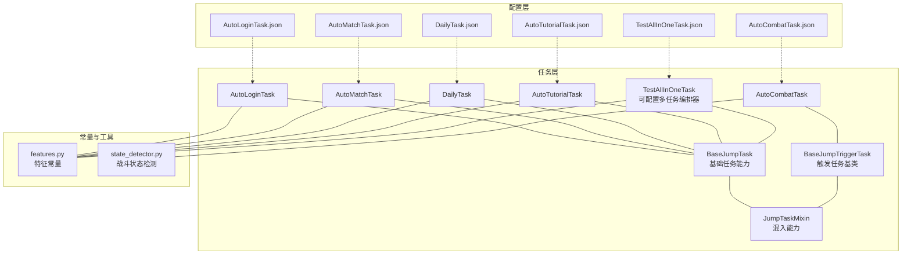
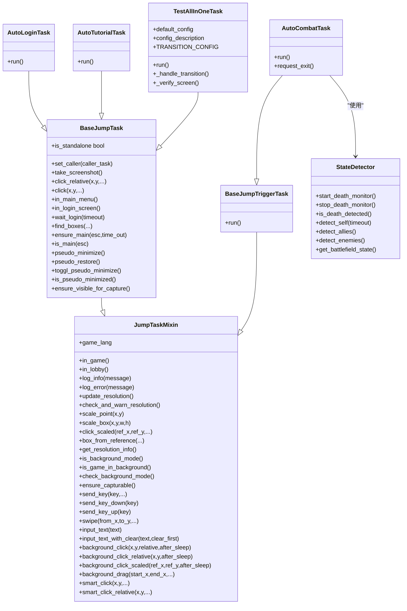
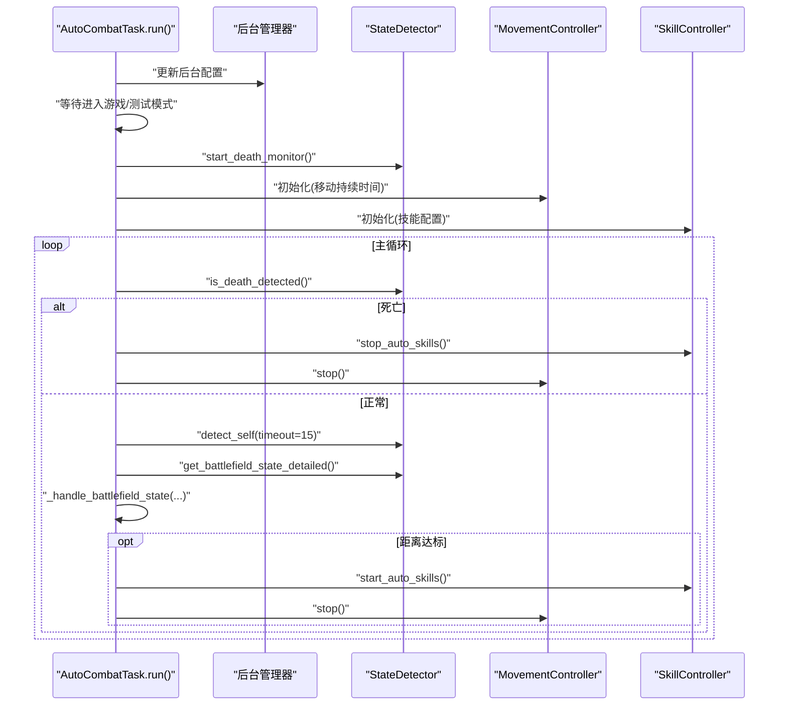
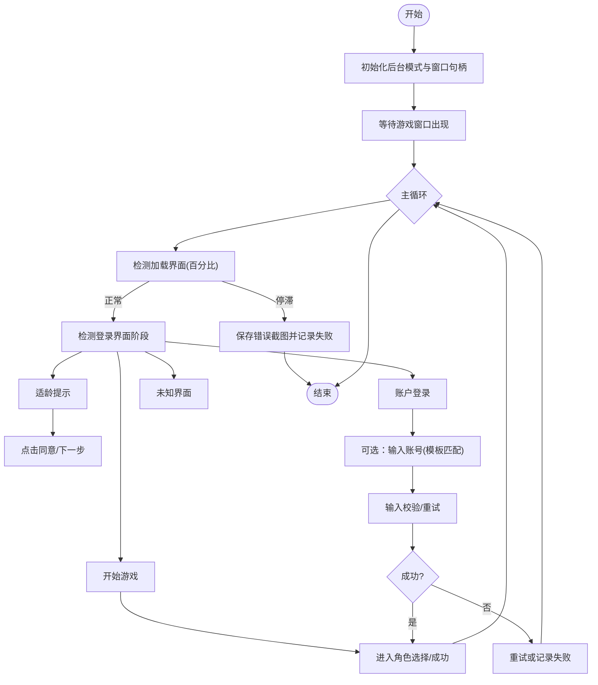
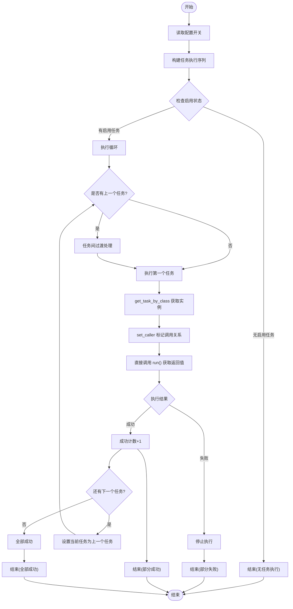
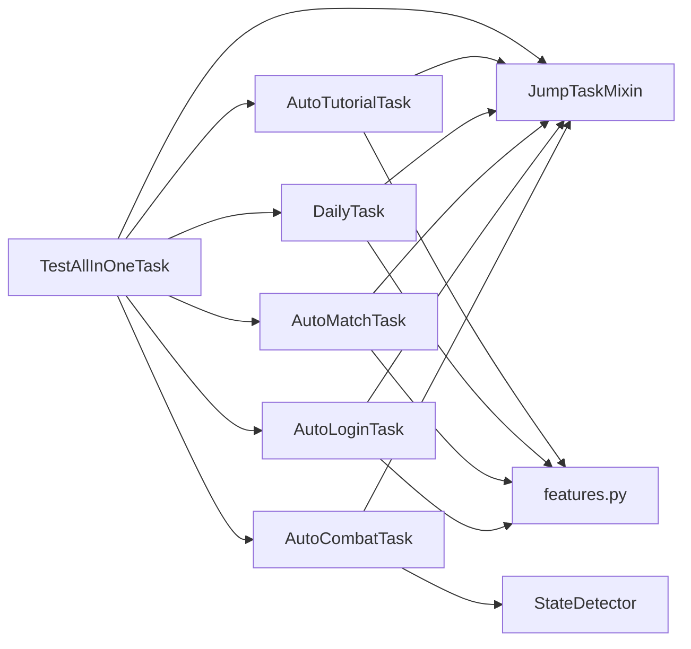

# 任务系统

<cite>
**本文档引用的文件**
- [BaseJumpTask.py](file://src/task/BaseJumpTask.py)
- [BaseJumpTriggerTask.py](file://src/task/BaseJumpTriggerTask.py)
- [mixins.py](file://src/task/mixins.py)
- [AutoCombatTask.py](file://src/task/AutoCombatTask.py)
- [AutoLoginTask.py](file://src/task/AutoLoginTask.py)
- [AutoMatchTask.py](file://src/task/AutoMatchTask.py)
- [DailyTask.py](file://src/task/DailyTask.py)
- [AutoTutorialTask.py](file://src/task/AutoTutorialTask.py)
- [TestAllInOneTask.py](file://src/task/TestAllInOneTask.py)
- [features.py](file://src/constants/features.py)
- [state_detector.py](file://src/combat/state_detector.py)
- [AutoCombatTask.json](file://configs/AutoCombatTask.json)
- [AutoLoginTask.json](file://configs/AutoLoginTask.json)
- [AutoMatchTask.json](file://configs/AutoMatchTask.json)
- [DailyTask.json](file://configs/DailyTask.json)
- [AutoTutorialTask.json](file://configs/AutoTutorialTask.json)
- [TestAllInOneTask.json](file://configs/TestAllInOneTask.json)
</cite>

## 目录
1. [简介](#简介)
2. [项目结构](#项目结构)
3. [核心组件](#核心组件)
4. [架构总览](#架构总览)
5. [详细组件分析](#详细组件分析)
6. [依赖分析](#依赖分析)
7. [性能考虑](#性能考虑)
8. [故障排查指南](#故障排查指南)
9. [结论](#结论)
10. [附录](#附录)

## 简介
本文件系统性梳理 OK-Jump 的任务系统，围绕"任务驱动架构"的设计理念与实现方式进行深入解析。文档覆盖以下主题：
- 任务基类设计与混入（mixin）复用策略
- 触发机制与生命周期管理
- 各类任务实现：自动战斗、自动登录、自动匹配、日常任务、自动教程、测试一条龙任务
- **新增**：可配置多任务编排器的设计与实现
- 任务配置、参数传递与错误处理最佳实践
- 与战斗检测子系统的集成与数据流

## 项目结构
任务系统位于 src/task 目录，采用"基类 + mixin + 具体任务"的分层组织方式；配置文件位于 configs 目录，统一管理各任务的默认参数。

**图表来源**
- [BaseJumpTask.py:14-422](file://src/task/BaseJumpTask.py#L14-L422)
- [BaseJumpTriggerTask.py:13-30](file://src/task/BaseJumpTriggerTask.py#L13-L30)
- [mixins.py:15-774](file://src/task/mixins.py#L15-L774)
- [AutoCombatTask.py:32-693](file://src/task/AutoCombatTask.py#L32-L693)
- [AutoLoginTask.py:21-800](file://src/task/AutoLoginTask.py#L21-L800)
- [AutoMatchTask.py:5-104](file://src/task/AutoMatchTask.py#L5-L104)
- [DailyTask.py:5-133](file://src/task/DailyTask.py#L5-L133)
- [AutoTutorialTask.py:5-154](file://src/task/AutoTutorialTask.py#L5-L154)
- [TestAllInOneTask.py:1-213](file://src/task/TestAllInOneTask.py#L1-L213)
- [features.py:9-86](file://src/constants/features.py#L9-L86)
- [state_detector.py:24-446](file://src/combat/state_detector.py#L24-L446)
- [AutoCombatTask.json:1-13](file://configs/AutoCombatTask.json#L1-L13)
- [AutoLoginTask.json:1-15](file://configs/AutoLoginTask.json#L1-L15)
- [AutoMatchTask.json:1-6](file://configs/AutoMatchTask.json#L1-L6)
- [DailyTask.json:1-7](file://configs/DailyTask.json#L1-L7)
- [AutoTutorialTask.json:1-8](file://configs/AutoTutorialTask.json#L1-L8)
- [TestAllInOneTask.json:1-9](file://configs/TestAllInOneTask.json#L1-L9)

**章节来源**
- [BaseJumpTask.py:14-422](file://src/task/BaseJumpTask.py#L14-L422)
- [BaseJumpTriggerTask.py:13-30](file://src/task/BaseJumpTriggerTask.py#L13-L30)
- [mixins.py:15-774](file://src/task/mixins.py#L15-L774)
- [features.py:9-86](file://src/constants/features.py#L9-L86)

## 核心组件
- 任务基类与混入
  - BaseJumpTask：面向"一次性任务"（如登录、匹配、日常、教程、测试一条龙），提供截图、点击、场景检测、登录等待、分辨率适配、后台模式支持、伪最小化、OCR 文本匹配等通用能力。
  - BaseJumpTriggerTask：面向"触发型任务"（如自动战斗），具备与 BaseJumpTask 相同的混入能力，但以触发/轮询方式运行。
  - JumpTaskMixin：通过混入模式将通用能力注入两类任务，避免重复代码，提升可维护性。
- 战斗状态检测
  - StateDetector：基于 YOLO 的并行死亡监控、自身检测、友方/敌方检测、战场状态判断，支撑自动战斗任务的智能决策。
- **新增**：可配置多任务编排器
  - TestAllInOneTask：从简单的顺序执行器升级为可配置的多任务编排器，支持任务间过渡处理、错误恢复机制和配置管理。

**章节来源**
- [BaseJumpTask.py:14-422](file://src/task/BaseJumpTask.py#L14-L422)
- [BaseJumpTriggerTask.py:13-30](file://src/task/BaseJumpTriggerTask.py#L13-L30)
- [mixins.py:15-774](file://src/task/mixins.py#L15-L774)
- [state_detector.py:24-446](file://src/combat/state_detector.py#L24-L446)
- [TestAllInOneTask.py:11-23](file://src/task/TestAllInOneTask.py#L11-L23)

## 架构总览
任务系统采用"任务驱动 + 混入复用 + 子系统协作"的架构：
- 任务基类与混入提供跨任务的通用能力（分辨率、后台输入、点击、OCR、语言适配等）。
- 具体任务聚焦业务流程（登录、匹配、日常、教程、战斗、测试一条龙），通过配置文件驱动参数化行为。
- 战斗任务与战斗检测子系统解耦，通过接口调用获取状态与目标，降低耦合度。
- **新增**：可配置多任务编排器协调多个子任务的顺序执行，提供任务间过渡处理和错误恢复机制。

**图表来源**
- [BaseJumpTask.py:14-422](file://src/task/BaseJumpTask.py#L14-L422)
- [BaseJumpTriggerTask.py:13-30](file://src/task/BaseJumpTriggerTask.py#L13-L30)
- [mixins.py:15-774](file://src/task/mixins.py#L15-L774)
- [AutoCombatTask.py:32-693](file://src/task/AutoCombatTask.py#L32-L693)
- [AutoLoginTask.py:21-800](file://src/task/AutoLoginTask.py#L21-L800)
- [AutoTutorialTask.py:5-154](file://src/task/AutoTutorialTask.py#L5-L154)
- [TestAllInOneTask.py:11-213](file://src/task/TestAllInOneTask.py#L11-L213)
- [state_detector.py:24-446](file://src/combat/state_detector.py#L24-L446)

## 详细组件分析

### 任务基类与混入（设计模式与复用）
- 设计要点
  - 基类职责分离：BaseJumpTask 负责一次性任务所需的能力（如登录等待、场景检测、伪最小化等）；BaseJumpTriggerTask 负责触发/轮询型任务的生命周期。
  - 混入复用：JumpTaskMixin 将分辨率适配、后台输入、点击封装、OCR 文本匹配、语言转换等横切关注点集中管理，避免重复实现。
- 生命周期管理
  - 一次性任务：run() 执行后通常结束；可通过 set_caller()/is_standalone 标识调用关系，影响任务结束后的行为（如登录任务在独立运行时主动结束）。
  - 触发型任务：run() 循环执行，内部通过 wait_until/ensure_main 等方法保障状态一致性。
- 触发机制
  - 触发型任务通过状态轮询（如 in_game/in_lobby）与外部控制流结合，按需启动/停止。

**章节来源**
- [BaseJumpTask.py:26-58](file://src/task/BaseJumpTask.py#L26-L58)
- [BaseJumpTriggerTask.py:25-29](file://src/task/BaseJumpTriggerTask.py#L25-L29)
- [mixins.py:32-36](file://src/task/mixins.py#L32-L36)

### 自动战斗任务（AutoCombatTask）
- 功能概述
  - 基于触发任务运行，负责完整的自动战斗逻辑：死亡状态并行监控、自身检测、战场状态判断、自动技能释放与移动控制。
- 核心流程
  - 初始化后台模式与分辨率，等待进入游戏（测试模式可跳过）。
  - 初始化控制器（状态检测、移动控制、技能控制、距离计算），启动死亡监控线程。
  - 主循环：死亡检测 → 自身检测（15秒超时）→ 战场状态判断（四类）→ 执行相应策略（跟随/追击/保持距离/释放技能）。
- 关键特性
  - 并行死亡监控：独立线程高频检测，主线程快速查询，提高响应速度。
  - GUI 配置驱动：技能开关、按键、间隔、移动持续时间等均可通过配置文件调整。
  - 伪后台支持：后台模式下自动伪最小化，保证截图与输入可用。
- 参数与配置
  - 默认配置项：测试模式、详细日志、自动普攻/技能/大招、各类间隔、移动持续时间。
  - 配置文件：configs/AutoCombatTask.json。

**图表来源**
- [AutoCombatTask.py:84-134](file://src/task/AutoCombatTask.py#L84-L134)
- [AutoCombatTask.py:197-271](file://src/task/AutoCombatTask.py#L197-L271)
- [state_detector.py:72-184](file://src/combat/state_detector.py#L72-L184)

**章节来源**
- [AutoCombatTask.py:40-83](file://src/task/AutoCombatTask.py#L40-L83)
- [AutoCombatTask.py:136-160](file://src/task/AutoCombatTask.py#L136-L160)
- [AutoCombatTask.py:166-196](file://src/task/AutoCombatTask.py#L166-L196)
- [AutoCombatTask.py:197-271](file://src/task/AutoCombatTask.py#L197-L271)
- [AutoCombatTask.py:302-414](file://src/task/AutoCombatTask.py#L302-L414)
- [AutoCombatTask.py:415-491](file://src/task/AutoCombatTask.py#L415-L491)
- [AutoCombatTask.py:492-630](file://src/task/AutoCombatTask.py#L492-L630)
- [AutoCombatTask.py:631-647](file://src/task/AutoCombatTask.py#L631-L647)
- [AutoCombatTask.py:679-692](file://src/task/AutoCombatTask.py#L679-L692)
- [AutoCombatTask.json:1-13](file://configs/AutoCombatTask.json#L1-L13)

### 自动登录任务（AutoLoginTask）
- 功能概述
  - 自动启动游戏并完成登录流程，包括适龄提示、账户登录、开始游戏、问卷调查、加载界面检测与容错处理。
- 核心流程
  - 初始化后台模式与窗口句柄，等待游戏窗口出现。
  - 进入登录流程：检测加载界面（百分比）、问卷调查、登录界面阶段（适龄提示/账户登录/开始游戏），执行对应点击与输入。
  - 加载检测：实时检测右下角百分比，若停滞则报错并保存截图；支持"状态容错"，在判定失败后短暂缓冲期内再次确认成功。
  - 账号输入：可选启用，支持模板匹配与输入校验，失败时重试指定次数。
- 参数与配置
  - 默认配置项：启用、自动启动游戏、等待启动超时、最大登录尝试次数、输入账号、账号、输入重试次数、登录等待超时、点击后等待、加载停滞超时、启用加载检测、启用状态容错。
  - 配置文件：configs/AutoLoginTask.json。

**图表来源**
- [AutoLoginTask.py:205-267](file://src/task/AutoLoginTask.py#L205-L267)
- [AutoLoginTask.py:512-681](file://src/task/AutoLoginTask.py#L512-L681)
- [AutoLoginTask.py:704-768](file://src/task/AutoLoginTask.py#L704-L768)
- [AutoLoginTask.py:770-797](file://src/task/AutoLoginTask.py#L770-L797)
- [AutoLoginTask.py:800-800](file://src/task/AutoLoginTask.py#L800-L800)

**章节来源**
- [AutoLoginTask.py:57-100](file://src/task/AutoLoginTask.py#L57-L100)
- [AutoLoginTask.py:205-267](file://src/task/AutoLoginTask.py#L205-L267)
- [AutoLoginTask.py:512-681](file://src/task/AutoLoginTask.py#L512-L681)
- [AutoLoginTask.py:704-768](file://src/task/AutoLoginTask.py#L704-L768)
- [AutoLoginTask.json:1-15](file://configs/AutoLoginTask.json#L1-L15)

### 自动匹配任务（AutoMatchTask）
- 功能概述
  - 导航至大厅，开始匹配，自动接受匹配。
- 核心流程
  - 更新分辨率并检查比例，导航至大厅（多次尝试 in_lobby），点击开始匹配按钮（特征匹配优先，否则相对坐标），等待并接受匹配（特征匹配）。
- 参数与配置
  - 默认配置项：启用、游戏模式、自动接受匹配、最大等待时间。
  - 配置文件：configs/AutoMatchTask.json。

**章节来源**
- [AutoMatchTask.py:10-54](file://src/task/AutoMatchTask.py#L10-L54)
- [AutoMatchTask.py:56-104](file://src/task/AutoMatchTask.py#L56-L104)
- [AutoMatchTask.json:1-6](file://configs/AutoMatchTask.json#L1-L6)

### 日常任务（DailyTask）
- 功能概述
  - 导航至任务界面，完成日常任务、收集奖励、使用体力。
- 核心流程
  - 按配置项依次执行：完成日常任务、收集奖励、使用体力；打印汇总结果。
- 参数与配置
  - 默认配置项：启用、完成日常任务、收集奖励、使用体力、体力阈值。
  - 配置文件：configs/DailyTask.json。

**章节来源**
- [DailyTask.py:7-44](file://src/task/DailyTask.py#L7-L44)
- [DailyTask.py:46-133](file://src/task/DailyTask.py#L46-L133)
- [DailyTask.json:1-7](file://configs/DailyTask.json#L1-L7)

### 自动教程任务（AutoTutorialTask）
- 功能概述
  - 自动跳过对话、点击引导、完成教学战斗。
- 核心流程
  - 循环检测教程完成标志，依次尝试跳过对话、点击引导、处理教学战斗；支持按键配置来自游戏热键配置。
- 参数与配置
  - 默认配置项：启用、自动跳过对话、自动点击引导、自动完成教学战斗、对话等待时间、点击间隔。
  - 配置文件：configs/AutoTutorialTask.json。

**章节来源**
- [AutoTutorialTask.py:7-58](file://src/task/AutoTutorialTask.py#L7-L58)
- [AutoTutorialTask.py:60-154](file://src/task/AutoTutorialTask.py#L60-L154)
- [AutoTutorialTask.json:1-8](file://configs/AutoTutorialTask.json#L1-L8)

### 可配置多任务编排器（TestAllInOneTask）
- **重大功能增强**：从简单的顺序任务执行器升级为可配置的多任务编排器
- **更新**：改进了子任务执行机制，从使用 run_task_by_class 改为更可靠的 get_task_by_class + set_caller + run 组合，增强了任务调用关系的管理和错误处理能力
- 功能概述
  - 作为可配置的多任务编排器，支持选择性执行多个任务，提供任务间过渡处理、错误恢复机制和配置管理功能。
- 核心特性
  - **配置驱动**：支持分别控制是否执行自动登录、自动新手教程、自动匹配、自动战斗、日常任务。
  - **任务间过渡处理**：通过 TRANSITION_CONFIG 定义任务间的特殊过渡配置，支持等待时间和界面验证。
  - **错误恢复机制**：实现失败短路机制，任一任务失败则停止后续任务执行。
  - **界面验证**：支持任务间的界面状态验证，确保任务切换的稳定性。
  - **统计报告**：输出详细的执行结果统计，返回整体执行状态。
- 核心流程
  - 读取配置开关，构建任务执行序列。
  - 逐个执行子任务，使用 get_task_by_class 获取任务实例，调用 set_caller 标记调用关系，然后直接调用 run() 方法获取返回值。
  - 实现失败短路机制：任一任务失败则停止后续任务执行。
  - 输出执行统计结果，返回整体执行状态。
- 关键配置
  - TRANSITION_CONFIG：定义任务间的过渡配置，如 AutoLoginTask → AutoTutorialTask 的角色选择界面验证。
  - default_config：包含所有可配置的开关和参数。
  - config_description：提供配置项的详细描述。
- 参数与配置
  - 默认配置项：启用、执行自动登录、执行自动新手教程、执行自动匹配、执行自动战斗、执行日常任务、任务间等待时间(秒)。
  - 配置文件：configs/TestAllInOneTask.json。

**图表来源**
- [TestAllInOneTask.py:51-132](file://src/task/TestAllInOneTask.py#L51-L132)
- [TestAllInOneTask.py:134-213](file://src/task/TestAllInOneTask.py#L134-L213)

**章节来源**
- [TestAllInOneTask.py:11-213](file://src/task/TestAllInOneTask.py#L11-L213)
- [TestAllInOneTask.json:1-9](file://configs/TestAllInOneTask.json#L1-L9)

## 依赖分析
- 组件耦合
  - AutoCombatTask 依赖 StateDetector 进行状态检测；二者通过接口调用解耦，便于替换检测实现。
  - 所有任务均依赖 JumpTaskMixin 提供的通用能力，降低重复代码。
  - 任务通过 features.py 中的特征常量进行界面识别，确保特征名称与配置一致。
  - **新增**：TestAllInOneTask 作为可配置多任务编排器，依赖 AutoLoginTask、AutoTutorialTask、AutoMatchTask、AutoCombatTask、DailyTask 的类引用。
- 外部依赖
  - YOLO 检测：战斗状态检测与登录界面 OCR/模板匹配依赖框架的检测能力。
  - 后台输入：SendInput/ADB 输入适配，确保后台模式下点击与输入可用。
  - 分辨率适配：统一缩放坐标与矩形框，保证不同分辨率下点击精度。
  - **新增**：框架提供的 get_task_by_class 方法用于统一的任务实例获取接口。

**图表来源**
- [AutoCombatTask.py:32-693](file://src/task/AutoCombatTask.py#L32-L693)
- [AutoLoginTask.py:21-800](file://src/task/AutoLoginTask.py#L21-L800)
- [AutoMatchTask.py:5-104](file://src/task/AutoMatchTask.py#L5-L104)
- [DailyTask.py:5-133](file://src/task/DailyTask.py#L5-L133)
- [AutoTutorialTask.py:5-154](file://src/task/AutoTutorialTask.py#L5-L154)
- [TestAllInOneTask.py:3-8](file://src/task/TestAllInOneTask.py#L3-L8)
- [features.py:9-86](file://src/constants/features.py#L9-L86)

**章节来源**
- [AutoCombatTask.py:32-693](file://src/task/AutoCombatTask.py#L32-L693)
- [AutoLoginTask.py:21-800](file://src/task/AutoLoginTask.py#L21-L800)
- [AutoMatchTask.py:5-104](file://src/task/AutoMatchTask.py#L5-L104)
- [DailyTask.py:5-133](file://src/task/DailyTask.py#L5-L133)
- [AutoTutorialTask.py:5-154](file://src/task/AutoTutorialTask.py#L5-L154)
- [TestAllInOneTask.py:3-8](file://src/task/TestAllInOneTask.py#L3-L8)
- [features.py:9-86](file://src/constants/features.py#L9-L86)

## 性能考虑
- 检测频率与响应
  - 自动战斗的死亡监控线程以较高频率（约30ms）轮询，确保快速响应；自身检测与战场状态判断在主线程中按需执行，避免过度开销。
- 后台模式优化
  - 仅在窗口最小化且后台模式启用时执行伪最小化；后台输入使用 SendInput 或 ADB 命令，减少框架层开销。
- 分辨率适配
  - 统一缩放坐标与矩形框，避免重复计算；仅在分辨率变更或首次使用时更新，降低频繁计算成本。
- I/O 与截图
  - 登录任务在加载界面阶段不执行点击，仅等待加载完成，减少无效 I/O；OCR 结果缓存避免重复识别。
- **新增**：可配置多任务编排器优化
  - 任务间过渡处理避免资源竞争，失败短路机制减少不必要的执行开销。
  - 界面验证采用超时机制，防止无限等待。
  - 配置驱动的可选执行避免不必要的任务开销。

## 故障排查指南
- 登录任务常见问题
  - 加载停滞：检测到百分比长时间不变，记录错误并保存截图；检查网络与服务器稳定性。
  - 状态容错：在判定失败后短暂缓冲期内再次确认成功，避免误判。
  - 账号输入失败：模板匹配阈值或输入校验超时导致失败，适当调整阈值与等待时间。
- 自动战斗常见问题
  - 自身检测超时：15秒内未检测到自身，检查 YOLO 模型与识别阈值；必要时启用测试模式进行定位。
  - 距离判定异常：优化距离范围与移动持续时间；检查目标锁定与丢失计数逻辑。
- **新增**：可配置多任务编排器问题
  - 任务间过渡失败：检查 TRANSITION_CONFIG 配置是否正确，验证界面特征名称。
  - 界面验证超时：调整 verify_timeout 参数，检查特征检测的准确性。
  - 任务执行异常：查看具体任务的日志输出，确认任务类引用是否正确。
  - 配置开关失效：验证 TestAllInOneTask.json 中的开关配置，确保布尔值格式正确。
  - **更新**：子任务执行失败：检查 get_task_by_class 返回值，确认任务实例获取是否成功；验证 set_caller 调用是否正确设置调用关系。
- 通用问题
  - 后台模式不可用：确保后台模式已启用且窗口句柄正确；必要时执行伪最小化。
  - 分辨率不匹配：16:9 比例警告时，建议调整分辨率以提升识别精度。

**章节来源**
- [AutoLoginTask.py:403-456](file://src/task/AutoLoginTask.py#L403-L456)
- [AutoLoginTask.py:475-501](file://src/task/AutoLoginTask.py#L475-L501)
- [AutoLoginTask.py:574-588](file://src/task/AutoLoginTask.py#L574-L588)
- [AutoCombatTask.py:238-244](file://src/task/AutoCombatTask.py#L238-L244)
- [mixins.py:315-342](file://src/task/mixins.py#L315-L342)
- [TestAllInOneTask.py:104-125](file://src/task/TestAllInOneTask.py#L104-L125)

## 结论
OK-Jump 的任务系统通过"基类 + 混入 + 触发/一次性任务"的分层设计，实现了高内聚、低耦合的任务体系。混入模式有效消除了重复代码，使任务能力可复用、可扩展；配置驱动与特征常量确保了任务行为的可控与一致性。战斗任务与检测子系统的解耦提升了系统的可维护性与可测试性。**新增的可配置多任务编排器进一步完善了自动化测试能力，通过任务间过渡处理、错误恢复机制和配置管理功能，为系统提供了完整的端到端测试解决方案。最新改进的子任务执行机制（get_task_by_class + set_caller + run）增强了任务调用关系的管理和错误处理能力，使多任务编排更加可靠和可控。** 建议在扩展新任务时遵循现有模式，优先复用混入能力，并通过配置文件进行参数化控制。

## 附录
- 任务配置文件路径
  - AutoCombatTask.json：configs/AutoCombatTask.json
  - AutoLoginTask.json：configs/AutoLoginTask.json
  - AutoMatchTask.json：configs/AutoMatchTask.json
  - DailyTask.json：configs/DailyTask.json
  - AutoTutorialTask.json：configs/AutoTutorialTask.json
  - TestAllInOneTask.json：configs/TestAllInOneTask.json
- 特征常量
  - features.py：统一管理登录、大厅、游戏中、匹配、结算等特征名称，确保代码与配置一致。
- 任务类导出
  - 所有任务类已在 src/task/__init__.py 中正确导出，包括新增的 TestAllInOneTask。
- **新增**：可配置多任务编排器特性
  - TRANSITION_CONFIG：定义任务间的过渡配置，支持等待时间和界面验证。
  - default_config：提供完整的配置项定义和默认值。
  - config_description：提供配置项的详细说明和用途描述。
- **更新**：子任务执行机制
  - get_task_by_class：获取任务实例的可靠接口
  - set_caller：标记调用关系，影响任务完成后的行为
  - 直接调用 run()：获取返回值，实现失败短路机制