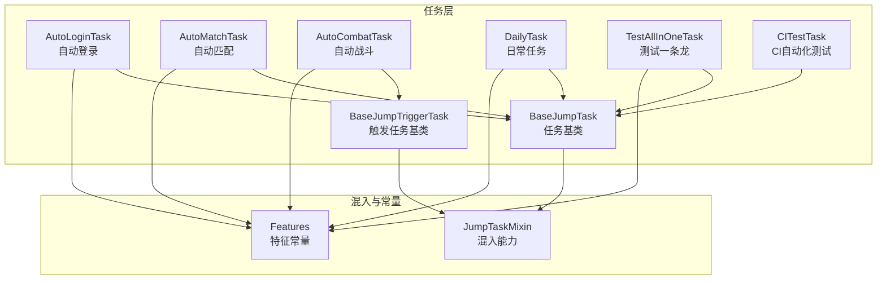
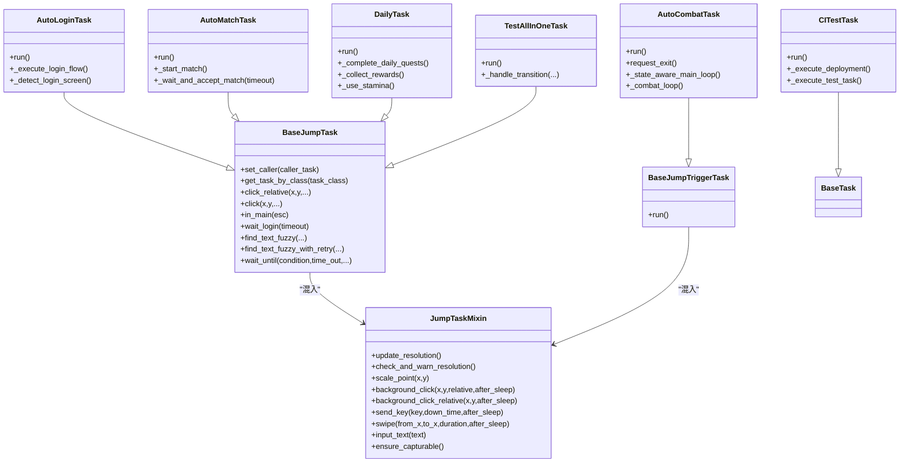
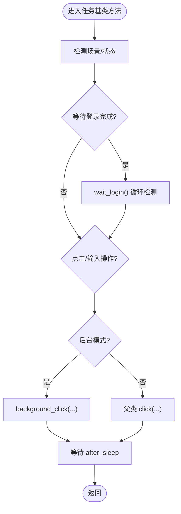
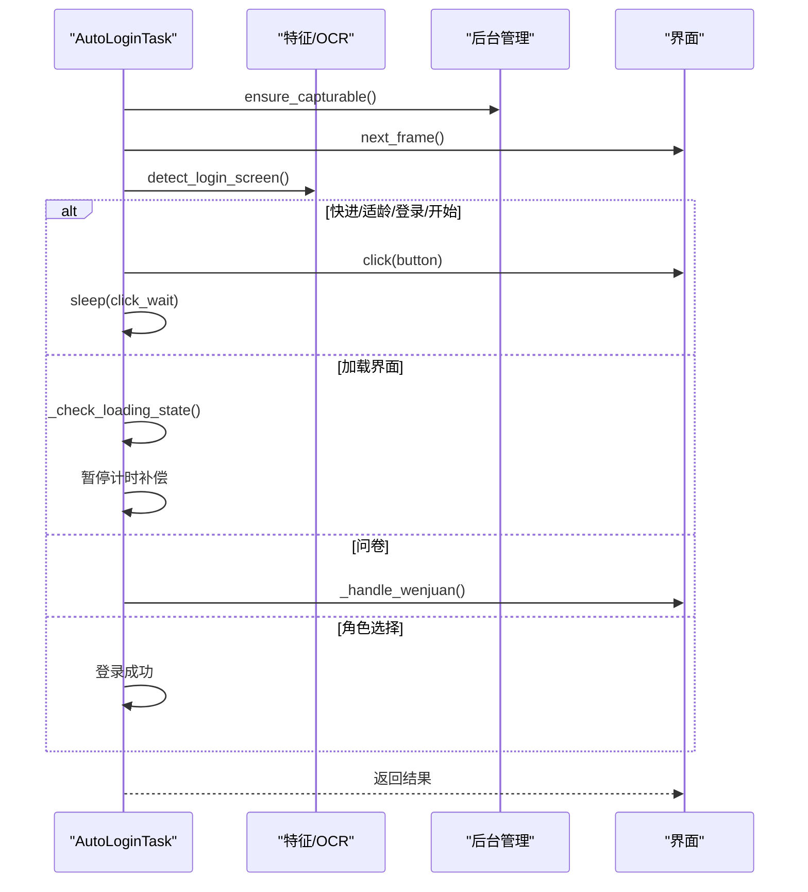
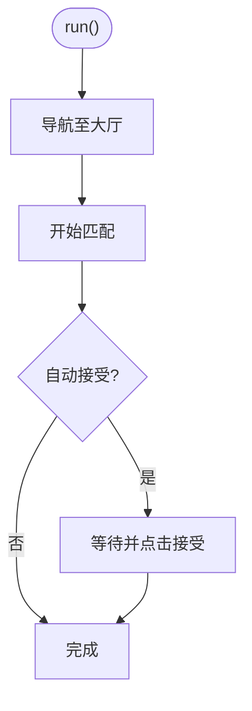
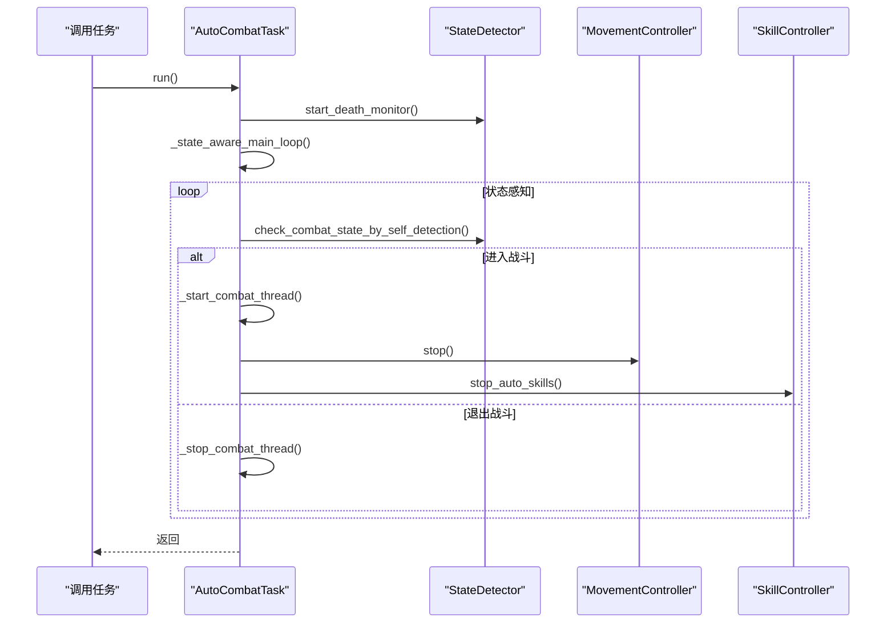
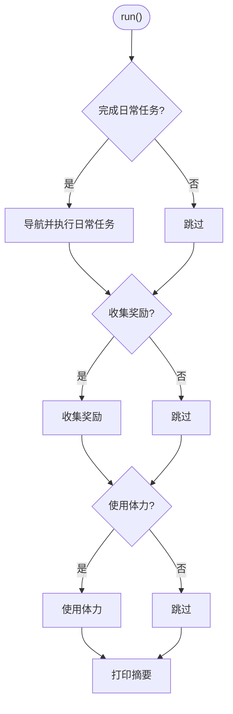
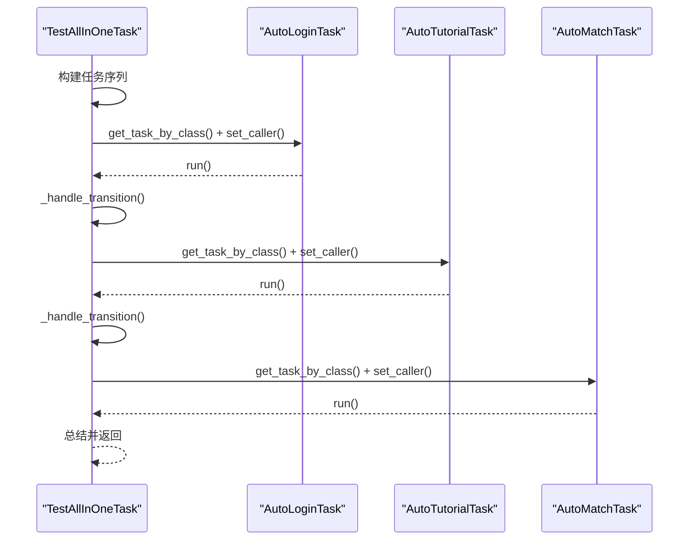
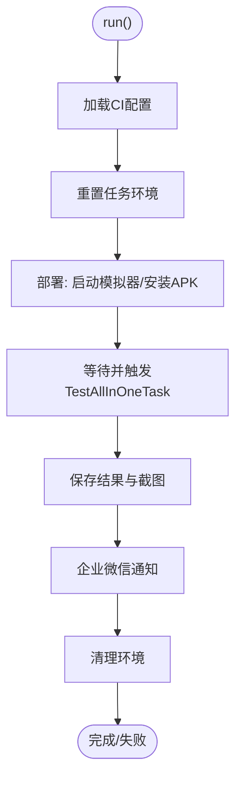
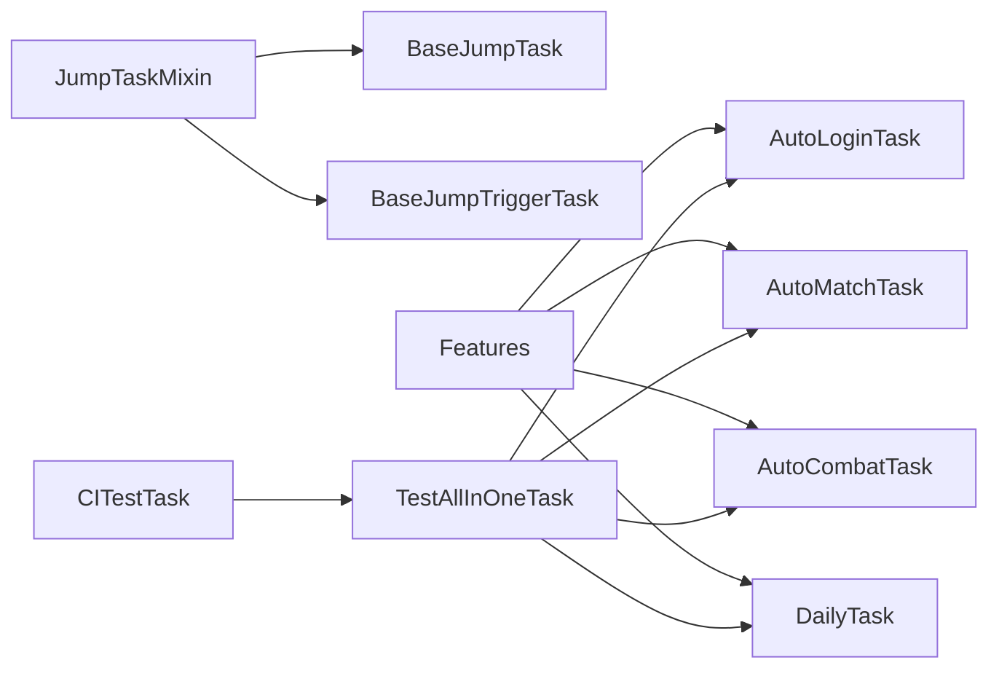

# 任务系统

<cite>
**本文档引用的文件**
- [src/task/BaseJumpTask.py](file://src/task/BaseJumpTask.py)
- [src/task/mixins.py](file://src/task/mixins.py)
- [src/task/AutoLoginTask.py](file://src/task/AutoLoginTask.py)
- [src/task/AutoMatchTask.py](file://src/task/AutoMatchTask.py)
- [src/task/AutoCombatTask.py](file://src/task/AutoCombatTask.py)
- [src/task/DailyTask.py](file://src/task/DailyTask.py)
- [src/task/CITestTask.py](file://src/task/CITestTask.py)
- [src/task/TestAllInOneTask.py](file://src/task/TestAllInOneTask.py)
- [src/task/BaseJumpTriggerTask.py](file://src/task/BaseJumpTriggerTask.py)
- [src/constants/features.py](file://src/constants/features.py)
- [configs/AutoLoginTask.json](file://configs/AutoLoginTask.json)
- [configs/AutoMatchTask.json](file://configs/AutoMatchTask.json)
- [configs/AutoCombatTask.json](file://configs/AutoCombatTask.json)
- [configs/DailyTask.json](file://configs/DailyTask.json)
- [README.md](file://README.md)
</cite>

## 目录
1. [简介](#简介)
2. [项目结构](#项目结构)
3. [核心组件](#核心组件)
4. [架构总览](#架构总览)
5. [详细组件分析](#详细组件分析)
6. [依赖关系分析](#依赖关系分析)
7. [性能考虑](#性能考虑)
8. [故障排查指南](#故障排查指南)
9. [结论](#结论)
10. [附录](#附录)

## 简介
本项目提供一套面向游戏自动化任务的系统，围绕“任务基类 + 混入模式 + 触发型任务”的架构设计，实现自动登录、匹配、战斗、日常任务等核心能力，并通过 CI 测试任务串联部署与回归流程。系统强调：
- 任务生命周期管理：初始化、运行、状态检查、错误处理、清理
- 配置系统集成：JSON 配置文件与运行时配置的融合
- 任务混入（mixin）模式：将分辨率、后台模式、OCR/特征检测等通用能力注入任务基类
- 任务编排：任务间依赖与过渡、调用关系与状态传播
- 扩展机制：基于基类派生新任务，复用混入能力

## 项目结构
任务系统位于 src/task 目录，配合 src/constants/features.py 提供统一的特征名称常量，configs 目录提供各任务的 JSON 配置文件。

图表来源
- [src/task/BaseJumpTask.py:1-572](file://src/task/BaseJumpTask.py#L1-L572)
- [src/task/mixins.py:1-784](file://src/task/mixins.py#L1-L784)
- [src/task/BaseJumpTriggerTask.py:1-30](file://src/task/BaseJumpTriggerTask.py#L1-L30)
- [src/constants/features.py:1-100](file://src/constants/features.py#L1-L100)

章节来源
- [README.md:1-8](file://README.md#L1-L8)

## 核心组件
- 任务基类与混入
  - BaseJumpTask：提供登录等待、OCR/特征检测、坐标点击、场景检测、等待条件等通用能力
  - JumpTaskMixin：提供分辨率适配、后台模式支持、后台点击、键盘/滑动输入、窗口伪最小化等跨任务通用能力
  - BaseJumpTriggerTask：触发型任务基类，用于需要轮询/触发的长期任务（如自动战斗）

- 任务编排与调度
  - TestAllInOneTask：组合执行多个任务，支持任务间过渡与验证
  - CITestTask：CI 流水线任务，负责部署、触发测试、结果上报与通知

- 配置系统
  - 各任务在 default_config 中声明默认配置，configs/*.json 文件提供持久化配置；运行时可通过框架读取并覆盖

章节来源
- [src/task/BaseJumpTask.py:26-572](file://src/task/BaseJumpTask.py#L26-L572)
- [src/task/mixins.py:15-784](file://src/task/mixins.py#L15-L784)
- [src/task/BaseJumpTriggerTask.py:13-30](file://src/task/BaseJumpTriggerTask.py#L13-L30)
- [src/task/TestAllInOneTask.py:11-223](file://src/task/TestAllInOneTask.py#L11-L223)
- [src/task/CITestTask.py:26-1036](file://src/task/CITestTask.py#L26-L1036)

## 架构总览
任务系统采用“基类 + 混入 + 触发型任务”的分层架构：
- 基类层：统一任务生命周期与通用能力
- 混入层：跨任务复用的底层能力（分辨率、后台、输入）
- 业务层：具体任务（登录、匹配、战斗、日常、编排、CI）
- 配置层：default_config + JSON 配置文件

图表来源
- [src/task/BaseJumpTask.py:26-572](file://src/task/BaseJumpTask.py#L26-L572)
- [src/task/mixins.py:15-784](file://src/task/mixins.py#L15-L784)
- [src/task/BaseJumpTriggerTask.py:13-30](file://src/task/BaseJumpTriggerTask.py#L13-L30)
- [src/task/AutoLoginTask.py:21-800](file://src/task/AutoLoginTask.py#L21-L800)
- [src/task/AutoMatchTask.py:5-99](file://src/task/AutoMatchTask.py#L5-L99)
- [src/task/AutoCombatTask.py:35-1366](file://src/task/AutoCombatTask.py#L35-L1366)
- [src/task/DailyTask.py:5-128](file://src/task/DailyTask.py#L5-L128)
- [src/task/TestAllInOneTask.py:11-223](file://src/task/TestAllInOneTask.py#L11-L223)
- [src/task/CITestTask.py:26-1036](file://src/task/CITestTask.py#L26-L1036)

## 详细组件分析

### 任务基类与混入（BaseJumpTask 与 JumpTaskMixin）
- 任务基类职责
  - 场景检测：主菜单、登录界面、游戏中、大厅等
  - 登录流程：等待登录完成、处理登录按钮、OCR 文本模糊匹配
  - 坐标与点击：相对坐标、绝对坐标、后台点击、缩放坐标
  - 等待与条件：wait_until、ensure_main、is_main
  - 语言与 OCR：简繁转换、边界过滤、模糊匹配策略

- 混入职责
  - 分辨率适配：更新分辨率、缩放点与框、创建参考坐标 Box
  - 后台模式：检测后台状态、伪最小化、后台输入（SendInput）、ADB 模式适配
  - 输入抽象：send_key、send_key_down/up、swipe、input_text、后台拖拽
  - 窗口可截图保障：ensure_capturable

图表来源
- [src/task/BaseJumpTask.py:182-207](file://src/task/BaseJumpTask.py#L182-L207)
- [src/task/BaseJumpTask.py:140-156](file://src/task/BaseJumpTask.py#L140-L156)
- [src/task/mixins.py:666-727](file://src/task/mixins.py#L666-L727)

章节来源
- [src/task/BaseJumpTask.py:26-572](file://src/task/BaseJumpTask.py#L26-L572)
- [src/task/mixins.py:15-784](file://src/task/mixins.py#L15-L784)

### 自动登录任务（AutoLoginTask）
- 功能要点
  - 多界面识别：快进、适龄提示、账号登录、开始游戏、加载、问卷、角色选择
  - 加载界面检测：右下角百分比 OCR，停滞检测与暂停计时补偿
  - 状态容错：失败后短暂缓冲期内再次确认成功
  - 勾选框检测：YOLO 模型检测协议勾选状态
  - 账号输入：模板匹配 + OCR 校验 + 多次重试
  - 截图与错误保存：超时/停滞/未知界面保存截图

图表来源
- [src/task/AutoLoginTask.py:227-752](file://src/task/AutoLoginTask.py#L227-L752)
- [src/task/AutoLoginTask.py:443-496](file://src/task/AutoLoginTask.py#L443-L496)
- [src/task/mixins.py:307-344](file://src/task/mixins.py#L307-L344)

章节来源
- [src/task/AutoLoginTask.py:21-800](file://src/task/AutoLoginTask.py#L21-L800)
- [configs/AutoLoginTask.json:1-14](file://configs/AutoLoginTask.json#L1-L14)

### 自动匹配任务（AutoMatchTask）
- 功能要点
  - 导航至大厅：循环检测 in_lobby
  - 开始匹配：特征匹配或相对坐标点击
  - 接受匹配：等待 accept 按钮并点击
  - 配置：游戏模式、自动接受、最大等待时间

图表来源
- [src/task/AutoMatchTask.py:20-99](file://src/task/AutoMatchTask.py#L20-L99)

章节来源
- [src/task/AutoMatchTask.py:5-99](file://src/task/AutoMatchTask.py#L5-L99)
- [configs/AutoMatchTask.json:1-5](file://configs/AutoMatchTask.json#L1-L5)

### 自动战斗任务（AutoCombatTask）
- 功能要点
  - 触发型任务：作为 TriggerTask 被其他任务调用
  - 状态感知主循环：通过 YOLO 自身检测动态启停
  - 并行死亡监控：独立线程持续监控死亡状态
  - 技能与移动控制：根据战场状态与距离控制释放
  - 卡住/抖动检测：无敌人在范围内时的规避策略
  - 类变量管理：运行实例、教程暂停、重置方法

图表来源
- [src/task/AutoCombatTask.py:199-516](file://src/task/AutoCombatTask.py#L199-L516)
- [src/task/AutoCombatTask.py:561-648](file://src/task/AutoCombatTask.py#L561-L648)

章节来源
- [src/task/AutoCombatTask.py:35-1366](file://src/task/AutoCombatTask.py#L35-L1366)
- [src/task/BaseJumpTriggerTask.py:13-30](file://src/task/BaseJumpTriggerTask.py#L13-L30)

### 日常任务（DailyTask）
- 功能要点
  - 导航至任务界面，批量点击日常任务并执行
  - 收集奖励、使用体力（阈值控制）

图表来源
- [src/task/DailyTask.py:18-128](file://src/task/DailyTask.py#L18-L128)

章节来源
- [src/task/DailyTask.py:5-128](file://src/task/DailyTask.py#L5-L128)
- [configs/DailyTask.json:1-6](file://configs/DailyTask.json#L1-L6)

### 测试一条龙（TestAllInOneTask）
- 功能要点
  - 组合执行多个任务，支持任务间过渡与界面验证
  - 通过 get_task_by_class 获取已注册任务实例，避免直接实例化
  - 任务间等待与错误传播

图表来源
- [src/task/TestAllInOneTask.py:53-142](file://src/task/TestAllInOneTask.py#L53-L142)
- [src/task/TestAllInOneTask.py:144-223](file://src/task/TestAllInOneTask.py#L144-L223)

章节来源
- [src/task/TestAllInOneTask.py:11-223](file://src/task/TestAllInOneTask.py#L11-L223)

### CI 自动化测试（CITestTask）
- 功能要点
  - 部署：从 Jenkins 下载 APK、启动模拟器、安装并启动游戏
  - 触发：等待游戏启动后触发 TestAllInOneTask
  - 结果：保存测试报告、截图、企业微信通知
  - 重试：失败自动重试，支持账号递增
  - 环境隔离：重置设备连接、重置 AutoCombatTask 类状态

图表来源
- [src/task/CITestTask.py:146-273](file://src/task/CITestTask.py#L146-L273)
- [src/task/CITestTask.py:648-747](file://src/task/CITestTask.py#L648-L747)

章节来源
- [src/task/CITestTask.py:26-1036](file://src/task/CITestTask.py#L26-L1036)

## 依赖关系分析
- 任务与混入
  - BaseJumpTask 与 BaseJumpTriggerTask 均混入 JumpTaskMixin，获得分辨率、后台、输入等能力
- 任务与特征
  - 各任务通过 Features 常量统一引用特征名称，保证配置与代码一致性
- 任务编排
  - TestAllInOneTask 通过 get_task_by_class 获取已注册任务实例，避免直接实例化
- 配置耦合
  - default_config 与 configs/*.json 文件共同构成配置源，运行时可覆盖

图表来源
- [src/task/mixins.py:15-784](file://src/task/mixins.py#L15-L784)
- [src/task/BaseJumpTask.py:26-572](file://src/task/BaseJumpTask.py#L26-L572)
- [src/task/BaseJumpTriggerTask.py:13-30](file://src/task/BaseJumpTriggerTask.py#L13-L30)
- [src/constants/features.py:9-100](file://src/constants/features.py#L9-L100)
- [src/task/TestAllInOneTask.py:107-116](file://src/task/TestAllInOneTask.py#L107-L116)
- [src/task/CITestTask.py:409-420](file://src/task/CITestTask.py#L409-L420)

章节来源
- [src/constants/features.py:9-100](file://src/constants/features.py#L9-L100)
- [src/task/TestAllInOneTask.py:11-223](file://src/task/TestAllInOneTask.py#L11-L223)
- [src/task/CITestTask.py:26-1036](file://src/task/CITestTask.py#L26-L1036)

## 性能考虑
- OCR 与特征检测
  - 合理缓存 OCR 结果，减少重复识别开销
  - 使用边界过滤与简繁转换，降低误检概率
- 后台模式
  - 后台点击使用 SendInput，避免前台切换带来的额外延迟
  - 仅在最小化时执行伪最小化，减少不必要的窗口操作
- 加载检测
  - 加载百分比检测仅在必要时进行 ROI OCR，避免全屏扫描
  - 暂停计时补偿避免超时误判
- 战斗循环
  - 并行死亡监控线程与主循环解耦，降低阻塞
  - 无敌人在范围内时才执行卡住/抖动检测，减少无效操作

## 故障排查指南
- 登录失败
  - 检查 AutoLoginTask 的错误截图与日志，确认是否卡在加载或未知界面
  - 核对账号配置与输入模板路径
- 匹配失败
  - 确认大厅导航成功，检查匹配按钮特征是否正确
- 战斗异常
  - 检查后台模式与伪最小化状态
  - 查看详细日志中的自身检测与敌人检测结果
- CI 失败
  - 检查模拟器启动、APK 下载、任务触发超时
  - 关注连续失败阈值与重试策略

章节来源
- [src/task/AutoLoginTask.py:550-752](file://src/task/AutoLoginTask.py#L550-L752)
- [src/task/AutoMatchTask.py:78-99](file://src/task/AutoMatchTask.py#L78-L99)
- [src/task/AutoCombatTask.py:452-516](file://src/task/AutoCombatTask.py#L452-L516)
- [src/task/CITestTask.py:260-273](file://src/task/CITestTask.py#L260-L273)

## 结论
本任务系统通过“任务基类 + 混入 + 触发型任务”的架构，实现了登录、匹配、战斗、日常、编排与 CI 的完整自动化闭环。混入模式显著提升了代码复用与维护效率；配置系统与 JSON 文件结合提供了灵活的运行时定制能力；任务编排与 CI 流水线确保了端到端的稳定性与可观察性。建议在扩展新任务时遵循现有基类与混入约定，确保一致的用户体验与可维护性。

## 附录
- 配置文件路径
  - AutoLoginTask.json：[configs/AutoLoginTask.json](file://configs/AutoLoginTask.json)
  - AutoMatchTask.json：[configs/AutoMatchTask.json](file://configs/AutoMatchTask.json)
  - AutoCombatTask.json：[configs/AutoCombatTask.json](file://configs/AutoCombatTask.json)
  - DailyTask.json：[configs/DailyTask.json](file://configs/DailyTask.json)
- 特征常量
  - Features：[src/constants/features.py](file://src/constants/features.py)