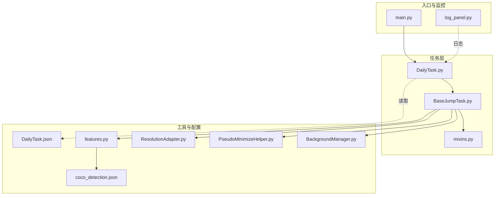
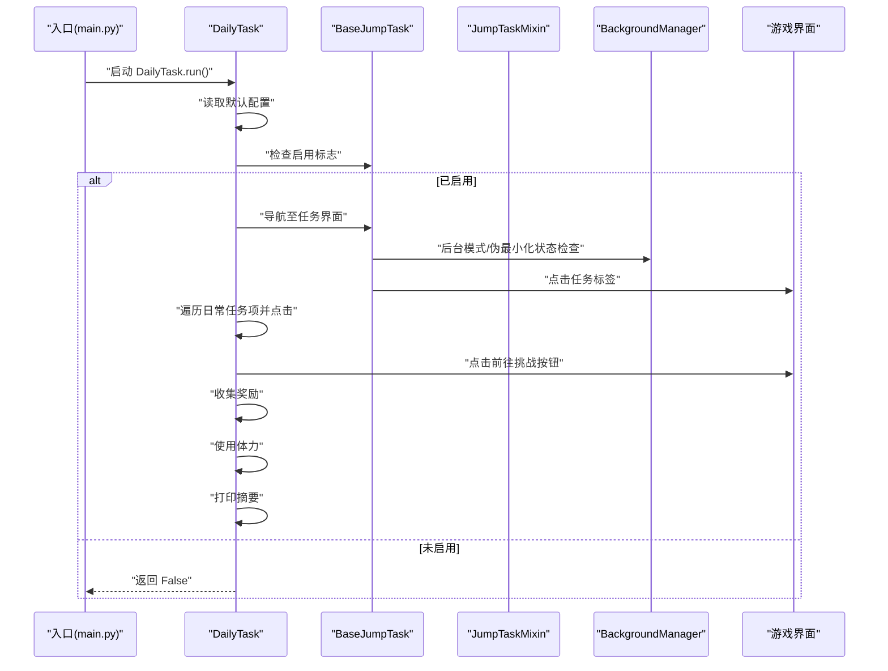
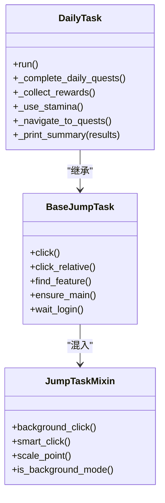
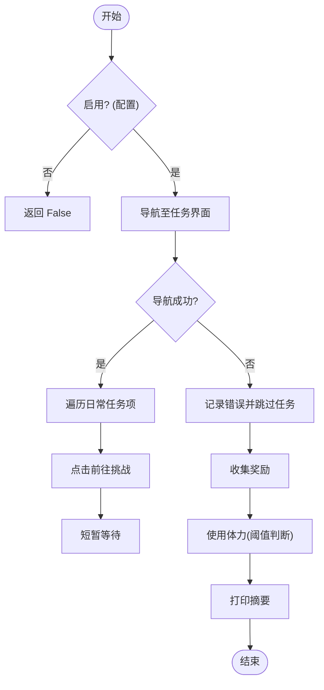
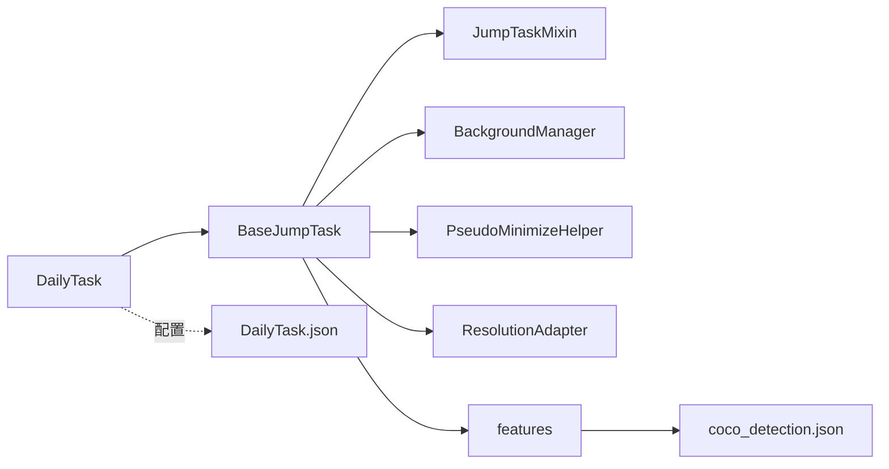

# 日常任务

<cite>
**本文档引用的文件**
- [DailyTask.py](file://src/task/DailyTask.py)
- [DailyTask.json](file://configs/DailyTask.json)
- [BaseJumpTask.py](file://src/task/BaseJumpTask.py)
- [mixins.py](file://src/task/mixins.py)
- [features.py](file://src/constants/features.py)
- [BackgroundManager.py](file://src/utils/BackgroundManager.py)
- [PseudoMinimizeHelper.py](file://src/utils/PseudoMinimizeHelper.py)
- [ResolutionAdapter.py](file://src/utils/ResolutionAdapter.py)
- [main.py](file://main.py)
- [log_panel.py](file://src/gui/log_panel.py)
- [coco_detection.json](file://assets/coco_detection.json)
</cite>

## 目录
1. [简介](#简介)
2. [项目结构](#项目结构)
3. [核心组件](#核心组件)
4. [架构总览](#架构总览)
5. [详细组件分析](#详细组件分析)
6. [依赖分析](#依赖分析)
7. [性能考虑](#性能考虑)
8. [故障排查指南](#故障排查指南)
9. [结论](#结论)
10. [附录](#附录)

## 简介
本章节面向"OK-Jump"的日常任务模块（DailyTask），系统性阐述其设计思路、实现原理与运行机制。内容覆盖以下方面：
- 日常任务检测、活动参与、奖励领取的自动化流程
- 状态跟踪、进度监控与自动完成策略
- 配置参数、任务优先级与时间管理选项
- 启动方法、运行监控、异常处理与效率优化建议
- 不同日常活动的处理示例与常见问题解决方案

## 项目结构
日常任务位于任务层，依赖通用任务基类与混入类提供的通用能力；同时通过特征常量与检测配置文件进行UI元素定位。

**图表来源**
- [DailyTask.py:1-128](file://src/task/DailyTask.py#L1-L128)
- [BaseJumpTask.py:14-422](file://src/task/BaseJumpTask.py#L14-L422)
- [mixins.py:15-774](file://src/task/mixins.py#L15-L774)
- [features.py:9-86](file://src/constants/features.py#L9-L86)
- [BackgroundManager.py:7-155](file://src/utils/BackgroundManager.py#L7-L155)
- [PseudoMinimizeHelper.py:13-238](file://src/utils/PseudoMinimizeHelper.py#L13-L238)
- [ResolutionAdapter.py:4-163](file://src/utils/ResolutionAdapter.py#L4-L163)
- [DailyTask.json:1-6](file://configs/DailyTask.json#L1-L6)
- [coco_detection.json:1-200](file://assets/coco_detection.json#L1-L200)
- [main.py:99-107](file://main.py#L99-L107)
- [log_panel.py:58-388](file://src/gui/log_panel.py#L58-L388)

**章节来源**
- [DailyTask.py:1-128](file://src/task/DailyTask.py#L1-L128)
- [BaseJumpTask.py:14-422](file://src/task/BaseJumpTask.py#L14-L422)
- [mixins.py:15-774](file://src/task/mixins.py#L15-L774)
- [features.py:9-86](file://src/constants/features.py#L9-L86)
- [BackgroundManager.py:7-155](file://src/utils/BackgroundManager.py#L7-L155)
- [PseudoMinimizeHelper.py:13-238](file://src/utils/PseudoMinimizeHelper.py#L13-L238)
- [ResolutionAdapter.py:4-163](file://src/utils/ResolutionAdapter.py#L4-L163)
- [DailyTask.json:1-6](file://configs/DailyTask.json#L1-L6)
- [coco_detection.json:1-200](file://assets/coco_detection.json#L1-L200)
- [main.py:99-107](file://main.py#L99-L107)
- [log_panel.py:58-388](file://src/gui/log_panel.py#L58-L388)

## 核心组件
- DailyTask：负责日常任务的完整生命周期，包括任务检测、活动参与、奖励领取与体力使用，并输出汇总结果。
- BaseJumpTask：提供通用的后台模式、分辨率适配、后台点击、登录等待、伪最小化等能力。
- JumpTaskMixin：提供通用的点击、滑动、键盘输入、分辨率缩放、后台输入等混入方法。
- features：集中管理UI特征名称，保证与检测配置文件一致。
- BackgroundManager/PseudoMinimizeHelper/ResolutionAdapter：支撑跨平台、跨分辨率、后台运行的稳定性与准确性。

**章节来源**
- [DailyTask.py:5-44](file://src/task/DailyTask.py#L5-L44)
- [BaseJumpTask.py:14-422](file://src/task/BaseJumpTask.py#L14-L422)
- [mixins.py:15-774](file://src/task/mixins.py#L15-L774)
- [features.py:9-86](file://src/constants/features.py#L9-L86)

## 架构总览
下面的序列图展示了DailyTask的典型运行流程：启动、配置校验、任务执行与结果汇总。

**图表来源**
- [DailyTask.py:19-44](file://src/task/DailyTask.py#L19-L44)
- [BaseJumpTask.py:366-422](file://src/task/BaseJumpTask.py#L366-L422)
- [BackgroundManager.py:43-92](file://src/utils/BackgroundManager.py#L43-L92)

## 详细组件分析

### DailyTask 类分析
- 职责与流程
  - run：按顺序执行"完成日常任务""收集奖励""使用体力"，并输出结果摘要。
  - _complete_daily_quests：导航至任务界面，遍历日常任务项并发起挑战。
  - _collect_rewards：循环点击领取奖励按钮，直到不再出现。
  - _use_stamina：根据配置阈值决定是否使用体力。
  - _navigate_to_quests/_print_summary：辅助导航与结果汇总。
- 配置项
  - **已更新** 完成日常任务、收集奖励、使用体力、体力阈值。移除了原有的"启用"配置项，简化了配置结构。
- 特征依赖
  - 通过特征名称在UI中定位任务标签、任务项、前往按钮、奖励领取按钮、体力使用入口等。

**图表来源**
- [DailyTask.py:5-128](file://src/task/DailyTask.py#L5-L128)
- [BaseJumpTask.py:14-422](file://src/task/BaseJumpTask.py#L14-L422)
- [mixins.py:15-774](file://src/task/mixins.py#L15-L774)

**章节来源**
- [DailyTask.py:5-128](file://src/task/DailyTask.py#L5-L128)
- [DailyTask.json:1-6](file://configs/DailyTask.json#L1-L6)

### 日常任务执行流程（算法）

**图表来源**
- [DailyTask.py:19-128](file://src/task/DailyTask.py#L19-L128)

**章节来源**
- [DailyTask.py:19-128](file://src/task/DailyTask.py#L19-L128)

### 配置参数与优先级
- **已更新** 配置结构简化
  - 移除了"启用"配置项，所有功能都通过独立的布尔开关控制。
  - 独立的功能开关：完成日常任务、收集奖励、使用体力。
- 功能优先级
  - 任务执行优先于奖励领取，奖励领取优先于体力使用。
- 时间管理
  - 任务执行与奖励领取过程中包含固定等待，避免过快导致识别失败。
- 体力阈值
  - 使用体力前会读取阈值，若未找到则采用默认值。

**章节来源**
- [DailyTask.py:11-16](file://src/task/DailyTask.py#L11-L16)
- [DailyTask.py:29-36](file://src/task/DailyTask.py#L29-L36)
- [DailyTask.py:108-118](file://src/task/DailyTask.py#L108-L118)

### 特征与UI定位
- 特征名称
  - tab_quests、daily_quest_{i}、quest_go、claim_reward、use_stamina 等。
- 配置来源
  - assets/coco_detection.json 中的 categories 与 images，确保特征名称与标注一致。
- 检测与点击
  - 通过 find_feature 获取目标位置，再调用 click 或 smart_click 完成点击。

**章节来源**
- [features.py:9-86](file://src/constants/features.py#L9-L86)
- [coco_detection.json:88-200](file://assets/coco_detection.json#L88-L200)
- [DailyTask.py:41-118](file://src/task/DailyTask.py#L41-L118)

### 后台模式与分辨率适配
- 后台模式
  - 通过 BackgroundManager 检测窗口是否在后台或被遮挡，必要时启用伪最小化以支持截图与输入。
- 伪最小化
  - PseudoMinimizeHelper 将窗口移出屏幕可视范围，同时保留原始位置以便恢复。
- 分辨率适配
  - ResolutionAdapter 将参考分辨率（1920x1080）下的坐标缩放到当前分辨率，保障点击精度。

**章节来源**
- [BackgroundManager.py:43-92](file://src/utils/BackgroundManager.py#L43-L92)
- [PseudoMinimizeHelper.py:103-218](file://src/utils/PseudoMinimizeHelper.py#L103-L218)
- [ResolutionAdapter.py:34-106](file://src/utils/ResolutionAdapter.py#L34-L106)
- [mixins.py:257-343](file://src/task/mixins.py#L257-L343)

## 依赖分析
- 组件耦合
  - DailyTask 依赖 BaseJumpTask 的通用能力；BaseJumpTask 通过 JumpTaskMixin 提供的后台点击、分辨率缩放等方法提升跨环境兼容性。
- 外部依赖
  - 游戏窗口状态检测、后台输入、截图与伪最小化依赖 Windows API 与第三方库。
- 配置与特征
  - 配置文件 DailyTask.json 控制功能开关；coco_detection.json 提供特征名称与标注，确保识别稳定。

**图表来源**
- [DailyTask.py:1-128](file://src/task/DailyTask.py#L1-L128)
- [BaseJumpTask.py:14-422](file://src/task/BaseJumpTask.py#L14-L422)
- [mixins.py:15-774](file://src/task/mixins.py#L15-L774)
- [features.py:9-86](file://src/constants/features.py#L9-L86)
- [BackgroundManager.py:7-155](file://src/utils/BackgroundManager.py#L7-L155)
- [PseudoMinimizeHelper.py:13-238](file://src/utils/PseudoMinimizeHelper.py#L13-L238)
- [ResolutionAdapter.py:4-163](file://src/utils/ResolutionAdapter.py#L4-L163)
- [DailyTask.json:1-6](file://configs/DailyTask.json#L1-L6)
- [coco_detection.json:1-200](file://assets/coco_detection.json#L1-L200)

**章节来源**
- [DailyTask.py:1-128](file://src/task/DailyTask.py#L1-L128)
- [BaseJumpTask.py:14-422](file://src/task/BaseJumpTask.py#L14-L422)
- [mixins.py:15-774](file://src/task/mixins.py#L15-L774)
- [features.py:9-86](file://src/constants/features.py#L9-L86)
- [BackgroundManager.py:7-155](file://src/utils/BackgroundManager.py#L7-L155)
- [PseudoMinimizeHelper.py:13-238](file://src/utils/PseudoMinimizeHelper.py#L13-L238)
- [ResolutionAdapter.py:4-163](file://src/utils/ResolutionAdapter.py#L4-L163)
- [DailyTask.json:1-6](file://configs/DailyTask.json#L1-L6)
- [coco_detection.json:1-200](file://assets/coco_detection.json#L1-L200)

## 性能考虑
- 等待策略
  - 在任务与奖励流程中加入固定等待，避免因识别不稳定导致的点击失败。
- 后台模式与伪最小化
  - 在后台或窗口被遮挡时启用伪最小化，减少对前台窗口的依赖，提高稳定性。
- 分辨率适配
  - 使用参考分辨率缩放坐标，降低不同分辨率下的误判风险。
- 建议
  - 合理设置体力阈值，避免频繁使用体力造成资源浪费。
  - 在高负载环境下适当增加等待时间，提升识别成功率。

## 故障排查指南
- 启动后立即返回
  - 检查配置中的"启用"开关是否开启。
- 无法进入任务界面
  - 确认特征名称与coco_detection.json一致；检查后台模式与伪最小化状态。
- 奖励无法领取
  - 确认 claim_reward 特征存在；适当延长奖励收集轮次等待时间。
- 体力使用无效
  - 检查 use_stamina 特征是否存在；确认体力阈值设置合理。
- 日志监控
  - 使用 GUI 日志面板实时查看任务执行过程，定位问题节点。

**章节来源**
- [DailyTask.py:24-26](file://src/task/DailyTask.py#L24-L26)
- [DailyTask.py:75-87](file://src/task/DailyTask.py#L75-L87)
- [DailyTask.py:95-108](file://src/task/DailyTask.py#L95-L108)
- [DailyTask.py:108-118](file://src/task/DailyTask.py#L108-L118)
- [log_panel.py:58-388](file://src/gui/log_panel.py#L58-L388)

## 结论
DailyTask通过清晰的流程划分与稳定的后台适配能力，实现了日常任务的自动化执行。结合合理的配置与监控手段，可在多场景下可靠运行。建议在实际部署中关注特征一致性、后台模式与分辨率适配，并根据业务需求调整等待与阈值参数，以获得更优的稳定性与效率。

## 附录

### 启动方法与运行监控
- 启动入口
  - main.py 中初始化 OK 框架并启动，DailyTask 可作为任务模块被调度。
- 运行监控
  - 通过 GUI 日志面板实时查看任务日志，支持级别过滤、关键词搜索与自动滚动。

**章节来源**
- [main.py:99-107](file://main.py#L99-L107)
- [log_panel.py:58-388](file://src/gui/log_panel.py#L58-L388)

### 配置项一览
- **已更新** 完成日常任务：是否执行日常任务
- **已更新** 收集奖励：是否自动领取奖励
- **已更新** 使用体力：是否使用体力
- **已更新** 体力阈值：使用体力的阈值

**章节来源**
- [DailyTask.json:1-6](file://configs/DailyTask.json#L1-L6)

### 配置变更说明
**重要更新** 配置结构简化
- 移除了"启用"配置项，简化了配置结构
- 现有配置项：完成日常任务、收集奖励、使用体力、体力阈值
- 所有功能现在通过独立的布尔开关控制，无需全局启用开关