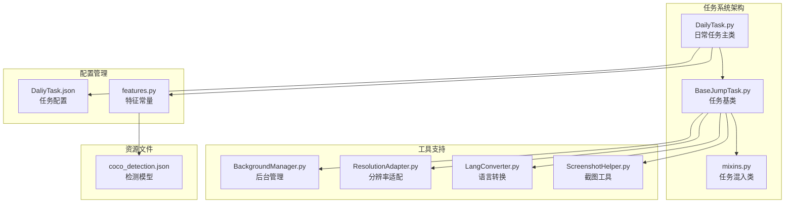
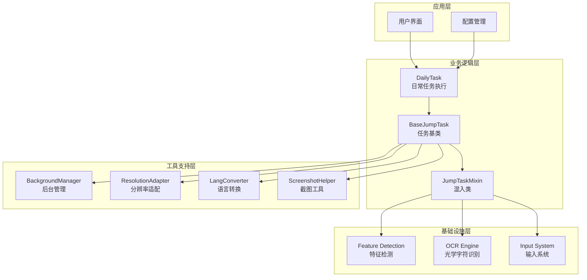
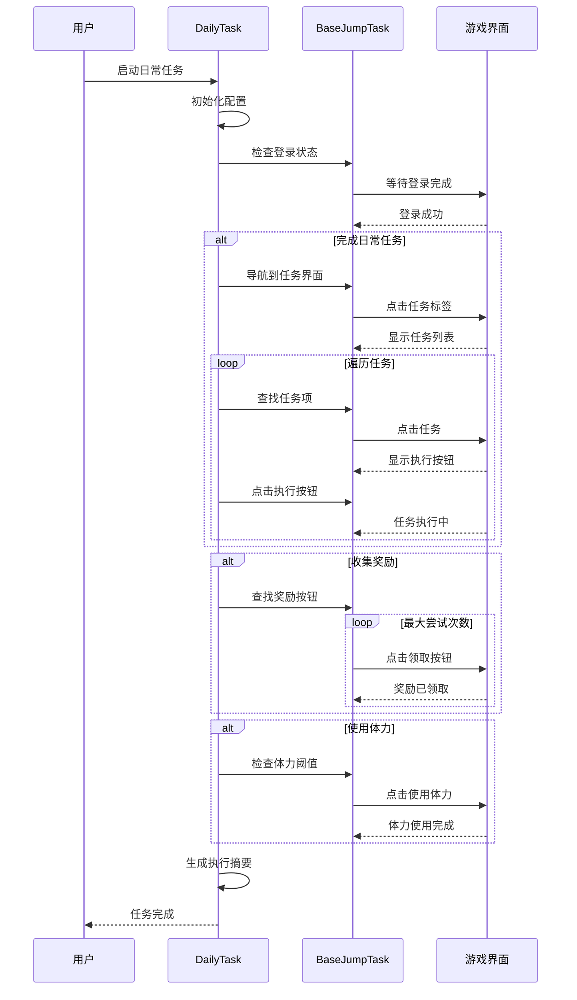
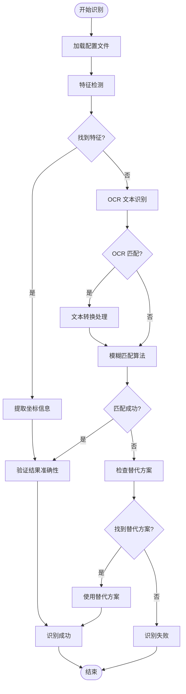
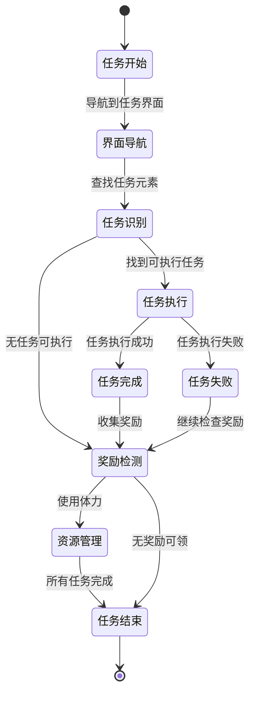
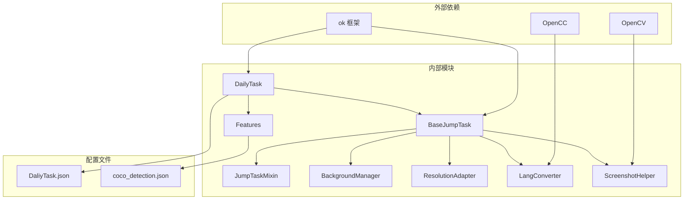

# 日常任务系统

<cite>
**本文档引用的文件**
- [DailyTask.py](file://src/task/DailyTask.py)
- [BaseJumpTask.py](file://src/task/BaseJumpTask.py)
- [mixins.py](file://src/task/mixins.py)
- [features.py](file://src/constants/features.py)
- [DailyTask.json](file://configs/DailyTask.json)
- [BackgroundManager.py](file://src/utils/BackgroundManager.py)
- [ResolutionAdapter.py](file://src/utils/ResolutionAdapter.py)
- [LangConverter.py](file://src/utils/LangConverter.py)
- [ScreenshotHelper.py](file://src/utils/ScreenshotHelper.py)
- [coco_detection.json](file://assets/coco_detection.json)
</cite>

## 目录
1. [简介](#简介)
2. [项目结构](#项目结构)
3. [核心组件](#核心组件)
4. [架构概览](#架构概览)
5. [详细组件分析](#详细组件分析)
6. [依赖关系分析](#依赖关系分析)
7. [性能考虑](#性能考虑)
8. [故障排除指南](#故障排除指南)
9. [结论](#结论)
10. [附录](#附录)

## 简介

ok-jump 项目的日常任务系统是一个自动化游戏任务执行框架，专门设计用于自动完成游戏中的日常任务。该系统基于强大的 OCR 识别技术和智能点击控制，能够自动导航到任务界面、识别任务目标、执行任务并收集奖励。

系统采用模块化设计，通过继承 BaseJumpTask 基类提供了完整的任务生命周期管理，包括登录检测、场景状态识别、分辨率适配、后台模式支持等功能。日常任务系统特别针对游戏界面的动态变化进行了优化，能够处理不同分辨率和语言环境下的界面识别问题。

## 项目结构

日常任务系统在项目中的组织结构如下：

**图表来源**
- [DailyTask.py:1-128](file://src/task/DailyTask.py#L1-L128)
- [BaseJumpTask.py:26-572](file://src/task/BaseJumpTask.py#L26-L572)
- [mixins.py:15-784](file://src/task/mixins.py#L15-L784)

**章节来源**
- [DailyTask.py:1-128](file://src/task/DailyTask.py#L1-L128)
- [BaseJumpTask.py:26-572](file://src/task/BaseJumpTask.py#L26-L572)

## 核心组件

### DailyTask 类设计

DailyTask 是整个日常任务系统的核心类，继承自 BaseJumpTask 基类，提供了完整的日常任务自动化执行能力。

#### 主要特性

1. **模块化配置管理**：支持独立的任务开关控制，包括任务执行、奖励收集和体力使用
2. **智能界面导航**：自动定位并点击任务界面元素
3. **批量任务处理**：支持连续执行多个日常任务
4. **状态监控**：实时跟踪任务执行状态并生成执行摘要

#### 关键配置项

| 配置项 | 类型 | 默认值 | 描述 |
|--------|------|--------|------|
| 完成日常任务 | Boolean | True | 控制是否自动执行日常任务 |
| 收集奖励 | Boolean | True | 控制是否自动收集已完成任务的奖励 |
| 使用体力 | Boolean | True | 控制是否自动使用体力进行任务执行 |
| 体力阈值 | Integer | 50 | 体力使用时的最低阈值 |

**章节来源**
- [DailyTask.py:11-16](file://src/task/DailyTask.py#L11-L16)
- [DailyTask.json:1-6](file://configs/DailyTask.json#L1-L6)

### BaseJumpTask 基类功能

BaseJumpTask 提供了日常任务系统的基础框架和通用功能：

#### 核心功能模块

1. **游戏状态检测**：自动检测登录状态、大厅状态和游戏中状态
2. **分辨率适配**：支持不同分辨率下的坐标缩放和界面元素定位
3. **后台模式支持**：兼容前台和后台模式下的操作执行
4. **OCR 文本处理**：提供智能的 OCR 文本匹配和模糊查找功能

#### 智能点击机制

系统实现了智能点击功能，能够根据当前运行环境自动选择合适的点击方式：

- **前台模式**：使用标准的窗口 API 进行点击
- **后台模式**：使用 SendInput 技术进行后台点击
- **ADB 模式**：支持模拟器环境下的点击操作

**章节来源**
- [BaseJumpTask.py:26-572](file://src/task/BaseJumpTask.py#L26-L572)
- [mixins.py:15-784](file://src/task/mixins.py#L15-L784)

## 架构概览

日常任务系统的整体架构采用分层设计，确保了系统的可扩展性和可维护性：

**图表来源**
- [DailyTask.py:5-40](file://src/task/DailyTask.py#L5-L40)
- [BaseJumpTask.py:26-100](file://src/task/BaseJumpTask.py#L26-L100)
- [mixins.py:15-30](file://src/task/mixins.py#L15-L30)

## 详细组件分析

### 日常任务执行流程

系统采用流水线式的任务执行模式，确保每个步骤都能得到充分的处理时间：

**图表来源**
- [DailyTask.py:18-39](file://src/task/DailyTask.py#L18-L39)
- [DailyTask.py:41-68](file://src/task/DailyTask.py#L41-L68)
- [DailyTask.py:84-103](file://src/task/DailyTask.py#L84-L103)
- [DailyTask.py:105-118](file://src/task/DailyTask.py#L105-L118)

### 任务识别机制

系统采用多层识别机制来确保任务元素的准确识别：

**图表来源**
- [BaseJumpTask.py:306-424](file://src/task/BaseJumpTask.py#L306-L424)
- [mixins.py:58-83](file://src/task/mixins.py#L58-L83)

### 执行策略管理

系统实现了灵活的任务执行策略，支持多种执行模式：

#### 任务优先级管理

| 任务类型 | 优先级 | 执行条件 | 失败处理 |
|----------|--------|----------|----------|
| 日常任务 | 高 | 任务可执行且体力充足 | 跳过当前任务，继续下一个 |
| 收集奖励 | 中 | 存在可领取奖励 | 继续尝试直到无奖励 |
| 使用体力 | 低 | 体力低于阈值 | 记录状态但不影响其他任务 |

#### 执行顺序控制

系统按照以下顺序执行各项任务：

1. **任务导航**：首先确保在正确的界面
2. **任务执行**：按顺序执行所有可执行的任务
3. **奖励收集**：收集所有已完成任务的奖励
4. **资源管理**：根据配置使用体力资源

**章节来源**
- [DailyTask.py:23-39](file://src/task/DailyTask.py#L23-L39)
- [DailyTask.py:41-68](file://src/task/DailyTask.py#L41-L68)

### 完成检测机制

系统实现了多层次的任务完成检测机制：

**图表来源**
- [DailyTask.py:41-118](file://src/task/DailyTask.py#L41-L118)

#### 完成状态判断

系统通过以下方式判断任务完成状态：

1. **界面元素检测**：检查任务执行后的界面变化
2. **计数统计**：统计成功执行的任务数量
3. **时间监控**：监控任务执行的超时情况
4. **错误恢复**：处理执行过程中的临时错误

#### 奖励领取处理

奖励领取采用循环检测机制：

- **最大尝试次数**：最多尝试 20 次领取奖励
- **自动停止**：当没有可领取奖励时自动停止
- **状态同步**：每次领取后重新检查奖励状态

**章节来源**
- [DailyTask.py:84-103](file://src/task/DailyTask.py#L84-L103)
- [DailyTask.py:120-127](file://src/task/DailyTask.py#L120-L127)

### 界面交互机制

系统实现了完整的界面交互功能，支持多种操作模式：

#### 界面元素识别

系统使用特征检测和 OCR 识别相结合的方式：

1. **特征检测**：使用预定义的特征名称进行快速识别
2. **OCR 识别**：对文本元素进行光学字符识别
3. **模糊匹配**：处理 OCR 识别不准确的情况

#### 点击操作优化

系统提供了多种点击操作方式：

- **智能点击**：根据环境自动选择最佳点击方式
- **坐标缩放**：支持不同分辨率下的坐标适配
- **后台点击**：支持游戏在后台时的操作执行

#### 状态同步

系统确保与游戏界面的状态同步：

- **实时检查**：定期检查界面状态变化
- **错误恢复**：自动处理界面异常状态
- **进度跟踪**：记录任务执行的详细进度

**章节来源**
- [mixins.py:186-204](file://src/task/mixins.py#L186-L204)
- [mixins.py:666-727](file://src/task/mixins.py#L666-L727)

## 依赖关系分析

日常任务系统的依赖关系体现了清晰的分层架构：

**图表来源**
- [DailyTask.py:1-2](file://src/task/DailyTask.py#L1-L2)
- [BaseJumpTask.py:4-10](file://src/task/BaseJumpTask.py#L4-L10)
- [mixins.py:7-12](file://src/task/mixins.py#L7-L12)

### 核心依赖关系

1. **框架依赖**：系统依赖 ok 框架提供的基础功能
2. **图像处理**：使用 OpenCV 进行图像处理和特征检测
3. **语言处理**：使用 OpenCC 进行简繁中文转换
4. **配置管理**：通过 JSON 文件管理任务配置

### 循环依赖检查

经过分析，系统不存在循环依赖关系：

- DailyTask 仅依赖 BaseJumpTask
- BaseJumpTask 依赖 JumpTaskMixin 和各种工具类
- 工具类之间相互独立，无直接依赖关系

**章节来源**
- [DailyTask.py:1-2](file://src/task/DailyTask.py#L1-L2)
- [BaseJumpTask.py:4-10](file://src/task/BaseJumpTask.py#L4-L10)

## 性能考虑

### 执行效率优化

系统在设计时充分考虑了性能优化：

#### 并发处理

- **异步操作**：使用异步方式处理耗时的识别操作
- **批量执行**：支持批量处理多个任务元素
- **缓存机制**：缓存常用的配置和状态信息

#### 资源管理

- **内存优化**：及时释放不再使用的图像数据
- **CPU 使用**：合理控制识别频率，避免过度占用 CPU
- **I/O 优化**：优化文件读写操作，减少磁盘访问

### 稳定性保障

#### 错误处理

系统实现了完善的错误处理机制：

- **异常捕获**：捕获并处理各种运行时异常
- **重试机制**：对关键操作提供自动重试功能
- **降级策略**：在异常情况下提供降级执行方案

#### 监控机制

- **执行监控**：实时监控任务执行状态
- **性能指标**：收集和分析系统性能数据
- **日志记录**：详细记录系统运行日志

## 故障排除指南

### 常见问题及解决方案

#### 任务识别失败

**问题描述**：系统无法识别任务元素

**可能原因**：
1. 特征文件配置错误
2. 分辨率适配问题
3. OCR 识别精度不足

**解决方法**：
1. 检查 `coco_detection.json` 中的特征配置
2. 验证分辨率适配设置
3. 调整 OCR 识别阈值

#### 点击操作失败

**问题描述**：系统无法正确点击界面元素

**可能原因**：
1. 坐标计算错误
2. 后台模式配置问题
3. 窗口状态异常

**解决方法**：
1. 检查坐标缩放计算
2. 验证后台模式设置
3. 重启游戏客户端

#### 执行超时

**问题描述**：任务执行超过预期时间

**可能原因**：
1. 网络延迟
2. 系统性能问题
3. 界面加载缓慢

**解决方法**：
1. 增加超时阈值
2. 优化系统性能
3. 检查网络连接

### 调试工具

系统提供了多种调试工具：

#### 日志分析

- **详细日志**：记录完整的执行过程
- **错误日志**：专门记录错误信息
- **性能日志**：记录性能相关数据

#### 截图功能

- **自动截图**：在关键节点自动保存截图
- **特征模板**：保存识别用的特征模板
- **调试分析**：帮助分析识别问题

**章节来源**
- [ScreenshotHelper.py:17-44](file://src/utils/ScreenshotHelper.py#L17-L44)
- [BaseJumpTask.py:182-207](file://src/task/BaseJumpTask.py#L182-L207)

## 结论

ok-jump 项目的日常任务系统是一个设计精良、功能完备的自动化任务执行框架。系统通过模块化设计、智能识别机制和完善的错误处理，为用户提供了稳定可靠的日常任务自动化解决方案。

### 主要优势

1. **模块化设计**：清晰的分层架构便于维护和扩展
2. **智能识别**：结合特征检测和 OCR 识别提高准确性
3. **灵活配置**：支持丰富的配置选项满足不同需求
4. **稳定性强**：完善的错误处理和恢复机制

### 改进建议

1. **性能优化**：进一步优化识别算法提高执行效率
2. **扩展性增强**：增加更多任务类型的自动化支持
3. **用户体验**：改进用户界面和配置管理体验
4. **监控完善**：增强系统监控和诊断能力

## 附录

### 配置文件详解

#### DailyTask.json 配置项

| 配置项 | 类型 | 默认值 | 描述 |
|--------|------|--------|------|
| 完成日常任务 | Boolean | true | 是否自动执行日常任务 |
| 收集奖励 | Boolean | true | 是否自动收集奖励 |
| 使用体力 | Boolean | true | 是否自动使用体力 |
| 体力阈值 | Integer | 50 | 体力使用阈值 |

#### 特征配置

系统使用 `coco_detection.json` 文件管理界面元素特征：

- **特征名称**：唯一标识符，对应游戏界面元素
- **类别信息**：定义特征所属的界面类别
- **边界框**：特征在训练图像中的位置信息

**章节来源**
- [DailyTask.json:1-6](file://configs/DailyTask.json#L1-L6)
- [coco_detection.json:148-358](file://assets/coco_detection.json#L148-L358)