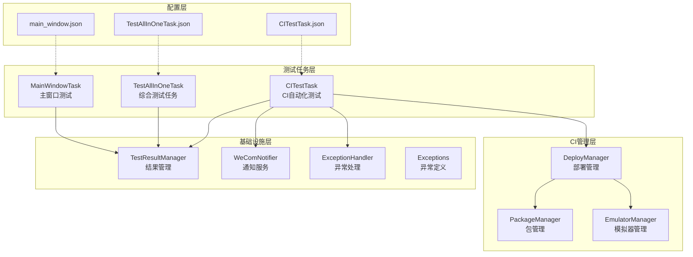
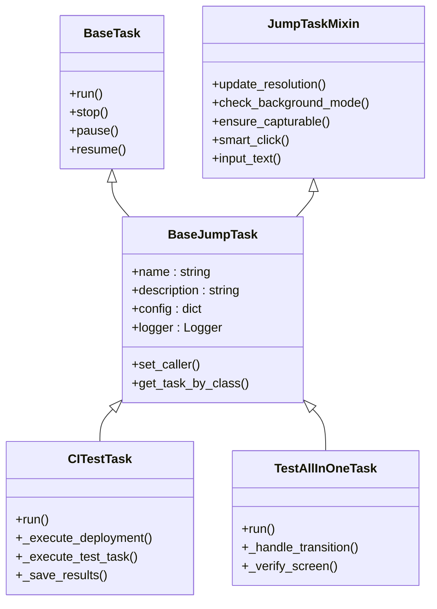
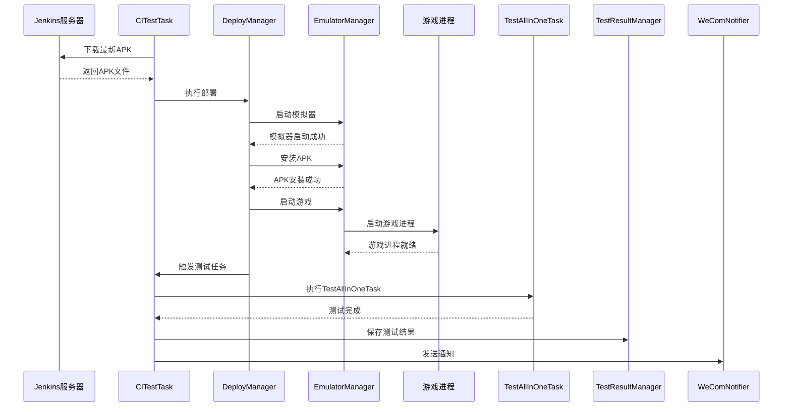
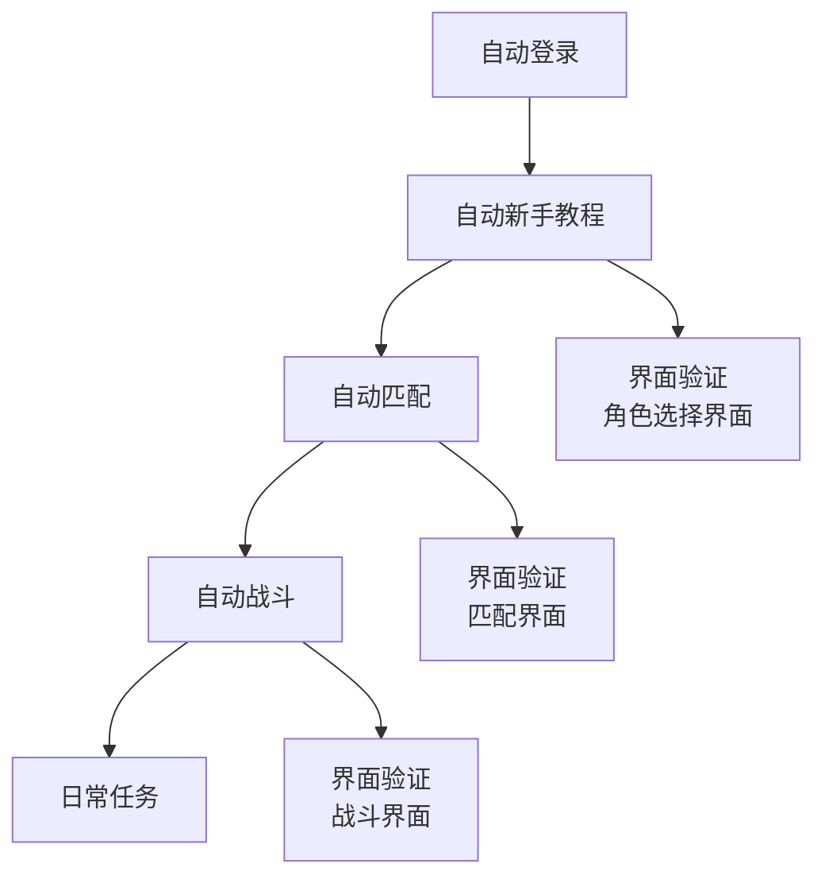
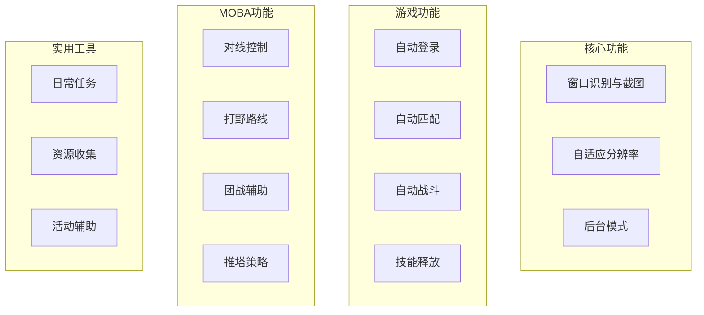
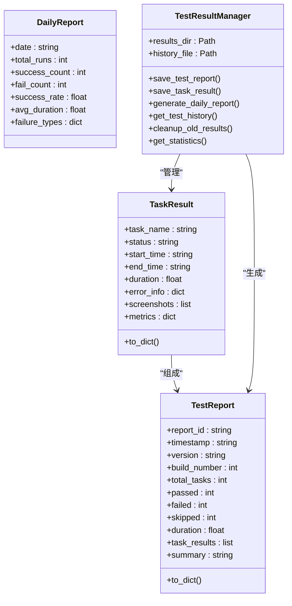
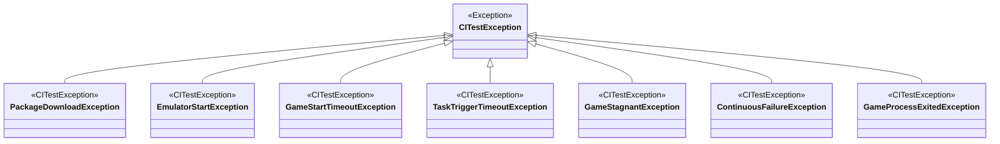

# 测试任务系统

<cite>
**本文档引用的文件**
- [CITestTask.py](file://src/task/CITestTask.py)
- [TestAllInOneTask.py](file://src/task/TestAllInOneTask.py)
- [MainWindowTask.py](file://src/task/MainWindowTask.py)
- [BaseJumpTask.py](file://src/task/BaseJumpTask.py)
- [mixins.py](file://src/task/mixins.py)
- [deploy_manager.py](file://src/ci/deploy_manager.py)
- [package_manager.py](file://src/ci/package_manager.py)
- [emulator_manager.py](file://src/ci/emulator_manager.py)
- [test_result_manager.py](file://src/ci/test_result_manager.py)
- [wecom_notifier.py](file://src/ci/notifier/wecom_notifier.py)
- [exceptions.py](file://src/ci/exceptions.py)
- [exception_handler.py](file://src/ci/exception_handler.py)
- [CITestTask.json](file://configs/CITestTask.json)
- [TestAllInOneTask.json](file://configs/TestAllInOneTask.json)
- [main_window.json](file://configs/main_window.json)
- [test_autologin_task.py](file://tests/test_autologin_task.py)
- [test_ci_modules.py](file://tests/test_ci_modules.py)
- [test_tutorial.py](file://tests/test_tutorial.py)
</cite>

## 目录
1. [项目概述](#项目概述)
2. [系统架构](#系统架构)
3. [核心组件分析](#核心组件分析)
4. [CI自动化测试任务](#ci自动化测试任务)
5. [综合测试任务](#综合测试任务)
6. [主窗口测试任务](#主窗口测试任务)
7. [测试配置与执行](#测试配置与执行)
8. [测试结果管理](#测试结果管理)
9. [异常处理机制](#异常处理机制)
10. [测试最佳实践](#测试最佳实践)
11. [故障排除指南](#故障排除指南)
12. [总结](#总结)

## 项目概述

ok-jump项目的测试任务系统是一个完整的自动化测试解决方案，专为游戏自动化测试而设计。该系统提供了多层次的测试能力，从简单的界面验证到复杂的端到端测试流程。

### 系统特点

- **模块化设计**：采用任务驱动架构，每个测试任务都是独立的模块
- **CI集成**：完整的持续集成测试流水线，支持自动化部署和测试
- **多层验证**：从界面元素验证到业务逻辑测试的全方位覆盖
- **智能异常处理**：具备错误检测、恢复和报告功能
- **可视化反馈**：提供详细的测试结果和截图反馈

## 系统架构



**图表来源**
- [CITestTask.py:26-145](file://src/task/CITestTask.py#L26-L145)
- [deploy_manager.py:38-55](file://src/ci/deploy_manager.py#L38-L55)
- [test_result_manager.py:73-82](file://src/ci/test_result_manager.py#L73-L82)

## 核心组件分析

### 任务基类架构

所有测试任务都继承自`BaseJumpTask`基类，该基类提供了统一的任务接口和通用功能：



**图表来源**
- [BaseJumpTask.py:26-50](file://src/task/BaseJumpTask.py#L26-L50)
- [mixins.py:15-28](file://src/task/mixins.py#L15-L28)

**章节来源**
- [BaseJumpTask.py:26-572](file://src/task/BaseJumpTask.py#L26-L572)
- [mixins.py:15-784](file://src/task/mixins.py#L15-L784)

## CI自动化测试任务

### CITestTask核心功能

CITestTask是整个测试系统的核心，负责完整的CI自动化测试流程：

#### 主要特性

- **自动化部署**：从Jenkins下载最新APK并部署到模拟器
- **智能测试触发**：等待游戏进程启动后自动触发测试任务
- **结果收集**：收集所有测试结果并生成详细报告
- **通知机制**：通过企业微信发送测试结果通知
- **错误恢复**：支持失败重试和异常处理

#### 流程图



**图表来源**
- [CITestTask.py:146-273](file://src/task/CITestTask.py#L146-L273)
- [deploy_manager.py:123-246](file://src/ci/deploy_manager.py#L123-L246)

**章节来源**
- [CITestTask.py:26-1036](file://src/task/CITestTask.py#L26-L1036)

### 配置管理

CITestTask支持丰富的配置选项：

| 配置项 | 类型 | 默认值 | 描述 |
|--------|------|--------|------|
| Jenkins服务器地址 | string | http://192.168.9.154:8080 | Jenkins服务器地址 |
| 模拟器路径 | string | C:\LDPlayer\LDPlayer9\dnplayer.exe | 雷电模拟器可执行文件路径 |
| APK下载目录 | string | packages | APK文件下载目录 |
| 游戏包名 | string | com.lmd.xproject.dev | 游戏应用包名 |
| ADB端口 | int | 5555 | ADB连接端口号 |
| 模拟器实例索引 | int | 0 | 模拟器实例编号 |
| 企业微信Webhook | string | 空 | 企业微信机器人Webhook地址 |
| 任务触发延迟(秒) | int | 60 | 游戏启动后等待触发测试的秒数 |

**章节来源**
- [CITestTask.py:50-123](file://src/task/CITestTask.py#L50-L123)
- [CITestTask.json:1-29](file://configs/CITestTask.json#L1-L29)

## 综合测试任务

### TestAllInOneTask功能

TestAllInOneTask是一个综合性的测试任务，能够串行执行多个子任务：

#### 支持的测试任务

| 任务名称 | 功能描述 | 启用状态 |
|----------|----------|----------|
| 自动登录 | 验证用户登录流程 | 可配置 |
| 自动新手教程 | 完成游戏新手引导 | 可配置 |
| 自动匹配 | 执行游戏匹配流程 | 可配置 |
| 自动战斗 | 进行战斗AI测试 | 可配置 |
| 日常任务 | 执行日常任务流程 | 可配置 |

#### 任务过渡机制



**图表来源**
- [TestAllInOneTask.py:14-23](file://src/task/TestAllInOneTask.py#L14-L23)

**章节来源**
- [TestAllInOneTask.py:11-223](file://src/task/TestAllInOneTask.py#L11-L223)
- [TestAllInOneTask.json:1-8](file://configs/TestAllInOneTask.json#L1-L8)

### 界面验证机制

TestAllInOneTask内置了智能界面验证功能：

#### 验证策略

1. **模板匹配验证**：使用预定义的模板进行界面识别
2. **OCR文本验证**：通过光学字符识别验证界面元素
3. **超时控制**：防止无限等待，确保测试稳定性

#### 支持的验证场景

| 验证场景 | 验证方法 | 超时时间 |
|----------|----------|----------|
| 角色选择界面 | 模板匹配 + OCR | 10秒 |
| 匹配界面 | OCR文本匹配 | 30秒 |
| 战斗界面 | 模板匹配 | 60秒 |

**章节来源**
- [TestAllInOneTask.py:173-223](file://src/task/TestAllInOneTask.py#L173-L223)

## 主窗口测试任务

### MainWindowTask功能

MainWindowTask专门用于测试主窗口的功能和状态：

#### 功能分类



**图表来源**
- [MainWindowTask.py:7-47](file://src/task/MainWindowTask.py#L7-L47)

#### 测试功能

| 功能类别 | 测试项目 | 状态 |
|----------|----------|------|
| 核心功能 | 窗口识别、截图功能、分辨率适配、后台模式 | 已完成 |
| 游戏功能 | 自动登录、自动匹配、自动战斗、技能释放 | 计划中 |
| MOBA功能 | 对线控制、打野路线、团战辅助、推塔策略 | 计划中 |
| 实用工具 | 日常任务、资源收集、活动辅助 | 计划中 |

**章节来源**
- [MainWindowTask.py:5-215](file://src/task/MainWindowTask.py#L5-L215)
- [main_window.json:1-3](file://configs/main_window.json#L1-L3)

### 窗口状态检测

MainWindowTask提供了全面的窗口状态检测能力：

#### 检测项目

1. **游戏窗口检测**：验证游戏窗口是否正确识别
2. **截图功能测试**：验证截图功能的正常工作
3. **分辨率检查**：验证游戏分辨率设置
4. **后台模式验证**：检查后台运行支持

#### 状态监控

| 监控项目 | 检测方法 | 阈值 |
|----------|----------|------|
| 窗口标题 | 文本匹配 | 包含"漫画群星"或"Jump" |
| 分辨率比例 | 数学计算 | 16:9 |
| 后台模式 | 系统API | 窗口状态检测 |
| 伪最小化 | 窗口位置 | 屏幕外检测 |

**章节来源**
- [MainWindowTask.py:121-196](file://src/task/MainWindowTask.py#L121-L196)

## 测试配置与执行

### 配置文件结构

系统使用JSON配置文件来管理测试参数：

#### CITestTask配置文件

```json
{
    "Jenkins服务器地址": "http://192.168.9.154:8080",
    "模拟器路径": "E:\\leidian\\LDPlayer9\\dnplayer.exe",
    "APK下载目录": "E:\\packages",
    "游戏包名": "com.lmd.xproject.dev",
    "ADB端口": 5554,
    "模拟器实例索引": 0,
    "企业微信Webhook": "https://qyapi.weixin.qq.com/cgi-bin/webhook/send?key=...",
    "任务触发延迟(秒)": 30,
    "连续失败阈值": 10,
    "启用定时执行": true,
    "定时执行时间(时)": 1,
    "定时执行时间(分)": 5,
    "定时执行日期": "每天",
    "模拟器启动超时(秒)": 60,
    "游戏启动超时(秒)": 60,
    "任务触发超时(秒)": 120,
    "最大查找构建数": 20,
    "下载超时(秒)": 300,
    "保留旧包数量": 3,
    "账号递增启用": true,
    "账号递增模式": "从AutoLoginTask读取",
    "账号模板": "qwer878787{N}",
    "账号当前序号": 1,
    "失败自动重试": true,
    "重试次数": 2,
    "重试间隔(秒)": 60
}
```

#### TestAllInOneTask配置文件

```json
{
    "执行自动登录": true,
    "执行自动新手教程": true,
    "执行自动匹配": false,
    "执行自动战斗": false,
    "执行日常任务": false,
    "任务间等待时间(秒)": 2.0
}
```

### 执行方式

#### 手动执行

```python
# 导入任务模块
from src.task.CITestTask import CITestTask
from src.task.TestAllInOneTask import TestAllInOneTask

# 创建并执行CI测试任务
ci_task = CITestTask()
ci_task.run()

# 创建并执行综合测试任务
test_task = TestAllInOneTask()
test_task.run()
```

#### 配置驱动执行

通过修改配置文件来控制测试行为：

```python
# 读取配置文件
import json
with open('configs/CITestTask.json', 'r', encoding='utf-8') as f:
    config = json.load(f)

# 根据配置执行测试
if config['启用定时执行']:
    # 定时执行逻辑
    pass
```

**章节来源**
- [CITestTask.json:1-29](file://configs/CITestTask.json#L1-L29)
- [TestAllInOneTask.json:1-8](file://configs/TestAllInOneTask.json#L1-L8)

## 测试结果管理

### TestResultManager架构

TestResultManager负责测试结果的存储、查询和报告生成：

#### 数据结构



**图表来源**
- [test_result_manager.py:22-58](file://src/ci/test_result_manager.py#L22-L58)
- [test_result_manager.py:73-82](file://src/ci/test_result_manager.py#L73-L82)

#### 存储结构

测试结果按照日期和时间组织：

```
test_results/
├── 2024-01-15/
│   ├── 14-30-00/
│   │   └── report.json
│   ├── 15-45-30/
│   │   └── report.json
│   └── daily_reports/
│       └── 2024-01-15.json
└── history.json
```

**章节来源**
- [test_result_manager.py:102-130](file://src/ci/test_result_manager.py#L102-L130)
- [test_result_manager.py:155-214](file://src/ci/test_result_manager.py#L155-L214)

### 报告生成

系统支持多种类型的测试报告：

#### 测试报告格式

```json
{
    "report_id": "ci_20240115_143000",
    "timestamp": "2024-01-15T14:30:00",
    "version": "1.4.10",
    "build_number": 1234,
    "total_tasks": 5,
    "passed": 4,
    "failed": 1,
    "skipped": 0,
    "duration": 180.5,
    "task_results": [
        {
            "task_name": "TestAllInOneTask",
            "status": "success",
            "start_time": "2024-01-15T14:30:00",
            "end_time": "2024-01-15T14:32:30",
            "duration": 150.0,
            "error_info": null,
            "screenshots": [],
            "metrics": {}
        }
    ],
    "summary": "部署成功, 测试通过"
}
```

**章节来源**
- [test_result_manager.py:40-58](file://src/ci/test_result_manager.py#L40-L58)
- [test_result_manager.py:474-504](file://src/ci/test_result_manager.py#L474-L504)

## 异常处理机制

### 异常体系结构

系统建立了完整的异常处理体系：



**图表来源**
- [exceptions.py:8-45](file://src/ci/exceptions.py#L8-L45)

### 智能异常处理

#### SmartTaskExecutor功能

SmartTaskExecutor提供了智能的异常处理能力：

1. **非致命错误继续执行**：过滤无害错误，不影响整体测试流程
2. **连续失败检测**：监控连续失败次数，超过阈值时终止测试
3. **游戏画面停滞检测**：检测游戏卡死状态
4. **错误恢复机制**：提供多种错误恢复策略

#### 异常恢复策略

| 异常类型 | 恢复策略 | 处理方式 |
|----------|----------|----------|
| OCR negative box | 过滤错误 | 不计入失败次数 |
| 网络超时 | 重试操作 | 自动重试 |
| 模拟器无响应 | 重启模拟器 | 自动重启 |
| 游戏卡死 | 终止测试 | 立即停止 |

**章节来源**
- [exception_handler.py:165-329](file://src/ci/exception_handler.py#L165-L329)
- [exceptions.py:1-46](file://src/ci/exceptions.py#L1-L46)

## 测试最佳实践

### 测试设计原则

1. **模块化设计**：每个测试任务独立，便于维护和扩展
2. **配置驱动**：通过配置文件控制测试行为，提高灵活性
3. **错误隔离**：单个任务失败不影响其他任务执行
4. **结果可视化**：提供详细的测试报告和截图反馈

### 性能优化建议

1. **并行执行**：在可能的情况下并行执行独立的测试任务
2. **资源复用**：合理利用模拟器和设备资源
3. **缓存机制**：缓存常用的配置和资源
4. **超时控制**：设置合理的超时时间，避免无限等待

### 调试技巧

1. **日志分析**：充分利用详细的日志信息进行问题定位
2. **截图对比**：通过截图对比分析界面状态变化
3. **配置验证**：定期验证配置文件的有效性
4. **环境隔离**：确保测试环境的独立性和一致性

## 故障排除指南

### 常见问题及解决方案

#### CI测试任务失败

**问题**：CITestTask执行失败
**可能原因**：
- Jenkins服务器连接失败
- 模拟器启动超时
- APK下载失败
- 游戏进程启动失败

**解决步骤**：
1. 检查Jenkins服务器连接状态
2. 验证模拟器路径和配置
3. 确认APK文件完整性
4. 检查游戏包名配置

#### 界面识别失败

**问题**：TestAllInOneTask界面验证失败
**可能原因**：
- 分辨率不匹配
- 界面元素变化
- OCR识别不稳定
- 模板过期

**解决步骤**：
1. 检查分辨率设置
2. 更新界面模板
3. 调整OCR参数
4. 增加等待时间

#### 通知发送失败

**问题**：企业微信通知发送失败
**可能原因**：
- Webhook地址错误
- 网络连接问题
- 请求频率过高

**解决步骤**：
1. 验证Webhook配置
2. 检查网络连接
3. 降低请求频率
4. 增加重试机制

**章节来源**
- [CITestTask.py:538-587](file://src/task/CITestTask.py#L538-L587)
- [wecom_notifier.py:227-265](file://src/ci/notifier/wecom_notifier.py#L227-L265)

## 总结

ok-jump项目的测试任务系统是一个功能完善、架构清晰的自动化测试解决方案。系统的主要优势包括：

### 核心优势

1. **完整的CI集成**：从代码构建到测试执行的全自动化流程
2. **灵活的配置管理**：通过JSON配置文件控制测试行为
3. **强大的异常处理**：智能的错误检测和恢复机制
4. **丰富的测试覆盖**：从界面验证到业务逻辑测试的全方位覆盖
5. **可视化反馈**：详细的测试报告和截图反馈

### 技术特色

1. **模块化设计**：每个测试任务都是独立的模块，便于维护和扩展
2. **智能异常处理**：具备错误检测、恢复和报告功能
3. **多层验证机制**：结合模板匹配和OCR技术进行界面验证
4. **可视化结果**：提供详细的测试报告和截图反馈
5. **配置驱动执行**：通过配置文件控制测试行为

### 未来发展方向

1. **增强AI测试能力**：引入机器学习技术提升测试智能化水平
2. **扩展测试场景**：增加更多游戏场景和测试用例
3. **性能监控集成**：添加性能基准测试和监控功能
4. **云端测试支持**：支持云端模拟器和分布式测试执行
5. **测试报告优化**：提供更丰富的测试数据分析和可视化

该测试任务系统为ok-jump项目提供了坚实的测试基础，确保了代码质量和系统稳定性，是项目持续发展的重要保障。