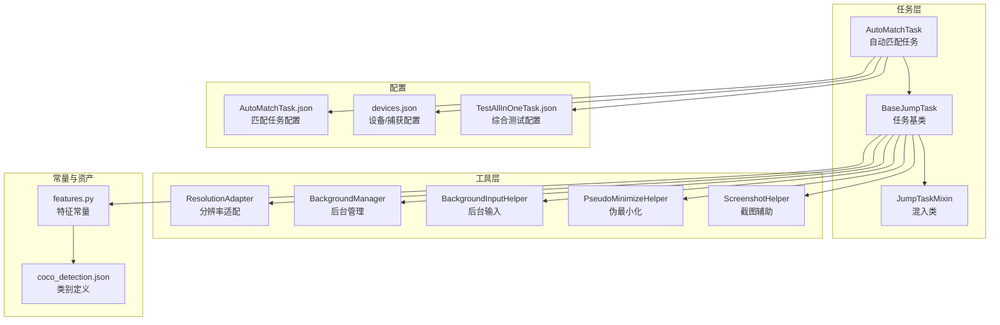
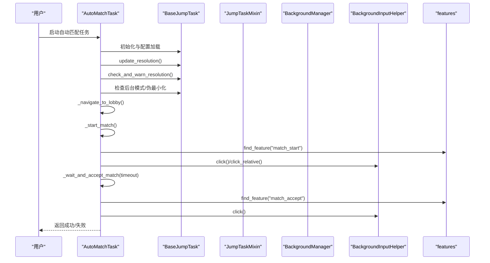
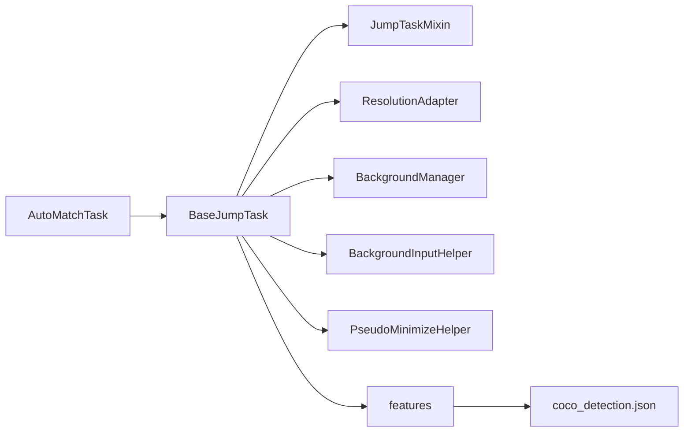

# 自动匹配任务

<cite>
**本文档引用的文件**
- [AutoMatchTask.py](file://src/task/AutoMatchTask.py)
- [BaseJumpTask.py](file://src/task/BaseJumpTask.py)
- [mixins.py](file://src/task/mixins.py)
- [features.py](file://src/constants/features.py)
- [BackgroundManager.py](file://src/utils/BackgroundManager.py)
- [BackgroundInputHelper.py](file://src/utils/BackgroundInputHelper.py)
- [PseudoMinimizeHelper.py](file://src/utils/PseudoMinimizeHelper.py)
- [ResolutionAdapter.py](file://src/utils/ResolutionAdapter.py)
- [ScreenshotHelper.py](file://src/utils/ScreenshotHelper.py)
- [AutoMatchTask.json](file://configs/AutoMatchTask.json)
- [coco_detection.json](file://assets/coco_detection.json)
- [devices.json](file://configs/devices.json)
- [TestAllInOneTask.json](file://configs/TestAllInOneTask.json)
</cite>

## 更新摘要
**变更内容**
- 更新了AutoMatchTask配置参数说明，移除了已删除的'启用'配置项
- 新增了配置参数与策略设置章节的完整更新
- 更新了故障排除指南中的配置相关问题
- 完善了启动流程与运行监控部分

## 目录
1. [简介](#简介)
2. [项目结构](#项目结构)
3. [核心组件](#核心组件)
4. [架构总览](#架构总览)
5. [详细组件分析](#详细组件分析)
6. [依赖关系分析](#依赖关系分析)
7. [性能考量](#性能考量)
8. [故障排除指南](#故障排除指南)
9. [结论](#结论)
10. [附录](#附录)

## 简介
本文件面向OK-Jump中的"自动匹配任务"，系统性阐述AutoMatchTask的实现原理与匹配机制，覆盖队伍匹配、房间创建、开始游戏等核心流程；重点解析匹配状态检测、房间界面处理、开始按钮识别等关键技术；并给出配置参数、匹配策略设置、队伍管理等配置项说明，以及启动流程、运行监控、异常处理与性能优化建议，最后提供典型场景与故障排除示例。

## 项目结构
OK-Jump采用分层与模块化组织，自动匹配任务位于任务层，底层能力由工具层与常量层提供支撑：
- 任务层：AutoMatchTask继承自BaseJumpTask，复用通用任务能力（状态检测、分辨率适配、后台输入、伪最小化等）
- 工具层：分辨率适配、后台管理、后台输入、伪最小化、截图辅助
- 常量层：统一的特征名称常量，与资产中的coco_detection.json类别一一对应
- 配置层：AutoMatchTask.json提供任务配置，devices.json提供设备/捕获方式配置

**图表来源**
- [AutoMatchTask.py:1-99](file://src/task/AutoMatchTask.py#L1-L99)
- [BaseJumpTask.py:14-422](file://src/task/BaseJumpTask.py#L14-L422)
- [mixins.py:15-774](file://src/task/mixins.py#L15-L774)
- [features.py:9-86](file://src/constants/features.py#L9-L86)
- [coco_detection.json:88-244](file://assets/coco_detection.json#L88-L244)
- [AutoMatchTask.json:1-5](file://configs/AutoMatchTask.json#L1-L5)
- [devices.json:1-7](file://configs/devices.json#L1-L7)
- [TestAllInOneTask.json:1-8](file://configs/TestAllInOneTask.json#L1-L8)

**章节来源**
- [AutoMatchTask.py:1-99](file://src/task/AutoMatchTask.py#L1-L99)
- [BaseJumpTask.py:14-422](file://src/task/BaseJumpTask.py#L14-L422)
- [mixins.py:15-774](file://src/task/mixins.py#L15-L774)
- [features.py:9-86](file://src/constants/features.py#L9-L86)
- [coco_detection.json:88-244](file://assets/coco_detection.json#L88-L244)
- [AutoMatchTask.json:1-5](file://configs/AutoMatchTask.json#L1-L5)
- [devices.json:1-7](file://configs/devices.json#L1-L7)
- [TestAllInOneTask.json:1-8](file://configs/TestAllInOneTask.json#L1-L8)

## 核心组件
- AutoMatchTask：自动匹配任务主体，负责导航至大厅、发起匹配、等待并接受匹配、超时处理
- BaseJumpTask：任务基类，提供通用能力（状态检测、分辨率适配、后台模式、伪最小化、智能点击等）
- JumpTaskMixin：混入类，封装分辨率适配、后台模式、后台输入、伪最小化、智能点击等通用逻辑
- features：统一的特征名称常量，与coco_detection.json中的类别名称一致
- 后台管理与输入：BackgroundManager、BackgroundInputHelper、PseudoMinimizeHelper
- 分辨率适配：ResolutionAdapter
- 截图辅助：ScreenshotHelper

**章节来源**
- [AutoMatchTask.py:5-18](file://src/task/AutoMatchTask.py#L5-L18)
- [BaseJumpTask.py:14-422](file://src/task/BaseJumpTask.py#L14-L422)
- [mixins.py:15-774](file://src/task/mixins.py#L15-L774)
- [features.py:9-86](file://src/constants/features.py#L9-L86)

## 架构总览
自动匹配任务的运行流程如下：
- 初始化与配置加载：读取AutoMatchTask.json配置，设置默认参数
- 环境准备：更新分辨率、校验分辨率比例、检查后台模式
- 导航至大厅：循环检测是否在大厅，若不在则尝试回到大厅
- 发起匹配：优先通过特征匹配定位"开始匹配"按钮，否则使用相对坐标点击
- 等待并接受匹配：循环检测"接受匹配"按钮，超时则报错
- 完成：记录日志并返回成功

**图表来源**
- [AutoMatchTask.py:20-99](file://src/task/AutoMatchTask.py#L20-L99)
- [BaseJumpTask.py:14-422](file://src/task/BaseJumpTask.py#L14-L422)
- [mixins.py:15-774](file://src/task/mixins.py#L15-L774)
- [BackgroundManager.py:18-92](file://src/utils/BackgroundManager.py#L18-L92)
- [BackgroundInputHelper.py:310-708](file://src/utils/BackgroundInputHelper.py#L310-L708)
- [features.py:9-86](file://src/constants/features.py#L9-L86)

## 详细组件分析

### AutoMatchTask：自动匹配任务
- 默认配置：游戏模式、自动接受匹配、最大等待时间
- 关键流程：
  - 导航至大厅：循环检测大厅状态，最多尝试若干次
  - 发起匹配：优先特征匹配"开始匹配"按钮，否则使用相对坐标点击
  - 等待并接受匹配：循环检测"接受匹配"按钮，超时返回失败
- 状态与日志：全程记录关键步骤与结果，便于监控与排障

**更新** AutoMatchTask配置已简化，移除了'启用'配置项，专注于核心匹配功能

**章节来源**
- [AutoMatchTask.py:10-18](file://src/task/AutoMatchTask.py#L10-L18)
- [AutoMatchTask.py:20-99](file://src/task/AutoMatchTask.py#L20-L99)

### BaseJumpTask：任务基类
- 通用能力：
  - 状态检测：in_lobby、in_game、in_main、in_login_screen、in_main_menu
  - 登录等待：wait_login、_handle_login_buttons
  - OCR与文本匹配：find_boxes、_convert_match_for_lang
  - 等待条件：wait_until、ensure_main
  - 伪最小化：pseudo_minimize、pseudo_restore、toggle_pseudo_minimize、is_pseudo_minimized、ensure_visible_for_capture
- 智能点击：click、click_relative、smart_click、smart_click_relative、background_click、background_click_relative、background_drag

**章节来源**
- [BaseJumpTask.py:14-422](file://src/task/BaseJumpTask.py#L14-L422)

### JumpTaskMixin：混入类
- 分辨率适配：update_resolution、check_and_warn_resolution、scale_point、scale_box、get_resolution_info
- 后台模式：check_background_mode、get_background_status、ensure_capturable
- 后台输入：background_click、background_click_relative、background_drag、send_key、send_key_down、send_key_up、swipe、input_text、input_text_with_clear
- 智能点击：smart_click、smart_click_relative

**章节来源**
- [mixins.py:15-774](file://src/task/mixins.py#L15-L774)

### 特征系统：features与coco_detection.json
- features.py提供统一的特征名称常量，如大厅指示器、游戏中指示器、开始匹配、接受匹配等
- coco_detection.json定义了UI元素类别，AutoMatchTask通过特征名称进行模板匹配与点击

**章节来源**
- [features.py:9-86](file://src/constants/features.py#L9-L86)
- [coco_detection.json:88-244](file://assets/coco_detection.json#L88-L244)

### 后台管理与输入
- BackgroundManager：检测后台模式、窗口前后台状态、静音策略、伪最小化开关
- BackgroundInputHelper：SendInput实现后台鼠标键盘输入，支持前台/后台两种模式
- PseudoMinimizeHelper：将窗口移至屏幕外仍保持活动状态，支持截图与输入

**章节来源**
- [BackgroundManager.py:18-155](file://src/utils/BackgroundManager.py#L18-L155)
- [BackgroundInputHelper.py:99-800](file://src/utils/BackgroundInputHelper.py#L99-L800)
- [PseudoMinimizeHelper.py:13-238](file://src/utils/PseudoMinimizeHelper.py#L13-L238)

### 分辨率适配
- ResolutionAdapter：根据参考分辨率与当前分辨率计算缩放因子，提供坐标缩放、相对坐标转换、比例校验与推荐重设尺寸

**章节来源**
- [ResolutionAdapter.py:4-163](file://src/utils/ResolutionAdapter.py#L4-L163)

### 截图辅助
- ScreenshotHelper：保存截图与特征模板，生成COCO标注条目

**章节来源**
- [ScreenshotHelper.py:7-68](file://src/utils/ScreenshotHelper.py#L7-L68)

## 依赖关系分析
AutoMatchTask与各模块的依赖关系如下：
- AutoMatchTask依赖BaseJumpTask提供的状态检测与通用能力
- BaseJumpTask通过JumpTaskMixin复用分辨率适配、后台输入、伪最小化等逻辑
- 特征匹配依赖features与coco_detection.json中的类别定义
- 后台输入依赖BackgroundManager与BackgroundInputHelper
- 分辨率适配依赖ResolutionAdapter

**图表来源**
- [AutoMatchTask.py:1-99](file://src/task/AutoMatchTask.py#L1-L99)
- [BaseJumpTask.py:14-422](file://src/task/BaseJumpTask.py#L14-L422)
- [mixins.py:15-774](file://src/task/mixins.py#L15-L774)
- [features.py:9-86](file://src/constants/features.py#L9-L86)
- [coco_detection.json:88-244](file://assets/coco_detection.json#L88-L244)

**章节来源**
- [AutoMatchTask.py:1-99](file://src/task/AutoMatchTask.py#L1-L99)
- [BaseJumpTask.py:14-422](file://src/task/BaseJumpTask.py#L14-L422)
- [mixins.py:15-774](file://src/task/mixins.py#L15-L774)
- [features.py:9-86](file://src/constants/features.py#L9-L86)
- [coco_detection.json:88-244](file://assets/coco_detection.json#L88-L244)

## 性能考量
- 点击与等待策略：AutoMatchTask在等待阶段采用固定休眠间隔，建议结合实际网络延迟动态调整超时时间
- 分辨率适配：在高分辨率下缩放计算开销较小，但需确保模板匹配阈值与缩放后坐标一致性
- 后台输入：SendInput在后台模式下避免窗口切换带来的抖动，提高稳定性
- OCR与特征匹配：优先使用特征匹配减少OCR成本；OCR匹配时注意语言转换与边界限制
- 设备/捕获方式：devices.json中capture为adb时，任务将走ADB路径，注意ADB输入法与键盘映射差异

**章节来源**
- [AutoMatchTask.py:78-99](file://src/task/AutoMatchTask.py#L78-L99)
- [mixins.py:104-202](file://src/task/mixins.py#L104-L202)
- [BackgroundInputHelper.py:310-708](file://src/utils/BackgroundInputHelper.py#L310-L708)
- [devices.json:1-7](file://configs/devices.json#L1-L7)

## 故障排除指南
- 无法进入大厅
  - 现象：导航至大厅失败
  - 排查：确认in_lobby检测逻辑与coco_detection.json中的大厅指示器类别一致；检查分辨率适配是否生效
  - 参考
    - [AutoMatchTask.py:51-62](file://src/task/AutoMatchTask.py#L51-L62)
    - [features.py:64-68](file://src/constants/features.py#L64-L68)
- 开始匹配按钮未识别
  - 现象：特征匹配不到"开始匹配"按钮
  - 排查：确认coco_detection.json中存在对应类别；检查模板质量与阈值；必要时使用相对坐标点击
  - 参考
    - [AutoMatchTask.py:64-76](file://src/task/AutoMatchTask.py#L64-L76)
    - [coco_detection.json:209-213](file://assets/coco_detection.json#L209-L213)
- 匹配接受超时
  - 现象：超过最大等待时间仍未检测到"接受匹配"
  - 排查：增大最大等待时间；确认网络环境；检查Accept按钮特征是否存在
  - 参考
    - [AutoMatchTask.py:78-99](file://src/task/AutoMatchTask.py#L78-L99)
    - [coco_detection.json:209-213](file://assets/coco_detection.json#L209-L213)
- 后台模式不稳定
  - 现象：后台截图或输入失败
  - 排查：检查BackgroundManager配置；确认窗口是否被遮挡；必要时启用伪最小化
  - 参考
    - [BackgroundManager.py:18-92](file://src/utils/BackgroundManager.py#L18-L92)
    - [PseudoMinimizeHelper.py:123-163](file://src/utils/PseudoMinimizeHelper.py#L123-L163)
- 分辨率不匹配导致识别不准
  - 现象：特征匹配误检或漏检
  - 排查：使用check_and_warn_resolution检查比例；按建议调整分辨率
  - 参考
    - [mixins.py:123-146](file://src/task/mixins.py#L123-L146)
    - [ResolutionAdapter.py:98-143](file://src/utils/ResolutionAdapter.py#L98-L143)
- 配置参数问题
  - 现象：配置文件格式错误或参数缺失
  - 排查：确认AutoMatchTask.json包含游戏模式、自动接受匹配、最大等待时间参数；检查JSON格式正确性
  - 参考
    - [AutoMatchTask.json:1-5](file://configs/AutoMatchTask.json#L1-L5)

## 结论
AutoMatchTask通过特征匹配与相对坐标点击实现稳定的匹配流程，结合BaseJumpTask与JumpTaskMixin提供的分辨率适配、后台输入与伪最小化能力，能够在复杂环境下可靠运行。配置已简化为三个核心参数，移除了不必要的'启用'开关，使匹配功能更加专注和简洁。合理配置AutoMatchTask.json与devices.json，并遵循性能与故障排除建议，可显著提升匹配成功率与稳定性。

## 附录

### 配置参数与策略设置
**更新** AutoMatchTask配置已移除'启用'配置项，现仅包含三个核心参数：

- AutoMatchTask.json
  - 游戏模式：如排位赛等，默认"排位赛"
  - 自动接受匹配：是否自动接受匹配，默认true
  - 最大等待时间(秒)：匹配接受的最大等待时间，默认300秒
  - 参考
    - [AutoMatchTask.json:1-5](file://configs/AutoMatchTask.json#L1-L5)

- devices.json
  - preferred：首选设备
  - pc_full_path：PC可执行文件路径
  - capture：捕获方式（如adb）
  - 参考
    - [devices.json:1-7](file://configs/devices.json#L1-L7)

- TestAllInOneTask.json（综合测试配置）
  - 执行自动匹配：控制是否执行自动匹配任务
  - 参考
    - [TestAllInOneTask.json:1-8](file://configs/TestAllInOneTask.json#L1-L8)

### 关键技术要点
- 匹配状态检测：通过features中的大厅/游戏中/加载中等指示器进行状态判断
  - 参考
    - [features.py:64-72](file://src/constants/features.py#L64-L72)
- 房间界面处理：AutoMatchTask未直接处理房间界面，主要关注大厅与匹配接受
- 开始按钮识别：优先特征匹配"开始匹配"，否则使用相对坐标
  - 参考
    - [AutoMatchTask.py:64-76](file://src/task/AutoMatchTask.py#L64-L76)
- 匹配接受：循环检测"接受匹配"按钮并点击
  - 参考
    - [AutoMatchTask.py:78-99](file://src/task/AutoMatchTask.py#L78-L99)

### 启动流程与运行监控
- 启动流程
  - 读取配置 → 更新分辨率 → 校验分辨率 → 检查后台模式 → 导航至大厅 → 发起匹配 → 等待并接受 → 完成
  - 参考
    - [AutoMatchTask.py:20-49](file://src/task/AutoMatchTask.py#L20-L49)

- 运行监控
  - 日志记录：每个关键步骤均输出日志，便于监控与排障
  - 截图辅助：可使用ScreenshotHelper保存关键帧与特征模板
  - 参考
    - [AutoMatchTask.py:21-49](file://src/task/AutoMatchTask.py#L21-L49)
    - [ScreenshotHelper.py:17-44](file://src/utils/ScreenshotHelper.py#L17-L44)

### 异常处理与性能优化建议
- 异常处理
  - 导航失败、开始匹配失败、接受匹配超时均有明确的错误日志与返回值
  - 参考
    - [AutoMatchTask.py:35-46](file://src/task/AutoMatchTask.py#L35-L46)

- 性能优化
  - 动态调整最大等待时间
  - 优先使用特征匹配而非OCR
  - 后台模式下使用SendInput避免窗口切换
  - 参考
    - [AutoMatchTask.py:78-99](file://src/task/AutoMatchTask.py#L78-L99)
    - [BackgroundInputHelper.py:310-708](file://src/utils/BackgroundInputHelper.py#L310-L708)