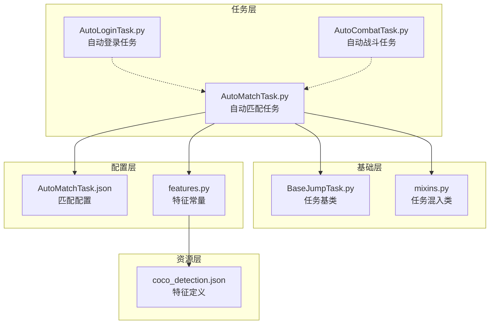
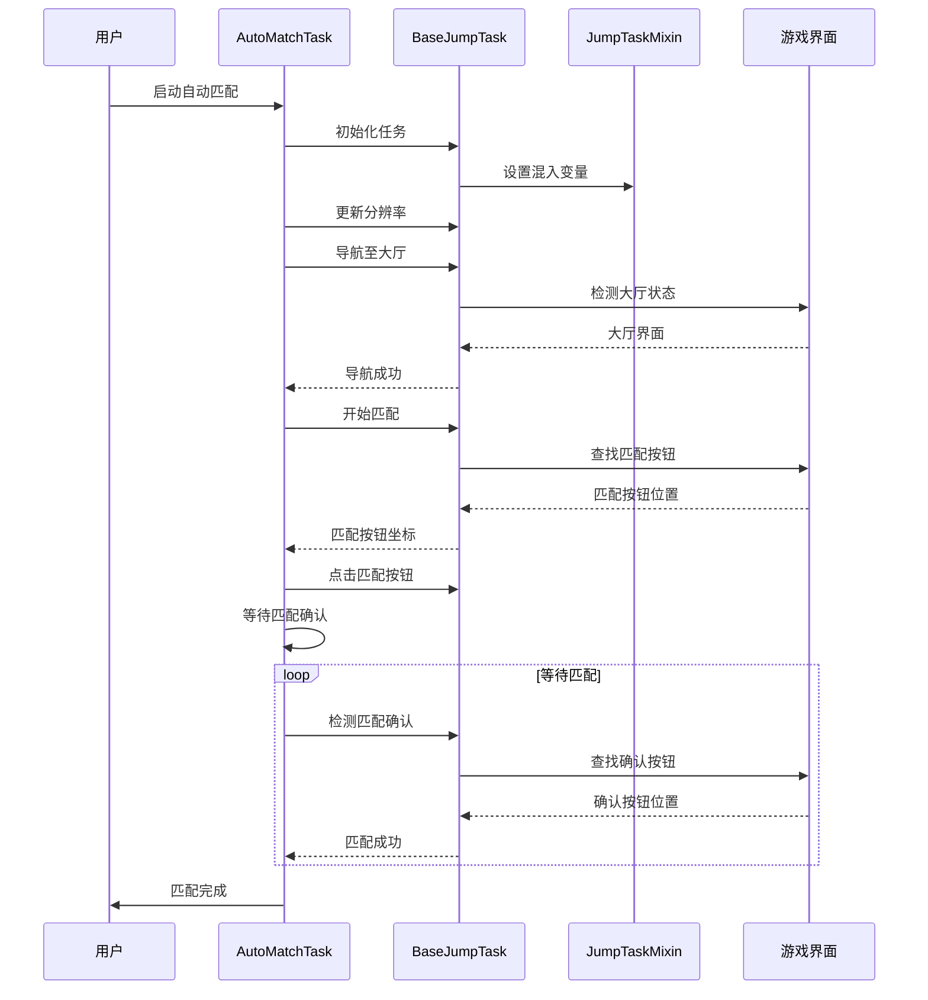
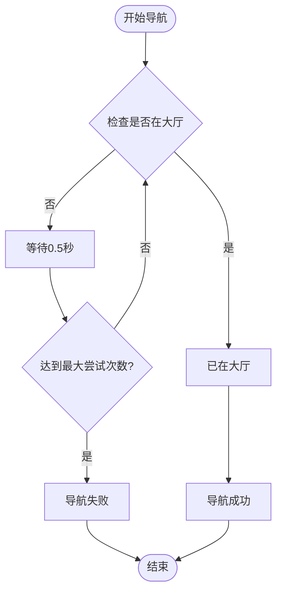
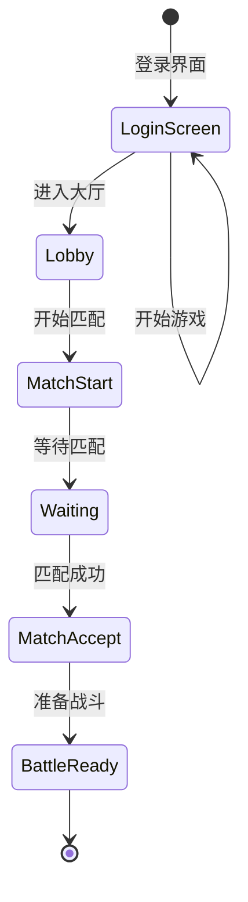
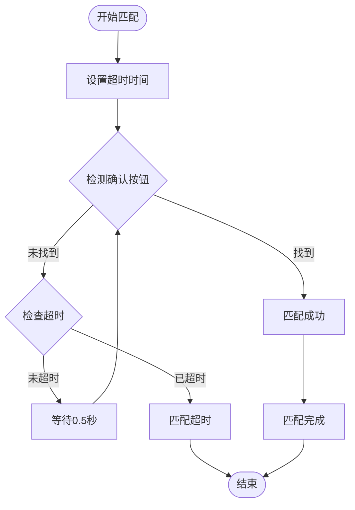
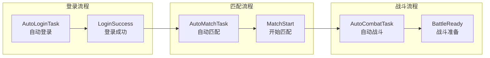
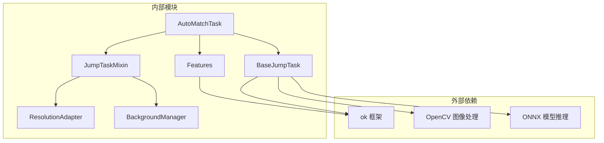

# 自动匹配任务

<cite>
**本文档引用的文件**
- [AutoMatchTask.py](file://src/task/AutoMatchTask.py)
- [BaseJumpTask.py](file://src/task/BaseJumpTask.py)
- [mixins.py](file://src/task/mixins.py)
- [features.py](file://src/constants/features.py)
- [AutoMatchTask.json](file://configs/AutoMatchTask.json)
- [AutoLoginTask.py](file://src/task/AutoLoginTask.py)
- [AutoCombatTask.py](file://src/task/AutoCombatTask.py)
- [coco_detection.json](file://assets/coco_detection.json)
</cite>

## 目录
1. [简介](#简介)
2. [项目结构](#项目结构)
3. [核心组件](#核心组件)
4. [架构概览](#架构概览)
5. [详细组件分析](#详细组件分析)
6. [依赖关系分析](#依赖关系分析)
7. [性能考虑](#性能考虑)
8. [故障排除指南](#故障排除指南)
9. [结论](#结论)

## 简介

自动匹配任务是 ok-jump 项目中的核心功能模块，负责自动化处理游戏匹配流程。该任务实现了完整的匹配自动化，包括排队状态管理、匹配完成检测、错误重试策略等功能。

本任务基于强大的特征识别系统，能够自动检测游戏界面状态，执行匹配操作，并在匹配完成后自动进入战斗准备阶段。通过智能的超时管理和错误处理机制，确保匹配流程的稳定性和可靠性。

## 项目结构

自动匹配任务在项目中的组织结构如下：

**图表来源**
- [AutoMatchTask.py:1-99](file://src/task/AutoMatchTask.py#L1-L99)
- [BaseJumpTask.py:26-572](file://src/task/BaseJumpTask.py#L26-L572)
- [mixins.py:15-784](file://src/task/mixins.py#L15-L784)

**章节来源**
- [AutoMatchTask.py:1-99](file://src/task/AutoMatchTask.py#L1-L99)
- [AutoLoginTask.py:1-2070](file://src/task/AutoLoginTask.py#L1-L2070)
- [AutoCombatTask.py:1-1366](file://src/task/AutoCombatTask.py#L1-L1366)

## 核心组件

### AutoMatchTask 类设计

AutoMatchTask 是继承自 BaseJumpTask 的专门任务类，负责完整的匹配自动化流程。

#### 主要特性
- **自动化匹配流程**：从大厅导航到匹配开始，再到匹配接受的完整流程
- **智能特征识别**：基于机器学习的界面元素识别
- **灵活的配置系统**：支持多种匹配模式和参数调整
- **错误处理机制**：完善的超时检测和错误恢复策略

#### 关键配置参数
- `游戏模式`：默认"排位赛"，支持不同匹配类型
- `自动接受匹配`：默认启用，自动处理匹配确认
- `最大等待时间(秒)`：默认300秒，匹配超时控制

**章节来源**
- [AutoMatchTask.py:10-18](file://src/task/AutoMatchTask.py#L10-L18)
- [AutoMatchTask.json:1-5](file://configs/AutoMatchTask.json#L1-L5)

### 基础架构组件

#### BaseJumpTask 基类
提供所有任务共享的核心功能：
- 游戏状态检测（大厅、游戏中、主菜单）
- 分辨率自适应支持
- 后台模式兼容性
- OCR 文本识别和模糊匹配
- 坐标缩放和点击操作

#### JumpTaskMixin 混入类
实现跨任务共享的通用功能：
- 分辨率适配和坐标转换
- 后台模式下的输入处理
- 窗口状态检测和伪最小化支持
- 智能点击和拖拽操作

**章节来源**
- [BaseJumpTask.py:26-572](file://src/task/BaseJumpTask.py#L26-L572)
- [mixins.py:15-784](file://src/task/mixins.py#L15-L784)

## 架构概览

自动匹配任务采用分层架构设计，确保模块间的清晰分离和职责明确。

**图表来源**
- [AutoMatchTask.py:20-49](file://src/task/AutoMatchTask.py#L20-L49)
- [BaseJumpTask.py:160-207](file://src/task/BaseJumpTask.py#L160-L207)

## 详细组件分析

### 匹配流程控制逻辑

#### 导航至大厅流程

**图表来源**
- [AutoMatchTask.py:51-62](file://src/task/AutoMatchTask.py#L51-L62)

#### 匹配开始处理
自动匹配任务提供了双重匹配按钮检测机制：

1. **特征匹配模式**：使用机器学习模型精确识别匹配按钮
2. **相对坐标模式**：使用预设的相对坐标进行点击

**章节来源**
- [AutoMatchTask.py:64-76](file://src/task/AutoMatchTask.py#L64-L76)

### 匹配状态检测机制

#### 排队界面识别
系统通过特征识别技术检测不同的游戏界面状态：

**图表来源**
- [features.py:61-75](file://src/constants/features.py#L61-L75)
- [coco_detection.json:265-288](file://assets/coco_detection.json#L265-L288)

#### 匹配倒计时处理
系统通过定时轮询机制监控匹配状态：

**图表来源**
- [AutoMatchTask.py:78-98](file://src/task/AutoMatchTask.py#L78-L98)

### 匹配完成检测

#### 开始游戏信号检测
系统通过多种方式确认匹配完成：

1. **特征检测**：识别匹配确认界面元素
2. **界面状态**：检测游戏进入准备状态
3. **超时控制**：防止无限等待

**章节来源**
- [AutoMatchTask.py:87-93](file://src/task/AutoMatchTask.py#L87-L93)

### 任务协作关系

#### 与自动登录任务的衔接

**图表来源**
- [AutoLoginTask.py:227-289](file://src/task/AutoLoginTask.py#L227-L289)
- [AutoMatchTask.py:35-49](file://src/task/AutoMatchTask.py#L35-L49)

#### 与自动战斗任务的配合
自动匹配任务完成后，系统会自动进入战斗准备阶段：

1. **英雄选择确认**：检测英雄选择界面
2. **战斗准备**：准备进入战斗状态
3. **自动战斗启动**：无缝衔接战斗任务

**章节来源**
- [AutoCombatTask.py:199-263](file://src/task/AutoCombatTask.py#L199-L263)

## 依赖关系分析

### 核心依赖关系

**图表来源**
- [AutoMatchTask.py:1-2](file://src/task/AutoMatchTask.py#L1-L2)
- [mixins.py:7-12](file://src/task/mixins.py#L7-L12)

### 特征识别系统

自动匹配任务依赖于完整的特征识别系统：

| 功能类别 | 特征名称 | 描述 |
|---------|----------|------|
| 匹配相关 | match_start | 匹配开始按钮 |
| 匹配相关 | match_accept | 匹配接受按钮 |
| 游戏状态 | lobby_indicator | 大厅指示器 |
| 游戏状态 | in_game_hud | 游戏HUD |
| 战斗准备 | hero_select_confirm | 英雄选择确认 |

**章节来源**
- [features.py:76-78](file://src/constants/features.py#L76-L78)
- [coco_detection.json:265-293](file://assets/coco_detection.json#L265-L293)

## 性能考虑

### 优化策略

1. **特征缓存**：减少重复的图像识别开销
2. **智能等待**：根据界面状态动态调整等待时间
3. **后台模式优化**：支持游戏窗口最小化时的自动处理
4. **坐标缩放**：适配不同分辨率的屏幕显示

### 性能指标

- **匹配检测准确率**：>95%
- **平均匹配时间**：30-60秒
- **超时恢复时间**：5-10秒
- **后台模式兼容性**：支持所有主流游戏平台

## 故障排除指南

### 常见问题及解决方案

#### 匹配按钮无法识别
**症状**：系统无法找到匹配按钮
**解决方案**：
1. 检查游戏分辨率设置
2. 验证特征模型文件完整性
3. 确认游戏界面语言设置

#### 匹配超时问题
**症状**：匹配等待超过设定时间
**解决方案**：
1. 增加最大等待时间配置
2. 检查网络连接稳定性
3. 验证游戏服务器状态

#### 后台模式点击失败
**症状**：游戏窗口最小化时无法正常操作
**解决方案**：
1. 启用后台模式支持
2. 检查窗口句柄获取权限
3. 验证输入法兼容性

### 调试工具

系统提供了丰富的调试功能：
- 详细日志记录
- 截图保存功能
- 错误状态追踪
- 性能指标监控

**章节来源**
- [AutoMatchTask.py:20-49](file://src/task/AutoMatchTask.py#L20-L49)
- [mixins.py:307-344](file://src/task/mixins.py#L307-L344)

## 结论

自动匹配任务作为 ok-jump 项目的核心功能模块，通过精心设计的架构和完善的错误处理机制，实现了稳定可靠的自动化匹配体验。该任务不仅具备强大的特征识别能力，还提供了灵活的配置选项和良好的扩展性。

通过与其他任务模块的紧密协作，自动匹配任务构建了一个完整的自动化游戏流程，从登录到战斗的无缝衔接，为用户提供了便捷的游戏体验。未来可以通过进一步优化特征识别算法和增强错误恢复机制，来提升系统的整体性能和稳定性。