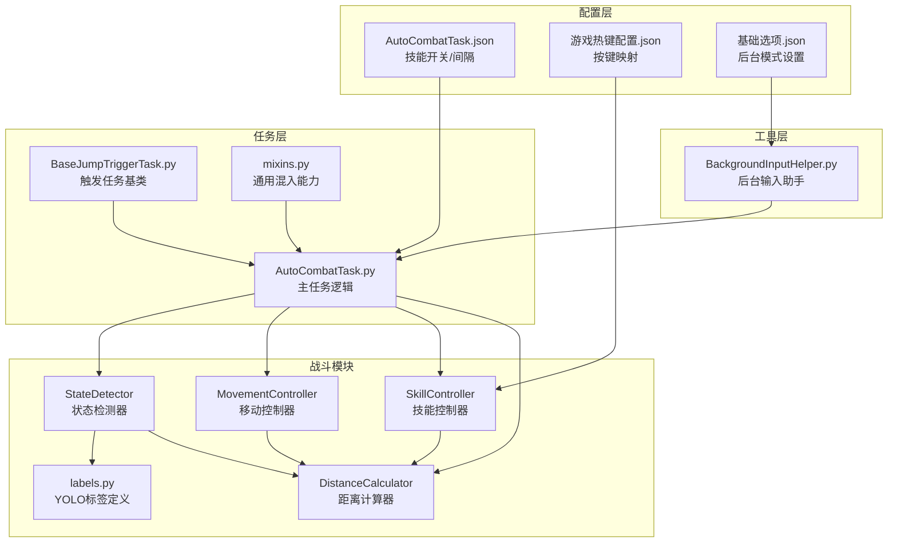
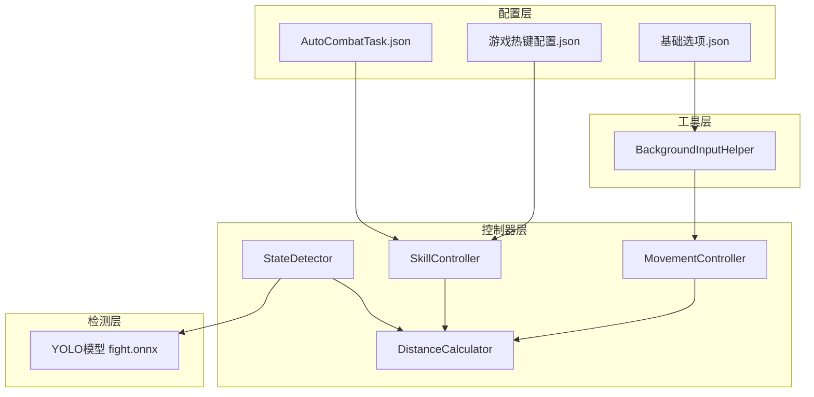
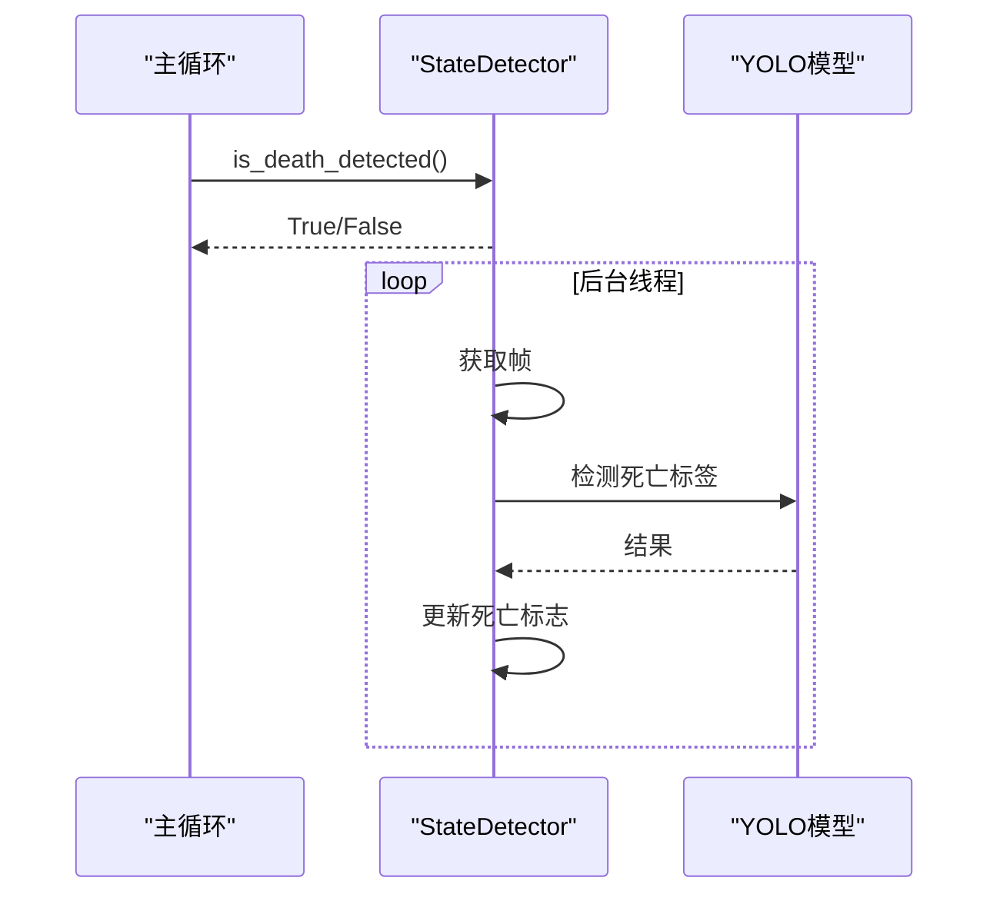
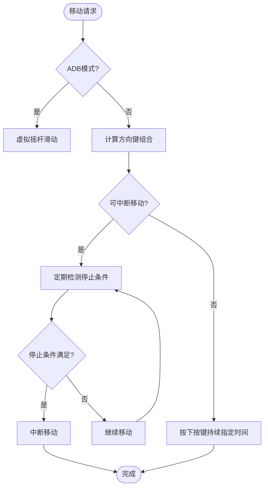
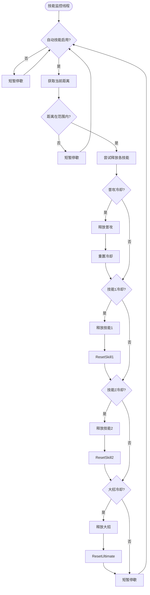
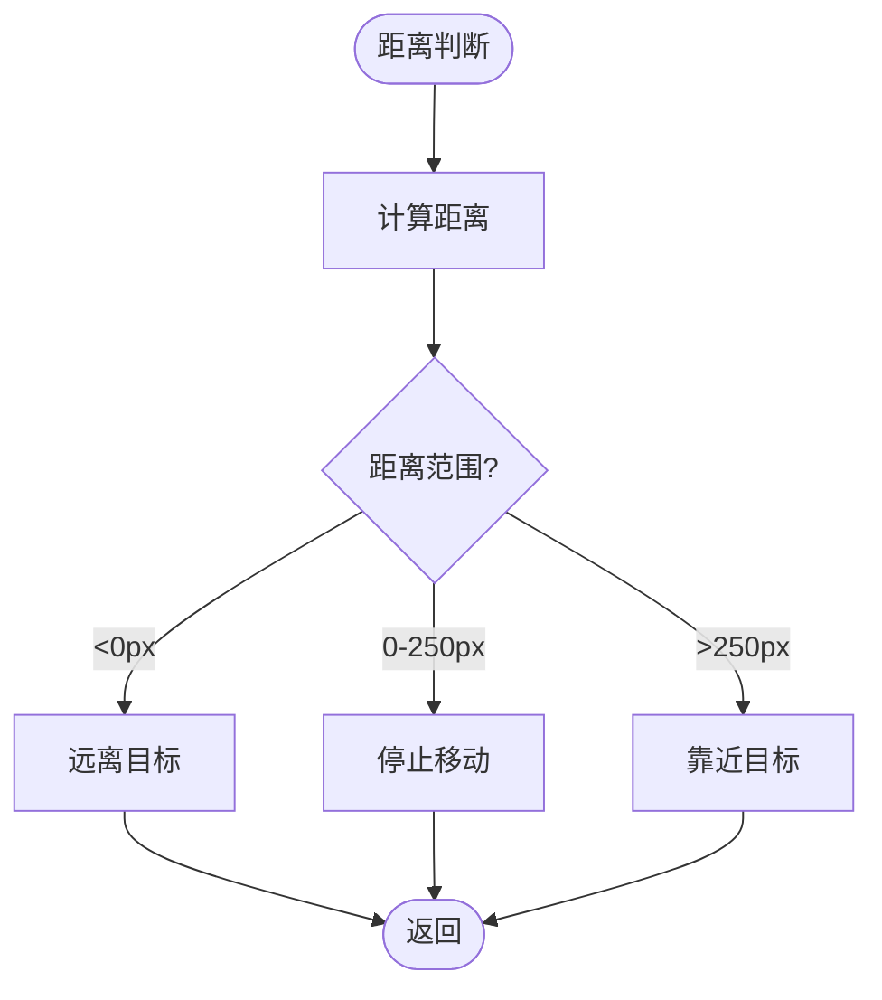
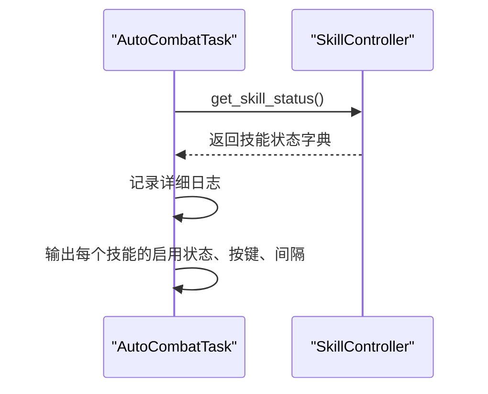
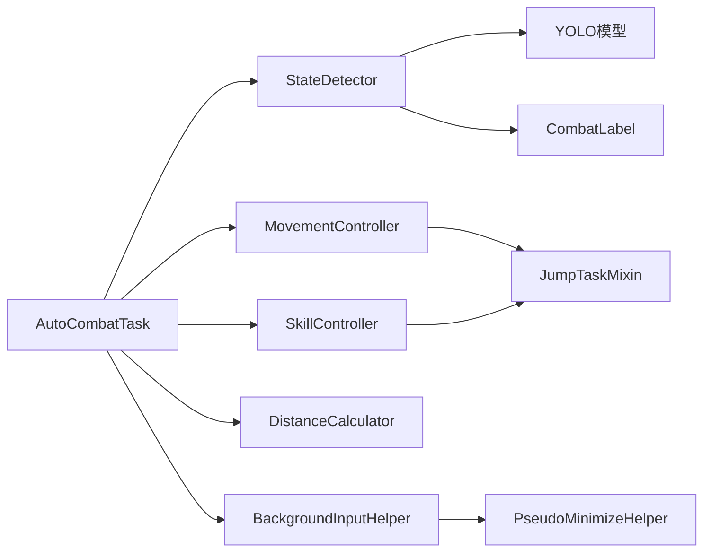

# 自动战斗任务

<cite>
**本文档引用的文件**
- [AutoCombatTask.py](file://src/task/AutoCombatTask.py)
- [AutoCombatTask.json](file://configs/AutoCombatTask.json)
- [游戏热键配置.json](file://configs/游戏热键配置.json)
- [state_detector.py](file://src/combat/state_detector.py)
- [skill_controller.py](file://src/combat/skill_controller.py)
- [distance_calculator.py](file://src/combat/distance_calculator.py)
- [movement_controller.py](file://src/combat/movement_controller.py)
- [BackgroundInputHelper.py](file://src/utils/BackgroundInputHelper.py)
- [BaseJumpTriggerTask.py](file://src/task/BaseJumpTriggerTask.py)
- [mixins.py](file://src/task/mixins.py)
- [labels.py](file://src/combat/labels.py)
- [自动战斗系统流程图.md](file://docs/自动战斗系统流程图.md)
</cite>

## 更新摘要
**所做更改**
- 新增了技能控制器的配置继承机制，支持从AutoCombatTask配置文件继承战斗参数
- 增强了技能状态日志记录功能，提供详细的当前战斗设置信息
- 完善了配置优先级处理逻辑，确保配置读取的灵活性和可靠性
- 更新了智能战斗决策机制和并行死亡检测功能

## 目录
1. [简介](#简介)
2. [项目结构](#项目结构)
3. [核心组件](#核心组件)
4. [架构总览](#架构总览)
5. [详细组件分析](#详细组件分析)
6. [配置继承机制](#配置继承机制)
7. [依赖关系分析](#依赖关系分析)
8. [性能考量](#性能考量)
9. [故障排除指南](#故障排除指南)
10. [结论](#结论)
11. [附录](#附录)

## 简介
本文件面向OK-Jump的自动战斗任务，系统性阐述AutoCombatTask的实现原理与工作机制，覆盖以下主题：
- 智能战斗逻辑：基于YOLO的单位检测、战场状态判断、目标锁定与距离控制
- 并行死亡检测：独立线程持续监控，主线程快速查询
- 技能自动化控制：配置驱动的技能开关与冷却管理，支持配置继承机制
- 关键技术：战斗状态检测、移动控制、技能释放策略、距离计算算法
- 任务配置参数：技能开关、冷却间隔、移动持续时间、按键映射
- 配置继承机制：从AutoCombatTask配置文件继承战斗参数
- 运行监控与异常处理：日志分级、帧信息记录、资源清理
- 性能优化建议：检测频率、后台模式、伪最小化、滞后缓冲区
- 实际场景示例与故障排除

## 项目结构
自动战斗系统由"任务层""战斗模块""工具层""配置层"构成，采用模块化设计，职责清晰、耦合度低。



**图表来源**
- [AutoCombatTask.py:1-763](file://src/task/AutoCombatTask.py#L1-L763)
- [state_detector.py:1-446](file://src/combat/state_detector.py#L1-L446)
- [skill_controller.py:1-551](file://src/combat/skill_controller.py#L1-L551)
- [distance_calculator.py:1-197](file://src/combat/distance_calculator.py#L1-L197)
- [movement_controller.py:1-577](file://src/combat/movement_controller.py#L1-L577)
- [BackgroundInputHelper.py:1-841](file://src/utils/BackgroundInputHelper.py#L1-L841)
- [BaseJumpTriggerTask.py:1-30](file://src/task/BaseJumpTriggerTask.py#L1-L30)
- [mixins.py:1-774](file://src/task/mixins.py#L1-L774)
- [labels.py:1-51](file://src/combat/labels.py#L1-L51)

**章节来源**
- [AutoCombatTask.py:1-763](file://src/task/AutoCombatTask.py#L1-L763)
- [自动战斗系统流程图.md:1-297](file://docs/自动战斗系统流程图.md#L1-L297)

## 核心组件
- AutoCombatTask：触发式自动战斗任务，负责初始化、主循环、状态处理与资源清理
- StateDetector：基于YOLO的多标签检测（自身、友方、敌方、死亡），支持并行死亡监控
- MovementController：WASD键盘或虚拟摇杆移动控制，支持后台模式，新增可中断移动功能
- SkillController：技能释放控制，配置驱动（开关与冷却），支持配置继承机制，新增独立监控线程
- DistanceCalculator：带滞后缓冲的距离控制，维持0~250像素的最佳攻击距离
- BackgroundInputHelper：后台输入支持，为Unity游戏提供可靠的SendInput操作
- 配置文件：AutoCombatTask.json（技能开关/间隔）、游戏热键配置.json（按键映射）

**章节来源**
- [AutoCombatTask.py:32-160](file://src/task/AutoCombatTask.py#L32-L160)
- [state_detector.py:24-185](file://src/combat/state_detector.py#L24-L185)
- [movement_controller.py:24-161](file://src/combat/movement_controller.py#L24-L161)
- [skill_controller.py:24-151](file://src/combat/skill_controller.py#L24-L151)
- [distance_calculator.py:14-163](file://src/combat/distance_calculator.py#L14-L163)
- [BackgroundInputHelper.py:1-841](file://src/utils/BackgroundInputHelper.py#L1-L841)
- [AutoCombatTask.json:1-13](file://configs/AutoCombatTask.json#L1-L13)
- [游戏热键配置.json:1-6](file://configs/游戏热键配置.json#L1-L6)

## 架构总览
自动战斗系统采用"配置驱动 + 模块化控制器"的架构：
- 配置层：技能开关、冷却间隔、按键映射、后台模式
- 控制器层：状态检测、移动、技能、距离计算
- 工具层：后台输入助手
- 检测层：YOLO模型（fight.onnx）



**图表来源**
- [自动战斗系统流程图.md:7-39](file://docs/自动战斗系统流程图.md#L7-L39)

**章节来源**
- [自动战斗系统流程图.md:1-297](file://docs/自动战斗系统流程图.md#L1-L297)

## 详细组件分析

### AutoCombatTask 主任务
- 初始化阶段：更新后台配置、分辨率、等待进入游戏（测试模式可跳过）、初始化控制器、启动死亡监控线程、输出技能配置
- 主循环：后台模式检查、死亡状态查询、自身检测（15秒超时）、战场状态判断（4种情况）、状态处理（无单位/仅友方/仅敌方/混合）
- 状态处理：
  - 无单位：随机移动搜索（加权方向、向上权重更高），最长30秒
  - 仅友方：跟随最近友方，保持0~250像素距离，最多3秒
  - 仅敌方/混合：锁定最近敌方，维持距离达标后启动自动技能，移动中停止技能
- 异常处理：记录帧信息、清理资源、停止死亡监控、停止移动与技能、抛出异常


**图表来源**
- [AutoCombatTask.py:84-271](file://src/task/AutoCombatTask.py#L84-L271)
- [自动战斗系统流程图.md:41-95](file://docs/自动战斗系统流程图.md#L41-L95)

**章节来源**
- [AutoCombatTask.py:84-271](file://src/task/AutoCombatTask.py#L84-L271)
- [AutoCombatTask.py:302-763](file://src/task/AutoCombatTask.py#L302-L763)

### StateDetector 战场状态检测器
- 并行死亡检测：独立线程每30ms检测一次，连续2次确认死亡、连续3次确认复活，快速查询接口is_death_detected
- 同步检测：自身检测（15秒超时）、友方/敌方/所有单位检测
- 战场状态：根据友方/敌方是否存在返回四种状态（无单位/仅友方/仅敌方/混合）
- 目标最近点：计算欧氏距离，返回最近单位



**图表来源**
- [state_detector.py:72-185](file://src/combat/state_detector.py#L72-L185)

**章节来源**
- [state_detector.py:24-446](file://src/combat/state_detector.py#L24-L446)

### MovementController 移动控制
- PC端：WASD键，支持后台模式（SendInput）与前台模式（pydirectinput），根据偏移量计算八方向组合键
- 手机端：虚拟摇杆滑动，支持持续时间配置
- 停止移动：释放所有按键或结束滑动
- **新增功能**：可中断移动，支持在移动过程中实时检测距离变化并智能停止



**图表来源**
- [movement_controller.py:164-347](file://src/combat/movement_controller.py#L164-L347)
- [movement_controller.py:348-416](file://src/combat/movement_controller.py#L348-L416)

**章节来源**
- [movement_controller.py:24-577](file://src/combat/movement_controller.py#L24-L577)

### SkillController 技能自动化
- 配置驱动：从AutoCombatTask.json读取技能开关与间隔；从游戏热键配置.json读取按键映射
- **新增功能**：独立监控线程，持续监控距离并在范围内自动释放技能
- **配置继承机制**：支持从AutoCombatTask配置文件继承战斗参数，提供详细的日志记录当前战斗设置
- **冷却管理**：每个技能独立冷却计时器，互不影响
- **智能释放**：根据距离范围（0-250px）自动判断是否释放技能
- 后台支持：智能适配ADB/Windows模式，后台模式使用SendInput或框架ADB命令



**图表来源**
- [skill_controller.py:139-250](file://src/combat/skill_controller.py#L139-L250)
- [skill_controller.py:249-292](file://src/combat/skill_controller.py#L249-L292)

**章节来源**
- [skill_controller.py:24-551](file://src/combat/skill_controller.py#L24-L551)

### DistanceCalculator 距离控制
- 距离计算：欧氏距离
- 距离判定：带滞后缓冲的范围判断（进入/离开使用不同阈值），维持0~250像素
- 方向建议：靠近/远离/停止
- **增强功能**：改进的滞后效应，避免边界值附近频繁切换状态



**图表来源**
- [distance_calculator.py:84-158](file://src/combat/distance_calculator.py#L84-L158)

**章节来源**
- [distance_calculator.py:14-197](file://src/combat/distance_calculator.py#L14-L197)

### 配置与热键映射
- AutoCombatTask.json：技能开关（普攻/技能1/技能2/大招）、冷却间隔（秒）、移动持续时间（秒）、测试模式、详细日志
- 游戏热键配置.json：普通攻击、技能1、技能2、大招的按键映射
- 基础选项.json：后台模式、最小化时伪最小化、后台时静音游戏等

**章节来源**
- [AutoCombatTask.json:1-13](file://configs/AutoCombatTask.json#L1-L13)
- [游戏热键配置.json:1-6](file://configs/游戏热键配置.json#L1-L6)

## 配置继承机制

### 配置优先级体系
SkillController实现了灵活的配置继承机制，支持多层级配置读取：

```mermaid
graph TD
A[配置读取优先级] --> B[任务自身配置<br/>task.config.get(key)]
B --> C[全局AutoCombatTask配置<br/>og.config.get('AutoCombatTask')]
C --> D[默认值<br/>default参数]
```

**图表来源**
- [skill_controller.py:368-399](file://src/combat/skill_controller.py#L368-L399)

### 配置继承实现
- **任务配置优先**：首先从任务实例的config属性读取，确保用户自定义配置的最高优先级
- **全局配置回退**：当任务配置不存在时，自动从全局配置og.config中读取AutoCombatTask部分
- **默认值保障**：所有配置都有合理的默认值，确保系统稳定性
- **热键配置分离**：按键映射通过独立的_get_hotkey_config方法处理，从游戏热键配置中读取

### 详细日志记录
AutoCombatTask在初始化时会输出详细的技能配置信息，帮助用户确认当前战斗设置：



**图表来源**
- [AutoCombatTask.py:154-159](file://src/task/AutoCombatTask.py#L154-L159)

**章节来源**
- [skill_controller.py:368-443](file://src/combat/skill_controller.py#L368-L443)
- [AutoCombatTask.py:154-159](file://src/task/AutoCombatTask.py#L154-L159)

## 依赖关系分析
- AutoCombatTask依赖StateDetector、MovementController、SkillController、DistanceCalculator、BackgroundInputHelper
- StateDetector依赖YOLO模型与CombatLabel
- MovementController/SkillController依赖混入类提供的后台输入能力
- 配置文件通过任务配置与全局热键配置驱动控制器行为



**图表来源**
- [AutoCombatTask.py:21-29](file://src/task/AutoCombatTask.py#L21-L29)
- [state_detector.py:13-13](file://src/combat/state_detector.py#L13-L13)
- [mixins.py:15-28](file://src/task/mixins.py#L15-L28)
- [BackgroundInputHelper.py:1-841](file://src/utils/BackgroundInputHelper.py#L1-L841)

**章节来源**
- [AutoCombatTask.py:21-29](file://src/task/AutoCombatTask.py#L21-L29)
- [state_detector.py:13-13](file://src/combat/state_detector.py#L13-L13)
- [mixins.py:15-28](file://src/task/mixins.py#L15-L28)

## 性能考量
- 死亡检测频率：后台线程30ms检测一次，显著高于同步检测的50ms，提升响应速度
- 主循环延迟：约50ms，平衡检测精度与CPU占用
- **新增性能优化**：技能监控线程独立运行，避免主线程阻塞
- **移动中断机制**：减少不必要的按键持续时间，提高响应效率
- 距离控制滞后：缓冲区避免边界抖动，减少频繁按键切换
- **配置继承缓存**：避免重复读取配置，提升性能
- 建议：
  - 保持后台模式启用以支持最小化运行
  - 合理设置移动持续时间与技能间隔，避免过度频繁的输入
  - 在高帧率场景下适当降低检测频率，防止CPU压力过大

**章节来源**
- [自动战斗系统流程图.md:281-289](file://docs/自动战斗系统流程图.md#L281-L289)
- [distance_calculator.py:23-35](file://src/combat/distance_calculator.py#L23-L35)

## 故障排除指南
- 自身检测超时（15秒）：检查游戏是否正确进入战斗场景、截图是否可用、分辨率是否有效
  - 参考路径：[AutoCombatTask.py:238-244](file://src/task/AutoCombatTask.py#L238-L244)
- 无单位搜索超时（30秒）：确认地图视野与随机移动策略，必要时手动引导或缩短搜索时间
  - 参考路径：[AutoCombatTask.py:412-413](file://src/task/AutoCombatTask.py#L412-L413)
- 死亡状态误报/漏报：后台线程采用连续确认机制，若仍不稳定，可检查YOLO模型阈值与帧质量
  - 参考路径：[state_detector.py:158-177](file://src/combat/state_detector.py#L158-L177)
- **新增技能释放异常**：检查AutoCombatTask.json中的开关与间隔、游戏热键配置是否正确，确认技能监控线程正常运行
  - 参考路径：[skill_controller.py:152-210](file://src/combat/skill_controller.py#L152-L210)
- **新增配置继承问题**：检查og.config中是否有正确的AutoCombatTask配置，确认配置键名与AutoCombatTask.json一致
  - 参考路径：[skill_controller.py:368-399](file://src/combat/skill_controller.py#L368-L399)
- **新增移动中断失效**：检查可中断移动回调函数是否正确实现，确认距离计算准确性
  - 参考路径：[movement_controller.py:348-416](file://src/combat/movement_controller.py#L348-L416)
- 移动无效：确认后台模式与伪最小化状态，检查窗口句柄获取与SendInput权限
  - 参考路径：[movement_controller.py:329-346](file://src/combat/movement_controller.py#L329-L346)
- 帧信息记录：异常时查看日志中的帧尺寸信息，辅助定位截图/分辨率问题
  - 参考路径：[AutoCombatTask.py:272-279](file://src/task/AutoCombatTask.py#L272-L279)

**章节来源**
- [AutoCombatTask.py:238-244](file://src/task/AutoCombatTask.py#L238-L244)
- [AutoCombatTask.py:412-413](file://src/task/AutoCombatTask.py#L412-L413)
- [state_detector.py:158-177](file://src/combat/state_detector.py#L158-L177)
- [skill_controller.py:152-210](file://src/combat/skill_controller.py#L152-L210)
- [skill_controller.py:368-399](file://src/combat/skill_controller.py#L368-L399)
- [movement_controller.py:329-346](file://src/combat/movement_controller.py#L329-L346)
- [AutoCombatTask.py:272-279](file://src/task/AutoCombatTask.py#L272-L279)

## 结论
AutoCombatTask通过"配置驱动 + 模块化控制器 + 并行检测"的设计，实现了稳定高效的自动战斗能力。其核心优势在于：
- 并行死亡检测与快速查询，保证战斗响应及时
- 基于YOLO的状态检测与目标锁定，适应复杂战场
- **新增的配置继承机制**，支持从AutoCombatTask配置文件继承战斗参数，提供灵活的配置管理
- **增强的技能状态日志记录**，帮助用户实时了解当前战斗设置
- **新增的独立技能监控线程**，实现智能技能释放与冷却管理
- **增强的移动中断功能**，提高战斗响应效率
- 带滞后的距离控制与移动策略，提升稳定性
- 配置灵活、扩展性强，便于策略调整与性能优化

## 附录

### 启动流程与运行监控
- 启动流程：后台配置更新 → 场景等待（测试模式可跳过）→ 初始化控制器 → 启动死亡监控 → 主循环
- 运行监控：每10次循环输出状态摘要，详细日志模式输出帧信息与单位详情

**章节来源**
- [AutoCombatTask.py:94-134](file://src/task/AutoCombatTask.py#L94-L134)
- [AutoCombatTask.py:220-224](file://src/task/AutoCombatTask.py#L220-L224)

### 任务配置参数说明
- AutoCombatTask.json
  - 测试模式：启用后跳过场景检测
  - 详细日志：输出YOLO检测、位置、距离等详细信息
  - 自动普攻/技能1/技能2/大招：技能开关
  - 普攻间隔/技能1间隔/技能2间隔/大招间隔：冷却时间（秒）
  - 移动持续时间：每次移动按键持续时间（秒）
- 游戏热键配置.json
  - 普通攻击、技能1、技能2、大招的按键映射

**章节来源**
- [AutoCombatTask.json:1-13](file://configs/AutoCombatTask.json#L1-L13)
- [游戏热键配置.json:1-6](file://configs/游戏热键配置.json#L1-L6)

### 实际游戏场景示例
- 仅敌方场景：锁定最近敌人，维持0~250像素距离，达标后启动自动技能，移动中停止技能
  - 参考路径：[AutoCombatTask.py:508-630](file://src/task/AutoCombatTask.py#L508-L630)
- 仅友方场景：跟随最近友方，保持距离，最多3秒，期间不释放技能
  - 参考路径：[AutoCombatTask.py:415-491](file://src/task/AutoCombatTask.py#L415-L491)
- 无单位场景：随机移动搜索，向上权重更高，最长30秒
  - 参考路径：[AutoCombatTask.py:346-414](file://src/task/AutoCombatTask.py#L346-L414)

**章节来源**
- [AutoCombatTask.py:346-414](file://src/task/AutoCombatTask.py#L346-L414)
- [AutoCombatTask.py:415-491](file://src/task/AutoCombatTask.py#L415-L491)
- [AutoCombatTask.py:508-630](file://src/task/AutoCombatTask.py#L508-L630)

### 配置继承最佳实践
- **推荐配置方式**：在AutoCombatTask.json中设置全局默认值，在任务实例中覆盖特定需求
- **调试技巧**：启用详细日志，观察技能状态日志输出，确认配置继承是否正确
- **性能考虑**：合理设置技能间隔，避免过于频繁的技能释放影响战斗流畅度
- **兼容性**：确保配置键名与AutoCombatTask.json完全一致，避免配置读取失败

**章节来源**
- [skill_controller.py:368-443](file://src/combat/skill_controller.py#L368-L443)
- [AutoCombatTask.py:154-159](file://src/task/AutoCombatTask.py#L154-L159)