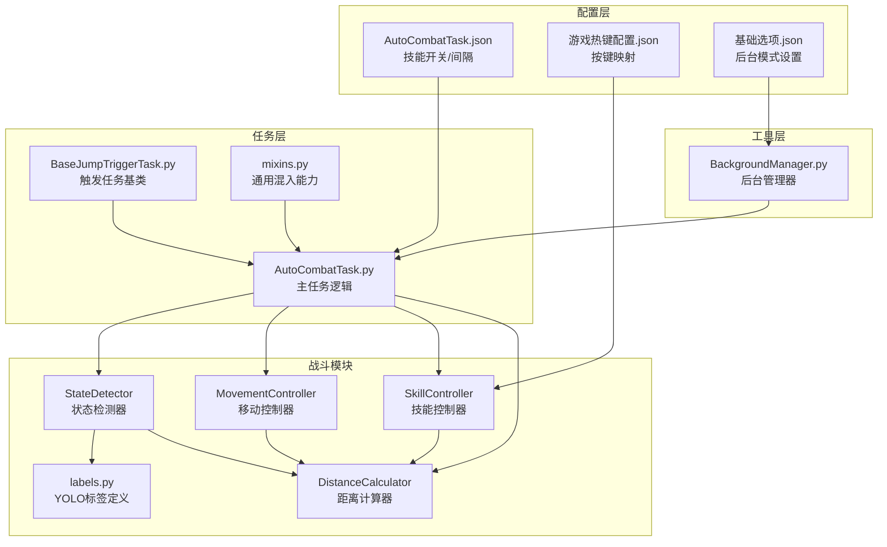
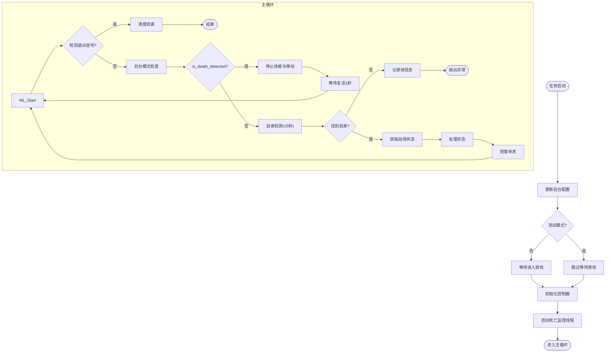
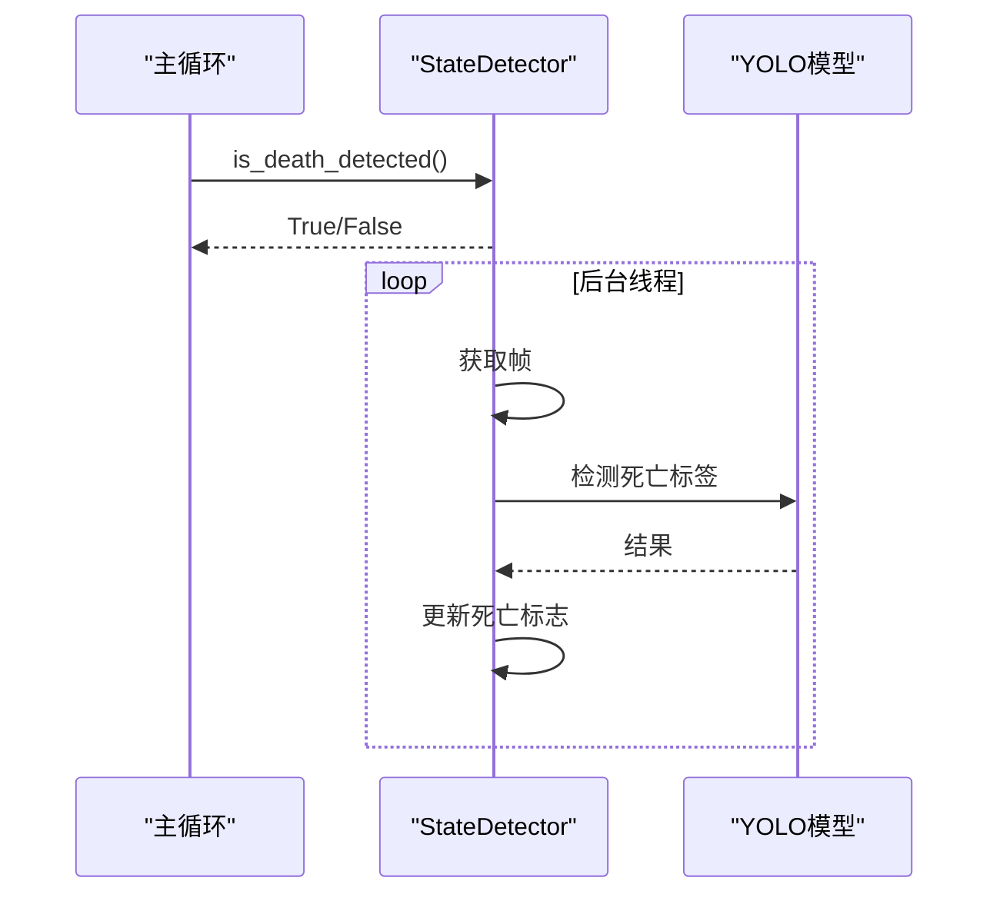
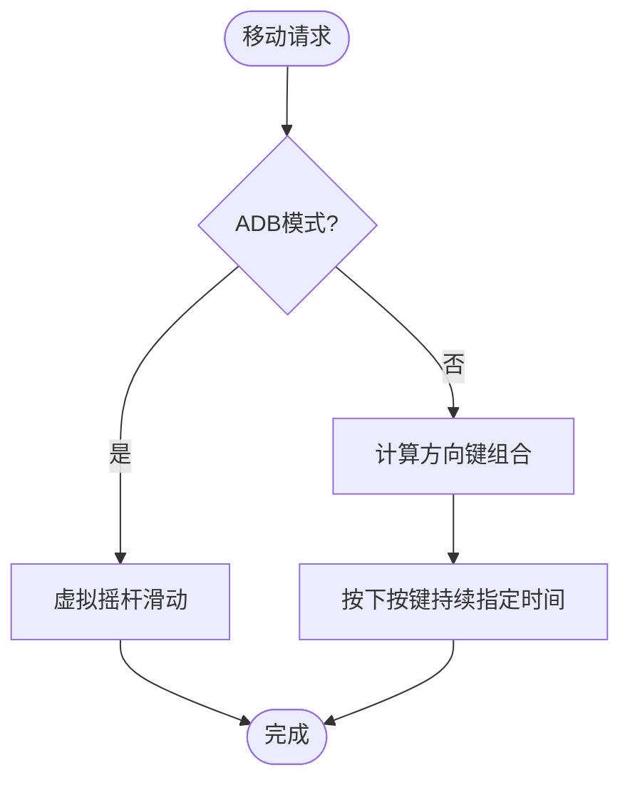
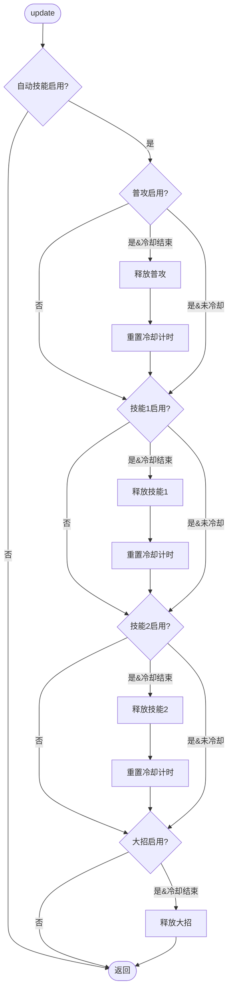
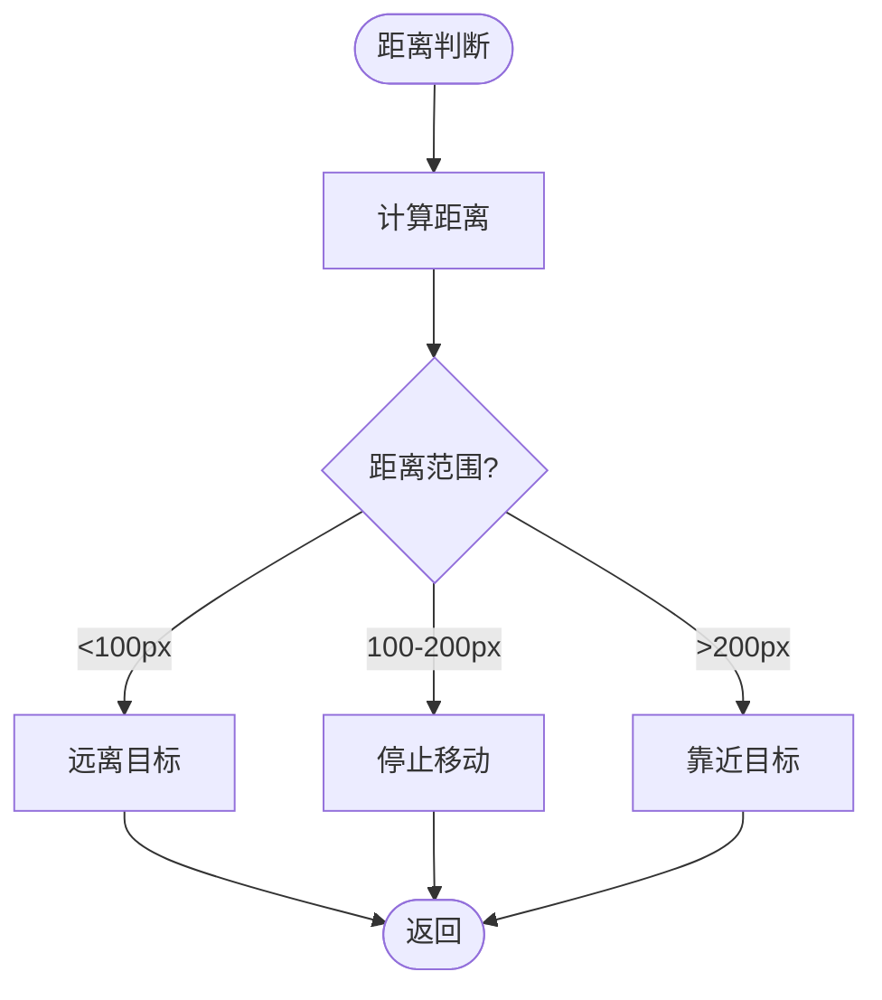
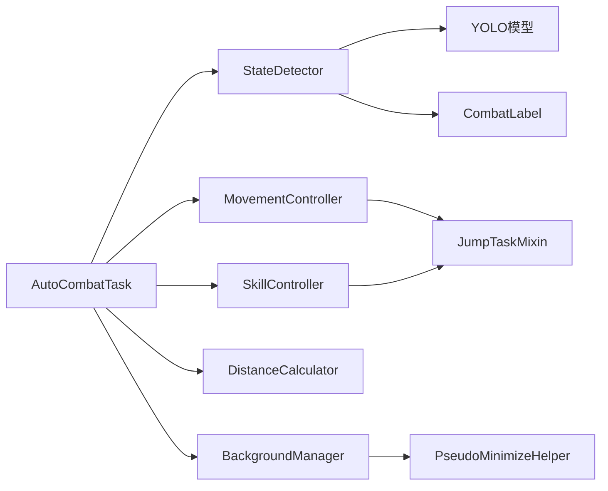

# 自动战斗任务

<cite>
**本文引用的文件**
- [AutoCombatTask.py](file://src/task/AutoCombatTask.py)
- [AutoCombatTask.json](file://configs/AutoCombatTask.json)
- [游戏热键配置.json](file://configs/游戏热键配置.json)
- [state_detector.py](file://src/combat/state_detector.py)
- [skill_controller.py](file://src/combat/skill_controller.py)
- [distance_calculator.py](file://src/combat/distance_calculator.py)
- [movement_controller.py](file://src/combat/movement_controller.py)
- [BackgroundManager.py](file://src/utils/BackgroundManager.py)
- [BaseJumpTriggerTask.py](file://src/task/BaseJumpTriggerTask.py)
- [mixins.py](file://src/task/mixins.py)
- [labels.py](file://src/combat/labels.py)
- [自动战斗系统流程图.md](file://docs/自动战斗系统流程图.md)
</cite>

## 目录
1. [简介](#简介)
2. [项目结构](#项目结构)
3. [核心组件](#核心组件)
4. [架构总览](#架构总览)
5. [详细组件分析](#详细组件分析)
6. [依赖关系分析](#依赖关系分析)
7. [性能考量](#性能考量)
8. [故障排除指南](#故障排除指南)
9. [结论](#结论)
10. [附录](#附录)

## 简介
本文件面向OK-Jump的自动战斗任务，系统性阐述AutoCombatTask的实现原理与工作机制，覆盖以下主题：
- 智能战斗逻辑：基于YOLO的单位检测、战场状态判断、目标锁定与距离控制
- 并行死亡检测：独立线程持续监控，主线程快速查询
- 技能自动化控制：配置驱动的技能开关与冷却管理
- 关键技术：战斗状态检测、移动控制、技能释放策略、距离计算算法
- 任务配置参数：技能开关、冷却间隔、移动持续时间、按键映射
- 运行监控与异常处理：日志分级、帧信息记录、资源清理
- 性能优化建议：检测频率、后台模式、伪最小化、滞后缓冲区
- 实际场景示例与故障排除

## 项目结构
自动战斗系统由“任务层”“战斗模块”“工具层”“配置层”构成，采用模块化设计，职责清晰、耦合度低。

**图表来源**
- [AutoCombatTask.py:1-693](file://src/task/AutoCombatTask.py#L1-L693)
- [state_detector.py:1-446](file://src/combat/state_detector.py#L1-L446)
- [skill_controller.py:1-347](file://src/combat/skill_controller.py#L1-L347)
- [distance_calculator.py:1-197](file://src/combat/distance_calculator.py#L1-L197)
- [movement_controller.py:1-508](file://src/combat/movement_controller.py#L1-L508)
- [BackgroundManager.py:1-155](file://src/utils/BackgroundManager.py#L1-L155)
- [BaseJumpTriggerTask.py:1-30](file://src/task/BaseJumpTriggerTask.py#L1-L30)
- [mixins.py:1-774](file://src/task/mixins.py#L1-L774)
- [labels.py:1-51](file://src/combat/labels.py#L1-L51)

**章节来源**
- [AutoCombatTask.py:1-693](file://src/task/AutoCombatTask.py#L1-L693)
- [自动战斗系统流程图.md:1-297](file://docs/自动战斗系统流程图.md#L1-L297)

## 核心组件
- AutoCombatTask：触发式自动战斗任务，负责初始化、主循环、状态处理与资源清理
- StateDetector：基于YOLO的多标签检测（自身、友方、敌方、死亡），支持并行死亡监控
- MovementController：WASD键盘或虚拟摇杆移动控制，支持后台模式
- SkillController：技能释放控制，配置驱动（开关与冷却），按键映射来自全局热键配置
- DistanceCalculator：带滞后缓冲的距离控制，维持100~200像素的最佳攻击距离
- BackgroundManager：后台模式与伪最小化支持，保障窗口最小化时的截图与输入
- 配置文件：AutoCombatTask.json（技能开关/间隔）、游戏热键配置.json（按键映射）

**章节来源**
- [AutoCombatTask.py:32-160](file://src/task/AutoCombatTask.py#L32-L160)
- [state_detector.py:24-185](file://src/combat/state_detector.py#L24-L185)
- [movement_controller.py:24-161](file://src/combat/movement_controller.py#L24-L161)
- [skill_controller.py:24-151](file://src/combat/skill_controller.py#L24-L151)
- [distance_calculator.py:14-163](file://src/combat/distance_calculator.py#L14-L163)
- [BackgroundManager.py:7-155](file://src/utils/BackgroundManager.py#L7-L155)
- [AutoCombatTask.json:1-13](file://configs/AutoCombatTask.json#L1-L13)
- [游戏热键配置.json:1-6](file://configs/游戏热键配置.json#L1-L6)

## 架构总览
自动战斗系统采用“配置驱动 + 模块化控制器”的架构：
- 配置层：技能开关、冷却间隔、按键映射、后台模式
- 控制器层：状态检测、移动、技能、距离计算
- 工具层：后台管理器
- 检测层：YOLO模型（fight.onnx）

**图表来源**
- [自动战斗系统流程图.md:7-39](file://docs/自动战斗系统流程图.md#L7-L39)

**章节来源**
- [自动战斗系统流程图.md:1-297](file://docs/自动战斗系统流程图.md#L1-L297)

## 详细组件分析

### AutoCombatTask 主任务
- 初始化阶段：更新后台配置、分辨率、等待进入游戏（测试模式可跳过）、初始化控制器、启动死亡监控线程、输出技能配置
- 主循环：后台模式检查、死亡状态查询、自身检测（15秒超时）、战场状态判断（4种）、状态处理（无单位/仅友方/仅敌方/混合）
- 状态处理：
  - 无单位：随机移动搜索（加权方向、向上权重更高），最长30秒
  - 仅友方：跟随最近友方，保持100~200像素距离，最多3秒
  - 仅敌方/混合：锁定最近敌方，维持距离达标后启动自动技能，移动中停止技能
- 异常处理：记录帧信息、清理资源、停止死亡监控、停止移动与技能、抛出异常

**图表来源**
- [AutoCombatTask.py:84-271](file://src/task/AutoCombatTask.py#L84-L271)
- [自动战斗系统流程图.md:41-95](file://docs/自动战斗系统流程图.md#L41-L95)

**章节来源**
- [AutoCombatTask.py:84-271](file://src/task/AutoCombatTask.py#L84-L271)
- [AutoCombatTask.py:302-647](file://src/task/AutoCombatTask.py#L302-L647)

### StateDetector 战场状态检测器
- 并行死亡检测：独立线程每30ms检测一次，连续2次确认死亡、连续3次确认复活，快速查询接口is_death_detected
- 同步检测：自身检测（15秒超时）、友方/敌方/所有单位检测
- 战场状态：根据友方/敌方是否存在返回四种状态（无单位/仅友方/仅敌方/混合）
- 目标最近点：计算欧氏距离，返回最近单位

**图表来源**
- [state_detector.py:72-185](file://src/combat/state_detector.py#L72-L185)

**章节来源**
- [state_detector.py:24-446](file://src/combat/state_detector.py#L24-L446)

### MovementController 移动控制
- PC端：WASD键，支持后台模式（SendInput）与前台模式（pydirectinput），根据偏移量计算八方向组合键
- 手机端：虚拟摇杆滑动，支持持续时间配置
- 停止移动：释放所有按键或结束滑动

**图表来源**
- [movement_controller.py:164-347](file://src/combat/movement_controller.py#L164-L347)

**章节来源**
- [movement_controller.py:24-508](file://src/combat/movement_controller.py#L24-L508)

### SkillController 技能自动化
- 配置驱动：从AutoCombatTask.json读取技能开关与间隔；从游戏热键配置.json读取按键映射
- 自动技能：启动/停止，按冷却时间依次释放普攻、技能1、技能2、大招
- 后台支持：智能适配ADB/Windows模式，后台模式使用SendInput或框架ADB命令

**图表来源**
- [skill_controller.py:139-250](file://src/combat/skill_controller.py#L139-L250)

**章节来源**
- [skill_controller.py:24-347](file://src/combat/skill_controller.py#L24-L347)

### DistanceCalculator 距离控制
- 距离计算：欧氏距离
- 距离判定：带滞后缓冲的范围判断（进入/离开使用不同阈值），维持100~200像素
- 方向建议：靠近/远离/停止

**图表来源**
- [distance_calculator.py:84-158](file://src/combat/distance_calculator.py#L84-L158)

**章节来源**
- [distance_calculator.py:14-197](file://src/combat/distance_calculator.py#L14-L197)

### 配置与热键映射
- AutoCombatTask.json：技能开关（普攻/技能1/技能2/大招）、冷却间隔（秒）、移动持续时间（秒）、测试模式、详细日志
- 游戏热键配置.json：普通攻击、技能1、技能2、大招的按键映射
- 基础选项.json：后台模式、最小化时伪最小化、后台时静音游戏等

**章节来源**
- [AutoCombatTask.json:1-13](file://configs/AutoCombatTask.json#L1-L13)
- [游戏热键配置.json:1-6](file://configs/游戏热键配置.json#L1-L6)
- [BackgroundManager.py:18-23](file://src/utils/BackgroundManager.py#L18-L23)

## 依赖关系分析
- AutoCombatTask依赖StateDetector、MovementController、SkillController、DistanceCalculator、BackgroundManager
- StateDetector依赖YOLO模型与CombatLabel
- MovementController/SkillController依赖混入类提供的后台输入能力
- 配置文件通过任务配置与全局热键配置驱动控制器行为

**图表来源**
- [AutoCombatTask.py:21-29](file://src/task/AutoCombatTask.py#L21-L29)
- [state_detector.py:13-13](file://src/combat/state_detector.py#L13-L13)
- [mixins.py:15-28](file://src/task/mixins.py#L15-L28)
- [BackgroundManager.py:4-4](file://src/utils/BackgroundManager.py#L4-L4)

**章节来源**
- [AutoCombatTask.py:21-29](file://src/task/AutoCombatTask.py#L21-L29)
- [state_detector.py:13-13](file://src/combat/state_detector.py#L13-L13)
- [mixins.py:15-28](file://src/task/mixins.py#L15-L28)

## 性能考量
- 死亡检测频率：后台线程30ms检测一次，显著高于同步检测的50ms，提升响应速度
- 主循环延迟：约50ms，平衡检测精度与CPU占用
- 后台支持：伪最小化与SendInput支持Unity游戏后台操作，降低窗口状态对脚本的影响
- 距离控制滞后：缓冲区避免边界抖动，减少频繁按键切换
- 建议：
  - 保持后台模式启用以支持最小化运行
  - 合理设置移动持续时间与技能间隔，避免过度频繁的输入
  - 在高帧率场景下适当降低检测频率，防止CPU压力过大

**章节来源**
- [自动战斗系统流程图.md:281-289](file://docs/自动战斗系统流程图.md#L281-L289)
- [distance_calculator.py:23-35](file://src/combat/distance_calculator.py#L23-L35)

## 故障排除指南
- 自身检测超时（15秒）：检查游戏是否正确进入战斗场景、截图是否可用、分辨率是否有效
  - 参考路径：[AutoCombatTask.py:238-244](file://src/task/AutoCombatTask.py#L238-L244)
- 无单位搜索超时（30秒）：确认地图视野与随机移动策略，必要时手动引导或缩短搜索时间
  - 参考路径：[AutoCombatTask.py:412-413](file://src/task/AutoCombatTask.py#L412-L413)
- 死亡状态误报/漏报：后台线程采用连续确认机制，若仍不稳定，可检查YOLO模型阈值与帧质量
  - 参考路径：[state_detector.py:158-177](file://src/combat/state_detector.py#L158-L177)
- 技能释放异常：检查AutoCombatTask.json中的开关与间隔、游戏热键配置是否正确
  - 参考路径：[skill_controller.py:152-210](file://src/combat/skill_controller.py#L152-L210)
- 移动无效：确认后台模式与伪最小化状态，检查窗口句柄获取与SendInput权限
  - 参考路径：[movement_controller.py:329-346](file://src/combat/movement_controller.py#L329-L346)
- 帧信息记录：异常时查看日志中的帧尺寸信息，辅助定位截图/分辨率问题
  - 参考路径：[AutoCombatTask.py:272-279](file://src/task/AutoCombatTask.py#L272-L279)

**章节来源**
- [AutoCombatTask.py:238-244](file://src/task/AutoCombatTask.py#L238-L244)
- [AutoCombatTask.py:412-413](file://src/task/AutoCombatTask.py#L412-L413)
- [state_detector.py:158-177](file://src/combat/state_detector.py#L158-L177)
- [skill_controller.py:152-210](file://src/combat/skill_controller.py#L152-L210)
- [movement_controller.py:329-346](file://src/combat/movement_controller.py#L329-L346)
- [AutoCombatTask.py:272-279](file://src/task/AutoCombatTask.py#L272-L279)

## 结论
AutoCombatTask通过“配置驱动 + 模块化控制器 + 并行检测”的设计，实现了稳定高效的自动战斗能力。其核心优势在于：
- 并行死亡检测与快速查询，保证战斗响应及时
- 基于YOLO的状态检测与目标锁定，适应复杂战场
- 带滞后的距离控制与移动策略，提升稳定性
- 配置灵活、扩展性强，便于策略调整与性能优化

## 附录

### 启动流程与运行监控
- 启动流程：后台配置更新 → 场景等待（测试模式可跳过）→ 初始化控制器 → 启动死亡监控 → 主循环
- 运行监控：每10次循环输出状态摘要，详细日志模式输出帧信息与单位详情

**章节来源**
- [AutoCombatTask.py:94-134](file://src/task/AutoCombatTask.py#L94-L134)
- [AutoCombatTask.py:220-224](file://src/task/AutoCombatTask.py#L220-L224)

### 任务配置参数说明
- AutoCombatTask.json
  - 测试模式：启用后跳过场景检测
  - 详细日志：输出YOLO检测、位置、距离等详细信息
  - 自动普攻/技能1/技能2/大招：技能开关
  - 普攻间隔/技能1间隔/技能2间隔/大招间隔：冷却时间（秒）
  - 移动持续时间：每次移动按键持续时间（秒）
- 游戏热键配置.json
  - 普通攻击、技能1、技能2、大招的按键映射

**章节来源**
- [AutoCombatTask.json:1-13](file://configs/AutoCombatTask.json#L1-L13)
- [游戏热键配置.json:1-6](file://configs/游戏热键配置.json#L1-L6)

### 实际游戏场景示例
- 仅敌方场景：锁定最近敌人，维持100~200像素距离，达标后启动自动技能，移动中停止技能
  - 参考路径：[AutoCombatTask.py:508-630](file://src/task/AutoCombatTask.py#L508-L630)
- 仅友方场景：跟随最近友方，保持距离，最多3秒，期间不释放技能
  - 参考路径：[AutoCombatTask.py:415-491](file://src/task/AutoCombatTask.py#L415-L491)
- 无单位场景：随机移动搜索，向上权重更高，最长30秒
  - 参考路径：[AutoCombatTask.py:346-414](file://src/task/AutoCombatTask.py#L346-L414)

**章节来源**
- [AutoCombatTask.py:346-414](file://src/task/AutoCombatTask.py#L346-L414)
- [AutoCombatTask.py:415-491](file://src/task/AutoCombatTask.py#L415-L491)
- [AutoCombatTask.py:508-630](file://src/task/AutoCombatTask.py#L508-L630)