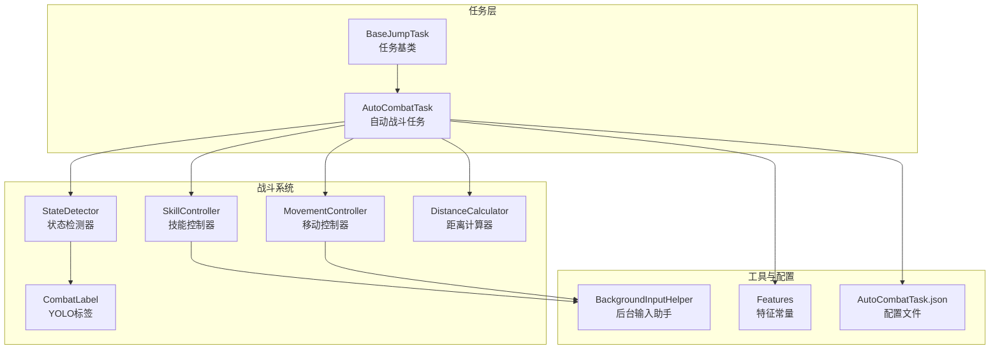
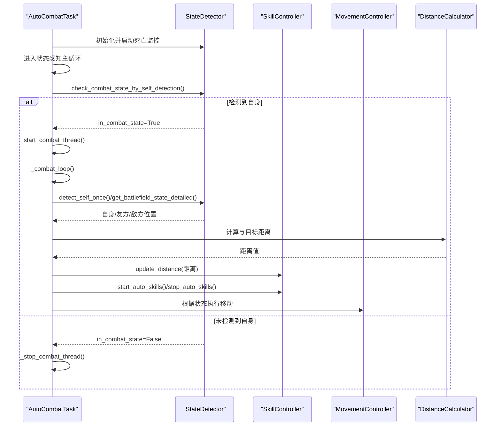
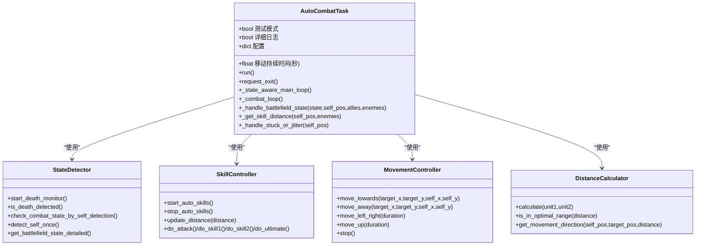
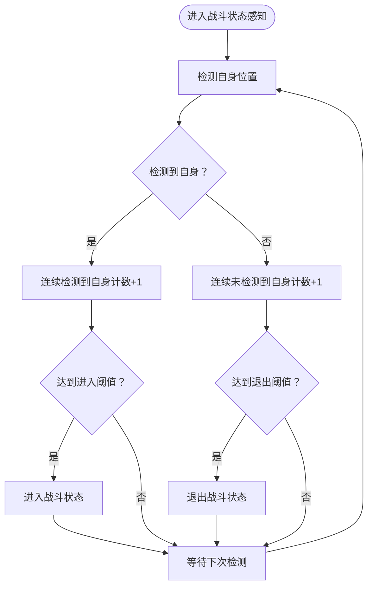
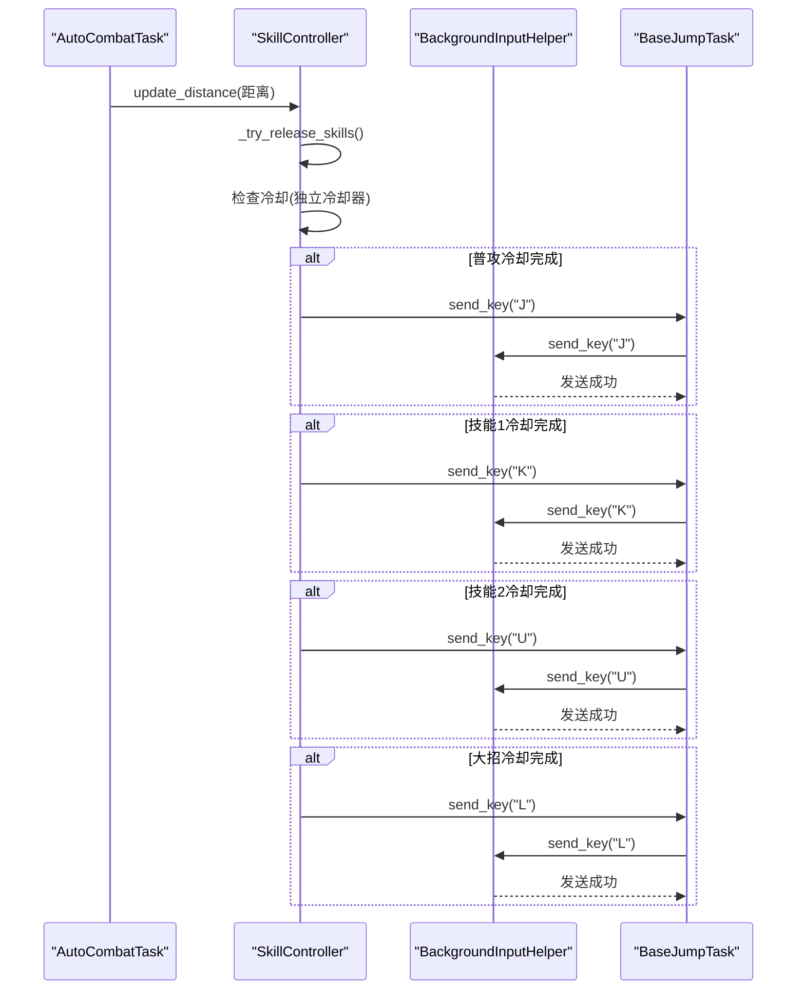
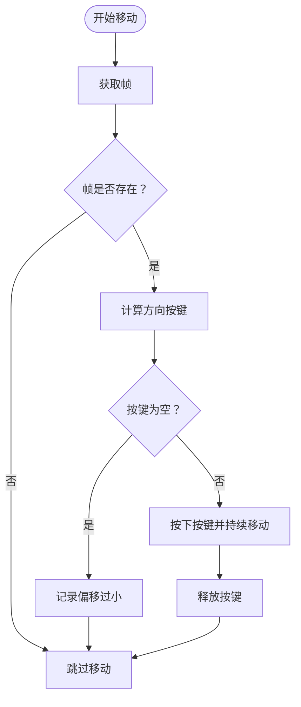
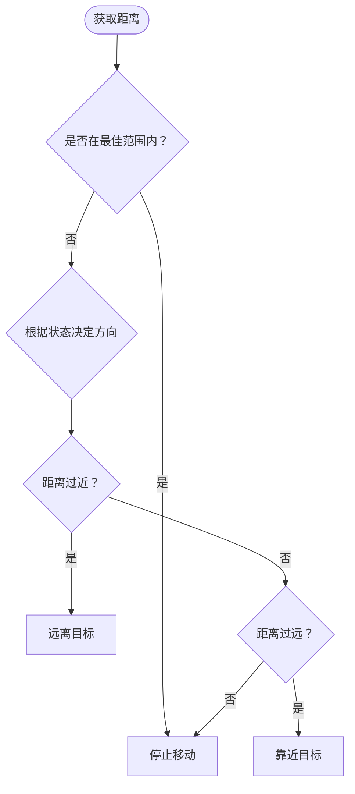
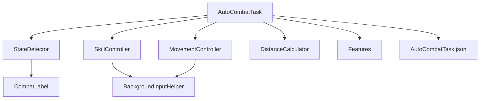

# 自动战斗任务

<cite>
**本文档引用的文件**
- [AutoCombatTask.py](file://src/task/AutoCombatTask.py)
- [state_detector.py](file://src/combat/state_detector.py)
- [skill_controller.py](file://src/combat/skill_controller.py)
- [movement_controller.py](file://src/combat/movement_controller.py)
- [distance_calculator.py](file://src/combat/distance_calculator.py)
- [labels.py](file://src/combat/labels.py)
- [BackgroundInputHelper.py](file://src/utils/BackgroundInputHelper.py)
- [features.py](file://src/constants/features.py)
- [AutoCombatTask.json](file://configs/AutoCombatTask.json)
- [BaseJumpTask.py](file://src/task/BaseJumpTask.py)
</cite>

## 目录
1. [简介](#简介)
2. [项目结构](#项目结构)
3. [核心组件](#核心组件)
4. [架构总览](#架构总览)
5. [详细组件分析](#详细组件分析)
6. [依赖关系分析](#依赖关系分析)
7. [性能考量](#性能考量)
8. [故障排查指南](#故障排查指南)
9. [结论](#结论)
10. [附录](#附录)

## 简介
本文件面向 ok-jump 项目的自动战斗任务，系统性解析 AutoCombatTask 类的复杂实现，涵盖自动战斗逻辑、状态检测、技能控制协调、移动控制算法、战斗任务与战斗系统模块的集成关系、配置选项以及性能优化与故障处理最佳实践。文档旨在帮助开发者与使用者全面理解自动战斗的工作原理与扩展方式。

## 项目结构
自动战斗任务位于 src/task/AutoCombatTask.py，围绕其构建的战斗系统模块包括：
- 战斗状态检测：src/combat/state_detector.py
- 技能控制：src/combat/skill_controller.py
- 移动控制：src/combat/movement_controller.py
- 距离计算：src/combat/distance_calculator.py
- YOLO 标签定义：src/combat/labels.py
- 后台输入支持：src/utils/BackgroundInputHelper.py
- 特征常量：src/constants/features.py
- 配置文件：configs/AutoCombatTask.json
- 任务基类：src/task/BaseJumpTask.py

图表来源
- [AutoCombatTask.py:1-1366](file://src/task/AutoCombatTask.py#L1-L1366)
- [state_detector.py:1-589](file://src/combat/state_detector.py#L1-L589)
- [skill_controller.py:1-589](file://src/combat/skill_controller.py#L1-L589)
- [movement_controller.py:1-687](file://src/combat/movement_controller.py#L1-L687)
- [distance_calculator.py:1-197](file://src/combat/distance_calculator.py#L1-L197)
- [labels.py:1-51](file://src/combat/labels.py#L1-L51)
- [BackgroundInputHelper.py:1-841](file://src/utils/BackgroundInputHelper.py#L1-L841)
- [features.py:1-100](file://src/constants/features.py#L1-L100)
- [AutoCombatTask.json:1-14](file://configs/AutoCombatTask.json#L1-L14)
- [BaseJumpTask.py:1-572](file://src/task/BaseJumpTask.py#L1-L572)

章节来源
- [AutoCombatTask.py:1-1366](file://src/task/AutoCombatTask.py#L1-L1366)
- [BaseJumpTask.py:26-572](file://src/task/BaseJumpTask.py#L26-L572)

## 核心组件
- AutoCombatTask：作为触发任务运行，负责整合状态检测、技能控制、移动控制与距离计算，实现完整的自动战斗逻辑。
- StateDetector：基于 YOLO 的战场状态检测器，支持死亡状态并行监控、自身检测、友方/敌方检测、战斗状态判断。
- SkillController：技能释放控制器，支持后台模式、独立冷却、多技能并发控制。
- MovementController：移动控制，支持 PC 端 WASD 键盘与手机端虚拟摇杆，具备后台输入支持。
- DistanceCalculator：距离计算与范围判断，提供滞后效应避免边界抖动。
- BackgroundInputHelper：为 Unity 游戏提供可靠的后台输入支持，避免窗口前置。
- Features：统一管理特征名称常量，确保与 coco_detection.json 一致。
- AutoCombatTask.json：自动战斗任务配置文件，定义技能开关、间隔与移动持续时间等。

章节来源
- [AutoCombatTask.py:35-141](file://src/task/AutoCombatTask.py#L35-L141)
- [state_detector.py:24-63](file://src/combat/state_detector.py#L24-L63)
- [skill_controller.py:82-149](file://src/combat/skill_controller.py#L82-L149)
- [movement_controller.py:24-61](file://src/combat/movement_controller.py#L24-L61)
- [distance_calculator.py:14-51](file://src/combat/distance_calculator.py#L14-L51)
- [BackgroundInputHelper.py:99-148](file://src/utils/BackgroundInputHelper.py#L99-L148)
- [features.py:9-99](file://src/constants/features.py#L9-L99)
- [AutoCombatTask.json:1-14](file://configs/AutoCombatTask.json#L1-L14)

## 架构总览
自动战斗任务采用“任务编排 + 模块化控制器”的架构设计：
- 任务层：AutoCombatTask 作为触发任务，负责生命周期管理、状态感知主循环、战斗线程调度与资源清理。
- 检测层：StateDetector 提供 YOLO 检测能力，支持死亡状态并行监控与战斗状态判断。
- 控制层：SkillController 与 MovementController 分别负责技能释放与移动控制，均支持后台模式。
- 计算层：DistanceCalculator 提供距离计算与范围判断，配合滞后效应提升稳定性。
- 工具层：BackgroundInputHelper 提供跨平台后台输入支持，Features 提供统一特征常量。

图表来源
- [AutoCombatTask.py:452-516](file://src/task/AutoCombatTask.py#L452-L516)
- [AutoCombatTask.py:517-560](file://src/task/AutoCombatTask.py#L517-L560)
- [AutoCombatTask.py:561-648](file://src/task/AutoCombatTask.py#L561-L648)
- [state_detector.py:510-553](file://src/combat/state_detector.py#L510-L553)
- [skill_controller.py:226-244](file://src/combat/skill_controller.py#L226-L244)
- [distance_calculator.py:52-82](file://src/combat/distance_calculator.py#L52-L82)

## 详细组件分析

### AutoCombatTask 类分析
AutoCombatTask 是自动战斗的核心编排器，负责：
- 生命周期管理：类变量跟踪运行实例与暂停状态；实例变量管理战斗线程与退出标志。
- 配置驱动：从 AutoCombatTask.json 与 GUI 配置读取技能开关、间隔与移动持续时间。
- 状态感知主循环：通过 YOLO 自身检测判断战斗状态，动态启动/停止战斗线程。
- 战斗执行循环：在独立线程中持续检测自身、战场状态、距离并协调技能与移动。
- 死亡状态监控：并行后台线程快速检测死亡状态，主线程快速查询。
- 卡住/抖动检测：在无敌人在技能范围内时，基于位置历史与敌人最后位置进行检测与摆脱操作。
- 详细日志：可选详细日志输出，便于调试与性能分析。

图表来源
- [AutoCombatTask.py:35-141](file://src/task/AutoCombatTask.py#L35-L141)
- [state_detector.py:24-63](file://src/combat/state_detector.py#L24-L63)
- [skill_controller.py:82-149](file://src/combat/skill_controller.py#L82-L149)
- [movement_controller.py:24-61](file://src/combat/movement_controller.py#L24-L61)
- [distance_calculator.py:14-51](file://src/combat/distance_calculator.py#L14-L51)

章节来源
- [AutoCombatTask.py:143-289](file://src/task/AutoCombatTask.py#L143-L289)
- [AutoCombatTask.py:295-318](file://src/task/AutoCombatTask.py#L295-L318)
- [AutoCombatTask.py:323-355](file://src/task/AutoCombatTask.py#L323-L355)
- [AutoCombatTask.py:357-451](file://src/task/AutoCombatTask.py#L357-L451)
- [AutoCombatTask.py:452-516](file://src/task/AutoCombatTask.py#L452-L516)
- [AutoCombatTask.py:517-560](file://src/task/AutoCombatTask.py#L517-L560)
- [AutoCombatTask.py:561-648](file://src/task/AutoCombatTask.py#L561-L648)

### 战斗状态管理机制
- 死亡状态检测：StateDetector 启动后台线程，以高频检测死亡状态，主线程通过 is_death_detected() 快速查询。
- 自身检测：detect_self_once() 与 detect_self() 提供单次与超时检测，支持 15 秒超时与详细日志。
- 战场状态判断：get_battlefield_state_detailed() 在同一帧内检测友方与敌方，返回 BattlefieldState 枚举。
- 战斗状态感知：check_combat_state_by_self_detection() 使用防抖动机制，连续 N 次检测结果才确认状态变化。

图表来源
- [state_detector.py:510-553](file://src/combat/state_detector.py#L510-L553)
- [state_detector.py:555-563](file://src/combat/state_detector.py#L555-L563)
- [state_detector.py:565-578](file://src/combat/state_detector.py#L565-L578)
- [state_detector.py:580-588](file://src/combat/state_detector.py#L580-L588)

章节来源
- [state_detector.py:83-195](file://src/combat/state_detector.py#L83-L195)
- [state_detector.py:243-323](file://src/combat/state_detector.py#L243-L323)
- [state_detector.py:404-447](file://src/combat/state_detector.py#L404-L447)
- [state_detector.py:510-553](file://src/combat/state_detector.py#L510-L553)

### 技能释放控制逻辑
- 独立冷却机制：SkillCooldown 为每个技能维护独立冷却计时器，互不影响。
- 独立监控线程：_skill_monitor_loop() 持续监控距离并在范围内释放技能。
- 配置驱动：从 AutoCombatTask.json 与 GUI 配置读取技能开关与间隔。
- 后台输入支持：通过 BackgroundInputHelper 与任务基类的 send_key_* 方法实现后台按键发送。
- 手机端适配：支持虚拟摇杆点击与键盘按键双重方案。

图表来源
- [skill_controller.py:279-321](file://src/combat/skill_controller.py#L279-L321)
- [skill_controller.py:323-354](file://src/combat/skill_controller.py#L323-L354)
- [skill_controller.py:356-369](file://src/combat/skill_controller.py#L356-L369)
- [skill_controller.py:463-507](file://src/combat/skill_controller.py#L463-L507)
- [BackgroundInputHelper.py:310-356](file://src/utils/BackgroundInputHelper.py#L310-L356)
- [BaseJumpTask.py:140-156](file://src/task/BaseJumpTask.py#L140-L156)

章节来源
- [skill_controller.py:29-80](file://src/combat/skill_controller.py#L29-L80)
- [skill_controller.py:226-244](file://src/combat/skill_controller.py#L226-L244)
- [skill_controller.py:254-269](file://src/combat/skill_controller.py#L254-L269)
- [skill_controller.py:279-321](file://src/combat/skill_controller.py#L279-L321)
- [skill_controller.py:323-354](file://src/combat/skill_controller.py#L323-L354)
- [skill_controller.py:356-369](file://src/combat/skill_controller.py#L356-L369)
- [skill_controller.py:463-507](file://src/combat/skill_controller.py#L463-L507)

### 移动控制算法
- 方向计算：_calculate_keys() 根据 dx/dy 偏移计算八方向按键组合，支持阈值过滤。
- 持续时间：move_duration 控制每次移动按键的持续时间，支持配置。
- 后台输入：通过 BackgroundInputHelper 与任务基类的 send_key_down/up 实现后台按键。
- 手机端适配：_press_movement_keys_adb() 使用虚拟摇杆，循环发送短时间 swipe 形成连续移动。
- 可中断移动：move_with_interrupt_check() 支持在移动过程中定期检测停止条件。

图表来源
- [movement_controller.py:168-193](file://src/combat/movement_controller.py#L168-L193)
- [movement_controller.py:255-304](file://src/combat/movement_controller.py#L255-L304)
- [movement_controller.py:306-355](file://src/combat/movement_controller.py#L306-L355)
- [movement_controller.py:357-424](file://src/combat/movement_controller.py#L357-L424)
- [movement_controller.py:461-511](file://src/combat/movement_controller.py#L461-L511)

章节来源
- [movement_controller.py:39-61](file://src/combat/movement_controller.py#L39-L61)
- [movement_controller.py:168-193](file://src/combat/movement_controller.py#L168-L193)
- [movement_controller.py:255-304](file://src/combat/movement_controller.py#L255-L304)
- [movement_controller.py:306-355](file://src/combat/movement_controller.py#L306-L355)
- [movement_controller.py:357-424](file://src/combat/movement_controller.py#L357-L424)
- [movement_controller.py:461-511](file://src/combat/movement_controller.py#L461-L511)

### 距离计算与范围判断
- 距离计算：calculate() 与 calculate_from_coords() 提供两点间欧氏距离计算。
- 最佳攻击范围：MIN_DISTANCE=0，MAX_DISTANCE=225，BUFFER=15，提供滞后效应避免边界抖动。
- 方向建议：get_movement_direction() 根据当前状态与缓冲区判断移动方向（靠近/远离/停止）。
- 单位向量：get_movement_vector() 与 get_reverse_vector() 提供移动方向向量。

图表来源
- [distance_calculator.py:84-118](file://src/combat/distance_calculator.py#L84-L118)
- [distance_calculator.py:120-158](file://src/combat/distance_calculator.py#L120-L158)
- [distance_calculator.py:164-182](file://src/combat/distance_calculator.py#L164-L182)
- [distance_calculator.py:184-196](file://src/combat/distance_calculator.py#L184-L196)

章节来源
- [distance_calculator.py:52-82](file://src/combat/distance_calculator.py#L52-L82)
- [distance_calculator.py:84-118](file://src/combat/distance_calculator.py#L84-L118)
- [distance_calculator.py:120-158](file://src/combat/distance_calculator.py#L120-L158)
- [distance_calculator.py:164-182](file://src/combat/distance_calculator.py#L164-L182)
- [distance_calculator.py:184-196](file://src/combat/distance_calculator.py#L184-L196)

### 战斗任务与战斗系统模块的集成关系
- AutoCombatTask 通过 _init_controllers() 初始化 StateDetector、MovementController、SkillController 与 DistanceCalculator。
- StateDetector 依赖 CombatLabel 与 YOLO 检测结果，提供 BattlefieldState 枚举。
- SkillController 与 MovementController 通过任务基类的 send_key_* 与 click_* 方法实现输入，后台模式由 BackgroundInputHelper 提供支持。
- AutoCombatTask 的配置项来自 AutoCombatTask.json 与 GUI 配置，传递给各控制器。

章节来源
- [AutoCombatTask.py:265-289](file://src/task/AutoCombatTask.py#L265-L289)
- [labels.py:8-50](file://src/combat/labels.py#L8-L50)
- [AutoCombatTask.json:1-14](file://configs/AutoCombatTask.json#L1-L14)

## 依赖关系分析
- AutoCombatTask 依赖 StateDetector、SkillController、MovementController、DistanceCalculator。
- StateDetector 依赖 CombatLabel 与 YOLO 检测。
- SkillController 与 MovementController 依赖 BackgroundInputHelper 与任务基类的输入方法。
- Features 提供统一特征名称常量，确保与配置文件一致。

图表来源
- [AutoCombatTask.py:265-289](file://src/task/AutoCombatTask.py#L265-L289)
- [state_detector.py:16-37](file://src/combat/state_detector.py#L16-L37)
- [skill_controller.py:172-201](file://src/combat/skill_controller.py#L172-L201)
- [movement_controller.py:76-104](file://src/combat/movement_controller.py#L76-L104)
- [features.py:9-99](file://src/constants/features.py#L9-L99)
- [AutoCombatTask.json:1-14](file://configs/AutoCombatTask.json#L1-L14)

章节来源
- [AutoCombatTask.py:265-289](file://src/task/AutoCombatTask.py#L265-L289)
- [state_detector.py:16-37](file://src/combat/state_detector.py#L16-L37)
- [skill_controller.py:172-201](file://src/combat/skill_controller.py#L172-L201)
- [movement_controller.py:76-104](file://src/combat/movement_controller.py#L76-L104)
- [features.py:9-99](file://src/constants/features.py#L9-L99)
- [AutoCombatTask.json:1-14](file://configs/AutoCombatTask.json#L1-L14)

## 性能考量
- 检测频率与线程模型：StateDetector 的死亡监控线程以 30ms 间隔检测，战斗状态感知主循环以 0.5 秒间隔检测，避免过度占用 CPU。
- 技能监控线程：SkillController 的独立监控线程以 0.02~0.05 秒休眠，降低 CPU 占用。
- 距离计算与范围判断：DistanceCalculator 的滞后效应减少频繁状态切换，提高稳定性。
- 后台输入优化：BackgroundInputHelper 在后台模式下使用 SendInput，避免窗口前置带来的额外开销。
- 移动控制：移动端使用短时间 swipe 循环，模拟连续移动，减少按键切换成本。

## 故障排查指南
- 自身检测失败：检查 YOLO 模型与标签配置，确认 CombatLabel 与 assets/Fight/fight.onnx 一致；查看详细日志定位帧获取失败与检测超时。
- 战斗状态抖动：检查防抖动阈值配置，适当提高进入/退出阈值；确认帧更新与检测频率。
- 技能释放异常：检查技能冷却间隔配置与按键映射；确认后台输入模式与窗口焦点状态。
- 移动控制失效：检查后台输入初始化与窗口句柄获取；确认分辨率适配与虚拟摇杆坐标。
- 战斗结束判断：确认 fight_end.png 模板与 OCR 文本匹配规则；检查模板阈值与 OCR 语言设置。

章节来源
- [AutoCombatTask.py:323-355](file://src/task/AutoCombatTask.py#L323-L355)
- [state_detector.py:243-323](file://src/combat/state_detector.py#L243-L323)
- [skill_controller.py:356-369](file://src/combat/skill_controller.py#L356-L369)
- [movement_controller.py:76-104](file://src/combat/movement_controller.py#L76-L104)
- [BackgroundInputHelper.py:177-197](file://src/utils/BackgroundInputHelper.py#L177-L197)

## 结论
AutoCombatTask 通过模块化设计实现了稳定的自动战斗逻辑：状态检测、技能控制、移动控制与距离计算协同工作，结合后台输入支持与配置驱动，能够在不同环境下可靠运行。通过合理配置与参数调优，可进一步提升战斗效率与稳定性。

## 附录
- 配置选项说明（来自 AutoCombatTask.json 与 GUI 配置）
  - 测试模式：启用后跳过场景检测，直接启动战斗逻辑（用于调试）。
  - 详细日志：启用后输出 YOLO 检测结果、位置、距离等详细信息。
  - 自动普攻/技能1/技能2/大招：技能开关，严格遵循 GUI 设置。
  - 普攻间隔/技能1间隔/技能2间隔/大招间隔：技能冷却时间（秒）。
  - 移动持续时间：每次移动按键的持续时间（秒），值越大移动距离越长。
- YOLO 标签定义（CombatLabel）
  - SELF：自己
  - ALLY：友方
  - ENEMY：敌军
  - DEATH：死亡状态
  - TARGET_CIRCLE：目标圈

章节来源
- [AutoCombatTask.json:1-14](file://configs/AutoCombatTask.json#L1-L14)
- [labels.py:8-50](file://src/combat/labels.py#L8-L50)