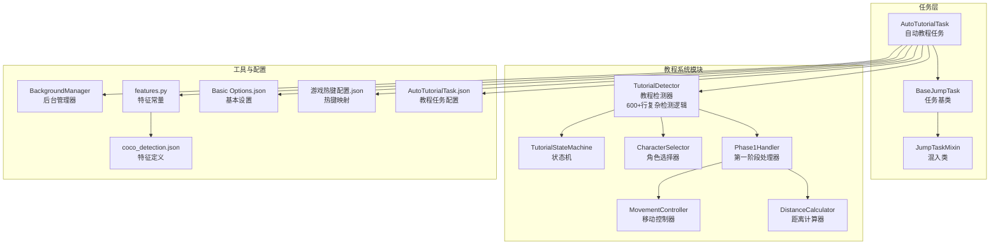
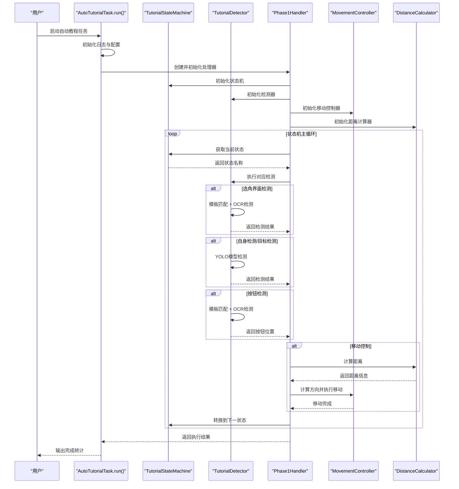
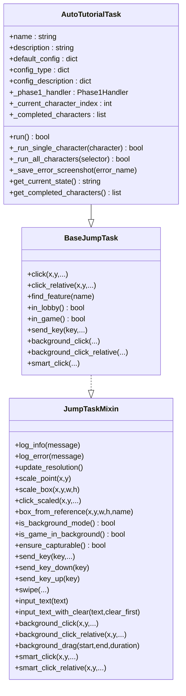
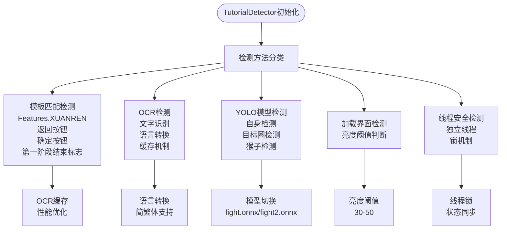
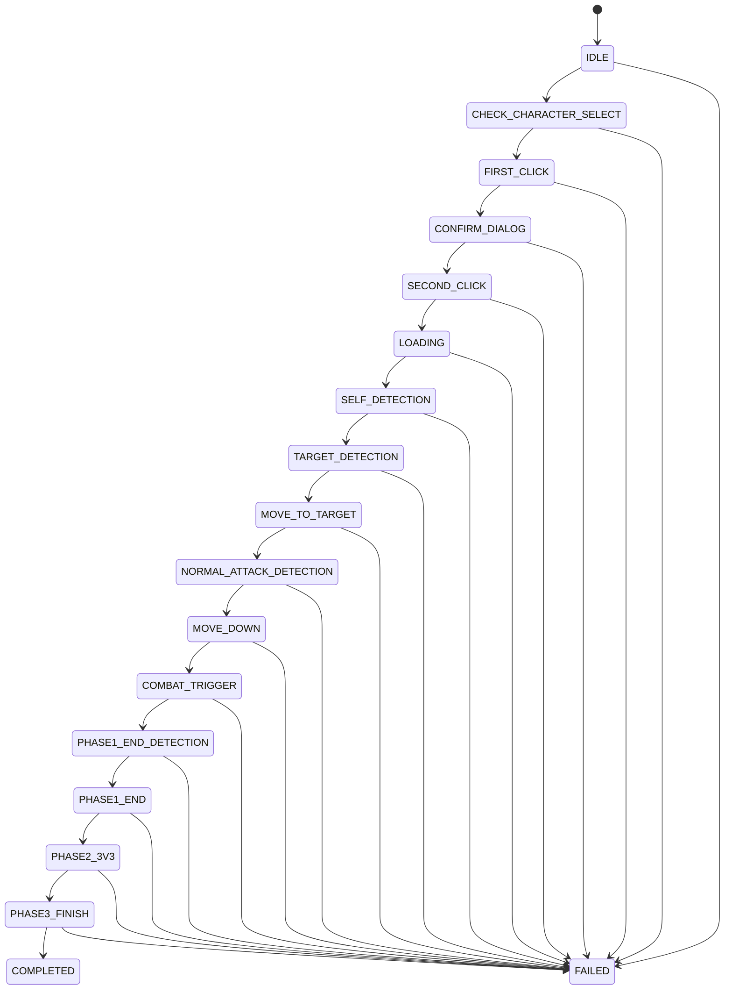
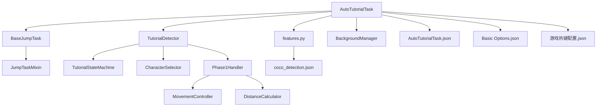

# 自动教程任务

<cite>
**本文档引用的文件**
- [AutoTutorialTask.py](file://src/task/AutoTutorialTask.py)
- [AutoTutorialTask.json](file://configs/AutoTutorialTask.json)
- [BaseJumpTask.py](file://src/task/BaseJumpTask.py)
- [mixins.py](file://src/task/mixins.py)
- [features.py](file://src/constants/features.py)
- [BackgroundManager.py](file://src/utils/BackgroundManager.py)
- [coco_detection.json](file://assets/coco_detection.json)
- [Basic Options.json](file://configs/Basic Options.json)
- [游戏热键配置.json](file://configs/游戏热键配置.json)
- [tutorial_detector.py](file://src/tutorial/tutorial_detector.py)
- [state_machine.py](file://src/tutorial/state_machine.py)
- [phase1_handler.py](file://src/tutorial/phase1_handler.py)
- [character_selector.py](file://src/tutorial/character_selector.py)
- [movement_controller.py](file://src/combat/movement_controller.py)
- [distance_calculator.py](file://src/combat/distance_calculator.py)
</cite>

## 更新摘要
**所做更改**
- 更新了AutoTutorialTask的架构分析，反映从简单脚本式到复杂多阶段智能系统的重大升级
- 新增了详细的教程检测系统架构说明，包括600+行的复杂检测逻辑
- 完善了状态机与流程控制的详细分析
- 更新了角色选择与配置管理的实现细节
- 增强了移动控制与自动战斗的处理机制
- 修订了配置参数与教程模式设置的说明
- 更新了故障排除指南和性能考量

## 目录
1. [简介](#简介)
2. [项目结构](#项目结构)
3. [核心组件](#核心组件)
4. [架构总览](#架构总览)
5. [详细组件分析](#详细组件分析)
6. [依赖关系分析](#依赖关系分析)
7. [性能考量](#性能考量)
8. [故障排除指南](#故障排除指南)
9. [结论](#结论)
10. [附录](#附录)

## 简介
本文档面向OK-Jump项目的"自动教程任务"（AutoTutorialTask），系统性阐述其工作原理与实现细节。AutoTutorialTask经历了重大架构升级，从简单的脚本式教程完成系统转变为复杂的多阶段、多角色支持的智能教程系统。新系统引入了状态机架构、角色选择器、相位处理器、增强的检测超时配置、移动控制参数和详细日志功能。

系统的核心能力包括：教程步骤检测、自动操作、进度跟踪、状态识别、操作序列控制与跳过机制。文档还覆盖配置参数、教程模式设置、难度选择（若存在）、启动流程、运行监控、异常处理与用户体验优化建议，并提供不同教程场景的处理示例与故障排除指南。

**更新** 本版本文档反映了教程检测系统的重大改进：新增专门的tutorial_detector.py模块，包含600+行的复杂界面检测逻辑，支持模板匹配、OCR检测和多种界面识别方法。

## 项目结构
AutoTutorialTask位于src/task目录，继承自BaseJumpTask，后者通过混入类提供通用的场景检测、分辨率适配、后台模式支持、伪最小化处理、键盘与鼠标输入适配等能力。教程系统现在包含完整的模块化架构，包括状态机管理、角色选择器、检测器封装和各阶段处理器。

**图表来源**
- [AutoTutorialTask.py:1-248](file://src/task/AutoTutorialTask.py#L1-L248)
- [BaseJumpTask.py:14-422](file://src/task/BaseJumpTask.py#L14-L422)
- [mixins.py:15-774](file://src/task/mixins.py#L15-L774)
- [features.py:9-93](file://src/constants/features.py#L9-L93)
- [BackgroundManager.py:7-155](file://src/utils/BackgroundManager.py#L7-L155)
- [coco_detection.json:1-384](file://assets/coco_detection.json#L1-L384)
- [Basic Options.json:1-13](file://configs/Basic Options.json#L1-L13)
- [游戏热键配置.json:1-6](file://configs/游戏热键配置.json#L1-L6)
- [AutoTutorialTask.json:1-13](file://configs/AutoTutorialTask.json#L1-L13)
- [tutorial_detector.py:1-638](file://src/tutorial/tutorial_detector.py#L1-L638)
- [state_machine.py:1-210](file://src/tutorial/state_machine.py#L1-L210)
- [phase1_handler.py:1-480](file://src/tutorial/phase1_handler.py#L1-L480)
- [character_selector.py:1-232](file://src/tutorial/character_selector.py#L1-L232)
- [movement_controller.py:1-508](file://src/combat/movement_controller.py#L1-L508)
- [distance_calculator.py:1-197](file://src/combat/distance_calculator.py#L1-L197)

## 核心组件
- AutoTutorialTask：自动教程任务主体，负责管理整个教程流程，支持多角色选择，集成状态机和检测器模块。
- TutorialDetector：新增的600+行复杂检测器，提供统一的界面检测接口，封装YOLO、OCR和模板匹配等多种检测方法。
- TutorialStateMachine：状态机管理，定义完整的教程状态转换逻辑和失败处理机制。
- CharacterSelector：角色选择器，管理角色配置和点击区域计算，支持单角色和多角色执行模式。
- Phase1Handler：第一阶段处理器，实现教程第一阶段的完整流程控制。
- MovementController：移动控制器，支持PC端WASD键盘控制和手机端虚拟摇杆控制。
- DistanceCalculator：距离计算器，提供带滞后的最佳攻击距离判断和移动方向建议。
- BaseJumpTask：任务基类，提供截图、点击、场景检测、登录等待、分辨率适配、后台模式支持、伪最小化、键盘与鼠标输入适配等通用能力。
- JumpTaskMixin：混入类，封装通用功能（场景检测、日志、分辨率缩放、后台模式、后台输入、智能点击等），避免重复代码。
- features与coco_detection：统一管理特征名称与类别定义，确保特征检测一致性。
- BackgroundManager：后台模式与伪最小化管理，决定是否使用SendInput后台点击。
- 配置文件：AutoTutorialTask.json（任务开关与参数）、Basic Options.json（基本设置）、游戏热键配置.json（热键映射）。

**章节来源**
- [AutoTutorialTask.py:27-248](file://src/task/AutoTutorialTask.py#L27-L248)
- [tutorial_detector.py:21-638](file://src/tutorial/tutorial_detector.py#L21-L638)
- [state_machine.py:10-210](file://src/tutorial/state_machine.py#L10-L210)
- [character_selector.py:69-232](file://src/tutorial/character_selector.py#L69-L232)
- [phase1_handler.py:22-480](file://src/tutorial/phase1_handler.py#L22-L480)
- [movement_controller.py:24-508](file://src/combat/movement_controller.py#L24-L508)
- [distance_calculator.py:14-197](file://src/combat/distance_calculator.py#L14-L197)
- [BaseJumpTask.py:14-422](file://src/task/BaseJumpTask.py#L14-L422)
- [mixins.py:15-774](file://src/task/mixins.py#L15-L774)
- [features.py:9-93](file://src/constants/features.py#L9-L93)
- [BackgroundManager.py:7-155](file://src/utils/BackgroundManager.py#L7-L155)
- [AutoTutorialTask.json:1-13](file://configs/AutoTutorialTask.json#L1-L13)
- [Basic Options.json:1-13](file://configs/Basic Options.json#L1-L13)
- [游戏热键配置.json:1-6](file://configs/游戏热键配置.json#L1-L6)

## 架构总览
AutoTutorialTask采用"状态机驱动的模块化架构"，结合复杂的界面检测系统，实现跨前台/后台的稳定自动化教程流程。

**图表来源**
- [AutoTutorialTask.py:81-248](file://src/task/AutoTutorialTask.py#L81-L248)
- [phase1_handler.py:90-480](file://src/tutorial/phase1_handler.py#L90-L480)
- [tutorial_detector.py:21-638](file://src/tutorial/tutorial_detector.py#L21-L638)
- [state_machine.py:54-210](file://src/tutorial/state_machine.py#L54-L210)
- [movement_controller.py:102-508](file://src/combat/movement_controller.py#L102-L508)
- [distance_calculator.py:52-197](file://src/combat/distance_calculator.py#L52-L197)

**章节来源**
- [AutoTutorialTask.py:81-248](file://src/task/AutoTutorialTask.py#L81-L248)
- [phase1_handler.py:90-480](file://src/tutorial/phase1_handler.py#L90-L480)
- [tutorial_detector.py:21-638](file://src/tutorial/tutorial_detector.py#L21-L638)
- [state_machine.py:54-210](file://src/tutorial/state_machine.py#L54-L210)
- [movement_controller.py:102-508](file://src/combat/movement_controller.py#L102-L508)
- [distance_calculator.py:52-197](file://src/combat/distance_calculator.py#L52-L197)

## 详细组件分析

### AutoTutorialTask类分析
- 初始化与默认配置
  - name/description：任务标识与描述
  - default_config：包含启用开关、角色选择、多个超时配置、移动参数和详细日志开关
  - config_type：角色选择下拉框配置
  - config_description：详细配置描述
- run主循环
  - 启动日志与启用校验
  - 根据角色选择模式（单个或全部）执行相应的教程流程
  - 支持多角色依次执行，包含错误处理和截图保存
  - 清理资源并返回执行结果
- 多角色执行机制
  - 单角色模式：直接执行指定角色的新手教程
  - 全模式：按悟空→小鸣人→路飞顺序依次执行
  - 支持角色间等待时间和完成状态追踪

**图表来源**
- [AutoTutorialTask.py:27-248](file://src/task/AutoTutorialTask.py#L27-L248)
- [BaseJumpTask.py:14-422](file://src/task/BaseJumpTask.py#L14-L422)
- [mixins.py:15-774](file://src/task/mixins.py#L15-L774)

**章节来源**
- [AutoTutorialTask.py:27-248](file://src/task/AutoTutorialTask.py#L27-L248)
- [BaseJumpTask.py:14-422](file://src/task/BaseJumpTask.py#L14-L422)
- [mixins.py:15-774](file://src/task/mixins.py#L15-L774)

### 教程检测系统架构
**更新** 新增的TutorialDetector模块提供了完整的界面检测系统，包含600+行复杂逻辑：

- 检测器核心功能
  - 统一检测接口：封装YOLO、OCR和模板匹配
  - 多种检测方法：模板匹配（Features.XUANREN）、OCR检测、YOLO模型检测
  - 线程安全设计：支持独立线程的结束检测
  - 缓存机制：OCR结果缓存优化性能
  - 详细日志：可配置的调试日志输出
- 检测方法分类
  - 选角界面检测：模板匹配 + OCR双重检测
  - 按钮检测：返回按钮、确定按钮的模板匹配 + OCR检测
  - 加载界面检测：亮度阈值判断
  - YOLO检测：自身检测、目标圈检测、猴子检测
  - 普攻按钮检测：OCR文字识别
  - 第一阶段结束检测：独立线程的end01/end02检测

**图表来源**
- [tutorial_detector.py:21-638](file://src/tutorial/tutorial_detector.py#L21-L638)

**章节来源**
- [tutorial_detector.py:21-638](file://src/tutorial/tutorial_detector.py#L21-L638)

### 状态机与流程控制
- 状态机设计
  - 完整状态流程：IDLE → CHECK_CHARACTER_SELECT → FIRST_CLICK → CONFIRM_DIALOG → SECOND_CLICK → LOADING → SELF_DETECTION → TARGET_DETECTION → MOVE_TO_TARGET → NORMAL_ATTACK_DETECTION → MOVE_DOWN → COMBAT_TRIGGER → PHASE1_END_DETECTION → PHASE1_END → [预留] → COMPLETED
  - 状态转换映射：定义每个状态允许的转换目标
  - 失败处理：记录失败原因并标记FAILED状态
  - 历史追踪：维护状态转换历史
- Phase1Handler处理器
  - 状态处理方法：每个状态对应专门的处理函数
  - 配置管理：从AutoTutorialTask配置读取参数
  - 错误处理：异常捕获和截图保存
  - 资源清理：线程停止和移动控制器清理

**图表来源**
- [state_machine.py:10-210](file://src/tutorial/state_machine.py#L10-L210)

**章节来源**
- [state_machine.py:10-210](file://src/tutorial/state_machine.py#L10-L210)
- [phase1_handler.py:22-480](file://src/tutorial/phase1_handler.py#L22-L480)

### 角色选择与配置管理
- 角色类型枚举：WUKONG（悟空）、LUFFY（路飞）、NARUTO（小鸣人）、ALL（全部）
- 角色配置数据类：包含点击区域、目标类型、YOLO模型和标签ID
- 点击区域计算：基于屏幕宽度的比例计算，支持相对位置和绝对位置
- 执行顺序：悟空→小鸣人→路飞的固定顺序
- 配置映射：不同角色使用不同的YOLO模型和目标检测类型

**章节来源**
- [character_selector.py:12-232](file://src/tutorial/character_selector.py#L12-L232)

### 移动控制与自动战斗
- 移动控制器：支持PC端WASD键盘和手机端虚拟摇杆
- 智能按键：根据目标位置计算移动方向，支持八方向移动
- 后台模式：支持SendInput和pydirectinput两种输入方式
- 自动战斗触发：通过独立线程启动AutoCombatTask
- 距离计算：使用DistanceCalculator计算目标距离

**章节来源**
- [movement_controller.py:24-508](file://src/combat/movement_controller.py#L24-L508)
- [distance_calculator.py:14-197](file://src/combat/distance_calculator.py#L14-L197)

### 配置参数与教程模式设置
- AutoTutorialTask.json
  - 角色选择：'悟空'、'路飞'、'小鸣人'、'全部'
  - 超时配置：选角界面检测超时、自身检测超时、目标检测超时、普攻检测超时、第一阶段结束检测超时
  - 时间配置：加载后等待时间、向下移动时间、移动持续时间、点击后等待时间
  - 详细日志：启用调试日志输出
- Basic Options.json
  - 后台模式：是否启用后台模式（影响是否使用SendInput）
  - 最小化时伪最小化：窗口最小化时是否执行伪最小化
  - 后台时静音游戏：后台时是否静音
- 游戏热键配置.json
  - 普通攻击、技能1、技能2、大招：对应键位映射

**章节来源**
- [AutoTutorialTask.json:1-13](file://configs/AutoTutorialTask.json#L1-L13)
- [Basic Options.json:1-13](file://configs/Basic Options.json#L1-L13)
- [游戏热键配置.json:1-6](file://configs/游戏热键配置.json#L1-L6)

## 依赖关系分析
- AutoTutorialTask依赖完整的教程系统模块，包括状态机、检测器、处理器和移动控制器
- TutorialDetector作为核心检测模块，依赖features.py中的特征定义和combat.labels中的标签定义
- Phase1Handler依赖MovementController进行移动控制和DistanceCalculator进行距离计算
- 所有模块都依赖BaseJumpTask提供的基础功能和配置管理
- 后台模式与伪最小化由BackgroundManager统一管理

**图表来源**
- [AutoTutorialTask.py:1-248](file://src/task/AutoTutorialTask.py#L1-L248)
- [BaseJumpTask.py:14-422](file://src/task/BaseJumpTask.py#L14-L422)
- [mixins.py:15-774](file://src/task/mixins.py#L15-L774)
- [features.py:9-93](file://src/constants/features.py#L9-L93)
- [coco_detection.json:1-384](file://assets/coco_detection.json#L1-L384)
- [BackgroundManager.py:7-155](file://src/utils/BackgroundManager.py#L7-L155)
- [AutoTutorialTask.json:1-13](file://configs/AutoTutorialTask.json#L1-L13)
- [Basic Options.json:1-13](file://configs/Basic Options.json#L1-L13)
- [游戏热键配置.json:1-6](file://configs/游戏热键配置.json#L1-L6)

**章节来源**
- [AutoTutorialTask.py:1-248](file://src/task/AutoTutorialTask.py#L1-L248)
- [BaseJumpTask.py:14-422](file://src/task/BaseJumpTask.py#L14-L422)
- [mixins.py:15-774](file://src/task/mixins.py#L15-L774)
- [features.py:9-93](file://src/constants/features.py#L9-L93)
- [coco_detection.json:1-384](file://assets/coco_detection.json#L1-L384)
- [BackgroundManager.py:7-155](file://src/utils/BackgroundManager.py#L7-L155)
- [AutoTutorialTask.json:1-13](file://configs/AutoTutorialTask.json#L1-L13)
- [Basic Options.json:1-13](file://configs/Basic Options.json#L1-L13)
- [游戏热键配置.json:1-6](file://configs/游戏热键配置.json#L1-L6)

## 性能考量
- 检测器优化
  - OCR缓存机制：减少重复OCR调用，提升检测速度
  - 线程安全设计：独立线程处理第一阶段结束检测，避免阻塞主流程
  - 多重检测方法：模板匹配优先，OCR作为后备，YOLO用于精确检测
- 状态机效率
  - 状态转换映射：预定义允许的转换组合，避免无效状态转换
  - 超时控制：每个检测步骤都有明确的超时限制
- 移动控制优化
  - 智能按键计算：只在方向改变时停止，减少按键释放开销
  - 后台模式适配：根据环境自动选择最优输入方式
  - 距离计算优化：带滞后的最佳攻击距离判断，避免频繁切换
- 建议
  - 根据实际游戏帧率适当调整超时时间
  - 在高延迟环境下可增加超时时间，避免误判
  - 对频繁出现的检测可考虑缓存最近一次检测结果
  - 启用详细日志仅在调试时使用，避免影响性能

## 故障排除指南
- 症状：教程无法开始或反复检测不到教程
  - 排查：确认AutoTutorialTask.json中"启用"为true；检查TutorialDetector的detect_character_select_screen方法
  - 参考：选角界面检测逻辑与模板匹配 + OCR双重检测
- 症状：对话跳过无效
  - 排查：确认"自动跳过对话"开启；检查TutorialDetector的detect_back_button和detect_confirm_button方法
  - 参考：按钮检测逻辑与模板匹配 + OCR检测
- 症状：引导点击无效
  - 排查：确认"自动点击引导"开启；检查"tutorial_arrow"、"tutorial_highlight"、"tutorial_button"特征是否存在
  - 参考：引导点击逻辑与点击间隔配置
- 症状：教学战斗未触发
  - 排查：确认"自动完成教学战斗"开启；检查"tutorial_combat_indicator"特征是否存在
  - 参考：教学战斗检测逻辑与热键配置
- 症状：后台模式下点击失败
  - 排查：确认Basic Options.json中"后台模式"开启；确认BackgroundManager检测到游戏在后台
  - 参考：后台模式与伪最小化管理
- 症状：角色选择失败
  - 排查：确认角色配置正确；检查CharacterSelector的点击区域计算
  - 参考：角色配置和点击位置计算
- 症状：移动控制异常
  - 排查：确认MovementController初始化正确；检查后台输入设置
  - 参考：移动控制和后台输入适配
- 症状：距离计算不准确
  - 排查：确认DistanceCalculator的缓冲区设置合理；检查目标检测稳定性
  - 参考：距离计算和滞回机制

**章节来源**
- [AutoTutorialTask.py:81-248](file://src/task/AutoTutorialTask.py#L81-L248)
- [tutorial_detector.py:56-112](file://src/tutorial/tutorial_detector.py#L56-L112)
- [tutorial_detector.py:116-198](file://src/tutorial/tutorial_detector.py#L116-L198)
- [tutorial_detector.py:200-260](file://src/tutorial/tutorial_detector.py#L200-L260)
- [phase1_handler.py:175-254](file://src/tutorial/phase1_handler.py#L175-L254)
- [character_selector.py:40-55](file://src/tutorial/character_selector.py#L40-L55)
- [movement_controller.py:72-100](file://src/combat/movement_controller.py#L72-L100)
- [distance_calculator.py:84-158](file://src/combat/distance_calculator.py#L84-L158)
- [BackgroundManager.py:43-76](file://src/utils/BackgroundManager.py#L43-L76)
- [Basic Options.json:1-13](file://configs/Basic Options.json#L1-L13)

## 结论
AutoTutorialTask通过全新的模块化架构，实现了更加稳定和强大的自动教程功能。新增的600+行TutorialDetector模块提供了完善的界面检测能力，结合状态机管理和多角色支持，能够处理复杂的教程场景。其配置灵活、扩展性强，能够根据不同游戏场景与设备环境进行适配。

**更新** 新架构显著提升了系统的智能化水平，通过状态机驱动的流程控制、多阶段检测机制和智能移动控制，大幅提高了教程完成的成功率和稳定性。建议在实际使用中结合日志与截图工具进行验证，并根据需要扩展难度选择与更精细的异常处理机制。

## 附录
- 教程场景处理示例
  - 场景A：对话较多但可跳过
    - 开启"自动跳过对话"，设置较短"对话等待时间(秒)"
  - 场景B：引导箭头频繁出现
    - 开启"自动点击引导"，设置合理"点击间隔(秒)"
  - 场景C：教学战斗阶段
    - 开启"自动完成教学战斗"，确保"游戏热键配置.json"正确
  - 场景D：多角色教程
    - 设置"角色选择"为"全部"，系统按悟空→小鸣人→路飞顺序执行
  - 场景E：移动精度要求高的场景
    - 调整"移动持续时间(秒)"参数，使用DistanceCalculator的滞回机制
- 用户体验优化建议
  - 在任务启动前显示配置摘要与预期耗时
  - 提供暂停/恢复机制与手动干预入口
  - 增加失败重试与容错策略（如重复点击引导）
  - 启用详细日志仅在调试时使用，避免影响性能
  - 定期更新YOLO模型和OCR字典以提高检测准确性
  - 根据游戏帧率动态调整超时参数