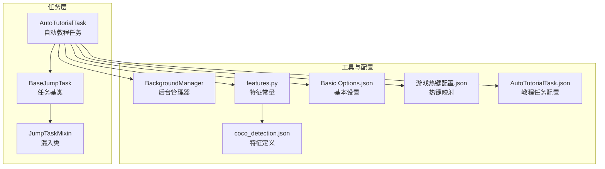
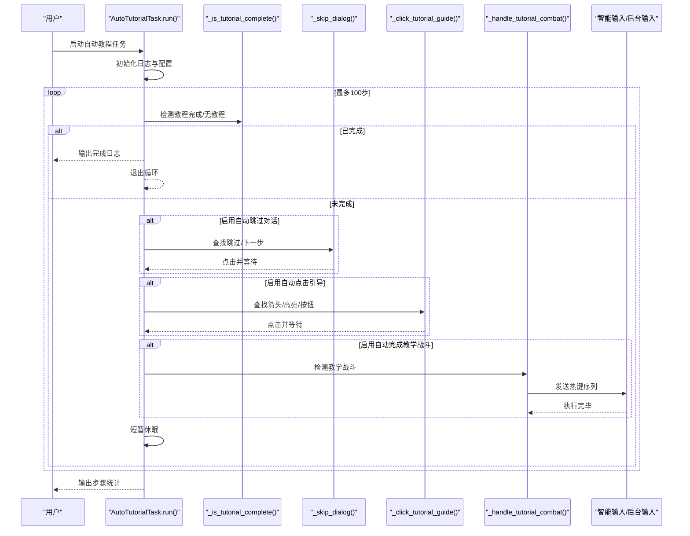
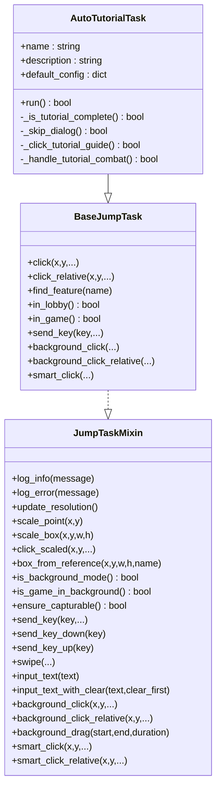
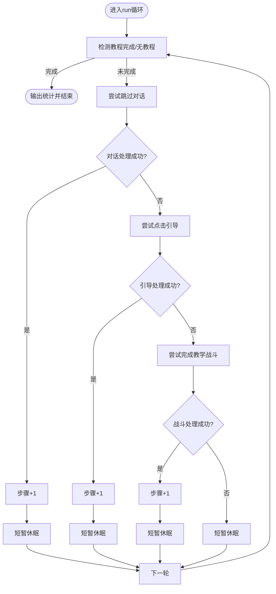
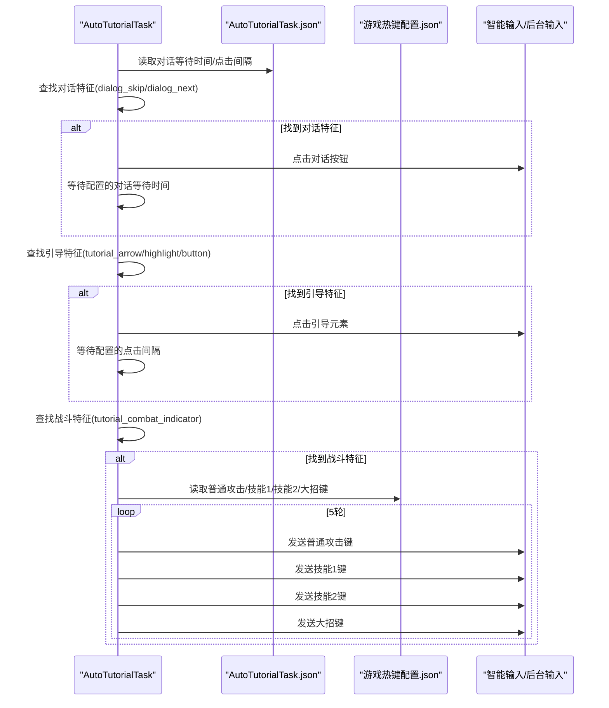
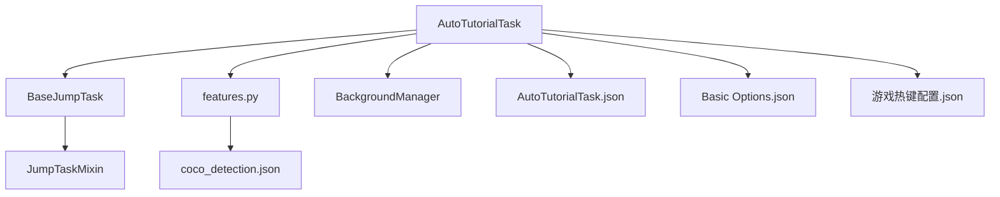

# 自动教程任务

<cite>
**本文档引用的文件**
- [AutoTutorialTask.py](file://src/task/AutoTutorialTask.py)
- [AutoTutorialTask.json](file://configs/AutoTutorialTask.json)
- [BaseJumpTask.py](file://src/task/BaseJumpTask.py)
- [mixins.py](file://src/task/mixins.py)
- [features.py](file://src/constants/features.py)
- [BackgroundManager.py](file://src/utils/BackgroundManager.py)
- [coco_detection.json](file://assets/coco_detection.json)
- [Basic Options.json](file://configs/Basic Options.json)
- [游戏热键配置.json](file://configs/游戏热键配置.json)
</cite>

## 目录
1. [简介](#简介)
2. [项目结构](#项目结构)
3. [核心组件](#核心组件)
4. [架构总览](#架构总览)
5. [详细组件分析](#详细组件分析)
6. [依赖关系分析](#依赖关系分析)
7. [性能考量](#性能考量)
8. [故障排除指南](#故障排除指南)
9. [结论](#结论)
10. [附录](#附录)

## 简介
本文件面向OK-Jump项目的“自动教程任务”（AutoTutorialTask），系统性阐述其工作原理与实现细节，包括教程步骤检测、自动操作、进度跟踪、状态识别、操作序列控制与跳过机制等关键能力。文档还覆盖配置参数、教程模式设置、难度选择（若存在）、启动流程、运行监控、异常处理与用户体验优化建议，并提供不同教程场景的处理示例与故障排除指南。

## 项目结构
AutoTutorialTask位于src/task目录，继承自BaseJumpTask，后者通过混入类提供通用的场景检测、分辨率适配、后台模式支持、伪最小化处理、键盘与鼠标输入适配等能力。特征检测基于assets/coco_detection.json中的类别定义，通过src/constants/features.py提供的特征名称常量统一管理。

**图表来源**
- [AutoTutorialTask.py:1-154](file://src/task/AutoTutorialTask.py#L1-L154)
- [BaseJumpTask.py:14-422](file://src/task/BaseJumpTask.py#L14-L422)
- [mixins.py:15-774](file://src/task/mixins.py#L15-L774)
- [features.py:9-86](file://src/constants/features.py#L9-L86)
- [BackgroundManager.py:7-155](file://src/utils/BackgroundManager.py#L7-L155)
- [coco_detection.json:1-384](file://assets/coco_detection.json#L1-L384)
- [Basic Options.json:1-13](file://configs/Basic Options.json#L1-L13)
- [游戏热键配置.json:1-6](file://configs/游戏热键配置.json#L1-L6)
- [AutoTutorialTask.json:1-8](file://configs/AutoTutorialTask.json#L1-L8)

**章节来源**
- [AutoTutorialTask.py:1-154](file://src/task/AutoTutorialTask.py#L1-L154)
- [BaseJumpTask.py:14-422](file://src/task/BaseJumpTask.py#L14-L422)
- [mixins.py:15-774](file://src/task/mixins.py#L15-L774)
- [features.py:9-86](file://src/constants/features.py#L9-L86)
- [BackgroundManager.py:7-155](file://src/utils/BackgroundManager.py#L7-L155)
- [coco_detection.json:1-384](file://assets/coco_detection.json#L1-L384)
- [Basic Options.json:1-13](file://configs/Basic Options.json#L1-L13)
- [游戏热键配置.json:1-6](file://configs/游戏热键配置.json#L1-L6)
- [AutoTutorialTask.json:1-8](file://configs/AutoTutorialTask.json#L1-L8)

## 核心组件
- AutoTutorialTask：自动教程任务主体，负责循环检测教程状态、自动跳过对话、点击引导、完成教学战斗，并统计步骤数。
- BaseJumpTask：任务基类，提供截图、点击、场景检测、登录等待、分辨率适配、后台模式支持、伪最小化、键盘与鼠标输入适配等通用能力。
- JumpTaskMixin：混入类，封装通用功能（场景检测、日志、分辨率缩放、后台模式、后台输入、智能点击等），避免重复代码。
- features与coco_detection：统一管理特征名称与类别定义，确保特征检测一致性。
- BackgroundManager：后台模式与伪最小化管理，决定是否使用SendInput后台点击。
- 配置文件：AutoTutorialTask.json（任务开关与参数）、Basic Options.json（基本设置）、游戏热键配置.json（热键映射）。

**章节来源**
- [AutoTutorialTask.py:5-154](file://src/task/AutoTutorialTask.py#L5-L154)
- [BaseJumpTask.py:14-422](file://src/task/BaseJumpTask.py#L14-L422)
- [mixins.py:15-774](file://src/task/mixins.py#L15-L774)
- [features.py:9-86](file://src/constants/features.py#L9-L86)
- [BackgroundManager.py:7-155](file://src/utils/BackgroundManager.py#L7-L155)
- [AutoTutorialTask.json:1-8](file://configs/AutoTutorialTask.json#L1-L8)
- [Basic Options.json:1-13](file://configs/Basic Options.json#L1-L13)
- [游戏热键配置.json:1-6](file://configs/游戏热键配置.json#L1-L6)

## 架构总览
AutoTutorialTask采用“状态检测—动作执行—进度统计”的循环控制流，结合特征检测与智能输入，实现跨前台/后台的稳定自动化。

**图表来源**
- [AutoTutorialTask.py:20-154](file://src/task/AutoTutorialTask.py#L20-L154)
- [mixins.py:425-489](file://src/task/mixins.py#L425-L489)
- [BackgroundManager.py:43-76](file://src/utils/BackgroundManager.py#L43-L76)

**章节来源**
- [AutoTutorialTask.py:20-154](file://src/task/AutoTutorialTask.py#L20-L154)
- [mixins.py:425-489](file://src/task/mixins.py#L425-L489)
- [BackgroundManager.py:43-76](file://src/utils/BackgroundManager.py#L43-L76)

## 详细组件分析

### AutoTutorialTask类分析
- 初始化与默认配置
  - name/description：任务标识与描述
  - default_config：包含启用开关与三个自动功能开关，以及对话等待时间与点击间隔两个参数
- run主循环
  - 启动日志与启用校验
  - 最多100步循环，依次尝试“教程完成检测”“自动跳过对话”“自动点击引导”“自动完成教学战斗”
  - 每步执行后根据返回值统计步骤数；若未触发任何动作则短暂休眠
  - 循环结束后输出完成统计
- 教程完成检测
  - 通过特征检测“tutorial_complete”或“no_tutorial_indicator”判断
  - 若在大厅且检测到“no_tutorial_indicator”，也视为完成
- 自动跳过对话
  - 优先检测“dialog_skip”，否则检测“dialog_next”
  - 点击后按配置等待相应秒数
- 自动点击引导
  - 依次检测“tutorial_arrow”“tutorial_highlight”“tutorial_button”
  - 点击后按配置间隔等待
- 自动完成教学战斗
  - 检测“tutorial_combat_indicator”
  - 读取游戏热键配置，循环发送普通攻击、技能1、技能2、大招键
  - 每个键之间与每轮之间设置固定延迟

**图表来源**
- [AutoTutorialTask.py:5-154](file://src/task/AutoTutorialTask.py#L5-L154)
- [BaseJumpTask.py:14-422](file://src/task/BaseJumpTask.py#L14-L422)
- [mixins.py:15-774](file://src/task/mixins.py#L15-L774)

**章节来源**
- [AutoTutorialTask.py:5-154](file://src/task/AutoTutorialTask.py#L5-L154)
- [BaseJumpTask.py:14-422](file://src/task/BaseJumpTask.py#L14-L422)
- [mixins.py:15-774](file://src/task/mixins.py#L15-L774)

### 教程状态识别与进度跟踪
- 状态识别
  - 通过特征检测“tutorial_complete”判定教程完成
  - 在大厅场景检测“no_tutorial_indicator”判定无教程
  - 通过场景检测方法（in_lobby/in_game）辅助判断
- 进度跟踪
  - 每次成功执行一个动作（跳过对话/点击引导/完成战斗）即增加步骤计数
  - 循环结束输出总步骤数

**图表来源**
- [AutoTutorialTask.py:34-58](file://src/task/AutoTutorialTask.py#L34-L58)
- [AutoTutorialTask.py:60-71](file://src/task/AutoTutorialTask.py#L60-L71)
- [AutoTutorialTask.py:73-94](file://src/task/AutoTutorialTask.py#L73-L94)
- [AutoTutorialTask.py:96-127](file://src/task/AutoTutorialTask.py#L96-L127)
- [AutoTutorialTask.py:129-153](file://src/task/AutoTutorialTask.py#L129-L153)

**章节来源**
- [AutoTutorialTask.py:34-71](file://src/task/AutoTutorialTask.py#L34-L71)
- [AutoTutorialTask.py:73-153](file://src/task/AutoTutorialTask.py#L73-L153)

### 操作序列控制与跳过机制
- 对话跳过/下一步
  - 优先“dialog_skip”，否则“dialog_next”
  - 点击后按“对话等待时间(秒)”等待
- 引导点击
  - 依次尝试“tutorial_arrow”“tutorial_highlight”“tutorial_button”
  - 点击后按“点击间隔(秒)”等待
- 教学战斗
  - 读取“游戏热键配置.json”中的普通攻击、技能1、技能2、大招键
  - 循环发送键序列，每键之间与每轮之间设置固定延迟

**图表来源**
- [AutoTutorialTask.py:73-153](file://src/task/AutoTutorialTask.py#L73-L153)
- [AutoTutorialTask.json:1-8](file://configs/AutoTutorialTask.json#L1-L8)
- [游戏热键配置.json:1-6](file://configs/游戏热键配置.json#L1-L6)
- [mixins.py:425-489](file://src/task/mixins.py#L425-L489)

**章节来源**
- [AutoTutorialTask.py:73-153](file://src/task/AutoTutorialTask.py#L73-L153)
- [AutoTutorialTask.json:1-8](file://configs/AutoTutorialTask.json#L1-L8)
- [游戏热键配置.json:1-6](file://configs/游戏热键配置.json#L1-L6)
- [mixins.py:425-489](file://src/task/mixins.py#L425-L489)

### 配置参数与教程模式设置
- AutoTutorialTask.json
  - 启用：是否启用自动教程任务
  - 自动跳过对话：是否启用自动跳过对话
  - 自动点击引导：是否启用自动点击引导
  - 自动完成教学战斗：是否启用自动完成教学战斗
  - 对话等待时间(秒)：对话处理后的等待秒数
  - 点击间隔(秒)：引导点击后的等待秒数
- Basic Options.json
  - 后台模式：是否启用后台模式（影响是否使用SendInput）
  - 最小化时伪最小化：窗口最小化时是否执行伪最小化
  - 后台时静音游戏：后台时是否静音
- 游戏热键配置.json
  - 普通攻击、技能1、技能2、大招：对应键位映射

注意：当前仓库未提供“教程难度选择”相关配置项；若需扩展难度控制，可在AutoTutorialTask中新增配置项并在run循环中按难度分支执行不同策略。

**章节来源**
- [AutoTutorialTask.json:1-8](file://configs/AutoTutorialTask.json#L1-L8)
- [Basic Options.json:1-13](file://configs/Basic Options.json#L1-L13)
- [游戏热键配置.json:1-6](file://configs/游戏热键配置.json#L1-L6)

## 依赖关系分析
- AutoTutorialTask依赖BaseJumpTask提供的特征检测、场景检测、点击与键盘输入能力
- BaseJumpTask通过JumpTaskMixin提供分辨率适配、后台模式、伪最小化、智能输入等通用能力
- 特征检测依赖coco_detection.json中的类别定义与features.py中的特征名称常量
- 后台模式与伪最小化由BackgroundManager统一管理

**图表来源**
- [AutoTutorialTask.py:1-154](file://src/task/AutoTutorialTask.py#L1-L154)
- [BaseJumpTask.py:14-422](file://src/task/BaseJumpTask.py#L14-L422)
- [mixins.py:15-774](file://src/task/mixins.py#L15-L774)
- [features.py:9-86](file://src/constants/features.py#L9-L86)
- [coco_detection.json:1-384](file://assets/coco_detection.json#L1-L384)
- [BackgroundManager.py:7-155](file://src/utils/BackgroundManager.py#L7-L155)
- [AutoTutorialTask.json:1-8](file://configs/AutoTutorialTask.json#L1-L8)
- [Basic Options.json:1-13](file://configs/Basic Options.json#L1-L13)
- [游戏热键配置.json:1-6](file://configs/游戏热键配置.json#L1-L6)

**章节来源**
- [AutoTutorialTask.py:1-154](file://src/task/AutoTutorialTask.py#L1-L154)
- [BaseJumpTask.py:14-422](file://src/task/BaseJumpTask.py#L14-L422)
- [mixins.py:15-774](file://src/task/mixins.py#L15-L774)
- [features.py:9-86](file://src/constants/features.py#L9-L86)
- [coco_detection.json:1-384](file://assets/coco_detection.json#L1-L384)
- [BackgroundManager.py:7-155](file://src/utils/BackgroundManager.py#L7-L155)
- [AutoTutorialTask.json:1-8](file://configs/AutoTutorialTask.json#L1-L8)
- [Basic Options.json:1-13](file://configs/Basic Options.json#L1-L13)
- [游戏热键配置.json:1-6](file://configs/游戏热键配置.json#L1-L6)

## 性能考量
- 循环节流：每步循环后短暂休眠，避免高频轮询造成CPU占用
- 特征检测：通过特征名称统一管理，减少误检与漏检
- 后台输入：在后台模式下使用SendInput，降低前台遮挡带来的失败率
- 分辨率适配：通过混入类的缩放方法保证不同分辨率下的点击精度
- 建议
  - 根据实际游戏帧率适当调整等待时间与点击间隔
  - 在高延迟环境下可增加等待时间，避免误判
  - 对频繁出现的特征可考虑缓存最近一次检测结果以减少重复计算

[本节为通用指导，无需具体文件分析]

## 故障排除指南
- 症状：教程无法开始或反复检测不到教程
  - 排查：确认AutoTutorialTask.json中“启用”为true；确认coco_detection.json中相关特征已正确标注
  - 参考：教程完成检测逻辑与特征名称
- 症状：对话跳过无效
  - 排查：确认“自动跳过对话”开启；检查“dialog_skip”“dialog_next”特征是否存在
  - 参考：对话跳过逻辑与等待时间配置
- 症状：引导点击无效
  - 排查：确认“自动点击引导”开启；检查“tutorial_arrow”“tutorial_highlight”“tutorial_button”特征是否存在
  - 参考：引导点击逻辑与点击间隔配置
- 症状：教学战斗未触发
  - 排查：确认“自动完成教学战斗”开启；检查“tutorial_combat_indicator”特征是否存在
  - 参考：教学战斗检测逻辑与热键配置
- 症状：后台模式下点击失败
  - 排查：确认Basic Options.json中“后台模式”开启；确认BackgroundManager检测到游戏在后台
  - 参考：后台模式与伪最小化管理

**章节来源**
- [AutoTutorialTask.py:25-27](file://src/task/AutoTutorialTask.py#L25-L27)
- [AutoTutorialTask.py:60-71](file://src/task/AutoTutorialTask.py#L60-L71)
- [AutoTutorialTask.py:73-94](file://src/task/AutoTutorialTask.py#L73-L94)
- [AutoTutorialTask.py:96-127](file://src/task/AutoTutorialTask.py#L96-L127)
- [AutoTutorialTask.py:129-153](file://src/task/AutoTutorialTask.py#L129-L153)
- [BackgroundManager.py:43-76](file://src/utils/BackgroundManager.py#L43-L76)
- [Basic Options.json:1-13](file://configs/Basic Options.json#L1-L13)

## 结论
AutoTutorialTask通过清晰的状态检测与动作执行流程，结合特征检测与智能输入，实现了对新手教程的自动化处理。其配置灵活、扩展性强，能够根据不同游戏场景与设备环境进行适配。建议在实际使用中结合日志与截图工具进行验证，并根据需要扩展难度选择与更精细的异常处理机制。

[本节为总结性内容，无需具体文件分析]

## 附录
- 教程场景处理示例
  - 场景A：对话较多但可跳过
    - 开启“自动跳过对话”，设置较短“对话等待时间(秒)”
  - 场景B：引导箭头频繁出现
    - 开启“自动点击引导”，设置合理“点击间隔(秒)”
  - 场景C：教学战斗阶段
    - 开启“自动完成教学战斗”，确保“游戏热键配置.json”正确
- 用户体验优化建议
  - 在任务启动前显示配置摘要与预期耗时
  - 提供暂停/恢复机制与手动干预入口
  - 增加失败重试与容错策略（如重复点击引导）

[本节为概念性内容，无需具体文件分析]