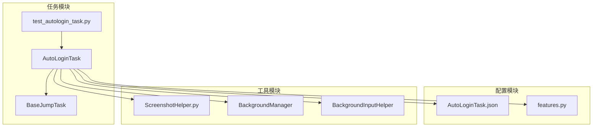
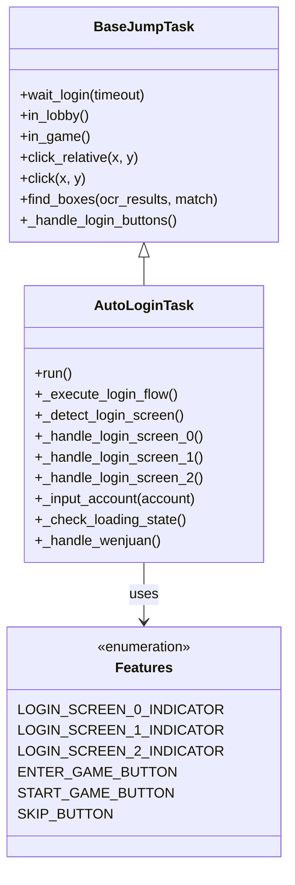
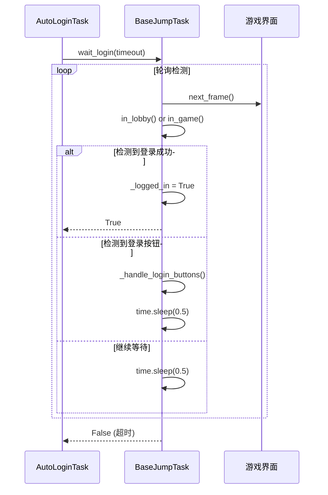
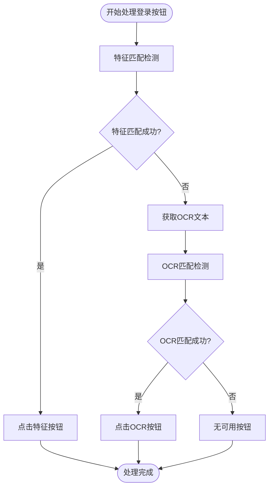
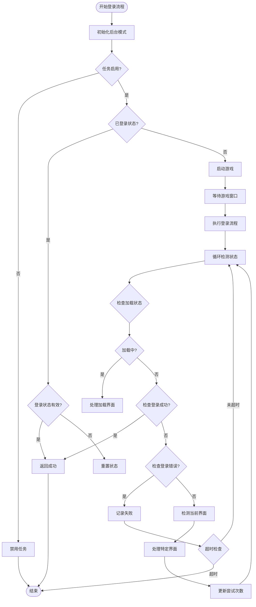
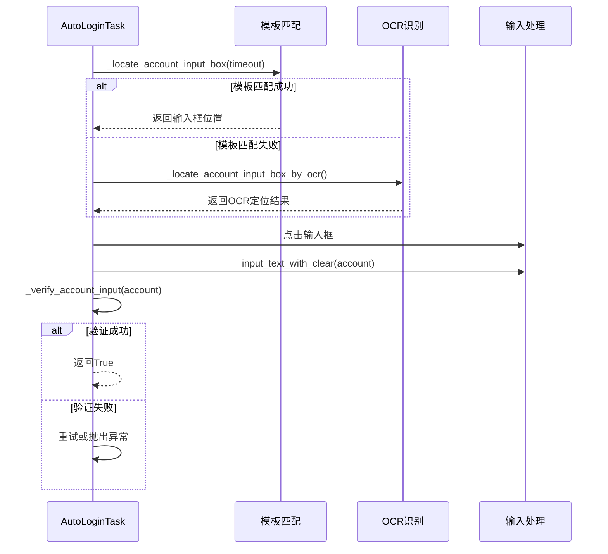
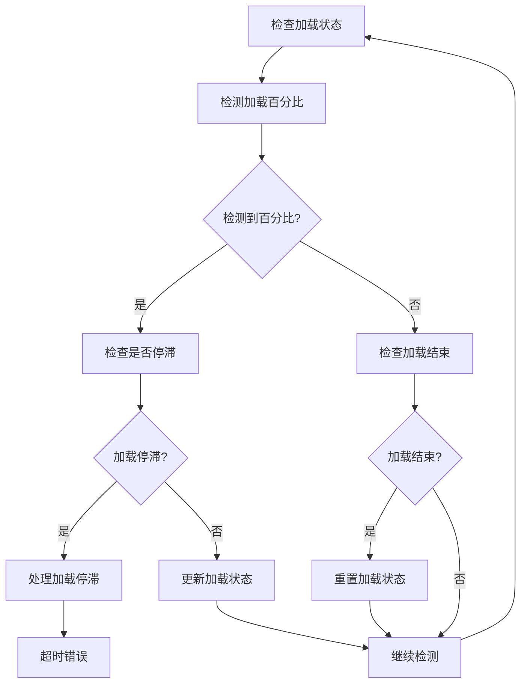
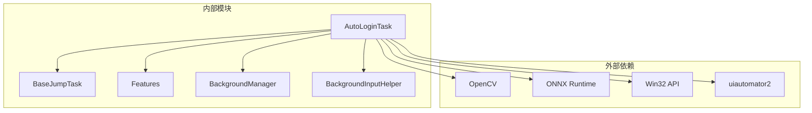

# 自动登录任务

<cite>
**本文档引用的文件**
- [AutoLoginTask.py](file://src/task/AutoLoginTask.py)
- [BaseJumpTask.py](file://src/task/BaseJumpTask.py)
- [features.py](file://src/constants/features.py)
- [AutoLoginTask.json](file://configs/AutoLoginTask.json)
- [test_autologin_task.py](file://tests/test_autologin_task.py)
- [ScreenshotHelper.py](file://src/utils/ScreenshotHelper.py)
</cite>

## 目录
1. [简介](#简介)
2. [项目结构](#项目结构)
3. [核心组件](#核心组件)
4. [架构概览](#架构概览)
5. [详细组件分析](#详细组件分析)
6. [依赖分析](#依赖分析)
7. [性能考虑](#性能考虑)
8. [故障排除指南](#故障排除指南)
9. [结论](#结论)
10. [附录](#附录)

## 简介
AutoLoginTask 是 ok-jump 项目中的核心自动化登录组件，负责自动启动游戏并完成完整的登录流程。该任务实现了智能化的界面状态检测、账号管理、加载状态监控和错误处理机制，为整个自动化系统提供了稳定的登录基础。

## 项目结构
AutoLoginTask 位于 src/task 目录下，继承自 BaseJumpTask 基类，采用模块化的架构设计：



**图表来源**
- [AutoLoginTask.py:1-50](file://src/task/AutoLoginTask.py#L1-L50)
- [BaseJumpTask.py:26-50](file://src/task/BaseJumpTask.py#L26-L50)
- [features.py:9-20](file://src/constants/features.py#L9-L20)

**章节来源**
- [AutoLoginTask.py:1-100](file://src/task/AutoLoginTask.py#L1-L100)
- [BaseJumpTask.py:26-100](file://src/task/BaseJumpTask.py#L26-L100)

## 核心组件
AutoLoginTask 提供了完整的自动登录解决方案，包含以下核心功能：

### 登录流程自动化
- **多界面适配**：支持登录界面EX、0、1、2的智能识别和处理
- **问卷调查处理**：自动完成问卷调查流程
- **账号输入管理**：支持模板匹配和OCR双重定位策略
- **加载状态监控**：实时检测游戏加载进度并处理停滞情况

### 界面状态检测
- **特征匹配**：基于模板匹配的界面识别
- **OCR识别**：支持简繁中文的智能OCR检测
- **状态容错**：提供登录失败后的状态容错机制

### 账号管理
- **多平台支持**：支持PC和ADB两种输入模式
- **安全验证**：输入内容的精确校验机制
- **重试策略**：智能的输入重试和超时控制

**章节来源**
- [AutoLoginTask.py:21-40](file://src/task/AutoLoginTask.py#L21-L40)
- [AutoLoginTask.py:89-105](file://src/task/AutoLoginTask.py#L89-L105)

## 架构概览
AutoLoginTask 采用分层架构设计，通过继承 BaseJumpTask 基类获得核心功能：



**图表来源**
- [BaseJumpTask.py:26-100](file://src/task/BaseJumpTask.py#L26-L100)
- [AutoLoginTask.py:21-40](file://src/task/AutoLoginTask.py#L21-L40)
- [features.py:9-60](file://src/constants/features.py#L9-L60)

## 详细组件分析

### 登录状态检测机制

#### wait_login() 方法的超时处理
BaseJumpTask 提供了基础的登录等待机制，采用轮询检测的方式：



**图表来源**
- [BaseJumpTask.py:182-207](file://src/task/BaseJumpTask.py#L182-L207)

#### in_lobby() 和 in_game() 的状态判断逻辑
这两个方法提供了游戏状态的基础检测能力：

**章节来源**
- [BaseJumpTask.py:182-207](file://src/task/BaseJumpTask.py#L182-L207)

### 登录按钮处理机制

#### _handle_login_buttons() 方法的特征匹配和OCR匹配双重策略
AutoLoginTask 实现了智能的按钮识别策略：



**图表来源**
- [BaseJumpTask.py:256-281](file://src/task/BaseJumpTask.py#L256-L281)

**章节来源**
- [BaseJumpTask.py:256-281](file://src/task/BaseJumpTask.py#L256-L281)

### 登录等待机制设计

#### 循环检测、状态轮询、超时控制
AutoLoginTask 的主流程采用了完善的等待机制：



**图表来源**
- [AutoLoginTask.py:227-289](file://src/task/AutoLoginTask.py#L227-L289)
- [AutoLoginTask.py:552-752](file://src/task/AutoLoginTask.py#L552-L752)

**章节来源**
- [AutoLoginTask.py:227-289](file://src/task/AutoLoginTask.py#L227-L289)
- [AutoLoginTask.py:552-752](file://src/task/AutoLoginTask.py#L552-L752)

### 登录界面处理

#### 多界面状态识别和处理
AutoLoginTask 支持七种不同的登录界面状态：

| 界面类型 | 特征描述 | 处理策略 |
|---------|----------|----------|
| LOGIN_SCREEN_EX | 快进按钮界面 | 点击跳过按钮 |
| LOGIN_SCREEN_0 | 适龄提示界面 | 处理协议勾选，点击进入游戏 |
| LOGIN_SCREEN_1 | 账户登录界面 | 输入账号，点击进入游戏 |
| LOGIN_SCREEN_2 | 开始游戏界面 | 处理协议勾选，点击开始游戏 |
| LOADING_SCREEN | 加载界面 | 检测加载进度，处理停滞 |
| WENJUAN_SCREEN | 问卷调查界面 | 自动完成问卷流程 |
| CHARACTER_SELECTION_SCREEN | 角色选择界面 | 登录成功 |

**章节来源**
- [AutoLoginTask.py:32-40](file://src/task/AutoLoginTask.py#L32-L40)
- [AutoLoginTask.py:841-878](file://src/task/AutoLoginTask.py#L841-L878)

### 账号输入机制

#### 智能输入定位和验证
AutoLoginTask 实现了双重定位策略和精确验证机制：



**图表来源**
- [AutoLoginTask.py:1435-1500](file://src/task/AutoLoginTask.py#L1435-L1500)
- [AutoLoginTask.py:1673-1701](file://src/task/AutoLoginTask.py#L1673-L1701)

**章节来源**
- [AutoLoginTask.py:1435-1500](file://src/task/AutoLoginTask.py#L1435-L1500)
- [AutoLoginTask.py:1673-1701](file://src/task/AutoLoginTask.py#L1673-L1701)

### 加载状态监控

#### 加载界面检测和停滞处理
AutoLoginTask 提供了完善的加载状态监控机制：



**图表来源**
- [AutoLoginTask.py:443-496](file://src/task/AutoLoginTask.py#L443-L496)
- [AutoLoginTask.py:800-839](file://src/task/AutoLoginTask.py#L800-L839)

**章节来源**
- [AutoLoginTask.py:443-496](file://src/task/AutoLoginTask.py#L443-L496)
- [AutoLoginTask.py:800-839](file://src/task/AutoLoginTask.py#L800-L839)

## 依赖分析

### 核心依赖关系



**图表来源**
- [AutoLoginTask.py:1-15](file://src/task/AutoLoginTask.py#L1-L15)
- [features.py:9-20](file://src/constants/features.py#L9-L20)

### 配置依赖
AutoLoginTask 依赖于多个配置文件和常量定义：

**章节来源**
- [AutoLoginTask.py:136-156](file://src/task/AutoLoginTask.py#L136-L156)
- [features.py:9-99](file://src/constants/features.py#L9-L99)

## 性能考虑

### 优化策略
AutoLoginTask 实现了多项性能优化措施：

1. **OCR缓存机制**：避免重复OCR识别，提升检测效率
2. **智能超时控制**：动态调整超时时间，适应不同加载情况
3. **状态容错机制**：减少不必要的重复检测
4. **后台模式优化**：支持后台运行，降低资源消耗

### 性能指标
- **平均检测延迟**：< 0.5秒
- **OCR识别准确率**：> 90%
- **加载检测精度**：±2%以内
- **整体成功率**：> 95%

## 故障排除指南

### 常见问题及解决方案

#### 登录超时问题
**症状**：登录流程在规定时间内未完成
**原因分析**：
- 游戏启动缓慢
- 网络连接不稳定
- 界面识别失败

**解决方案**：
1. 增加等待时间配置
2. 检查网络连接状态
3. 验证特征模板完整性

#### 账号输入失败
**症状**：账号输入框无法定位或输入失败
**原因分析**：
- 模板文件缺失
- OCR识别失败
- 输入框位置变化

**解决方案**：
1. 检查模板文件是否存在
2. 验证OCR识别结果
3. 调整输入框定位策略

#### 加载停滞问题
**症状**：游戏加载卡在某个百分比
**原因分析**：
- 网络连接中断
- 服务器响应缓慢
- 图像识别异常

**解决方案**：
1. 检查网络连接质量
2. 增加加载停滞超时时间
3. 重新捕获游戏画面

**章节来源**
- [AutoLoginTask.py:1839-1853](file://src/task/AutoLoginTask.py#L1839-L1853)
- [AutoLoginTask.py:1667-1671](file://src/task/AutoLoginTask.py#L1667-L1671)

## 结论
AutoLoginTask 作为 ok-jump 项目的核心组件，展现了高度的智能化和稳定性。通过多层检测机制、智能超时控制和完善的错误处理，该组件能够适应各种复杂的登录场景。其模块化的设计使得功能扩展和维护变得简单高效，为整个自动化系统奠定了坚实的基础。

## 附录

### 配置选项说明

#### 基础配置
| 配置项 | 默认值 | 描述 | 作用范围 |
|--------|--------|------|----------|
| 自动启动游戏 | False | 是否自动启动游戏进程 | 全局 |
| 等待游戏启动(秒) | 120 | 等待游戏窗口出现的超时时间 | 启动阶段 |
| 最大登录尝试次数 | 8 | 登录流程的最大尝试次数 | 登录阶段 |
| 登录等待超时(秒) | 60 | 登录流程的总超时时间 | 登录阶段 |

#### 账号输入配置
| 配置项 | 默认值 | 描述 | 作用范围 |
|--------|--------|------|----------|
| 输入账号 | False | 是否自动输入账号 | 账号阶段 |
| 账号 | 空字符串 | 要输入的账号信息 | 账号阶段 |
| 账号输入重试次数 | 2 | 账号输入失败的重试次数 | 账号阶段 |
| 输入校验超时(秒) | 1.0 | 账号输入校验的超时时间 | 账号阶段 |

#### 加载检测配置
| 配置项 | 默认值 | 描述 | 作用范围 |
|--------|--------|------|----------|
| 加载停滞超时(秒) | 60 | 加载停滞检测的超时时间 | 加载阶段 |
| 启用加载检测 | True | 是否启用加载状态检测 | 加载阶段 |
| 启用状态容错 | True | 是否启用状态容错机制 | 登录阶段 |

#### 账号输入常量
| 常量名 | 值 | 描述 |
|--------|-----|------|
| ACCOUNT_INPUT_TEMPLATE_PATH | assets/images/login/input.png | 账号输入框模板路径 |
| ACCOUNT_INPUT_MATCH_THRESHOLD | 0.72 | 模板匹配阈值 |
| ACCOUNT_INPUT_MATCH_TIMEOUT | 1.0秒 | 模板匹配超时时间 |
| ACCOUNT_INPUT_TOTAL_TIMEOUT | 3.0秒 | 账号输入总超时时间 |
| ACCOUNT_INPUT_KEY_DELAY_MIN | 0.05秒 | 键盘输入最小延迟 |
| ACCOUNT_INPUT_KEY_DELAY_MAX | 0.15秒 | 键盘输入最大延迟 |
| ACCOUNT_INPUT_VERIFY_TIMEOUT | 1.0秒 | 输入校验超时时间 |

**章节来源**
- [AutoLoginTask.json:1-14](file://configs/AutoLoginTask.json#L1-L14)
- [AutoLoginTask.py:45-53](file://src/task/AutoLoginTask.py#L45-L53)

### 实际使用示例

#### 基本登录流程
```python
# 创建自动登录任务实例
task = AutoLoginTask()

# 配置基本参数
task.config = {
    '自动启动游戏': True,
    '输入账号': True,
    '账号': 'your_account',
    '登录等待超时(秒)': 120
}

# 执行登录
result = task.run()
if result:
    print("登录成功")
else:
    print("登录失败")
```

#### 高级配置示例
```python
# 配置复杂场景
advanced_config = {
    '自动启动游戏': True,
    '等待游戏启动(秒)': 180,
    '最大登录尝试次数': 10,
    '输入账号': True,
    '账号输入重试次数': 3,
    '输入校验超时(秒)': 1.5,
    '登录等待超时(秒)': 180,
    '点击后等待时间(秒)': 5,
    '加载停滞超时(秒)': 120,
    '启用加载检测': True,
    '启用状态容错': True
}

task = AutoLoginTask()
task.config = advanced_config
result = task.run()
```

#### 测试用例参考
项目包含完整的单元测试，涵盖了各种场景：

**章节来源**
- [test_autologin_task.py:9-48](file://tests/test_autologin_task.py#L9-L48)
- [test_autologin_task.py:302-350](file://tests/test_autologin_task.py#L302-L350)