# 自动登录任务

<cite>
**本文档引用的文件**
- [AutoLoginTask.py](file://src/task/AutoLoginTask.py)
- [BaseJumpTask.py](file://src/task/BaseJumpTask.py)
- [mixins.py](file://src/task/mixins.py)
- [features.py](file://src/constants/features.py)
- [BackgroundManager.py](file://src/utils/BackgroundManager.py)
- [BackgroundInputHelper.py](file://src/utils/BackgroundInputHelper.py)
- [PseudoMinimizeHelper.py](file://src/utils/PseudoMinimizeHelper.py)
- [ScreenshotHelper.py](file://src/utils/ScreenshotHelper.py)
- [AutoLoginTask.json](file://configs/AutoLoginTask.json)
- [test_autologin_task.py](file://tests/test_autologin_task.py)
</cite>

## 目录
1. [简介](#简介)
2. [项目结构](#项目结构)
3. [核心组件](#核心组件)
4. [架构概览](#架构概览)
5. [详细组件分析](#详细组件分析)
6. [依赖关系分析](#依赖关系分析)
7. [性能考虑](#性能考虑)
8. [故障排除指南](#故障排除指南)
9. [结论](#结论)
10. [附录](#附录)

## 简介

OK-Jump的自动登录任务是一个智能化的游戏自动化系统，专门负责自动启动游戏并完成完整的登录流程。该系统具备强大的界面检测能力，能够自动识别各种登录界面状态，包括适龄提示、账户登录、开始游戏等界面，并能够智能处理问卷调查、协议勾选、账号输入等复杂场景。

**更新** 自动登录任务配置已进行简化调整，移除了冗余的'启用'配置项，优化了登录流程参数，包括减少最大登录尝试次数、禁用自动账号输入、缩短输入验证超时时间等改进。

自动登录任务的核心优势在于其完善的错误处理机制、超时控制、重试策略和状态容错功能。系统支持后台模式运行，能够在游戏窗口被遮挡或最小化的情况下正常工作，同时提供了丰富的配置选项来适应不同的游戏环境和用户需求。

## 项目结构

自动登录任务位于OK-Jump项目的任务系统中，采用模块化设计，主要包含以下核心文件：

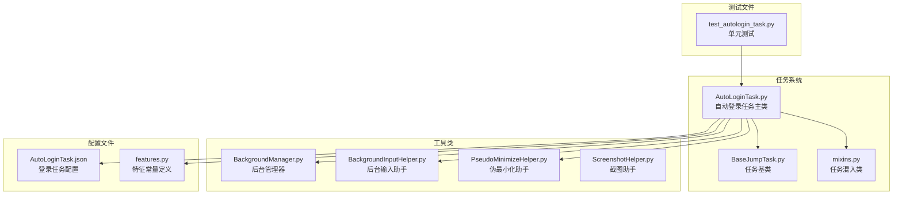

**图表来源**
- [AutoLoginTask.py:1-50](file://src/task/AutoLoginTask.py#L1-L50)
- [BaseJumpTask.py:1-30](file://src/task/BaseJumpTask.py#L1-L30)
- [mixins.py:1-30](file://src/task/mixins.py#L1-L30)

**章节来源**
- [AutoLoginTask.py:1-100](file://src/task/AutoLoginTask.py#L1-L100)
- [BaseJumpTask.py:1-50](file://src/task/BaseJumpTask.py#L1-L50)

## 核心组件

自动登录任务系统由多个核心组件构成，每个组件都有特定的职责和功能：

### 主要组件概述

1. **AutoLoginTask类** - 自动登录任务的主控制器，负责整个登录流程的协调和执行
2. **BaseJumpTask类** - 任务基类，提供通用的游戏状态检测和基础功能
3. **JumpTaskMixin类** - 任务混入类，提供分辨率适配、后台模式支持等通用功能
4. **BackgroundManager类** - 后台管理模式管理，处理窗口状态和输入模式
5. **BackgroundInputHelper类** - 后台输入助手，提供SendInput支持
6. **PseudoMinimizeHelper类** - 伪最小化助手，处理窗口位置变换
7. **Feature常量类** - 定义所有游戏界面特征的常量

### 组件交互关系

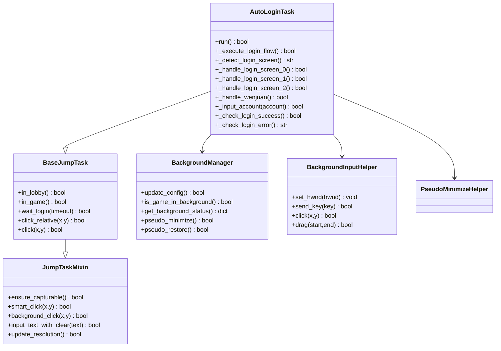

**图表来源**
- [AutoLoginTask.py:21-100](file://src/task/AutoLoginTask.py#L21-L100)
- [BaseJumpTask.py:14-50](file://src/task/BaseJumpTask.py#L14-L50)
- [mixins.py:15-40](file://src/task/mixins.py#L15-L40)
- [BackgroundManager.py:7-45](file://src/utils/BackgroundManager.py#L7-L45)
- [BackgroundInputHelper.py:99-140](file://src/utils/BackgroundInputHelper.py#L99-L140)

**章节来源**
- [AutoLoginTask.py:21-120](file://src/task/AutoLoginTask.py#L21-L120)
- [BaseJumpTask.py:14-80](file://src/task/BaseJumpTask.py#L14-L80)

## 架构概览

自动登录任务采用分层架构设计，从底层的系统集成到上层的任务控制，形成了完整的自动化登录体系：

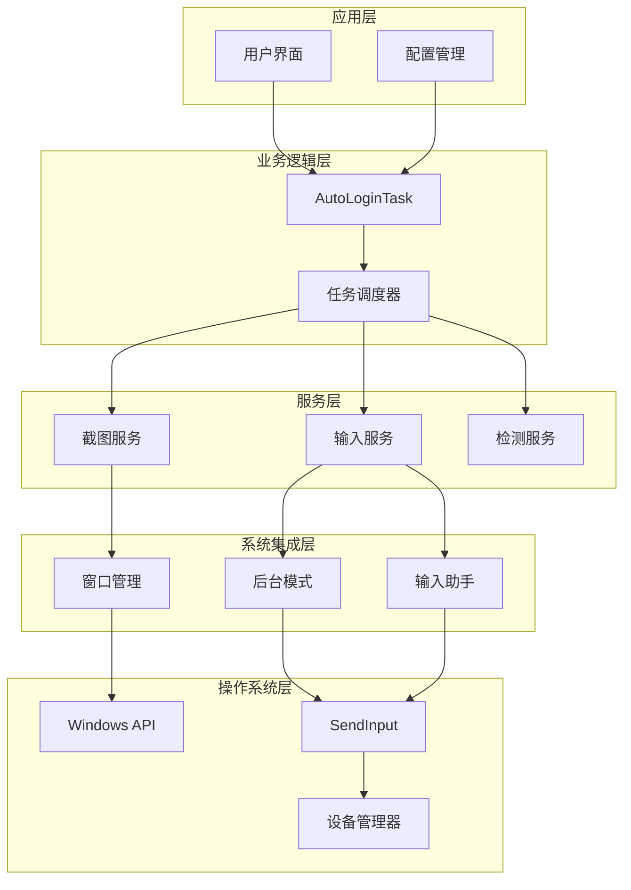

**图表来源**
- [AutoLoginTask.py:205-267](file://src/task/AutoLoginTask.py#L205-L267)
- [BackgroundManager.py:18-45](file://src/utils/BackgroundManager.py#L18-L45)
- [BackgroundInputHelper.py:143-207](file://src/utils/BackgroundInputHelper.py#L143-L207)

### 核心架构特点

1. **分层设计** - 清晰的层次结构，便于维护和扩展
2. **模块化** - 功能模块独立，降低耦合度
3. **可配置性** - 丰富的配置选项适应不同场景
4. **健壮性** - 完善的错误处理和重试机制
5. **兼容性** - 支持前台和后台模式运行

## 详细组件分析

### AutoLoginTask主控制器

AutoLoginTask是自动登录任务的核心控制器，负责协调整个登录流程的执行。该类继承自BaseJumpTask，拥有完整的任务基类功能。

**更新** 自动登录任务配置已简化，移除了冗余的'启用'配置项，系统现在默认启用所有功能。

#### 主要功能特性

1. **完整的登录流程控制** - 从游戏启动到登录完成的全流程管理
2. **智能界面检测** - 基于模板匹配和OCR的双重检测机制
3. **动态重试策略** - 针对不同场景的智能重试机制
4. **超时控制** - 多层次的超时管理和容错处理
5. **错误报告** - 完善的错误捕获和报告机制

#### 关键配置参数

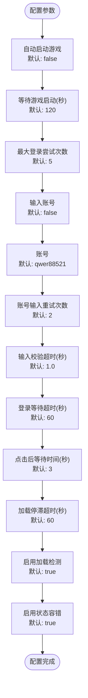

**图表来源**
- [AutoLoginTask.py:82-96](file://src/task/AutoLoginTask.py#L82-L96)
- [AutoLoginTask.json:1-14](file://configs/AutoLoginTask.json#L1-L14)

#### 登录流程执行序列

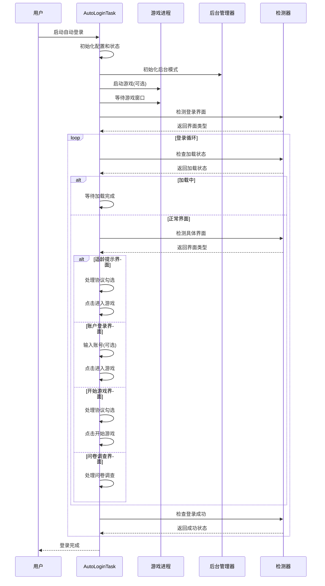

**图表来源**
- [AutoLoginTask.py:205-267](file://src/task/AutoLoginTask.py#L205-L267)
- [AutoLoginTask.py:512-681](file://src/task/AutoLoginTask.py#L512-L681)

**章节来源**
- [AutoLoginTask.py:205-681](file://src/task/AutoLoginTask.py#L205-L681)

### 界面检测与识别

自动登录任务实现了多层次的界面检测机制，确保能够准确识别各种登录场景：

#### 界面检测优先级

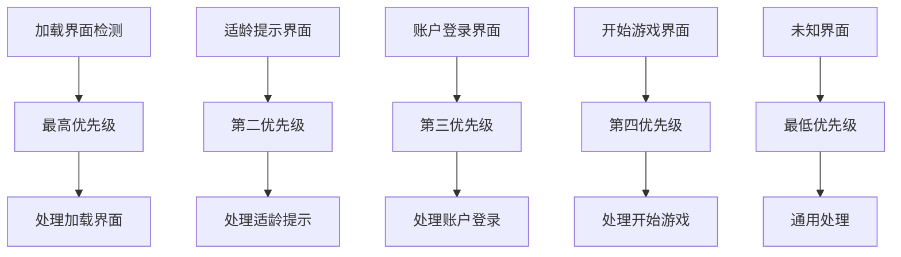

**图表来源**
- [AutoLoginTask.py:770-797](file://src/task/AutoLoginTask.py#L770-L797)

#### OCR检测机制

系统采用OCR技术进行文本识别，支持简繁中文双语模式：

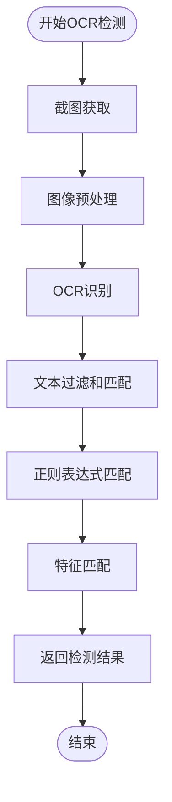

**图表来源**
- [AutoLoginTask.py:1041-1084](file://src/task/AutoLoginTask.py#L1041-L1084)

**章节来源**
- [AutoLoginTask.py:770-1084](file://src/task/AutoLoginTask.py#L770-L1084)

### 账号输入处理

账号输入功能支持多种输入方式和验证机制：

**更新** 账号输入功能已简化，默认禁用自动账号输入，需要手动配置才能启用。

#### 账号输入流程

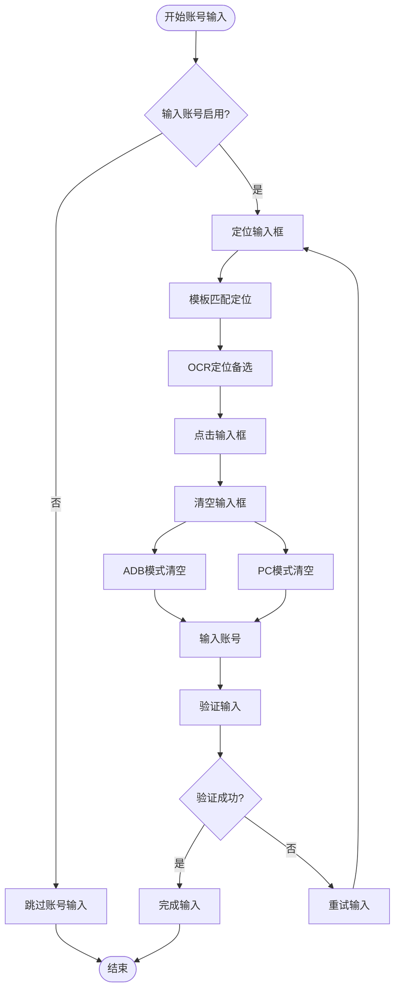

**图表来源**
- [AutoLoginTask.py:1282-1346](file://src/task/AutoLoginTask.py#L1282-L1346)

#### 输入验证机制

系统提供了多重验证机制确保账号输入的准确性：

1. **剪贴板验证** - 检查剪贴板内容是否匹配
2. **OCR实时验证** - 实时检测输入框中的文本内容
3. **重试机制** - 支持多次重试直到成功

**章节来源**
- [AutoLoginTask.py:1282-1548](file://src/task/AutoLoginTask.py#L1282-L1548)

### 加载检测与超时处理

自动登录任务实现了智能的加载检测机制，能够准确识别游戏加载状态并处理加载停滞问题：

#### 加载检测算法

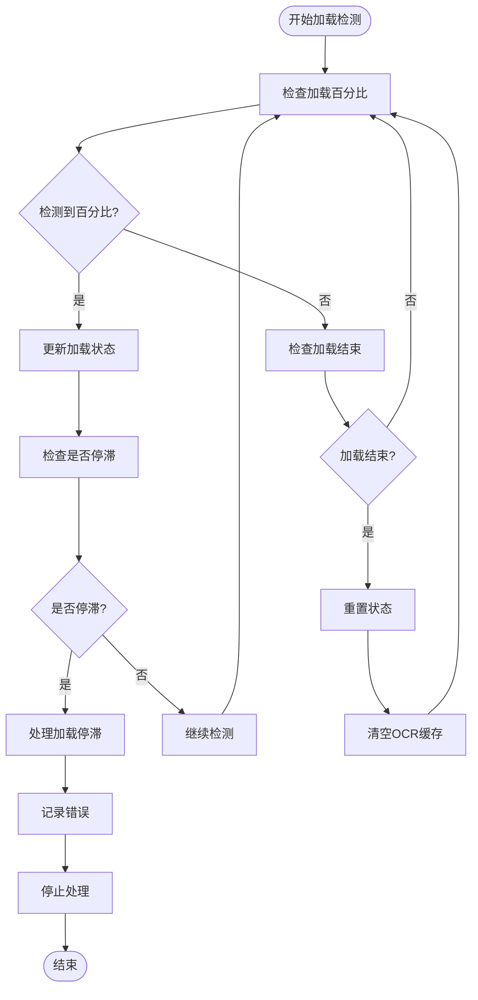

**图表来源**
- [AutoLoginTask.py:403-455](file://src/task/AutoLoginTask.py#L403-L455)

#### 超时处理策略

系统采用了多层次的超时处理机制：

1. **总超时控制** - 控制整个登录过程的总时间
2. **加载停滞超时** - 检测加载界面是否卡死
3. **输入超时控制** - 控制账号输入的总时间
4. **单次操作超时** - 控制单个操作的最大时间

**章节来源**
- [AutoLoginTask.py:403-471](file://src/task/AutoLoginTask.py#L403-L471)

### 问卷调查处理

问卷调查是登录流程中的重要环节，系统提供了完整的问卷处理机制：

#### 问卷处理流程

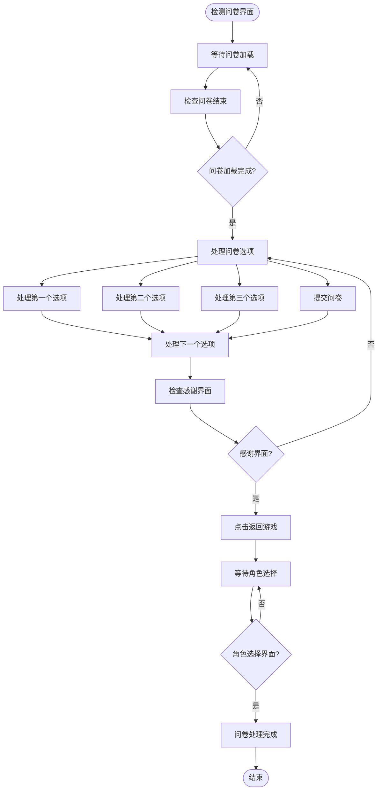

**图表来源**
- [AutoLoginTask.py:1742-1859](file://src/task/AutoLoginTask.py#L1742-L1859)

**章节来源**
- [AutoLoginTask.py:1724-1913](file://src/task/AutoLoginTask.py#L1724-L1913)

## 依赖关系分析

自动登录任务系统具有清晰的依赖关系，各个组件之间相互协作形成完整的功能体系：

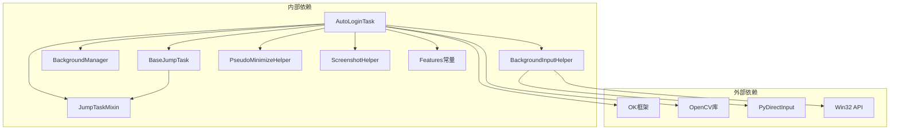

**图表来源**
- [AutoLoginTask.py:1-15](file://src/task/AutoLoginTask.py#L1-L15)
- [BackgroundInputHelper.py:16-25](file://src/utils/BackgroundInputHelper.py#L16-L25)

### 关键依赖关系

1. **OK框架依赖** - 自动登录任务基于OK框架构建，利用其提供的任务调度和设备管理功能
2. **OpenCV图像处理** - 使用OpenCV进行图像处理和模板匹配
3. **Win32 API系统集成** - 通过Win32 API实现窗口管理和输入控制
4. **PyDirectInput输入模拟** - 在后台模式下使用PyDirectInput进行输入模拟

**章节来源**
- [AutoLoginTask.py:1-15](file://src/task/AutoLoginTask.py#L1-L15)
- [BackgroundInputHelper.py:16-25](file://src/utils/BackgroundInputHelper.py#L16-L25)

## 性能考虑

自动登录任务在设计时充分考虑了性能优化，采用了多种策略来提高执行效率：

### 性能优化策略

1. **智能截图缓存** - 缓存OCR结果避免重复计算
2. **延迟加载机制** - 按需加载资源和模型文件
3. **异步处理** - 非阻塞的界面检测和处理
4. **内存管理** - 及时清理临时数据和缓存

### 性能监控指标

系统提供了多种性能监控指标：

- **检测精度** - 界面识别的准确率
- **响应时间** - 单次操作的平均响应时间
- **资源占用** - CPU和内存的使用情况
- **成功率** - 整体登录成功的概率

## 故障排除指南

自动登录任务系统提供了完善的错误处理和故障排除机制：

### 常见问题及解决方案

#### 登录超时问题

**问题描述**：登录过程超过设定时间仍未完成

**可能原因**：
1. 游戏启动缓慢
2. 网络连接不稳定
3. 界面检测失败

**解决方案**：
1. 增加等待时间配置
2. 检查网络连接状态
3. 调整检测阈值

#### 账号输入失败

**问题描述**：账号输入过程中出现错误

**可能原因**：
1. 输入框定位失败
2. 输入验证不通过
3. 系统剪贴板问题

**解决方案**：
1. 检查输入框模板文件
2. 调整输入验证超时时间
3. 重启系统剪贴板服务

#### 加载停滞问题

**问题描述**：游戏加载界面卡死

**可能原因**：
1. 服务器响应慢
2. 网络连接中断
3. 游戏客户端问题

**解决方案**：
1. 检查网络连接质量
2. 重启游戏客户端
3. 增加加载停滞超时时间

### 错误日志分析

系统提供了详细的错误日志记录功能：

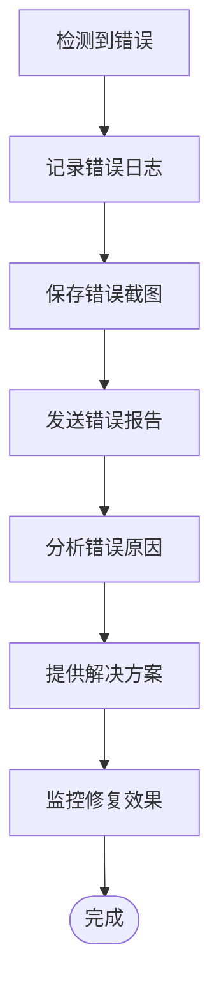

**图表来源**
- [AutoLoginTask.py:1686-1713](file://src/task/AutoLoginTask.py#L1686-L1713)

**章节来源**
- [AutoLoginTask.py:1686-1713](file://src/task/AutoLoginTask.py#L1686-L1713)

## 结论

OK-Jump的自动登录任务系统是一个功能完整、设计合理的自动化解决方案。该系统通过精心设计的架构和完善的错误处理机制，能够稳定地处理各种复杂的登录场景。

**更新** 自动登录任务配置已进行简化调整，移除了冗余的'启用'配置项，优化了登录流程参数，包括减少最大登录尝试次数、禁用自动账号输入、缩短输入验证超时时间等改进，使系统更加简洁高效。

### 主要优势

1. **功能完整性** - 覆盖了从游戏启动到登录完成的完整流程
2. **智能检测** - 基于模板匹配和OCR的双重检测机制
3. **健壮性** - 完善的错误处理和重试策略
4. **可配置性** - 丰富的配置选项适应不同场景
5. **兼容性** - 支持前台和后台模式运行
6. **简洁性** - 移除了冗余配置，系统更加简洁易用

### 技术特色

1. **多层架构设计** - 清晰的层次结构便于维护和扩展
2. **智能超时控制** - 动态调整超时时间适应不同场景
3. **状态容错机制** - 在判定失败后进行二次确认
4. **后台模式支持** - 能够在游戏窗口被遮挡时正常工作
5. **配置简化** - 移除了不必要的配置项，降低使用复杂度

该系统为OK-Jump项目提供了强大的自动化登录能力，大大提高了用户的使用体验和效率。

## 附录

### 配置参数详解

**更新** 自动登录任务配置已简化，移除了冗余的'启用'配置项。

#### 基础配置参数

| 参数名称 | 默认值 | 描述 |
|---------|--------|------|
| 自动启动游戏 | false | 是否自动启动游戏进程 |
| 等待游戏启动(秒) | 120 | 等待游戏窗口出现的最大时间 |
| 最大登录尝试次数 | 5 | 登录过程的最大重试次数 |

#### 账号输入配置

**更新** 账号输入功能默认禁用，需要手动配置才能启用。

| 参数名称 | 默认值 | 描述 |
|---------|--------|------|
| 输入账号 | false | 是否自动输入账号 |
| 账号 | qwer88521 | 要输入的账号信息 |
| 账号输入重试次数 | 2 | 账号输入失败的重试次数 |
| 输入校验超时(秒) | 1.0 | 账号输入验证的最大时间 |

#### 超时和等待配置

| 参数名称 | 默认值 | 描述 |
|---------|--------|------|
| 登录等待超时(秒) | 60 | 登录过程的总超时时间 |
| 点击后等待时间(秒) | 3 | 点击操作后的等待时间 |
| 加载停滞超时(秒) | 60 | 加载界面停滞的检测时间 |

#### 功能开关配置

| 参数名称 | 默认值 | 描述 |
|---------|--------|------|
| 启用加载检测 | true | 是否启用加载界面检测 |
| 启用状态容错 | true | 是否启用状态容错机制 |

### 测试覆盖范围

自动登录任务系统包含了全面的单元测试，覆盖了主要的功能场景：

1. **问卷调查处理测试** - 验证问卷界面的正确处理
2. **登录界面处理测试** - 验证三种登录界面的处理逻辑
3. **账号输入测试** - 验证账号输入的完整流程
4. **错误处理测试** - 验证各种错误场景的处理

**章节来源**
- [AutoLoginTask.json:1-14](file://configs/AutoLoginTask.json#L1-L14)
- [test_autologin_task.py:1-407](file://tests/test_autologin_task.py#L1-L407)