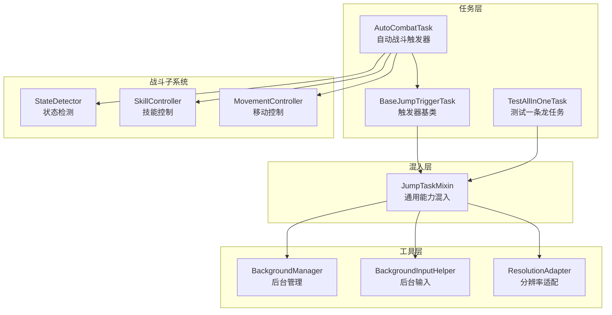
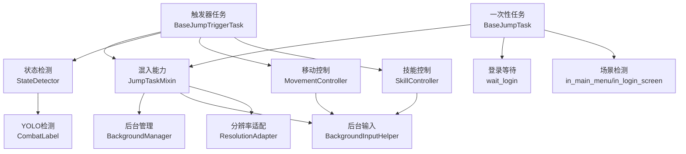
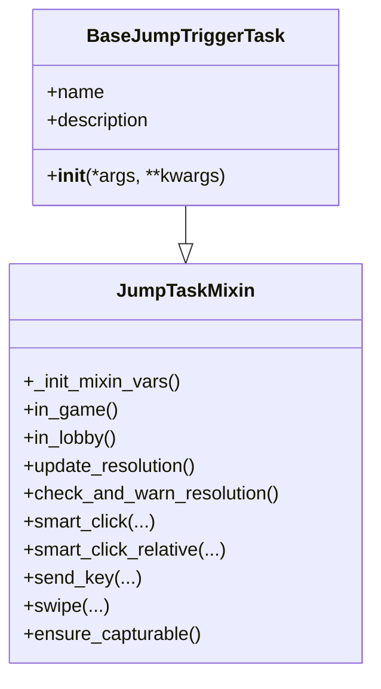
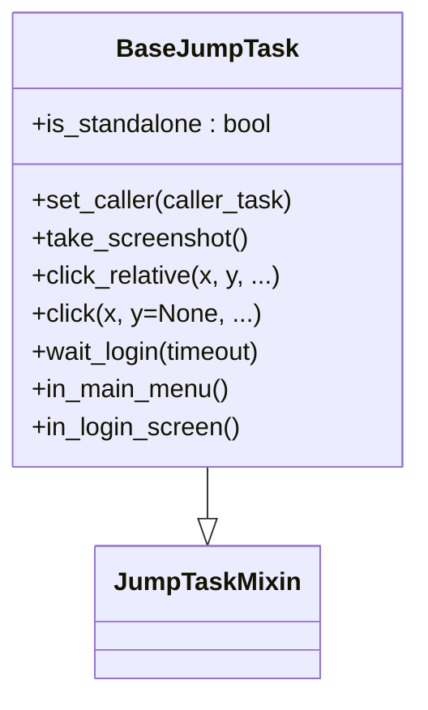
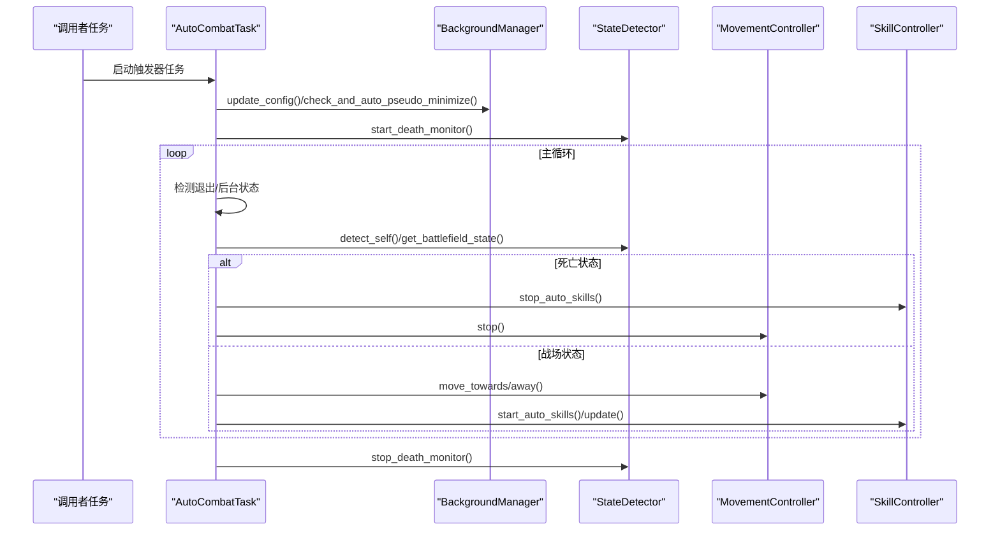
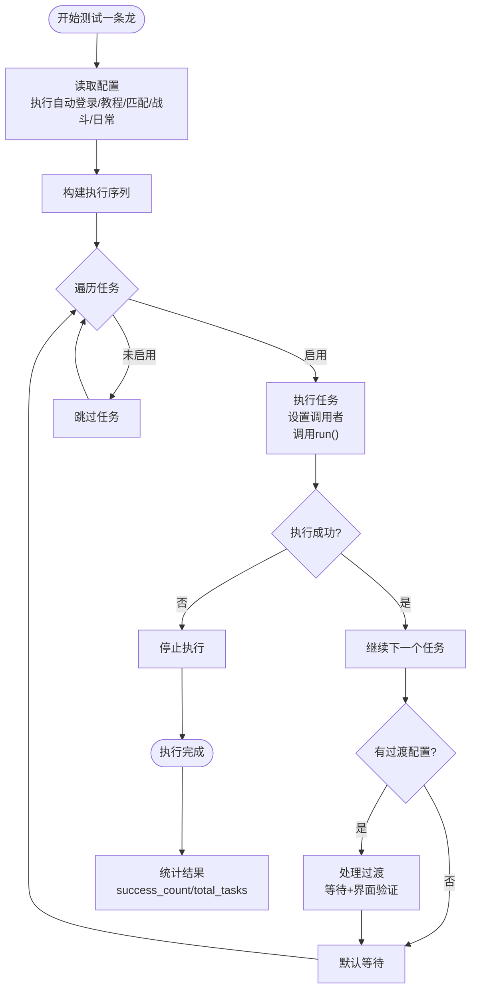
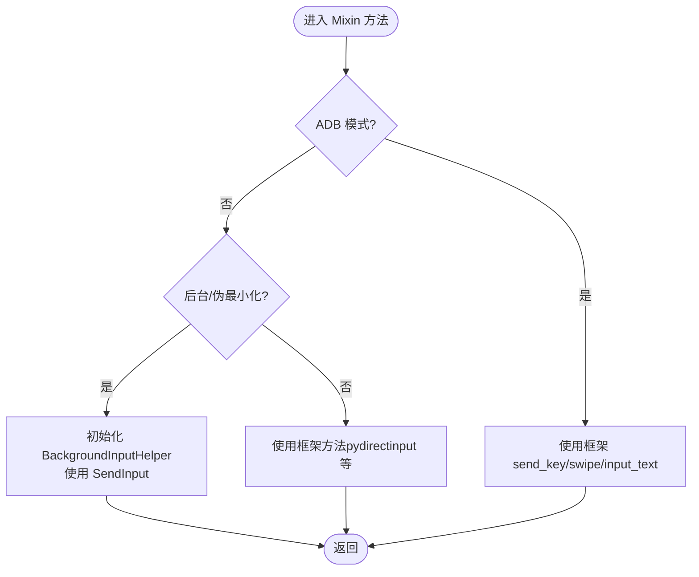
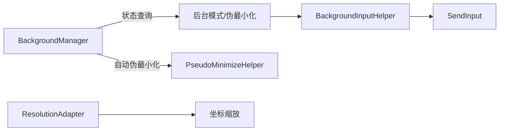
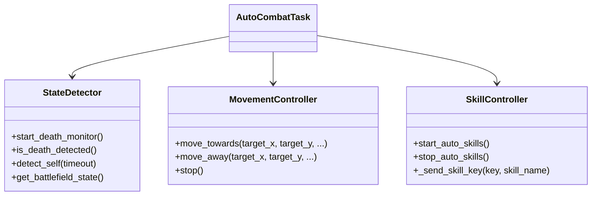
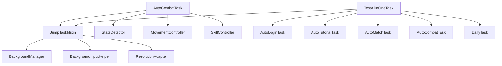

# 触发器任务

<cite>
**本文档引用的文件**
- [BaseJumpTriggerTask.py](file://src/task/BaseJumpTriggerTask.py)
- [BaseJumpTask.py](file://src/task/BaseJumpTask.py)
- [mixins.py](file://src/task/mixins.py)
- [AutoCombatTask.py](file://src/task/AutoCombatTask.py)
- [TestAllInOneTask.py](file://src/task/TestAllInOneTask.py)
- [features.py](file://src/constants/features.py)
- [BackgroundManager.py](file://src/utils/BackgroundManager.py)
- [BackgroundInputHelper.py](file://src/utils/BackgroundInputHelper.py)
- [ResolutionAdapter.py](file://src/utils/ResolutionAdapter.py)
- [state_detector.py](file://src/combat/state_detector.py)
- [skill_controller.py](file://src/combat/skill_controller.py)
- [movement_controller.py](file://src/combat/movement_controller.py)
- [AutoCombatTask.json](file://configs/AutoCombatTask.json)
- [AutoLoginTask.json](file://configs/AutoLoginTask.json)
- [TestAllInOneTask.json](file://configs/TestAllInOneTask.json)
- [Basic Options.json](file://configs/Basic Options.json)
- [游戏热键配置.json](file://configs/游戏热键配置.json)
</cite>

## 更新摘要
**变更内容**
- 更新了TestAllInOneTask配置结构，移除了'启用'配置项，简化测试一条龙任务的配置
- 新增了TestAllInOneTask的详细配置说明和使用方法
- 完善了触发器任务与一次性任务的区别说明

## 目录
1. [简介](#简介)
2. [项目结构](#项目结构)
3. [核心组件](#核心组件)
4. [架构总览](#架构总览)
5. [详细组件分析](#详细组件分析)
6. [依赖分析](#依赖分析)
7. [性能考虑](#性能考虑)
8. [故障排查指南](#故障排查指南)
9. [结论](#结论)
10. [附录](#附录)

## 简介
本文件面向 OK-Jump 的"触发器任务"体系，重点围绕 BaseJumpTriggerTask 的实现原理与触发机制展开，涵盖事件监听、条件检测、自动响应等核心能力；并系统阐述触发器的配置方法、触发条件设置、响应动作定义等关键特性。文档同时给出类型分类、优先级管理、冲突处理等配置选项说明，并提供开发方法、调试技巧与性能优化建议，辅以典型触发场景的实现示例与最佳实践。

**更新** TestAllInOneTask配置结构已简化，移除了'启用'配置项，现在通过布尔值直接控制各个子任务的执行。

## 项目结构
OK-Jump 的触发器任务位于 src/task 目录，采用"基类 + Mixin"的设计模式，通过 Mixin 复用通用能力（分辨率适配、后台模式支持、输入适配等）。AutoCombatTask 是典型的触发器任务示例，基于 BaseJumpTriggerTask 实现自动战斗逻辑。新增的 TestAllInOneTask 提供测试一条龙功能，整合多个子任务的执行控制。

**图表来源**
- [BaseJumpTriggerTask.py:13-29](file://src/task/BaseJumpTriggerTask.py#L13-L29)
- [mixins.py:15-28](file://src/task/mixins.py#L15-L28)
- [AutoCombatTask.py:32-44](file://src/task/AutoCombatTask.py#L32-L44)
- [TestAllInOneTask.py:11-28](file://src/task/TestAllInOneTask.py#L11-L28)
- [BackgroundManager.py:7-23](file://src/utils/BackgroundManager.py#L7-L23)
- [BackgroundInputHelper.py:99-117](file://src/utils/BackgroundInputHelper.py#L99-L117)
- [ResolutionAdapter.py:4-16](file://src/utils/ResolutionAdapter.py#L4-L16)

**章节来源**
- [BaseJumpTriggerTask.py:1-30](file://src/task/BaseJumpTriggerTask.py#L1-L30)
- [mixins.py:15-28](file://src/task/mixins.py#L15-L28)
- [AutoCombatTask.py:32-44](file://src/task/AutoCombatTask.py#L32-L44)
- [TestAllInOneTask.py:11-28](file://src/task/TestAllInOneTask.py#L11-L28)

## 核心组件
- BaseJumpTriggerTask：触发器任务基类，继承自框架 TriggerTask，并混入 JumpTaskMixin，提供游戏状态检测、分辨率自适应、后台模式支持等通用能力。
- BaseJumpTask：一次性任务基类，继承自框架 BaseTask，提供登录等待、伪最小化、场景检测等基础功能，与触发器任务形成互补。
- JumpTaskMixin：通用混入类，集中实现分辨率适配、后台模式检测与输入适配、窗口伪最小化、智能点击/按键/拖拽等跨任务复用能力。
- AutoCombatTask：典型触发器任务，作为触发器运行，内部集成状态检测、移动控制、技能控制三大子系统，实现完整的自动战斗逻辑。
- TestAllInOneTask：测试一条龙任务，整合多个子任务的执行控制，提供统一的配置管理和任务间过渡处理。
- 工具与常量：BackgroundManager、BackgroundInputHelper、ResolutionAdapter 提供后台模式、SendInput 输入、分辨率缩放等基础设施；features.py 提供特征名称常量。

**章节来源**
- [BaseJumpTriggerTask.py:13-29](file://src/task/BaseJumpTriggerTask.py#L13-L29)
- [BaseJumpTask.py:14-35](file://src/task/BaseJumpTask.py#L14-L35)
- [mixins.py:15-28](file://src/task/mixins.py#L15-L28)
- [AutoCombatTask.py:32-44](file://src/task/AutoCombatTask.py#L32-L44)
- [TestAllInOneTask.py:11-28](file://src/task/TestAllInOneTask.py#L11-L28)
- [features.py:9-86](file://src/constants/features.py#L9-L86)

## 架构总览
触发器任务的运行时架构如下：任务通过 Mixin 获取通用能力，结合战斗子系统进行状态检测与动作执行；后台模式下通过 SendInput 实现可靠输入；分辨率适配保证不同屏幕下的坐标一致性。一次性任务提供基础的登录和场景检测功能，触发器任务专注于周期性的状态监控和自动响应。

**图表来源**
- [mixins.py:32-36](file://src/task/mixins.py#L32-L36)
- [BaseJumpTask.py:155-180](file://src/task/BaseJumpTask.py#L155-L180)
- [BaseJumpTask.py:133-151](file://src/task/BaseJumpTask.py#L133-L151)
- [BackgroundManager.py:18-23](file://src/utils/BackgroundManager.py#L18-L23)
- [BackgroundInputHelper.py:199-207](file://src/utils/BackgroundInputHelper.py#L199-L207)
- [ResolutionAdapter.py:34-44](file://src/utils/ResolutionAdapter.py#L34-L44)
- [state_detector.py:24-51](file://src/combat/state_detector.py#L24-L51)
- [movement_controller.py:39-52](file://src/combat/movement_controller.py#L39-L52)
- [skill_controller.py:61-82](file://src/combat/skill_controller.py#L61-L82)

## 详细组件分析

### BaseJumpTriggerTask：触发器任务基类
- 继承关系：继承框架 TriggerTask，并混入 JumpTaskMixin，获得通用能力。
- 初始化：调用父类构造并初始化混入变量，设置任务名称与描述。
- 适用场景：需要周期性检查并触发的动作，如 AutoCombatTask。

**图表来源**
- [BaseJumpTriggerTask.py:13-29](file://src/task/BaseJumpTriggerTask.py#L13-L29)
- [mixins.py:32-36](file://src/task/mixins.py#L32-L36)

**章节来源**
- [BaseJumpTriggerTask.py:13-29](file://src/task/BaseJumpTriggerTask.py#L13-L29)

### BaseJumpTask：一次性任务基类
- 继承关系：继承框架 BaseTask，并混入 JumpTaskMixin，提供一次性任务的基础功能。
- 初始化：设置登录状态标志和调用者任务引用，默认为独立运行模式。
- 核心功能：登录等待机制、场景检测、伪最小化处理、智能点击等。
- 调用关系：set_caller 方法用于标记任务被其他任务调用，影响任务完成后的行为。

**图表来源**
- [BaseJumpTask.py:26-57](file://src/task/BaseJumpTask.py#L26-L57)
- [BaseJumpTask.py:155-180](file://src/task/BaseJumpTask.py#L155-L180)
- [BaseJumpTask.py:133-151](file://src/task/BaseJumpTask.py#L133-L151)

**章节来源**
- [BaseJumpTask.py:14-57](file://src/task/BaseJumpTask.py#L14-L57)

### AutoCombatTask：自动战斗触发器
- 触发机制：作为触发器任务运行，被其他任务调用时启动；内部维护主循环，周期性检测状态并执行动作。
- 配置驱动：技能开关与间隔来自 AutoCombatTask.json；按键映射来自 游戏热键配置.json。
- 子系统集成：StateDetector（并行死亡检测、自身/友方/敌方检测）、MovementController（WASD移动）、SkillController（键盘/ADB按键）。
- 后台支持：通过 BackgroundManager 与 BackgroundInputHelper 实现后台稳定输入与伪最小化。
- 分辨率适配：通过 ResolutionAdapter 统一坐标缩放。

**图表来源**
- [AutoCombatTask.py:84-134](file://src/task/AutoCombatTask.py#L84-L134)
- [AutoCombatTask.py:197-271](file://src/task/AutoCombatTask.py#L197-L271)
- [state_detector.py:72-101](file://src/combat/state_detector.py#L72-L101)
- [BackgroundManager.py:101-121](file://src/utils/BackgroundManager.py#L101-L121)

**章节来源**
- [AutoCombatTask.py:32-44](file://src/task/AutoCombatTask.py#L32-L44)
- [AutoCombatTask.py:84-134](file://src/task/AutoCombatTask.py#L84-L134)
- [AutoCombatTask.py:197-271](file://src/task/AutoCombatTask.py#L197-L271)

### TestAllInOneTask：测试一条龙任务
- 任务整合：整合多个子任务的执行控制，包括自动登录、新手教程、自动匹配、自动战斗、日常任务。
- 配置简化：移除'启用'配置项，直接通过布尔值控制各个子任务的执行。
- 过渡处理：提供任务间过渡配置，支持特殊界面验证和等待时间设置。
- 执行控制：统计实际执行的任务数量，失败时停止后续任务执行。

**图表来源**
- [TestAllInOneTask.py:50-131](file://src/task/TestAllInOneTask.py#L50-L131)
- [TestAllInOneTask.py:133-212](file://src/task/TestAllInOneTask.py#L133-L212)

**章节来源**
- [TestAllInOneTask.py:11-28](file://src/task/TestAllInOneTask.py#L11-L28)
- [TestAllInOneTask.py:50-131](file://src/task/TestAllInOneTask.py#L50-L131)
- [TestAllInOneTask.py:133-212](file://src/task/TestAllInOneTask.py#L133-L212)

### JumpTaskMixin：通用混入能力
- 游戏状态检测：in_game、in_lobby 基于特征检测。
- 分辨率适配：update_resolution、scale_point、scale_box、box_from_reference 等。
- 后台模式：is_background_mode、is_game_in_background、ensure_capturable、check_background_mode。
- 输入适配：smart_click、smart_click_relative、send_key、send_key_down、send_key_up、swipe、input_text 等，自动区分 ADB/Windows 模式与前台/后台。
- 伪最小化：toggle_pseudo_minimize、pseudo_minimize、pseudo_restore、is_pseudo_minimized。

**图表来源**
- [mixins.py:398-423](file://src/task/mixins.py#L398-L423)
- [mixins.py:425-488](file://src/task/mixins.py#L425-L488)
- [mixins.py:512-537](file://src/task/mixins.py#L512-L537)
- [mixins.py:632-675](file://src/task/mixins.py#L632-L675)
- [mixins.py:724-774](file://src/task/mixins.py#L724-L774)

**章节来源**
- [mixins.py:58-80](file://src/task/mixins.py#L58-L80)
- [mixins.py:104-182](file://src/task/mixins.py#L104-L182)
- [mixins.py:257-303](file://src/task/mixins.py#L257-L303)
- [mixins.py:381-423](file://src/task/mixins.py#L381-L423)
- [mixins.py:425-537](file://src/task/mixins.py#L425-L537)
- [mixins.py:632-774](file://src/task/mixins.py#L632-L774)

### 后台管理与输入适配
- BackgroundManager：读取基本设置，判断后台模式、游戏是否在后台、是否需要伪最小化，提供自动伪最小化与状态查询。
- BackgroundInputHelper：在后台模式下使用 SendInput 发送键盘/鼠标事件，避免窗口前置；支持前台模式下的 pydirectinput 回退。
- ResolutionAdapter：根据参考分辨率与当前分辨率计算缩放因子，提供坐标/矩形缩放与相对坐标转换。

**图表来源**
- [BackgroundManager.py:18-23](file://src/utils/BackgroundManager.py#L18-L23)
- [BackgroundManager.py:46-75](file://src/utils/BackgroundManager.py#L46-L75)
- [BackgroundManager.py:101-121](file://src/utils/BackgroundManager.py#L101-L121)
- [BackgroundInputHelper.py:199-207](file://src/utils/BackgroundInputHelper.py#L199-L207)
- [ResolutionAdapter.py:34-44](file://src/utils/ResolutionAdapter.py#L34-L44)

**章节来源**
- [BackgroundManager.py:7-23](file://src/utils/BackgroundManager.py#L7-L23)
- [BackgroundManager.py:46-75](file://src/utils/BackgroundManager.py#L46-L75)
- [BackgroundManager.py:101-121](file://src/utils/BackgroundManager.py#L101-L121)
- [BackgroundInputHelper.py:99-117](file://src/utils/BackgroundInputHelper.py#L99-L117)
- [ResolutionAdapter.py:4-16](file://src/utils/ResolutionAdapter.py#L4-L16)

### 战斗子系统
- StateDetector：并行死亡检测线程，快速查询死亡状态；同步检测自身/友方/敌方，支持详细日志。
- MovementController：WASD 键盘移动控制，支持前后台模式；提供向目标移动、远离目标、左右移动、停止等。
- SkillController：按键释放技能，支持 ADB/Windows 模式；从任务配置与热键配置读取技能开关与按键映射。

**图表来源**
- [state_detector.py:72-101](file://src/combat/state_detector.py#L72-L101)
- [state_detector.py:188-200](file://src/combat/state_detector.py#L188-L200)
- [movement_controller.py:102-127](file://src/combat/movement_controller.py#L102-L127)
- [skill_controller.py:139-150](file://src/combat/skill_controller.py#L139-L150)

**章节来源**
- [state_detector.py:24-51](file://src/combat/state_detector.py#L24-L51)
- [state_detector.py:72-101](file://src/combat/state_detector.py#L72-L101)
- [movement_controller.py:39-52](file://src/combat/movement_controller.py#L39-L52)
- [skill_controller.py:61-82](file://src/combat/skill_controller.py#L61-L82)

## 依赖分析
- 组件耦合：AutoCombatTask 依赖 JumpTaskMixin 提供的通用能力；战斗子系统彼此解耦，通过任务对象共享帧与日志。TestAllInOneTask 依赖多个子任务类，形成松耦合的组合关系。
- 外部依赖：BackgroundManager 与 BackgroundInputHelper 依赖 Windows API 与 SendInput；ResolutionAdapter 依赖配置项。
- 循环依赖：未见循环依赖，各模块职责清晰。

**图表来源**
- [AutoCombatTask.py:32-44](file://src/task/AutoCombatTask.py#L32-L44)
- [TestAllInOneTask.py:4-8](file://src/task/TestAllInOneTask.py#L4-L8)
- [mixins.py:15-28](file://src/task/mixins.py#L15-L28)
- [BackgroundManager.py:7-23](file://src/utils/BackgroundManager.py#L7-L23)
- [BackgroundInputHelper.py:99-117](file://src/utils/BackgroundInputHelper.py#L99-L117)
- [ResolutionAdapter.py:4-16](file://src/utils/ResolutionAdapter.py#L4-L16)

**章节来源**
- [AutoCombatTask.py:32-44](file://src/task/AutoCombatTask.py#L32-L44)
- [TestAllInOneTask.py:4-8](file://src/task/TestAllInOneTask.py#L4-L8)
- [mixins.py:15-28](file://src/task/mixins.py#L15-L28)

## 性能考虑
- 死亡检测线程：StateDetector 使用高频后台线程（约 30ms 间隔）持续检测死亡状态，降低主线程压力，提升响应速度。
- 后台输入：在后台模式下使用 SendInput，避免窗口前置带来的开销与抖动。
- 分辨率适配：仅在首次或分辨率变更时更新，减少重复计算。
- 配置驱动：技能间隔与移动持续时间通过配置文件控制，避免硬编码导致的性能波动。
- 任务执行：TestAllInOneTask 通过任务间过渡配置优化执行效率，避免不必要的等待。
- 建议：合理设置 Basic Options.json 中的触发间隔与后台模式参数，平衡响应速度与系统负载。

**章节来源**
- [state_detector.py:51](file://src/combat/state_detector.py#L51)
- [state_detector.py:125-182](file://src/combat/state_detector.py#L125-L182)
- [mixins.py:104-121](file://src/task/mixins.py#L104-L121)
- [BackgroundInputHelper.py:310-356](file://src/utils/BackgroundInputHelper.py#L310-L356)
- [TestAllInOneTask.py:133-161](file://src/task/TestAllInOneTask.py#L133-L161)
- [Basic Options.json:8](file://configs/Basic Options.json#L8)

## 故障排查指南
- 后台输入无效
  - 检查后台模式是否启用与游戏是否在后台。
  - 确认伪最小化状态与窗口句柄是否正确设置。
  - 查看日志中 SendInput/前台模式分支是否被触发。
- 分辨率异常
  - 确认当前分辨率与参考分辨率比值是否符合支持比例。
  - 检查 ResolutionAdapter 的缩放因子与推荐分辨率。
- 技能/按键不生效
  - 核对 游戏热键配置.json 中的按键映射。
  - 检查任务配置中的技能开关与间隔。
- 状态检测不稳定
  - 调整 StateDetector 的检测阈值与间隔。
  - 确保 YOLO 模型与特征名称一致（参考 features.py）。
- TestAllInOneTask执行问题
  - 检查 TestAllInOneTask.json 配置格式是否正确。
  - 确认任务间过渡配置是否合理设置。
  - 查看任务执行日志，定位具体失败环节。

**章节来源**
- [BackgroundManager.py:46-75](file://src/utils/BackgroundManager.py#L46-L75)
- [BackgroundInputHelper.py:199-207](file://src/utils/BackgroundInputHelper.py#L199-L207)
- [ResolutionAdapter.py:98-119](file://src/utils/ResolutionAdapter.py#L98-L119)
- [features.py:9-86](file://src/constants/features.py#L9-L86)
- [AutoCombatTask.json:46-68](file://configs/AutoCombatTask.json#L46-L68)
- [TestAllInOneTask.json:1-8](file://configs/TestAllInOneTask.json#L1-L8)
- [游戏热键配置.json:1-6](file://configs/游戏热键配置.json#L1-L6)

## 结论
BaseJumpTriggerTask 通过 Mixin 模式将通用能力抽象复用，配合 AutoCombatTask 的触发机制与战斗子系统，实现了稳定高效的触发器任务体系。一次性任务基类提供了登录和场景检测等基础功能，与触发器任务形成互补。TestAllInOneTask 通过简化配置结构，提供了更直观的多任务执行体验。通过后台管理、输入适配与分辨率适配，任务可在复杂环境下保持可靠运行；通过配置驱动与详细日志，开发者能够灵活定制并高效调试。

## 附录

### 触发器任务配置方法
- 任务配置（AutoCombatTask.json）
  - 示例字段：测试模式、详细日志、自动普攻、自动技能1/2/大招、普攻间隔、技能间隔、移动持续时间。
- 测试一条龙配置（TestAllInOneTask.json）
  - **更新** 配置结构已简化，移除'启用'配置项，直接通过布尔值控制子任务执行：
    - 执行自动登录：true/false
    - 执行自动新手教程：true/false  
    - 执行自动匹配：true/false
    - 执行自动战斗：true/false
    - 执行日常任务：true/false
    - 任务间等待时间(秒)：2.0
- 基本设置（Basic Options.json）
  - 示例字段：触发间隔、后台模式、最小化时伪最小化、后台时静音游戏等。
- 热键配置（游戏热键配置.json）
  - 示例字段：普通攻击、技能1、技能2、大招对应的按键。

**章节来源**
- [AutoCombatTask.json:1-13](file://configs/AutoCombatTask.json#L1-L13)
- [TestAllInOneTask.json:1-8](file://configs/TestAllInOneTask.json#L1-L8)
- [Basic Options.json:1-13](file://configs/Basic Options.json#L1-L13)
- [游戏热键配置.json:1-6](file://configs/游戏热键配置.json#L1-L6)

### 触发条件与响应动作
- 触发条件
  - 游戏状态检测：in_game/in_lobby 基于特征名称（参考 features.py）。
  - 死亡状态：并行线程持续检测，快速查询。
  - 场景等待：测试模式可跳过场景检测。
- 响应动作
  - 移动控制：向目标移动/远离/左右移动/停止。
  - 技能控制：根据配置与热键映射释放技能。
  - 输入适配：智能选择 SendInput 或前台输入。
- TestAllInOneTask执行控制
  - **更新** 通过布尔值直接控制子任务执行，无需额外的'启用'字段。

**章节来源**
- [features.py:60-82](file://src/constants/features.py#L60-L82)
- [state_detector.py:72-101](file://src/combat/state_detector.py#L72-L101)
- [movement_controller.py:102-127](file://src/combat/movement_controller.py#L102-L127)
- [skill_controller.py:139-150](file://src/combat/skill_controller.py#L139-L150)
- [TestAllInOneTask.py:55-61](file://src/task/TestAllInOneTask.py#L55-L61)

### 开发方法与最佳实践
- 开发方法
  - 继承 BaseJumpTriggerTask，复用 JumpTaskMixin 能力。
  - 将业务逻辑拆分为状态检测、移动控制、技能控制等子系统。
  - 使用配置文件驱动功能开关与参数。
  - **新增** 对于一次性任务，利用 BaseJumpTask 的登录等待和场景检测功能。
- 调试技巧
  - 启用详细日志，观察 YOLO 检测结果与坐标信息。
  - 使用测试模式跳过场景检测，聚焦核心逻辑。
  - 检查后台模式与伪最小化状态。
  - **新增** 对于 TestAllInOneTask，检查任务间过渡配置和执行顺序。
- 性能优化
  - 合理设置触发间隔与后台模式参数。
  - 减少不必要的分辨率更新与窗口前置。
  - 使用并行线程处理高频检测任务。
  - **新增** 优化 TestAllInOneTask 的任务执行顺序，减少不必要的等待时间。

**章节来源**
- [AutoCombatTask.py:161-164](file://src/task/AutoCombatTask.py#L161-L164)
- [AutoCombatTask.py:106-112](file://src/task/AutoCombatTask.py#L106-L112)
- [BaseJumpTask.py:36-57](file://src/task/BaseJumpTask.py#L36-L57)
- [TestAllInOneTask.py:133-161](file://src/task/TestAllInOneTask.py#L133-L161)
- [Basic Options.json:8](file://configs/Basic Options.json#L8)