# 任务基类设计

<cite>
**本文档引用的文件**
- [BaseJumpTask.py](file://src/task/BaseJumpTask.py)
- [mixins.py](file://src/task/mixins.py)
- [features.py](file://src/constants/features.py)
- [BackgroundManager.py](file://src/utils/BackgroundManager.py)
- [PseudoMinimizeHelper.py](file://src/utils/PseudoMinimizeHelper.py)
- [ResolutionAdapter.py](file://src/utils/ResolutionAdapter.py)
- [ScreenshotHelper.py](file://src/utils/ScreenshotHelper.py)
- [AutoLoginTask.py](file://src/task/AutoLoginTask.py)
- [AutoLoginTask.json](file://configs/AutoLoginTask.json)
- [devices.json](file://configs/devices.json)
</cite>

## 目录
1. [简介](#简介)
2. [项目结构](#项目结构)
3. [核心组件](#核心组件)
4. [架构概览](#架构概览)
5. [详细组件分析](#详细组件分析)
6. [依赖关系分析](#依赖关系分析)
7. [性能考虑](#性能考虑)
8. [故障排除指南](#故障排除指南)
9. [结论](#结论)

## 简介

OK-Jump是一个基于OK-Script框架开发的游戏自动化任务系统，专门针对《漫画群星：大集结》游戏设计。本文档深入分析BaseJumpTask基类的设计理念和实现细节，这是一个继承自OK-Script框架BaseTask类并与JumpTaskMixin混入类结合的综合性任务基类。

BaseJumpTask为所有游戏自动化任务提供了统一的基础功能，包括游戏状态检测、分辨率自适应、后台模式支持、登录等待机制和伪最小化处理等核心能力。该设计通过混入模式消除了代码重复，提高了系统的可维护性和扩展性。

## 项目结构

OK-Jump项目采用模块化的组织方式，主要分为以下几个核心部分：

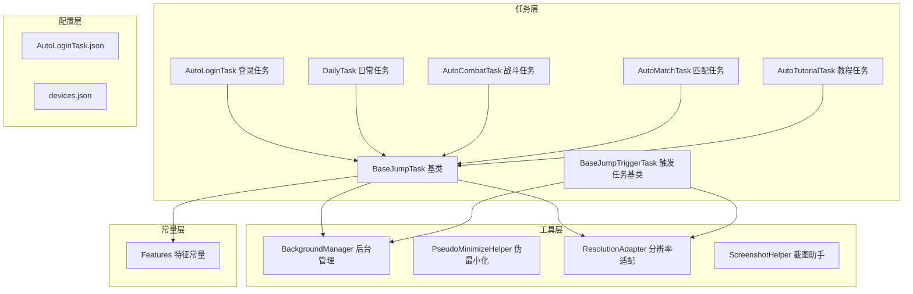

**图表来源**
- [BaseJumpTask.py:1-295](file://src/task/BaseJumpTask.py#L1-L295)
- [mixins.py:1-301](file://src/task/mixins.py#L1-L301)

**章节来源**
- [BaseJumpTask.py:1-295](file://src/task/BaseJumpTask.py#L1-L295)
- [mixins.py:1-301](file://src/task/mixins.py#L1-L301)

## 核心组件

### BaseJumpTask基类设计

BaseJumpTask是整个OK-Jump系统的核心基类，它继承自OK-Script框架的BaseTask类，并混入了JumpTaskMixin类。这种双重继承设计实现了功能的模块化和复用。

#### 设计理念

1. **单一职责原则**: BaseJumpTask专注于游戏自动化任务的基础功能
2. **开闭原则**: 通过混入模式扩展功能，无需修改现有代码
3. **里氏替换原则**: 子类可以无缝替换基类实例
4. **组合优于继承**: 通过混入模式实现功能组合

#### 核心功能架构

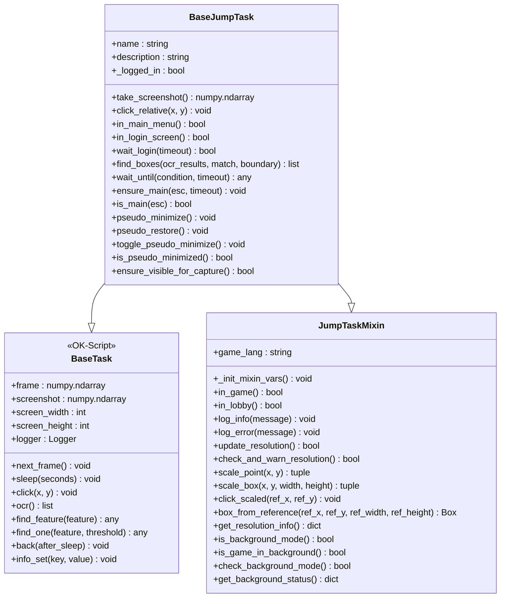

**图表来源**
- [BaseJumpTask.py:10-295](file://src/task/BaseJumpTask.py#L10-L295)
- [mixins.py:12-301](file://src/task/mixins.py#L12-L301)

**章节来源**
- [BaseJumpTask.py:10-295](file://src/task/BaseJumpTask.py#L10-L295)
- [mixins.py:12-301](file://src/task/mixins.py#L12-L301)

## 架构概览

OK-Jump系统采用分层架构设计，每一层都有明确的职责分工：

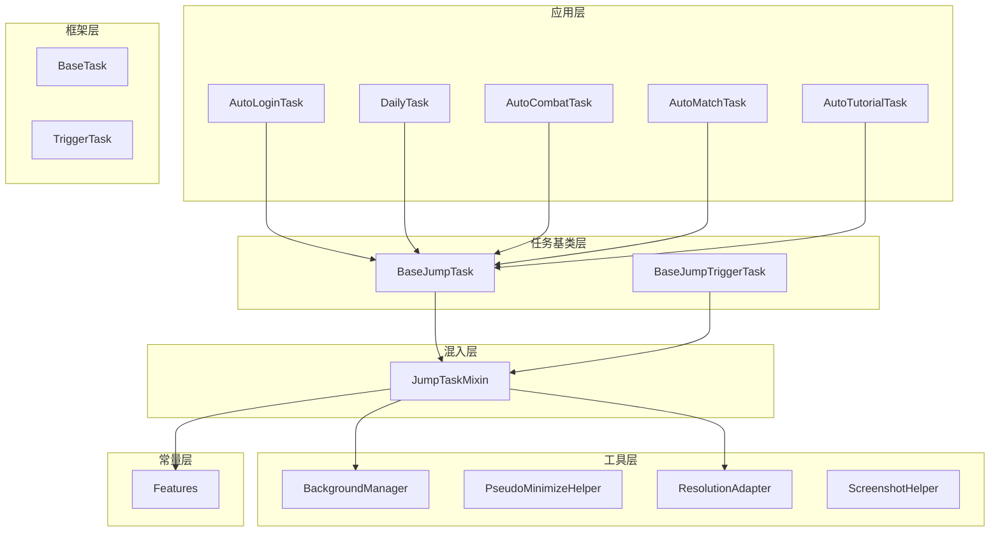

**图表来源**
- [BaseJumpTask.py:10-295](file://src/task/BaseJumpTask.py#L10-L295)
- [mixins.py:12-301](file://src/task/mixins.py#L12-L301)
- [BackgroundManager.py:7-145](file://src/utils/BackgroundManager.py#L7-L145)

## 详细组件分析

### 游戏状态检测系统

BaseJumpTask提供了完整的游戏状态检测功能，能够准确识别游戏的不同阶段。

#### 状态检测方法

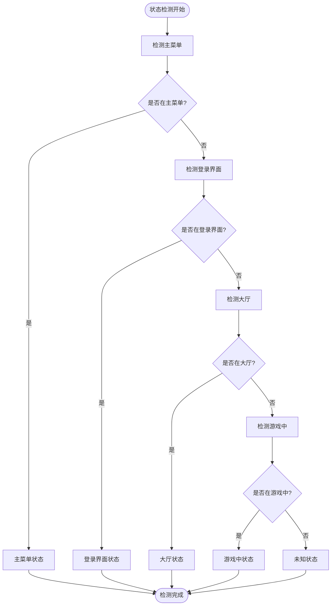

**图表来源**
- [BaseJumpTask.py:59-77](file://src/task/BaseJumpTask.py#L59-L77)
- [mixins.py:55-77](file://src/task/mixins.py#L55-L77)

#### 状态检测实现原理

每个状态检测方法都基于特征匹配和OCR识别相结合的方式：

1. **特征匹配**: 使用预定义的特征模板进行快速识别
2. **OCR辅助**: 在特征匹配失败时使用光学字符识别
3. **多策略验证**: 结合多种检测方法提高准确性

**章节来源**
- [BaseJumpTask.py:59-77](file://src/task/BaseJumpTask.py#L59-L77)
- [mixins.py:55-77](file://src/task/mixins.py#L55-L77)

### 分辨率自适应机制

OK-Jump系统实现了智能的分辨率自适应功能，能够处理不同分辨率和比例的游戏窗口。

#### 分辨率适配流程

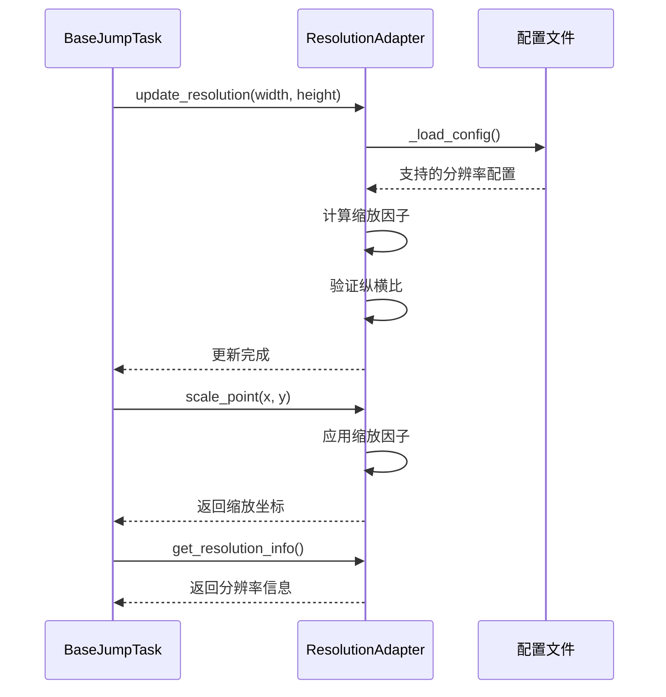

**图表来源**
- [mixins.py:101-144](file://src/task/mixins.py#L101-L144)
- [ResolutionAdapter.py:34-106](file://src/utils/ResolutionAdapter.py#L34-L106)

#### 分辨率适配特性

1. **参考分辨率**: 默认1920x1080，支持自定义配置
2. **纵横比验证**: 支持16:9等常见游戏纵横比
3. **动态缩放**: 实时计算和应用坐标缩放
4. **警告机制**: 检测到不支持的分辨率时发出警告

**章节来源**
- [mixins.py:101-250](file://src/task/mixins.py#L101-L250)
- [ResolutionAdapter.py:4-163](file://src/utils/ResolutionAdapter.py#L4-L163)

### 后台模式支持

后台模式是OK-Jump系统的重要特性，允许游戏在后台运行而不会影响自动化任务的执行。

#### 后台模式工作原理

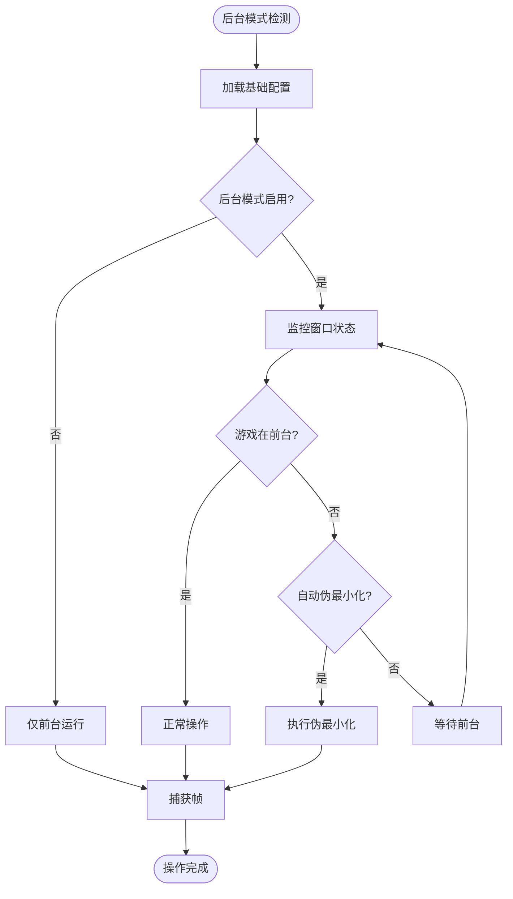

**图表来源**
- [BackgroundManager.py:18-111](file://src/utils/BackgroundManager.py#L18-L111)
- [mixins.py:254-291](file://src/task/mixins.py#L254-L291)

#### 后台模式功能特性

1. **窗口状态监控**: 实时检测游戏窗口的前台/后台状态
2. **自动伪最小化**: 在后台时自动将游戏窗口移动到不可见位置
3. **静音控制**: 支持在后台时自动静音游戏
4. **状态报告**: 提供详细的后台模式状态信息

**章节来源**
- [BackgroundManager.py:7-145](file://src/utils/BackgroundManager.py#L7-L145)
- [mixins.py:254-301](file://src/task/mixins.py#L254-L301)

### 登录等待机制

BaseJumpTask实现了智能的登录等待机制，能够自动处理各种登录场景。

#### 登录等待流程

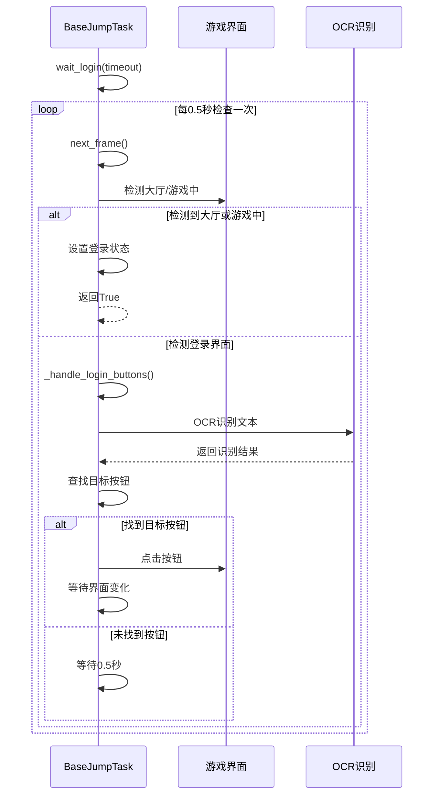

**图表来源**
- [BaseJumpTask.py:81-152](file://src/task/BaseJumpTask.py#L81-L152)

#### 登录处理策略

1. **多阶段检测**: 先检测大厅和游戏中状态，再检测登录界面
2. **智能按钮识别**: 支持特征匹配和OCR两种方式识别按钮
3. **超时控制**: 防止无限等待，支持自定义超时时间
4. **状态跟踪**: 维护登录状态，避免重复登录

**章节来源**
- [BaseJumpTask.py:81-152](file://src/task/BaseJumpTask.py#L81-L152)

### 伪最小化处理

伪最小化是后台模式的核心技术，通过将游戏窗口移动到屏幕外不可见位置来实现。

#### 伪最小化实现

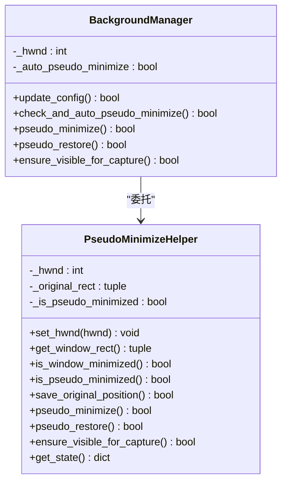

**图表来源**
- [PseudoMinimizeHelper.py:13-193](file://src/utils/PseudoMinimizeHelper.py#L13-L193)
- [BackgroundManager.py:87-134](file://src/utils/BackgroundManager.py#L87-L134)

#### 伪最小化技术细节

1. **窗口位置移动**: 将窗口移动到(-32000, -32000)位置
2. **状态保存**: 保存原始窗口位置，便于恢复
3. **状态检测**: 通过位置判断是否处于伪最小化状态
4. **安全恢复**: 确保窗口能够安全恢复到原始状态

**章节来源**
- [PseudoMinimizeHelper.py:13-193](file://src/utils/PseudoMinimizeHelper.py#L13-L193)
- [BackgroundManager.py:87-134](file://src/utils/BackgroundManager.py#L87-L134)

### 截图功能

BaseJumpTask提供了灵活的截图功能，支持多种截图场景。

#### 截图功能特性

1. **实时截图**: 直接从当前游戏帧获取截图
2. **模板提取**: 支持从截图中提取特征模板
3. **批量保存**: 支持批量保存截图文件
4. **格式支持**: 默认PNG格式，支持自定义命名

**章节来源**
- [BaseJumpTask.py:31-41](file://src/task/BaseJumpTask.py#L31-L41)
- [ScreenshotHelper.py:7-68](file://src/utils/ScreenshotHelper.py#L7-L68)

### 相对坐标点击

相对坐标系统是OK-Jump的核心交互功能，简化了跨分辨率的坐标操作。

#### 坐标转换流程

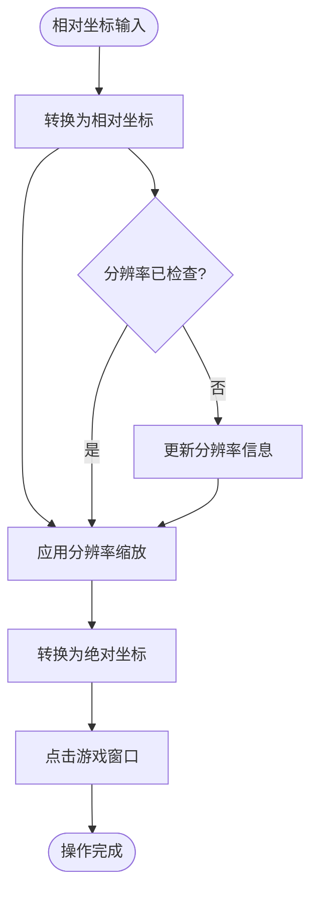

**图表来源**
- [mixins.py:181-198](file://src/task/mixins.py#L181-L198)

**章节来源**
- [mixins.py:145-198](file://src/task/mixins.py#L145-L198)

### 场景检测和OCR文本匹配

BaseJumpTask集成了强大的场景检测和OCR文本匹配功能。

#### OCR匹配算法

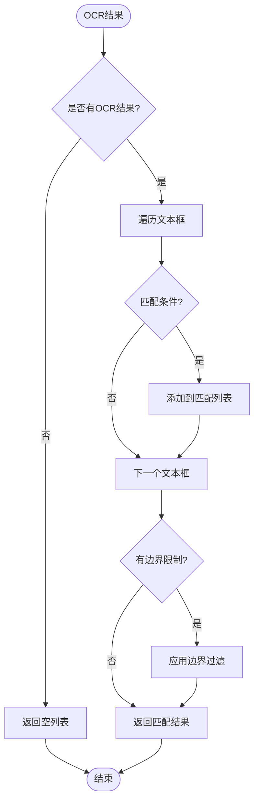

**图表来源**
- [BaseJumpTask.py:154-200](file://src/task/BaseJumpTask.py#L154-L200)

**章节来源**
- [BaseJumpTask.py:154-200](file://src/task/BaseJumpTask.py#L154-L200)

## 依赖关系分析

OK-Jump系统的依赖关系清晰且层次分明，体现了良好的软件工程实践。

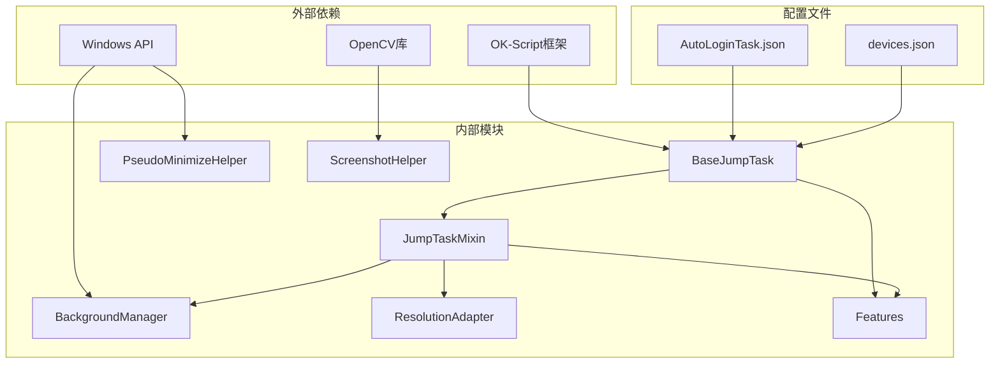

**图表来源**
- [BaseJumpTask.py:4-7](file://src/task/BaseJumpTask.py#L4-L7)
- [mixins.py:7-9](file://src/task/mixins.py#L7-L9)

### 关键依赖关系

1. **OK-Script框架**: 提供基础的任务框架和UI集成
2. **OpenCV库**: 支持图像处理和模板匹配
3. **Windows API**: 提供窗口管理和系统交互能力
4. **配置系统**: 支持动态配置和用户设置

**章节来源**
- [BaseJumpTask.py:4-7](file://src/task/BaseJumpTask.py#L4-L7)
- [mixins.py:7-9](file://src/task/mixins.py#L7-L9)

## 性能考虑

OK-Jump系统在设计时充分考虑了性能优化，采用了多种策略来提升执行效率。

### 性能优化策略

1. **延迟加载**: 分辨率信息和后台模式配置按需加载
2. **缓存机制**: OCR结果和特征匹配结果进行缓存
3. **异步处理**: 后台模式检查采用定时器机制
4. **资源管理**: 及时释放不再使用的资源

### 内存管理

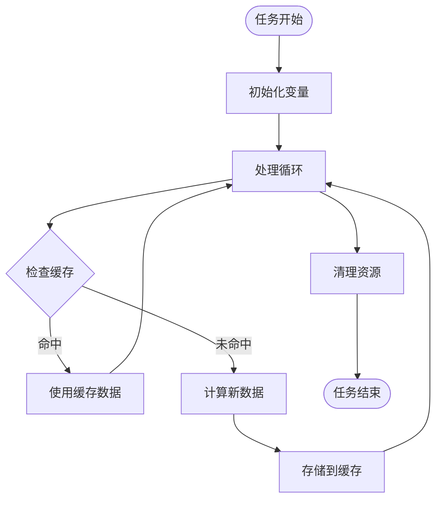

**图表来源**
- [AutoLoginTask.py:180-193](file://src/task/AutoLoginTask.py#L180-L193)

**章节来源**
- [AutoLoginTask.py:180-193](file://src/task/AutoLoginTask.py#L180-L193)

## 故障排除指南

### 常见问题及解决方案

#### 分辨率问题

**问题**: 分辨率不支持导致识别失败
**解决方案**: 
1. 检查配置文件中的支持分辨率设置
2. 使用`check_and_warn_resolution()`方法获取详细信息
3. 调整游戏窗口到支持的分辨率

#### 后台模式问题

**问题**: 后台模式下无法正常工作
**解决方案**:
1. 检查基础配置中的后台模式设置
2. 使用`get_background_status()`获取详细状态
3. 确认游戏窗口句柄正确设置

#### 登录问题

**问题**: 登录流程卡住
**解决方案**:
1. 检查登录超时设置
2. 验证特征模板文件是否存在
3. 使用OCR功能辅助识别

**章节来源**
- [mixins.py:120-143](file://src/task/mixins.py#L120-L143)
- [BackgroundManager.py:72-82](file://src/utils/BackgroundManager.py#L72-L82)

## 结论

BaseJumpTask基类设计体现了现代软件工程的最佳实践，通过合理的架构设计和功能模块化，为OK-Jump系统提供了强大而灵活的基础框架。

### 设计优势

1. **高内聚低耦合**: 功能模块划分清晰，依赖关系简单
2. **可扩展性强**: 通过混入模式轻松添加新功能
3. **易维护性**: 代码结构清晰，便于理解和修改
4. **跨平台兼容**: 基于OK-Script框架，具有良好兼容性

### 技术创新

1. **智能分辨率适配**: 自动处理不同分辨率和纵横比
2. **后台模式支持**: 创新的伪最小化技术
3. **多策略识别**: 结合特征匹配和OCR识别
4. **状态管理系统**: 完善的状态跟踪和恢复机制

### 发展前景

随着游戏自动化需求的增长，BaseJumpTask基类为OK-Jump系统的进一步发展奠定了坚实基础。未来可以在以下方面继续改进：

1. **AI集成**: 引入机器学习提升识别准确性
2. **云服务**: 支持云端配置和状态同步
3. **插件系统**: 提供更灵活的功能扩展机制
4. **性能优化**: 进一步提升处理速度和稳定性

通过持续的技术创新和功能完善，OK-Jump系统必将成为游戏自动化领域的优秀解决方案。