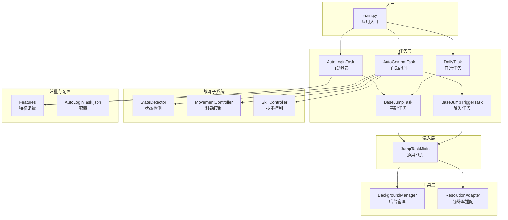
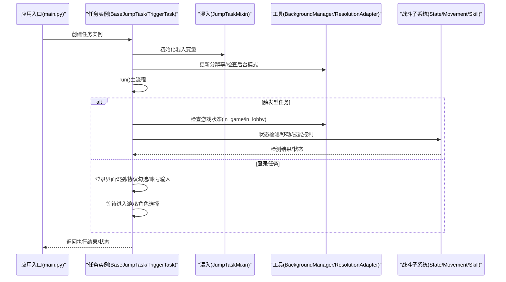
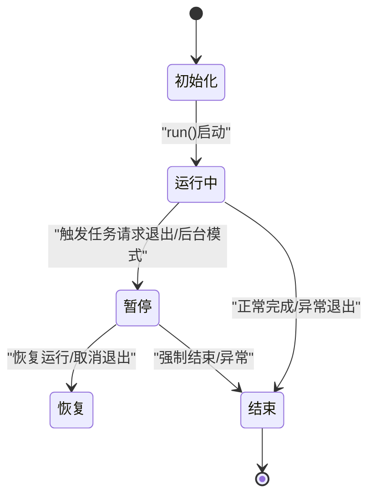
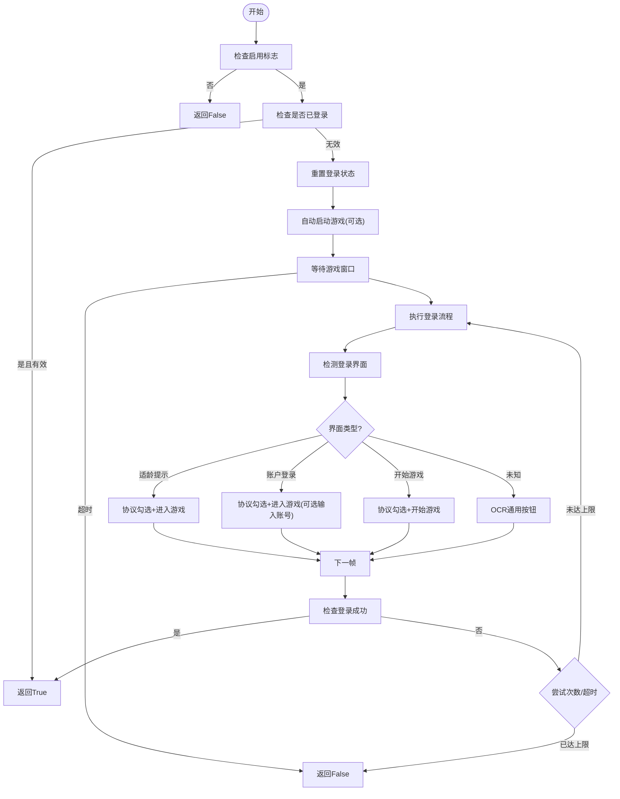
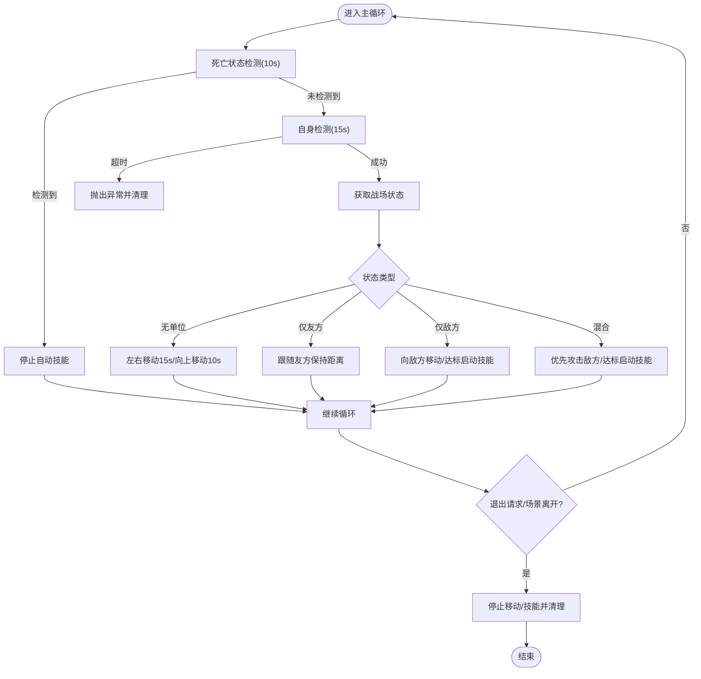
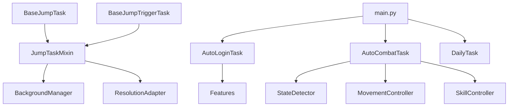

# 任务生命周期管理

<cite>
**本文档引用的文件**
- [BaseJumpTask.py](file://src/task/BaseJumpTask.py)
- [BaseJumpTriggerTask.py](file://src/task/BaseJumpTriggerTask.py)
- [mixins.py](file://src/task/mixins.py)
- [AutoLoginTask.py](file://src/task/AutoLoginTask.py)
- [AutoCombatTask.py](file://src/task/AutoCombatTask.py)
- [DailyTask.py](file://src/task/DailyTask.py)
- [features.py](file://src/constants/features.py)
- [BackgroundManager.py](file://src/utils/BackgroundManager.py)
- [ResolutionAdapter.py](file://src/utils/ResolutionAdapter.py)
- [state_detector.py](file://src/combat/state_detector.py)
- [movement_controller.py](file://src/combat/movement_controller.py)
- [skill_controller.py](file://src/combat/skill_controller.py)
- [AutoLoginTask.json](file://configs/AutoLoginTask.json)
- [main.py](file://main.py)
</cite>

## 目录
1. [简介](#简介)
2. [项目结构](#项目结构)
3. [核心组件](#核心组件)
4. [架构总览](#架构总览)
5. [详细组件分析](#详细组件分析)
6. [依赖关系分析](#依赖关系分析)
7. [性能考虑](#性能考虑)
8. [故障排查指南](#故障排查指南)
9. [结论](#结论)
10. [附录](#附录)

## 简介
本文件系统性阐述OK-Jump任务生命周期管理，覆盖从任务创建、初始化、运行、暂停、恢复到结束的完整流程；解释任务状态转换机制、错误处理与异常恢复策略；说明任务间依赖关系、协调机制与通信方式；介绍任务调度器工作原理、优先级管理与并发控制；并提供任务状态监控与调试技巧、持久化与重启恢复策略及性能优化建议。

## 项目结构
OK-Jump采用分层与职责分离的设计：
- 任务层：BaseJumpTask、BaseJumpTriggerTask及其子任务（AutoLoginTask、AutoCombatTask、DailyTask）
- 混入层：JumpTaskMixin提供跨任务共享能力（分辨率适配、后台模式、日志封装等）
- 工具层：BackgroundManager、ResolutionAdapter等通用工具
- 战斗子系统：state_detector、movement_controller、skill_controller等
- 常量与配置：features特征常量、各任务配置文件
- 入口：main.py负责应用启动与日志导出

图表来源
- [BaseJumpTask.py:10-295](file://src/task/BaseJumpTask.py#L10-L295)
- [BaseJumpTriggerTask.py:13-30](file://src/task/BaseJumpTriggerTask.py#L13-L30)
- [mixins.py:12-301](file://src/task/mixins.py#L12-L301)
- [AutoLoginTask.py:18-1105](file://src/task/AutoLoginTask.py#L18-L1105)
- [AutoCombatTask.py:25-431](file://src/task/AutoCombatTask.py#L25-L431)
- [DailyTask.py:5-133](file://src/task/DailyTask.py#L5-L133)
- [BackgroundManager.py:7-145](file://src/utils/BackgroundManager.py#L7-L145)
- [ResolutionAdapter.py:4-163](file://src/utils/ResolutionAdapter.py#L4-L163)
- [state_detector.py:23-200](file://src/combat/state_detector.py#L23-L200)
- [movement_controller.py:11-200](file://src/combat/movement_controller.py#L11-L200)
- [skill_controller.py:12-181](file://src/combat/skill_controller.py#L12-L181)
- [features.py:9-86](file://src/constants/features.py#L9-L86)
- [AutoLoginTask.json:1-12](file://configs/AutoLoginTask.json#L1-L12)
- [main.py:1-33](file://main.py#L1-L33)

章节来源
- [BaseJumpTask.py:10-295](file://src/task/BaseJumpTask.py#L10-L295)
- [mixins.py:12-301](file://src/task/mixins.py#L12-L301)
- [AutoLoginTask.py:18-1105](file://src/task/AutoLoginTask.py#L18-L1105)
- [AutoCombatTask.py:25-431](file://src/task/AutoCombatTask.py#L25-L431)
- [DailyTask.py:5-133](file://src/task/DailyTask.py#L5-L133)
- [BackgroundManager.py:7-145](file://src/utils/BackgroundManager.py#L7-L145)
- [ResolutionAdapter.py:4-163](file://src/utils/ResolutionAdapter.py#L4-L163)
- [state_detector.py:23-200](file://src/combat/state_detector.py#L23-L200)
- [movement_controller.py:11-200](file://src/combat/movement_controller.py#L11-L200)
- [skill_controller.py:12-181](file://src/combat/skill_controller.py#L12-L181)
- [features.py:9-86](file://src/constants/features.py#L9-L86)
- [AutoLoginTask.json:1-12](file://configs/AutoLoginTask.json#L1-L12)
- [main.py:1-33](file://main.py#L1-L33)

## 核心组件
- 任务基类与混入
  - BaseJumpTask：面向任务的通用能力（截图、坐标点击、场景检测、登录等待、伪最小化、等待条件等）
  - BaseJumpTriggerTask：触发型任务基类，用于周期性检查并执行
  - JumpTaskMixin：跨任务共享的通用能力（游戏语言检测、场景状态检测、分辨率适配、后台模式、日志封装等）
- 子任务
  - AutoLoginTask：自动登录流程，包含界面识别、协议勾选、账号输入、问卷调查处理等
  - AutoCombatTask：自动战斗，基于YOLO检测与控制器驱动的智能战斗逻辑
  - DailyTask：日常任务自动化
- 工具与常量
  - BackgroundManager：后台模式、静音、伪最小化、前台窗口检测
  - ResolutionAdapter：分辨率更新、缩放、纵横比校验
  - Features：统一的特征名称常量
- 战斗子系统
  - StateDetector：死亡状态、自身、友方、敌方检测
  - MovementController：PC/ADB移动控制
  - SkillController：PC/ADB技能释放与冷却管理

章节来源
- [BaseJumpTask.py:10-295](file://src/task/BaseJumpTask.py#L10-L295)
- [BaseJumpTriggerTask.py:13-30](file://src/task/BaseJumpTriggerTask.py#L13-L30)
- [mixins.py:12-301](file://src/task/mixins.py#L12-L301)
- [AutoLoginTask.py:18-1105](file://src/task/AutoLoginTask.py#L18-L1105)
- [AutoCombatTask.py:25-431](file://src/task/AutoCombatTask.py#L25-L431)
- [DailyTask.py:5-133](file://src/task/DailyTask.py#L5-L133)
- [BackgroundManager.py:7-145](file://src/utils/BackgroundManager.py#L7-L145)
- [ResolutionAdapter.py:4-163](file://src/utils/ResolutionAdapter.py#L4-L163)
- [features.py:9-86](file://src/constants/features.py#L9-L86)

## 架构总览
OK-Jump采用“任务基类 + 混入 + 子任务”的分层架构，配合工具层与战斗子系统，形成完整的任务生命周期管理闭环。任务通过混入获得通用能力，子任务实现具体业务逻辑，工具层保障运行环境一致性，战斗子系统提供AI驱动的智能行为。

图表来源
- [main.py:30-33](file://main.py#L30-L33)
- [BaseJumpTask.py:22-295](file://src/task/BaseJumpTask.py#L22-L295)
- [mixins.py:29-301](file://src/task/mixins.py#L29-L301)
- [AutoLoginTask.py:96-141](file://src/task/AutoLoginTask.py#L96-L141)
- [AutoCombatTask.py:71-113](file://src/task/AutoCombatTask.py#L71-L113)
- [state_detector.py:62-152](file://src/combat/state_detector.py#L62-L152)
- [movement_controller.py:95-104](file://src/combat/movement_controller.py#L95-L104)
- [skill_controller.py:53-102](file://src/combat/skill_controller.py#L53-L102)

## 详细组件分析

### 任务生命周期与状态转换
- 生命周期阶段
  - 初始化：构造任务、初始化混入变量、设置名称与描述
  - 运行：run()主流程，按任务类型执行不同逻辑
  - 暂停/恢复：通过触发任务的外部控制（如request_exit）与后台模式切换
  - 结束：清理资源、停止移动与技能、输出摘要
- 状态转换
  - 登录任务：未登录 → 等待登录 → 登录成功/失败 → 角色选择界面
  - 战斗任务：等待进入游戏 → 初始化控制器 → 主循环（死亡检测/自身检测/战场状态判断）→ 请求退出/异常 → 清理
  - 日常任务：启用检查 → 导航至任务界面 → 完成任务/收集奖励/使用体力 → 汇总

图表来源
- [AutoLoginTask.py:96-141](file://src/task/AutoLoginTask.py#L96-L141)
- [AutoCombatTask.py:161-183](file://src/task/AutoCombatTask.py#L161-L183)
- [AutoCombatTask.py:421-430](file://src/task/AutoCombatTask.py#L421-L430)
- [DailyTask.py:19-44](file://src/task/DailyTask.py#L19-L44)

章节来源
- [AutoLoginTask.py:96-141](file://src/task/AutoLoginTask.py#L96-L141)
- [AutoCombatTask.py:71-113](file://src/task/AutoCombatTask.py#L71-L113)
- [AutoCombatTask.py:161-183](file://src/task/AutoCombatTask.py#L161-L183)
- [AutoCombatTask.py:421-430](file://src/task/AutoCombatTask.py#L421-L430)
- [DailyTask.py:19-44](file://src/task/DailyTask.py#L19-L44)

### 登录任务生命周期（AutoLoginTask）
- 初始化与配置
  - 读取默认配置与用户配置，支持自动启动游戏、账号输入、登录等待超时等
- 主流程
  - 启用检查 → 自动启动游戏（可选）→ 等待游戏窗口 → 执行登录流程
- 登录流程
  - 登录界面识别（适龄提示/账户登录/开始游戏）→ 协议勾选（模板+OCR双重判定）→ 账号输入（模板定位+OCR校验+剪贴板输入）
  - 问卷调查处理（OCR/模板识别）→ 角色选择界面等待 → 登录成功
- 错误处理与异常恢复
  - 最大尝试次数与超时控制，OCR缓存与错误截图保存，账号输入异常捕获与重试
- 状态监控
  - 通过info_set设置登录状态，日志输出关键步骤与结果

图表来源
- [AutoLoginTask.py:96-141](file://src/task/AutoLoginTask.py#L96-L141)
- [AutoLoginTask.py:196-271](file://src/task/AutoLoginTask.py#L196-L271)
- [AutoLoginTask.py:481-566](file://src/task/AutoLoginTask.py#L481-L566)
- [AutoLoginTask.py:627-701](file://src/task/AutoLoginTask.py#L627-L701)
- [AutoLoginTask.py:758-793](file://src/task/AutoLoginTask.py#L758-L793)

章节来源
- [AutoLoginTask.py:45-67](file://src/task/AutoLoginTask.py#L45-L67)
- [AutoLoginTask.py:96-141](file://src/task/AutoLoginTask.py#L96-L141)
- [AutoLoginTask.py:196-271](file://src/task/AutoLoginTask.py#L196-L271)
- [AutoLoginTask.py:481-566](file://src/task/AutoLoginTask.py#L481-L566)
- [AutoLoginTask.py:627-701](file://src/task/AutoLoginTask.py#L627-L701)
- [AutoLoginTask.py:758-793](file://src/task/AutoLoginTask.py#L758-L793)
- [AutoLoginTask.json:1-12](file://configs/AutoLoginTask.json#L1-L12)

### 自动战斗任务生命周期（AutoCombatTask）
- 初始化与控制器
  - 测试模式/详细日志配置 → 分辨率更新与校验 → 等待进入游戏（测试模式跳过）
  - 初始化状态检测器、移动控制器、技能控制器、距离计算器
- 主循环
  - 死亡状态检测（10秒）→ 自身检测（15秒）→ 战场状态判断（4种）→ 根据状态执行移动/技能
  - 退出请求/场景离开 → 清理资源
- 战场状态处理
  - 无单位：左右移动15秒，若仍无单位则向上移动10秒，否则抛出异常
  - 仅有友方：跟随友方，保持100~200像素距离
  - 仅有敌方：向敌方移动，达标距离启动技能，否则仅移动
  - 友方+敌方：优先攻击敌方，达标距离启动技能

图表来源
- [AutoCombatTask.py:165-242](file://src/task/AutoCombatTask.py#L165-L242)
- [AutoCombatTask.py:274-394](file://src/task/AutoCombatTask.py#L274-L394)
- [AutoCombatTask.py:396-420](file://src/task/AutoCombatTask.py#L396-L420)
- [state_detector.py:62-152](file://src/combat/state_detector.py#L62-L152)
- [movement_controller.py:95-104](file://src/combat/movement_controller.py#L95-L104)
- [skill_controller.py:53-102](file://src/combat/skill_controller.py#L53-L102)

章节来源
- [AutoCombatTask.py:71-113](file://src/task/AutoCombatTask.py#L71-L113)
- [AutoCombatTask.py:165-242](file://src/task/AutoCombatTask.py#L165-L242)
- [AutoCombatTask.py:274-394](file://src/task/AutoCombatTask.py#L274-L394)
- [AutoCombatTask.py:396-420](file://src/task/AutoCombatTask.py#L396-L420)
- [state_detector.py:62-152](file://src/combat/state_detector.py#L62-L152)
- [movement_controller.py:95-104](file://src/combat/movement_controller.py#L95-L104)
- [skill_controller.py:53-102](file://src/combat/skill_controller.py#L53-L102)

### 日常任务生命周期（DailyTask）
- 启用检查 → 导航至任务界面 → 完成日常任务 → 收集奖励 → 使用体力 → 汇总结果
- 通过特征检测与点击实现自动化

章节来源
- [DailyTask.py:19-44](file://src/task/DailyTask.py#L19-L44)
- [DailyTask.py:46-87](file://src/task/DailyTask.py#L46-L87)
- [DailyTask.py:89-108](file://src/task/DailyTask.py#L89-L108)
- [DailyTask.py:110-123](file://src/task/DailyTask.py#L110-L123)
- [DailyTask.py:125-132](file://src/task/DailyTask.py#L125-L132)

### 任务状态监控与调试
- 日志封装：统一的日志接口，便于追踪任务状态
- 信息设置：通过info_set设置任务状态（如登录状态），便于UI显示
- 调试技巧
  - 启用详细日志（AutoCombatTask）查看YOLO检测、位置与距离信息
  - 使用截图保存错误场景，辅助定位问题
  - 分辨率适配与后台模式检查，确保识别稳定性

章节来源
- [mixins.py:81-97](file://src/task/mixins.py#L81-L97)
- [AutoLoginTask.py:105-140](file://src/task/AutoLoginTask.py#L105-L140)
- [AutoCombatTask.py:129-133](file://src/task/AutoCombatTask.py#L129-L133)
- [AutoCombatTask.py:244-251](file://src/task/AutoCombatTask.py#L244-L251)

### 任务间依赖关系与协调机制
- 依赖关系
  - AutoLoginTask为前置任务，确保进入游戏与角色选择界面
  - AutoCombatTask依赖AutoLoginTask完成登录，或在测试模式下直接启动
  - DailyTask独立运行，可与其他任务并行
- 协调机制
  - 通过任务状态检测（in_game/in_lobby）与等待机制（wait_until）协调
  - 触发任务通过request_exit对外暴露退出信号，由上层控制

章节来源
- [AutoLoginTask.py:121-137](file://src/task/AutoLoginTask.py#L121-L137)
- [AutoCombatTask.py:97-104](file://src/task/AutoCombatTask.py#L97-L104)
- [AutoCombatTask.py:161-163](file://src/task/AutoCombatTask.py#L161-L163)
- [BaseJumpTask.py:202-232](file://src/task/BaseJumpTask.py#L202-L232)

### 任务调度器与并发控制
- 调度器工作原理
  - 应用入口通过OK框架启动，任务以任务实例形式运行
  - 触发任务（AutoCombatTask）通过外部请求（如request_exit）与后台模式切换实现暂停/恢复
- 并发控制
  - 任务间通过状态检测与等待机制避免冲突
  - 后台模式下通过伪最小化与静音减少对系统的影响

章节来源
- [main.py:30-33](file://main.py#L30-L33)
- [AutoCombatTask.py:161-163](file://src/task/AutoCombatTask.py#L161-L163)
- [BackgroundManager.py:18-82](file://src/utils/BackgroundManager.py#L18-L82)

### 错误处理与异常恢复策略
- 登录任务
  - 账号输入异常捕获与重试，OCR缓存与超时控制，错误截图保存
- 战斗任务
  - 自身检测超时抛出异常并清理，退出请求与场景离开安全退出
- 通用策略
  - 分辨率校验与警告，后台模式状态检查，日志与信息设置辅助恢复

章节来源
- [AutoLoginTask.py:13-15](file://src/task/AutoLoginTask.py#L13-L15)
- [AutoLoginTask.py:253-256](file://src/task/AutoLoginTask.py#L253-L256)
- [AutoLoginTask.py:694-701](file://src/task/AutoLoginTask.py#L694-L701)
- [AutoCombatTask.py:213-215](file://src/task/AutoCombatTask.py#L213-L215)
- [AutoCombatTask.py:180-183](file://src/task/AutoCombatTask.py#L180-L183)
- [mixins.py:120-143](file://src/task/mixins.py#L120-L143)
- [BackgroundManager.py:67-70](file://src/utils/BackgroundManager.py#L67-L70)

### 任务持久化、重启恢复与性能优化
- 持久化与重启恢复
  - 登录状态与任务状态通过info_set与配置文件持久化
  - 账号输入与OCR缓存减少重复识别开销
- 性能优化
  - 分辨率适配与缩放，避免高分辨率带来的计算压力
  - OCR缓存与模板匹配结合，提高识别效率
  - 后台模式与伪最小化降低CPU占用

章节来源
- [AutoLoginTask.py:55-66](file://src/task/AutoLoginTask.py#L55-L66)
- [AutoLoginTask.py:180-192](file://src/task/AutoLoginTask.py#L180-L192)
- [mixins.py:101-118](file://src/task/mixins.py#L101-L118)
- [BackgroundManager.py:91-111](file://src/utils/BackgroundManager.py#L91-L111)

## 依赖关系分析
- 组件耦合
  - 任务与混入：强耦合（继承+混入），提升代码复用
  - 任务与工具：弱耦合（通过接口调用），便于替换与扩展
  - 战斗子系统：内部高内聚，通过StateDetector对外提供统一接口
- 外部依赖
  - OK框架与设备管理（og）
  - Windows API（后台模式、窗口操作）
  - OpenCV（模板匹配）
  - YOLO模型（战斗状态检测）

图表来源
- [AutoLoginTask.py:9-10](file://src/task/AutoLoginTask.py#L9-L10)
- [AutoCombatTask.py:15-22](file://src/task/AutoCombatTask.py#L15-L22)
- [BaseJumpTask.py:6](file://src/task/BaseJumpTask.py#L6)
- [BaseJumpTriggerTask.py:8-10](file://src/task/BaseJumpTriggerTask.py#L8-L10)
- [mixins.py:7-9](file://src/task/mixins.py#L7-L9)
- [BackgroundManager.py:3-4](file://src/utils/BackgroundManager.py#L3-L4)
- [ResolutionAdapter.py:1](file://src/utils/ResolutionAdapter.py#L1)
- [features.py:7-8](file://src/constants/features.py#L7-L8)
- [main.py:6](file://main.py#L6)

章节来源
- [AutoLoginTask.py:9-10](file://src/task/AutoLoginTask.py#L9-L10)
- [AutoCombatTask.py:15-22](file://src/task/AutoCombatTask.py#L15-L22)
- [BaseJumpTask.py:6](file://src/task/BaseJumpTask.py#L6)
- [BaseJumpTriggerTask.py:8-10](file://src/task/BaseJumpTriggerTask.py#L8-L10)
- [mixins.py:7-9](file://src/task/mixins.py#L7-L9)
- [BackgroundManager.py:3-4](file://src/utils/BackgroundManager.py#L3-L4)
- [ResolutionAdapter.py:1](file://src/utils/ResolutionAdapter.py#L1)
- [features.py:7-8](file://src/constants/features.py#L7-L8)
- [main.py:6](file://main.py#L6)

## 性能考虑
- 识别效率
  - OCR缓存与模板匹配结合，减少重复计算
  - YOLO检测按需调用，避免高频扫描
- 资源管理
  - 分辨率适配减少不必要的缩放与变换
  - 后台模式与伪最小化降低系统开销
- 并发与同步
  - 任务间通过状态检测与等待机制避免竞争
  - 触发任务通过退出请求实现优雅停止

## 故障排查指南
- 登录失败
  - 检查配置项（自动启动、等待时间、最大尝试次数）
  - 查看OCR缓存与错误截图，确认界面识别是否正确
  - 验证账号输入模板与OCR校验逻辑
- 战斗异常
  - 检查自身检测是否超时，确认YOLO模型可用
  - 查看详细日志中的检测结果与距离信息
  - 确认分辨率与后台模式设置
- 后台模式问题
  - 检查后台模式配置与前台窗口检测
  - 使用伪最小化功能确保截图可用

章节来源
- [AutoLoginTask.py:196-271](file://src/task/AutoLoginTask.py#L196-L271)
- [AutoCombatTask.py:213-215](file://src/task/AutoCombatTask.py#L213-L215)
- [AutoCombatTask.py:244-251](file://src/task/AutoCombatTask.py#L244-L251)
- [BackgroundManager.py:36-65](file://src/utils/BackgroundManager.py#L36-L65)

## 结论
OK-Jump通过清晰的任务分层与混入机制，实现了可扩展、可维护的任务生命周期管理。登录、战斗、日常任务分别覆盖核心业务场景，配合工具层与战斗子系统，提供了稳定可靠的自动化能力。通过完善的错误处理、状态监控与性能优化策略，系统能够在复杂环境下保持高效与可靠。

## 附录
- 配置文件示例：AutoLoginTask.json
- 特征常量：features.py
- 应用入口：main.py

章节来源
- [AutoLoginTask.json:1-12](file://configs/AutoLoginTask.json#L1-L12)
- [features.py:9-86](file://src/constants/features.py#L9-L86)
- [main.py:1-33](file://main.py#L1-L33)