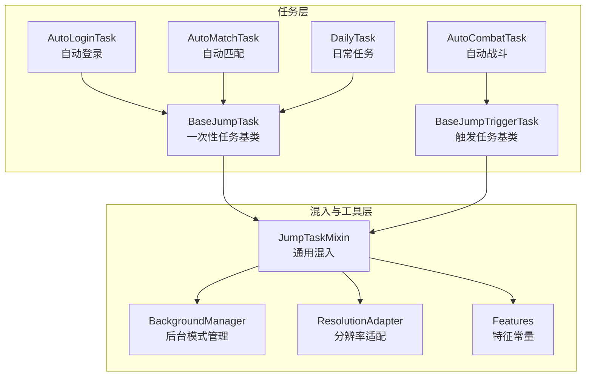
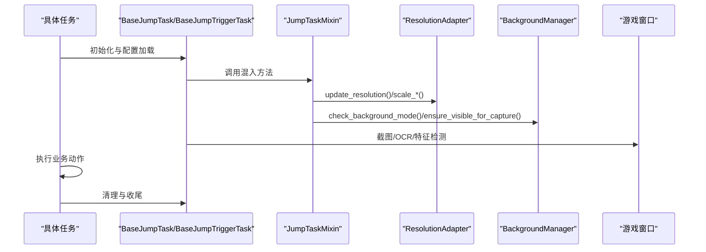
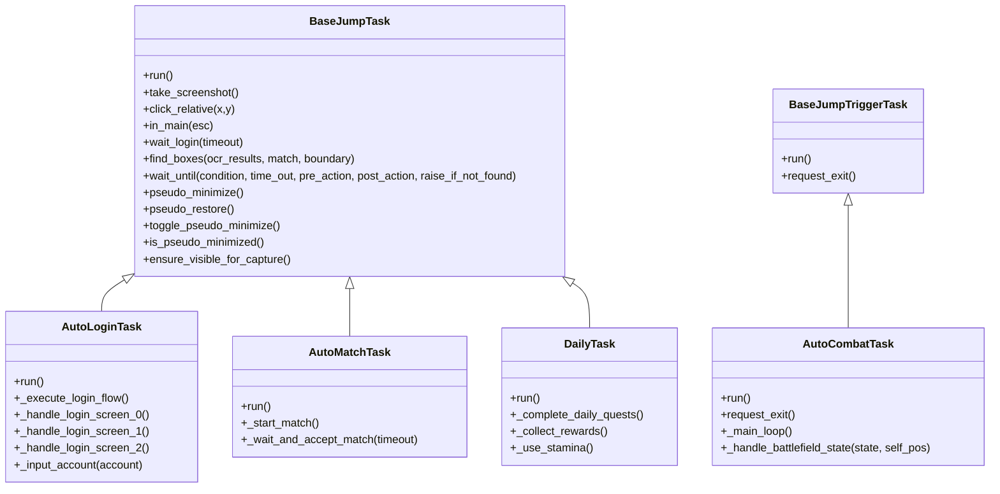
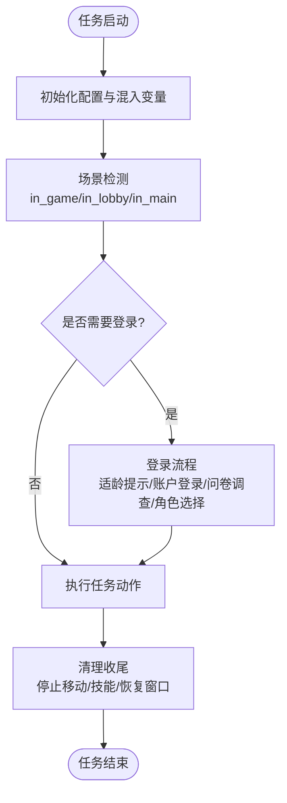
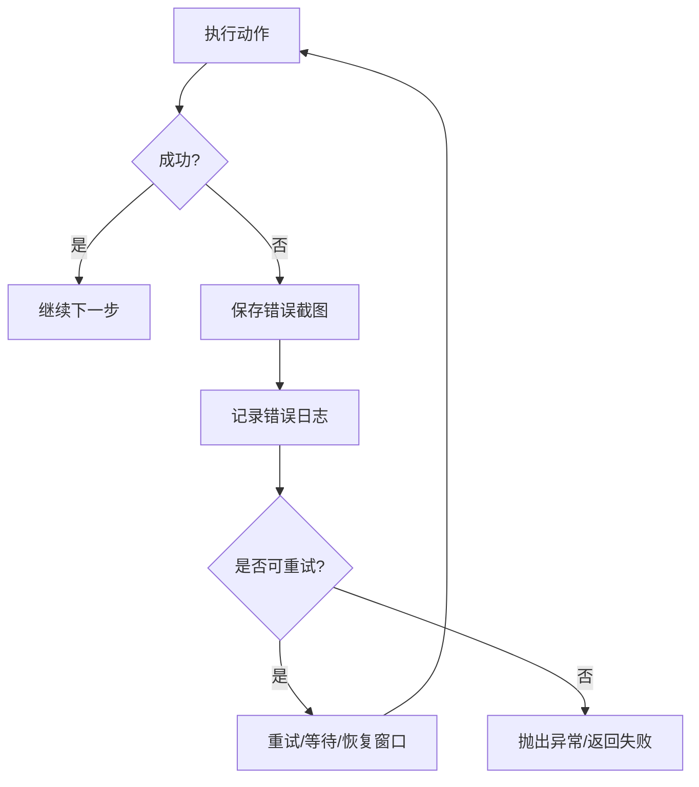
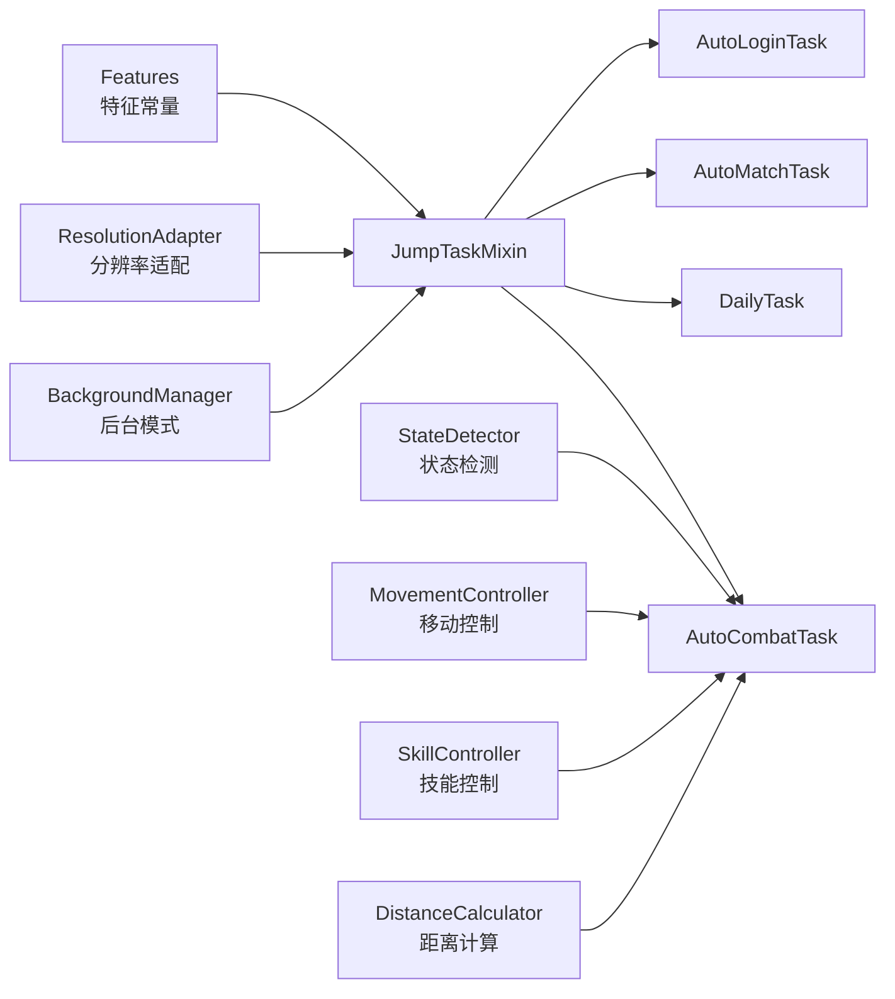
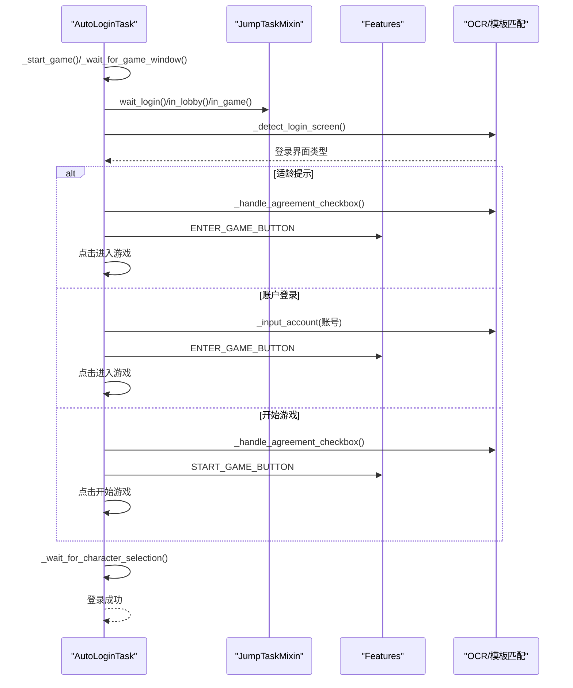
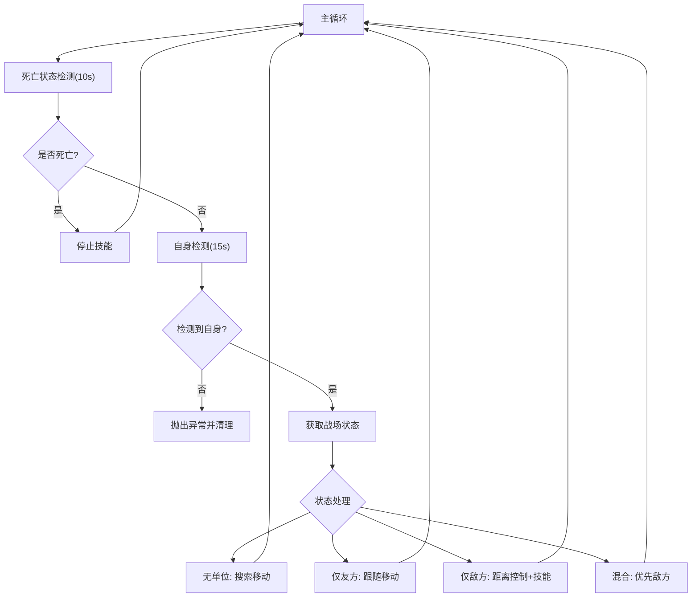
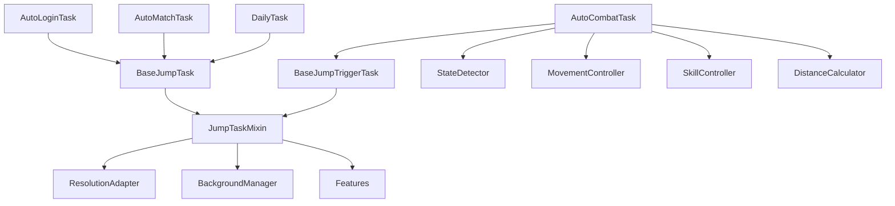

# 任务系统详解

<cite>
**本文档引用的文件**
- [BaseJumpTask.py](file://src/task/BaseJumpTask.py)
- [BaseJumpTriggerTask.py](file://src/task/BaseJumpTriggerTask.py)
- [mixins.py](file://src/task/mixins.py)
- [AutoLoginTask.py](file://src/task/AutoLoginTask.py)
- [AutoCombatTask.py](file://src/task/AutoCombatTask.py)
- [AutoMatchTask.py](file://src/task/AutoMatchTask.py)
- [DailyTask.py](file://src/task/DailyTask.py)
- [features.py](file://src/constants/features.py)
- [state_detector.py](file://src/combat/state_detector.py)
- [BackgroundManager.py](file://src/utils/BackgroundManager.py)
- [ResolutionAdapter.py](file://src/utils/ResolutionAdapter.py)
- [AutoLoginTask.json](file://configs/AutoLoginTask.json)
- [AutoCombatTask.json](file://configs/AutoCombatTask.json)
</cite>

## 目录
1. [简介](#简介)
2. [项目结构](#项目结构)
3. [核心组件](#核心组件)
4. [架构总览](#架构总览)
5. [详细组件分析](#详细组件分析)
6. [依赖关系分析](#依赖关系分析)
7. [性能考量](#性能考量)
8. [故障排查指南](#故障排查指南)
9. [结论](#结论)
10. [附录](#附录)

## 简介
本文件面向开发者，系统性解析 OK-Jump 任务系统的实现与设计理念，重点覆盖：
- 一次性任务与触发任务的区别与适用场景
- 任务生命周期管理、状态转换与错误处理机制
- 任务间依赖关系与协调机制
- 具体代码示例与最佳实践
- 如何扩展任务系统以创建自定义任务类型与集成新自动化功能

## 项目结构
OK-Jump 的任务系统采用“基类 + 混入 + 具体任务”的分层设计，通过 Mixin 模式复用通用能力，降低重复代码，提升可维护性与扩展性。

图表来源
- [BaseJumpTask.py:10-295](file://src/task/BaseJumpTask.py#L10-L295)
- [BaseJumpTriggerTask.py:13-30](file://src/task/BaseJumpTriggerTask.py#L13-L30)
- [mixins.py:12-301](file://src/task/mixins.py#L12-L301)
- [BackgroundManager.py:7-145](file://src/utils/BackgroundManager.py#L7-L145)
- [ResolutionAdapter.py:4-163](file://src/utils/ResolutionAdapter.py#L4-L163)
- [features.py:9-86](file://src/constants/features.py#L9-L86)

章节来源
- [BaseJumpTask.py:10-295](file://src/task/BaseJumpTask.py#L10-L295)
- [BaseJumpTriggerTask.py:13-30](file://src/task/BaseJumpTriggerTask.py#L13-L30)
- [mixins.py:12-301](file://src/task/mixins.py#L12-L301)

## 核心组件
- 一次性任务基类 BaseJumpTask：面向独立执行、单次完成的任务，提供截图、坐标点击、场景检测、登录等待、OCR 文本框筛选、等待条件、伪最小化等能力。
- 触发任务基类 BaseJumpTriggerTask：面向周期性检查与触发的任务，如自动战斗，强调在其他任务中被调用的触发式行为。
- 通用混入 JumpTaskMixin：集中提供分辨率适配、后台模式、窗口可见性保障、日志封装、特征检测等跨任务通用能力，通过 Mixin 模式复用。
- 具体任务：
  - AutoLoginTask：自动登录流程，包含适龄提示、账户登录、问卷调查、角色选择等多阶段处理。
  - AutoMatchTask：自动匹配与接受，基于特征或相对坐标点击。
  - AutoCombatTask：自动战斗，基于 YOLO 检测的战场状态机与智能控制。
  - DailyTask：日常任务、奖励领取、体力使用等。

章节来源
- [BaseJumpTask.py:10-295](file://src/task/BaseJumpTask.py#L10-L295)
- [BaseJumpTriggerTask.py:13-30](file://src/task/BaseJumpTriggerTask.py#L13-L30)
- [mixins.py:12-301](file://src/task/mixins.py#L12-L301)
- [AutoLoginTask.py:18-1105](file://src/task/AutoLoginTask.py#L18-L1105)
- [AutoMatchTask.py:5-104](file://src/task/AutoMatchTask.py#L5-L104)
- [AutoCombatTask.py:25-357](file://src/task/AutoCombatTask.py#L25-L357)
- [DailyTask.py:5-133](file://src/task/DailyTask.py#L5-L133)

## 架构总览
任务系统围绕“基类 + 混入 + 具体任务”展开，通过以下关键机制实现：
- 任务生命周期：初始化 -> 配置加载 -> 场景检测 -> 动作执行 -> 清理收尾
- 状态检测：in_game/in_lobby/in_main 等状态机驱动任务流转
- 错误处理：超时、异常捕获、截图保存、日志记录
- 依赖协调：分辨率适配、后台模式、窗口可见性保障

图表来源
- [BaseJumpTask.py:22-295](file://src/task/BaseJumpTask.py#L22-L295)
- [BaseJumpTriggerTask.py:25-30](file://src/task/BaseJumpTriggerTask.py#L25-L30)
- [mixins.py:29-301](file://src/task/mixins.py#L29-L301)
- [ResolutionAdapter.py:34-163](file://src/utils/ResolutionAdapter.py#L34-L163)
- [BackgroundManager.py:18-145](file://src/utils/BackgroundManager.py#L18-L145)

## 详细组件分析

### 一次性任务与触发任务的区别与应用
- 一次性任务（BaseJumpTask）
  - 特点：独立执行、单次完成；适合登录、匹配、日常等一次性流程。
  - 典型用法：run() 中按顺序执行各阶段，最终返回布尔结果。
  - 示例：AutoLoginTask、AutoMatchTask、DailyTask。
- 触发任务（BaseJumpTriggerTask）
  - 特点：周期性检查并触发，通常在其他任务中被调用；适合战斗、监控等需要持续运行的场景。
  - 典型用法：run() 中启动主循环，内部通过状态检测与控制逻辑驱动。
  - 示例：AutoCombatTask。

图表来源
- [BaseJumpTask.py:10-295](file://src/task/BaseJumpTask.py#L10-L295)
- [BaseJumpTriggerTask.py:13-30](file://src/task/BaseJumpTriggerTask.py#L13-L30)
- [AutoLoginTask.py:18-1105](file://src/task/AutoLoginTask.py#L18-L1105)
- [AutoMatchTask.py:5-104](file://src/task/AutoMatchTask.py#L5-L104)
- [AutoCombatTask.py:25-357](file://src/task/AutoCombatTask.py#L25-L357)
- [DailyTask.py:5-133](file://src/task/DailyTask.py#L5-L133)

章节来源
- [BaseJumpTask.py:10-295](file://src/task/BaseJumpTask.py#L10-L295)
- [BaseJumpTriggerTask.py:13-30](file://src/task/BaseJumpTriggerTask.py#L13-L30)
- [AutoLoginTask.py:18-1105](file://src/task/AutoLoginTask.py#L18-L1105)
- [AutoMatchTask.py:5-104](file://src/task/AutoMatchTask.py#L5-L104)
- [AutoCombatTask.py:25-357](file://src/task/AutoCombatTask.py#L25-L357)
- [DailyTask.py:5-133](file://src/task/DailyTask.py#L5-L133)

### 任务生命周期管理与状态转换
- 生命周期阶段
  - 初始化：加载默认配置、设置名称与描述、初始化混入变量。
  - 场景检测：in_game/in_lobby/in_main 等状态判断，必要时等待登录或返回主界面。
  - 动作执行：根据任务类型执行不同业务逻辑（登录、匹配、战斗、日常）。
  - 清理收尾：停止移动与技能、恢复窗口状态、记录日志。
- 状态转换
  - 登录流程：适龄提示 -> 账户登录 -> 开始游戏 -> 角色选择 -> 成功进入游戏。
  - 战斗流程：死亡状态检测 -> 自身检测 -> 战场状态判断 -> 距离控制与技能释放。
  - 匹配流程：导航至大厅 -> 开始匹配 -> 接受匹配 -> 进入游戏。

图表来源
- [BaseJumpTask.py:22-295](file://src/task/BaseJumpTask.py#L22-L295)
- [AutoLoginTask.py:96-271](file://src/task/AutoLoginTask.py#L96-L271)
- [AutoCombatTask.py:65-107](file://src/task/AutoCombatTask.py#L65-L107)

章节来源
- [BaseJumpTask.py:22-295](file://src/task/BaseJumpTask.py#L22-L295)
- [AutoLoginTask.py:96-271](file://src/task/AutoLoginTask.py#L96-L271)
- [AutoCombatTask.py:65-107](file://src/task/AutoCombatTask.py#L65-L107)

### 错误处理机制
- 超时与重试：wait_until、_wait_for_character_selection、账号输入超时等。
- 异常捕获：AutoLoginInputException、OCR 缓存与校验失败、窗口不可见恢复。
- 日志与截图：错误发生时保存截图，便于定位问题。
- 后台模式与窗口可见性：后台模式下进行伪最小化与可见性保障，避免识别失败。

图表来源
- [AutoLoginTask.py:13-16](file://src/task/AutoLoginTask.py#L13-L16)
- [AutoLoginTask.py:250-271](file://src/task/AutoLoginTask.py#L250-L271)
- [AutoLoginTask.py:628-701](file://src/task/AutoLoginTask.py#L628-L701)
- [BackgroundManager.py:113-145](file://src/utils/BackgroundManager.py#L113-L145)

章节来源
- [AutoLoginTask.py:13-16](file://src/task/AutoLoginTask.py#L13-L16)
- [AutoLoginTask.py:250-271](file://src/task/AutoLoginTask.py#L250-L271)
- [AutoLoginTask.py:628-701](file://src/task/AutoLoginTask.py#L628-L701)
- [BackgroundManager.py:113-145](file://src/utils/BackgroundManager.py#L113-L145)

### 任务间依赖关系与协调机制
- 分辨率适配：JumpTaskMixin.update_resolution() 与 ResolutionAdapter 统一坐标缩放，确保不同分辨率下点击与识别准确。
- 后台模式：JumpTaskMixin.check_background_mode() 与 BackgroundManager 协同，后台时可进行伪最小化与静音控制。
- 特征检测：通过 Features 常量统一管理 coco_detection.json 中的类别名称，保证任务与模型配置一致。
- 战斗协调：AutoCombatTask 通过 StateDetector、MovementController、SkillController、DistanceCalculator 四个子系统协作，形成闭环控制。

图表来源
- [mixins.py:29-301](file://src/task/mixins.py#L29-L301)
- [ResolutionAdapter.py:34-163](file://src/utils/ResolutionAdapter.py#L34-L163)
- [BackgroundManager.py:18-145](file://src/utils/BackgroundManager.py#L18-L145)
- [features.py:9-86](file://src/constants/features.py#L9-L86)
- [AutoCombatTask.py:109-115](file://src/task/AutoCombatTask.py#L109-L115)

章节来源
- [mixins.py:29-301](file://src/task/mixins.py#L29-L301)
- [ResolutionAdapter.py:34-163](file://src/utils/ResolutionAdapter.py#L34-L163)
- [BackgroundManager.py:18-145](file://src/utils/BackgroundManager.py#L18-L145)
- [features.py:9-86](file://src/constants/features.py#L9-L86)
- [AutoCombatTask.py:109-115](file://src/task/AutoCombatTask.py#L109-L115)

### 自动登录任务（一次性任务典型代表）
- 登录流程要点
  - 启动游戏（可选）、等待窗口、检测登录界面类型（适龄提示/账户登录/开始游戏）。
  - 处理协议勾选框（模板置信度比较），避免误点击。
  - 账号输入（模板定位 + OCR 定位 + 全选/删除/输入/校验）。
  - 问卷调查处理与角色选择检测。
- OCR 缓存与校验：_get_ocr_texts() 缓存 OCR 结果，_verify_account_input() 在限定时间内校验输入结果。
- 错误处理：AutoLoginInputException 异常捕获与截图保存，超时与最大尝试次数控制。

图表来源
- [AutoLoginTask.py:96-271](file://src/task/AutoLoginTask.py#L96-L271)
- [AutoLoginTask.py:481-566](file://src/task/AutoLoginTask.py#L481-L566)
- [AutoLoginTask.py:628-757](file://src/task/AutoLoginTask.py#L628-L757)
- [features.py:22-44](file://src/constants/features.py#L22-L44)

章节来源
- [AutoLoginTask.py:96-271](file://src/task/AutoLoginTask.py#L96-L271)
- [AutoLoginTask.py:481-566](file://src/task/AutoLoginTask.py#L481-L566)
- [AutoLoginTask.py:628-757](file://src/task/AutoLoginTask.py#L628-L757)
- [features.py:22-44](file://src/constants/features.py#L22-L44)

### 自动战斗任务（触发任务典型代表）
- 战斗状态机
  - 死亡状态检测（10秒循环）
  - 自身检测（15秒超时）
  - 战场状态判断（无单位/仅友方/仅敌方/混合）
  - 距离控制与技能释放
- 控制器协作
  - StateDetector：YOLO 检测自身、友方、敌方与死亡状态
  - MovementController：移动控制（前进/后退/左右）
  - SkillController：技能释放与间隔控制
  - DistanceCalculator：距离计算与最优区间判断
- 触发与退出
  - request_exit() 设置退出标志，主循环检测并清理资源。

图表来源
- [AutoCombatTask.py:147-199](file://src/task/AutoCombatTask.py#L147-L199)
- [AutoCombatTask.py:200-321](file://src/task/AutoCombatTask.py#L200-L321)
- [state_detector.py:51-123](file://src/combat/state_detector.py#L51-L123)

章节来源
- [AutoCombatTask.py:147-199](file://src/task/AutoCombatTask.py#L147-L199)
- [AutoCombatTask.py:200-321](file://src/task/AutoCombatTask.py#L200-L321)
- [state_detector.py:51-123](file://src/combat/state_detector.py#L51-L123)

### 配置与最佳实践
- 配置文件
  - AutoLoginTask.json：启用、自动启动游戏、等待时间、最大尝试次数、账号输入开关与校验超时、登录等待超时、点击后等待时间。
  - AutoCombatTask.json：自动普攻/技能/大招开关与间隔。
- 最佳实践
  - 使用 JumpTaskMixin 的 wait_until 与 ensure_main 统一等待与返回主界面逻辑。
  - 分辨率适配：先 update_resolution()，再进行点击与识别。
  - 后台模式：check_background_mode() 记录状态，必要时 ensure_visible_for_capture()。
  - OCR 缓存：_get_ocr_texts() 缓存结果，减少重复开销。
  - 错误处理：捕获特定异常（如 AutoLoginInputException），保存截图并记录日志。

章节来源
- [AutoLoginTask.json:1-12](file://configs/AutoLoginTask.json#L1-L12)
- [AutoCombatTask.json:1-10](file://configs/AutoCombatTask.json#L1-L10)
- [BaseJumpTask.py:202-232](file://src/task/BaseJumpTask.py#L202-L232)
- [mixins.py:101-144](file://src/task/mixins.py#L101-L144)
- [mixins.py:272-292](file://src/task/mixins.py#L272-L292)

## 依赖关系分析
- 组件耦合
  - JumpTaskMixin 与 ResolutionAdapter、BackgroundManager、Features 解耦，通过接口调用而非直接依赖，降低耦合度。
  - AutoCombatTask 依赖多个子系统（StateDetector、MovementController、SkillController、DistanceCalculator），但通过构造函数注入，便于测试与替换。
- 外部依赖
  - YOLO 检测：og.my_app.yolo_detect 用于单位与状态检测。
  - Windows API：win32gui/win32con 用于窗口可见性恢复。
  - OpenCV：cv2 用于模板匹配与灰度转换。

图表来源
- [AutoLoginTask.py:9-1105](file://src/task/AutoLoginTask.py#L9-L1105)
- [AutoMatchTask.py:1-104](file://src/task/AutoMatchTask.py#L1-L104)
- [DailyTask.py:1-133](file://src/task/DailyTask.py#L1-L133)
- [AutoCombatTask.py:15-357](file://src/task/AutoCombatTask.py#L15-L357)
- [BaseJumpTask.py:6-295](file://src/task/BaseJumpTask.py#L6-L295)
- [BaseJumpTriggerTask.py:8-30](file://src/task/BaseJumpTriggerTask.py#L8-L30)
- [mixins.py:7-301](file://src/task/mixins.py#L7-L301)

章节来源
- [AutoLoginTask.py:9-1105](file://src/task/AutoLoginTask.py#L9-L1105)
- [AutoMatchTask.py:1-104](file://src/task/AutoMatchTask.py#L1-L104)
- [DailyTask.py:1-133](file://src/task/DailyTask.py#L1-L133)
- [AutoCombatTask.py:15-357](file://src/task/AutoCombatTask.py#L15-L357)
- [BaseJumpTask.py:6-295](file://src/task/BaseJumpTask.py#L6-L295)
- [BaseJumpTriggerTask.py:8-30](file://src/task/BaseJumpTriggerTask.py#L8-L30)
- [mixins.py:7-301](file://src/task/mixins.py#L7-L301)

## 性能考量
- OCR 缓存：_get_ocr_texts() 缓存 OCR 结果，减少重复识别开销。
- 模板匹配优化：_locate_account_input_box() 使用灰度图与 TM_CCOEFF_NORMED，提高匹配稳定性。
- 分辨率适配：统一缩放策略，避免重复计算。
- 循环节流：wait_until 与主循环中的 sleep 控制 CPU 占用。
- YOLO 检测：StateDetector 中的阈值与超时控制，平衡准确性与性能。

## 故障排查指南
- 登录失败
  - 检查 AutoLoginTask.json 配置项，确认账号输入、等待时间与尝试次数。
  - 查看错误截图与日志，定位按钮识别或窗口可见性问题。
  - 使用 ensure_visible_for_capture() 恢复窗口可见性。
- 战斗异常
  - 检查分辨率与缩放比例，确保点击与识别准确。
  - 确认后台模式配置，避免后台时识别失败。
  - 使用 request_exit() 请求退出，避免资源泄漏。
- 匹配超时
  - 调整最大等待时间，确认特征匹配或相对坐标点击是否正确。

章节来源
- [AutoLoginTask.py:96-141](file://src/task/AutoLoginTask.py#L96-L141)
- [AutoCombatTask.py:147-199](file://src/task/AutoCombatTask.py#L147-L199)
- [AutoMatchTask.py:83-104](file://src/task/AutoMatchTask.py#L83-L104)
- [BackgroundManager.py:113-145](file://src/utils/BackgroundManager.py#L113-L145)

## 结论
OK-Jump 任务系统通过“基类 + 混入 + 具体任务”的架构，实现了高内聚、低耦合的任务体系。一次性任务与触发任务分别覆盖独立执行与持续监控两大场景，配合 JumpTaskMixin 提供的通用能力，使任务具备良好的可扩展性与可维护性。通过合理的生命周期管理、状态转换与错误处理机制，系统能够在复杂的游戏环境中稳定运行，并为开发者提供了清晰的扩展路径。

## 附录
- 扩展任务系统指南
  - 新建任务类：继承 BaseJumpTask 或 BaseJumpTriggerTask，实现 run() 与必要的私有方法。
  - 使用混入能力：通过 JumpTaskMixin 的 wait_until、ensure_main、分辨率适配、后台模式等能力提升健壮性。
  - 配置管理：在 default_config 中定义配置项，并在 JSON 文件中提供默认值。
  - 错误处理：捕获特定异常并记录日志，必要时保存截图。
  - 依赖集成：如需 YOLO 检测，参考 AutoCombatTask 的控制器注入方式；如需窗口操作，参考 AutoLoginTask 的窗口可见性处理。