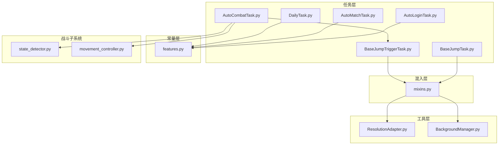
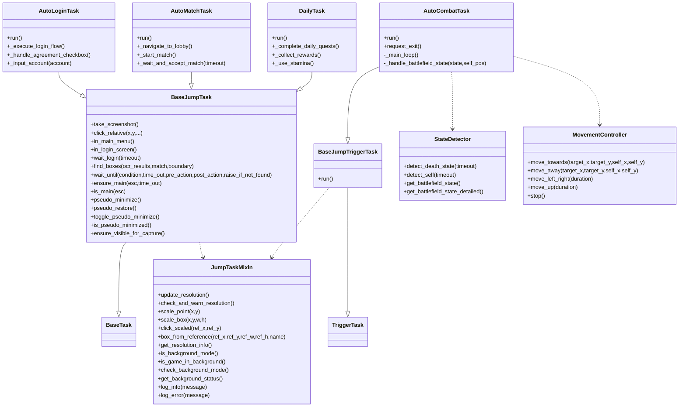
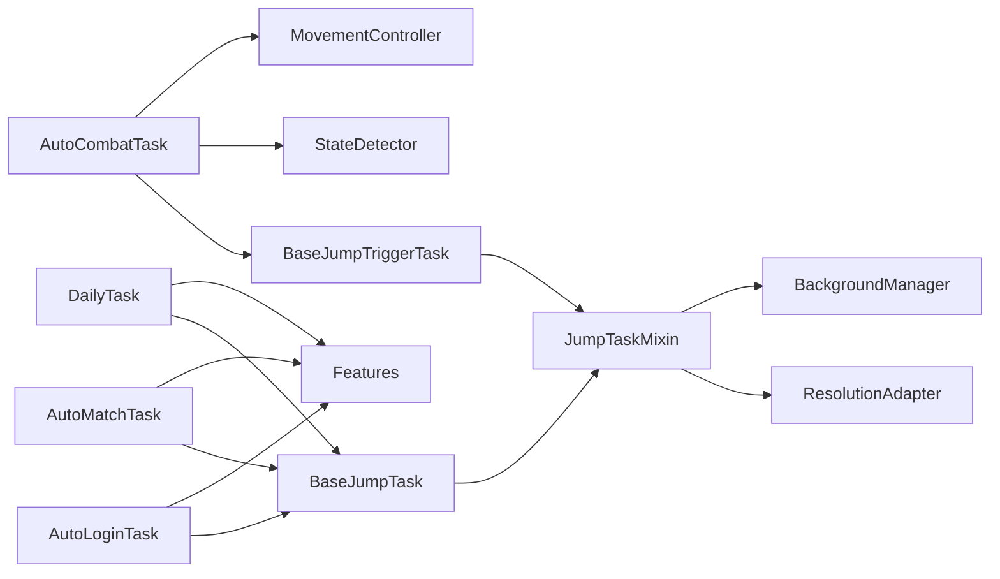

# 自定义任务开发

<cite>
**本文引用的文件**
- [src/task/BaseJumpTask.py](file://src/task/BaseJumpTask.py)
- [src/task/BaseJumpTriggerTask.py](file://src/task/BaseJumpTriggerTask.py)
- [src/task/mixins.py](file://src/task/mixins.py)
- [src/task/AutoLoginTask.py](file://src/task/AutoLoginTask.py)
- [src/task/AutoMatchTask.py](file://src/task/AutoMatchTask.py)
- [src/task/DailyTask.py](file://src/task/DailyTask.py)
- [src/task/AutoCombatTask.py](file://src/task/AutoCombatTask.py)
- [src/constants/features.py](file://src/constants/features.py)
- [src/utils/BackgroundManager.py](file://src/utils/BackgroundManager.py)
- [src/utils/ResolutionAdapter.py](file://src/utils/ResolutionAdapter.py)
- [src/combat/state_detector.py](file://src/combat/state_detector.py)
- [src/combat/movement_controller.py](file://src/combat/movement_controller.py)
- [configs/AutoLoginTask.json](file://configs/AutoLoginTask.json)
- [configs/AutoCombatTask.json](file://configs/AutoCombatTask.json)
</cite>

## 目录
1. [简介](#简介)
2. [项目结构](#项目结构)
3. [核心组件](#核心组件)
4. [架构总览](#架构总览)
5. [详细组件分析](#详细组件分析)
6. [依赖分析](#依赖分析)
7. [性能考虑](#性能考虑)
8. [故障排查指南](#故障排查指南)
9. [结论](#结论)
10. [附录](#附录)

## 简介
本指南面向希望在 OK-Jump 平台上开发“自定义任务”的工程师，提供从基类继承、方法重写、配置管理、参数传递到 UI 集成、测试与调试、性能优化的完整技术文档。文档以现有任务实现为范例，总结最佳实践，并给出可直接套用的开发模板与示例路径。

## 项目结构
OK-Jump 的任务体系围绕两类基类展开：
- 非触发式任务基类：BaseJumpTask（继承自通用任务框架，提供通用能力与混入方法）
- 触发式任务基类：BaseJumpTriggerTask（继承自触发式任务框架，适合被其他任务周期性调用）

任务模块采用“按功能域分层 + 混入复用”的组织方式：
- 任务层：src/task/*.py
- 混入层：src/task/mixins.py（统一提供分辨率、后台模式、窗口状态、特征检测等能力）
- 常量层：src/constants/features.py（集中管理特征名称）
- 工具层：src/utils/*（分辨率适配、后台管理等）
- 战斗子系统：src/combat/*（状态检测、移动控制、技能控制等）

图表来源
- [src/task/BaseJumpTask.py:10-295](file://src/task/BaseJumpTask.py#L10-L295)
- [src/task/BaseJumpTriggerTask.py:13-30](file://src/task/BaseJumpTriggerTask.py#L13-L30)
- [src/task/mixins.py:12-301](file://src/task/mixins.py#L12-L301)
- [src/constants/features.py:9-86](file://src/constants/features.py#L9-L86)
- [src/utils/ResolutionAdapter.py:4-163](file://src/utils/ResolutionAdapter.py#L4-L163)
- [src/utils/BackgroundManager.py:7-145](file://src/utils/BackgroundManager.py#L7-L145)
- [src/combat/state_detector.py:23-315](file://src/combat/state_detector.py#L23-L315)
- [src/combat/movement_controller.py:11-311](file://src/combat/movement_controller.py#L11-L311)

章节来源
- [src/task/__init__.py:1-20](file://src/task/__init__.py#L1-L20)

## 核心组件
- BaseJumpTask：提供截图、坐标转换、场景检测、登录等待、等待条件、伪最小化、分辨率适配、后台模式等通用能力；通过混入复用 JumpTaskMixin。
- BaseJumpTriggerTask：触发式任务基类，适合被其他任务周期性调用（如 AutoCombatTask）。
- JumpTaskMixin：混入类，统一提供分辨率适配、后台模式、窗口状态、特征检测、日志封装等能力，避免重复代码。
- AutoLoginTask：登录流程自动化，包含适龄提示、协议勾选、问卷调查、账号输入、角色选择等。
- AutoMatchTask：自动匹配与接受，基于特征或相对坐标点击。
- DailyTask：日常任务、奖励领取、体力使用等。
- AutoCombatTask：自动战斗，包含死亡检测、自身检测、战场状态判断、移动与技能控制。
- 战斗子系统：StateDetector（YOLO 检测）、MovementController（移动控制）等。

章节来源
- [src/task/BaseJumpTask.py:10-295](file://src/task/BaseJumpTask.py#L10-L295)
- [src/task/BaseJumpTriggerTask.py:13-30](file://src/task/BaseJumpTriggerTask.py#L13-L30)
- [src/task/mixins.py:12-301](file://src/task/mixins.py#L12-L301)
- [src/task/AutoLoginTask.py:18-1105](file://src/task/AutoLoginTask.py#L18-L1105)
- [src/task/AutoMatchTask.py:5-104](file://src/task/AutoMatchTask.py#L5-L104)
- [src/task/DailyTask.py:5-133](file://src/task/DailyTask.py#L5-L133)
- [src/task/AutoCombatTask.py:25-431](file://src/task/AutoCombatTask.py#L25-L431)
- [src/combat/state_detector.py:23-315](file://src/combat/state_detector.py#L23-L315)
- [src/combat/movement_controller.py:11-311](file://src/combat/movement_controller.py#L11-L311)

## 架构总览
OK-Jump 的任务开发遵循“基类 + 混入 + 子系统”的分层架构。开发者只需继承对应基类，重写 run 方法与必要钩子，即可获得统一的分辨率适配、后台模式、特征检测、日志与等待机制。

图表来源
- [src/task/BaseJumpTask.py:10-295](file://src/task/BaseJumpTask.py#L10-L295)
- [src/task/BaseJumpTriggerTask.py:13-30](file://src/task/BaseJumpTriggerTask.py#L13-L30)
- [src/task/mixins.py:12-301](file://src/task/mixins.py#L12-L301)
- [src/task/AutoLoginTask.py:18-1105](file://src/task/AutoLoginTask.py#L18-L1105)
- [src/task/AutoMatchTask.py:5-104](file://src/task/AutoMatchTask.py#L5-L104)
- [src/task/DailyTask.py:5-133](file://src/task/DailyTask.py#L5-L133)
- [src/task/AutoCombatTask.py:25-431](file://src/task/AutoCombatTask.py#L25-L431)
- [src/combat/state_detector.py:23-315](file://src/combat/state_detector.py#L23-L315)
- [src/combat/movement_controller.py:11-311](file://src/combat/movement_controller.py#L11-L311)

## 详细组件分析

### 基类与混入：继承与扩展点
- 继承关系
  - 非触发式任务：继承 BaseJumpTask，覆盖 run 方法，使用混入提供的通用能力。
  - 触发式任务：继承 BaseJumpTriggerTask，覆盖 run 方法，适合被其他任务周期性调用。
- 混入能力
  - 分辨率适配：update_resolution、scale_point、scale_box、click_scaled、box_from_reference、get_resolution_info。
  - 后台模式：is_background_mode、is_game_in_background、check_background_mode、get_background_status。
  - 场景检测：in_game、in_lobby、in_main_menu、in_login_screen、is_main、ensure_main、wait_until、wait_login。
  - 窗口交互：take_screenshot、click_relative、find_boxes、伪最小化系列方法。
- 最佳实践
  - 在 __init__ 中设置 name/description/default_config，便于 UI 显示与配置管理。
  - 在 run 开头统一调用 update_resolution 与 check_and_warn_resolution，保证识别稳定性。
  - 使用 wait_until/ensure_main/is_main 等封装，减少重复等待逻辑。
  - 使用 log_info/log_error 统一日志格式，便于调试与监控。

章节来源
- [src/task/BaseJumpTask.py:10-295](file://src/task/BaseJumpTask.py#L10-L295)
- [src/task/BaseJumpTriggerTask.py:13-30](file://src/task/BaseJumpTriggerTask.py#L13-L30)
- [src/task/mixins.py:12-301](file://src/task/mixins.py#L12-L301)

### 登录任务：AutoLoginTask
- 功能要点
  - 启动游戏、等待窗口、登录流程（适龄提示、协议勾选、问卷调查、账号输入、角色选择）。
  - OCR 缓存与模板匹配结合，提升识别鲁棒性。
  - 账号输入采用剪贴板 + 键盘输入 + 校验，支持重试与超时保护。
- 开发要点
  - default_config 中提供“启用”“自动启动游戏”“输入账号”等开关。
  - 使用 Features 常量与 find_one/find_boxes 进行特征检测。
  - 使用 _click_button_by_ocr 与 click_relative 进行点击，注意窗口可见性与伪最小化处理。
  - 使用 _ensure_window_visible 确保窗口可交互。
- 示例路径
  - [src/task/AutoLoginTask.py:18-1105](file://src/task/AutoLoginTask.py#L18-L1105)
  - [src/constants/features.py:9-86](file://src/constants/features.py#L9-L86)

章节来源
- [src/task/AutoLoginTask.py:18-1105](file://src/task/AutoLoginTask.py#L18-L1105)
- [src/constants/features.py:9-86](file://src/constants/features.py#L9-L86)

### 匹配任务：AutoMatchTask
- 功能要点
  - 导航至大厅、开始匹配、自动接受匹配。
  - 支持特征匹配与相对坐标点击两种方式。
- 开发要点
  - default_config 中提供“启用”“游戏模式”“自动接受匹配”“最大等待时间”等配置。
  - 使用 in_lobby 与 click_relative 或特征匹配进行交互。
- 示例路径
  - [src/task/AutoMatchTask.py:5-104](file://src/task/AutoMatchTask.py#L5-L104)

章节来源
- [src/task/AutoMatchTask.py:5-104](file://src/task/AutoMatchTask.py#L5-L104)

### 日常任务：DailyTask
- 功能要点
  - 导航至任务界面、批量执行日常任务、收集奖励、使用体力。
- 开发要点
  - default_config 中提供“启用”“完成日常任务”“收集奖励”“使用体力”“体力阈值”等配置。
  - 使用特征匹配点击任务项与领取按钮。
- 示例路径
  - [src/task/DailyTask.py:5-133](file://src/task/DailyTask.py#L5-L133)

章节来源
- [src/task/DailyTask.py:5-133](file://src/task/DailyTask.py#L5-L133)

### 自动战斗：AutoCombatTask
- 功能要点
  - 死亡状态检测（10秒循环）、自身检测（15秒超时）、战场状态判断（4种情况）、自动技能与移动控制。
  - 详细日志与测试模式，便于调试。
- 开发要点
  - 继承 BaseJumpTriggerTask，覆盖 run 方法。
  - default_config 中提供“测试模式”“详细日志”“自动普攻/技能/大招”及各技能间隔。
  - 使用 StateDetector 与 MovementController 进行状态检测与移动控制。
  - 使用 request_exit 优雅退出，_main_loop 中循环处理。
- 示例路径
  - [src/task/AutoCombatTask.py:25-431](file://src/task/AutoCombatTask.py#L25-L431)
  - [src/combat/state_detector.py:23-315](file://src/combat/state_detector.py#L23-L315)
  - [src/combat/movement_controller.py:11-311](file://src/combat/movement_controller.py#L11-L311)

章节来源
- [src/task/AutoCombatTask.py:25-431](file://src/task/AutoCombatTask.py#L25-L431)
- [src/combat/state_detector.py:23-315](file://src/combat/state_detector.py#L23-L315)
- [src/combat/movement_controller.py:11-311](file://src/combat/movement_controller.py#L11-L311)

### 战斗状态检测与移动控制
- StateDetector
  - 使用 YOLO 检测“死亡”“自己”“友方”“敌方”，并提供 get_battlefield_state/get_battlefield_state_detailed。
- MovementController
  - 支持 PC（WASD）与手机（ADB 虚拟摇杆）双端移动控制，提供 towards/away/left_right/up/stop 等方法。
- 开发要点
  - 在 AutoCombatTask 中按需调用 detect_* 与 move_*，并结合技能控制器实现智能战斗。
  - 注意在退出时调用 stop 与 stop_auto_skills，避免残留输入。

章节来源
- [src/combat/state_detector.py:23-315](file://src/combat/state_detector.py#L23-L315)
- [src/combat/movement_controller.py:11-311](file://src/combat/movement_controller.py#L11-L311)

## 依赖分析
- 基类与混入
  - BaseJumpTask/BaseJumpTriggerTask 通过 JumpTaskMixin 复用分辨率、后台模式、特征检测等能力。
- 任务与工具
  - AutoLoginTask/AutoMatchTask/DailyTask 直接依赖 JumpTaskMixin 与 Features 常量。
  - AutoCombatTask 依赖 StateDetector 与 MovementController。
- 工具类
  - ResolutionAdapter：提供参考分辨率与缩放因子，支持宽高与相对坐标的相互转换。
  - BackgroundManager：提供后台模式、伪最小化、静音等能力，支持自动伪最小化与可见性保障。

图表来源
- [src/task/BaseJumpTask.py:10-295](file://src/task/BaseJumpTask.py#L10-L295)
- [src/task/BaseJumpTriggerTask.py:13-30](file://src/task/BaseJumpTriggerTask.py#L13-L30)
- [src/task/mixins.py:12-301](file://src/task/mixins.py#L12-L301)
- [src/task/AutoLoginTask.py:18-1105](file://src/task/AutoLoginTask.py#L18-L1105)
- [src/task/AutoMatchTask.py:5-104](file://src/task/AutoMatchTask.py#L5-L104)
- [src/task/DailyTask.py:5-133](file://src/task/DailyTask.py#L5-L133)
- [src/task/AutoCombatTask.py:25-431](file://src/task/AutoCombatTask.py#L25-L431)
- [src/constants/features.py:9-86](file://src/constants/features.py#L9-L86)
- [src/utils/ResolutionAdapter.py:4-163](file://src/utils/ResolutionAdapter.py#L4-L163)
- [src/utils/BackgroundManager.py:7-145](file://src/utils/BackgroundManager.py#L7-L145)
- [src/combat/state_detector.py:23-315](file://src/combat/state_detector.py#L23-L315)
- [src/combat/movement_controller.py:11-311](file://src/combat/movement_controller.py#L11-L311)

## 性能考虑
- 识别与等待
  - 使用 wait_until 与 ensure_main 替代硬编码 sleep，减少无效等待。
  - 在 AutoCombatTask 中，短周期循环（0.1s）与日志节流（每10次输出一次摘要）平衡实时性与可观测性。
- 分辨率与缩放
  - 在 run 开头统一调用 update_resolution 与 check_and_warn_resolution，避免多处重复检测。
  - 使用 scale_point/scale_box/click_scaled 减少坐标系差异带来的误判。
- 后台模式与伪最小化
  - 通过 BackgroundManager 的自动伪最小化与可见性保障，降低截图与交互失败概率。
- 战斗性能
  - StateDetector 的 YOLO 检测应尽量在稳定帧率下进行；必要时在详细日志关闭时减少检测频率。
  - MovementController 的按键/滑动操作应避免频繁切换方向，减少输入抖动。

## 故障排查指南
- 登录流程异常
  - 症状：无法进入角色选择界面或反复点击无效。
  - 排查：检查 Features 常量与模板匹配阈值；确认 OCR 缓存与窗口可见性；查看 _ensure_window_visible 是否生效。
  - 参考路径
    - [src/task/AutoLoginTask.py:196-271](file://src/task/AutoLoginTask.py#L196-L271)
    - [src/constants/features.py:9-86](file://src/constants/features.py#L9-L86)
- 匹配与接受失败
  - 症状：无法检测到匹配按钮或接受按钮。
  - 排查：确认 in_lobby 与特征匹配；若特征不稳定，回退到相对坐标点击。
  - 参考路径
    - [src/task/AutoMatchTask.py:56-104](file://src/task/AutoMatchTask.py#L56-L104)
- 自动战斗卡死或误判
  - 症状：长时间无单位、技能不释放、移动异常。
  - 排查：开启“详细日志”与“测试模式”；检查 StateDetector 的 detect_* 返回；确认 MovementController 的 stop 调用。
  - 参考路径
    - [src/task/AutoCombatTask.py:165-243](file://src/task/AutoCombatTask.py#L165-L243)
    - [src/combat/state_detector.py:62-152](file://src/combat/state_detector.py#L62-L152)
    - [src/combat/movement_controller.py:95-103](file://src/combat/movement_controller.py#L95-L103)
- 分辨率与识别问题
  - 症状：特征匹配失败、点击位置偏移。
  - 排查：调用 update_resolution 与 check_and_warn_resolution；核对参考分辨率与当前分辨率比值。
  - 参考路径
    - [src/utils/ResolutionAdapter.py:34-120](file://src/utils/ResolutionAdapter.py#L34-L120)
    - [src/task/mixins.py:101-144](file://src/task/mixins.py#L101-L144)
- 后台模式与截图失败
  - 症状：后台时无法截图或交互异常。
  - 排查：检查 BackgroundManager 的状态；必要时调用 ensure_visible_for_capture。
  - 参考路径
    - [src/utils/BackgroundManager.py:113-118](file://src/utils/BackgroundManager.py#L113-L118)
    - [src/task/BaseJumpTask.py:291-295](file://src/task/BaseJumpTask.py#L291-L295)

## 结论
通过继承 BaseJumpTask/BaseJumpTriggerTask 并复用 JumpTaskMixin，开发者可以快速构建稳定的自定义任务。结合 Features 常量、ResolutionAdapter、BackgroundManager 与战斗子系统，能够覆盖从登录、匹配、日常到自动战斗的完整链路。建议在开发中遵循统一的配置管理、日志规范与错误处理策略，以获得更好的可维护性与可测试性。

## 附录

### 开发模板与示例路径
- 基类继承与默认配置
  - 非触发式任务模板：继承 BaseJumpTask，设置 name/description/default_config，覆盖 run。
    - 参考路径
      - [src/task/BaseJumpTask.py:22-28](file://src/task/BaseJumpTask.py#L22-L28)
      - [src/task/AutoMatchTask.py:10-19](file://src/task/AutoMatchTask.py#L10-L19)
      - [src/task/DailyTask.py:7-17](file://src/task/DailyTask.py#L7-L17)
- 触发式任务模板
  - 触发式任务模板：继承 BaseJumpTriggerTask，覆盖 run，适合被其他任务周期调用。
    - 参考路径
      - [src/task/BaseJumpTriggerTask.py:25-29](file://src/task/BaseJumpTriggerTask.py#L25-L29)
      - [src/task/AutoCombatTask.py:33-50](file://src/task/AutoCombatTask.py#L33-L50)
- 配置管理与参数传递
  - default_config 与 config 的读取：使用 self.default_config 与 self.config.get(key, default)。
    - 参考路径
      - [src/task/AutoLoginTask.py:69-73](file://src/task/AutoLoginTask.py#L69-L73)
      - [src/task/AutoMatchTask.py:14-19](file://src/task/AutoMatchTask.py#L14-L19)
      - [src/task/DailyTask.py:11-17](file://src/task/DailyTask.py#L11-L17)
- 用户界面集成
  - name/description 用于 UI 展示；default_config 用于生成配置面板。
    - 参考路径
      - [src/task/BaseJumpTask.py:25-26](file://src/task/BaseJumpTask.py#L25-L26)
      - [src/task/AutoLoginTask.py:45-66](file://src/task/AutoLoginTask.py#L45-L66)
- 测试策略与调试技巧
  - AutoCombatTask 的“测试模式”与“详细日志”开关，便于在非游戏场景下验证逻辑。
    - 参考路径
      - [src/task/AutoCombatTask.py:39-55](file://src/task/AutoCombatTask.py#L39-L55)
      - [configs/AutoCombatTask.json:1-13](file://configs/AutoCombatTask.json#L1-L13)
  - AutoLoginTask 的账号输入校验与超时保护，防止误操作。
    - 参考路径
      - [src/task/AutoLoginTask.py:628-756](file://src/task/AutoLoginTask.py#L628-L756)
- 性能优化建议
  - 统一分辨率适配与后台模式检查；减少不必要的 OCR 与模板匹配；在战斗循环中合理节流日志输出。
    - 参考路径
      - [src/task/mixins.py:101-144](file://src/task/mixins.py#L101-L144)
      - [src/task/AutoCombatTask.py:176-242](file://src/task/AutoCombatTask.py#L176-L242)