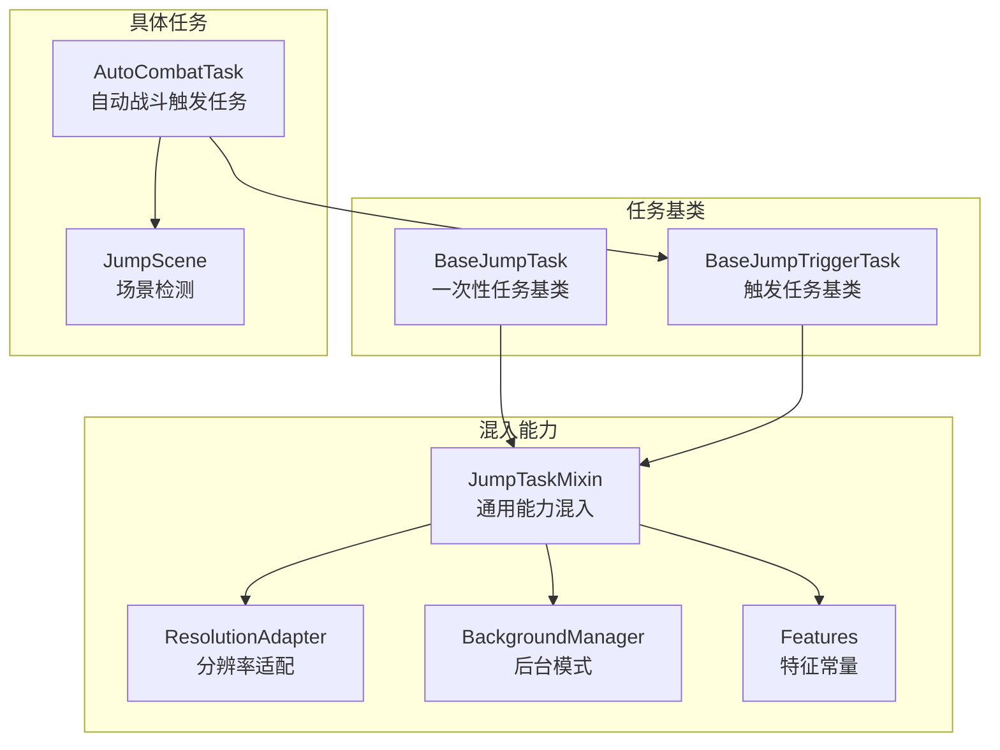
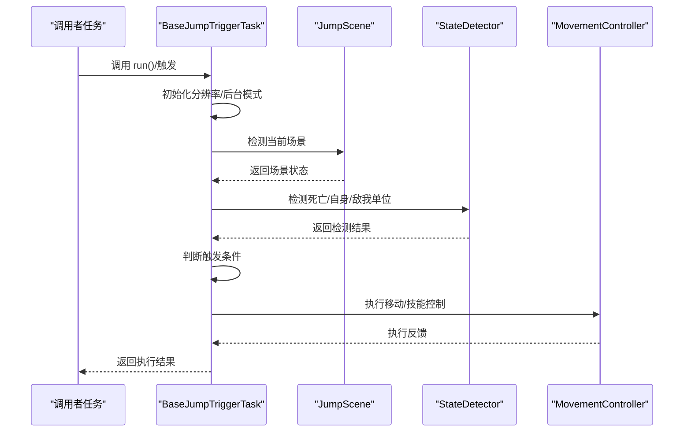
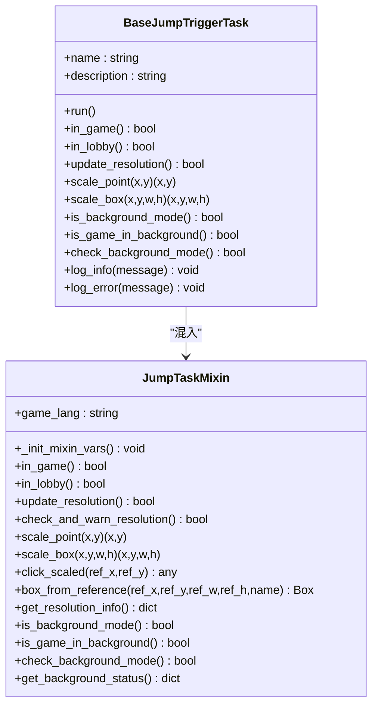
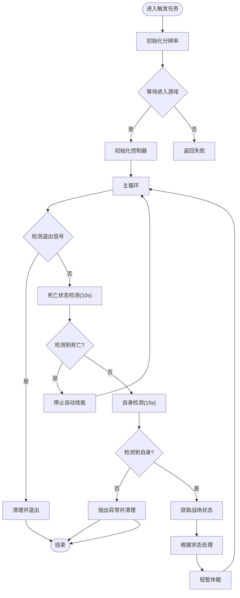
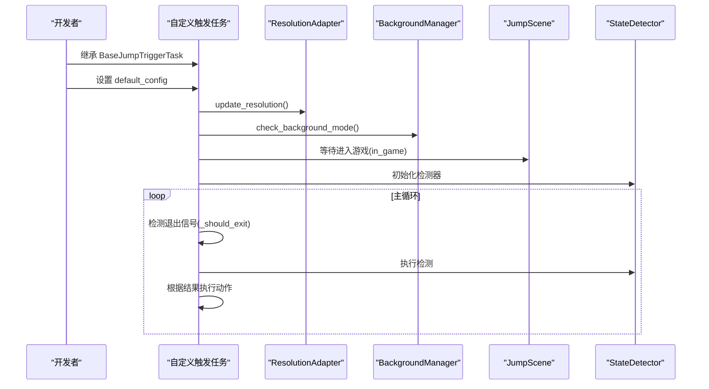
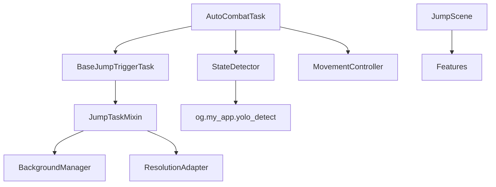

# 触发任务机制

<cite>
**本文档引用的文件**
- [BaseJumpTriggerTask.py](file://src/task/BaseJumpTriggerTask.py)
- [BaseJumpTask.py](file://src/task/BaseJumpTask.py)
- [mixins.py](file://src/task/mixins.py)
- [AutoCombatTask.py](file://src/task/AutoCombatTask.py)
- [features.py](file://src/constants/features.py)
- [BackgroundManager.py](file://src/utils/BackgroundManager.py)
- [ResolutionAdapter.py](file://src/utils/ResolutionAdapter.py)
- [state_detector.py](file://src/combat/state_detector.py)
- [movement_controller.py](file://src/combat/movement_controller.py)
- [JumpScene.py](file://src/scene/JumpScene.py)
- [AutoCombatTask.json](file://configs/AutoCombatTask.json)
</cite>

## 目录
1. [简介](#简介)
2. [项目结构](#项目结构)
3. [核心组件](#核心组件)
4. [架构总览](#架构总览)
5. [详细组件分析](#详细组件分析)
6. [依赖分析](#依赖分析)
7. [性能考虑](#性能考虑)
8. [故障排查指南](#故障排查指南)
9. [结论](#结论)
10. [附录](#附录)

## 简介
本文件系统性阐述 OK-Jump 项目中的“触发任务”机制，重点围绕 BaseJumpTriggerTask 类的设计理念与实现原理展开，明确其与一次性任务（BaseJumpTask）的根本差异；深入解析触发任务的检测机制、触发条件判断、状态管理与自动执行流程；说明触发任务如何监听游戏状态变化并自动响应，覆盖场景切换检测、特定事件触发与条件满足后的动作执行；提供创建与配置触发任务的实践路径，以及与其他任务类型的协作方式；最后总结最佳实践与常见使用场景。

## 项目结构
OK-Jump 的任务体系以“一次性任务”和“触发任务”两类基类为核心，通过混入（Mixin）模式复用通用能力，形成清晰的分层与职责边界：
- 一次性任务基类：负责单次执行、登录等待、场景切换等一次性流程
- 触发任务基类：负责周期性检测、条件触发与持续执行
- 混入类：提供分辨率适配、后台模式、游戏状态检测等通用能力
- 具体任务：如 AutoCombatTask 作为触发任务在其他任务中被调用

**图表来源**
- [BaseJumpTask.py:10-26](file://src/task/BaseJumpTask.py#L10-L26)
- [BaseJumpTriggerTask.py:13-29](file://src/task/BaseJumpTriggerTask.py#L13-L29)
- [mixins.py:12-33](file://src/task/mixins.py#L12-L33)
- [AutoCombatTask.py:25-36](file://src/task/AutoCombatTask.py#L25-L36)
- [JumpScene.py:44-71](file://src/scene/JumpScene.py#L44-L71)

**章节来源**
- [BaseJumpTask.py:10-26](file://src/task/BaseJumpTask.py#L10-L26)
- [BaseJumpTriggerTask.py:13-29](file://src/task/BaseJumpTriggerTask.py#L13-L29)
- [mixins.py:12-33](file://src/task/mixins.py#L12-L33)
- [AutoCombatTask.py:25-36](file://src/task/AutoCombatTask.py#L25-L36)
- [JumpScene.py:44-71](file://src/scene/JumpScene.py#L44-L71)

## 核心组件
- BaseJumpTriggerTask：触发任务基类，继承自 OK 框架的 TriggerTask，并混入 JumpTaskMixin，提供游戏状态检测、分辨率自适应与后台模式支持
- JumpTaskMixin：通用能力混入，封装分辨率适配、后台模式、游戏状态检测、日志封装等
- AutoCombatTask：典型的触发任务实现，周期性检测战场状态并驱动移动与技能释放
- Features：统一的特征名称常量，保证识别与点击的一致性
- BackgroundManager/ResolutionAdapter：后台模式与分辨率适配的基础设施
- JumpScene：场景检测模块，提供更细粒度的状态判定

**章节来源**
- [BaseJumpTriggerTask.py:13-29](file://src/task/BaseJumpTriggerTask.py#L13-L29)
- [mixins.py:12-33](file://src/task/mixins.py#L12-L33)
- [AutoCombatTask.py:25-36](file://src/task/AutoCombatTask.py#L25-L36)
- [features.py:9-86](file://src/constants/features.py#L9-L86)
- [BackgroundManager.py:7-34](file://src/utils/BackgroundManager.py#L7-L34)
- [ResolutionAdapter.py:4-16](file://src/utils/ResolutionAdapter.py#L4-L16)
- [JumpScene.py:44-71](file://src/scene/JumpScene.py#L44-L71)

## 架构总览
触发任务的运行时架构由“任务基类 + 混入能力 + 具体任务 + 场景/状态检测”构成，形成“检测-决策-执行”的闭环：

**图表来源**
- [AutoCombatTask.py:71-113](file://src/task/AutoCombatTask.py#L71-L113)
- [AutoCombatTask.py:165-242](file://src/task/AutoCombatTask.py#L165-L242)
- [state_detector.py:62-97](file://src/combat/state_detector.py#L62-L97)
- [movement_controller.py:45-104](file://src/combat/movement_controller.py#L45-L104)
- [JumpScene.py:44-71](file://src/scene/JumpScene.py#L44-L71)

## 详细组件分析

### BaseJumpTriggerTask 设计与实现
- 继承关系：继承 OK 框架 TriggerTask，并混入 JumpTaskMixin，获得通用能力
- 能力清单：
  - 游戏状态检测：in_game/in_lobby
  - 分辨率自适应：update_resolution/scale_point/scale_box
  - 后台模式支持：is_background_mode/is_game_in_background/check_background_mode
  - 日志封装：log_info/log_error
- 设计要点：
  - 通过混入复用通用能力，避免重复实现
  - 作为触发任务基类，强调“周期性检测 + 条件触发”的执行模型
  - 与具体触发任务（如 AutoCombatTask）配合，实现“被调用即执行”的模式

**图表来源**
- [BaseJumpTriggerTask.py:13-29](file://src/task/BaseJumpTriggerTask.py#L13-L29)
- [mixins.py:12-33](file://src/task/mixins.py#L12-L33)

**章节来源**
- [BaseJumpTriggerTask.py:13-29](file://src/task/BaseJumpTriggerTask.py#L13-L29)
- [mixins.py:12-33](file://src/task/mixins.py#L12-L33)

### 触发任务与一次性任务的根本区别
- 生命周期
  - 一次性任务：面向“单次执行”，典型流程包括登录等待、场景切换、完成目标后退出
  - 触发任务：面向“周期性检测 + 条件触发”，通常在其他任务中被调用，持续运行直到满足退出条件
- 典型代表
  - BaseJumpTask：提供 wait_login、ensure_main、is_main 等一次性流程能力
  - BaseJumpTriggerTask：提供 in_game/in_lobby 等状态检测与混入能力，作为 AutoCombatTask 等触发任务的基类
- 关键差异
  - 一次性任务强调“完成性”，触发任务强调“持续性”
  - 一次性任务常包含显式的等待与登录流程，触发任务更关注“状态变化 + 动作执行”

**章节来源**
- [BaseJumpTask.py:81-106](file://src/task/BaseJumpTask.py#L81-L106)
- [BaseJumpTask.py:202-232](file://src/task/BaseJumpTask.py#L202-L232)
- [BaseJumpTask.py:234-248](file://src/task/BaseJumpTask.py#L234-L248)
- [BaseJumpTask.py:250-267](file://src/task/BaseJumpTask.py#L250-L267)
- [BaseJumpTriggerTask.py:13-29](file://src/task/BaseJumpTriggerTask.py#L13-L29)

### 触发任务的检测机制与触发条件
- 场景检测
  - JumpScene：基于特征与 OCR 的多级场景判定，维护场景历史，支持快速切换
  - Features：统一特征名称，保证检测一致性
- 状态检测
  - StateDetector：基于 YOLO 的死亡状态、自身位置、友方/敌方单位检测，支持超时与循环检测
- 触发条件
  - AutoCombatTask：在进入游戏后，周期性检测战场状态（无单位/仅友方/仅敌方/混合），依据距离与状态决定移动与技能释放
- 自动执行流程
  - 初始化分辨率与后台模式
  - 等待进入游戏（测试模式可跳过）
  - 初始化控制器（状态检测器、移动控制器、技能控制器）
  - 主循环：检测退出信号 -> 死亡检测 -> 自身检测 -> 战场状态判断 -> 执行动作 -> 短暂停顿

**图表来源**
- [AutoCombatTask.py:71-113](file://src/task/AutoCombatTask.py#L71-L113)
- [AutoCombatTask.py:134-160](file://src/task/AutoCombatTask.py#L134-L160)
- [AutoCombatTask.py:165-242](file://src/task/AutoCombatTask.py#L165-L242)
- [state_detector.py:62-97](file://src/combat/state_detector.py#L62-L97)
- [state_detector.py:99-134](file://src/combat/state_detector.py#L99-L134)
- [state_detector.py:205-225](file://src/combat/state_detector.py#L205-L225)

**章节来源**
- [JumpScene.py:44-71](file://src/scene/JumpScene.py#L44-L71)
- [features.py:9-86](file://src/constants/features.py#L9-L86)
- [state_detector.py:62-97](file://src/combat/state_detector.py#L62-L97)
- [state_detector.py:99-134](file://src/combat/state_detector.py#L99-L134)
- [state_detector.py:205-225](file://src/combat/state_detector.py#L205-L225)
- [AutoCombatTask.py:134-160](file://src/task/AutoCombatTask.py#L134-L160)
- [AutoCombatTask.py:165-242](file://src/task/AutoCombatTask.py#L165-L242)

### 状态管理与自动执行流程
- 状态管理
  - 分辨率状态：update_resolution 与 check_and_warn_resolution 确保识别稳定性
  - 后台模式状态：check_background_mode 记录并输出状态日志
  - 退出信号：_should_exit 统一检测，支持测试模式与场景切换
- 自动执行
  - AutoCombatTask 的主循环以短周期高频检测，结合 YOLO 与键盘/滑动控制实现自动化
  - MovementController 支持 PC 键盘与手机 ADB 两种模式，自动选择

**章节来源**
- [mixins.py:101-143](file://src/task/mixins.py#L101-L143)
- [mixins.py:272-291](file://src/task/mixins.py#L272-L291)
- [AutoCombatTask.py:134-160](file://src/task/AutoCombatTask.py#L134-L160)
- [movement_controller.py:41-44](file://src/combat/movement_controller.py#L41-L44)

### 监听游戏状态变化与自动响应
- 场景切换检测
  - JumpScene 通过特征与 OCR 组合，维护场景历史，支持快速切换
  - AutoCombatTask 在等待进入游戏阶段使用 in_game 检测，确保在正确场景执行
- 特定事件触发
  - 死亡状态检测：10 秒内持续监测，检测到则停止技能并等待复活
  - 自身检测：15 秒内必须检测到自身，否则终止脚本
- 条件满足后的动作执行
  - 根据战场状态（无单位/仅友方/仅敌方/混合）执行不同策略
  - 距离达标时启动自动技能，否则仅移动调整位置

**章节来源**
- [JumpScene.py:44-71](file://src/scene/JumpScene.py#L44-L71)
- [AutoCombatTask.py:190-242](file://src/task/AutoCombatTask.py#L190-L242)
- [state_detector.py:62-97](file://src/combat/state_detector.py#L62-L97)
- [state_detector.py:99-134](file://src/combat/state_detector.py#L99-L134)

### 创建与配置触发任务的实践路径
- 继承与初始化
  - 继承 BaseJumpTriggerTask，设置 name/description
  - 在构造函数中定义 default_config 与 config_description
- 场景与状态准备
  - 调用 update_resolution 与 check_and_warn_resolution
  - 如需等待进入游戏，使用 _wait_for_game 或 in_game 检测
- 控制器初始化
  - 初始化状态检测器、移动控制器、技能控制器等
- 主循环与退出
  - 在循环中检测退出信号（_should_exit）
  - 执行检测与动作，必要时清理资源

**图表来源**
- [AutoCombatTask.py:33-70](file://src/task/AutoCombatTask.py#L33-L70)
- [AutoCombatTask.py:86-113](file://src/task/AutoCombatTask.py#L86-L113)
- [AutoCombatTask.py:115-128](file://src/task/AutoCombatTask.py#L115-L128)
- [mixins.py:101-143](file://src/task/mixins.py#L101-L143)
- [mixins.py:272-291](file://src/task/mixins.py#L272-L291)
- [JumpScene.py:134-143](file://src/scene/JumpScene.py#L134-L143)

**章节来源**
- [AutoCombatTask.py:33-70](file://src/task/AutoCombatTask.py#L33-L70)
- [AutoCombatTask.py:86-113](file://src/task/AutoCombatTask.py#L86-L113)
- [AutoCombatTask.py:115-128](file://src/task/AutoCombatTask.py#L115-L128)
- [mixins.py:101-143](file://src/task/mixins.py#L101-L143)
- [mixins.py:272-291](file://src/task/mixins.py#L272-L291)

### 与其他任务类型的协作机制
- 一次性任务（BaseJumpTask）与触发任务（BaseJumpTriggerTask）的协作
  - 一次性任务负责登录、场景切换等前置流程
  - 触发任务在合适时机被调用，执行持续性的自动化行为
- AutoCombatTask 与 JumpScene 的协作
  - JumpScene 提供场景状态，AutoCombatTask 基于场景状态进行决策
- AutoCombatTask 与 StateDetector/MovementController 的协作
  - StateDetector 提供检测结果，MovementController 执行移动控制

**章节来源**
- [BaseJumpTask.py:81-106](file://src/task/BaseJumpTask.py#L81-L106)
- [BaseJumpTask.py:202-232](file://src/task/BaseJumpTask.py#L202-L232)
- [AutoCombatTask.py:115-128](file://src/task/AutoCombatTask.py#L115-L128)
- [JumpScene.py:44-71](file://src/scene/JumpScene.py#L44-L71)

### 最佳实践与常见使用场景
- 最佳实践
  - 明确区分一次性任务与触发任务，避免在同一任务中混杂两种生命周期
  - 在触发任务中统一使用 _should_exit 检测退出信号，确保优雅退出
  - 合理使用分辨率与后台模式能力，保证跨分辨率与后台运行的稳定性
  - 将检测与执行解耦，使用控制器模式分离状态检测与动作执行
- 常见使用场景
  - 自动战斗：基于 YOLO 的战场状态检测与自动技能释放
  - 日常任务：在合适场景下自动完成日常与奖励领取
  - 匹配与教程：在特定场景下自动点击与交互

**章节来源**
- [AutoCombatTask.py:145-159](file://src/task/AutoCombatTask.py#L145-L159)
- [mixins.py:101-143](file://src/task/mixins.py#L101-L143)
- [mixins.py:272-291](file://src/task/mixins.py#L272-L291)
- [AutoCombatTask.py:165-242](file://src/task/AutoCombatTask.py#L165-L242)

## 依赖分析
- 组件耦合
  - BaseJumpTriggerTask 与 JumpTaskMixin：强耦合（混入）
  - AutoCombatTask 与 BaseJumpTriggerTask：继承关系，低耦合
  - AutoCombatTask 与 StateDetector/MovementController：组合关系，中等耦合
  - JumpScene 与 Features：依赖特征常量，弱耦合
- 外部依赖
  - BackgroundManager/ResolutionAdapter：系统级能力，通过混入注入
  - YOLO 检测：通过 og.my_app.yolo_detect 提供，任务内部封装

**图表来源**
- [BaseJumpTriggerTask.py:13-29](file://src/task/BaseJumpTriggerTask.py#L13-L29)
- [mixins.py:12-33](file://src/task/mixins.py#L12-L33)
- [AutoCombatTask.py:25-36](file://src/task/AutoCombatTask.py#L25-L36)
- [state_detector.py:86-90](file://src/combat/state_detector.py#L86-L90)
- [BackgroundManager.py:7-34](file://src/utils/BackgroundManager.py#L7-L34)
- [ResolutionAdapter.py:4-16](file://src/utils/ResolutionAdapter.py#L4-L16)
- [JumpScene.py:44-71](file://src/scene/JumpScene.py#L44-L71)
- [features.py:9-86](file://src/constants/features.py#L9-L86)

**章节来源**
- [BaseJumpTriggerTask.py:13-29](file://src/task/BaseJumpTriggerTask.py#L13-L29)
- [mixins.py:12-33](file://src/task/mixins.py#L12-L33)
- [AutoCombatTask.py:25-36](file://src/task/AutoCombatTask.py#L25-L36)
- [state_detector.py:86-90](file://src/combat/state_detector.py#L86-L90)
- [BackgroundManager.py:7-34](file://src/utils/BackgroundManager.py#L7-L34)
- [ResolutionAdapter.py:4-16](file://src/utils/ResolutionAdapter.py#L4-L16)
- [JumpScene.py:44-71](file://src/scene/JumpScene.py#L44-L71)
- [features.py:9-86](file://src/constants/features.py#L9-L86)

## 性能考虑
- 检测频率与超时
  - 死亡检测与自身检测分别采用 10 秒与 15 秒超时，平衡准确性与性能
  - 主循环短周期执行，避免阻塞
- 分辨率与后台模式
  - update_resolution 仅在分辨率未检查时更新，减少重复开销
  - 后台模式状态日志仅首次输出，降低日志噪声
- YOLO 检测
  - 通过阈值与标签限定检测范围，避免全图扫描带来的性能损耗

[本节为通用指导，无需列出具体文件来源]

## 故障排查指南
- 无法进入游戏场景
  - 检查 _wait_for_game 逻辑与 in_game 检测
  - 确认 Features 中的 in_game_indicator 是否正确
- 死亡状态检测异常
  - 检查 YOLO 模型与阈值配置
  - 确认检测器未被提前退出
- 自身检测超时
  - 检查分辨率与缩放是否正确
  - 确认后台模式未影响截图
- 场景切换不生效
  - 检查 JumpScene 的特征与 OCR 配置
  - 确认场景历史长度与判定逻辑

**章节来源**
- [AutoCombatTask.py:134-143](file://src/task/AutoCombatTask.py#L134-L143)
- [AutoCombatTask.py:190-204](file://src/task/AutoCombatTask.py#L190-L204)
- [state_detector.py:62-97](file://src/combat/state_detector.py#L62-L97)
- [state_detector.py:99-134](file://src/combat/state_detector.py#L99-L134)
- [JumpScene.py:44-71](file://src/scene/JumpScene.py#L44-L71)

## 结论
OK-Jump 的触发任务机制通过“触发任务基类 + 混入能力 + 具体任务 + 场景/状态检测”的架构，实现了稳定、可扩展的自动化执行模型。BaseJumpTriggerTask 以混入模式复用通用能力，AutoCombatTask 以周期性检测与条件触发实现智能战斗辅助。该机制在保证性能的同时，提供了良好的可维护性与扩展性，适合在复杂游戏场景中构建可靠的自动化流程。

[本节为总结性内容，无需列出具体文件来源]

## 附录
- 配置示例
  - AutoCombatTask.json：包含测试模式、自动技能开关与间隔配置
- 常用特征
  - in_game_indicator、enter_game_button、start_game_button 等，统一在 Features 中管理

**章节来源**
- [AutoCombatTask.json:1-12](file://configs/AutoCombatTask.json#L1-L12)
- [features.py:9-86](file://src/constants/features.py#L9-L86)