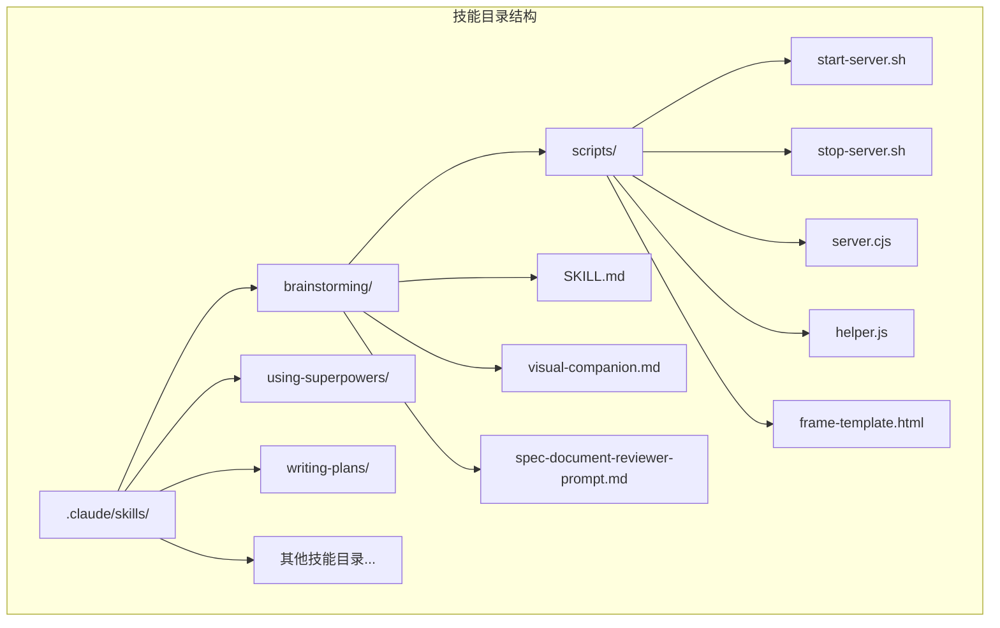
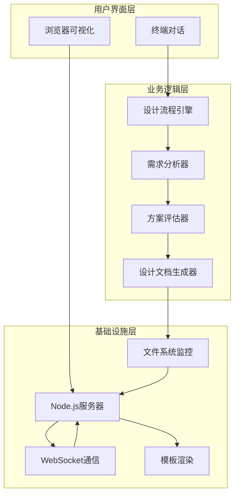
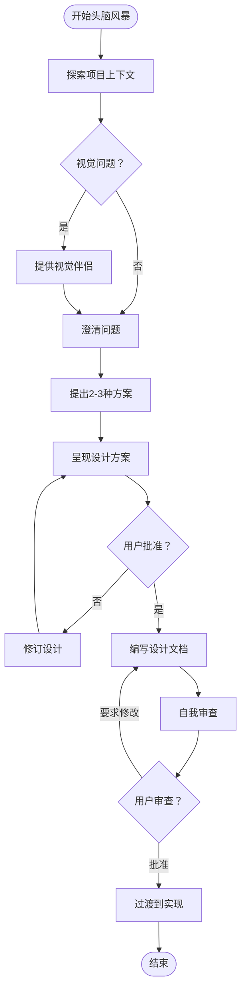
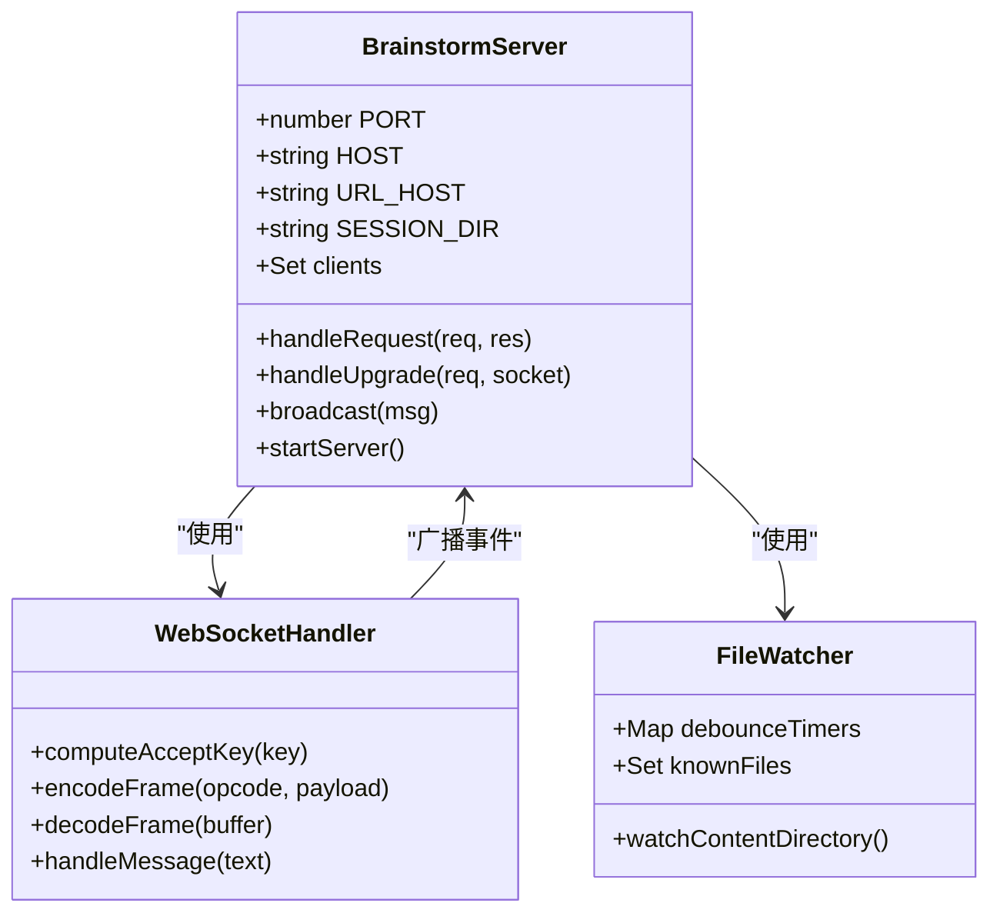
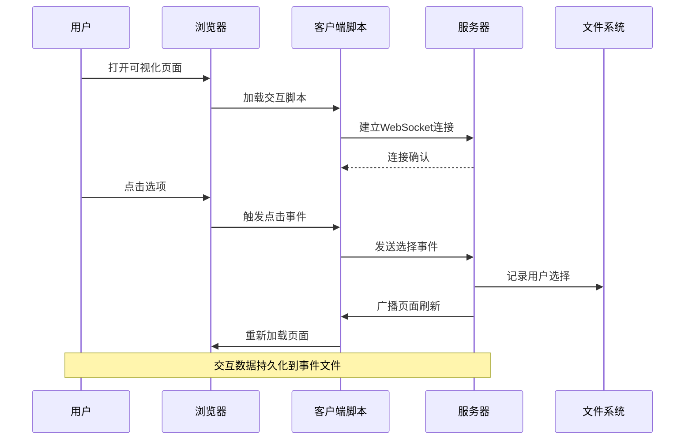
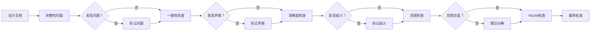
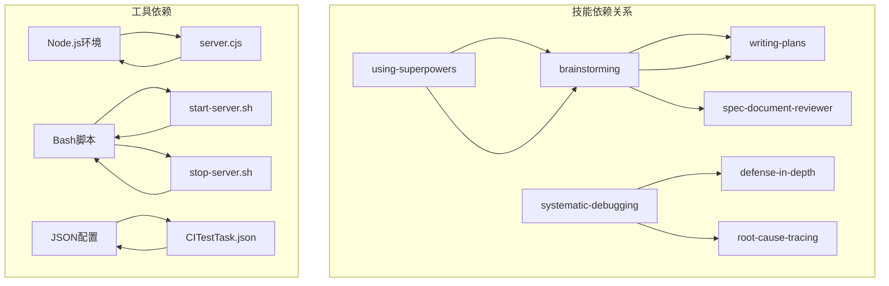
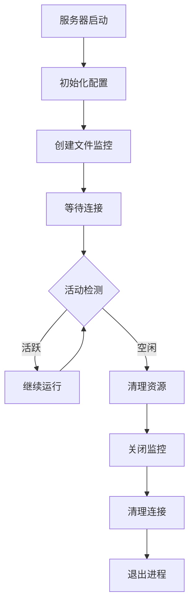

# 创意头脑风暴技能

<cite>
**本文档引用的文件**
- [SKILL.md](file://.claude/skills/brainstorming/SKILL.md)
- [visual-companion.md](file://.claude/skills/brainstorming/visual-companion.md)
- [spec-document-reviewer-prompt.md](file://.claude/skills/brainstorming/spec-document-reviewer-prompt.md)
- [server.cjs](file://.claude/skills/brainstorming/scripts/server.cjs)
- [helper.js](file://.claude/skills/brainstorming/scripts/helper.js)
- [frame-template.html](file://.claude/skills/brainstorming/scripts/frame-template.html)
- [start-server.sh](file://.claude/skills/brainstorming/scripts/start-server.sh)
- [stop-server.sh](file://.claude/skills/brainstorming/scripts/stop-server.sh)
- [using-superpowers\SKILL.md](file://.claude/skills/using-superpowers/SKILL.md)
- [writing-plans\SKILL.md](file://.claude/skills/writing-plans/SKILL.md)
- [main.py](file://main.py)
- [README.md](file://README.md)
</cite>

## 目录
1. [简介](#简介)
2. [项目结构](#项目结构)
3. [核心组件](#核心组件)
4. [架构概览](#架构概览)
5. [详细组件分析](#详细组件分析)
6. [依赖关系分析](#依赖关系分析)
7. [性能考虑](#性能考虑)
8. [故障排除指南](#故障排除指南)
9. [结论](#结论)

## 简介

创意头脑风暴技能是一个专为复杂项目设计的系统化设计方法论，旨在帮助开发者在进行任何创造性工作之前，先进行充分的需求分析、设计规划和方案评估。该技能特别适用于构建新功能、开发组件、添加功能或修改现有行为等场景。

该技能的核心理念是"先设计，后实现"，强调通过自然协作对话的方式，将模糊的想法转化为完整的设计规范和实施方案。它不仅提供了一套完整的思维流程，还包含了一个强大的可视化辅助工具，可以在需要时通过浏览器展示原型、图表和视觉选项。

## 项目结构

该项目采用模块化的技能组织方式，每个技能都是一个独立的功能单元：

**图表来源**
- [SKILL.md:1-165](file://.claude/skills/brainstorming/SKILL.md#L1-L165)
- [visual-companion.md:1-288](file://.claude/skills/brainstorming/visual-companion.md#L1-L288)

**章节来源**
- [SKILL.md:1-165](file://.claude/skills/brainstorming/SKILL.md#L1-L165)
- [README.md:1-8](file://README.md#L1-L8)

## 核心组件

### 设计流程引擎

头脑风暴技能的核心是一个严格的设计流程，包含以下关键步骤：

1. **探索项目上下文** - 检查现有文件、文档和最近的提交记录
2. **视觉问题识别** - 判断即将到来的问题是否涉及视觉内容
3. **澄清问题** - 逐个提问以细化想法
4. **提出2-3种方案** - 展示不同的技术路线和权衡
5. **呈现设计方案** - 分部分展示设计细节
6. **编写设计文档** - 保存到指定位置并提交版本控制
7. **自我审查** - 检查占位符、矛盾、歧义和范围
8. **用户评审** - 等待用户审查设计文档
9. **过渡到实现** - 调用写作计划技能创建实施计划

### 可视化辅助系统

该技能提供了一个完整的浏览器可视化辅助系统，包括：

- **实时服务器** - 基于Node.js的HTTP/WebSocket服务器
- **模板系统** - 提供一致的视觉框架和样式
- **交互式助手** - 客户端JavaScript处理用户交互
- **文件监控** - 自动检测和响应文件变化

**章节来源**
- [SKILL.md:20-145](file://.claude/skills/brainstorming/SKILL.md#L20-L145)
- [visual-companion.md:1-288](file://.claude/skills/brainstorming/visual-companion.md#L1-L288)

## 架构概览

头脑风暴技能的整体架构由三个主要层次组成：

**图表来源**
- [server.cjs:1-355](file://.claude/skills/brainstorming/scripts/server.cjs#L1-L355)
- [helper.js:1-89](file://.claude/skills/brainstorming/scripts/helper.js#L1-L89)

## 详细组件分析

### 设计流程引擎

设计流程引擎是头脑风暴技能的核心，它确保了设计过程的系统性和完整性：

#### 流程控制机制

**图表来源**
- [SKILL.md:34-66](file://.claude/skills/brainstorming/SKILL.md#L34-L66)

#### 设计原则

该技能强调以下设计原则：

- **一次一个问题** - 避免信息过载
- **多选题优先** - 更容易回答
- **YAGNI** - 残酷地去除不必要的功能
- **探索替代方案** - 始终提出2-3种选择
- **增量验证** - 先获得批准再继续
- **灵活性** - 当某事不明确时要回去澄清

**章节来源**
- [SKILL.md:138-145](file://.claude/skills/brainstorming/SKILL.md#L138-L145)

### 可视化辅助系统

可视化辅助系统提供了强大的浏览器集成能力，使设计讨论更加直观和高效。

#### 服务器架构

**图表来源**
- [server.cjs:1-355](file://.claude/skills/brainstorming/scripts/server.cjs#L1-L355)

#### 客户端交互机制

**图表来源**
- [helper.js:1-89](file://.claude/skills/brainstorming/scripts/helper.js#L1-L89)
- [server.cjs:224-238](file://.claude/skills/brainstorming/scripts/server.cjs#L224-L238)

#### 模板系统

可视化系统使用HTML模板来提供一致的用户体验：

- **主题系统** - 支持明暗模式切换
- **布局组件** - 提供选项卡、卡片、分割视图等
- **交互元素** - 支持多选、单选、拖拽等操作
- **响应式设计** - 适配不同屏幕尺寸

**章节来源**
- [frame-template.html:1-215](file://.claude/skills/brainstorming/scripts/frame-template.html#L1-L215)
- [visual-companion.md:128-288](file://.claude/skills/brainstorming/visual-companion.md#L128-L288)

### 设计文档审查系统

设计文档审查系统确保最终的设计文档质量：

#### 审查标准

| 审查类别 | 检查要点 |
|---------|---------|
| 完整性 | 是否有未完成的部分、占位符、缺失的章节 |
| 一致性 | 是否存在内部矛盾、相互冲突的要求 |
| 清晰度 | 要求是否足够明确，不会导致错误的实现 |
| 范围 | 是否聚焦于单一实现计划，而不是多个独立子系统 |
| YAGNI | 是否包含未请求的功能、过度工程化 |

#### 审查流程

**图表来源**
- [spec-document-reviewer-prompt.md:1-50](file://.claude/skills/brainstorming/spec-document-reviewer-prompt.md#L1-L50)

**章节来源**
- [spec-document-reviewer-prompt.md:1-50](file://.claude/skills/brainstorming/spec-document-reviewer-prompt.md#L1-L50)

## 依赖关系分析

头脑风暴技能与其他技能之间存在明确的依赖关系：

**图表来源**
- [using-superpowers\SKILL.md:99-105](file://.claude/skills/using-superpowers/SKILL.md#L99-L105)
- [writing-plans\SKILL.md:1-153](file://.claude/skills/writing-plans/SKILL.md#L1-L153)

### 技能优先级

根据技能使用指南，当多个技能适用时，应遵循以下优先级：

1. **流程技能优先** - 头脑风暴、调试等确定如何处理任务的技能
2. **实现技能次之** - 前端设计、MCP构建器等指导执行的技能

这种优先级确保了在开始任何实现工作之前，都有充分的设计和规划。

**章节来源**
- [using-superpowers\SKILL.md:99-105](file://.claude/skills/using-superpowers/SKILL.md#L99-L105)

## 性能考虑

### 服务器性能优化

可视化辅助系统的服务器端实现了多项性能优化：

- **文件监控去抖动** - 防止频繁的文件系统事件触发
- **内存管理** - 及时清理不再使用的定时器和集合
- **连接池管理** - 动态管理WebSocket客户端连接
- **生命周期监控** - 自动检测空闲并优雅关闭

### 内存使用优化

**图表来源**
- [server.cjs:247-324](file://.claude/skills/brainstorming/scripts/server.cjs#L247-L324)

### 客户端性能特性

客户端JavaScript实现了高效的交互处理：

- **事件队列** - 处理网络延迟和断线重连
- **DOM缓存** - 减少DOM查询开销
- **选择跟踪** - 实时更新选择状态指示器
- **自动重连** - WebSocket连接断开后的自动恢复

**章节来源**
- [helper.js:1-89](file://.claude/skills/brainstorming/scripts/helper.js#L1-L89)

## 故障排除指南

### 常见问题及解决方案

#### 服务器启动问题

| 问题症状 | 可能原因 | 解决方案 |
|---------|---------|---------|
| 服务器无法启动 | 端口被占用 | 更改端口或杀死占用进程 |
| 进程被意外终止 | 环境限制 | 使用前台模式启动 |
| 文件监控失效 | 权限不足 | 检查目录权限 |
| WebSocket连接失败 | 防火墙阻拦 | 检查防火墙设置 |

#### 浏览器显示问题

| 问题症状 | 可能原因 | 解决方案 |
|---------|---------|---------|
| 页面空白 | 模板加载失败 | 检查frame-template.html |
| 交互无响应 | JavaScript错误 | 检查helper.js |
| 选择状态异常 | 事件处理冲突 | 清除浏览器缓存 |
| 响应速度慢 | 网络延迟 | 检查本地网络连接 |

#### 文件系统问题

| 问题症状 | 可能原因 | 解决方案 |
|---------|---------|---------|
| mockup文件丢失 | 临时目录清理 | 使用--project-dir参数 |
| 权限错误 | 目录权限不足 | 修改目录权限或所有权 |
| 磁盘空间不足 | 存储空间耗尽 | 清理临时文件 |
| 文件名冲突 | 重复文件名 | 使用版本后缀命名 |

**章节来源**
- [start-server.sh:1-149](file://.claude/skills/brainstorming/scripts/start-server.sh#L1-L149)
- [stop-server.sh:1-57](file://.claude/skills/brainstorming/scripts/stop-server.sh#L1-L57)

### 调试技巧

#### 日志分析

服务器会输出详细的启动和运行日志，包括：

- **服务器状态** - 启动、停止、重启事件
- **连接信息** - 客户端连接和断开
- **文件操作** - mockup文件的创建和更新
- **错误信息** - 任何异常情况的详细描述

#### 性能监控

- **连接数统计** - 当前活跃的WebSocket连接数量
- **文件监控频率** - 文件系统事件的处理频率
- **内存使用** - 进程的内存占用情况
- **响应时间** - 页面加载和交互响应时间

## 结论

创意头脑风暴技能提供了一个完整的设计和规划框架，它不仅确保了设计过程的系统性和完整性，还通过可视化的辅助工具大大提升了设计讨论的效率和效果。

该技能的核心价值在于：

1. **强制设计前置** - 在任何实现工作之前确保有充分的设计
2. **系统化流程** - 提供严格的步骤和检查点
3. **可视化支持** - 通过浏览器工具增强设计讨论
4. **质量保证** - 通过多层审查确保设计质量
5. **知识传承** - 通过文档化的设计规范便于团队协作

对于大型项目或复杂功能开发，这个技能能够显著减少返工和误解，提高整体开发效率和质量。它特别适合需要跨部门协作、涉及多个技术栈或需要与非技术背景的利益相关者沟通的项目。

通过遵循这个技能的方法论，开发团队可以建立更加稳健和可持续的软件开发流程，确保每个功能都经过充分思考和精心设计。