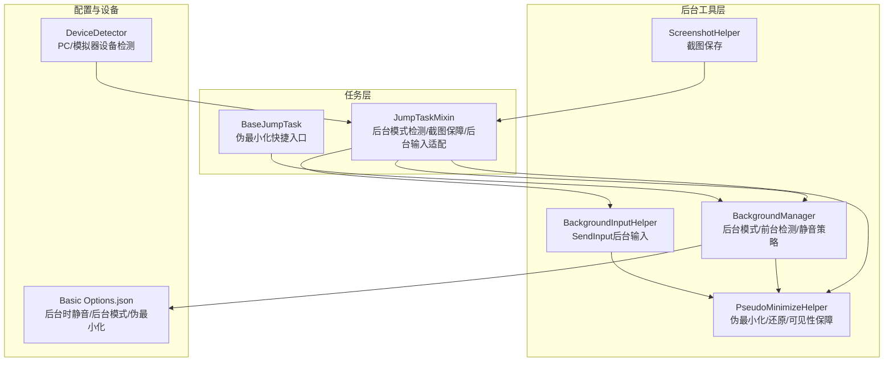
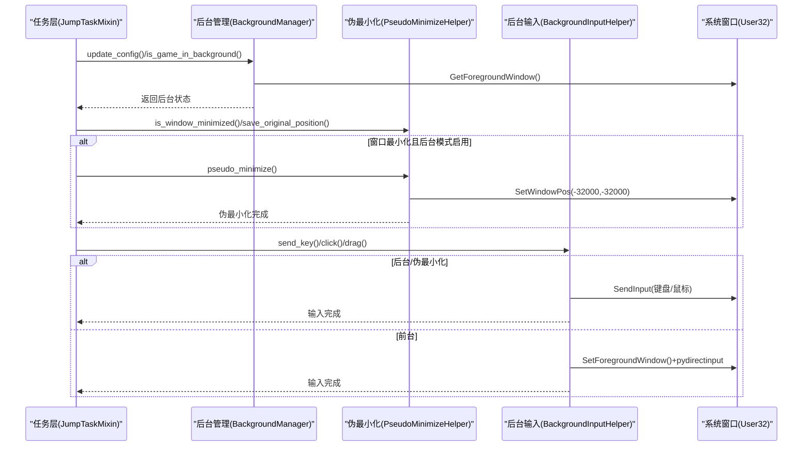
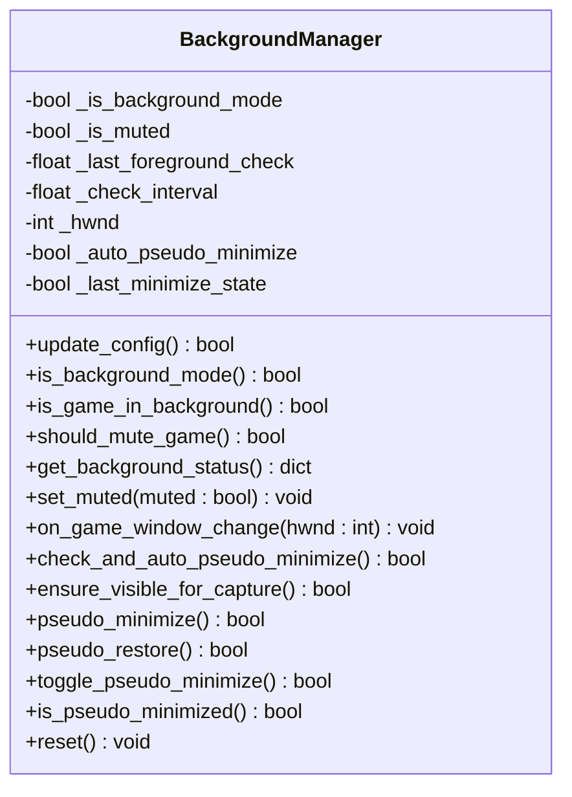
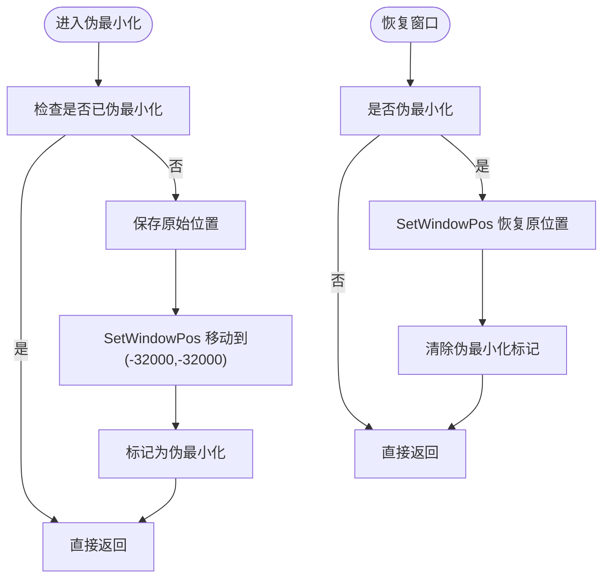
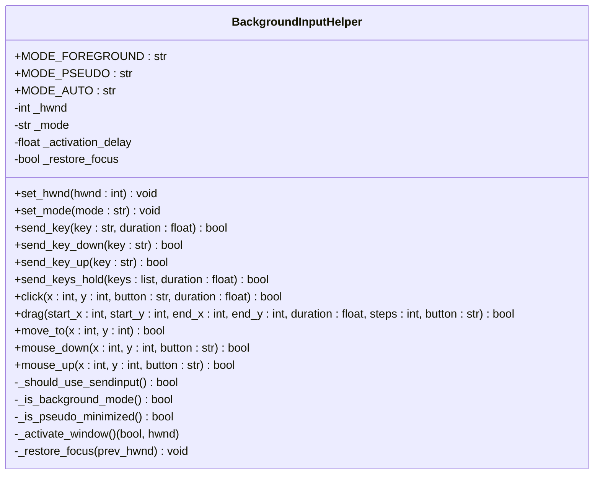
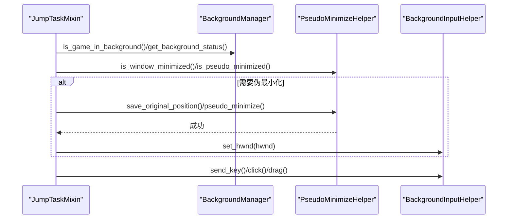
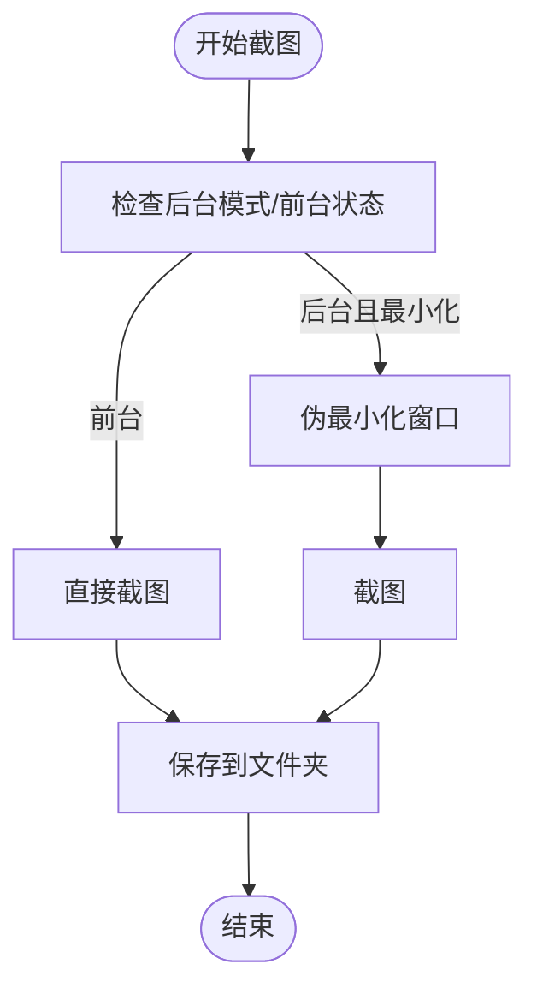
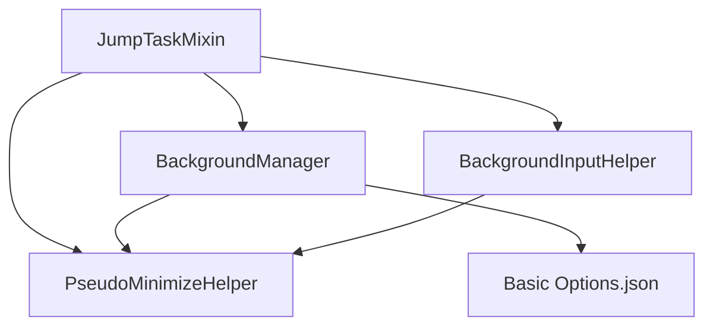

# 后台运行机制

<cite>
**本文档引用的文件**
- [BackgroundManager.py](file://src/utils/BackgroundManager.py)
- [PseudoMinimizeHelper.py](file://src/utils/PseudoMinimizeHelper.py)
- [BackgroundInputHelper.py](file://src/utils/BackgroundInputHelper.py)
- [ScreenshotHelper.py](file://src/utils/ScreenshotHelper.py)
- [mixins.py](file://src/task/mixins.py)
- [BaseJumpTask.py](file://src/task/BaseJumpTask.py)
- [Basic Options.json](file://configs/Basic Options.json)
- [_ok.json](file://configs/_ok.json)
- [DeviceDetector.py](file://src/utils/DeviceDetector.py)
</cite>

## 目录
1. [简介](#简介)
2. [项目结构](#项目结构)
3. [核心组件](#核心组件)
4. [架构总览](#架构总览)
5. [详细组件分析](#详细组件分析)
6. [依赖关系分析](#依赖关系分析)
7. [性能考量](#性能考量)
8. [故障排查指南](#故障排查指南)
9. [结论](#结论)
10. [附录](#附录)

## 简介
本文件系统性阐述 OK-Jump 的后台运行机制，重点覆盖以下方面：
- 伪最小化的实现原理与技术细节
- 后台截图支持的实现方式与性能考虑
- 静音功能的实现机制与兼容性处理
- 窗口状态管理、前台检测与后台切换逻辑
- 后台模式下的性能优化建议与限制说明
- 跨平台兼容性考虑与最佳实践

该机制围绕三个核心模块展开：后台状态管理（BackgroundManager）、窗口伪最小化（PseudoMinimizeHelper）、后台输入（BackgroundInputHelper），并通过任务混入（JumpTaskMixin）在业务层进行统一接入。

## 项目结构
与后台运行机制直接相关的文件组织如下：
- utils：后台状态与输入辅助工具
  - BackgroundManager.py：后台模式开关、前台检测、静音策略、伪最小化协调
  - PseudoMinimizeHelper.py：窗口伪最小化/还原、可见性保障、状态查询
  - BackgroundInputHelper.py：SendInput 后台输入、前台/伪最小化模式切换
  - ScreenshotHelper.py：截图保存（与后台截图配合使用）
- task：任务层混入与基类
  - mixins.py：后台模式检测、截图保障、后台点击/拖拽、ADB 模式适配
  - BaseJumpTask.py：任务基类，提供伪最小化快捷入口与截图保障
- configs：配置项
  - Basic Options.json：后台时静音、后台模式、最小化时伪最小化等
  - _ok.json：窗口初始尺寸与位置
- utils：设备检测
  - DeviceDetector.py：PC/模拟器设备选择与状态检测

**图表来源**
- [mixins.py:15-774](file://src/task/mixins.py#L15-L774)
- [BackgroundManager.py:7-155](file://src/utils/BackgroundManager.py#L7-L155)
- [PseudoMinimizeHelper.py:13-238](file://src/utils/PseudoMinimizeHelper.py#L13-L238)
- [BackgroundInputHelper.py:99-841](file://src/utils/BackgroundInputHelper.py#L99-L841)
- [ScreenshotHelper.py:7-68](file://src/utils/ScreenshotHelper.py#L7-L68)
- [Basic Options.json:1-13](file://configs/Basic Options.json#L1-L13)
- [DeviceDetector.py:11-149](file://src/utils/DeviceDetector.py#L11-L149)

**章节来源**
- [BackgroundManager.py:7-155](file://src/utils/BackgroundManager.py#L7-L155)
- [PseudoMinimizeHelper.py:13-238](file://src/utils/PseudoMinimizeHelper.py#L13-L238)
- [BackgroundInputHelper.py:99-841](file://src/utils/BackgroundInputHelper.py#L99-L841)
- [mixins.py:15-774](file://src/task/mixins.py#L15-L774)
- [BaseJumpTask.py:14-422](file://src/task/BaseJumpTask.py#L14-L422)
- [Basic Options.json:1-13](file://configs/Basic Options.json#L1-L13)
- [DeviceDetector.py:11-149](file://src/utils/DeviceDetector.py#L11-L149)

## 核心组件
- 后台状态管理（BackgroundManager）
  - 功能：维护后台模式开关、前台窗口检测、静音策略、伪最小化协调
  - 关键点：基于前台窗口句柄对比判断“后台”；缓存前台检测结果；与配置联动
- 窗口伪最小化（PseudoMinimizeHelper）
  - 功能：将窗口移至屏幕外（伪最小化）以支持后台截图；必要时恢复原位置
  - 关键点：保存原始窗口矩形；使用 SetWindowPos 移动窗口；区分“最小化”与“伪最小化”
- 后台输入（BackgroundInputHelper）
  - 功能：在后台或伪最小化状态下使用 SendInput 发送键盘/鼠标事件
  - 关键点：根据后台模式自动选择 SendInput 或前台激活+pydirectinput
- 任务混入（JumpTaskMixin）
  - 功能：在任务层统一接入后台能力，包括截图保障、后台点击/拖拽、ADB 模式适配
  - 关键点：_need_background_click 决策；智能点击/拖拽；分辨率适配

**章节来源**
- [BackgroundManager.py:7-155](file://src/utils/BackgroundManager.py#L7-L155)
- [PseudoMinimizeHelper.py:13-238](file://src/utils/PseudoMinimizeHelper.py#L13-L238)
- [BackgroundInputHelper.py:99-841](file://src/utils/BackgroundInputHelper.py#L99-L841)
- [mixins.py:255-774](file://src/task/mixins.py#L255-L774)

## 架构总览
后台运行机制的总体流程如下：
- 配置驱动：Basic Options.json 中的“后台模式”“后台时静音”“最小化时伪最小化”决定行为
- 前台检测：BackgroundManager 定期检测前台窗口句柄，判断游戏是否在后台
- 伪最小化：当窗口被最小化且后台模式启用时，PseudoMinimizeHelper 将窗口移至屏幕外
- 后台输入：BackgroundInputHelper 在后台/伪最小化时使用 SendInput，避免窗口被激活
- 截图保障：Mixins 确保窗口可截图（最小化时执行伪最小化），ScreenshotHelper 负责保存

**图表来源**
- [mixins.py:255-774](file://src/task/mixins.py#L255-L774)
- [BackgroundManager.py:46-92](file://src/utils/BackgroundManager.py#L46-L92)
- [PseudoMinimizeHelper.py:123-194](file://src/utils/PseudoMinimizeHelper.py#L123-L194)
- [BackgroundInputHelper.py:199-474](file://src/utils/BackgroundInputHelper.py#L199-L474)

## 详细组件分析

### 后台状态管理（BackgroundManager）
- 配置来源与更新
  - 从 og.config 读取“基本设置”“基础选项”“Basic Options”，支持多键名回退
  - 后台模式默认开启；最小化时伪最小化默认开启
- 前台检测与缓存
  - 使用 GetForegroundWindow 获取前台窗口句柄
  - 1 秒检查间隔，缓存结果减少频繁调用
  - 首次检测时从 og.device_manager.hwnd_window 获取游戏窗口句柄
- 静音策略
  - 读取“后台时静音游戏”配置，结合 is_game_in_background 判断是否需要静音
- 伪最小化协调
  - 与 PseudoMinimizeHelper 协作，最小化时保存原位置并执行伪最小化
  - 提供手动伪最小化/还原/切换接口

**图表来源**
- [BackgroundManager.py:7-155](file://src/utils/BackgroundManager.py#L7-L155)

**章节来源**
- [BackgroundManager.py:18-92](file://src/utils/BackgroundManager.py#L18-L92)
- [BackgroundManager.py:101-151](file://src/utils/BackgroundManager.py#L101-L151)
- [Basic Options.json:1-13](file://configs/Basic Options.json#L1-L13)

### 窗口伪最小化（PseudoMinimizeHelper）
- 核心思想
  - 将窗口移动到 (-32000, -32000)，使其不可见但仍在前台队列中，从而支持后台截图
  - 保存原始窗口矩形，便于恢复
- 关键流程
  - is_window_minimized：判断是否为系统最小化
  - save_original_position：仅在非伪最小化且非伪位置时保存
  - pseudo_minimize/pseudo_restore：使用 SetWindowPos 移动/恢复
  - ensure_visible_for_capture：最小化时自动执行伪最小化
- 状态查询
  - is_pseudo_minimized/is_at_pseudo_position/get_state/reset

**图表来源**
- [PseudoMinimizeHelper.py:123-194](file://src/utils/PseudoMinimizeHelper.py#L123-L194)
- [PseudoMinimizeHelper.py:211-218](file://src/utils/PseudoMinimizeHelper.py#L211-L218)

**章节来源**
- [PseudoMinimizeHelper.py:27-121](file://src/utils/PseudoMinimizeHelper.py#L27-L121)
- [PseudoMinimizeHelper.py:123-194](file://src/utils/PseudoMinimizeHelper.py#L123-L194)
- [PseudoMinimizeHelper.py:211-218](file://src/utils/PseudoMinimizeHelper.py#L211-L218)

### 后台输入（BackgroundInputHelper）
- 模式选择
  - MODE_AUTO：自动判断是否后台/伪最小化
  - MODE_PSEUDO：强制伪最小化模式
  - MODE_FOREGROUND：前台激活模式
- SendInput 后台输入
  - 使用 SendInput 发送键盘/鼠标事件，避免窗口被激活
  - 支持单键、组合键、鼠标移动/点击/拖拽
- 前台激活模式
  - 使用 AttachThreadInput 技巧激活窗口，短暂等待后恢复焦点
- 坐标转换
  - 将窗口内坐标转换为屏幕绝对坐标，并转换为 SendInput 需要的归一化坐标

**图表来源**
- [BackgroundInputHelper.py:99-841](file://src/utils/BackgroundInputHelper.py#L99-L841)

**章节来源**
- [BackgroundInputHelper.py:106-207](file://src/utils/BackgroundInputHelper.py#L106-L207)
- [BackgroundInputHelper.py:310-474](file://src/utils/BackgroundInputHelper.py#L310-L474)
- [BackgroundInputHelper.py:476-800](file://src/utils/BackgroundInputHelper.py#L476-L800)

### 任务层集成（JumpTaskMixin 与 BaseJumpTask）
- 后台模式检测与日志
  - check_background_mode：首次调用输出后台模式状态日志
  - get_background_status：返回完整后台状态
- 截图保障 ensure_capturable
  - 仅在后台模式启用且窗口被最小化时执行伪最小化
  - 伪最小化后设置后台输入的窗口句柄
- 后台点击/拖拽
  - _need_background_click：判断是否需要后台输入（非 ADB 模式）
  - background_click/background_drag：使用后台输入助手
  - smart_click/smart_click_relative：智能选择前台/后台路径
- 伪最小化快捷入口
  - BaseJumpTask 提供伪最小化/恢复/切换/状态查询

**图表来源**
- [mixins.py:255-774](file://src/task/mixins.py#L255-L774)
- [BaseJumpTask.py:401-422](file://src/task/BaseJumpTask.py#L401-L422)

**章节来源**
- [mixins.py:255-342](file://src/task/mixins.py#L255-L342)
- [mixins.py:344-774](file://src/task/mixins.py#L344-L774)
- [BaseJumpTask.py:401-422](file://src/task/BaseJumpTask.py#L401-L422)

### 后台截图支持与性能考虑
- 实现方式
  - 最小化时执行伪最小化，将窗口移至屏幕外，保证后台截图可用
  - 仅在必要时进行伪最小化，避免频繁窗口移动带来的开销
- 性能考虑
  - 前台检测带缓存（1 秒间隔），降低系统调用频率
  - 伪最小化仅在窗口被最小化时触发，避免对前台运行造成影响
  - 截图保存采用异步写盘策略（cv2.imwrite），避免阻塞主线程

**图表来源**
- [mixins.py:305-342](file://src/task/mixins.py#L305-L342)
- [BackgroundManager.py:123-128](file://src/utils/BackgroundManager.py#L123-L128)
- [PseudoMinimizeHelper.py:211-218](file://src/utils/PseudoMinimizeHelper.py#L211-L218)
- [ScreenshotHelper.py:17-30](file://src/utils/ScreenshotHelper.py#L17-L30)

**章节来源**
- [mixins.py:305-342](file://src/task/mixins.py#L305-L342)
- [BackgroundManager.py:123-128](file://src/utils/BackgroundManager.py#L123-L128)
- [PseudoMinimizeHelper.py:211-218](file://src/utils/PseudoMinimizeHelper.py#L211-L218)
- [ScreenshotHelper.py:17-30](file://src/utils/ScreenshotHelper.py#L17-L30)

### 静音功能实现与兼容性
- 实现机制
  - 通过 BackgroundManager.should_mute_game 判断是否需要静音
  - 静音策略与“后台时静音游戏”配置联动
- 兼容性处理
  - 仅在游戏处于后台时启用静音
  - 与伪最小化状态解耦，避免误判
  - 静音状态通过 set_muted 进行外部控制

**章节来源**
- [BackgroundManager.py:77-80](file://src/utils/BackgroundManager.py#L77-L80)
- [BackgroundManager.py:94-95](file://src/utils/BackgroundManager.py#L94-L95)
- [Basic Options.json:4-4](file://configs/Basic Options.json#L4-L4)

### 窗口状态管理、前台检测与后台切换
- 状态管理
  - BackgroundManager 维护后台模式、静音状态、伪最小化状态
  - PseudoMinimizeHelper 维护窗口句柄、原始位置、伪最小化标记
- 前台检测
  - 使用 GetForegroundWindow 获取前台窗口，与游戏窗口句柄比较
  - 缓存最近一次检测结果，减少系统调用
- 后台切换
  - 窗口最小化时自动伪最小化
  - 伪最小化状态改变时同步更新后台输入助手的窗口句柄

**章节来源**
- [BackgroundManager.py:46-75](file://src/utils/BackgroundManager.py#L46-L75)
- [BackgroundManager.py:101-121](file://src/utils/BackgroundManager.py#L101-L121)
- [PseudoMinimizeHelper.py:21-26](file://src/utils/PseudoMinimizeHelper.py#L21-L26)

## 依赖关系分析
- 组件耦合
  - JumpTaskMixin 依赖 BackgroundManager、PseudoMinimizeHelper、BackgroundInputHelper
  - BackgroundManager 依赖 PseudoMinimizeHelper 与配置系统
  - BackgroundInputHelper 依赖 PseudoMinimizeHelper 与系统 API
- 外部依赖
  - Windows API（User32、Win32Gui、Win32Con）用于窗口操作
  - SendInput 用于后台输入
  - OpenCV（cv2）用于截图保存

**图表来源**
- [mixins.py:9-11](file://src/task/mixins.py#L9-L11)
- [BackgroundManager.py:4-4](file://src/utils/BackgroundManager.py#L4-L4)
- [BackgroundInputHelper.py](file://src/utils/BackgroundInputHelper.py#L24)

**章节来源**
- [mixins.py:9-11](file://src/task/mixins.py#L9-L11)
- [BackgroundManager.py:4-4](file://src/utils/BackgroundManager.py#L4-L4)
- [BackgroundInputHelper.py](file://src/utils/BackgroundInputHelper.py#L24)

## 性能考量
- 前台检测缓存
  - 1 秒检查间隔，避免频繁调用 GetForegroundWindow
- 伪最小化触发条件
  - 仅在窗口最小化且后台模式启用时执行，减少不必要的窗口移动
- 输入模式选择
  - 后台/伪最小化使用 SendInput，避免激活窗口带来的额外开销
  - 前台模式使用 pydirectinput，简化实现
- 截图保存
  - 异步写盘，避免阻塞主线程
- ADB 模式适配
  - 检测 ADB 模式时跳过后台输入，直接使用 ADB 命令，避免无效的 SendInput

**章节来源**
- [BackgroundManager.py:12-13](file://src/utils/BackgroundManager.py#L12-L13)
- [BackgroundManager.py:101-121](file://src/utils/BackgroundManager.py#L101-L121)
- [BackgroundInputHelper.py:199-207](file://src/utils/BackgroundInputHelper.py#L199-L207)
- [mixins.py:381-412](file://src/task/mixins.py#L381-L412)
- [ScreenshotHelper.py:17-30](file://src/utils/ScreenshotHelper.py#L17-L30)

## 故障排查指南
- 无法后台截图
  - 检查后台模式是否启用
  - 确认窗口是否被最小化（最小化时才会执行伪最小化）
  - 查看伪最小化是否成功（get_state 查询状态）
- 输入无效
  - 确认当前是否处于后台/伪最小化状态
  - 检查 ADB 模式：ADB 模式下不会使用 SendInput
  - 验证窗口句柄是否正确设置
- 静音未生效
  - 检查“后台时静音游戏”配置
  - 确认 is_game_in_background 返回 True
- 设备选择异常
  - 使用 DeviceDetector 检查 PC/模拟器状态
  - 确认窗口标题关键词未被排除

**章节来源**
- [mixins.py:305-342](file://src/task/mixins.py#L305-L342)
- [mixins.py:381-412](file://src/task/mixins.py#L381-L412)
- [BackgroundManager.py:77-80](file://src/utils/BackgroundManager.py#L77-L80)
- [DeviceDetector.py:137-148](file://src/utils/DeviceDetector.py#L137-L148)

## 结论
OK-Jump 的后台运行机制通过“配置驱动 + 前台检测 + 伪最小化 + SendInput 后台输入”的组合，实现了在窗口最小化或被遮挡时仍可稳定运行的目标。其设计注重：
- 可靠性：伪最小化确保后台截图可用；SendInput 避免窗口激活
- 性能：缓存与按需触发减少系统调用与窗口移动
- 兼容性：ADB 模式适配、多配置键名回退、多窗口标题关键词过滤

在实际使用中，建议：
- 启用“后台模式”“最小化时伪最小化”“后台时静音游戏”以获得最佳体验
- 避免频繁最小化/还原窗口，减少伪最小化触发次数
- 在 ADB 模式下使用框架提供的输入方法，不要依赖 SendInput

## 附录
- 配置项说明
  - 后台模式：是否允许窗口最小化或被遮挡
  - 最小化时伪最小化：窗口最小化时是否执行伪最小化
  - 后台时静音游戏：后台模式下是否静音
- 窗口状态字段
  - background_mode_enabled：后台模式是否启用
  - is_in_background：游戏是否在后台
  - should_mute：是否应静音
  - is_muted：当前静音状态
  - is_pseudo_minimized：是否伪最小化
  - auto_pseudo_minimize：是否自动伪最小化

**章节来源**
- [Basic Options.json:1-13](file://configs/Basic Options.json#L1-L13)
- [BackgroundManager.py:82-92](file://src/utils/BackgroundManager.py#L82-L92)