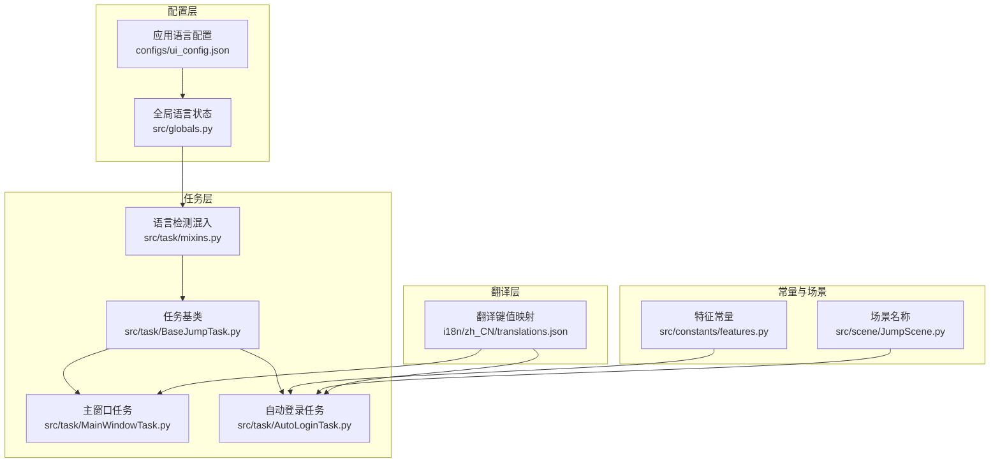
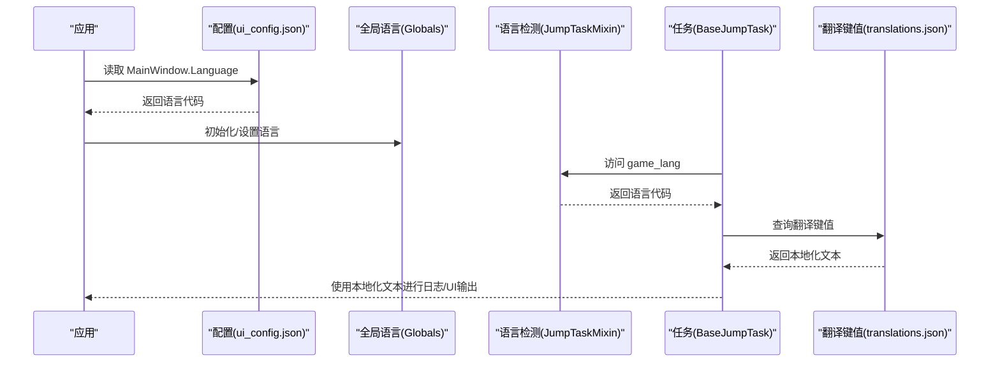
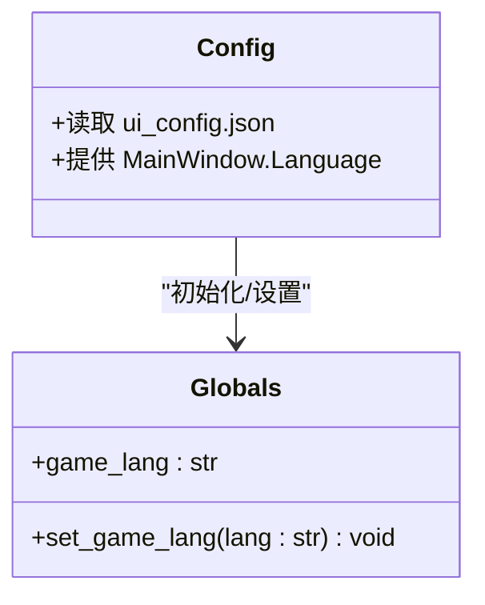
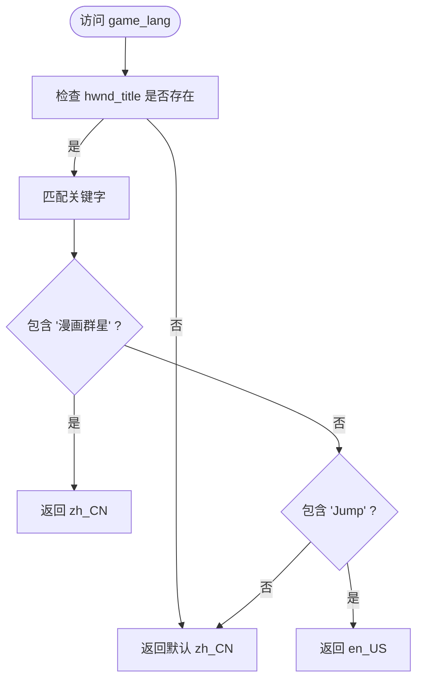
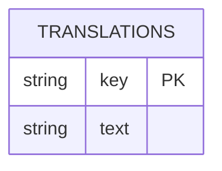
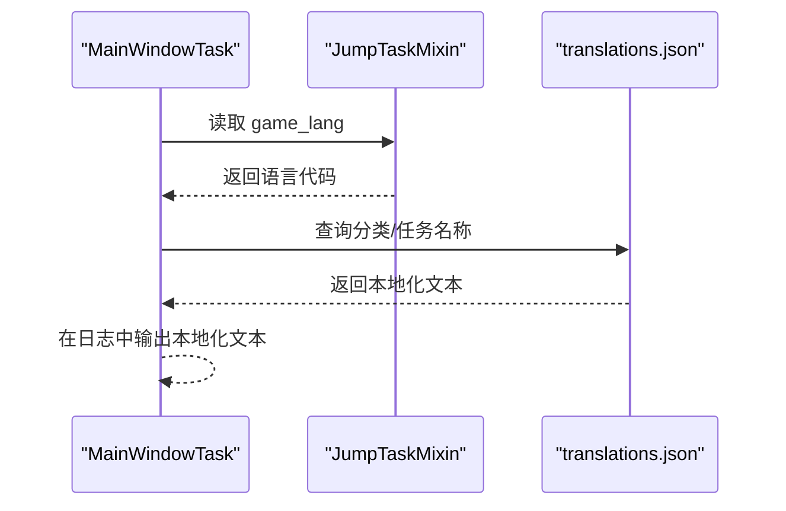
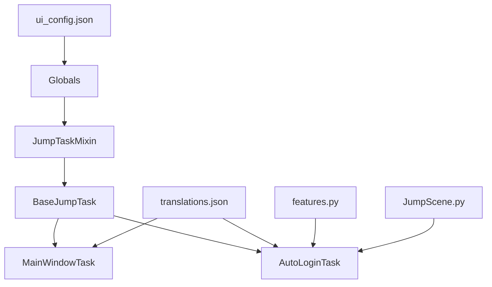

# 国际化支持

<cite>
**本文引用的文件**
- [config.py](file://config.py)
- [ui_config.json](file://configs/ui_config.json)
- [globals.py](file://src/globals.py)
- [mixins.py](file://src/task/mixins.py)
- [BaseJumpTask.py](file://src/task/BaseJumpTask.py)
- [MainWindowTask.py](file://src/task/MainWindowTask.py)
- [AutoLoginTask.py](file://src/task/AutoLoginTask.py)
- [features.py](file://src/constants/features.py)
- [JumpScene.py](file://src/scene/JumpScene.py)
- [translations.json](file://i18n/zh_CN/translations.json)
</cite>

## 目录
1. [简介](#简介)
2. [项目结构](#项目结构)
3. [核心组件](#核心组件)
4. [架构总览](#架构总览)
5. [详细组件分析](#详细组件分析)
6. [依赖分析](#依赖分析)
7. [性能考虑](#性能考虑)
8. [故障排查指南](#故障排查指南)
9. [结论](#结论)
10. [附录](#附录)

## 简介
本文件面向“国际化支持系统”的技术文档，聚焦于多语言配置、翻译文件管理、动态语言切换与缓存策略、翻译键值命名规范与组织结构、新增语言与翻译更新工作流、本地化最佳实践与质量保障，以及开发者扩展与维护的指导。当前仓库已具备基础的多语言能力：通过全局语言状态、基于窗口标题的语言检测、以及翻译键值映射文件，形成“语言配置 → 语言检测 → 翻译键值 → UI/日志输出”的闭环。

## 项目结构
国际化相关的关键位置与职责如下：
- 配置层
  - 应用级语言配置：configs/ui_config.json 中的 MainWindow.Language 字段
  - 全局语言状态：src/globals.py 中的 Globals.game_lang
- 任务层
  - 语言检测：src/task/mixins.py 中的 JumpTaskMixin.game_lang 属性
  - 任务基类：src/task/BaseJumpTask.py 继承 JumpTaskMixin
  - 示例任务：src/task/MainWindowTask.py、src/task/AutoLoginTask.py
- 常量与场景
  - 特征常量：src/constants/features.py
  - 场景名称：src/scene/JumpScene.py
- 翻译层
  - 翻译键值映射：i18n/zh_CN/translations.json

图表来源
- [ui_config.json:8-12](file://configs/ui_config.json#L8-L12)
- [globals.py:84-104](file://src/globals.py#L84-L104)
- [mixins.py:36-51](file://src/task/mixins.py#L36-L51)
- [BaseJumpTask.py:10-28](file://src/task/BaseJumpTask.py#L10-L28)
- [MainWindowTask.py:7-47](file://src/task/MainWindowTask.py#L7-L47)
- [AutoLoginTask.py:45-67](file://src/task/AutoLoginTask.py#L45-L67)
- [features.py:9-85](file://src/constants/features.py#L9-L85)
- [JumpScene.py:150-169](file://src/scene/JumpScene.py#L150-L169)
- [translations.json:1-75](file://i18n/zh_CN/translations.json#L1-L75)

章节来源
- [config.py:65-137](file://config.py#L65-L137)
- [ui_config.json:8-12](file://configs/ui_config.json#L8-L12)
- [globals.py:84-104](file://src/globals.py#L84-L104)
- [mixins.py:36-51](file://src/task/mixins.py#L36-L51)
- [BaseJumpTask.py:10-28](file://src/task/BaseJumpTask.py#L10-L28)
- [MainWindowTask.py:7-47](file://src/task/MainWindowTask.py#L7-L47)
- [AutoLoginTask.py:45-67](file://src/task/AutoLoginTask.py#L45-L67)
- [features.py:9-85](file://src/constants/features.py#L9-L85)
- [JumpScene.py:150-169](file://src/scene/JumpScene.py#L150-L169)
- [translations.json:1-75](file://i18n/zh_CN/translations.json#L1-L75)

## 核心组件
- 应用语言配置
  - MainWindow.Language 在 ui_config.json 中设定初始语言，默认为 zh_CN
- 全局语言状态
  - Globals 提供 game_lang 属性与 set_game_lang 方法，用于读取/设置全局语言代码
- 语言检测
  - JumpTaskMixin.game_lang 基于窗口标题关键字判断语言（'漫画群星'→zh_CN；'Jump'→en_US）
- 翻译键值映射
  - i18n/zh_CN/translations.json 提供键值到本地化文本的映射
- 任务与UI集成
  - MainWindowTask 与 AutoLoginTask 等任务在运行日志与UI展示中使用翻译键值
  - features.py 定义特征常量，配合翻译键值进行界面识别与交互

章节来源
- [ui_config.json:8-12](file://configs/ui_config.json#L8-L12)
- [globals.py:84-104](file://src/globals.py#L84-L104)
- [mixins.py:36-51](file://src/task/mixins.py#L36-L51)
- [translations.json:1-75](file://i18n/zh_CN/translations.json#L1-L75)
- [MainWindowTask.py:7-47](file://src/task/MainWindowTask.py#L7-L47)
- [AutoLoginTask.py:45-67](file://src/task/AutoLoginTask.py#L45-L67)
- [features.py:9-85](file://src/constants/features.py#L9-L85)

## 架构总览
国际化支持的运行时流程：
- 应用启动时读取 ui_config.json 的 Language 作为初始语言
- 任务执行过程中通过 JumpTaskMixin 检测当前语言（依据窗口标题）
- 全局状态 Globals.game_lang 作为统一语言源，供各模块使用
- 翻译键值映射文件提供本地化文本，任务在日志与UI中按需查询

图表来源
- [ui_config.json:8-12](file://configs/ui_config.json#L8-L12)
- [globals.py:84-104](file://src/globals.py#L84-L104)
- [mixins.py:36-51](file://src/task/mixins.py#L36-L51)
- [BaseJumpTask.py:10-28](file://src/task/BaseJumpTask.py#L10-L28)
- [translations.json:1-75](file://i18n/zh_CN/translations.json#L1-L75)

## 详细组件分析

### 组件A：语言配置与全局状态
- 设计要点
  - ui_config.json 的 MainWindow.Language 作为应用初始语言
  - Globals 提供统一的全局语言状态，支持读取与设置
- 数据结构与复杂度
  - 语言状态为简单字符串，读写均为 O(1)
- 依赖链
  - 应用启动 → 读取配置 → 初始化 Globals → 任务使用
- 优化建议
  - 在应用启动阶段集中初始化语言，避免重复读取配置
  - 如需动态切换，建议在设置后广播通知相关模块刷新显示

图表来源
- [globals.py:84-104](file://src/globals.py#L84-L104)
- [ui_config.json:8-12](file://configs/ui_config.json#L8-L12)

章节来源
- [ui_config.json:8-12](file://configs/ui_config.json#L8-L12)
- [globals.py:84-104](file://src/globals.py#L84-L104)

### 组件B：动态语言检测
- 设计要点
  - 基于窗口标题关键字判断语言：包含“漫画群星”为 zh_CN，包含“Jump”为 en_US
  - 默认回退为 zh_CN
- 数据流
  - 任务访问 JumpTaskMixin.game_lang → 读取 hwnd_title → 关键字匹配 → 返回语言代码
- 性能影响
  - 每次访问为 O(1) 字符串匹配，开销极低
- 错误处理
  - 无 hwnd_title 或匹配不到时回退 zh_CN

图表来源
- [mixins.py:36-51](file://src/task/mixins.py#L36-L51)

章节来源
- [mixins.py:36-51](file://src/task/mixins.py#L36-L51)

### 组件C：翻译键值映射与使用
- 设计要点
  - i18n/zh_CN/translations.json 提供键值到本地化文本的映射
  - 任务在日志与UI中按需查询键值，得到本地化文本
- 数据结构
  - JSON 键值对，查询为 O(1) 哈希表查找
- 组织结构
  - 顶层键通常为任务/功能名称或配置项名称，便于按模块归类

图表来源
- [translations.json:1-75](file://i18n/zh_CN/translations.json#L1-L75)

章节来源
- [translations.json:1-75](file://i18n/zh_CN/translations.json#L1-L75)
- [MainWindowTask.py:7-47](file://src/task/MainWindowTask.py#L7-L47)
- [AutoLoginTask.py:45-67](file://src/task/AutoLoginTask.py#L45-L67)

### 组件D：任务与UI中的国际化集成
- 设计要点
  - MainWindowTask 使用翻译键值进行功能分类与任务描述的本地化展示
  - AutoLoginTask 在日志中使用翻译键值输出状态与步骤信息
- 依赖关系
  - 任务依赖 JumpTaskMixin 获取语言
  - 任务依赖翻译键值映射文件进行文本输出

图表来源
- [MainWindowTask.py:7-47](file://src/task/MainWindowTask.py#L7-L47)
- [mixins.py:36-51](file://src/task/mixins.py#L36-L51)
- [translations.json:1-75](file://i18n/zh_CN/translations.json#L1-L75)

章节来源
- [MainWindowTask.py:7-47](file://src/task/MainWindowTask.py#L7-L47)
- [mixins.py:36-51](file://src/task/mixins.py#L36-L51)
- [translations.json:1-75](file://i18n/zh_CN/translations.json#L1-L75)

## 依赖分析
- 组件耦合
  - 任务层依赖 JumpTaskMixin 提供语言检测
  - 任务层依赖翻译键值映射文件进行文本输出
  - 全局语言状态为统一语言源，减少重复检测
- 外部依赖
  - ui_config.json 提供初始语言配置
  - 特征常量与场景名称为界面识别提供支撑

图表来源
- [ui_config.json:8-12](file://configs/ui_config.json#L8-L12)
- [globals.py:84-104](file://src/globals.py#L84-L104)
- [mixins.py:36-51](file://src/task/mixins.py#L36-L51)
- [BaseJumpTask.py:10-28](file://src/task/BaseJumpTask.py#L10-L28)
- [MainWindowTask.py:7-47](file://src/task/MainWindowTask.py#L7-L47)
- [AutoLoginTask.py:45-67](file://src/task/AutoLoginTask.py#L45-L67)
- [translations.json:1-75](file://i18n/zh_CN/translations.json#L1-L75)
- [features.py:9-85](file://src/constants/features.py#L9-L85)
- [JumpScene.py:150-169](file://src/scene/JumpScene.py#L150-L169)

章节来源
- [ui_config.json:8-12](file://configs/ui_config.json#L8-L12)
- [globals.py:84-104](file://src/globals.py#L84-L104)
- [mixins.py:36-51](file://src/task/mixins.py#L36-L51)
- [BaseJumpTask.py:10-28](file://src/task/BaseJumpTask.py#L10-L28)
- [MainWindowTask.py:7-47](file://src/task/MainWindowTask.py#L7-L47)
- [AutoLoginTask.py:45-67](file://src/task/AutoLoginTask.py#L45-L67)
- [translations.json:1-75](file://i18n/zh_CN/translations.json#L1-L75)
- [features.py:9-85](file://src/constants/features.py#L9-L85)
- [JumpScene.py:150-169](file://src/scene/JumpScene.py#L150-L169)

## 性能考虑
- 语言检测
  - 基于字符串关键字匹配，O(1) 时间复杂度，开销极小
- 翻译键值查询
  - JSON 键值映射为哈希表查找，O(1) 时间复杂度
- 缓存策略
  - 当前未发现针对翻译键值的显式缓存实现；可在高频查询处引入内存缓存以减少重复解析

## 故障排查指南
- 语言检测异常
  - 现象：始终返回 zh_CN
  - 排查：确认任务运行时 hwnd_title 是否存在；检查窗口标题是否包含“漫画群星”或“Jump”
- 翻译键值缺失
  - 现象：日志/UI 显示键名而非本地化文本
  - 排查：确认 translations.json 中是否存在对应键；确认任务是否正确查询键值
- 配置未生效
  - 现象：应用启动后语言未按 ui_config.json 设置
  - 排查：确认应用启动时是否读取并初始化 Globals 的语言状态

章节来源
- [mixins.py:36-51](file://src/task/mixins.py#L36-L51)
- [translations.json:1-75](file://i18n/zh_CN/translations.json#L1-L75)
- [ui_config.json:8-12](file://configs/ui_config.json#L8-L12)

## 结论
当前国际化支持以“配置语言 → 全局状态 → 动态检测 → 翻译键值映射”为核心路径，结构清晰、耦合度低。建议后续增强点：完善动态语言切换机制、引入翻译键值缓存、建立翻译键值命名规范与组织结构标准、制定新增语言与翻译更新流程，以提升可维护性与扩展性。

## 附录

### 翻译键值命名规范与组织结构
- 命名规范
  - 采用语义化键名，如“任务/功能名称”“配置项名称”，避免使用纯英文或拼音
  - 保持键名稳定，避免频繁变更导致维护成本上升
- 组织结构
  - 按功能模块分组（如任务分类、配置项等），便于查找与维护
  - 与任务/配置项一一对应，确保覆盖完整

章节来源
- [translations.json:1-75](file://i18n/zh_CN/translations.json#L1-L75)
- [MainWindowTask.py:7-47](file://src/task/MainWindowTask.py#L7-L47)

### 新增语言与翻译更新工作流
- 新增语言
  - 在 i18n 目录下新增语言子目录（如 en_US），复制 translations.json 并翻译
  - 更新 ui_config.json 的 Language 为新语言代码
  - 在任务层根据 JumpTaskMixin.game_lang 的返回值选择对应语言的翻译文件
- 翻译更新
  - 修改 translations.json 中对应键值
  - 重启应用或触发刷新逻辑，使新翻译生效

章节来源
- [ui_config.json:8-12](file://configs/ui_config.json#L8-L12)
- [mixins.py:36-51](file://src/task/mixins.py#L36-L51)
- [translations.json:1-75](file://i18n/zh_CN/translations.json#L1-L75)

### 本地化最佳实践与质量保证
- 最佳实践
  - 统一语言源（Globals），避免多处硬编码语言
  - 在高频输出处引入翻译键值缓存，减少重复解析
  - 为每个翻译键值提供注释或上下文，便于翻译一致性
- 质量保证
  - 建立翻译键值清单与覆盖率检查
  - 引入自动化测试，验证翻译键值存在性与有效性
  - 对比不同语言版本的翻译完整性，确保无遗漏

章节来源
- [globals.py:84-104](file://src/globals.py#L84-L104)
- [translations.json:1-75](file://i18n/zh_CN/translations.json#L1-L75)