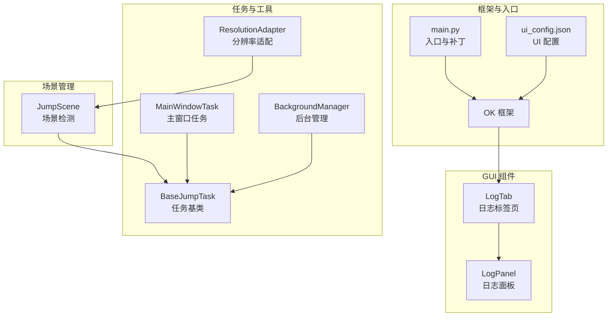
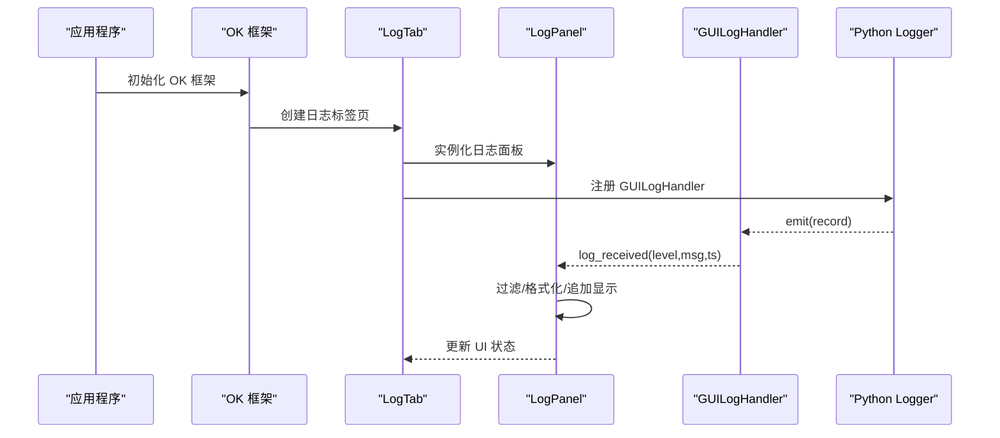
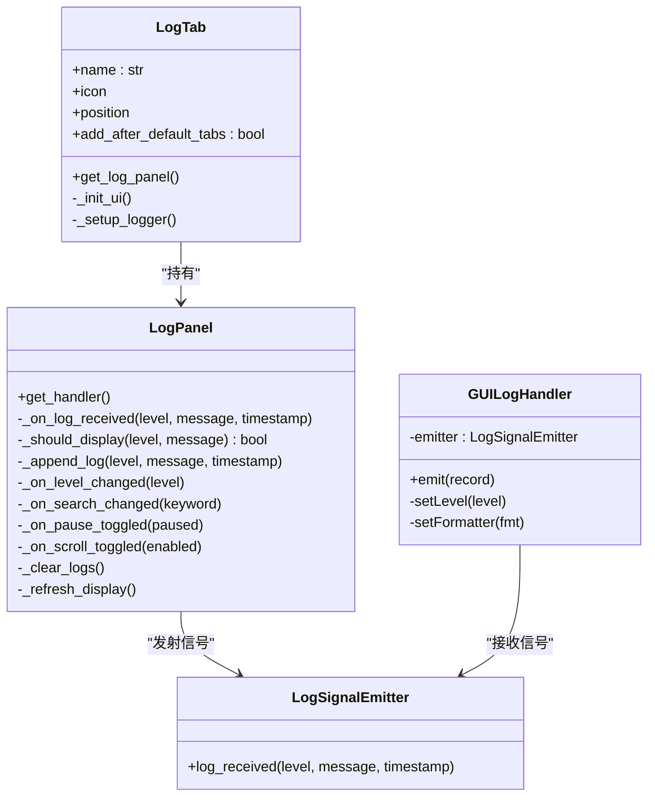
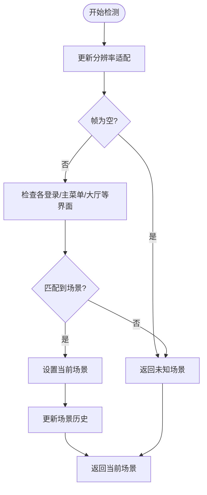
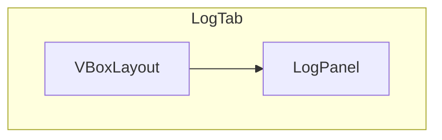
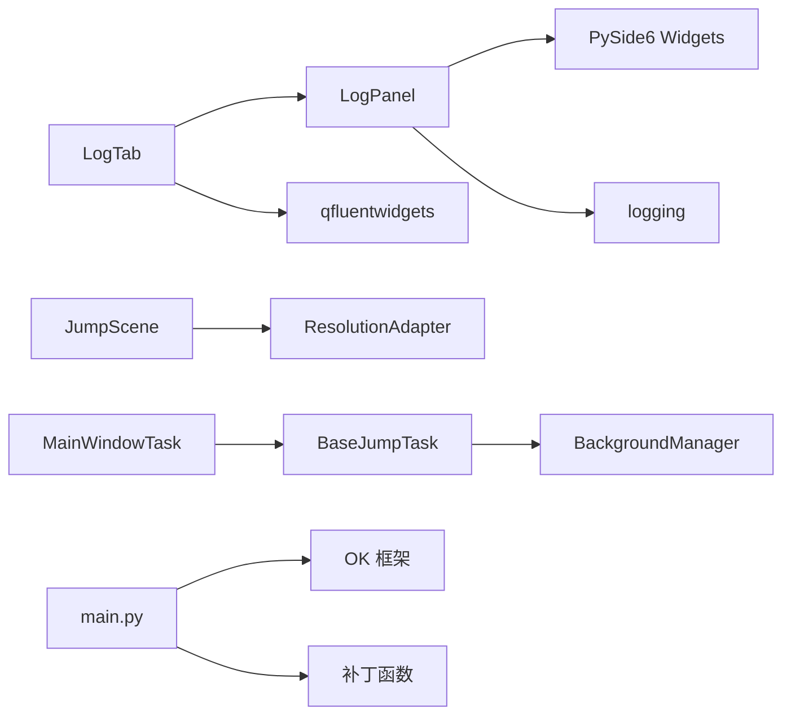

# 图形界面

<cite>
**本文档引用的文件**
- [main.py](file://main.py)
- [src/gui/__init__.py](file://src/gui/__init__.py)
- [src/gui/log_panel.py](file://src/gui/log_panel.py)
- [src/gui/log_tab.py](file://src/gui/log_tab.py)
- [src/scene/JumpScene.py](file://src/scene/JumpScene.py)
- [src/task/MainWindowTask.py](file://src/task/MainWindowTask.py)
- [src/task/BaseJumpTask.py](file://src/task/BaseJumpTask.py)
- [src/utils/BackgroundManager.py](file://src/utils/BackgroundManager.py)
- [src/utils/ResolutionAdapter.py](file://src/utils/ResolutionAdapter.py)
- [configs/ui_config.json](file://configs/ui_config.json)
- [configs/main_window.json](file://configs/main_window.json)
</cite>

## 目录
1. [简介](#简介)
2. [项目结构](#项目结构)
3. [核心组件](#核心组件)
4. [架构总览](#架构总览)
5. [详细组件分析](#详细组件分析)
6. [依赖关系分析](#依赖关系分析)
7. [性能考虑](#性能考虑)
8. [故障排查指南](#故障排查指南)
9. [结论](#结论)
10. [附录](#附录)

## 简介
本文件面向 ok-jump 项目的图形界面，系统性介绍基于 PySide6 的 GUI 设计与实现，重点覆盖以下方面：
- 日志面板与日志标签页：实时日志显示、过滤、格式化、线程安全传递与 UI 控件集成
- 场景管理系统：场景检测、切换机制、界面状态管理与用户交互处理
- 主界面布局与组件组织：基于 ok-script 框架的导航标签页与任务卡片体系
- 响应式设计与用户体验优化：主题、字体、控件样式与 FluentWidgets 集成
- 开发者定制与扩展指南：如何新增界面元素、修改布局与接入日志系统

## 项目结构
ok-jump 的 GUI 相关代码主要位于 src/gui 目录，配合 ok-script 框架提供的 StartCard、TaskCard、Navigation 等组件，形成完整的可视化界面。核心文件如下：
- 日志系统：log_panel.py（日志面板）、log_tab.py（日志标签页）
- 场景管理：JumpScene.py（场景检测与状态机）
- 主窗口任务：MainWindowTask.py（功能索引与窗口检测）
- 工具与适配：BackgroundManager.py（后台模式与伪最小化）、ResolutionAdapter.py（分辨率自适应）
- 启动入口：main.py（框架初始化、补丁与定时器）
- UI 配置：configs/ui_config.json（主题、语言、DPI 等）

图表来源
- [src/gui/log_panel.py:58-114](file://src/gui/log_panel.py#L58-L114)
- [src/gui/log_tab.py:15-36](file://src/gui/log_tab.py#L15-L36)
- [src/scene/JumpScene.py:8-30](file://src/scene/JumpScene.py#L8-L30)
- [src/task/MainWindowTask.py:5-54](file://src/task/MainWindowTask.py#L5-L54)
- [src/task/BaseJumpTask.py:26-50](file://src/task/BaseJumpTask.py#L26-L50)
- [src/utils/BackgroundManager.py:7-24](file://src/utils/BackgroundManager.py#L7-L24)
- [src/utils/ResolutionAdapter.py:4-18](file://src/utils/ResolutionAdapter.py#L4-L18)
- [main.py:659-693](file://main.py#L659-L693)
- [configs/ui_config.json:1-17](file://configs/ui_config.json#L1-L17)

章节来源
- [main.py:659-693](file://main.py#L659-L693)
- [configs/ui_config.json:1-17](file://configs/ui_config.json#L1-L17)

## 核心组件
- 日志面板（LogPanel）：提供实时日志显示、级别过滤、关键词搜索、暂停/恢复、自动滚动、清空、状态栏与 FPS 显示等能力；采用线程安全的信号槽机制与 GUI 处理器对接。
- 日志标签页（LogTab）：作为 ok-script 导航体系中的一个标签页，负责承载 LogPanel 并注册日志处理器到根 logger。
- 场景管理（JumpScene）：封装场景检测逻辑，维护当前场景与历史记录，提供等待场景、判断状态等接口。
- 主窗口任务（MainWindowTask）：输出功能索引与窗口检测结果，展示分辨率与后台模式信息。
- 后台管理（BackgroundManager）：检测前台窗口、静音策略、伪最小化与可见性保障。
- 分辨率适配（ResolutionAdapter）：计算缩放因子、校验比例、推荐尺寸等。

章节来源
- [src/gui/log_panel.py:58-114](file://src/gui/log_panel.py#L58-L114)
- [src/gui/log_tab.py:15-36](file://src/gui/log_tab.py#L15-L36)
- [src/scene/JumpScene.py:8-30](file://src/scene/JumpScene.py#L8-L30)
- [src/task/MainWindowTask.py:55-80](file://src/task/MainWindowTask.py#L55-L80)
- [src/utils/BackgroundManager.py:43-92](file://src/utils/BackgroundManager.py#L43-L92)
- [src/utils/ResolutionAdapter.py:34-44](file://src/utils/ResolutionAdapter.py#L34-L44)

## 架构总览
ok-jump 的 GUI 架构建立在 ok-script 框架之上，通过以下层次协同：
- 入口层：main.py 注入补丁、初始化 OK 框架、启动 GUI，并延迟初始化定时任务调度器。
- UI 层：LogTab 作为导航标签页，内部嵌入 LogPanel；LogPanel 通过 GUILogHandler 将日志事件转发至 UI。
- 业务层：MainWindowTask 输出系统状态；JumpScene 提供场景检测；BackgroundManager/ResolutionAdapter 提供运行时环境支持。
- 配置层：ui_config.json 控制主题、语言、DPI 等；main_window.json 记录版本信息。

图表来源
- [src/gui/log_tab.py:47-65](file://src/gui/log_tab.py#L47-L65)
- [src/gui/log_panel.py:34-56](file://src/gui/log_panel.py#L34-L56)
- [src/gui/log_panel.py:252-271](file://src/gui/log_panel.py#L252-L271)

章节来源
- [main.py:659-693](file://main.py#L659-L693)
- [src/gui/log_tab.py:47-65](file://src/gui/log_tab.py#L47-L65)
- [src/gui/log_panel.py:34-56](file://src/gui/log_panel.py#L34-L56)

## 详细组件分析

### 日志面板与日志标签页
- 日志面板（LogPanel）
  - 功能要点：实时显示、级别过滤（DEBUG/INFO/WARNING/ERROR）、关键词过滤、暂停/恢复、自动滚动、清空、状态栏与日志计数。
  - 线程安全：通过 LogSignalEmitter 与 GUILogHandler 实现跨线程日志传递，避免 UI 线程阻塞。
  - 格式化：按日志级别与特殊标记着色，时间戳统一格式化，等宽字体保证对齐。
  - UI 控件：支持 qfluentwidgets（若可用）与标准 Qt 控件的降级方案。
- 日志标签页（LogTab）
  - 作为 ok-script 导航标签页，定义 name/icon/position/add_after_default_tabs 等属性。
  - 初始化时创建 LogPanel 并注册处理器到根 logger，确保所有日志流入面板。

图表来源
- [src/gui/log_panel.py:29-56](file://src/gui/log_panel.py#L29-L56)
- [src/gui/log_panel.py:58-114](file://src/gui/log_panel.py#L58-L114)
- [src/gui/log_tab.py:15-36](file://src/gui/log_tab.py#L15-L36)

章节来源
- [src/gui/log_panel.py:58-114](file://src/gui/log_panel.py#L58-L114)
- [src/gui/log_panel.py:248-387](file://src/gui/log_panel.py#L248-L387)
- [src/gui/log_tab.py:15-36](file://src/gui/log_tab.py#L15-L36)
- [src/gui/log_tab.py:47-65](file://src/gui/log_tab.py#L47-L65)

### 场景管理系统
- JumpScene
  - 场景枚举：主菜单、登录界面、大厅、英雄选择、加载中、游戏中、结算画面、未知场景。
  - 检测流程：根据帧图像与特征匹配，更新分辨率适配器，维护场景历史，提供等待场景与状态判断。
  - 接口：get_current_scene、get_scene_name、wait_for_scene、is_in_game/is_in_menu/is_in_login 等。
- 与任务协作
  - MainWindowTask 与 BaseJumpTask 通过 JumpScene 的接口进行状态判断与等待，结合 BackgroundManager/ResolutionAdapter 提升稳定性。

图表来源
- [src/scene/JumpScene.py:39-71](file://src/scene/JumpScene.py#L39-L71)
- [src/scene/JumpScene.py:73-148](file://src/scene/JumpScene.py#L73-L148)

章节来源
- [src/scene/JumpScene.py:8-30](file://src/scene/JumpScene.py#L8-L30)
- [src/scene/JumpScene.py:39-71](file://src/scene/JumpScene.py#L39-L71)
- [src/scene/JumpScene.py:150-196](file://src/scene/JumpScene.py#L150-L196)

### 主界面布局与组件组织
- LogTab 作为底部导航标签页，内部使用垂直布局放置 LogPanel，设置 objectName 以满足 qfluentwidgets 要求。
- MainWindowTask 输出功能索引与窗口检测结果，展示分辨率与后台模式信息，便于用户理解当前运行状态。
- UI 配置（ui_config.json）控制主题色、主题模式、语言、DPI 等，影响 ok-script 框架渲染效果。

图表来源
- [src/gui/log_tab.py:38-46](file://src/gui/log_tab.py#L38-L46)

章节来源
- [src/gui/log_tab.py:15-36](file://src/gui/log_tab.py#L15-L36)
- [src/gui/log_tab.py:38-46](file://src/gui/log_tab.py#L38-L46)
- [src/task/MainWindowTask.py:55-80](file://src/task/MainWindowTask.py#L55-L80)
- [configs/ui_config.json:8-16](file://configs/ui_config.json#L8-L16)

### 响应式设计与用户体验优化
- 主题与样式：ui_config.json 指定主题色与暗色模式；LogPanel 内置样式表与等宽字体，提升日志可读性。
- 控件降级：若 qfluentwidgets 不可用，自动回退到标准 Qt 控件，保证兼容性。
- 状态反馈：LogPanel 提供状态栏与 FPS 显示，LogTab 提供“日志监控已启动/暂停”提示。
- 后台模式：BackgroundManager 提供静音、伪最小化与可见性保障，减少前台占用。

章节来源
- [configs/ui_config.json:1-17](file://configs/ui_config.json#L1-L17)
- [src/gui/log_panel.py:236-246](file://src/gui/log_panel.py#L236-L246)
- [src/gui/log_panel.py:324-333](file://src/gui/log_panel.py#L324-L333)
- [src/utils/BackgroundManager.py:77-92](file://src/utils/BackgroundManager.py#L77-L92)

### 开发者定制与扩展指南
- 新增日志标签页
  - 继承 QWidget，实现 name/icon/position/add_after_default_tabs 属性，参考 LogTab 的实现。
  - 在构造函数中创建布局与组件，注册日志处理器到根 logger。
- 修改日志面板
  - 可调整最大行数、颜色映射、过滤策略与 UI 控件样式。
  - 若需更复杂的日志过滤，可在 LogPanel 的过滤逻辑中扩展。
- 场景扩展
  - 在 JumpScene 中新增场景检测分支，维护场景常量与历史记录。
  - 通过 BaseJumpTask 的 wait_for_scene 与状态判断接口进行业务编排。
- 后台与分辨率
  - 使用 BackgroundManager 的状态查询与伪最小化接口，结合 ResolutionAdapter 的缩放因子进行坐标转换。

章节来源
- [src/gui/log_tab.py:15-36](file://src/gui/log_tab.py#L15-L36)
- [src/gui/log_panel.py:95-114](file://src/gui/log_panel.py#L95-L114)
- [src/scene/JumpScene.py:8-30](file://src/scene/JumpScene.py#L8-L30)
- [src/utils/BackgroundManager.py:82-92](file://src/utils/BackgroundManager.py#L82-L92)
- [src/utils/ResolutionAdapter.py:34-44](file://src/utils/ResolutionAdapter.py#L34-L44)

## 依赖关系分析
- LogPanel 依赖 PySide6 的 UI 组件与 logging 模块；在存在 qfluentwidgets 时优先使用其控件。
- LogTab 依赖 LogPanel 与 qfluentwidgets 的导航图标与位置常量。
- JumpScene 依赖 ok-script 的 BaseScene 与分辨率适配器。
- MainWindowTask 与 BaseJumpTask 依赖 BackgroundManager、ResolutionAdapter 与 ok-script 的任务框架。
- main.py 依赖 ok-script 的 OK 框架与多个补丁函数，负责全局初始化与定时任务调度。

图表来源
- [src/gui/log_panel.py:11-16](file://src/gui/log_panel.py#L11-L16)
- [src/gui/log_tab.py:9-12](file://src/gui/log_tab.py#L9-L12)
- [src/scene/JumpScene.py:5-6](file://src/scene/JumpScene.py#L5-L6)
- [src/task/MainWindowTask.py:1-2](file://src/task/MainWindowTask.py#L1-L2)
- [src/task/BaseJumpTask.py:4-6](file://src/task/BaseJumpTask.py#L4-L6)
- [src/utils/BackgroundManager.py:1-4](file://src/utils/BackgroundManager.py#L1-L4)
- [main.py:17-18](file://main.py#L17-L18)

章节来源
- [src/gui/log_panel.py:11-16](file://src/gui/log_panel.py#L11-L16)
- [src/gui/log_tab.py:9-12](file://src/gui/log_tab.py#L9-L12)
- [src/scene/JumpScene.py:5-6](file://src/scene/JumpScene.py#L5-L6)
- [src/task/MainWindowTask.py:1-2](file://src/task/MainWindowTask.py#L1-L2)
- [src/task/BaseJumpTask.py:4-6](file://src/task/BaseJumpTask.py#L4-L6)
- [src/utils/BackgroundManager.py:1-4](file://src/utils/BackgroundManager.py#L1-L4)
- [main.py:17-18](file://main.py#L17-L18)

## 性能考虑
- 日志面板使用双端队列（deque）限制最大行数，避免内存膨胀。
- UI 更新采用自动滚动与增量追加，减少不必要的重绘。
- 后台模式下通过伪最小化与静音策略降低系统开销。
- 分辨率适配通过缓存缩放因子与比例校验，减少重复计算。

## 故障排查指南
- 日志不显示
  - 确认 LogTab 已注册 GUILogHandler 至根 logger，且日志级别足够低。
  - 检查 LogPanel 的过滤级别与关键词是否过于严格。
- UI 控件缺失或样式异常
  - 若 qfluentwidgets 未安装，LogPanel 会回退到标准 Qt 控件；确认依赖安装或手动调整样式。
- 后台模式无效
  - 检查 BackgroundManager 的配置项与前台窗口检测逻辑，确认窗口句柄有效。
- 分辨率不匹配
  - 使用 ResolutionAdapter 的检查接口与推荐尺寸，调整游戏窗口大小或配置。

章节来源
- [src/gui/log_tab.py:47-65](file://src/gui/log_tab.py#L47-L65)
- [src/gui/log_panel.py:272-283](file://src/gui/log_panel.py#L272-L283)
- [src/utils/BackgroundManager.py:43-75](file://src/utils/BackgroundManager.py#L43-L75)
- [src/utils/ResolutionAdapter.py:98-119](file://src/utils/ResolutionAdapter.py#L98-L119)

## 结论
ok-jump 的图形界面以 PySide6 为基础，结合 ok-script 框架实现了日志可视化、场景检测与任务编排。日志面板具备完善的过滤与格式化能力，场景管理提供稳定的状态判断，后台与分辨率适配增强了运行时鲁棒性。通过清晰的模块划分与配置化策略，开发者可以便捷地扩展界面与功能。

## 附录
- UI 配置项参考
  - Material：AcrylicBlurRadius
  - Update：CheckUpdateAtStartUp
  - MainWindow：DpiScale、Language、MicaEnabled
  - QFluentWidgets：ThemeColor、ThemeMode

章节来源
- [configs/ui_config.json:1-17](file://configs/ui_config.json#L1-L17)