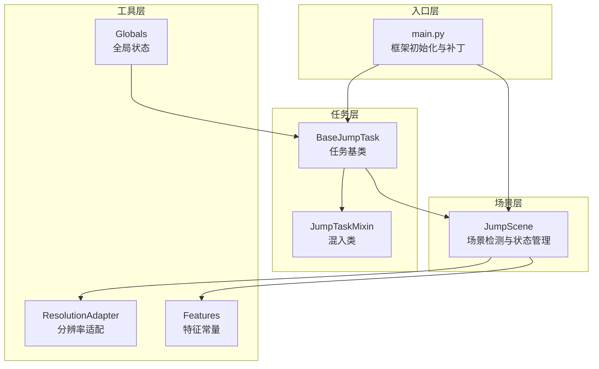
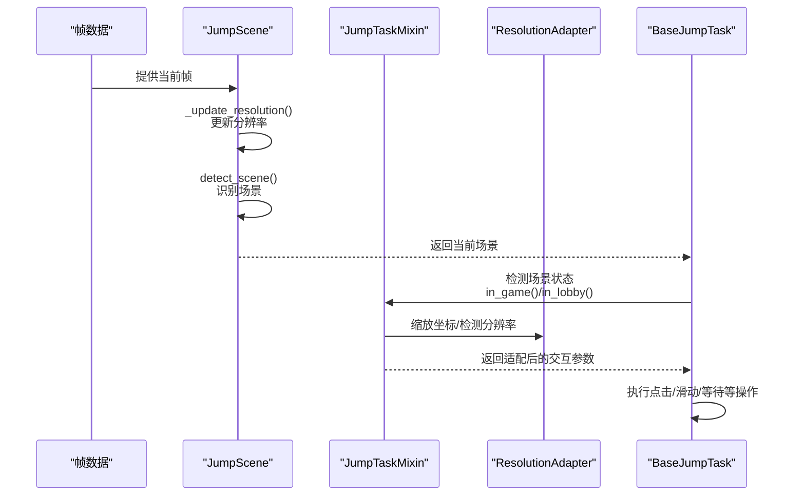
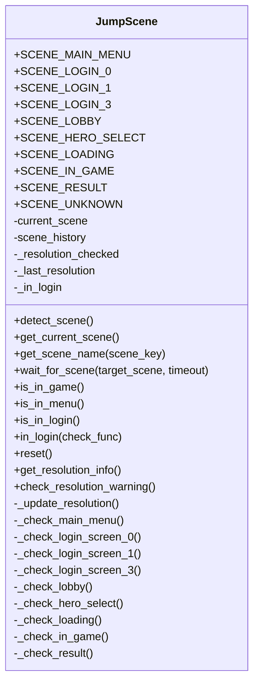
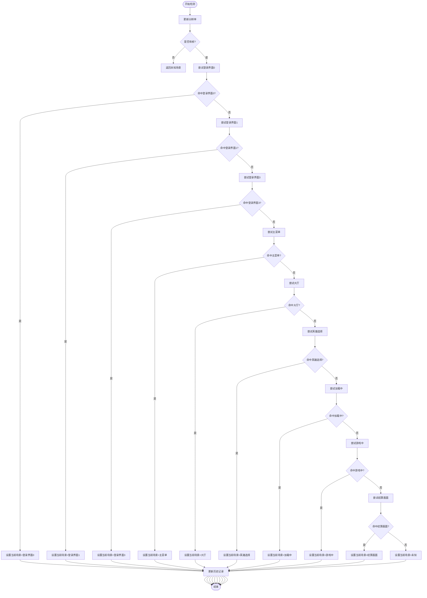
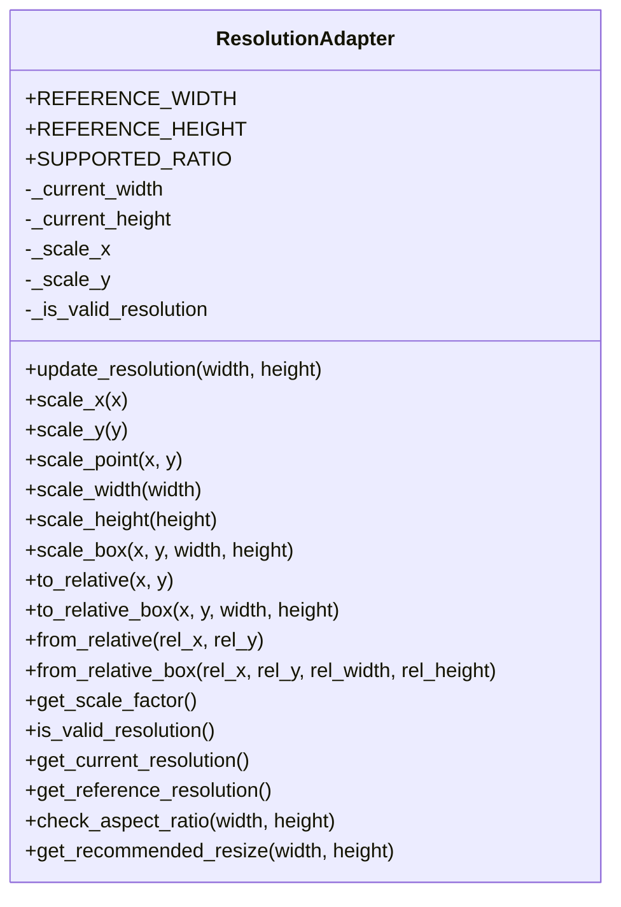
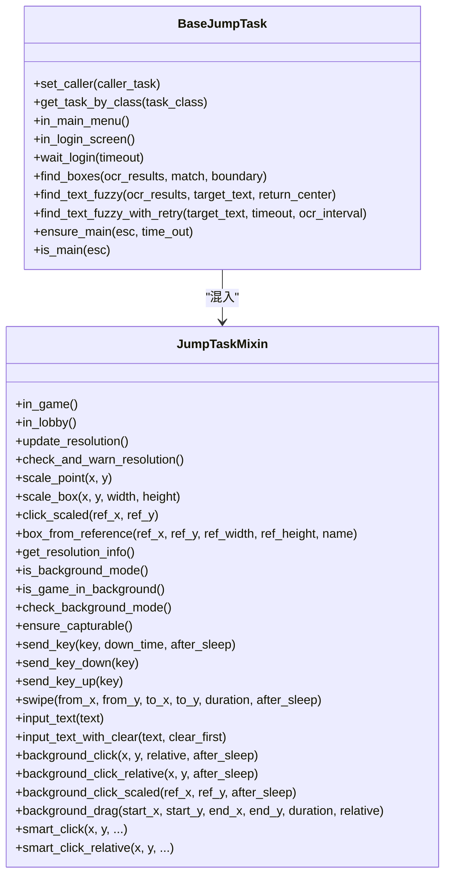
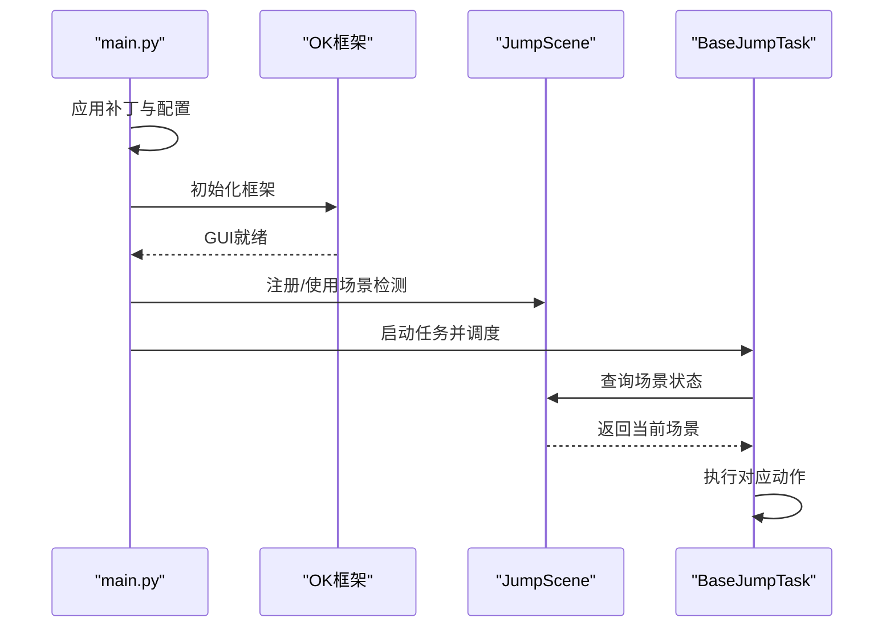
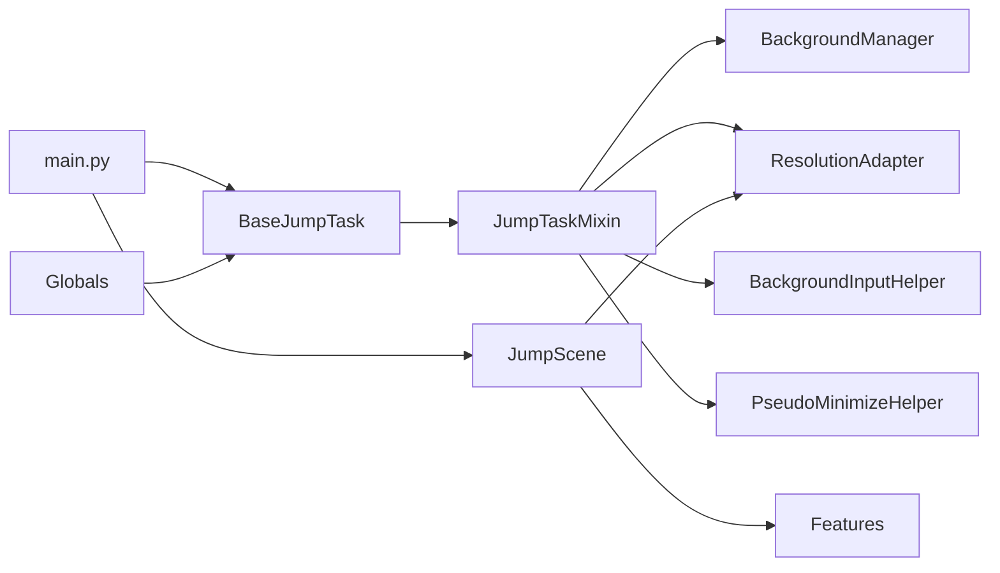

# 场景管理系统

<cite>
**本文档引用的文件**
- [JumpScene.py](file://src/scene/JumpScene.py)
- [__init__.py](file://src/scene/__init__.py)
- [BaseJumpTask.py](file://src/task/BaseJumpTask.py)
- [mixins.py](file://src/task/mixins.py)
- [ResolutionAdapter.py](file://src/utils/ResolutionAdapter.py)
- [features.py](file://src/constants/features.py)
- [globals.py](file://src/globals.py)
- [main.py](file://main.py)
</cite>

## 目录
1. [简介](#简介)
2. [项目结构](#项目结构)
3. [核心组件](#核心组件)
4. [架构总览](#架构总览)
5. [详细组件分析](#详细组件分析)
6. [依赖关系分析](#依赖关系分析)
7. [性能考虑](#性能考虑)
8. [故障排查指南](#故障排查指南)
9. [结论](#结论)
10. [附录](#附录)

## 简介
本文件面向 ok-jump 项目的场景管理系统，聚焦于场景检测与切换机制、界面状态管理、用户交互处理等核心能力。文档围绕 JumpScene 类展开，解释其初始化、激活、停用过程，以及场景间的通信机制；阐述场景管理器如何协调多个场景的生命周期，处理场景切换时的状态保存与恢复；描述场景系统的事件处理机制，包括用户输入的路由、界面元素的生命周期管理；最后给出扩展性设计与二次开发指南，涵盖添加新场景类型、自定义场景行为、集成第三方 UI 组件等最佳实践与性能优化建议。

## 项目结构
场景管理系统位于 src/scene 目录，核心为 JumpScene 类，配合任务系统中的 BaseJumpTask 与 JumpTaskMixin 提供统一的场景检测与交互能力。分辨率适配通过 ResolutionAdapter 统一处理，特征常量集中于 features.py，全局状态由 globals.py 管理，应用入口 main.py 提供框架级的补丁与初始化逻辑。

图表来源
- [JumpScene.py:1-216](file://src/scene/JumpScene.py#L1-L216)
- [BaseJumpTask.py:1-572](file://src/task/BaseJumpTask.py#L1-L572)
- [mixins.py:1-784](file://src/task/mixins.py#L1-L784)
- [ResolutionAdapter.py:1-163](file://src/utils/ResolutionAdapter.py#L1-L163)
- [features.py:1-100](file://src/constants/features.py#L1-L100)
- [globals.py:1-406](file://src/globals.py#L1-L406)
- [main.py:1-693](file://main.py#L1-L693)

章节来源
- [JumpScene.py:1-216](file://src/scene/JumpScene.py#L1-L216)
- [main.py:1-693](file://main.py#L1-L693)

## 核心组件
- JumpScene：负责场景识别与状态维护，提供场景切换检测、历史记录、分辨率适配与场景名称映射。
- BaseJumpTask 与 JumpTaskMixin：提供统一的场景状态检测、分辨率适配、后台模式支持、OCR/特征匹配、点击与滑动等交互能力。
- ResolutionAdapter：统一处理分辨率与坐标缩放，支持 16:9 比例检测与推荐分辨率。
- Features：集中管理所有特征名称常量，确保与 coco_detection.json 配置一致。
- Globals：全局状态管理器，提供登录状态、OCR 缓存、YOLO 模型等共享资源。
- main.py：框架初始化、补丁与任务调度入口，确保场景与任务系统协同工作。

章节来源
- [JumpScene.py:1-216](file://src/scene/JumpScene.py#L1-L216)
- [BaseJumpTask.py:1-572](file://src/task/BaseJumpTask.py#L1-L572)
- [mixins.py:1-784](file://src/task/mixins.py#L1-L784)
- [ResolutionAdapter.py:1-163](file://src/utils/ResolutionAdapter.py#L1-L163)
- [features.py:1-100](file://src/constants/features.py#L1-L100)
- [globals.py:1-406](file://src/globals.py#L1-L406)
- [main.py:1-693](file://main.py#L1-L693)

## 架构总览
场景管理采用“检测-决策-执行”的分层架构：
- 检测层：基于图像特征与 OCR 的场景识别，通过 JumpScene.detect_scene() 统一入口。
- 决策层：根据识别结果与历史记录，决定当前场景与切换方向。
- 执行层：由任务系统根据场景状态执行相应动作，如点击、滑动、等待等。
- 适配层：ResolutionAdapter 统一坐标与分辨率，保证跨分辨率一致性。
- 交互层：JumpTaskMixin 提供智能点击、后台模式、ADB/Windows 模式切换等交互能力。

图表来源
- [JumpScene.py:30-71](file://src/scene/JumpScene.py#L30-L71)
- [mixins.py:106-148](file://src/task/mixins.py#L106-L148)
- [BaseJumpTask.py:160-178](file://src/task/BaseJumpTask.py#L160-L178)

## 详细组件分析

### JumpScene 类分析
JumpScene 是场景管理的核心，负责：
- 场景枚举与状态：定义主菜单、登录界面、大厅、英雄选择、加载中、游戏中、结算画面等场景常量，并维护 current_scene 与 scene_history。
- 场景检测：通过 _update_resolution() 检测分辨率变化并更新适配器；detect_scene() 统一调用各场景检测方法，返回当前场景并更新历史记录。
- 场景判定：提供 _check_* 系列方法，基于特征匹配与 OCR 文本识别判断具体场景。
- 场景查询：提供 get_current_scene()、get_scene_name()、wait_for_scene() 等便捷方法。
- 状态辅助：is_in_game()/is_in_menu()/is_in_login() 等快速判断方法；in_login() 支持缓存登录态；reset() 重置状态。
- 分辨率与告警：get_resolution_info() 返回分辨率信息；check_resolution_warning() 告警非 16:9 比例并建议调整。

图表来源
- [JumpScene.py:8-216](file://src/scene/JumpScene.py#L8-L216)

章节来源
- [JumpScene.py:1-216](file://src/scene/JumpScene.py#L1-L216)

### 场景检测流程
场景检测采用“特征优先、OCR 兜底”的策略，detect_scene() 会：
- 更新分辨率并记录 last_resolution；
- 依次尝试登录界面、主菜单、大厅、英雄选择、加载中、游戏中、结算画面；
- 若均未命中，则标记为 unknown；
- 将当前场景加入 history，最多保留最近 10 个场景。

图表来源
- [JumpScene.py:39-71](file://src/scene/JumpScene.py#L39-L71)

章节来源
- [JumpScene.py:39-71](file://src/scene/JumpScene.py#L39-L71)

### 分辨率适配与坐标缩放
ResolutionAdapter 提供：
- 更新分辨率 update_resolution() 并计算缩放因子；
- 坐标缩放 scale_point()/scale_box() 与相对坐标 to_relative()/from_relative()；
- 比例检测 check_aspect_ratio() 与推荐分辨率 get_recommended_resize()；
- 通过 og.config 支持自定义参考分辨率与支持比例。

图表来源
- [ResolutionAdapter.py:4-163](file://src/utils/ResolutionAdapter.py#L4-L163)

章节来源
- [ResolutionAdapter.py:1-163](file://src/utils/ResolutionAdapter.py#L1-L163)

### 任务系统与场景交互
BaseJumpTask 与 JumpTaskMixin 提供：
- 场景状态检测：in_game()/in_lobby() 等；
- 分辨率适配：update_resolution()/check_and_warn_resolution()/scale_* 系列；
- 后台模式支持：_need_background_click()、background_click() 等；
- OCR/特征匹配：find_feature()/find_boxes()/find_text_fuzzy() 等；
- 智能点击：click()/click_relative()，自动区分后台模式与前台模式。

图表来源
- [BaseJumpTask.py:26-572](file://src/task/BaseJumpTask.py#L26-L572)
- [mixins.py:15-784](file://src/task/mixins.py#L15-L784)

章节来源
- [BaseJumpTask.py:1-572](file://src/task/BaseJumpTask.py#L1-L572)
- [mixins.py:1-784](file://src/task/mixins.py#L1-L784)

### 入口与框架集成
main.py 提供：
- 框架初始化前的补丁：日志处理器、ADB 连接、按钮对齐、OCR 负箱过滤、捕获进程不存在日志抑制等；
- 智能设备选择与 ADB 预连接；
- 定时任务调度器初始化；
- GUI 启动与任务控制。

图表来源
- [main.py:659-693](file://main.py#L659-L693)

章节来源
- [main.py:1-693](file://main.py#L1-L693)

## 依赖关系分析
- JumpScene 依赖 ResolutionAdapter 进行分辨率适配，依赖 Features 进行特征匹配；
- BaseJumpTask 依赖 JumpTaskMixin 提供通用能力；
- JumpTaskMixin 依赖 ResolutionAdapter、BackgroundManager、BackgroundInputHelper、PseudoMinimizeHelper 等；
- Globals 提供全局资源（登录状态、OCR 缓存、YOLO 模型）；
- main.py 作为入口，协调框架初始化与场景/任务系统。

图表来源
- [JumpScene.py:1-216](file://src/scene/JumpScene.py#L1-L216)
- [mixins.py:1-784](file://src/task/mixins.py#L1-L784)
- [globals.py:1-406](file://src/globals.py#L1-L406)
- [main.py:1-693](file://main.py#L1-L693)

章节来源
- [JumpScene.py:1-216](file://src/scene/JumpScene.py#L1-L216)
- [mixins.py:1-784](file://src/task/mixins.py#L1-L784)
- [globals.py:1-406](file://src/globals.py#L1-L406)
- [main.py:1-693](file://main.py#L1-L693)

## 性能考虑
- 场景检测频率控制：detect_scene() 建议在任务循环中合理节流，避免频繁全量检测；可在帧变化或超时阈值触发。
- 分辨率缓存：_update_resolution() 仅在分辨率变化时更新，减少不必要的适配计算。
- OCR/特征缓存：结合 Globals 的 OCR 缓存机制，避免重复 OCR；必要时设置 TTL。
- 后台模式判断：_need_background_click() 与 _is_adb_interaction() 带缓存，降低频繁判断开销。
- 坐标缩放：批量操作时尽量复用缩放结果，减少重复计算。
- I/O 与日志：main.py 中的日志补丁减少 I/O 异常，提升稳定性。

[本节为通用性能建议，无需特定文件来源]

## 故障排查指南
- 场景识别异常
  - 现象：始终返回 unknown 或频繁在多个场景间抖动。
  - 排查：检查特征匹配阈值与配置文件一致性；确认分辨率是否为 16:9；查看 check_resolution_warning() 告警。
  - 参考：[JumpScene.py:39-71](file://src/scene/JumpScene.py#L39-L71)、[JumpScene.py:206-215](file://src/scene/JumpScene.py#L206-L215)
- 分辨率不匹配
  - 现象：点击位置偏移、识别不稳定。
  - 排查：确认 update_resolution() 是否被调用；检查 get_recommended_resize() 建议；验证 SUPPORTED_RATIO。
  - 参考：[ResolutionAdapter.py:34-44](file://src/utils/ResolutionAdapter.py#L34-L44)、[mixins.py:125-148](file://src/task/mixins.py#L125-L148)
- 后台模式点击无效
  - 现象：游戏最小化或被遮挡时点击无效。
  - 排查：确认 _need_background_click() 与 background_manager 状态；ADB 模式下使用框架方法而非 SendInput。
  - 参考：[mixins.py:383-398](file://src/task/mixins.py#L383-L398)、[mixins.py:666-727](file://src/task/mixins.py#L666-L727)
- OCR 识别异常
  - 现象：OCR 报错或负箱警告。
  - 排查：main.py 中已过滤负箱错误；检查 OCR 缓存与 TTL；必要时重置缓存。
  - 参考：[main.py:303-329](file://main.py#L303-L329)、[globals.py:171-226](file://src/globals.py#L171-L226)
- 日志 I/O 异常
  - 现象：退出时日志写入异常。
  - 排查：应用 SafeFileHandler 补丁；确保 atexit 注册清理。
  - 参考：[main.py:22-46](file://main.py#L22-L46)、[main.py:49-67](file://main.py#L49-L67)

章节来源
- [JumpScene.py:39-71](file://src/scene/JumpScene.py#L39-L71)
- [JumpScene.py:206-215](file://src/scene/JumpScene.py#L206-L215)
- [ResolutionAdapter.py:34-44](file://src/utils/ResolutionAdapter.py#L34-L44)
- [mixins.py:125-148](file://src/task/mixins.py#L125-L148)
- [mixins.py:383-398](file://src/task/mixins.py#L383-L398)
- [mixins.py:666-727](file://src/task/mixins.py#L666-L727)
- [main.py:22-46](file://main.py#L22-L46)
- [main.py:49-67](file://main.py#L49-L67)
- [main.py:303-329](file://main.py#L303-L329)
- [globals.py:171-226](file://src/globals.py#L171-L226)

## 结论
场景管理系统通过 JumpScene 的统一场景检测与状态管理，结合 BaseJumpTask 与 JumpTaskMixin 的交互能力，实现了稳定可靠的场景识别与自动化操作。ResolutionAdapter 提供跨分辨率一致性保障，features.py 与 Globals 确保配置与资源的一致性。main.py 的框架级补丁提升了稳定性与用户体验。整体架构清晰、职责分离明确，具备良好的扩展性与可维护性。

[本节为总结性内容，无需特定文件来源]

## 附录

### 场景系统扩展指南
- 添加新场景类型
  - 在 JumpScene 中新增场景常量与 _check_* 方法；
  - 在 get_scene_name() 中添加中文映射；
  - 在 detect_scene() 中插入检测分支；
  - 参考：[JumpScene.py:10-19](file://src/scene/JumpScene.py#L10-L19)、[JumpScene.py:153-169](file://src/scene/JumpScene.py#L153-L169)、[JumpScene.py:39-71](file://src/scene/JumpScene.py#L39-L71)
- 自定义场景行为
  - 在 BaseJumpTask 中扩展场景状态检测方法；
  - 使用 JumpTaskMixin 的缩放与后台点击能力；
  - 参考：[BaseJumpTask.py:160-178](file://src/task/BaseJumpTask.py#L160-L178)、[mixins.py:106-148](file://src/task/mixins.py#L106-L148)
- 集成第三方 UI 组件
  - 通过 main.py 的 GUI 启动与补丁机制，确保与框架兼容；
  - 使用 ResolutionAdapter 保证 UI 坐标与分辨率一致；
  - 参考：[main.py:659-693](file://main.py#L659-L693)、[ResolutionAdapter.py:4-163](file://src/utils/ResolutionAdapter.py#L4-L163)

### 最佳实践
- 场景检测
  - 合理设置检测频率与阈值，避免过度检测；
  - 使用 scene_history 记录切换轨迹，便于调试与回溯。
- 性能优化
  - 复用分辨率与 OCR 缓存，减少重复计算；
  - 批量操作时统一坐标缩放，避免多次适配。
- 内存管理
  - 及时重置 JumpScene 状态（reset），避免历史记录无限增长；
  - 在任务结束后重置 Globals 状态，确保下次执行隔离。
- 错误处理
  - 使用 try/except 包裹特征匹配，避免异常中断；
  - 通过 check_resolution_warning() 与日志补丁提升健壮性。

[本节为通用最佳实践，无需特定文件来源]