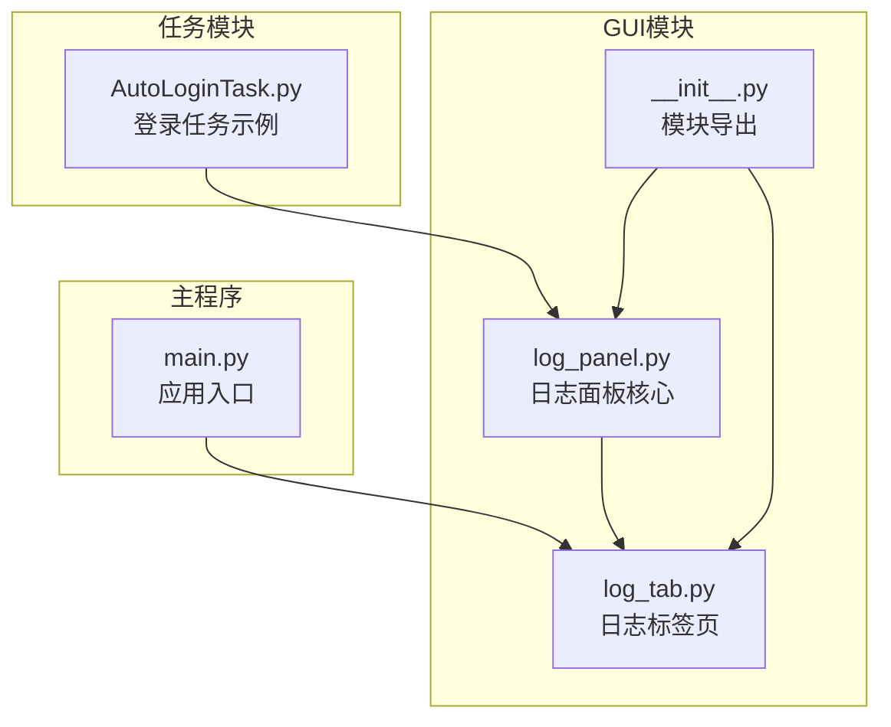
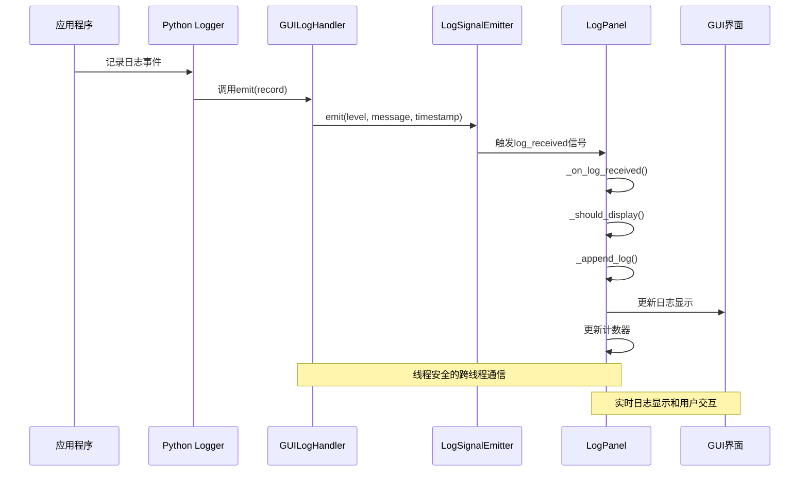
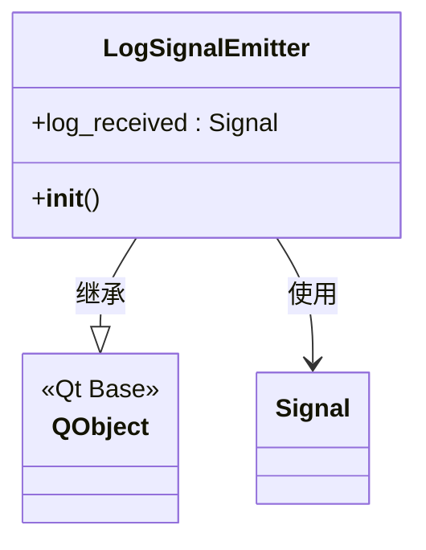
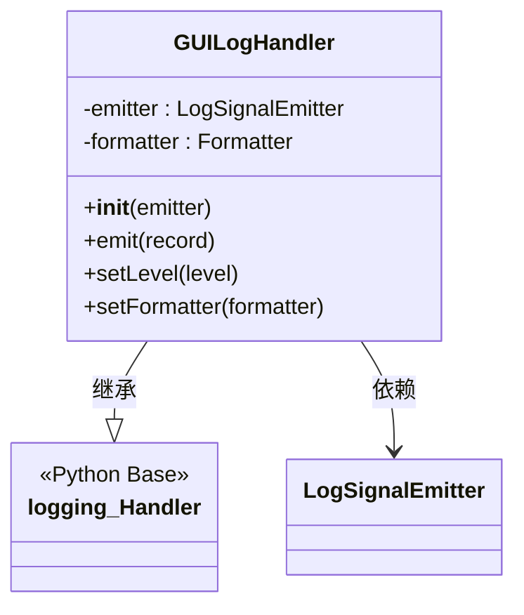
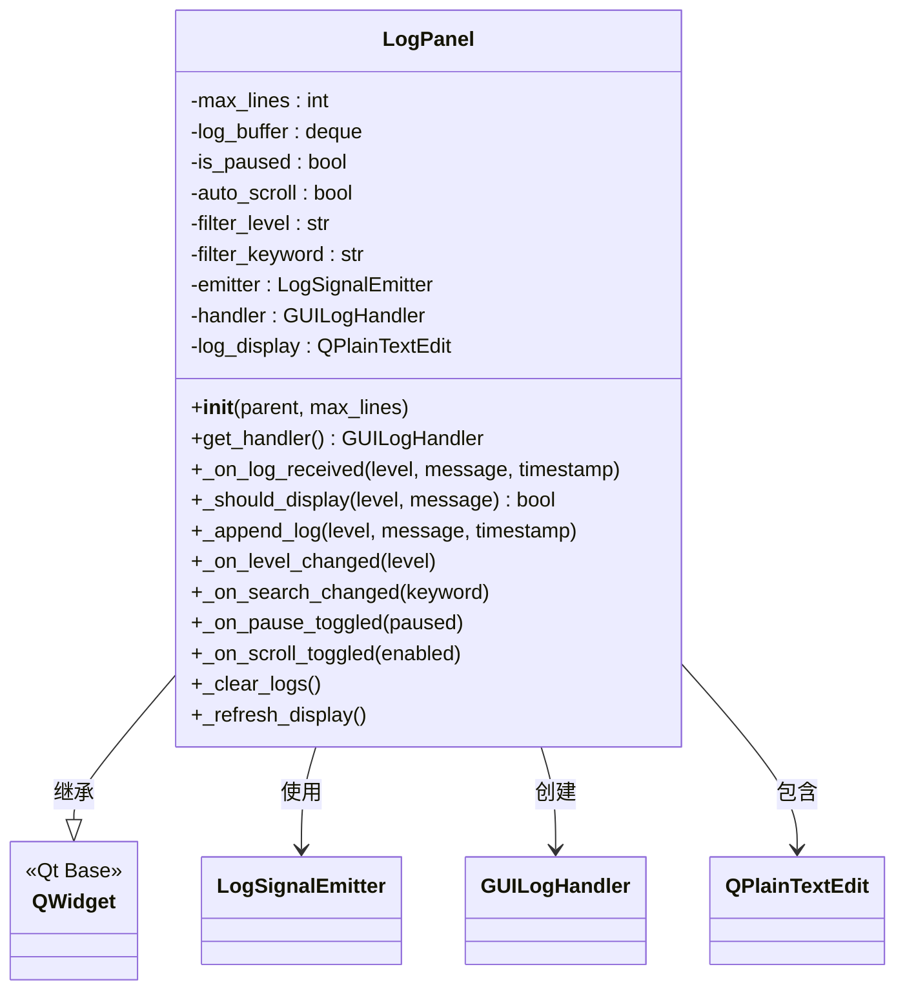
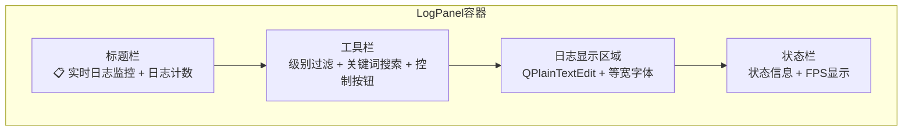
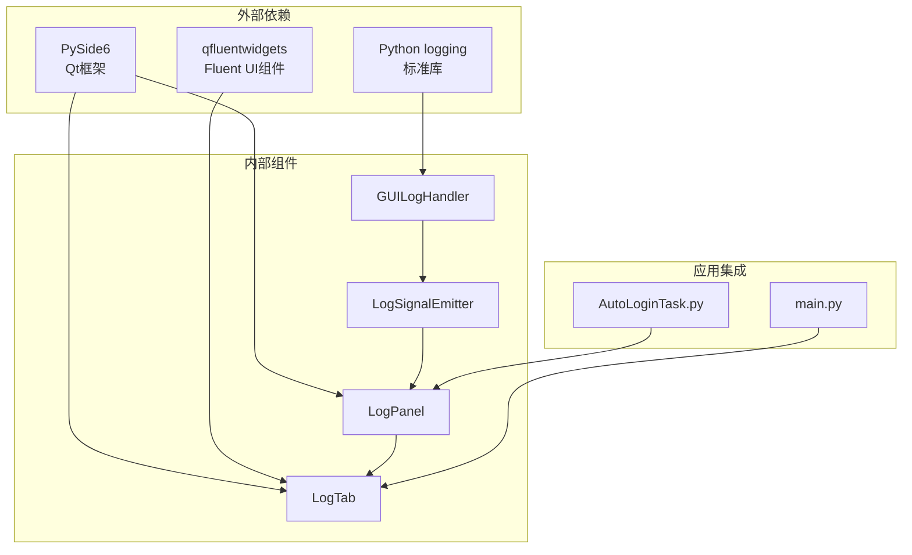

# 日志面板系统

<cite>
**本文档引用的文件**
- [log_panel.py](file://src/gui/log_panel.py)
- [log_tab.py](file://src/gui/log_tab.py)
- [__init__.py](file://src/gui/__init__.py)
- [main.py](file://main.py)
- [AutoLoginTask.py](file://src/task/AutoLoginTask.py)
</cite>

## 目录
1. [简介](#简介)
2. [项目结构](#项目结构)
3. [核心组件](#核心组件)
4. [架构概览](#架构概览)
5. [详细组件分析](#详细组件分析)
6. [依赖分析](#依赖分析)
7. [性能考虑](#性能考虑)
8. [故障排除指南](#故障排除指南)
9. [结论](#结论)
10. [附录](#附录)

## 简介
ok-jump 项目的日志面板系统是一个完整的实时日志监控解决方案，提供了直观的图形界面来展示应用程序的运行日志。该系统集成了 Python 标准库的 logging 模块，实现了线程安全的日志传递机制，并提供了丰富的过滤和显示功能。

该系统的核心价值在于：
- **实时监控**：提供即时的日志显示能力
- **多级过滤**：支持按日志级别和关键词进行过滤
- **线程安全**：通过信号机制确保跨线程日志传递的安全性
- **用户友好**：提供暂停/恢复、自动滚动、清空等便捷功能
- **高度定制**：支持颜色编码、特殊标记、等宽字体等视觉增强

## 项目结构
日志面板系统主要位于 `src/gui/` 目录下，包含以下关键文件：



**图表来源**
- [log_panel.py:1-388](file://src/gui/log_panel.py#L1-L388)
- [log_tab.py:1-70](file://src/gui/log_tab.py#L1-L70)
- [__init__.py:1-8](file://src/gui/__init__.py#L1-L8)

**章节来源**
- [log_panel.py:1-388](file://src/gui/log_panel.py#L1-L388)
- [log_tab.py:1-70](file://src/gui/log_tab.py#L1-L70)
- [__init__.py:1-8](file://src/gui/__init__.py#L1-L8)

## 核心组件
日志面板系统由三个核心组件构成，每个组件都有明确的职责分工：

### LogSignalEmitter - 信号发射器
负责提供线程安全的日志传递机制，通过 Qt 的信号槽系统实现跨线程通信。

### GUILogHandler - GUI日志处理器
继承自 Python logging.Handler，专门用于将日志事件转换为 GUI 可显示的格式。

### LogPanel - 日志面板
主界面组件，负责日志的显示、过滤、格式化和用户交互。

**章节来源**
- [log_panel.py:29-56](file://src/gui/log_panel.py#L29-L56)
- [log_panel.py:34-56](file://src/gui/log_panel.py#L34-L56)
- [log_panel.py:58-387](file://src/gui/log_panel.py#L58-L387)

## 架构概览
日志面板系统采用分层架构设计，实现了清晰的关注点分离：



**图表来源**
- [log_panel.py:49-55](file://src/gui/log_panel.py#L49-L55)
- [log_panel.py:110](file://src/gui/log_panel.py#L110)
- [log_panel.py:252-270](file://src/gui/log_panel.py#L252-L270)

系统的关键特性包括：

1. **线程安全**：通过 Qt 信号槽机制确保日志事件在主线程中处理
2. **实时性**：日志事件几乎无延迟地显示在界面上
3. **可扩展性**：支持多种日志级别和自定义过滤规则
4. **用户友好**：提供丰富的交互功能和视觉反馈

## 详细组件分析

### LogSignalEmitter - 线程安全信号发射器

LogSignalEmitter 是整个日志系统线程安全机制的核心组件：



**图表来源**
- [log_panel.py:29-31](file://src/gui/log_panel.py#L29-L31)

#### 设计特点
- **单一职责**：专门负责日志信号的发射
- **轻量级**：最小化的实现，避免额外的复杂性
- **线程安全**：Qt 信号槽天然支持跨线程调用

#### 线程安全机制
GUILogHandler 通过以下方式实现线程安全：
1. 接收来自任意线程的日志记录
2. 使用 Qt 信号机制将数据传递到主线程
3. 在主线程中执行日志显示逻辑
4. 避免了直接的跨线程 UI 操作

**章节来源**
- [log_panel.py:29-31](file://src/gui/log_panel.py#L29-L31)
- [log_panel.py:49-55](file://src/gui/log_panel.py#L49-L55)

### GUILogHandler - GUI日志处理器

GUILogHandler 是连接 Python logging 系统和 GUI 显示层的关键桥梁：



**图表来源**
- [log_panel.py:34-56](file://src/gui/log_panel.py#L34-L56)

#### 处理流程
1. **接收记录**：从 Python logging 系统接收日志记录
2. **格式化消息**：提取原始消息内容
3. **时间戳处理**：转换 Unix 时间戳为本地时间格式
4. **信号发射**：通过 LogSignalEmitter 发送格式化后的数据
5. **异常处理**：在处理过程中捕获并处理异常

#### 关键实现细节
- **消息格式**：使用简洁的消息格式，去除冗余的格式化信息
- **时间戳精度**：保留毫秒精度，便于精确的时间追踪
- **异常安全**：即使在处理过程中发生异常，也不会影响原始日志系统的正常运行

**章节来源**
- [log_panel.py:34-56](file://src/gui/log_panel.py#L34-L56)

### LogPanel - 日志面板核心

LogPanel 是整个日志系统的核心界面组件，提供了完整的日志显示和交互功能：



**图表来源**
- [log_panel.py:58-387](file://src/gui/log_panel.py#L58-L387)

#### 界面布局设计

LogPanel 采用了清晰的三层布局结构：



**图表来源**
- [log_panel.py:115-235](file://src/gui/log_panel.py#L115-L235)

#### 功能特性详解

##### 实时日志监控
- **缓冲区管理**：使用双端队列实现固定大小的环形缓冲区
- **实时显示**：新日志到达时立即显示，无需手动刷新
- **性能优化**：通过缓冲区限制避免内存无限增长

##### 级别过滤系统
支持五种标准日志级别，按严重程度递增：
- DEBUG：调试信息
- INFO：一般信息
- WARNING：警告信息
- ERROR：错误信息
- CRITICAL：严重错误

过滤算法确保只有达到或超过当前级别阈值的日志才会显示。

##### 关键词搜索
- **实时过滤**：输入关键词时立即应用过滤
- **大小写不敏感**：提高搜索的便利性
- **全文匹配**：在完整日志消息中查找关键词

##### 自动滚动机制
- **智能滚动**：当新日志到达时自动滚动到底部
- **用户控制**：用户可以禁用自动滚动以便查看历史
- **性能平衡**：避免频繁的滚动操作影响性能

##### 暂停/恢复功能
- **状态指示**：通过状态栏颜色和图标显示当前状态
- **无数据丢失**：暂停期间日志仍然被缓冲区保存
- **快速恢复**：恢复后自动显示所有缓冲的日志

##### 清空功能
- **即时清空**：清空当前显示的所有日志
- **缓冲区同步**：同时清空内部缓冲区
- **计数器重置**：更新日志计数显示

**章节来源**
- [log_panel.py:58-387](file://src/gui/log_panel.py#L58-L387)

### 日志级别颜色编码系统

系统实现了完整的颜色编码体系，帮助用户快速识别日志的重要性和类型：

| 日志级别 | 颜色代码 | 颜色描述 | 用途 |
|---------|----------|----------|------|
| DEBUG | #808080 | 灰色 | 调试信息，最低优先级 |
| INFO | #00AA00 | 绿色 | 一般信息，正常操作反馈 |
| WARNING | #FFA500 | 橙色 | 警告信息，需要注意的情况 |
| ERROR | #FF0000 | 红色 | 错误信息，操作失败 |
| CRITICAL | #FF00FF | 紫色 | 严重错误，系统级问题 |

#### 特殊标记可视化效果

除了标准日志级别外，系统还支持特殊标记的颜色编码：

| 标记符号 | 颜色代码 | 颜色描述 | 语义含义 |
|---------|----------|----------|----------|
| 🔍 | #4A90D9 | 蓝色 | 检测开始，分析过程 |
| ✅ | #00AA00 | 绿色 | 成功，操作完成 |
| ❌ | #FF0000 | 红色 | 失败，操作失败 |
| 💀 | #8B0000 | 深红 | 死亡，角色状态 |
| ⚔️ | #FF6600 | 橙色 | 战斗，战斗相关 |
| 👤 | #4169E1 | 皇家蓝 | 自己，玩家角色 |
| 🟢 | #32CD32 | 绿色 | 友方，友方单位 |
| 🔴 | #DC143C | 红色 | 敌军，敌方单位 |
| 📊 | #9370DB | 紫色 | 统计，统计数据 |
| 📷 | #20B2AA | 青色 | 帧信息，图像处理 |
| ⚠️ | #FFD700 | 金色 | 警告，重要提醒 |

**章节来源**
- [log_panel.py:71-93](file://src/gui/log_panel.py#L71-L93)

### 等宽字体使用策略

为了确保日志的可读性和对齐性，系统采用了等宽字体：

- **首选字体**：Consolas，现代 Windows 系统的标准等宽字体
- **备用字体**：Courier New，广泛兼容的等宽字体
- **字体大小**：9pt，提供良好的可读性
- **字体匹配**：自动检测字体可用性，确保跨平台兼容

等宽字体的选择确保了日志条目的对齐，使得时间戳、日志级别和消息内容能够整齐排列。

**章节来源**
- [log_panel.py:213-217](file://src/gui/log_panel.py#L213-L217)

## 依赖分析

日志面板系统与其他组件的依赖关系如下：



**图表来源**
- [log_panel.py:7-16](file://src/gui/log_panel.py#L7-L16)
- [log_tab.py:9-12](file://src/gui/log_tab.py#L9-L12)

### 关键依赖关系

1. **Qt框架依赖**：LogPanel 作为 QWidget 的子类，依赖于完整的 Qt 框架
2. **Python logging集成**：GUILogHandler 继承自 logging.Handler，无缝集成现有日志系统
3. **可选Fluent UI支持**：当 qfluentwidgets 可用时，提供更美观的界面元素
4. **全局实例管理**：通过全局函数提供单例模式的日志面板访问

**章节来源**
- [log_panel.py:7-26](file://src/gui/log_panel.py#L7-L26)
- [log_tab.py:9-12](file://src/gui/log_tab.py#L9-L12)

## 性能考虑

日志面板系统在设计时充分考虑了性能优化：

### 内存管理
- **环形缓冲区**：使用 `collections.deque` 实现固定大小的缓冲区
- **内存限制**：通过 `maxlen` 参数限制最大日志数量
- **自动清理**：超出容量时自动移除最旧的日志

### UI性能优化
- **批量更新**：避免频繁的 UI 刷新操作
- **延迟计算**：过滤逻辑在需要时才执行
- **智能滚动**：仅在必要时调整滚动位置

### 线程安全开销
- **信号槽机制**：Qt 的信号槽系统经过高度优化
- **最小化数据传输**：仅传输必要的日志信息
- **异常隔离**：处理异常不影响主线程性能

## 故障排除指南

### 常见问题及解决方案

#### 日志不显示问题
**症状**：启动后没有任何日志显示
**可能原因**：
1. 日志级别设置过高
2. 关键词过滤过于严格
3. 日志处理器未正确注册

**解决步骤**：
1. 检查日志级别过滤器是否设置为 DEBUG
2. 清空关键词过滤框
3. 确认日志处理器已添加到 logger

#### 性能问题
**症状**：界面响应缓慢或内存占用过高
**可能原因**：
1. 日志量过大
2. 自动滚动导致频繁重绘
3. 过多的特殊标记

**优化建议**：
1. 调整 `max_lines` 参数
2. 暂停自动滚动功能
3. 减少特殊标记的使用

#### 线程安全问题
**症状**：应用程序崩溃或异常
**可能原因**：
1. 直接在非主线程中操作 UI
2. 处理器注册不当

**预防措施**：
1. 使用 `setup_log_panel_handler()` 函数
2. 避免在日志处理函数中进行复杂的 UI 操作
3. 确保只在主线程中创建 UI 组件

**章节来源**
- [log_panel.py:366-387](file://src/gui/log_panel.py#L366-L387)

## 结论

ok-jump 项目的日志面板系统是一个设计精良、功能完备的日志监控解决方案。它成功地解决了以下关键挑战：

1. **线程安全**：通过 Qt 信号槽机制实现了可靠的跨线程通信
2. **用户体验**：提供了直观易用的界面和丰富的交互功能
3. **性能优化**：通过缓冲区管理和智能过滤确保了良好的性能表现
4. **可扩展性**：模块化设计支持功能扩展和定制化需求

该系统不仅满足了当前项目的需求，也为未来的功能扩展奠定了坚实的基础。其清晰的架构设计和完善的错误处理机制使其成为生产环境中可靠的选择。

## 附录

### 使用示例

#### 基本集成方法
```python
# 在应用程序启动时注册日志处理器
from src.gui.log_panel import setup_log_panel_handler
setup_log_panel_handler()

# 在任务中使用日志
logger = logging.getLogger(__name__)
logger.info("任务开始执行")
logger.error("发生错误")
```

#### 自定义配置
```python
# 创建自定义日志面板实例
from src.gui.log_panel import LogPanel
panel = LogPanel(max_lines=5000)

# 设置自定义过滤器
panel.filter_level = 'WARNING'
panel.filter_keyword = 'ERROR'
```

#### 高级定制
- **颜色主题**：修改 `LEVEL_COLORS` 和 `MARKER_COLORS` 字典
- **界面样式**：调整 `QPlainTextEdit` 的样式表
- **字体设置**：修改等宽字体和大小
- **缓冲区大小**：通过构造函数参数调整 `max_lines`

**章节来源**
- [log_panel.py:366-387](file://src/gui/log_panel.py#L366-L387)
- [log_tab.py:47-66](file://src/gui/log_tab.py#L47-L66)