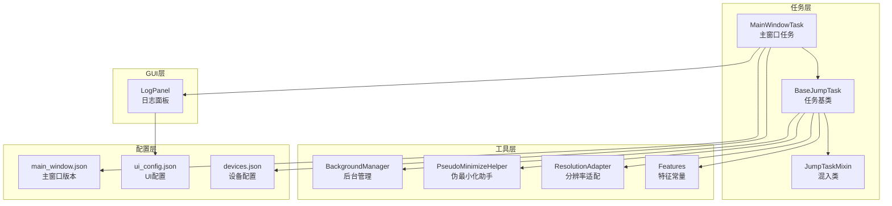
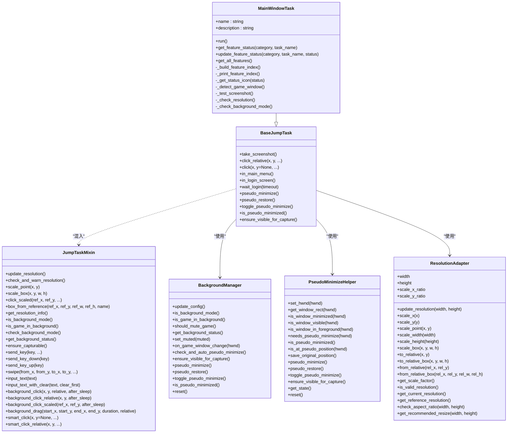
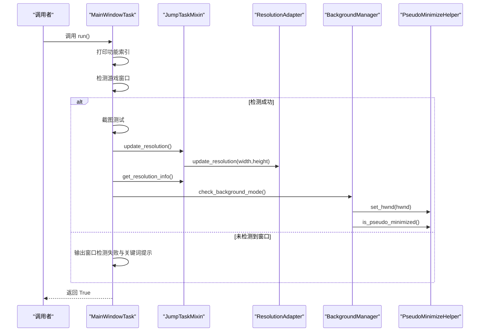
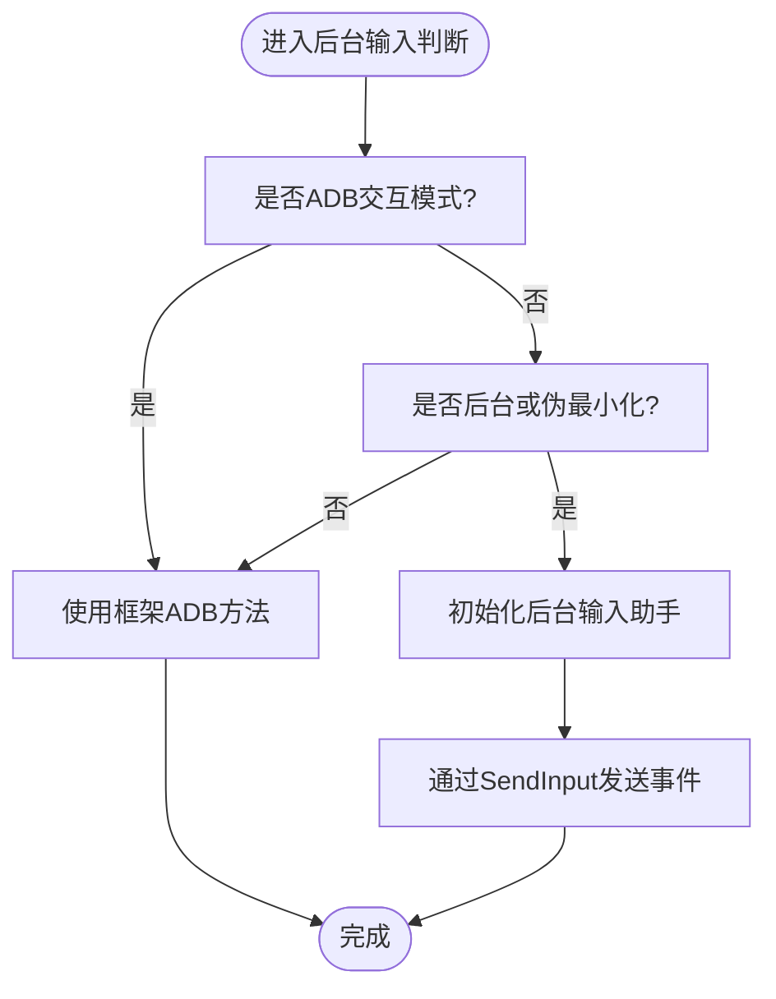
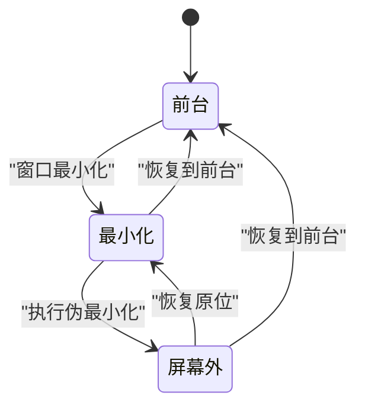
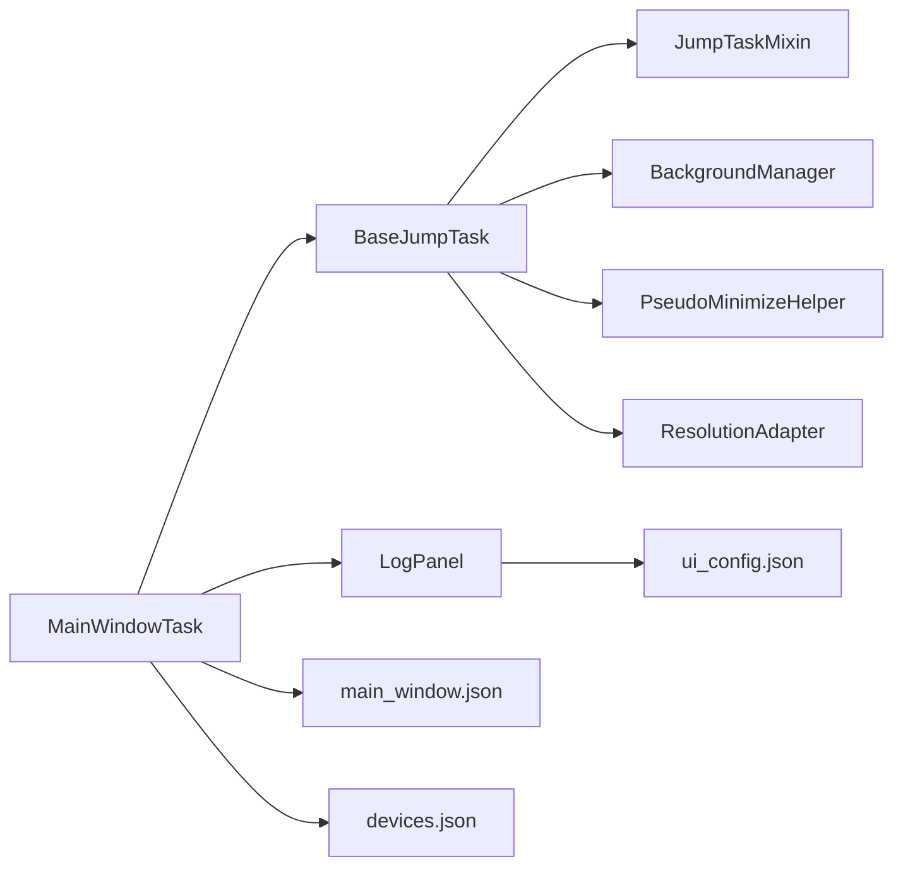

# 主窗口任务

<cite>
**本文档引用的文件**
- [src/task/MainWindowTask.py](file://src/task/MainWindowTask.py)
- [src/task/BaseJumpTask.py](file://src/task/BaseJumpTask.py)
- [src/task/mixins.py](file://src/task/mixins.py)
- [src/utils/BackgroundManager.py](file://src/utils/BackgroundManager.py)
- [src/utils/PseudoMinimizeHelper.py](file://src/utils/PseudoMinimizeHelper.py)
- [src/utils/ResolutionAdapter.py](file://src/utils/ResolutionAdapter.py)
- [src/constants/features.py](file://src/constants/features.py)
- [src/gui/log_panel.py](file://src/gui/log_panel.py)
- [configs/main_window.json](file://configs/main_window.json)
- [configs/ui_config.json](file://configs/ui_config.json)
- [configs/devices.json](file://configs/devices.json)
- [main.py](file://main.py)
- [main_debug.py](file://main_debug.py)
</cite>

## 目录
1. [简介](#简介)
2. [项目结构](#项目结构)
3. [核心组件](#核心组件)
4. [架构总览](#架构总览)
5. [详细组件分析](#详细组件分析)
6. [依赖关系分析](#依赖关系分析)
7. [性能考虑](#性能考虑)
8. [故障排查指南](#故障排查指南)
9. [结论](#结论)
10. [附录](#附录)

## 简介
本文件面向OK-Jump项目的“主窗口任务”设计与实现，围绕MainWindowTask类展开，系统性阐述其设计理念、架构组织、窗口检测与截图、分辨率自适应、后台模式与伪最小化、日志与UI集成、以及扩展与插件化集成路径。文档同时提供可视化图示、关键流程时序图与状态图，帮助开发者快速理解并高效扩展。

## 项目结构
OK-Jump采用分层与职责分离的组织方式：
- 任务层：以BaseJumpTask为基类，MainWindowTask作为顶层引导任务，其他具体任务（如AutoLoginTask、AutoMatchTask、AutoCombatTask等）按功能模块划分。
- 工具层：提供后台管理、伪最小化、分辨率适配、输入辅助等通用能力。
- GUI层：提供日志面板与工具栏控件，支持级别过滤、关键词搜索、暂停/恢复、自动滚动与清空。
- 配置层：集中管理主窗口版本、UI主题与DPI、设备选择偏好等。

**图表来源**
- [src/task/MainWindowTask.py:1-215](file://src/task/MainWindowTask.py#L1-L215)
- [src/task/BaseJumpTask.py:1-200](file://src/task/BaseJumpTask.py#L1-L200)
- [src/task/mixins.py:1-774](file://src/task/mixins.py#L1-L774)
- [src/utils/BackgroundManager.py:1-155](file://src/utils/BackgroundManager.py#L1-L155)
- [src/utils/PseudoMinimizeHelper.py:1-238](file://src/utils/PseudoMinimizeHelper.py#L1-L238)
- [src/utils/ResolutionAdapter.py:1-163](file://src/utils/ResolutionAdapter.py#L1-L163)
- [src/constants/features.py:1-86](file://src/constants/features.py#L1-L86)
- [src/gui/log_panel.py:1-200](file://src/gui/log_panel.py#L1-L200)
- [configs/main_window.json:1-3](file://configs/main_window.json#L1-L3)
- [configs/ui_config.json:1-17](file://configs/ui_config.json#L1-L17)
- [configs/devices.json:1-7](file://configs/devices.json#L1-L7)

**章节来源**
- [src/task/MainWindowTask.py:1-215](file://src/task/MainWindowTask.py#L1-L215)
- [configs/main_window.json:1-3](file://configs/main_window.json#L1-L3)
- [configs/ui_config.json:1-17](file://configs/ui_config.json#L1-L17)
- [configs/devices.json:1-7](file://configs/devices.json#L1-L7)

## 核心组件
- MainWindowTask：负责主窗口功能索引展示、窗口检测、截图测试、分辨率校验、后台模式与伪最小化状态检查，并输出后续功能开发指引。
- BaseJumpTask：任务基类，提供截图、智能点击、场景检测、登录等待、后台模式与伪最小化支持等通用能力。
- JumpTaskMixin：混入类，封装分辨率适配、后台模式、后台输入、智能点击等共享逻辑，避免重复。
- BackgroundManager：后台模式状态管理与配置读取，检测前台窗口、静音策略、伪最小化开关与自动伪最小化。
- PseudoMinimizeHelper：窗口伪最小化/恢复、位置保存与还原、前台检测、可见性保障。
- ResolutionAdapter：基于参考分辨率的缩放与相对坐标转换、纵横比校验与推荐分辨率。
- Features：统一管理coco检测特征名称常量。
- LogPanel：GUI日志面板，支持级别过滤、关键词搜索、暂停/恢复、自动滚动与清空。

**章节来源**
- [src/task/MainWindowTask.py:5-215](file://src/task/MainWindowTask.py#L5-L215)
- [src/task/BaseJumpTask.py:14-421](file://src/task/BaseJumpTask.py#L14-L421)
- [src/task/mixins.py:15-774](file://src/task/mixins.py#L15-L774)
- [src/utils/BackgroundManager.py:7-155](file://src/utils/BackgroundManager.py#L7-L155)
- [src/utils/PseudoMinimizeHelper.py:13-238](file://src/utils/PseudoMinimizeHelper.py#L13-L238)
- [src/utils/ResolutionAdapter.py:4-163](file://src/utils/ResolutionAdapter.py#L4-L163)
- [src/constants/features.py:9-86](file://src/constants/features.py#L9-L86)
- [src/gui/log_panel.py:58-200](file://src/gui/log_panel.py#L58-L200)

## 架构总览
MainWindowTask继承BaseJumpTask并通过JumpTaskMixin获得通用能力；其运行时流程围绕“窗口检测—截图测试—分辨率校验—后台模式检查—功能索引输出”展开。后台模式与伪最小化通过BackgroundManager与PseudoMinimizeHelper协作，确保在窗口最小化或被遮挡时仍可截图与输入。

**图表来源**
- [src/task/MainWindowTask.py:5-215](file://src/task/MainWindowTask.py#L5-L215)
- [src/task/BaseJumpTask.py:14-421](file://src/task/BaseJumpTask.py#L14-L421)
- [src/task/mixins.py:15-774](file://src/task/mixins.py#L15-L774)
- [src/utils/BackgroundManager.py:7-155](file://src/utils/BackgroundManager.py#L7-L155)
- [src/utils/PseudoMinimizeHelper.py:13-238](file://src/utils/PseudoMinimizeHelper.py#L13-L238)
- [src/utils/ResolutionAdapter.py:4-163](file://src/utils/ResolutionAdapter.py#L4-L163)

## 详细组件分析

### MainWindowTask：主窗口任务
- 设计理念
  - 作为顶层引导任务，提供功能开发索引与环境自检，帮助开发者快速定位当前可用能力与未来规划。
  - 通过统一的窗口检测、截图测试、分辨率校验与后台模式检查，形成稳定的前置条件保障。
- 生命周期与运行流程
  - 初始化：构建功能索引字典，准备日志输出。
  - 运行：打印功能索引；检测游戏窗口；截图测试；分辨率校验；后台模式检查；输出后续开发指引。
- 关键方法
  - run：主流程调度，串联检测与校验步骤。
  - _build_feature_index/_print_feature_index：生成并打印功能分类与状态。
  - _detect_game_window/_test_screenshot：窗口截图验证。
  - _check_resolution：分辨率与纵横比校验及建议。
  - _check_background_mode：后台模式、伪最小化与静音策略状态输出。
  - get_feature_status/update_feature_status/get_all_features：功能状态查询与更新接口。

**图表来源**
- [src/task/MainWindowTask.py:55-80](file://src/task/MainWindowTask.py#L55-L80)
- [src/task/mixins.py:104-121](file://src/task/mixins.py#L104-L121)
- [src/utils/ResolutionAdapter.py:34-44](file://src/utils/ResolutionAdapter.py#L34-L44)
- [src/utils/BackgroundManager.py:25-41](file://src/utils/BackgroundManager.py#L25-L41)
- [src/utils/PseudoMinimizeHelper.py:21-26](file://src/utils/PseudoMinimizeHelper.py#L21-L26)

**章节来源**
- [src/task/MainWindowTask.py:49-215](file://src/task/MainWindowTask.py#L49-L215)

### BaseJumpTask与JumpTaskMixin：通用能力
- 截图与点击
  - 提供take_screenshot、click_relative、click等方法；在后台/伪最小化时自动切换为SendInput输入。
- 场景检测
  - in_main_menu、in_login_screen等基于特征常量的场景识别。
- 登录等待
  - wait_login循环检测登录完成状态，处理登录按钮点击。
- 后台模式与伪最小化
  - is_background_mode、is_game_in_background、check_background_mode、get_background_status。
  - ensure_capturable在窗口最小化时执行伪最小化以支持后台截图。
- 分辨率适配
  - update_resolution、scale_point/scale_box、get_resolution_info等。
- 文本输入与键盘事件
  - send_key/send_key_down/send_key_up、swipe、input_text/input_text_with_clear等。

**图表来源**
- [src/task/mixins.py:381-424](file://src/task/mixins.py#L381-L424)
- [src/task/mixins.py:425-538](file://src/task/mixins.py#L425-L538)
- [src/task/mixins.py:632-694](file://src/task/mixins.py#L632-L694)

**章节来源**
- [src/task/BaseJumpTask.py:14-421](file://src/task/BaseJumpTask.py#L14-L421)
- [src/task/mixins.py:15-774](file://src/task/mixins.py#L15-L774)

### 后台模式与伪最小化：BackgroundManager与PseudoMinimizeHelper
- BackgroundManager
  - 读取基本设置配置，判断后台模式与静音策略；检测前台窗口；维护伪最小化状态；提供自动伪最小化与可见性保障。
- PseudoMinimizeHelper
  - 窗口句柄设置、矩形获取、最小化/可见性/前台检测；伪最小化/恢复；位置保存与还原；状态查询与重置。

**图表来源**
- [src/utils/BackgroundManager.py:101-121](file://src/utils/BackgroundManager.py#L101-L121)
- [src/utils/PseudoMinimizeHelper.py:123-194](file://src/utils/PseudoMinimizeHelper.py#L123-L194)

**章节来源**
- [src/utils/BackgroundManager.py:7-155](file://src/utils/BackgroundManager.py#L7-L155)
- [src/utils/PseudoMinimizeHelper.py:13-238](file://src/utils/PseudoMinimizeHelper.py#L13-L238)

### 分辨率适配：ResolutionAdapter
- 功能要点
  - 基于参考分辨率1920x1080与16:9标准，动态计算缩放因子；提供相对/绝对坐标互转；校验纵横比并给出推荐分辨率。
- 使用场景
  - 在MainWindowTask中用于打印分辨率信息与比例校验；在任务中用于点击与区域定位的坐标缩放。

**章节来源**
- [src/utils/ResolutionAdapter.py:4-163](file://src/utils/ResolutionAdapter.py#L4-L163)

### GUI日志面板：LogPanel
- 功能特性
  - 实时日志显示、级别过滤（DEBUG/INFO/WARNING/ERROR）、关键词搜索、暂停/恢复、自动滚动、清空日志。
  - 支持QFluentWidgets或标准PySide6控件。
- 集成方式
  - 通过GUILogHandler与LogSignalEmitter实现线程安全日志传递与渲染。

**章节来源**
- [src/gui/log_panel.py:58-200](file://src/gui/log_panel.py#L58-L200)

## 依赖关系分析
- 组件耦合
  - MainWindowTask依赖BaseJumpTask与JumpTaskMixin提供的通用能力；通过ResolutionAdapter进行分辨率适配；通过BackgroundManager与PseudoMinimizeHelper实现后台模式与伪最小化。
- 外部依赖
  - Windows API（ctypes、win32gui/win32con等）用于窗口句柄与伪最小化；SendInput用于后台输入；OK框架与设备管理器提供窗口句柄与交互。
- 配置依赖
  - 基本设置（后台模式、最小化时伪最小化、后台时静音游戏等）来自OK配置；设备选择偏好来自devices.json；UI主题与DPI来自ui_config.json。

**图表来源**
- [src/task/MainWindowTask.py:5-215](file://src/task/MainWindowTask.py#L5-L215)
- [src/task/BaseJumpTask.py:14-421](file://src/task/BaseJumpTask.py#L14-L421)
- [src/task/mixins.py:15-774](file://src/task/mixins.py#L15-L774)
- [src/utils/BackgroundManager.py:7-155](file://src/utils/BackgroundManager.py#L7-L155)
- [src/utils/PseudoMinimizeHelper.py:13-238](file://src/utils/PseudoMinimizeHelper.py#L13-L238)
- [src/utils/ResolutionAdapter.py:4-163](file://src/utils/ResolutionAdapter.py#L4-L163)
- [src/gui/log_panel.py:58-200](file://src/gui/log_panel.py#L58-L200)
- [configs/main_window.json:1-3](file://configs/main_window.json#L1-L3)
- [configs/ui_config.json:1-17](file://configs/ui_config.json#L1-L17)
- [configs/devices.json:1-7](file://configs/devices.json#L1-L7)

**章节来源**
- [src/task/MainWindowTask.py:5-215](file://src/task/MainWindowTask.py#L5-L215)
- [src/task/BaseJumpTask.py:14-421](file://src/task/BaseJumpTask.py#L14-L421)
- [src/task/mixins.py:15-774](file://src/task/mixins.py#L15-L774)
- [src/utils/BackgroundManager.py:7-155](file://src/utils/BackgroundManager.py#L7-L155)
- [src/utils/PseudoMinimizeHelper.py:13-238](file://src/utils/PseudoMinimizeHelper.py#L13-L238)
- [src/utils/ResolutionAdapter.py:4-163](file://src/utils/ResolutionAdapter.py#L4-L163)
- [src/gui/log_panel.py:58-200](file://src/gui/log_panel.py#L58-L200)
- [configs/main_window.json:1-3](file://configs/main_window.json#L1-L3)
- [configs/ui_config.json:1-17](file://configs/ui_config.json#L1-L17)
- [configs/devices.json:1-7](file://configs/devices.json#L1-L7)

## 性能考虑
- 后台模式与伪最小化
  - 仅在窗口最小化时执行伪最小化，避免不必要的窗口移动；合理设置前台检测间隔，减少频繁查询。
- 分辨率适配
  - 避免重复更新分辨率信息，复用ResolutionAdapter的缓存结果；在批量点击/拖拽前统一进行坐标缩放。
- 日志输出
  - GUI日志面板使用缓冲队列与线程安全信号，避免阻塞主线程；在高频日志场景下建议提高级别阈值或启用暂停功能。

[本节为通用指导，无需列出具体文件来源]

## 故障排查指南
- 无法检测到游戏窗口
  - 确认游戏已启动且窗口标题包含“漫画群星”或“Jump”关键词；检查devices.json中的设备选择与PC路径配置。
- 后台模式无效
  - 检查基本设置中的“后台模式”“最小化时伪最小化”“后台时静音游戏”配置项；确认窗口句柄已正确设置。
- 截图失败或坐标错位
  - 校验当前分辨率与参考分辨率的比例；使用_get_resolution_info输出缩放因子；在后台模式下确保已执行伪最小化。
- 日志面板无输出
  - 确认已注册GUILogHandler并连接LogSignalEmitter；检查日志级别过滤与关键词搜索条件。

**章节来源**
- [src/task/MainWindowTask.py:121-193](file://src/task/MainWindowTask.py#L121-L193)
- [src/utils/BackgroundManager.py:25-41](file://src/utils/BackgroundManager.py#L25-L41)
- [src/utils/PseudoMinimizeHelper.py:123-194](file://src/utils/PseudoMinimizeHelper.py#L123-L194)
- [src/gui/log_panel.py:34-56](file://src/gui/log_panel.py#L34-L56)

## 结论
MainWindowTask以“功能索引+环境自检”的方式，为OK-Jump的主窗口与自动化任务提供了清晰的入口与保障。通过BaseJumpTask与JumpTaskMixin的通用能力封装，结合BackgroundManager与PseudoMinimizeHelper的后台模式与伪最小化机制，以及ResolutionAdapter的分辨率适配，系统在多场景（PC/模拟器、前台/后台、最小化/遮挡）下均能稳定运行。GUI日志面板进一步提升了可观测性与调试效率。后续可在MainWindowTask基础上扩展更多功能模块，并通过统一的配置与工具层实现平滑集成。

[本节为总结性内容，无需列出具体文件来源]

## 附录

### 使用示例与配置选项说明
- 启动流程
  - 通过main.py进行智能设备选择与StartController补丁应用，随后初始化OK框架并启动。
  - main_debug.py提供禁用GUI、开启调试的命令行启动方式。
- 配置文件
  - main_window.json：记录主窗口最后版本号。
  - ui_config.json：控制UI主题、DPI缩放、语言、Mica效果等。
  - devices.json：设置首选设备、PC全路径、捕获方式（adb/pc）、选中窗口句柄等。
- MainWindowTask常用方法
  - run：执行主流程。
  - get_feature_status/update_feature_status：查询/更新功能状态。
  - get_all_features：获取全部功能索引。
  - get_resolution_info：获取分辨率信息。
  - get_background_status：获取后台模式状态。
  - ensure_visible_for_capture：确保窗口可见以便截图。
  - smart_click/smart_click_relative：智能点击（前台/后台自动切换）。

**章节来源**
- [main.py:99-107](file://main.py#L99-L107)
- [main_debug.py:6-15](file://main_debug.py#L6-L15)
- [configs/main_window.json:1-3](file://configs/main_window.json#L1-L3)
- [configs/ui_config.json:1-17](file://configs/ui_config.json#L1-L17)
- [configs/devices.json:1-7](file://configs/devices.json#L1-L7)
- [src/task/MainWindowTask.py:55-215](file://src/task/MainWindowTask.py#L55-L215)
- [src/task/mixins.py:296-304](file://src/task/mixins.py#L296-L304)
- [src/task/mixins.py:305-343](file://src/task/mixins.py#L305-L343)
- [src/task/mixins.py:724-774](file://src/task/mixins.py#L724-L774)