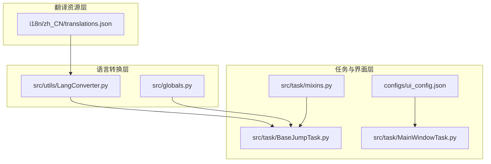
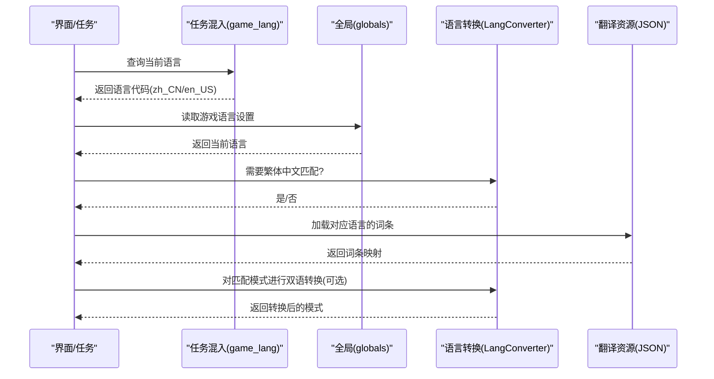
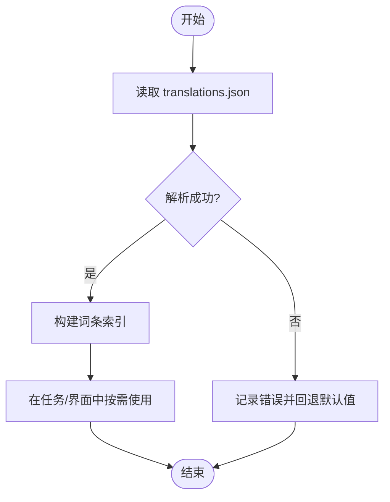
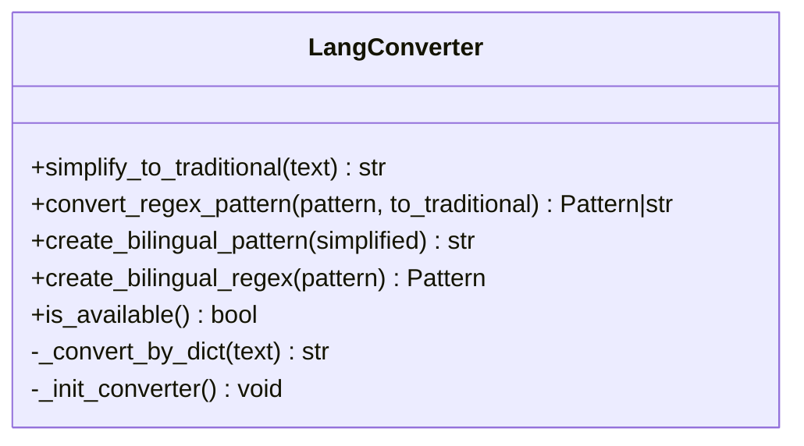
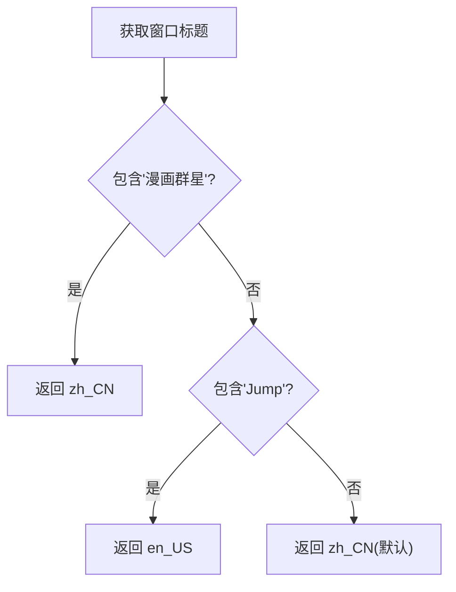
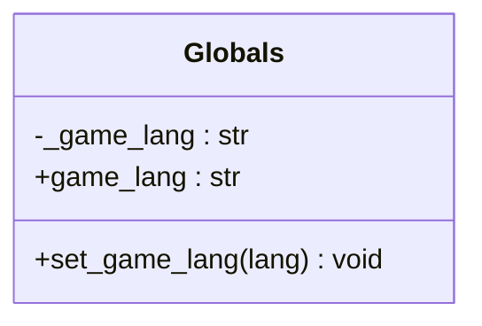
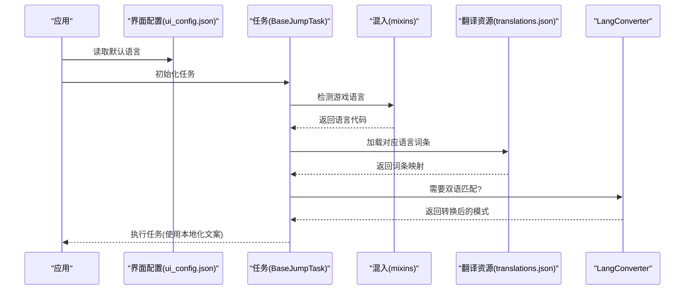
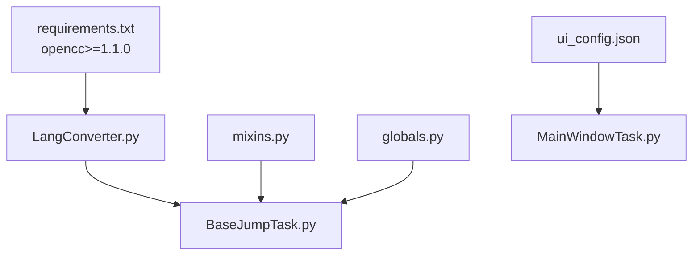

# 国际化支持

<cite>
**本文档引用的文件**
- [translations.json](file://i18n/zh_CN/translations.json)
- [LangConverter.py](file://src/utils/LangConverter.py)
- [BaseJumpTask.py](file://src/task/BaseJumpTask.py)
- [mixins.py](file://src/task/mixins.py)
- [globals.py](file://src/globals.py)
- [ui_config.json](file://configs/ui_config.json)
- [requirements.txt](file://requirements.txt)
- [MainWindowTask.py](file://src/task/MainWindowTask.py)
</cite>

## 目录
1. [简介](#简介)
2. [项目结构](#项目结构)
3. [核心组件](#核心组件)
4. [架构总览](#架构总览)
5. [组件详细分析](#组件详细分析)
6. [依赖关系分析](#依赖关系分析)
7. [性能考量](#性能考量)
8. [故障排除指南](#故障排除指南)
9. [结论](#结论)
10. [附录](#附录)

## 简介
本文件面向 OK-Jump 的国际化支持系统，系统性阐述翻译资源管理、动态语言切换与本地化策略。重点覆盖以下方面：
- translations.json 的结构与词条管理
- 如何添加新语言支持与翻译词条
- 国际化组件的使用方法与最佳实践
- 翻译流程、维护指南与常见问题解决方案

## 项目结构
OK-Jump 的国际化支持主要由三部分组成：
- 翻译资源层：以 JSON 文件形式存储翻译词条，按语言分目录组织
- 语言转换层：提供简繁中文转换与双语匹配能力
- 任务与界面层：在运行时根据游戏语言动态选择对应词条与匹配规则

**图表来源**
- [translations.json:1-75](file://i18n/zh_CN/translations.json#L1-L75)
- [LangConverter.py:1-326](file://src/utils/LangConverter.py#L1-L326)
- [BaseJumpTask.py:1-422](file://src/task/BaseJumpTask.py#L1-L422)
- [mixins.py:39-54](file://src/task/mixins.py#L39-L54)
- [globals.py:116-134](file://src/globals.py#L116-L134)
- [ui_config.json:8-12](file://configs/ui_config.json#L8-L12)
- [MainWindowTask.py:7-47](file://src/task/MainWindowTask.py#L7-L47)

**章节来源**
- [translations.json:1-75](file://i18n/zh_CN/translations.json#L1-L75)
- [LangConverter.py:1-326](file://src/utils/LangConverter.py#L1-L326)
- [BaseJumpTask.py:1-422](file://src/task/BaseJumpTask.py#L1-L422)
- [mixins.py:39-54](file://src/task/mixins.py#L39-L54)
- [globals.py:116-134](file://src/globals.py#L116-L134)
- [ui_config.json:8-12](file://configs/ui_config.json#L8-L12)
- [MainWindowTask.py:7-47](file://src/task/MainWindowTask.py#L7-L47)

## 核心组件
- 翻译资源文件：以 JSON 形式存储词条映射，支持嵌套对象与简单键值对
- 语言转换器：提供简繁中文转换与正则表达式双语匹配
- 任务混入：根据游戏窗口标题动态判定语言版本
- 全局状态：维护游戏语言设置，供各模块查询
- 界面配置：在应用层面指定默认语言

**章节来源**
- [translations.json:1-75](file://i18n/zh_CN/translations.json#L1-L75)
- [LangConverter.py:143-326](file://src/utils/LangConverter.py#L143-L326)
- [mixins.py:39-54](file://src/task/mixins.py#L39-L54)
- [globals.py:116-134](file://src/globals.py#L116-L134)
- [ui_config.json:8-12](file://configs/ui_config.json#L8-L12)

## 架构总览
OK-Jump 的国际化采用“资源文件 + 语言转换 + 动态检测”的组合策略：
- 资源文件：集中管理翻译词条，便于维护与扩展
- 语言转换：针对繁体中文场景，提供简繁互转与双语正则匹配
- 动态检测：通过窗口标题识别语言版本，决定是否启用双语匹配
- 全局状态：统一维护语言设置，避免硬编码

**图表来源**
- [mixins.py:39-54](file://src/task/mixins.py#L39-L54)
- [globals.py:116-134](file://src/globals.py#L116-L134)
- [LangConverter.py:288-326](file://src/utils/LangConverter.py#L288-L326)
- [translations.json:1-75](file://i18n/zh_CN/translations.json#L1-L75)

## 组件详细分析

### 翻译资源管理（translations.json）
- 结构说明
  - 支持两类条目：嵌套对象（含 name/description 等字段）与简单字符串键值
  - 示例：模块名称与描述、功能分类名称、具体功能项名称等
- 维护要点
  - 新增词条时保持键名唯一，避免覆盖
  - 嵌套对象需保证 name 字段存在，便于统一渲染
  - 保持与任务/界面命名一致，减少映射歧义

**图表来源**
- [translations.json:1-75](file://i18n/zh_CN/translations.json#L1-L75)

**章节来源**
- [translations.json:1-75](file://i18n/zh_CN/translations.json#L1-L75)

### 语言转换与双语匹配（LangConverter）
- 功能概述
  - 提供简体到繁体的转换能力，优先使用 OpenCC，降级使用内置字典
  - 支持字符串与正则表达式的双语模式生成，用于 OCR 文本匹配
- 关键方法
  - 简繁转换：字符串与正则模式转换
  - 双语模式：将“简体|繁体”合并为 OR 条件
  - 可用性检测：判断 OpenCC 是否可用
- 使用场景
  - 在繁体中文环境下，将匹配模式转换为双语，提升识别鲁棒性

**图表来源**
- [LangConverter.py:143-326](file://src/utils/LangConverter.py#L143-L326)

**章节来源**
- [LangConverter.py:143-326](file://src/utils/LangConverter.py#L143-L326)

### 动态语言检测（任务混入）
- 语言检测逻辑
  - 通过窗口标题关键字判断语言版本：中文包含“漫画群星”，英文包含“Jump”
  - 默认返回中文，确保在无法识别时有安全回退
- 与任务的结合
  - BaseJumpTask 在需要时调用该属性，配合 LangConverter 实现双语匹配

**图表来源**
- [mixins.py:39-54](file://src/task/mixins.py#L39-L54)

**章节来源**
- [mixins.py:39-54](file://src/task/mixins.py#L39-L54)

### 全局语言状态（Globals）
- 作用
  - 统一维护游戏语言设置，提供读写接口
  - 作为跨模块共享的状态，避免重复检测
- 接口
  - game_lang 属性：获取当前语言
  - set_game_lang：设置语言（如从界面配置或外部输入）

**图表来源**
- [globals.py:116-134](file://src/globals.py#L116-L134)

**章节来源**
- [globals.py:116-134](file://src/globals.py#L116-L134)

### 翻译流程与使用方法
- 流程概览
  - 读取界面配置中的默认语言
  - 任务启动时检测游戏语言
  - 加载对应语言的翻译资源
  - 在 OCR/匹配阶段按需进行双语转换
- 最佳实践
  - 优先使用翻译资源文件管理文案，避免硬编码
  - 在繁体中文环境下启用双语匹配，提升识别稳定性
  - 通过全局状态统一语言设置，减少重复检测

**图表来源**
- [ui_config.json:8-12](file://configs/ui_config.json#L8-L12)
- [mixins.py:39-54](file://src/task/mixins.py#L39-L54)
- [translations.json:1-75](file://i18n/zh_CN/translations.json#L1-L75)
- [LangConverter.py:288-326](file://src/utils/LangConverter.py#L288-L326)

**章节来源**
- [ui_config.json:8-12](file://configs/ui_config.json#L8-L12)
- [mixins.py:39-54](file://src/task/mixins.py#L39-L54)
- [translations.json:1-75](file://i18n/zh_CN/translations.json#L1-L75)
- [LangConverter.py:288-326](file://src/utils/LangConverter.py#L288-L326)

### 添加新语言支持与翻译词条
- 新增语言支持步骤
  - 在 i18n 目录下创建新语言目录（如 en_US），复制 translations.json 并翻译其中的值
  - 在界面配置 ui_config.json 中设置 Language 为新语言代码
  - 在任务中根据需要扩展语言检测逻辑（如新增窗口标题关键字）
- 新增翻译词条步骤
  - 在对应语言的 translations.json 中添加新键值
  - 若为嵌套对象，确保包含 name 字段；若为简单字符串，直接添加键值对
  - 在任务/界面中按需引用新词条
- 注意事项
  - 保持键名一致性，避免重复与冲突
  - 在繁体中文场景下，确保匹配模式具备双语能力

**章节来源**
- [translations.json:1-75](file://i18n/zh_CN/translations.json#L1-L75)
- [ui_config.json:8-12](file://configs/ui_config.json#L8-L12)
- [mixins.py:39-54](file://src/task/mixins.py#L39-L54)

### 国际化组件使用方法与最佳实践
- 使用翻译资源
  - 在任务/界面中读取 translations.json 对应语言的词条
  - 对于功能分类与任务项，优先使用嵌套对象的 name 字段
- 动态语言切换
  - 通过 globals 的 game_lang 设置语言
  - 在任务启动时检测游戏语言，必要时启用双语匹配
- 繁体中文支持
  - 使用 LangConverter 的双语模式生成函数
  - 在 OCR/正则匹配阶段自动转换，提升识别准确率
- 性能与健壮性
  - 优先使用 OpenCC；若不可用，自动降级至内置字典
  - 对正则表达式进行最小化转换，仅在需要时启用双语模式

**章节来源**
- [globals.py:116-134](file://src/globals.py#L116-L134)
- [LangConverter.py:288-326](file://src/utils/LangConverter.py#L288-L326)
- [BaseJumpTask.py:280-317](file://src/task/BaseJumpTask.py#L280-L317)

## 依赖关系分析
- 外部依赖
  - opencc：简繁转换的核心库，若缺失则降级使用内置字典
- 内部依赖
  - LangConverter 被 BaseJumpTask 引用，用于双语匹配
  - 任务混入提供语言检测，供 BaseJumpTask 使用
  - 全局状态提供语言设置，供各模块共享

**图表来源**
- [requirements.txt:13-13](file://requirements.txt#L13-L13)
- [LangConverter.py:170-184](file://src/utils/LangConverter.py#L170-L184)
- [BaseJumpTask.py:1-12](file://src/task/BaseJumpTask.py#L1-L12)
- [mixins.py:39-54](file://src/task/mixins.py#L39-L54)
- [globals.py:116-134](file://src/globals.py#L116-L134)
- [ui_config.json:8-12](file://configs/ui_config.json#L8-L12)
- [MainWindowTask.py:7-47](file://src/task/MainWindowTask.py#L7-L47)

**章节来源**
- [requirements.txt:13-13](file://requirements.txt#L13-L13)
- [LangConverter.py:170-184](file://src/utils/LangConverter.py#L170-L184)
- [BaseJumpTask.py:1-12](file://src/task/BaseJumpTask.py#L1-L12)
- [mixins.py:39-54](file://src/task/mixins.py#L39-L54)
- [globals.py:116-134](file://src/globals.py#L116-L134)
- [ui_config.json:8-12](file://configs/ui_config.json#L8-L12)
- [MainWindowTask.py:7-47](file://src/task/MainWindowTask.py#L7-L47)

## 性能考量
- OpenCC 优先：在可用时使用 OpenCC 进行批量转换，性能更优
- 内置字典降级：在 OpenCC 不可用时使用内置字典逐字替换，保证功能可用
- 正则转换最小化：仅在繁体中文场景下启用双语正则，避免不必要的性能损耗
- 缓存与复用：全局状态与任务中可结合缓存策略，减少重复计算

## 故障排除指南
- OpenCC 未安装
  - 现象：简繁转换不可用或报错
  - 处理：安装 opencc 库或等待内置字典降级生效
- 翻译资源缺失
  - 现象：界面显示英文或默认值
  - 处理：检查 translations.json 是否存在对应语言目录与文件
- 窗口标题识别失败
  - 现象：语言检测始终为默认值
  - 处理：确认游戏窗口标题包含预期关键字；必要时扩展混入中的检测逻辑
- 双语匹配无效
  - 现象：OCR 识别不稳定
  - 处理：确认任务处于繁体中文环境；检查 LangConverter 的双语模式生成逻辑

**章节来源**
- [requirements.txt:13-13](file://requirements.txt#L13-L13)
- [LangConverter.py:170-184](file://src/utils/LangConverter.py#L170-L184)
- [mixins.py:39-54](file://src/task/mixins.py#L39-L54)
- [translations.json:1-75](file://i18n/zh_CN/translations.json#L1-L75)

## 结论
OK-Jump 的国际化支持通过“资源文件 + 语言转换 + 动态检测”的架构实现了灵活、可扩展的本地化能力。通过 translations.json 集中管理词条，LangConverter 提供繁体中文场景下的双语匹配，任务混入与全局状态保障了动态语言切换的稳定性。遵循本文的最佳实践与维护指南，可高效地添加新语言与翻译词条，并持续优化识别与交互体验。

## 附录
- 术语
  - 简体中文：中国大陆常用汉字写法
  - 繁体中文：中国台湾地区常用汉字写法
  - 双语模式：将简体与繁体合并为 OR 条件的正则表达式
- 相关文件路径
  - i18n/zh_CN/translations.json
  - src/utils/LangConverter.py
  - src/task/BaseJumpTask.py
  - src/task/mixins.py
  - src/globals.py
  - configs/ui_config.json
  - requirements.txt
  - src/task/MainWindowTask.py