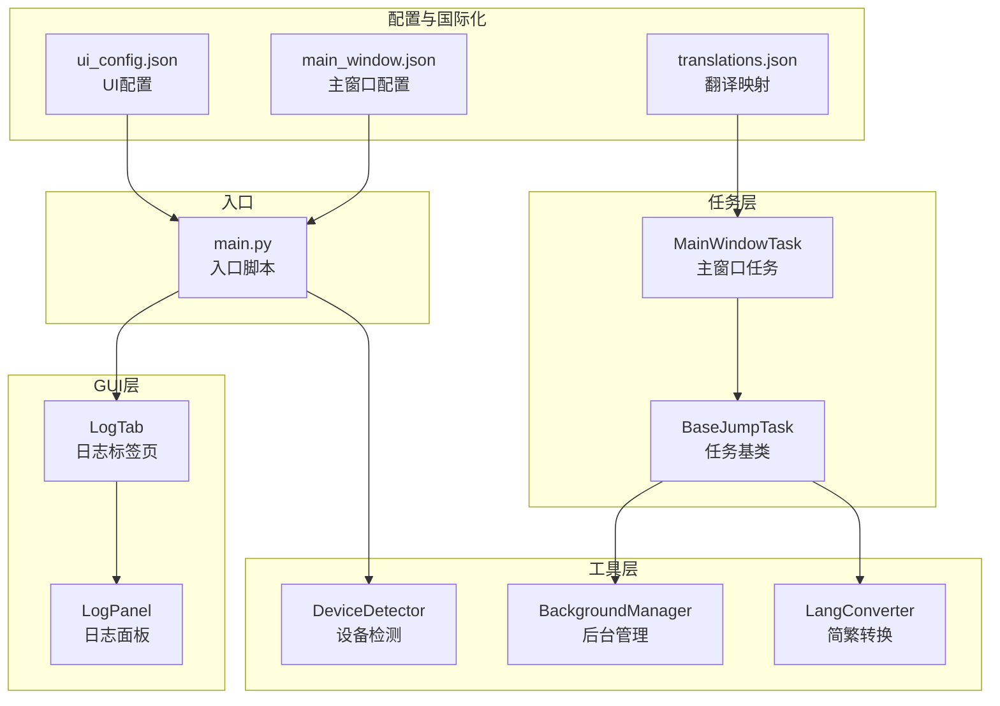
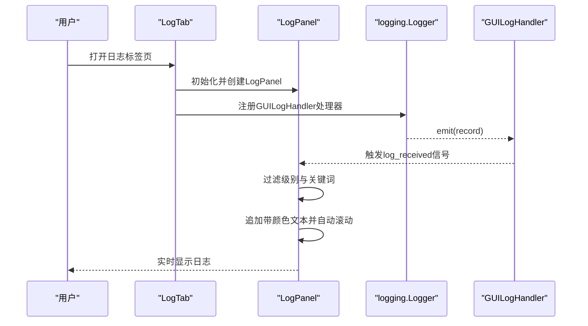
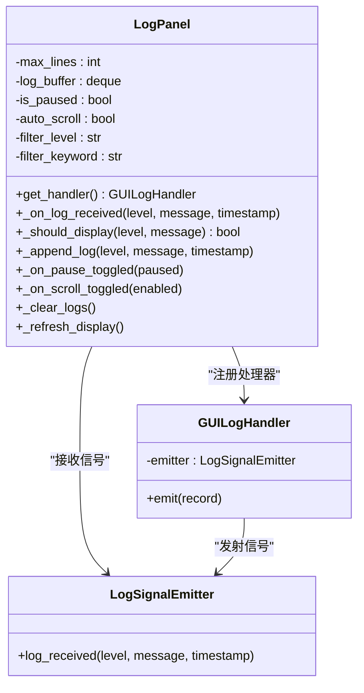
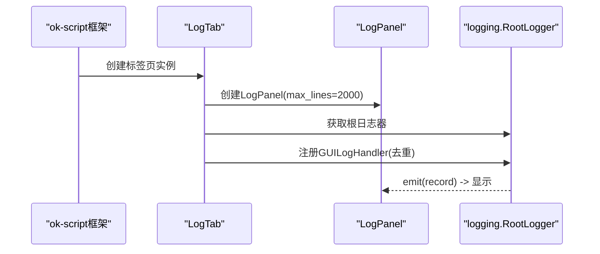
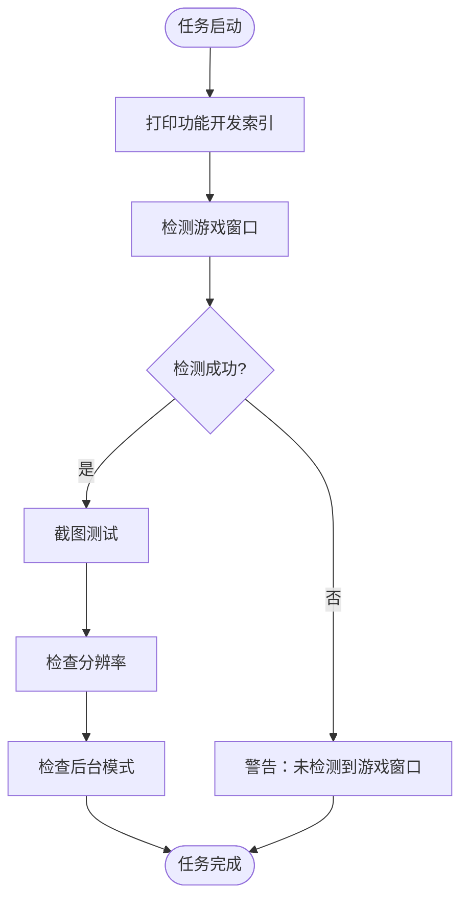
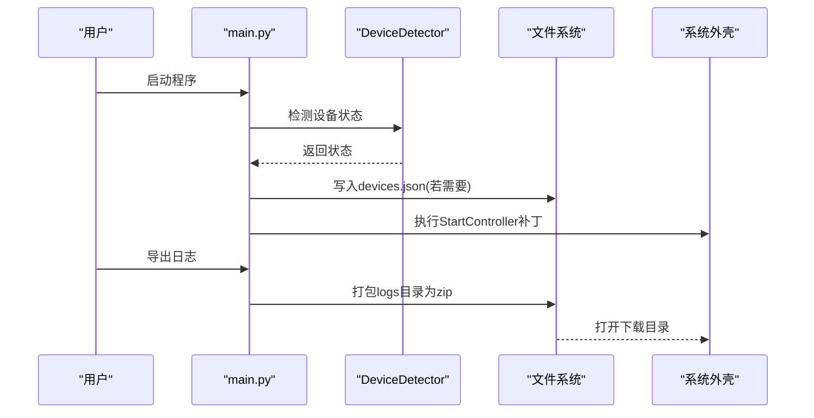
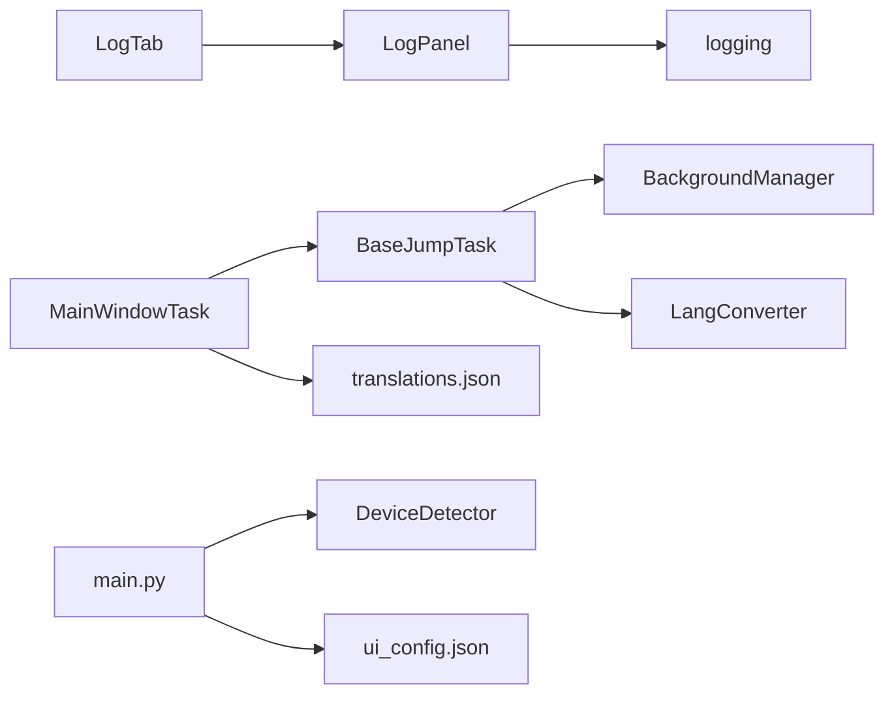

# 图形界面系统

<cite>
**本文引用的文件**
- [src/gui/__init__.py](file://src/gui/__init__.py)
- [src/gui/log_panel.py](file://src/gui/log_panel.py)
- [src/gui/log_tab.py](file://src/gui/log_tab.py)
- [src/task/MainWindowTask.py](file://src/task/MainWindowTask.py)
- [main.py](file://main.py)
- [configs/ui_config.json](file://configs/ui_config.json)
- [configs/main_window.json](file://configs/main_window.json)
- [i18n/zh_CN/translations.json](file://i18n/zh_CN/translations.json)
- [src/utils/LangConverter.py](file://src/utils/LangConverter.py)
- [src/utils/BackgroundManager.py](file://src/utils/BackgroundManager.py)
- [src/utils/DeviceDetector.py](file://src/utils/DeviceDetector.py)
- [src/constants/features.py](file://src/constants/features.py)
- [src/task/BaseJumpTask.py](file://src/task/BaseJumpTask.py)
</cite>

## 目录
1. [简介](#简介)
2. [项目结构](#项目结构)
3. [核心组件](#核心组件)
4. [架构总览](#架构总览)
5. [详细组件分析](#详细组件分析)
6. [依赖分析](#依赖分析)
7. [性能考虑](#性能考虑)
8. [故障排查指南](#故障排查指南)
9. [结论](#结论)
10. [附录](#附录)

## 简介
本文件面向OK-Jump的图形界面系统，聚焦于GUI组件的设计与实现，涵盖日志面板与日志标签页的功能（实时日志显示、过滤与导出）、主窗口任务的实现（用户交互、配置管理与状态显示）、国际化支持机制与翻译系统使用、以及GUI组件的自定义与扩展方法。文档同时提供界面布局、事件处理与用户体验优化的实现细节说明。

## 项目结构
OK-Jump的GUI相关代码主要位于src/gui目录，配合任务层(src/task)、工具层(src/utils)与配置层(configs/i18n)共同构成完整的图形界面体系。入口脚本main.py负责初始化框架、设备选择与补丁注入；UI配置文件提供主题、语言与缩放等设置；国际化翻译文件提供任务与功能名称的本地化映射。

**图表来源**
- [src/gui/log_panel.py:58-388](file://src/gui/log_panel.py#L58-L388)
- [src/gui/log_tab.py:15-70](file://src/gui/log_tab.py#L15-L70)
- [src/task/MainWindowTask.py:5-215](file://src/task/MainWindowTask.py#L5-L215)
- [src/task/BaseJumpTask.py:14-200](file://src/task/BaseJumpTask.py#L14-L200)
- [src/utils/BackgroundManager.py:7-155](file://src/utils/BackgroundManager.py#L7-L155)
- [src/utils/DeviceDetector.py:11-149](file://src/utils/DeviceDetector.py#L11-L149)
- [src/utils/LangConverter.py:143-326](file://src/utils/LangConverter.py#L143-L326)
- [configs/ui_config.json:1-17](file://configs/ui_config.json#L1-L17)
- [configs/main_window.json:1-3](file://configs/main_window.json#L1-L3)
- [i18n/zh_CN/translations.json:1-75](file://i18n/zh_CN/translations.json#L1-L75)
- [main.py:99-107](file://main.py#L99-L107)

**章节来源**
- [src/gui/__init__.py:1-9](file://src/gui/__init__.py#L1-L9)
- [configs/ui_config.json:1-17](file://configs/ui_config.json#L1-L17)
- [configs/main_window.json:1-3](file://configs/main_window.json#L1-L3)
- [i18n/zh_CN/translations.json:1-75](file://i18n/zh_CN/translations.json#L1-L75)
- [main.py:99-107](file://main.py#L99-L107)

## 核心组件
- 日志面板(LogPanel)：提供实时日志显示、按级别过滤、关键词搜索、暂停/恢复、自动滚动、清空日志、等宽字体与彩色标记等功能。
- 日志标签页(LogTab)：作为ok-script框架的导航标签页，承载日志面板并注册根日志处理器。
- 主窗口任务(MainWindowTask)：展示功能开发索引、窗口检测、截图测试、分辨率检查、后台模式信息等，输出到日志面板。
- 入口脚本(main.py)：提供日志导出功能、智能设备选择与StartController补丁，初始化OK框架并启动GUI。

**章节来源**
- [src/gui/log_panel.py:58-388](file://src/gui/log_panel.py#L58-L388)
- [src/gui/log_tab.py:15-70](file://src/gui/log_tab.py#L15-L70)
- [src/task/MainWindowTask.py:55-215](file://src/task/MainWindowTask.py#L55-L215)
- [main.py:11-27](file://main.py#L11-L27)

## 架构总览
GUI系统采用“标签页承载面板+日志处理器”的架构：LogTab负责UI布局与日志处理器注册；LogPanel负责日志接收、过滤、渲染与状态显示；MainWindowTask通过logging接口输出信息，经由GUILogHandler进入LogPanel。入口脚本负责设备与UI配置的初始化。

**图表来源**
- [src/gui/log_tab.py:38-66](file://src/gui/log_tab.py#L38-L66)
- [src/gui/log_panel.py:49-114](file://src/gui/log_panel.py#L49-L114)
- [src/gui/log_panel.py:252-351](file://src/gui/log_panel.py#L252-L351)

## 详细组件分析

### 日志面板(LogPanel)
- 设计要点
  - 信号发射器(LogSignalEmitter)与日志处理器(GUILogHandler)解耦日志采集与UI渲染，保证线程安全。
  - 使用deque缓存日志，支持最大行数限制与按级别/关键词过滤。
  - 支持暂停/恢复、自动滚动、清空日志、等宽字体与彩色标记。
  - 自适应UI控件：优先qfluentwidgets，缺失时回退PySide6控件。
- 关键能力
  - 实时显示：接收日志记录后格式化并插入文本框，自动滚动至底部。
  - 过滤与搜索：按DEBUG/INFO/WARNING/ERROR级别过滤，支持关键词大小写无关匹配。
  - 导航与状态：显示日志条数、状态标签与FPS标签（由上层任务可选填充）。
- 用户体验
  - 彩色标记：针对常见游戏场景的emoji标记（🔍、✅、❌、💀、⚔️、👤、🟢、🔴、📊、📷、⚠️）自动高亮对应颜色。
  - 等宽字体：提升日志可读性，避免字符宽度差异导致的对齐问题。
  - 暂停/恢复：避免在调试时频繁刷新影响注意力。
  - 自动滚动：新日志到达时自动滚动到底部，保持关注焦点。

**图表来源**
- [src/gui/log_panel.py:29-114](file://src/gui/log_panel.py#L29-L114)
- [src/gui/log_panel.py:248-388](file://src/gui/log_panel.py#L248-L388)

**章节来源**
- [src/gui/log_panel.py:58-388](file://src/gui/log_panel.py#L58-L388)

### 日志标签页(LogTab)
- 设计要点
  - 符合ok-script框架规范：name/icon/position/add_after_default_tabs等属性定义导航项。
  - 在构造时创建LogPanel并设置objectName，满足qfluentwidgets要求。
  - 注册根日志器的GUILogHandler，避免重复添加，确保所有日志可见。
- 用户交互
  - 作为底部导航标签页，用户可随时切换查看日志。
  - 与LogPanel联动，提供统一的日志入口。

**图表来源**
- [src/gui/log_tab.py:15-70](file://src/gui/log_tab.py#L15-L70)

**章节来源**
- [src/gui/log_tab.py:15-70](file://src/gui/log_tab.py#L15-L70)

### 主窗口任务(MainWindowTask)
- 功能概述
  - 输出功能开发索引（核心功能、游戏功能、MOBA功能、实用工具），包含名称与描述，支持中英文显示。
  - 检测游戏窗口、截图测试、分辨率检查与后台模式信息输出。
  - 提供状态图标（已完成/开发中/计划中）与建议分辨率提示。
- 用户交互与状态显示
  - 通过logger.info/warning/error输出到日志面板，便于用户跟踪任务状态。
  - 后台模式信息包含是否启用后台模式、伪最小化状态、是否静音等。
- 配置管理
  - 读取分辨率与后台模式配置，结合BackgroundManager与ResolutionAdapter输出详细信息。
  - 提供查询与更新功能状态的方法，便于任务间协作。

**图表来源**
- [src/task/MainWindowTask.py:55-215](file://src/task/MainWindowTask.py#L55-L215)
- [src/utils/BackgroundManager.py:82-92](file://src/utils/BackgroundManager.py#L82-L92)

**章节来源**
- [src/task/MainWindowTask.py:55-215](file://src/task/MainWindowTask.py#L55-L215)
- [src/utils/BackgroundManager.py:82-92](file://src/utils/BackgroundManager.py#L82-L92)

### 国际化支持与翻译系统
- 翻译映射
  - translations.json提供任务名称、描述与功能分类的中文映射，用于UI显示与日志输出。
- 任务名称与描述
  - MainWindowTask、AutoLoginTask、AutoTutorialTask、AutoMatchTask、AutoCombatTask、DailyTask等均有对应的name/description键。
- 界面与文案
  - 通过翻译映射实现UI文案本地化，确保不同语言环境下的可读性与一致性。

**章节来源**
- [i18n/zh_CN/translations.json:1-75](file://i18n/zh_CN/translations.json#L1-L75)
- [src/task/MainWindowTask.py:2-5](file://src/task/MainWindowTask.py#L2-L5)

### 入口脚本与导出功能
- 日志导出
  - export_logs函数将logs目录打包为zip并打开下载目录，便于问题排查与分享。
- 智能设备选择
  - smart_device_selection根据PC运行与ADB连接状态自动更新首选设备配置。
- StartController补丁
  - patch_start_controller允许在窗口最小化或移出屏幕时继续运行（需配置skip_pos_check）。

**图表来源**
- [main.py:54-95](file://main.py#L54-L95)
- [main.py:11-27](file://main.py#L11-L27)

**章节来源**
- [main.py:11-27](file://main.py#L11-L27)
- [main.py:54-95](file://main.py#L54-L95)

## 依赖分析
- 组件耦合
  - LogTab强依赖LogPanel；LogPanel依赖logging与Qt控件；MainWindowTask依赖BaseJumpTask与BackgroundManager。
- 外部依赖
  - qfluentwidgets为可选依赖，缺失时回退PySide6控件；OpenCC为LangConverter的可选依赖。
- 配置与国际化
  - ui_config.json控制UI主题、语言与DPI；translations.json提供翻译映射；main_window.json记录版本信息。

**图表来源**
- [src/gui/log_tab.py:12-12](file://src/gui/log_tab.py#L12-L12)
- [src/gui/log_panel.py:7-26](file://src/gui/log_panel.py#L7-L26)
- [src/task/MainWindowTask.py:1-12](file://src/task/MainWindowTask.py#L1-L12)
- [src/utils/BackgroundManager.py:1-17](file://src/utils/BackgroundManager.py#L1-L17)
- [src/utils/LangConverter.py:1-12](file://src/utils/LangConverter.py#L1-L12)
- [main.py:65-95](file://main.py#L65-L95)
- [configs/ui_config.json:1-17](file://configs/ui_config.json#L1-L17)
- [i18n/zh_CN/translations.json:1-75](file://i18n/zh_CN/translations.json#L1-L75)

**章节来源**
- [src/gui/log_tab.py:15-70](file://src/gui/log_tab.py#L15-L70)
- [src/gui/log_panel.py:58-114](file://src/gui/log_panel.py#L58-L114)
- [src/task/MainWindowTask.py:1-12](file://src/task/MainWindowTask.py#L1-L12)
- [src/utils/BackgroundManager.py:1-17](file://src/utils/BackgroundManager.py#L1-L17)
- [src/utils/LangConverter.py:1-12](file://src/utils/LangConverter.py#L1-L12)
- [main.py:65-95](file://main.py#L65-L95)
- [configs/ui_config.json:1-17](file://configs/ui_config.json#L1-L17)
- [i18n/zh_CN/translations.json:1-75](file://i18n/zh_CN/translations.json#L1-L75)

## 性能考虑
- 日志缓冲与渲染
  - 使用deque限制最大行数，避免内存膨胀；按级别与关键词过滤减少无效渲染。
  - 自动滚动仅在启用时触发，降低频繁滚动带来的UI开销。
- 字体与渲染
  - 等宽字体提升可读性但可能增加绘制成本，建议在长日志场景下谨慎开启自动滚动。
- 后台模式
  - 后台模式下建议关闭自动滚动与高频刷新，减少对前台窗口的影响。

[本节为通用指导，无需具体文件分析]

## 故障排查指南
- 日志不显示
  - 确认LogTab已注册GUILogHandler且未重复添加；检查根日志器级别是否低于DEBUG。
- 日志过多导致卡顿
  - 调整max_lines；启用级别过滤与关键词过滤；暂停日志显示后再恢复。
- 后台模式异常
  - 检查后台模式配置与伪最小化设置；必要时启用skip_pos_check补丁。
- 设备选择错误
  - 使用智能设备选择逻辑，确保PC运行与ADB连接状态正确；核对devices.json配置。

**章节来源**
- [src/gui/log_tab.py:47-66](file://src/gui/log_tab.py#L47-L66)
- [src/gui/log_panel.py:248-351](file://src/gui/log_panel.py#L248-L351)
- [src/utils/BackgroundManager.py:82-92](file://src/utils/BackgroundManager.py#L82-L92)
- [main.py:54-95](file://main.py#L54-L95)

## 结论
OK-Jump的图形界面系统以LogPanel为核心，结合LogTab与MainWindowTask，实现了实时日志监控、任务状态展示与用户交互。通过qfluentwidgets的可选集成、简洁的过滤与导出机制，以及完善的后台模式与设备检测支持，系统在易用性与可扩展性方面表现良好。国际化与翻译映射进一步提升了多语言环境下的用户体验。

[本节为总结，无需具体文件分析]

## 附录
- 自定义与扩展方法
  - 扩展日志面板：新增过滤规则、颜色映射或导出格式；在LogTab中调整max_lines与注册策略。
  - 新增标签页：遵循ok-script框架规范，设置name/icon/position等属性，复用LogPanel。
  - 国际化扩展：在translations.json中添加新键值，确保MainWindowTask等任务使用翻译映射。
  - 配置扩展：在ui_config.json中新增主题、语言或DPI设置；在main_window.json中记录版本信息。
- 事件处理与用户体验优化
  - 事件绑定：通过信号槽连接控件事件，避免阻塞主线程；在LogPanel中使用定时器或延迟刷新。
  - 用户体验：提供暂停/恢复、自动滚动开关；在LogTab中预设合理缓冲大小；在MainWindowTask中输出清晰的状态提示与建议。

[本节为通用指导，无需具体文件分析]